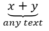

## **ภาพรวม**

PowerPoint เก็บสมการเป็น Office Math Markup Language (OMML). ด้วย Aspose.Slides สำหรับ Node.js ผ่าน Java คุณสามารถสร้างเนื้อหาคณิตศาสตร์แบบเดียวกันโดยเขียนโปรแกรมได้: เศษส่วน, ราก, ฟังก์ชัน, ขีดจำกัด, ตัวดำเนินการ N-ary, เมทริกซ์, อาร์เรย์, และบล็อกคณิตศาสตร์ที่จัดรูปแบบ

ใน PowerPoint ผู้ใช้มักเพิ่มสมการโดยเลือก **Insert > Equation**:


ผลลัพธ์คือข้อความคณิตศาสตร์ที่แก้ไขได้บนสไลด์:


Aspose.Slides สร้างข้อความคณิตศาสตร์นั้นผ่านวัตถุหลักสามรายการ:

- รูปร่างคณิตศาสตร์ที่สร้างด้วย [addMathShape](https://reference.aspose.com/slides/th/nodejs-java/aspose.slides/shapecollection/#addMathShape), เป็นรูปร่างที่บรรจุสมการ.
- [MathPortion](https://reference.aspose.com/slides/th/nodejs-java/aspose.slides/mathportion/) เก็บเนื้อหาคณิตศาสตร์ภายในกรอบข้อความของรูปร่าง.
- [MathParagraph](https://reference.aspose.com/slides/th/nodejs-java/aspose.slides/mathparagraph/) มีหนึ่งหรือหลายอ็อบเจ็กต์ [MathBlock](https://reference.aspose.com/slides/th/nodejs-java/aspose.slides/mathblock/).

ตัวอย่างส่วนใหญ่ด้านล่างใช้ [MathematicalText](https://reference.aspose.com/slides/th/nodejs-java/aspose.slides/mathematicaltext/) และเมธอดเชิงไหลจาก [MathElementBase](https://reference.aspose.com/slides/th/nodejs-java/aspose.slides/mathelementbase/) เพื่อทำให้โค้ดสั้นและอ่านง่าย.

สำหรับสถานการณ์การส่งออก MathML ดูที่ [Export Math Equations from Presentations in Node.js via Java](/slides/th/nodejs-java/exporting-math-equations/).

## **สร้างสมการ**

ตัวอย่างนี้สร้างรูปร่างคณิตศาสตร์และเพิ่มทฤษฎีพีธากอรัส:


```javascript
let presentation = new aspose.slides.Presentation();
try {
    let slide = presentation.getSlides().get_Item(0);

    let mathShape = slide.getShapes().addMathShape(20, 20, 700, 120);
    let mathParagraph = mathShape.getTextFrame().getParagraphs()
            .get_Item(0).getPortions().get_Item(0).getMathParagraph();

    let equation = new aspose.slides.MathematicalText("c")
            .setSuperscript("2")
            .join("=")
            .join(new aspose.slides.MathematicalText("a").setSuperscript("2"))
            .join("+")
            .join(new aspose.slides.MathematicalText("b").setSuperscript("2"));

    mathParagraph.add(equation);

    presentation.save("pythagorean-theorem.pptx", aspose.slides.SaveFormat.Pptx);
} finally {
    presentation.dispose();
}
```

{}
`addMathShape` สร้างรูปร่างที่มี MathParagraph อยู่แล้ว. เข้าถึง `MathPortion` แรก, รับ `MathParagraph` ของมัน, และเพิ่ม MathBlock หรือ MathElement เข้าไป.
{}

## **เพิ่มเศษส่วน**

ใช้ [`divide`](https://reference.aspose.com/slides/th/nodejs-java/aspose.slides/mathelementbase/) เพื่อสร้างเศษส่วน. คุณสามารถเลือกสไตล์ของเศษส่วนได้ด้วย [MathFractionTypes](https://reference.aspose.com/slides/th/nodejs-java/aspose.slides/mathfractiontypes/).


```javascript
let presentation = new aspose.slides.Presentation();
try {
    let slide = presentation.getSlides().get_Item(0);

    let mathShape = slide.getShapes().addMathShape(20, 20, 700, 100);
    let mathParagraph = mathShape.getTextFrame().getParagraphs()
            .get_Item(0).getPortions().get_Item(0).getMathParagraph();

    let fraction = new aspose.slides.MathematicalText("1")
            .divide("x", aspose.slides.MathFractionTypes.Skewed);

    mathParagraph.add(new aspose.slides.MathBlock(fraction));

    presentation.save("fraction.pptx", aspose.slides.SaveFormat.Pptx);
} finally {
    presentation.dispose();
}
```

สำหรับเศษส่วนแบบซ้อน, ใช้ `MathFractionTypes.Bar`:

```javascript
let stackedFraction = new aspose.slides.MathematicalText("x + 1").divide("y - 1", aspose.slides.MathFractionTypes.Bar);
```

## **เพิ่มราก**

ใช้ [`radical`](https://reference.aspose.com/slides/th/nodejs-java/aspose.slides/mathelementbase/) เพื่อสร้างรากกำลังสอง, รากกำลังสาม หรือรากอื่นๆ. อิลิเมนต์ปัจจุบันจะกลายเป็นฐาน, และอาร์กิวเมนต์จะเป็นดีกรี.


```javascript
let presentation = new aspose.slides.Presentation();
try {
    let slide = presentation.getSlides().get_Item(0);

    let mathShape = slide.getShapes().addMathShape(20, 20, 700, 100);
    let mathParagraph = mathShape.getTextFrame().getParagraphs()
            .get_Item(0).getPortions().get_Item(0).getMathParagraph();

    let radical = new aspose.slides.MathematicalText("x")
            .radical("n");

    mathParagraph.add(new aspose.slides.MathBlock(radical));

    presentation.save("radical.pptx", aspose.slides.SaveFormat.Pptx);
} finally {
    presentation.dispose();
}
```

## **เพิ่มฟังก์ชันและขีดจำกัด**

ใช้ [`asArgumentOfFunction`](https://reference.aspose.com/slides/th/nodejs-java/aspose.slides/mathelementbase/) หรือ [`function`](https://reference.aspose.com/slides/th/nodejs-java/aspose.slides/mathelementbase/) สำหรับฟังก์ชันเช่น `sin(x)`, `log(x)`, หรือชื่อฟังก์ชันที่กำหนดเอง. สำหรับขีดจำกัด, ใส่ `lim` ใน [MathLimit](https://reference.aspose.com/slides/th/nodejs-java/aspose.slides/mathlimit/) หรือใช้ [`setLowerLimit`](https://reference.aspose.com/slides/th/nodejs-java/aspose.slides/mathelementbase/).


```javascript
let presentation = new aspose.slides.Presentation();
try {
    let slide = presentation.getSlides().get_Item(0);

    let mathShape = slide.getShapes().addMathShape(20, 20, 700, 100);
    let mathParagraph = mathShape.getTextFrame().getParagraphs()
            .get_Item(0).getPortions().get_Item(0).getMathParagraph();

    let limit = new aspose.slides.MathematicalText("lim")
            .setLowerLimit("x\u2192\u221E")
            .function("x");

    mathParagraph.add(new aspose.slides.MathBlock(limit));

    presentation.save("functions-and-limits.pptx", aspose.slides.SaveFormat.Pptx);
} finally {
    presentation.dispose();
}
```

สำหรับชื่อฟังก์ชันที่กำหนดเอง, ให้ชื่อฟังก์ชันเป็นอิลิเมนต์ปัจจุบัน:

```javascript
let customFunction = new aspose.slides.MathematicalText("f").function("x + 1");
```

## **เพิ่มตัวดำเนินการ N-ary และอินทิกรัล**

ใช้ [`nary`](https://reference.aspose.com/slides/th/nodejs-java/aspose.slides/mathelementbase/) สำหรับการบวก, ยูเนียน, อินเทอร์เซคชัน, และตัวดำเนินการขนาดใหญ่อื่นๆ. ใช้ [`integral`](https://reference.aspose.com/slides/th/nodejs-java/aspose.slides/mathelementbase/) สำหรับอินทิกรัล. ทั้งสองเมธอดให้คุณตั้งค่าขีดจำกัดล่างและบน.


```javascript
let presentation = new aspose.slides.Presentation();
try {
    let slide = presentation.getSlides().get_Item(0);

    let mathShape = slide.getShapes().addMathShape(20, 20, 700, 120);
    let mathParagraph = mathShape.getTextFrame().getParagraphs()
            .get_Item(0).getPortions().get_Item(0).getMathParagraph();

    let summationBase = new aspose.slides.MathematicalText("x")
            .setSuperscript("k")
            .join(new aspose.slides.MathematicalText("a").setSuperscript("n-k"));

    let summation = summationBase.nary(aspose.slides.MathNaryOperatorTypes.Summation, "k=0", "n");

    mathParagraph.add(new aspose.slides.MathBlock(summation));

    presentation.save("nary-operators.pptx", aspose.slides.SaveFormat.Pptx);
} finally {
    presentation.dispose();
}
```

ตัวดำเนินการ N-ary ใช้สำหรับตัวดำเนินการขนาดใหญ่ที่มีขีดจำกัดเป็นตัวเลือก. ตัวดำเนินการง่ายเช่น `+`, `-`, และ `=` ปกติจะถูกเพิ่มเป็น `MathematicalText` และต่อเข้าด้วยกันในนิพจน์.

สำหรับอินทิกรัล, ใช้ `integral`:

```javascript
let integralBase = new aspose.slides.MathematicalText("x").join(new aspose.slides.MathematicalText("dx").toBox());
let integral = integralBase.integral(aspose.slides.MathIntegralTypes.Simple, "0", "1");
```

## **เพิ่มเมทริกซ์**

ใช้ [MathMatrix](https://reference.aspose.com/slides/th/nodejs-java/aspose.slides/mathmatrix/) สำหรับแถวและคอลัมน์. เมทริกซ์โดยค่าเริ่มต้นไม่มีวงเล็บแบบใดแบบหนึ่ง, ดังนั้นให้ใส่เมทริกซ์ในวงเล็บ, กรอบ, หรือเครื่องหมายปีกกาเมื่อจำเป็น.


```javascript
let presentation = new aspose.slides.Presentation();
try {
    let slide = presentation.getSlides().get_Item(0);

    let mathShape = slide.getShapes().addMathShape(20, 20, 700, 120);
    let mathParagraph = mathShape.getTextFrame().getParagraphs()
            .get_Item(0).getPortions().get_Item(0).getMathParagraph();

    let matrix = new aspose.slides.MathMatrix(2, 3);
    matrix.set_Item(0, 0, new aspose.slides.MathematicalText("1"));
    matrix.set_Item(0, 1, new aspose.slides.MathematicalText("x"));
    matrix.set_Item(1, 0, new aspose.slides.MathematicalText("x"));
    matrix.set_Item(1, 1, new aspose.slides.MathematicalText("2"));
    matrix.set_Item(1, 2, new aspose.slides.MathematicalText("y"));

    mathParagraph.add(new aspose.slides.MathBlock(matrix));

    presentation.save("matrix.pptx", aspose.slides.SaveFormat.Pptx);
} finally {
    presentation.dispose();
}
```

## **เพิ่มอาเรย์สมการ**

ใช้ [`toMathArray`](https://reference.aspose.com/slides/th/nodejs-java/aspose.slides/mathelementbase/) เมื่อคุณต้องการสมการเรียงต่อกันหรือสแต็กแนวตั้งของนิพจน์.


```javascript
let presentation = new aspose.slides.Presentation();
try {
    let slide = presentation.getSlides().get_Item(0);

    let mathShape = slide.getShapes().addMathShape(20, 20, 700, 140);
    let mathParagraph = mathShape.getTextFrame().getParagraphs()
            .get_Item(0).getPortions().get_Item(0).getMathParagraph();

    let equationArray = new aspose.slides.MathematicalText("x")
            .join("y")
            .toMathArray();

    mathParagraph.add(new aspose.slides.MathBlock(equationArray));

    presentation.save("equation-array.pptx", aspose.slides.SaveFormat.Pptx);
} finally {
    presentation.dispose();
}
```

## **เพิ่มฟังก์ชันตรีโกณมิติ**

ใช้ [`asArgumentOfFunction`](https://reference.aspose.com/slides/th/nodejs-java/aspose.slides/mathelementbase/) เมื่ออาร์กิวเมนต์เป็นอิลิเมนต์ปัจจุบันและชื่อฟังก์ชันทราบ.


```javascript
let presentation = new aspose.slides.Presentation();
try {
    let slide = presentation.getSlides().get_Item(0);

    let mathShape = slide.getShapes().addMathShape(20, 20, 700, 100);
    let mathParagraph = mathShape.getTextFrame().getParagraphs()
            .get_Item(0).getPortions().get_Item(0).getMathParagraph();

    let cosine = new aspose.slides.MathematicalText("2x")
            .asArgumentOfFunction(aspose.slides.MathFunctionsOfOneArgument.Cos);

    mathParagraph.add(new aspose.slides.MathBlock(cosine));

    presentation.save("trigonometric-function.pptx", aspose.slides.SaveFormat.Pptx);
} finally {
    presentation.dispose();
}
```

## **เพิ่มตัวล่างและตัวบน**

ใช้ตัวช่วยสำหรับตัวล่างและตัวบนสำหรับดัชนีและพลัง. เมื่อดัชนีต้องแสดงทางด้านซ้ายของฐาน, ใช้ [`setSubSuperscriptOnTheLeft`](https://reference.aspose.com/slides/th/nodejs-java/aspose.slides/mathelementbase/).


```javascript
let presentation = new aspose.slides.Presentation();
try {
    let slide = presentation.getSlides().get_Item(0);

    let mathShape = slide.getShapes().addMathShape(20, 20, 700, 100);
    let mathParagraph = mathShape.getTextFrame().getParagraphs()
            .get_Item(0).getPortions().get_Item(0).getMathParagraph();

    let scripts = new aspose.slides.MathematicalText("Y")
            .setSubSuperscriptOnTheLeft("1", "n");

    mathParagraph.add(new aspose.slides.MathBlock(scripts));

    presentation.save("subscript-superscript.pptx", aspose.slides.SaveFormat.Pptx);
} finally {
    presentation.dispose();
}
```

## **เพิ่มตัวคั่น**

ใช้ [`enclose`](https://reference.aspose.com/slides/th/nodejs-java/aspose.slides/mathelementbase/) เพื่อใส่นิพจน์ภายในตัวคั่น. คุณยังสามารถกำหนดอักขระคั่นสำหรับนิพจน์ที่มีหลายอิลิเมนต์ได้.


```javascript
let presentation = new aspose.slides.Presentation();
try {
    let slide = presentation.getSlides().get_Item(0);

    let mathShape = slide.getShapes().addMathShape(20, 20, 700, 100);
    let mathParagraph = mathShape.getTextFrame().getParagraphs()
            .get_Item(0).getPortions().get_Item(0).getMathParagraph();

    let delimiter = new aspose.slides.MathematicalText("x")
            .join("y")
            .join("z")
            .enclose(java.newChar('<'), java.newChar('>'));
    delimiter.setSeparatorCharacter(java.newChar('|'));

    mathParagraph.add(new aspose.slides.MathBlock(delimiter));

    presentation.save("delimiters.pptx", aspose.slides.SaveFormat.Pptx);
} finally {
    presentation.dispose();
}
```

## **เพิ่มกล่องขอบ**

ใช้ [`toBorderBox`](https://reference.aspose.com/slides/th/nodejs-java/aspose.slides/mathelementbase/) เมื่อสมการควรอยู่ในกรอบ.


```javascript
let presentation = new aspose.slides.Presentation();
try {
    let slide = presentation.getSlides().get_Item(0);

    let mathShape = slide.getShapes().addMathShape(20, 20, 700, 100);
    let mathParagraph = mathShape.getTextFrame().getParagraphs()
            .get_Item(0).getPortions().get_Item(0).getMathParagraph();

    let boxedEquation = new aspose.slides.MathematicalText("a")
            .setSuperscript("2")
            .join("=")
            .join(new aspose.slides.MathematicalText("b").setSuperscript("2"))
            .join("+")
            .join(new aspose.slides.MathematicalText("c").setSuperscript("2"))
            .toBorderBox();

    mathParagraph.add(new aspose.slides.MathBlock(boxedEquation));

    presentation.save("border-box.pptx", aspose.slides.SaveFormat.Pptx);
} finally {
    presentation.dispose();
}
```

## **จัดกลุ่มเทอม**

ใช้ [`group`](https://reference.aspose.com/slides/th/nodejs-java/aspose.slides/mathelementbase/) เพื่อวางอักขระจัดกลุ่มเหนือหรือใต้นิพจน์. เพิ่มขีดจำกัดเพื่อทำป้ายให้เทอมที่จัดกลุ่ม.



```javascript
let presentation = new aspose.slides.Presentation();
try {
    let slide = presentation.getSlides().get_Item(0);

    let mathShape = slide.getShapes().addMathShape(20, 20, 700, 120);
    let mathParagraph = mathShape.getTextFrame().getParagraphs()
            .get_Item(0).getPortions().get_Item(0).getMathParagraph();

    let grouped = new aspose.slides.MathematicalText("x + y")
            .group(java.newChar('\u23DF'), aspose.slides.MathTopBotPositions.Bottom, aspose.slides.MathTopBotPositions.Top)
            .setLowerLimit("any text");

    mathParagraph.add(new aspose.slides.MathBlock(grouped));

    presentation.save("grouped-terms.pptx", aspose.slides.SaveFormat.Pptx);
} finally {
    presentation.dispose();
}
```

## **จัดรูปแบบอิลิเมนต์คณิตศาสตร์**

ใช้ตัวช่วยจัดรูปแบบเฉพาะที่ทำให้สูตรชัดเจน. ตัวอย่างเช่น, [`overbar`](https://reference.aspose.com/slides/th/nodejs-java/aspose.slides/mathelementbase/) จะวางบาร์เหนืออิลิเมนต์คณิตศาสตร์.


```javascript
let presentation = new aspose.slides.Presentation();
try {
    let slide = presentation.getSlides().get_Item(0);

    let mathShape = slide.getShapes().addMathShape(20, 20, 700, 100);
    let mathParagraph = mathShape.getTextFrame().getParagraphs()
            .get_Item(0).getPortions().get_Item(0).getMathParagraph();

    let overbar = new aspose.slides.MathematicalText("ABC").overbar();

    mathParagraph.add(new aspose.slides.MathBlock(overbar));

    presentation.save("overbar.pptx", aspose.slides.SaveFormat.Pptx);
} finally {
    presentation.dispose();
}
```

## **อ้างอิงด่วน**

| งาน | API หลัก |
| --- | --- |
| สร้างข้อความคณิตศาสตร์ | [MathematicalText](https://reference.aspose.com/slides/th/nodejs-java/aspose.slides/mathematicaltext/) |
| รวมอิลิเมนต์ | [join](https://reference.aspose.com/slides/th/nodejs-java/aspose.slides/mathelementbase/) |
| สร้างเศษส่วน | [divide](https://reference.aspose.com/slides/th/nodejs-java/aspose.slides/mathelementbase/) |
| เพิ่มตัวบนหรือทับล่าง | [setSuperscript](https://reference.aspose.com/slides/th/nodejs-java/aspose.slides/mathelementbase/), [setSubscript](https://reference.aspose.com/slides/th/nodejs-java/aspose.slides/mathelementbase/) |
| เพิ่มฟังก์ชัน | [function](https://reference.aspose.com/slides/th/nodejs-java/aspose.slides/mathelementbase/), [asArgumentOfFunction](https://reference.aspose.com/slides/th/nodejs-java/aspose.slides/mathelementbase/) |
| เพิ่มราก | [radical](https://reference.aspose.com/slides/th/nodejs-java/aspose.slides/mathelementbase/) |
| เพิ่มขีดจำกัด | [setLowerLimit](https://reference.aspose.com/slides/th/nodejs-java/aspose.slides/mathelementbase/), [setUpperLimit](https://reference.aspose.com/slides/th/nodejs-java/aspose.slides/mathelementbase/) |
| เพิ่มสคริปท์ด้านซ้าย | [setSubSuperscriptOnTheLeft](https://reference.aspose.com/slides/th/nodejs-java/aspose.slides/mathelementbase/) |
| เพิ่มการรวมและอินทิกรัล | [nary](https://reference.aspose.com/slides/th/nodejs-java/aspose.slides/mathelementbase/), [integral](https://reference.aspose.com/slides/th/nodejs-java/aspose.slides/mathelementbase/) |
| เพิ่มเมทริกซ์ | [MathMatrix](https://reference.aspose.com/slides/th/nodejs-java/aspose.slides/mathmatrix/) |
| เพิ่มอาเรย์สมการ | [toMathArray](https://reference.aspose.com/slides/th/nodejs-java/aspose.slides/mathelementbase/) |
| เพิ่มตัวคั่น | [enclose](https://reference.aspose.com/slides/th/nodejs-java/aspose.slides/mathelementbase/) |
| เพิ่มบาร์และขอบ | [overbar](https://reference.aspose.com/slides/th/nodejs-java/aspose.slides/mathelementbase/), [toBorderBox](https://reference.aspose.com/slides/th/nodejs-java/aspose.slides/mathelementbase/) |
| จัดกลุ่มเทอม | [group](https://reference.aspose.com/slides/th/nodejs-java/aspose.slides/mathelementbase/) |

## **คำถามที่พบบ่อย**

**ฉันสามารถแก้ไขสมการ PowerPoint ที่มีอยู่ได้หรือไม่?**

ได้. เปิดงานนำเสนอ, หารูปร่างที่บรรจุ `MathPortion`, รับ `MathParagraph` ของมัน, และอัปเดต MathBlock ในพารากราฟนั้น.

**สมการถูกบันทึกเป็นคณิตศาสตร์ PowerPoint ที่แก้ไขได้หรือไม่?**

ได้. เมื่อคุณบันทึกเป็น PPTX, Aspose.Slides จะเขียนสมการเป็นเนื้อหา Office Math ที่แก้ไขได้.

**ฉันสามารถส่งออกสมการเป็น LaTeX ได้หรือไม่?**

Aspose.Slides ส่งออกสมการคณิตศาสตร์เป็น MathML. หากคุณต้องการ LaTeX, ให้ส่งออกเป็น MathML ก่อนแล้วแปลง MathML ด้วยเครื่องมือที่สนับสนุนรูปแบบ LaTeX ที่คุณต้องการ.