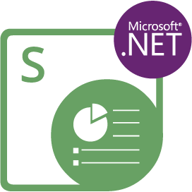

{}

**ยินดีต้อนรับสู่ Aspose.Slides for Node.js via .NET**

Aspose.Slides for Node.js via .NET เป็นไลบรารีคลาสที่ช่วยให้แอปพลิเคชันของคุณอ่านและเขียนเอกสาร PowerPoint® โดยไม่ต้องใช้ Microsoft PowerPoint®.

Aspose.Slides for Node.js via .NET เป็นคอมโพเนนต์แรกและเดียวที่ให้ความสามารถในการจัดการเอกสาร PowerPoint®.

Aspose.Slides for Node.js via .NET มีคุณสมบัติหลักหลายประการ เช่น การจัดการข้อความ, รูปร่าง, ตารางและแอนิเมชัน, การเพิ่มเสียงและวิดีโอลงในสไลด์, การแสดงตัวอย่างสไลด์, การส่งออกสไลด์เป็น SVG, PDF และอื่น ๆ อีกมากมาย.

{}

## แหล่งข้อมูล Aspose.Slides for Node.js via .NET

{}

Aspose.Slides for Node.js via .NET ได้รับการพอร์ตจาก Aspose.Slides for .NET ดังนั้นคุณจึงสามารถใช้เอกสารและอ้างอิง API ของเวอร์ชันนั้นได้.

{}

นี่คือรายการลิงก์ไปยังแหล่งข้อมูลที่เป็นประโยชน์:

- [เอกสารออนไลน์ Aspose.Slides for Node.js via .NET](/slides/th/net/developer-guide/)
- [คุณสมบัติของ Aspose.Slides for Node.js via .NET](/slides/th/nodejs-net/features-overview/)
- [ข้อจำกัดและความแตกต่างของ API ของ Aspose.Slides for Node.js via .NET](/slides/th/nodejs-net/limitations-and-api-differences/)
- [บันทึกประจำรุ่น Aspose.Slides for Node.js via .NET](https://releases.aspose.com/slides/th/nodejs-net/release-notes/)
- [หน้าผลิตภัณฑ์ Aspose.Slides for Node.js via .NET](https://products.aspose.com/slides/th/nodejs-net/)
- [ดาวน์โหลดแพ็กเกจ Aspose.Slides for Node.js via .NET](https://releases.aspose.com/slides/th/nodejs-net/)
- [การติดตั้ง Aspose.Slides for Node.js via .NET](/slides/th/nodejs-net/installation/)
- [อ้างอิง API ของ Aspose.Slides for Node.js via .NET](https://reference.aspose.com/slides/th/nodejs-net/)
- [ฟอรั่มสนับสนุนฟรีของ Aspose.Slides for Node.js via .NET](https://forum.aspose.com/c/slides/th/11)
- [ศูนย์ช่วยเหลือสนับสนุนแบบชำระเงินของ Aspose.Slides for Node.js via .NET](https://helpdesk.aspose.com/)