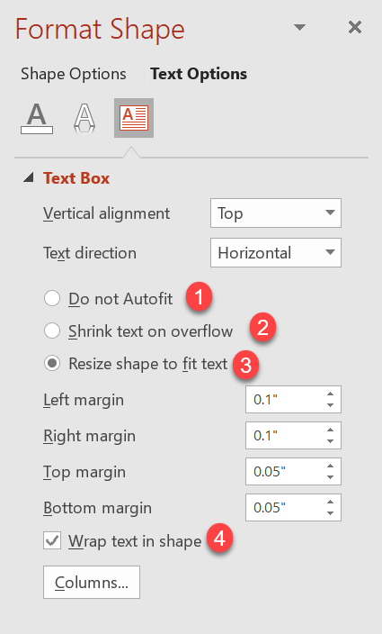

## **บทนำ**

โดยค่าเริ่มต้น เมื่อคุณเพิ่มกล่องข้อความ Microsoft PowerPoint จะใช้การตั้งค่า **Resize shape to fix text** สำหรับกล่องข้อความ — มันจะปรับขนาดกล่องข้อความโดยอัตโนมัติเพื่อให้ข้อความอยู่ในกรอบเสมอ  


* เมื่อข้อความในกล่องข้อความยาวหรือใหญ่ขึ้น PowerPoint จะขยายกล่องข้อความโดยเพิ่มความสูงเพื่อให้บรรจุข้อความได้มากขึ้น  
* เมื่อข้อความในกล่องข้อความสั้นหรือเล็กลง PowerPoint จะลดขนาดกล่องข้อความโดยลดความสูงเพื่อลบช่องว่างที่ไม่จำเป็นออก  

ใน PowerPoint มีพารามิเตอร์หรือ 옵션สำคัญ 4 รายการที่ควบคุมพฤติกรรม autofit สำหรับกล่องข้อความ:

* **Do not Autofit**
* **Shrink text on overflow**
* **Resize shape to fit text**
* **Wrap text in shape.**



Aspose.Slides for PHP via Java มีตัวเลือกคล้ายกัน — บางคุณสมบัติภายใต้คลาส [TextFrameFormat](https://reference.aspose.com/slides/th/php-java/aspose.slides/TextFrameFormat) — ที่ให้คุณควบคุมพฤติกรรม autofit สำหรับกล่องข้อความในงานนำเสนอ

## **Resize a Shape to Fit Text**

หากคุณต้องการให้ข้อความในกล่องเสมอภาคกับขนาดของกล่องหลังจากมีการเปลี่ยนแปลงข้อความ คุณต้องใช้ตัวเลือก **Resize shape to fix text** เพื่อระบุการตั้งค่านี้ ให้ตั้งค่าคุณสมบัติ [AutofitType](https://reference.aspose.com/slides/th/php-java/aspose.slides/TextFrameFormat#getAutofitType--) (จากคลาส [TextFrameFormat](https://reference.aspose.com/slides/th/php-java/aspose.slides/TextFrameFormat)) เป็น `Shape`


โค้ด PHP ตัวอย่างต่อไปนี้แสดงวิธีระบุว่าข้อความต้องพอดีกับกล่องเสมอในงานนำเสนอ PowerPoint:

```php
  $pres = new Presentation();
  try {
    $slide = $pres->getSlides()->get_Item(0);
    $autoShape = $slide->getShapes()->addAutoShape(ShapeType::Rectangle, 30, 30, 350, 100);
    $portion = new Portion("lorem ipsum...");
    $portion->getPortionFormat()->getFillFormat()->getSolidFillColor()->setColor(java("java.awt.Color")->BLACK);
    $portion->getPortionFormat()->getFillFormat()->setFillType(FillType::Solid);
    $autoShape->getTextFrame()->getParagraphs()->get_Item(0)->getPortions()->add($portion);
    $textFrameFormat = $autoShape->getTextFrame()->getTextFrameFormat();
    $textFrameFormat::setAutofitType(TextAutofitType::Shape);
    $pres->save("Output-presentation.pptx", SaveFormat::Pptx);
  } finally {
    if (!java_is_null($pres)) {
      $pres->dispose();
    }
  }
```

หากข้อความยาวหรือใหญ่ขึ้น กล่องข้อความจะถูกปรับขนาดโดยอัตโนมัติ (เพิ่มความสูง) เพื่อให้ข้อความทั้งหมดพอดี หากข้อความสั้นลง จะเกิดการทำตรงข้าม

## **Do Not Autofit**

หากคุณต้องการให้กล่องข้อความหรือรูปร่างคงขนาดเดิมไม่ว่าเนื้อความจะเปลี่ยนแปลงอย่างไร คุณต้องใช้ตัวเลือก **Do not Autofit** เพื่อระบุการตั้งค่านี้ ให้ตั้งค่าคุณสมบัติ [AutofitType](https://reference.aspose.com/slides/th/php-java/aspose.slides/TextFrameFormat#getAutofitType--) (จากคลาส [TextFrameFormat](https://reference.aspose.com/slides/th/php-java/aspose.slides/TextFrameFormat)) เป็น `None`


โค้ด PHP ตัวอย่างต่อไปนี้แสดงวิธีระบุว่ากล่องข้อความต้องคงขนาดเดิมในงานนำเสนอ PowerPoint:

```php
  $pres = new Presentation();
  try {
    $slide = $pres->getSlides()->get_Item(0);
    $autoShape = $slide->getShapes()->addAutoShape(ShapeType::Rectangle, 30, 30, 350, 100);
    $portion = new Portion("lorem ipsum...");
    $portion->getPortionFormat()->getFillFormat()->getSolidFillColor()->setColor(java("java.awt.Color")->BLACK);
    $portion->getPortionFormat()->getFillFormat()->setFillType(FillType::Solid);
    $autoShape->getTextFrame()->getParagraphs()->get_Item(0)->getPortions()->add($portion);
    $textFrameFormat = $autoShape->getTextFrame()->getTextFrameFormat();
    $textFrameFormat::setAutofitType(TextAutofitType::None);
    $pres->save("Output-presentation.pptx", SaveFormat::Pptx);
  } finally {
    if (!java_is_null($pres)) {
      $pres->dispose();
    }
  }
```

เมื่อข้อความยาวเกินขนาดของกล่อง มันจะล้นออกมานอกกล่อง

## **Shrink Text on Overflow**

หากข้อความยาวเกินขนาดของกล่อง คุณสามารถใช้ตัวเลือก **Shrink text on overflow** เพื่อกำหนดให้ขนาดและระยะห่างของข้อความถูกลดลงเพื่อให้พอดีในกล่องนั้นได้ โดยกำหนดคุณสมบัติ [AutofitType](https://reference.aspose.com/slides/th/php-java/aspose.slides/TextFrameFormat#getAutofitType--) (จากคลาส [TextFrameFormat](https://reference.aspose.com/slides/th/php-java/aspose.slides/TextFrameFormat)) เป็น `Normal`


โค้ด PHP ตัวอย่างต่อไปนี้แสดงวิธีระบุว่าข้อความต้องถูกหดลงเมื่อเกิด overflow ในงานนำเสนอ PowerPoint:

```php
  $pres = new Presentation();
  try {
    $slide = $pres->getSlides()->get_Item(0);
    $autoShape = $slide->getShapes()->addAutoShape(ShapeType::Rectangle, 30, 30, 350, 100);
    $portion = new Portion("lorem ipsum...");
    $portion->getPortionFormat()->getFillFormat()->getSolidFillColor()->setColor(java("java.awt.Color")->BLACK);
    $portion->getPortionFormat()->getFillFormat()->setFillType(FillType::Solid);
    $autoShape->getTextFrame()->getParagraphs()->get_Item(0)->getPortions()->add($portion);
    $textFrameFormat = $autoShape->getTextFrame()->getTextFrameFormat();
    $textFrameFormat::setAutofitType(TextAutofitType::Normal);
    $pres->save("Output-presentation.pptx", SaveFormat::Pptx);
  } finally {
    if (!java_is_null($pres)) {
      $pres->dispose();
    }
  }
```

{}
เมื่อใช้ตัวเลือก **Shrink text on overflow** การตั้งค่านี้จะถูกนำไปใช้เฉพาะเมื่อข้อความยาวเกินขนาดของกล่องเท่านั้น  
{}

## **Wrap Text**

หากคุณต้องการให้ข้อความในรูปร่างห่อหุ้มภายในรูปร่างเมื่อข้อความเกินขอบ (ความกว้างเท่านั้น) คุณต้องใช้พารามิเตอร์ **Wrap text in shape** เพื่อระบุการตั้งค่านี้ ให้ตั้งค่าคุณสมบัติ [WrapText](https://reference.aspose.com/slides/th/php-java/aspose.slides/TextFrameFormat#getWrapText--) (จากคลาส [TextFrameFormat](https://reference.aspose.com/slides/th/php-java/aspose.slides/TextFrameFormat)) เป็น `true`

โค้ด PHP ตัวอย่างต่อไปนี้แสดงวิธีใช้การตั้งค่า Wrap Text ในงานนำเสนอ PowerPoint:

```php
  $pres = new Presentation();
  try {
    $slide = $pres->getSlides()->get_Item(0);
    $autoShape = $slide->getShapes()->addAutoShape(ShapeType::Rectangle, 30, 30, 350, 100);
    $portion = new Portion("lorem ipsum...");
    $portion->getPortionFormat()->getFillFormat()->getSolidFillColor()->setColor(java("java.awt.Color")->BLACK);
    $portion->getPortionFormat()->getFillFormat()->setFillType(FillType::Solid);
    $autoShape->getTextFrame()->getParagraphs()->get_Item(0)->getPortions()->add($portion);
    $textFrameFormat = $autoShape->getTextFrame()->getTextFrameFormat();
    $textFrameFormat::setWrapText(NullableBool::True);
    $pres->save("Output-presentation.pptx", SaveFormat::Pptx);
  } finally {
    if (!java_is_null($pres)) {
      $pres->dispose();
    }
  }
```

{} 
หากคุณตั้งค่าคุณสมบัติ `WrapText` เป็น `False` สำหรับรูปร่าง เมื่อข้อความในรูปร่างยาวเกินความกว้างของรูปร่าง ข้อความจะขยายออกไปนอกขอบของรูปร่างในบรรทัดเดียว  
{}

## **FAQ**

**Do the text frame’s internal margins affect AutoFit?**

ใช่ — Padding (ระยะขอบภายใน) ลดพื้นที่ใช้ได้สำหรับข้อความ ทำให้ AutoFit เริ่มทำงานเร็วขึ้นโดยลดฟอนต์หรือปรับขนาดรูปร่างเร็วขึ้น ตรวจสอบและปรับระยะขอบก่อนทำการปรับ AutoFit

**How does AutoFit interact with manual and soft line breaks?**

การบังคับขึ้นบรรทัดใหม่จะคงอยู่ และ AutoFit จะปรับขนาดฟอนต์และระยะห่างรอบ ๆ บรรทัดเหล่านั้น การลบบรรทัดที่ไม่จำเป็นมักทำให้ AutoFit ไม่ต้องหดข้อความอย่างรุนแรง

**Does changing the theme font or triggering font substitution affect AutoFit results?**

ใช่ — การแทนที่ฟอนต์ด้วยฟอนต์ที่มีเมตริกต่างกันจะเปลี่ยนความกว้าง/ความสูงของข้อความ ซึ่งอาจทำให้ขนาดฟอนต์สุดท้ายและการห่อบรรทัดเปลี่ยนแปลง หลังจากเปลี่ยนฟอนต์หรือทำการแทนที่ใด ๆ ควรตรวจสอบสไลด์อีกครั้ง