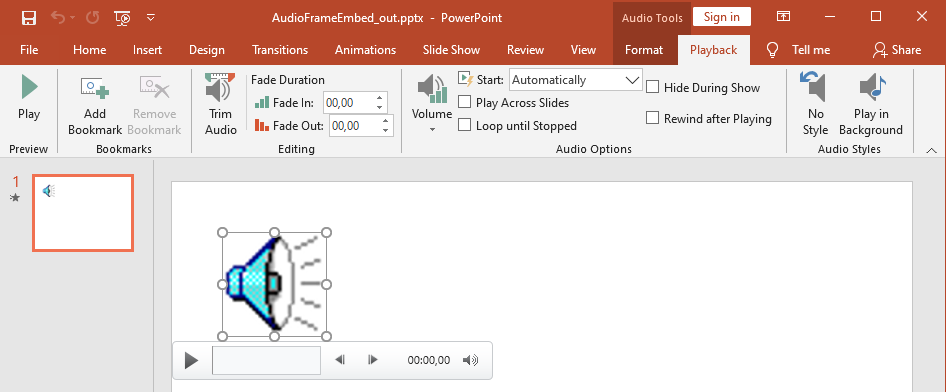

## **ภาพรวม**

บทความนี้อธิบายวิธีการทำงานกับเฟรมเสียงใน Aspose.Slides แสดงวิธีเพิ่มเสียงฝังลงในสไลด์ ปรับแต่งภาพย่อของเฟรมเสียง กำหนดค่าตัวเลือกการเล่นเช่นระดับเสียง การทำซ้ำ การซ่อน การตัดและระยะเวลาการจาง และสกัดเสียงที่ใช้ในการเปลี่ยนสไลด์โชว์

## **สร้างเฟรมเสียง**

Aspose.Slides for Python via Java ช่วยให้คุณสามารถเพิ่มไฟล์เสียงลงในสไลด์ได้ ไฟล์เสียงจะฝังอยู่ในสไลด์เป็นเฟรมเสียง  

1. สร้างอินสแตนซ์ของคลาส [Presentation](https://reference.aspose.com/slides/th/python-java/aspose.slides/presentation/)  
2. รับอ้างอิงถึงสไลด์ตามดัชนีของมัน  
3. อ่านไฟล์เสียงที่ต้องการฝังลงในสไลด์  
4. เพิ่มเฟรมเสียงที่ฝังไว้ (ซึ่งประกอบด้วยไฟล์เสียง) ลงในสไลด์  
5. ใช้เมธอด [setPlayMode](https://reference.aspose.com/slides/th/python-java/aspose.slides/audioframe/#setPlayMode) และ [setVolume](https://reference.aspose.com/slides/th/python-java/aspose.slides/audioframe/#setVolume) ที่เปิดเผยโดยอ็อบเจกต์ [AudioFrame](https://reference.aspose.com/slides/th/python-java/aspose.slides/audioframe/)  
6. บันทึกพรีเซนเทชันที่แก้ไขแล้ว  

โค้ด Python นี้แสดงวิธีเพิ่มเฟรมเสียงฝังลงในสไลด์:

```python
from pathlib import Path

import jpype
import asposeslides

if not jpype.isJVMStarted():
    jpype.startJVM()

from asposeslides.api import AudioPlayModePreset, AudioVolumeMode, Presentation, SaveFormat

presentation = Presentation()
try:
    slide = presentation.getSlides().get_Item(0)
    audio_data = Path("audio.wav").read_bytes()
    java_audio_data = jpype.JArray(jpype.JByte)(audio_data)
    audio = presentation.getAudios().addAudio(java_audio_data)
    audio_frame = slide.getShapes().addAudioFrameEmbedded(50, 150, 100, 100, audio)

    audio_frame.setPlayMode(AudioPlayModePreset.Auto)
    audio_frame.setVolume(AudioVolumeMode.Loud)
    presentation.save("AudioFrameEmbed_out.pptx", SaveFormat.Pptx)
finally:
    presentation.dispose()
```

## **เปลี่ยนภาพย่อของเฟรมเสียง**

เมื่อคุณเพิ่มไฟล์เสียงลงในพรีเซนเทชัน เสียงจะแสดงเป็นเฟรมพร้อมรูปภาพเริ่มต้นมาตรฐาน (ดูรูปภาพในส่วนต่อไป) คุณสามารถเปลี่ยนภาพตัวอย่างของเฟรมเสียงเป็นภาพที่คุณเลือกได้  

โค้ด Python นี้แสดงวิธีเปลี่ยนภาพย่อหรือภาพตัวอย่างของเฟรมเสียง:

```python
from pathlib import Path

import jpype
import asposeslides

if not jpype.isJVMStarted():
    jpype.startJVM()

from asposeslides.api import Images, Presentation, SaveFormat

presentation = Presentation()
try:
    slide = presentation.getSlides().get_Item(0)
    audio_data = Path("sample2.mp3").read_bytes()
    java_audio_data = jpype.JArray(jpype.JByte)(audio_data)
    audio = presentation.getAudios().addAudio(java_audio_data)
    audio_frame = slide.getShapes().addAudioFrameEmbedded(150, 100, 50, 50, audio)

    image = Images.fromFile("eagle.jpeg")
    try:
        picture = presentation.getImages().addImage(image)
    finally:
        image.dispose()

    audio_frame.getPictureFormat().getPicture().setImage(picture)
    presentation.save("example_out.pptx", SaveFormat.Pptx)
finally:
    presentation.dispose()
```

## **เปลี่ยนตัวเลือกการเล่นเสียง**

Aspose.Slides for Python via Java ช่วยให้คุณปรับตัวเลือกที่ควบคุมการเล่นเสียงหรือคุณสมบัติต่าง ๆ ได้ ตัวอย่างเช่น สามารถปรับระดับเสียง ตั้งค่าให้เสียงวนซ้ำ หรือแม้แต่ซ่อนไอคอนเสียง

**ตัวเลือกเสียง** ใน Microsoft PowerPoint:



**ตัวเลือกเสียง** ของ PowerPoint ที่สอดคล้องกับคุณสมบัติ Aspose.Slides [AudioFrame](https://reference.aspose.com/slides/th/python-java/aspose.slides/audioframe/) :

- **เริ่ม** รายการแบบดรอปดาวน์ตรงกับเมธอด [setPlayMode](https://reference.aspose.com/slides/th/python-java/aspose.slides/audioframe/#setPlayMode)  
- **ระดับเสียง** ตรงกับเมธอด [setVolume](https://reference.aspose.com/slides/th/python-java/aspose.slides/audioframe/#setVolume)  
- **เล่นต่อเนื่องข้ามสไลด์** ตรงกับเมธอด [setPlayAcrossSlides](https://reference.aspose.com/slides/th/python-java/aspose.slides/audioframe/#setPlayAcrossSlides)  
- **วนซ้ำจนกว่าจะหยุด** ตรงกับเมธอด [setPlayLoopMode](https://reference.aspose.com/slides/th/python-java/aspose.slides/audioframe/#setPlayLoopMode)  
- **ซ่อนระหว่างการแสดง** ตรงกับเมธอด [setHideAtShowing](https://reference.aspose.com/slides/th/python-java/aspose.slides/audioframe/#setHideAtShowing)  
- **รีวินด์หลังการเล่น** ตรงกับเมธอด [setRewindAudio](https://reference.aspose.com/slides/th/python-java/aspose.slides/audioframe/#setRewindAudio)

**การแก้ไข** ของ PowerPoint ที่สอดคล้องกับคุณสมบัติ Aspose.Slides [AudioFrame](https://reference.aspose.com/slides/th/python-java/aspose.slides/audioframe/) :

- **จางเข้า** ตรงกับเมธอด [setFadeInDuration](https://reference.aspose.com/slides/th/python-java/aspose.slides/audioframe/#setFadeInDuration)  
- **จางออก** ตรงกับเมธอด [setFadeOutDuration](https://reference.aspose.com/slides/th/python-java/aspose.slides/audioframe/#setFadeOutDuration)  
- **ตัดเวลาเริ่มต้นของเสียง** ตรงกับเมธอด [setTrimFromStart](https://reference.aspose.com/slides/th/python-java/aspose.slides/audioframe/#setTrimFromStart)  
- **ตัดเวลาเริ่มสุดของเสียง** มีค่าเท่ากับระยะเวลาของเสียงลบด้วยค่าที่ตั้งด้วยเมธอด [setTrimFromEnd](https://reference.aspose.com/slides/th/python-java/aspose.slides/audioframe/#setTrimFromEnd)

ตัวควบคุม **ระดับเสียง** บนแผงควบคุมเสียงของ PowerPoint สอดคล้องกับเมธอด [setVolumeValue](https://reference.aspose.com/slides/th/python-java/aspose.slides/audioframe/#setVolumeValue) ให้คุณเปลี่ยนระดับเสียงเป็นเปอร์เซ็นต์

นี่คือวิธีเปลี่ยนตัวเลือกการเล่นเสียง:

1. [สร้าง](#create-audio-frames) หรือรับเฟรมเสียง  
2. ตั้งค่าใหม่สำหรับคุณสมบัติของเฟรมเสียงที่ต้องการปรับ  
3. บันทึกไฟล์ PowerPoint ที่แก้ไขแล้ว  

โค้ด Python นี้แสดงการปรับตัวเลือกเสียง:

```python
import jpype
import asposeslides

if not jpype.isJVMStarted():
    jpype.startJVM()

from asposeslides.api import AudioFrame, AudioPlayModePreset, AudioVolumeMode, Presentation, SaveFormat

presentation = Presentation("AudioFrameEmbed_out.pptx")
try:
    audio_frame = presentation.getSlides().get_Item(0).getShapes().get_Item(0)
    if isinstance(audio_frame, AudioFrame):
        # เล่นเมื่อคลิกที่ระดับเสียงต่ำ, ข้ามสไลด์, ไม่วนซ้ำ.
        audio_frame.setPlayMode(AudioPlayModePreset.OnClick)
        audio_frame.setVolume(AudioVolumeMode.Low)
        audio_frame.setPlayAcrossSlides(True)
        audio_frame.setPlayLoopMode(False)
        # ซ่อนเฟรมระหว่างการแสดงสไลด์และรีวินด์หลังการเล่น.
        audio_frame.setHideAtShowing(True)
        audio_frame.setRewindAudio(True)
        presentation.save("AudioFrameEmbed_changed.pptx", SaveFormat.Pptx)
    else:
        print("The shape is not an audio frame.")
finally:
    presentation.dispose()
```

ตัวอย่าง Python นี้แสดงวิธีเพิ่มเฟรมเสียงใหม่พร้อมเสียงฝัง การตัดและการตั้งค่าระยะเวลาจาง:

```python
from pathlib import Path

import jpype
import asposeslides

if not jpype.isJVMStarted():
    jpype.startJVM()

from asposeslides.api import Presentation, SaveFormat

presentation = Presentation()
try:
    slide = presentation.getSlides().get_Item(0)
    audio_data = Path("sampleaudio.mp3").read_bytes()
    java_audio_data = jpype.JArray(jpype.JByte)(audio_data)
    audio = presentation.getAudios().addAudio(java_audio_data)
    audio_frame = slide.getShapes().addAudioFrameEmbedded(50, 50, 100, 100, audio)

    # ตัด 1.5 วินาทีจากจุดเริ่มต้นและ 2 วินาทีจากจุดสิ้นสุด.
    audio_frame.setTrimFromStart(1500.0)
    audio_frame.setTrimFromEnd(2000.0)
    # ตั้งค่าการจางเข้าเป็น 200 มิลลิวินาทีและการจางออกเป็น 500 มิลลิวินาที.
    audio_frame.setFadeInDuration(200.0)
    audio_frame.setFadeOutDuration(500.0)
    presentation.save("AudioFrameTrimFade_out.pptx", SaveFormat.Pptx)
finally:
    presentation.dispose()
```

โค้ดตัวอย่างต่อไปนี้แสดงวิธีดึงเฟรมเสียงที่ฝังไว้และตั้งค่าระดับเสียงเป็น 85%:

```python
import jpype
import asposeslides

if not jpype.isJVMStarted():
    jpype.startJVM()

from asposeslides.api import AudioFrame, Presentation, SaveFormat

presentation = Presentation("AudioFrameEmbed_out.pptx")
try:
    slide = presentation.getSlides().get_Item(0)
    audio_frame = slide.getShapes().get_Item(0)
    if isinstance(audio_frame, AudioFrame):
        audio_frame.setVolumeValue(85.0)
        presentation.save("AudioFrameValue_out.pptx", SaveFormat.Pptx)
    else:
        print("The shape is not an audio frame.")
finally:
    presentation.dispose()
```

## **จัดการคำบรรยายเสียง**

Aspose.Slides อนุญาตให้คุณเพิ่มคำบรรยายแบบปิดให้กับเฟรมเสียงผ่านเมธอด [getCaptionTracks](https://reference.aspose.com/slides/th/python-java/aspose.slides/audioframe/#getCaptionTracks) เมธอดนี้คืนค่า [CaptionsCollection](https://reference.aspose.com/slides/th/python-java/aspose.slides/captionscollection/) ซึ่งช่วยให้คุณเพิ่มแทร็กคำบรรยาย WebVTT, วนซ้ำผ่านแทร็กที่มีอยู่ และลบออกเมื่อจำเป็น  

### **เพิ่มคำบรรยายเสียง**

ใช้เมธอด [getCaptionTracks](https://reference.aspose.com/slides/th/python-java/aspose.slides/audioframe/#getCaptionTracks) เพื่อแนบแทร็กคำบรรยายหนึ่งหรือหลายแทร็กไปยังเฟรมเสียง ตัวอย่างต่อไปนี้เพิ่มไฟล์เสียงลงในสไลด์ แล้วโหลดแทร็กคำบรรยายใหม่จากไฟล์ `.vtt`

```python
from pathlib import Path

import jpype
import asposeslides

if not jpype.isJVMStarted():
    jpype.startJVM()

from asposeslides.api import Presentation, SaveFormat

presentation = Presentation()
try:
    audio_data = Path("audio.mp3").read_bytes()
    java_audio_data = jpype.JArray(jpype.JByte)(audio_data)
    audio = presentation.getAudios().addAudio(java_audio_data)
    slide = presentation.getSlides().get_Item(0)
    audio_frame = slide.getShapes().addAudioFrameEmbedded(10, 10, 50, 50, audio)

    # เพิ่มแทร็กคำบรรยายใหม่จากไฟล์ WebVTT.
    audio_frame.getCaptionTracks().add("New track", "track.vtt")
    presentation.save("audio_with_captions.pptx", SaveFormat.Pptx)
finally:
    presentation.dispose()
```

### **สกัดคำบรรยายเสียง**

คุณสามารถวนซ้ำผ่านแทร็กคำบรรยายที่เชื่อมโยงกับเฟรมเสียงและบันทึกเป็นไฟล์ `.vtt` แต่ละแทร็กคำบรรยายเปิดเผยข้อมูลไบนารีและตัวระบุที่ไม่ซ้ำกันซึ่งสามารถใช้เมื่อต้องส่งออกคำบรรยาย

```python
from pathlib import Path

import jpype
import asposeslides

if not jpype.isJVMStarted():
    jpype.startJVM()

from asposeslides.api import AudioFrame, Presentation

presentation = Presentation("audio_with_captions.pptx")
try:
    slide = presentation.getSlides().get_Item(0)
    for shape in slide.getShapes():
        if isinstance(shape, AudioFrame):
            for caption_track in shape.getCaptionTracks():
                # บันทึกแทร็กคำบรรยายเป็นไฟล์ .vtt.
                file_path = Path(str(caption_track.getCaptionId()) + ".vtt")
                caption_data = bytes(caption_track.getBinaryData())
                file_path.write_bytes(caption_data)
finally:
    presentation.dispose()
```

### **ลบคำบรรยายเสียง**

เพื่อลบคำบรรยายจากเฟรมเสียง ให้ใช้เมธอดของ [CaptionsCollection](https://reference.aspose.com/slides/th/python-java/aspose.slides/captionscollection/) เช่น [clear](https://reference.aspose.com/slides/th/python-java/aspose.slides/captionscollection/#clear) , [remove](https://reference.aspose.com/slides/th/python-java/aspose.slides/captionscollection/#remove) หรือ [removeAt](https://reference.aspose.com/slides/th/python-java/aspose.slides/captionscollection/#removeAt) ตัวอย่างต่อไปนี้ลบแทร็กคำบรรยายทั้งหมดจากเฟรมเสียง

```python
import jpype
import asposeslides

if not jpype.isJVMStarted():
    jpype.startJVM()

from asposeslides.api import AudioFrame, Presentation, SaveFormat

presentation = Presentation("audio_with_captions.pptx")
try:
    slide = presentation.getSlides().get_Item(0)
    audio_frame = slide.getShapes().get_Item(0)
    if isinstance(audio_frame, AudioFrame):
        audio_frame.getCaptionTracks().clear()
        presentation.save("audio_without_captions.pptx", SaveFormat.Pptx)
    else:
        print("The shape is not an audio frame.")
finally:
    presentation.dispose()
```

## **สกัดเสียง**

Aspose.Slides for Python via Java ช่วยให้คุณสกัดเสียงที่ใช้ในการเปลี่ยนสไลด์โชว์ ตัวอย่างเช่น สามารถสกัดเสียงที่ใช้ในสไลด์เฉพาะได้  

1. สร้างอินสแตนซ์ของคลาส [Presentation](https://reference.aspose.com/slides/th/python-java/aspose.slides/presentation/) และโหลดพรีเซนเทชันที่มีเสียง  
2. รับอ้างอิงถึงสไลด์ที่เกี่ยวข้องตามดัชนีของมัน  
3. เข้าถึง [slideshow transitions](https://reference.aspose.com/slides/th/python-java/aspose.slides/baseslide/#getSlideShowTransition) ของสไลด์นั้น  
4. สกัดเสียงเป็นข้อมูลไบต์  

โค้ด Python นี้แสดงวิธีสกัดเสียงที่ใช้ในสไลด์:

```python
import jpype
import asposeslides

if not jpype.isJVMStarted():
    jpype.startJVM()

from asposeslides.api import Presentation

presentation = Presentation("AudioSlide.pptx")
try:
    slide = presentation.getSlides().get_Item(0)
    transition = slide.getSlideShowTransition()
    sound = transition.getSound()
    if sound is not None:
        audio_data = sound.getBinaryData()
        print("Length:", len(audio_data))
    else:
        print("The slide transition has no sound.")
finally:
    presentation.dispose()
```

## **คำถามที่พบบ่อย**

**ฉันสามารถใช้ทรัพยากรเสียงเดียวกันหลายสไลด์โดยไม่ทำให้ไฟล์ใหญ่ขึ้นได้หรือไม่?**

ใช่ เพิ่มเสียงเพียงครั้งเดียวใน [audio collection](https://reference.aspose.com/slides/th/python-java/aspose.slides/presentation/#getAudios) ที่แชร์ของพรีเซนเทชันและสร้างเฟรมเสียงเพิ่มเติมที่อ้างอิงถึงทรัพยากรนั้น จะช่วยหลีกเลี่ยงการทำซ้ำข้อมูลสื่อและทำให้ขนาดพรีเซนเทชันคงที่

**ฉันสามารถเปลี่ยนเสียงในเฟรมเสียงที่มีอยู่โดยไม่ต้องสร้างรูปแบบใหม่ได้หรือไม่?**

ใช่ สำหรับเสียงแบบลิงก์ ให้อัปเดต [link path](https://reference.aspose.com/slides/th/python-java/aspose.slides/audioframe/#setLinkPathLong) ให้ชี้ไปยังไฟล์ใหม่ สำหรับเสียงฝัง ให้สลับอ็อบเจกต์ [embedded audio](https://reference.aspose.com/slides/th/python-java/aspose.slides/audioframe/#setEmbeddedAudio) กับออบเจกต์อื่นจาก [audio collection](https://reference.aspose.com/slides/th/python-java/aspose.slides/presentation/#getAudios) ของพรีเซนเทชัน รูปแบบของเฟรมและการตั้งค่าการเล่นส่วนใหญ่จะคงเดิม

**การตัดทำให้ข้อมูลเสียงพื้นฐานที่เก็บในพรีเซนเทชันเปลี่ยนหรือไม่?**

ไม่ การตัดปรับเพียงขอบเขตการเล่นเท่านั้น ไบต์เสียงต้นฉบับยังคงไม่ถูกแก้ไขและสามารถเข้าถึงได้ผ่านเสียงฝังหรือ audio collection ของพรีเซนเทชัน