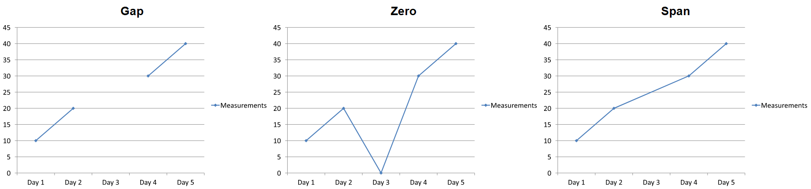

## **ภาพรวม**

แผนภูมิจัดเก็บข้อมูลที่แสดงในรูปแบบแผนภูมิในสมุดงานข้อมูลแผนภูมิ. [ChartSeries](https://reference.aspose.com/slides/python-java/aspose.slides/chartseries/) แสดงชุดค่าที่เกี่ยวข้องหนึ่งชุด, และแต่ละ [ChartDataPoint](https://reference.aspose.com/slides/python-java/aspose.slides/chartdatapoint/) ในชุดนั้นอ้างอิงถึงหนึ่งหรือหลายเซลล์ในสมุดงาน. [ChartCategory](https://reference.aspose.com/slides/python-java/aspose.slides/chartcategory/) ให้ป้ายชื่อหรือค่ากลุ่มที่ใช้ร่วมกันระหว่างชุดข้อมูล. ดังนั้นชื่อชุด, ประเภท, และค่าจุดจึงเชื่อมต่อกับอ็อบเจกต์ [ChartDataCell](https://reference.aspose.com/slides/python-java/aspose.slides/chartdatacell/) แทนที่จะเก็บเป็นข้อความแสดงผลเท่านั้น.

สำหรับแผนภูมิประเภทที่กำหนดโดยค่าเริ่มต้น, สมุดงานเริ่มต้นใช้แถว 0 สำหรับชื่อชุด, คอลัมน์ 0 สำหรับชื่อประเภท, และเซลล์ที่เหลือสำหรับค่าชุด. ดัชนีของ worksheet, แถว, และคอลัมน์ที่ส่งผ่านไปยัง [ChartDataWorkbook.getCell](https://reference.aspose.com/slides/python-java/aspose.slides/chartdataworkbook/#getCell) เป็นดัชนีที่นับจาก 0. โครงสร้างนี้มีประโยชน์เมื่อคุณสร้างแผนภูมิด้วยข้อมูลเริ่มต้น, แต่ไม่ควรสันนิษฐานว่าแผนภูมิที่มีอยู่ทั้งหมดใช้โครงสร้างนี้. สำหรับการนำเสนอที่โหลดแล้ว, ตรวจสอบเซลล์ที่ชุด, ประเภท, และจุดข้อมูลอ้างอิงก่อนที่จะเปลี่ยนค่าในสมุดงาน.

การตั้งค่าแผนภูมิมีสามระดับที่แตกต่างกัน:

- การตั้งค่าระดับชุด, เช่น [ChartSeries.getFormat](https://reference.aspose.com/slides/python-java/aspose.slides/chartseries/#getFormat), ให้การปรากฏเริ่มต้นสำหรับทุกจุดในชุดเดียว.
- การตั้งค่าจุดข้อมูล, เช่น [ChartDataPoint.getFormat](https://reference.aspose.com/slides/python-java/aspose.slides/chartdatapoint/#getFormat), ทับซ้อนการปรากฏของชุดสำหรับจุดนั้น.
- การตั้งค่ากลุ่มใช้กับชุดที่เข้ากันได้ซึ่งอยู่ใน [ChartSeriesGroup](https://reference.aspose.com/slides/python-java/aspose.slides/chartseriesgroup/) เดียวกัน. เข้าถึงกลุ่มผ่าน [ChartSeries.getParentSeriesGroup](https://reference.aspose.com/slides/python-java/aspose.slides/chartseries/#getParentSeriesGroup) เมื่อคุณต้องการตั้งค่าตัวเลือกเช่นการทับซ้อนหรือความกว้างช่องว่าง.

เมื่อไม่มีการกำหนดการเติมจุดหรือชุดอย่างชัดเจน, สไตล์และธีมของแผนภูมิจะกำหนดการปรากฏอัตโนมัติ. เมื่อทั้งการจัดรูปแบบชุดและจุดมีอยู่, การจัดรูปแบบจุดจะมีความสำคัญเหนือสำหรับจุดนั้น.


## **ตั้งค่าการทับซ้อนของชุดแผนภูมิ**

[ChartSeries.getOverlap](https://reference.aspose.com/slides/python-java/aspose.slides/chartseries/#getOverlap) รายงานว่าบาร์หรือคอลัมน์ทับซ้อนกันมากแค่ไหนในแผนภูมิ 2D, จาก -100 ถึง 100 เปอร์เซ็นต์. มันเป็นการแสดงผลแบบอ่านอย่างเดียวของการตั้งค่าในกลุ่มชุดพาเรนต์. ใช้ [ChartSeriesGroup.setOverlap](https://reference.aspose.com/slides/python-java/aspose.slides/chartseriesgroup/#setOverlap) เพื่ออัปเดตทุกชุดที่เข้ากันได้ในกลุ่มนั้น. ตัวเลือกนี้ใช้กับประเภทแผนภูมิที่แสดงบาร์หรือคอลัมน์แบบกลุ่ม; มันจะไม่ส่งผลต่อกลุ่มชุดที่ไม่เกี่ยวข้องในแผนภูมิแบบผสม.

ตัวอย่างต่อไปนี้ตั้งค่าการทับซ้อนสำหรับกลุ่มที่มีชุดแรก:

```python
import jpype
import asposeslides

if not jpype.isJVMStarted():
    jpype.startJVM()

from asposeslides.api import ChartType, Presentation, SaveFormat

first_slide_index = 0
first_series_index = 0
overlap_percent = 30

presentation = Presentation()
try:
    slide = presentation.getSlides().get_Item(first_slide_index)

    # แผนภูมิใหม่มีชุดตัวอย่าง, ประเภท, และค่า.
    chart = slide.getShapes().addChart(ChartType.ClusteredColumn, 20, 20, 500, 200)

    series = chart.getChartData().getSeries().get_Item(first_series_index)
    series.getParentSeriesGroup().setOverlap(overlap_percent)

    presentation.save("series_overlap.pptx", SaveFormat.Pptx)
finally:
    presentation.dispose()
```

ผลลัพธ์:


## **เปลี่ยนสีเติมของชุดแผนภูมิ**

ใช้ [ChartSeries.getFormat](https://reference.aspose.com/slides/python-java/aspose.slides/chartseries/#getFormat) เพื่อกำหนดสีเติมเริ่มต้นสำหรับชุดทั้งหมด. หากจุดหนึ่งมีการเติมที่กำหนดไว้แล้ว, การตั้งค่า [ChartDataPoint.getFormat](https://reference.aspose.com/slides/python-java/aspose.slides/chartdatapoint/#getFormat) จะทับซ้อนการเติมของชุดสำหรับจุดนั้น.

ตัวอย่างต่อไปนี้ใช้การเติมสีน้ำเงินทึบให้กับชุดแรก:

```python
import jpype
import asposeslides

if not jpype.isJVMStarted():
    jpype.startJVM()

from asposeslides.api import ChartType, FillType, Presentation, SaveFormat

Color = jpype.JClass("java.awt.Color")

first_slide_index = 0
first_series_index = 0

presentation = Presentation()
try:
    slide = presentation.getSlides().get_Item(first_slide_index)

    chart = slide.getShapes().addChart(ChartType.ClusteredColumn, 20, 20, 500, 200)

    series = chart.getChartData().getSeries().get_Item(first_series_index)
    series.getFormat().getFill().setFillType(FillType.Solid)
    series.getFormat().getFill().getSolidFillColor().setColor(Color.BLUE)

    presentation.save("series_color.pptx", SaveFormat.Pptx)
finally:
    presentation.dispose()
```

ผลลัพธ์:


## **เปลี่ยนชื่อชุดแผนภูมิ**

ชื่อชุดถูกเก็บในสมุดงานข้อมูลแผนภูมิและโดยปกติจะแสดงในคำอธิบาย. ในสมุดงานเริ่มต้นที่สร้างสำหรับแผนภูมิคอลัมน์แบบกลุ่ม, เซลล์ B1 อยู่ที่แถว 0, คอลัมน์ 1 และบรรจุชื่อของชุดแรก. ตัวแปรที่ตั้งชื่อในตัวอย่างต่อไปนี้ทำให้โครงสร้างนั้นชัดเจน:

```python
import jpype
import asposeslides

if not jpype.isJVMStarted():
    jpype.startJVM()

from asposeslides.api import ChartType, Presentation, SaveFormat

first_slide_index = 0
worksheet_index = 0
series_name_row_index = 0
first_series_column_index = 1

presentation = Presentation()
try:
    slide = presentation.getSlides().get_Item(first_slide_index)

    chart = slide.getShapes().addChart(ChartType.ClusteredColumn, 20, 20, 500, 200)

    workbook = chart.getChartData().getChartDataWorkbook()
    series_name_cell = workbook.getCell(worksheet_index, series_name_row_index, first_series_column_index)
    series_name_cell.setValue("Revenue")

    presentation.save("series_name.pptx", SaveFormat.Pptx)
finally:
    presentation.dispose()
```

คุณยังสามารถอัปเดตเซลล์ที่อ้างอิงโดย [ChartSeries.getName](https://reference.aspose.com/slides/python-java/aspose.slides/chartseries/#getName) ได้เช่นกัน. วิธีนี้หลีกเลี่ยงการสันนิษฐานแถวและคอลัมน์เฉพาะในแผนภูมิที่มีอยู่:

```python
import jpype
import asposeslides

if not jpype.isJVMStarted():
    jpype.startJVM()

from asposeslides.api import ChartType, Presentation, SaveFormat

first_slide_index = 0
first_series_index = 0
first_name_cell_index = 0

presentation = Presentation()
try:
    slide = presentation.getSlides().get_Item(first_slide_index)

    chart = slide.getShapes().addChart(ChartType.ClusteredColumn, 20, 20, 500, 200)

    series = chart.getChartData().getSeries().get_Item(first_series_index)
    series_name_cell = series.getName().getAsCells().get_Item(first_name_cell_index)
    series_name_cell.setValue("Revenue")

    presentation.save("series_name.pptx", SaveFormat.Pptx)
finally:
    presentation.dispose()
```

ผลลัพธ์:


### **สร้างชุดข้อมูลด้วยชื่อจากหลายเซลล์**

ชื่อชุดแบบคอมโพสท์มีประโยชน์เมื่อชื่อสินค้าและช่วงเวลาการรายงานถูกเก็บในเซลล์สมุดงานแยกกัน. ตัวอย่างเช่น, คุณสามารถรวม `Product A` ใน B1 และ `2026` ใน C1 ให้เป็นชื่อชุดเดียวขณะที่ยังคงเชื่อมโยงทั้งสองส่วนไปยังเซลล์ต้นฉบับของพวกมัน.

ใช้ [ChartDataWorkbook.getCellCollection](https://reference.aspose.com/slides/python-java/aspose.slides/chartdataworkbook/#getCellCollection) เพื่อดึงช่วงชื่อ, จากนั้นส่งคอลเล็กชันนั้นไปที่ [ChartSeriesCollection.add](https://reference.aspose.com/slides/python-java/aspose.slides/chartseriescollection/#add). พารามิเตอร์ `skipHiddenCells` ควบคุมว่ารวมเซลล์ที่ซ่อนไว้หรือไม่: `True` จะไม่รวม, `False` จะรวม. ตัวอย่างนี้ใช้ `False` เพื่อรวมทุกเซลล์ในช่วงชื่อ.

ตัวอย่างต่อไปนี้สร้างการนำเสนอที่มีชุดหนึ่งและจุดข้อมูลสองจุด. เซลล์ B1:C1 ให้เฉพาะชื่อชุด; A2:A3 ให้ป้ายชื่อประเภท, และ B2:B3 ให้ค่าตัวเลข.

```python
import jpype
import asposeslides

if not jpype.isJVMStarted():
    jpype.startJVM()

from asposeslides.api import ChartType, Presentation, SaveFormat

presentation = Presentation()
try:
    slide = presentation.getSlides().get_Item(0)

    chart = slide.getShapes().addChart(ChartType.ClusteredColumn, 50, 50, 620, 180)

    chart.getChartData().getSeries().clear()
    chart.getChartData().getCategories().clear()
    chart.setLegend(True)

    workbook = chart.getChartData().getChartDataWorkbook()
    workbook.clear(0)

    # เซลล์สองเซลล์นี้ให้ชื่อชุด.
    workbook.getCell(0, 0, 1, "Product A")
    workbook.getCell(0, 0, 2, "2026")
    name_cells = workbook.getCellCollection("Sheet1!$B$1:$C$1", False)
    series = chart.getChartData().getSeries().add(name_cells, ChartType.ClusteredColumn)

    # เซลล์แยกกันให้ประเภทและจุดข้อมูลเชิงตัวเลข.
    north_category = workbook.getCell(0, 1, 0, "North")
    south_category = workbook.getCell(0, 2, 0, "South")
    chart.getChartData().getCategories().add(north_category)
    chart.getChartData().getCategories().add(south_category)
    north_value = workbook.getCell(0, 1, 1, jpype.JInt(120))
    south_value = workbook.getCell(0, 2, 1, jpype.JInt(150))
    series.getDataPoints().addDataPointForBarSeries(north_value)
    series.getDataPoints().addDataPointForBarSeries(south_value)

    presentation.save("composite_series_name.pptx", SaveFormat.Pptx)
finally:
    presentation.dispose()
```

ชื่อชุดที่ได้คือ `Product A 2026`, โดยมีช่องว่างระหว่างค่าจากสองเซลล์. คำอธิบายจะแสดงเป็นรายการเดียวสำหรับทั้งสองคอลัมน์. ภาพด้านล่างแสดงผลลัพธ์:


## **รับสีเติมอัตโนมัติของชุดแผนภูมิ**

[ChartSeries.getAutomaticSeriesColor](https://reference.aspose.com/slides/python-java/aspose.slides/chartseries/#getAutomaticSeriesColor) คืนค่าสีที่คำนวณจากดัชนีชุดและสไตล์แผนภูมิ. นี่คือสีที่ใช้เมื่อการเติมชุดไม่ได้กำหนดอย่างชัดเจน. การเรียกเมธอดจะอ่านสีที่คำนวณแล้ว; มันไม่ได้กำหนดการเติมใหม่.

ตัวอย่างต่อไปนี้พิมพ์สีอัตโนมัติของแต่ละชุดเริ่มต้น:

```python
import jpype
import asposeslides

if not jpype.isJVMStarted():
    jpype.startJVM()

from asposeslides.api import ChartType, Presentation

first_slide_index = 0

presentation = Presentation()
try:
    slide = presentation.getSlides().get_Item(first_slide_index)

    chart = slide.getShapes().addChart(ChartType.ClusteredColumn, 20, 20, 500, 200)

    series_count = chart.getChartData().getSeries().size()
    for series_index in range(series_count):
        series = chart.getChartData().getSeries().get_Item(series_index)
        automatic_color = series.getAutomaticSeriesColor()
        print(f"Series {series_index}: {automatic_color}")
finally:
    presentation.dispose()
```

ผลลัพธ์ตัวอย่างสำหรับสไตล์แผนภูมิเริ่มต้น:

```text
Series 0: java.awt.Color[r=79,g=129,b=189]
Series 1: java.awt.Color[r=192,g=80,b=77]
Series 2: java.awt.Color[r=155,g=187,b=89]
```

สีที่แม่นยำขึ้นอยู่กับสไตล์และธีมของแผนภูมิ.

## **ตั้งค่าสีเติมกลับสำหรับชุดแผนภูมิ**

สำหรับชุดบาร์, คอลัมน์, และบับเบิล, [ChartSeries.setInvertIfNegative](https://reference.aspose.com/slides/python-java/aspose.slides/chartseries/#setInvertIfNegative) สามารถแสดงค่าลบด้วยการเติมที่แตกต่างกัน. ตั้งการเติมชุดปกติให้เป็นสีทึบ, เปิดการกลับสี, และกำหนดสีค่าลบผ่าน [ChartSeries.getInvertedSolidFillColor](https://reference.aspose.com/slides/python-java/aspose.slides/chartseries/#getInvertedSolidFillColor). ตัวเลขลบจะคงเดิมในสมุดงาน; เพียงสีการแสดงผลที่เปลี่ยน.

ตัวอย่างต่อไปนี้แทนที่ข้อมูลแผนภูมิเริ่มต้นด้วยชุดหนึ่ง. แถว worksheet 0 มีชื่อชุด, คอลัมน์ 0 มีชื่อประเภท, และคอลัมน์ 1 มีค่าต่างๆ:

```python
import jpype
import asposeslides

if not jpype.isJVMStarted():
    jpype.startJVM()

from asposeslides.api import ChartType, FillType, Presentation, SaveFormat

Color = jpype.JClass("java.awt.Color")

first_slide_index = 0
worksheet_index = 0
header_row_index = 0
category_column_index = 0
first_series_column_index = 1
first_data_row_index = 1

category_names = ["Category 1", "Category 2", "Category 3"]
series_values = [-20, 50, -30]

presentation = Presentation()
try:
    slide = presentation.getSlides().get_Item(first_slide_index)

    chart = slide.getShapes().addChart(ChartType.ClusteredColumn, 20, 20, 500, 200)
    chart_data = chart.getChartData()
    workbook = chart_data.getChartDataWorkbook()

    chart_data.getSeries().clear()
    chart_data.getCategories().clear()

    series_name_cell = workbook.getCell(worksheet_index, header_row_index, first_series_column_index, "Series 1")
    chart_type = chart.getType()
    series = chart_data.getSeries().add(series_name_cell, chart_type)

    for category_index in range(len(category_names)):
        data_row_index = first_data_row_index + category_index
        category_name = category_names[category_index]
        series_value = series_values[category_index]

        category_cell = workbook.getCell(worksheet_index, data_row_index, category_column_index, category_name)
        chart_data.getCategories().add(category_cell)

        value_cell = workbook.getCell(worksheet_index, data_row_index, first_series_column_index, series_value)
        series.getDataPoints().addDataPointForBarSeries(value_cell)

    automatic_series_color = series.getAutomaticSeriesColor()
    series.getFormat().getFill().setFillType(FillType.Solid)
    series.getFormat().getFill().getSolidFillColor().setColor(automatic_series_color)
    series.setInvertIfNegative(True)
    series.getInvertedSolidFillColor().setColor(Color.RED)

    presentation.save("inverted_solid_fill_color.pptx", SaveFormat.Pptx)
finally:
    presentation.dispose()
```

ผลลัพธ์:


คุณสามารถเปิดการกลับสีสำหรับจุดเดียวผ่าน [ChartDataPoint.setInvertIfNegative](https://reference.aspose.com/slides/python-java/aspose.slides/chartdatapoint/#setInvertIfNegative). ในตัวอย่างต่อไปนี้, การกลับสีถูกปิดสำหรับชุดและเปิดเฉพาะสำหรับจุดที่เลือก. จุดนั้นยังได้รับค่าลบเพื่อให้เห็นผล:

```python
import jpype
import asposeslides

if not jpype.isJVMStarted():
    jpype.startJVM()

from asposeslides.api import ChartType, FillType, Presentation, SaveFormat

Color = jpype.JClass("java.awt.Color")

first_slide_index = 0
first_series_index = 0
target_data_point_index = 2
negative_value = -30

presentation = Presentation()
try:
    slide = presentation.getSlides().get_Item(first_slide_index)

    chart = slide.getShapes().addChart(ChartType.ClusteredColumn, 20, 20, 500, 200)

    series = chart.getChartData().getSeries().get_Item(first_series_index)
    automatic_series_color = series.getAutomaticSeriesColor()
    series.getFormat().getFill().setFillType(FillType.Solid)
    series.getFormat().getFill().getSolidFillColor().setColor(automatic_series_color)
    series.getInvertedSolidFillColor().setColor(Color.RED)
    series.setInvertIfNegative(False)

    data_point = series.getDataPoints().get_Item(target_data_point_index)
    data_point.getValue().getAsCell().setValue(negative_value)
    data_point.setInvertIfNegative(True)

    presentation.save("data_point_invert_color_if_negative.pptx", SaveFormat.Pptx)
finally:
    presentation.dispose()
```

## **ล้างค่าจุดข้อมูลเฉพาะ**

เพื่อทำให้จุดหนึ่งเป็นค่าว่างโดยไม่ลบจุดอื่น, ตั้งค่าเซลล์ในสมุดงานที่สนับสนุนจุดนั้นเป็น `None`. สำหรับแผนภูมิคอลัมน์, ค่าที่แสดงสามารถเข้าถึงได้ผ่าน [ChartDataPoint.getValue](https://reference.aspose.com/slides/python-java/aspose.slides/chartdatapoint/#getValue). จุดข้อมูลจะคงอยู่ที่ตำแหน่งประเภทเดียวกัน, แต่แผนภูมิจะแสดงค่าของมันเป็นค่าว่างตามการตั้งค่าค่าว่างของแผนภูมิ.

ตัวอย่างต่อไปนี้ล้างเฉพาะจุดที่สองในชุดแรก:

```python
import jpype
import asposeslides

if not jpype.isJVMStarted():
    jpype.startJVM()

from asposeslides.api import ChartType, Presentation, SaveFormat

first_slide_index = 0
first_series_index = 0
target_data_point_index = 1

presentation = Presentation()
try:
    slide = presentation.getSlides().get_Item(first_slide_index)

    chart = slide.getShapes().addChart(ChartType.ClusteredColumn, 20, 20, 500, 200)

    series = chart.getChartData().getSeries().get_Item(first_series_index)
    data_point = series.getDataPoints().get_Item(target_data_point_index)
    data_point.getValue().getAsCell().setValue(None)

    presentation.save("clear_data_point_value.pptx", SaveFormat.Pptx)
finally:
    presentation.dispose()
```

แผนภูมิกระจาย (scatter) ใช้เซลล์ X และ Y แยกกัน, และแผนภูมิบับเบิลยังใช้เซลล์ขนาด. ล้างเฉพาะเซลล์ที่เป็นค่าที่คุณต้องการลบ. อย่าเรียก [ChartDataPointCollection.clear](https://reference.aspose.com/slides/python-java/aspose.slides/chartdatapointcollection/#clear) เมื่อคุณต้องการเก็บจุดอื่นไว้, เพราะเมธอดนั้นจะลบทุกจุดจากคอลเล็กชัน.

## **ควบคุมการแสดงผลของเซลล์ว่าง**

เซลล์ที่ซ่อนอยู่แต่มีค่าเป็นกรณีแยกต่างหากจากเซลล์ว่าง. เพื่อรวมหรือไม่นำเข้าข้อมูลจากแถวและคอลัมน์ที่ซ่อนอยู่, ดูที่ [Include Data from Hidden Rows and Columns](/slides/th/python-java/chart-workbook/#include-data-from-hidden-rows-and-columns).

เซลล์ว่างในสมุดงานแสดงถึงข้อมูลที่หายไป; เซลล์ที่มีค่า `0` แสดงถึงค่าตัวเลขที่รู้จัก. เรียก [ChartDataCell.setValue](https://reference.aspose.com/slides/python-java/aspose.slides/chartdatacell/#setValue) พร้อม `None` เพื่อทำให้เซลล์เป็นค่าว่าง. จำนวนศูนย์ยังคงเป็นศูนย์ไม่ว่าจะตั้งค่าค่าว่างอย่างไร.

ใช้ [Chart.setDisplayBlanksAs](https://reference.aspose.com/slides/python-java/aspose.slides/chart/#setDisplayBlanksAs) เพื่อเลือกว่ากราฟจะแสดงเซลล์ว่างอย่างไร. การตั้งค่านี้ใช้กับแผนภูมิทั้งหมด. มันเปลี่ยนวิธีการวางจุดว่างโดยไม่ต้องเติมเซลล์ว่างในสมุดงานด้วยศูนย์หรือค่าประมาณ.

ตัวอย่างต่อไปนี้เป็นตัวอย่างอัตโนมัติที่สร้างแผนภูมิเส้นหนึ่งชุด, ลบค่าของวัน 3, และบันทึกแผนภูมิเดียวกันในแต่ละโหมด. ไม่จำเป็นต้องมีไฟล์อินพุต. [ChartDataWorkbook](https://reference.aspose.com/slides/python-java/aspose.slides/chartdataworkbook/) ใช้ worksheet 0, คอลัมน์ 0 สำหรับป้ายชื่อประเภท, และคอลัมน์ 1 สำหรับค่าต่างๆ; แถว 0 เก็บชื่อชุด. ข้อมูลสุดท้ายคือ `10, 20, empty, 30, 40`.

```python
import jpype
import asposeslides

if not jpype.isJVMStarted():
    jpype.startJVM()

from asposeslides.api import ChartType, DisplayBlanksAsType, Presentation, SaveFormat

presentation = Presentation()
try:
    slide = presentation.getSlides().get_Item(0)

    chart = slide.getShapes().addChart(ChartType.LineWithMarkers, 40, 40, 640, 400)
    chart_data = chart.getChartData()
    workbook = chart_data.getChartDataWorkbook()

    chart_data.getSeries().clear()
    chart_data.getCategories().clear()

    series_name_cell = workbook.getCell(0, 0, 1, "Measurements")
    series = chart_data.getSeries().add(series_name_cell, chart.getType())
    values = [10, 20, 25, 30, 40]

    for i, value in enumerate(values):
        category_cell = workbook.getCell(0, i + 1, 0, f"Day {i + 1}")
        chart_data.getCategories().add(category_cell)
        value_cell = workbook.getCell(0, i + 1, 1, jpype.JInt(value))
        series.getDataPoints().addDataPointForLineSeries(value_cell)

    # ทำให้วัน 3 เป็นค่าว่างจริง ๆ แต่ยังคงประเภทและจุดข้อมูลไว้
    workbook.getCell(0, 3, 1).setValue(None)

    modes = [DisplayBlanksAsType.Gap, DisplayBlanksAsType.Zero, DisplayBlanksAsType.Span]
    mode_names = ["Gap", "Zero", "Span"]
    for mode, mode_name in zip(modes, mode_names):
        chart.setDisplayBlanksAs(mode)
        presentation.save(f"empty_cells_{mode_name}.pptx", SaveFormat.Pptx)
finally:
    presentation.dispose()
```

แต่ละไฟล์ผลลัพธ์บันทึกโหมดที่กำหนดก่อนบันทึก: `empty_cells_Gap.pptx`, `empty_cells_Zero.pptx`, และ `empty_cells_Span.pptx`. หากต้องการบันทึกเพียงเวอร์ชันเดียว, กำหนดโหมดที่ต้องการแล้วบันทึกการนำเสนอครั้งเดียวแทนการวนลูปตามโหมด.

การเปรียบเทียบด้านล่างแสดงข้อมูลเดียวกันในไฟล์ทั้งสาม. วัน 3 เป็นค่าว่างในสมุดงานในทุกกรณี:



ผลลัพธ์ที่มองเห็นขึ้นอยู่กับประเภทแผนภูมิ. แผนภูมิเส้นทำให้สามโหมดเปรียบเทียบได้ง่าย. แผนภูมิบาร์และคอลัมน์ไม่มีเส้นเชื่อมต่อผ่านประเภทที่หายไป, ดังนั้น `Span` ไม่สามารถสร้างส่วนเชื่อมต่อที่แสดงด้านบน; คอลัมน์ที่หายไปและคอลัมน์สูงศูนย์อาจดูคล้ายกัน. เช่นเดียวกับแผนภูมิกระจายที่มีเพียงเครื่องหมายโดยไม่มีเส้นเชื่อมต่อ. อย่าคาดหวังผลลัพธ์สามแบบที่แตกต่างกันสำหรับทุกประเภทแผนภูมิ; ตรวจสอบผลลัพธ์สำหรับประเภทที่คุณใช้.

## **ตั้งค่าความกว้างช่องว่างของชุดแผนภูมิ**

ความกว้างช่องว่างคือช่องว่างระหว่างกลุ่มบาร์หรือคอลัมน์ที่อยู่ติดกัน, แสดงเป็นเปอร์เซ็นต์ของความกว้างบาร์หรือคอลัมน์. เช่นเดียวกับการทับซ้อน, มันเป็นของกลุ่มชุดพาเรนต์ไม่ใช่ของชุดเดียว. เรียก [ChartSeriesGroup.setGapWidth](https://reference.aspose.com/slides/python-java/aspose.slides/chartseriesgroup/#setGapWidth) ครั้งเดียวสำหรับกลุ่ม. ค่าที่ใหญ่กว่าจะสร้างช่องว่างมากขึ้นระหว่างกลุ่ม; ค่าที่เล็กกว่าจะทำให้กลุ่มหนาแน่นขึ้น.

ตัวอย่างต่อไปนี้เปลี่ยนความกว้างช่องว่างและบันทึกการนำเสนอขั้นสุดท้ายเท่านั้น:

```python
import jpype
import asposeslides

if not jpype.isJVMStarted():
    jpype.startJVM()

from asposeslides.api import ChartType, Presentation, SaveFormat

first_slide_index = 0
first_series_index = 0
gap_width_percent = 30

presentation = Presentation()
try:
    slide = presentation.getSlides().get_Item(first_slide_index)

    chart = slide.getShapes().addChart(ChartType.StackedColumn, 20, 20, 500, 200)

    series = chart.getChartData().getSeries().get_Item(first_series_index)
    series.getParentSeriesGroup().setGapWidth(gap_width_percent)

    presentation.save("gap_width_30.pptx", SaveFormat.Pptx)
finally:
    presentation.dispose()
```

ผลลัพธ์:


## **FAQ**

**ประเภทแผนภูมิใดที่สนับสนุนชุดข้อมูล?**

ทุกประเภทแผนภูมิที่แสดงโดย enumeration [ChartType](https://reference.aspose.com/slides/python-java/aspose.slides/charttype/) ใช้ข้อมูลแผนภูมิ, แต่ชุดของพวกมันไม่ทั้งหมดมีโครงสร้างค่าหรือการตั้งค่าเดียวกัน. ตัวอย่างเช่น, แผนภูมิดัชนีใช้ประเภทและค่าตาม, แผนภูมิ scatter ใช้ค่า X และ Y, และแผนภูมิบับเบิลเพิ่มขนาดบับเบิล. ใช้วิธีการสร้างจุดข้อมูลที่ตรงกับประเภทชุด. ตัวเลือกเช่นการทับซ้อนและความกว้างช่องว่างใช้ได้เฉพาะกับกลุ่มบาร์หรือคอลัมน์ที่เข้ากันได้.

**กลุ่มชุดแผนภูมิคืออะไร?**

[ChartSeriesGroup](https://reference.aspose.com/slides/python-java/aspose.slides/chartseriesgroup/) มีชุดที่เข้ากันได้ซึ่งใช้การตั้งค่าการวาดระดับกลุ่มร่วมกัน. แผนภูมิแบบผสมสามารถมีมากกว่าหนึ่งกลุ่ม, ดังนั้นการเปลี่ยนกลุ่มที่เข้าถึงผ่านชุดหนึ่งอาจไม่เปลี่ยนทุกชุดในแผนภูมิ.

**แผนภูมิที่สร้างใหม่มีข้อมูลเริ่มต้นหรือไม่?**

ใช่. โดยค่าเริ่มต้น, [ShapeCollection.addChart](https://reference.aspose.com/slides/python-java/aspose.slides/shapecollection/#addChart) สร้างชุดตัวอย่าง, ประเภท, และค่า. คุณสามารถแก้ไขเซลล์เหล่านั้นหรือเคลียร์ทั้งชุดและคอลเล็กชันประเภทก่อนเพิ่มชุดข้อมูลที่กำหนดเองอย่างสมบูรณ์. การ overload ยังสามารถสร้างแผนภูมิโดยไม่มีข้อมูลเริ่มต้นได้.

**แผนภูมิต่างๆ เชื่อมต่อกับเซลล์สมุดงานอย่างไร?**

ชื่อชุด, ป้ายชื่อประเภท, และค่าจุดข้อมูลอ้างอิงเซลล์ใน [ChartDataWorkbook](https://reference.aspose.com/slides/python-java/aspose.slides/chartdataworkbook/). การเปลี่ยนเซลล์ที่อ้างอิงจะอัปเดตองค์ประกอบแผนภูมิเกี่ยวข้อง. เมื่อคุณสร้างข้อมูลกำหนดเอง, รักษาแถวประเภทและแถวค่าชุดให้สอดคล้องกันเพื่อให้แต่ละจุดถูกวางภายใต้ประเภทที่ตั้งใจ.

**ฉันจะลบจุดเดี่ยวแทนการลบทั้งชุดได้อย่างไร?**

ตั้งค่าเซลล์ค่าที่เกี่ยวข้องเป็น `None` เพื่อรักษาตำแหน่งประเภทของจุดนั้นเป็นจุดว่าง. ใช้ [ChartDataPointCollection.clear](https://reference.aspose.com/slides/python-java/aspose.slides/chartdatapointcollection/#clear) เฉพาะเมื่อคุณต้องการลบทุกจุดจากชุดนั้น. หากคุณยังลบประเภท, ให้ปรับทุกชุดเพื่อให้ค่าของพวกเขายังคงสอดคล้องกับคอลเล็กชันประเภท.

**จุดว่างจะแสดงอย่างไร?**

ผลลัพธ์ขึ้นอยู่กับประเภทแผนภูมิและค่าที่กำหนดผ่าน [Chart.setDisplayBlanksAs](https://reference.aspose.com/slides/python-java/aspose.slides/chart/#setDisplayBlanksAs). แผนภูมิที่สนับสนุนสามารถแสดงช่องว่างเป็นช่องว่าง, เป็นค่าศูนย์, หรือโดยการเชื่อมต่อจุดที่อยู่ใกล้กัน. เลือกการตั้งค่าที่สอดคล้องกับความหมายของข้อมูลที่หายไปในงานนำเสนอของคุณ. ดูที่ [Control the Display of Empty Cells](#control-the-display-of-empty-cells) สำหรับตัวอย่างเต็มและเปรียบเทียบภาพ.

**ค่าลบถูกจัดรูปแบบอย่างไร?**

สำหรับชุดบาร์, คอลัมน์, และบับเบิลที่สนับสนุน, เรียก [ChartSeries.setInvertIfNegative](https://reference.aspose.com/slides/python-java/aspose.slides/chartseries/#setInvertIfNegative) และตั้งค่าสีที่ได้จาก [ChartSeries.getInvertedSolidFillColor](https://reference.aspose.com/slides/python-java/aspose.slides/chartseries/#getInvertedSolidFillColor). คุณสามารถทับซ้อนพฤติกรรมสำหรับจุดเดี่ยวด้วย [ChartDataPoint.setInvertIfNegative](https://reference.aspose.com/slides/python-java/aspose.slides/chartdatapoint/#setInvertIfNegative). วิธีเหล่านี้มีผลต่อการจัดรูปแบบ, ไม่ใช่ค่าตัวเลขที่เก็บไว้.

**การจัดรูปแบบใดชนะเมื่อตั้งค่าทั้งชุดและจุด?**

การจัดรูปแบบจุดข้อมูลโดยชัดเจนจะมีความสำคัญสำหรับจุดนั้น. จุดอื่น ๆ จะยังคงใช้การจัดรูปแบบชุดที่กำหนดหรือ, หากชุดไม่ได้กำหนด, สไตล์และธีมแผนภูมิอัตโนมัติ. การตั้งค่ากลุ่มเช่นการทับซ้อนและความกว้างช่องว่างควบคุมการวางแผนและไม่ใช่การทับซ้อนการจัดรูปแบบระดับจุด.

**มีขีดจำกัดจำนวนชุดที่แผนภูมิสามารถมีได้หรือไม่?**

Aspose.Slides ไม่กำหนดขีดจำกัดจำนวนชุดแยกจากกัน. อย่างไรก็ตาม, ข้อจำกัดของไฟล์การนำเสนอ, หน่วยความจำที่ใช้ได้, เวลาเรนเดอร์, และความอ่านง่ายของแผนภูมิจะกำหนดขีดจำกัดที่เป็นประโยชน์.

**ควรเปลี่ยนอะไรเมื่อคอลัมน์ใกล้กันเกินไปหรือห่างกันเกินไป?**

เรียก [ChartSeriesGroup.setGapWidth](https://reference.aspose.com/slides/python-java/aspose.slides/chartseriesgroup/#setGapWidth) บนกลุ่มพาเรนต์ที่เหมาะสม. เพิ่มค่าจะทำให้ช่องว่างระหว่างกลุ่มกว้างขึ้น, หรือ ลดค่าจะทำให้กลุ่มใกล้กันมากขึ้น.