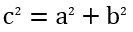

## **ภาพรวม**

PowerPoint เก็บสมการเป็น Office Math Markup Language (OMML). ด้วย Aspose.Slides for Python via Java คุณสามารถสร้างเนื้อหาคณิตศาสตร์ประเภทเดียวกันโดยใช้โค้ด: เศษส่วน, ราก, ฟังก์ชัน, ขีดจำกัด, ตัวดำเนินการ N-ary, เมทริกซ์, อาเรย์, และบล็อกคณิตศาสตร์ที่จัดรูปแบบ

ใน PowerPoint ผู้ใช้โดยปกติจะเพิ่มสมการจาก **Insert > Equation**:


ผลลัพธ์คือตัวอักษรคณิตศาสตร์ที่สามารถแก้ไขได้บนสไลด์:


Aspose.Slides สร้างข้อความคณิตศาสตร์นั้นผ่านวัตถุหลักสามประเภท:

- รูปคณิตศาสตร์ที่สร้างด้วย [addMathShape](https://reference.aspose.com/slides/th/python-java/aspose.slides/shapecollection/#addMathShape) คือรูปที่บรรจุสมการ
- [MathPortion](https://reference.aspose.com/slides/th/python-java/aspose.slides/mathportion/) เก็บเนื้อหาคณิตศาสตร์ภายในเฟรมข้อความของรูป
- [MathParagraph](https://reference.aspose.com/slides/th/python-java/aspose.slides/mathparagraph/) มีหนึ่งหรือหลายอ็อบเจ็กต์ [MathBlock](https://reference.aspose.com/slides/th/python-java/aspose.slides/mathblock/)

ตัวอย่างส่วนใหญ่ด้านล่างใช้ [MathematicalText](https://reference.aspose.com/slides/th/python-java/aspose.slides/mathematicaltext/) และเมธอด fluent จาก [MathElementBase](https://reference.aspose.com/slides/th/python-java/aspose.slides/mathelementbase/) เพื่อให้โค้ดสั้นและอ่านง่าย

สำหรับกรณีส่งออก MathML ดู [Export Math Equations from Presentations in Python](/slides/th/python-java/exporting-math-equations/)

## **สร้างสมการ**

ตัวอย่างนี้สร้างรูปคณิตศาสตร์และเพิ่มสูตรพีทากอรัส:



```python
import jpype
import asposeslides

if not jpype.isJVMStarted():
    jpype.startJVM()

from asposeslides.api import MathematicalText, Presentation, SaveFormat

presentation = Presentation()
try:
    slide = presentation.getSlides().get_Item(0)

    math_shape = slide.getShapes().addMathShape(20, 20, 700, 120)
    math_paragraph = math_shape.getTextFrame().getParagraphs().get_Item(0).getPortions().get_Item(0).getMathParagraph()

    a_squared = MathematicalText("a").setSuperscript("2")
    b_squared = MathematicalText("b").setSuperscript("2")
    equation = MathematicalText("c").setSuperscript("2").join("=").join(a_squared).join("+").join(b_squared)

    math_paragraph.add(equation)

    presentation.save("pythagorean-theorem.pptx", SaveFormat.Pptx)
finally:
    presentation.dispose()
```

{}
[addMathShape](https://reference.aspose.com/slides/th/python-java/aspose.slides/shapecollection/#addMathShape) สร้างรูปที่มี MathParagraph อยู่แล้ว เข้าถึง [MathPortion](https://reference.aspose.com/slides/th/python-java/aspose.slides/mathportion/) ตัวแรก, ดึง [MathParagraph](https://reference.aspose.com/slides/th/python-java/aspose.slides/mathparagraph/) ของมัน, แล้วเพิ่ม MathBlock หรือ MathElement ลงไป
{}

## **เพิ่มเศษส่วน**

ใช้ [divide](https://reference.aspose.com/slides/th/python-java/aspose.slides/mathelementbase/#divide) เพื่อสร้างเศษส่วน คุณสามารถเลือกสไตล์ของเศษส่วนด้วย [MathFractionTypes](https://reference.aspose.com/slides/th/python-java/aspose.slides/mathfractiontypes/)


```python
import jpype
import asposeslides

if not jpype.isJVMStarted():
    jpype.startJVM()

from asposeslides.api import MathBlock, MathFractionTypes, MathematicalText, Presentation, SaveFormat

presentation = Presentation()
try:
    slide = presentation.getSlides().get_Item(0)

    math_shape = slide.getShapes().addMathShape(20, 20, 700, 100)
    math_paragraph = math_shape.getTextFrame().getParagraphs().get_Item(0).getPortions().get_Item(0).getMathParagraph()

    fraction = MathematicalText("1").divide("x", MathFractionTypes.Skewed)

    math_block = MathBlock(fraction)
    math_paragraph.add(math_block)

    presentation.save("fraction.pptx", SaveFormat.Pptx)
finally:
    presentation.dispose()
```

สำหรับเศษส่วนแบบซ้อนกัน ใช้ [MathFractionTypes.Bar](https://reference.aspose.com/slides/th/python-java/aspose.slides/mathfractiontypes/#Bar):

```python
import jpype
import asposeslides

if not jpype.isJVMStarted():
    jpype.startJVM()

from asposeslides.api import MathFractionTypes, MathematicalText

stacked_fraction = MathematicalText("x + 1").divide("y - 1", MathFractionTypes.Bar)
```

## **เพิ่มราก**

ใช้ [radical](https://reference.aspose.com/slides/th/python-java/aspose.slides/mathelementbase/#radical) เพื่อสร้างรากกำลังสอง, รากกำลังสาม หรือรากอื่น ๆ สมาชิกปัจจุบันจะเป็นฐานและอาร์กิวเมนต์จะเป็นดีกรี


```python
import jpype
import asposeslides

if not jpype.isJVMStarted():
    jpype.startJVM()

from asposeslides.api import MathBlock, MathematicalText, Presentation, SaveFormat

presentation = Presentation()
try:
    slide = presentation.getSlides().get_Item(0)

    math_shape = slide.getShapes().addMathShape(20, 20, 700, 100)
    math_paragraph = math_shape.getTextFrame().getParagraphs().get_Item(0).getPortions().get_Item(0).getMathParagraph()

    radical = MathematicalText("x").radical("n")

    math_block = MathBlock(radical)
    math_paragraph.add(math_block)

    presentation.save("radical.pptx", SaveFormat.Pptx)
finally:
    presentation.dispose()
```

## **เพิ่มฟังก์ชันและขีดจำกัด**

ใช้ [asArgumentOfFunction](https://reference.aspose.com/slides/th/python-java/aspose.slides/mathelementbase/#asArgumentOfFunction) หรือ [function](https://reference.aspose.com/slides/th/python-java/aspose.slides/mathelementbase/#function) สำหรับฟังก์ชันเช่น `sin(x)`, `log(x)` หรือชื่อฟังก์ชันกำหนดเอง สำหรับขีดจำกัด ให้ใส่ `lim` ใน [MathLimit](https://reference.aspose.com/slides/th/python-java/aspose.slides/mathlimit/) หรือใช้ [setLowerLimit](https://reference.aspose.com/slides/th/python-java/aspose.slides/mathelementbase/#setLowerLimit)


```python
import jpype
import asposeslides

if not jpype.isJVMStarted():
    jpype.startJVM()

from asposeslides.api import MathBlock, MathematicalText, Presentation, SaveFormat

presentation = Presentation()
try:
    slide = presentation.getSlides().get_Item(0)

    math_shape = slide.getShapes().addMathShape(20, 20, 700, 100)
    math_paragraph = math_shape.getTextFrame().getParagraphs().get_Item(0).getPortions().get_Item(0).getMathParagraph()

    limit = MathematicalText("lim").setLowerLimit("x\u2192\u221E").function("x")

    math_block = MathBlock(limit)
    math_paragraph.add(math_block)

    presentation.save("functions-and-limits.pptx", SaveFormat.Pptx)
finally:
    presentation.dispose()
```

สำหรับชื่อฟังก์ชันกำหนดเอง ให้ทำให้ชื่อฟังก์ชันเป็นสมาชิกปัจจุบัน:

```python
import jpype
import asposeslides

if not jpype.isJVMStarted():
    jpype.startJVM()

from asposeslides.api import MathematicalText

custom_function = MathematicalText("f").function("x + 1")
```

## **เพิ่มตัวดำเนินการ N-ary และอินทิกรัล**

ใช้ [nary](https://reference.aspose.com/slides/th/python-java/aspose.slides/mathelementbase/#nary) สำหรับการบวกรวม, การยูเนียน, การอินเตอร์เซกชัน และตัวดำเนินการขนาดใหญ่อื่น ๆ ใช้ [integral](https://reference.aspose.com/slides/th/python-java/aspose.slides/mathelementbase/#integral) สำหรับอินทิกรัล ทั้งสองเมธอดให้คุณตั้งค่าขีดจำกัดล่างและบน


```python
import jpype
import asposeslides

if not jpype.isJVMStarted():
    jpype.startJVM()

from asposeslides.api import MathBlock, MathNaryOperatorTypes, MathematicalText, Presentation, SaveFormat

presentation = Presentation()
try:
    slide = presentation.getSlides().get_Item(0)

    math_shape = slide.getShapes().addMathShape(20, 20, 700, 120)
    math_paragraph = math_shape.getTextFrame().getParagraphs().get_Item(0).getPortions().get_Item(0).getMathParagraph()

    a_power = MathematicalText("a").setSuperscript("n-k")
    summation_base = MathematicalText("x").setSuperscript("k").join(a_power)

    summation = summation_base.nary(MathNaryOperatorTypes.Summation, "k=0", "n")

    math_block = MathBlock(summation)
    math_paragraph.add(math_block)

    presentation.save("nary-operators.pptx", SaveFormat.Pptx)
finally:
    presentation.dispose()
```

ตัวดำเนินการ N-ary ใช้สำหรับตัวดำเนินการขนาดใหญ่ที่มีขีดจำกัดแบบเลือกได้ ตัวดำเนินการง่ายเช่น `+`, `-` และ `=` มักจะเพิ่มเป็น [MathematicalText](https://reference.aspose.com/slides/th/python-java/aspose.slides/mathematicaltext/) แล้วเชื่อมต่อเป็นนิพจน์

สำหรับอินทิกรัล ให้ใช้ [integral](https://reference.aspose.com/slides/th/python-java/aspose.slides/mathelementbase/#integral):

```python
import jpype
import asposeslides

if not jpype.isJVMStarted():
    jpype.startJVM()

from asposeslides.api import MathIntegralTypes, MathematicalText

differential = MathematicalText("dx").toBox()
integral_base = MathematicalText("x").join(differential)
integral = integral_base.integral(MathIntegralTypes.Simple, "0", "1")
```

## **เพิ่มเมทริกซ์**

ใช้ [MathMatrix](https://reference.aspose.com/slides/th/python-java/aspose.slides/mathmatrix/) สำหรับแถวและคอลัมน์ เมทริกซ์โดยปกติจะไม่มีวงเล็บดังนั้นให้ล้อมเมทริกซ์เมื่อจำเป็นต้องมีวงเล็บ, กรอบ หรือวงเกลียว


```python
import jpype
import asposeslides

if not jpype.isJVMStarted():
    jpype.startJVM()

from asposeslides.api import MathBlock, MathMatrix, MathematicalText, Presentation, SaveFormat

presentation = Presentation()
try:
    slide = presentation.getSlides().get_Item(0)

    math_shape = slide.getShapes().addMathShape(20, 20, 700, 120)
    math_paragraph = math_shape.getTextFrame().getParagraphs().get_Item(0).getPortions().get_Item(0).getMathParagraph()

    matrix = MathMatrix(2, 3)
    cell_0_0 = MathematicalText("1")
    matrix.set_Item(0, 0, cell_0_0)
    cell_0_1 = MathematicalText("x")
    matrix.set_Item(0, 1, cell_0_1)
    cell_1_0 = MathematicalText("x")
    matrix.set_Item(1, 0, cell_1_0)
    cell_1_1 = MathematicalText("2")
    matrix.set_Item(1, 1, cell_1_1)
    cell_1_2 = MathematicalText("y")
    matrix.set_Item(1, 2, cell_1_2)

    math_block = MathBlock(matrix)
    math_paragraph.add(math_block)

    presentation.save("matrix.pptx", SaveFormat.Pptx)
finally:
    presentation.dispose()
```

## **เพิ่มอาเรย์สมการ**

ใช้ [toMathArray](https://reference.aspose.com/slides/th/python-java/aspose.slides/mathelementbase/#toMathArray) เมื่อคุณต้องการสมการจัดแนวหรือสแตกของนิพจน์ในแนวตั้ง


```python
import jpype
import asposeslides

if not jpype.isJVMStarted():
    jpype.startJVM()

from asposeslides.api import MathBlock, MathematicalText, Presentation, SaveFormat

presentation = Presentation()
try:
    slide = presentation.getSlides().get_Item(0)

    math_shape = slide.getShapes().addMathShape(20, 20, 700, 140)
    math_paragraph = math_shape.getTextFrame().getParagraphs().get_Item(0).getPortions().get_Item(0).getMathParagraph()

    equation_array = MathematicalText("x").join("y").toMathArray()

    math_block = MathBlock(equation_array)
    math_paragraph.add(math_block)

    presentation.save("equation-array.pptx", SaveFormat.Pptx)
finally:
    presentation.dispose()
```

## **เพิ่มฟังก์ชันตรีโกณมิติ**

ใช้ [asArgumentOfFunction](https://reference.aspose.com/slides/th/python-java/aspose.slides/mathelementbase/#asArgumentOfFunction) เมื่ออาร์กิวเมนต์เป็นสมาชิกปัจจุบันและชื่อฟังก์ชันเป็นที่ทราบ


```python
import jpype
import asposeslides

if not jpype.isJVMStarted():
    jpype.startJVM()

from asposeslides.api import MathBlock, MathFunctionsOfOneArgument, MathematicalText, Presentation, SaveFormat

presentation = Presentation()
try:
    slide = presentation.getSlides().get_Item(0)

    math_shape = slide.getShapes().addMathShape(20, 20, 700, 100)
    math_paragraph = math_shape.getTextFrame().getParagraphs().get_Item(0).getPortions().get_Item(0).getMathParagraph()

    cosine = MathematicalText("2x").asArgumentOfFunction(MathFunctionsOfOneArgument.Cos)

    math_block = MathBlock(cosine)
    math_paragraph.add(math_block)

    presentation.save("trigonometric-function.pptx", SaveFormat.Pptx)
finally:
    presentation.dispose()
```

## **เพิ่มตัวห้อยและตัวบน**

ใช้ตัวช่วยสำหรับตัวห้อยและตัวบนสำหรับดัชนีและกำลัง เมื่อดัชนีต้องแสดงด้านซ้ายของฐาน ให้ใช้ [setSubSuperscriptOnTheLeft](https://reference.aspose.com/slides/th/python-java/aspose.slides/mathelementbase/#setSubSuperscriptOnTheLeft)


```python
import jpype
import asposeslides

if not jpype.isJVMStarted():
    jpype.startJVM()

from asposeslides.api import MathBlock, MathematicalText, Presentation, SaveFormat

presentation = Presentation()
try:
    slide = presentation.getSlides().get_Item(0)

    math_shape = slide.getShapes().addMathShape(20, 20, 700, 100)
    math_paragraph = math_shape.getTextFrame().getParagraphs().get_Item(0).getPortions().get_Item(0).getMathParagraph()

    scripts = MathematicalText("Y").setSubSuperscriptOnTheLeft("1", "n")

    math_block = MathBlock(scripts)
    math_paragraph.add(math_block)

    presentation.save("subscript-superscript.pptx", SaveFormat.Pptx)
finally:
    presentation.dispose()
```

## **เพิ่มตัวคั่น**

ใช้ [enclose](https://reference.aspose.com/slides/th/python-java/aspose.slides/mathelementbase/#enclose) เพื่อนำนิพจน์ใส่ในตัวคั่น คุณยังสามารถกำหนดอักขระคั่นสำหรับนิพจน์ตัวคั่นที่มีหลายองค์ประกอบได้


```python
import jpype
import asposeslides

if not jpype.isJVMStarted():
    jpype.startJVM()

from asposeslides.api import MathBlock, MathematicalText, Presentation, SaveFormat

presentation = Presentation()
try:
    slide = presentation.getSlides().get_Item(0)

    math_shape = slide.getShapes().addMathShape(20, 20, 700, 100)
    math_paragraph = math_shape.getTextFrame().getParagraphs().get_Item(0).getPortions().get_Item(0).getMathParagraph()

    delimiter = MathematicalText("x").join("y").join("z").enclose('<', '>')
    delimiter.setSeparatorCharacter('|')

    math_block = MathBlock(delimiter)
    math_paragraph.add(math_block)

    presentation.save("delimiters.pptx", SaveFormat.Pptx)
finally:
    presentation.dispose()
```

## **เพิ่มกล่องกรอบ**

ใช้ [toBorderBox](https://reference.aspose.com/slides/th/python-java/aspose.slides/mathelementbase/#toBorderBox) เมื่อสมการควรอยู่ในกรอบ


```python
import jpype
import asposeslides

if not jpype.isJVMStarted():
    jpype.startJVM()

from asposeslides.api import MathBlock, MathematicalText, Presentation, SaveFormat

presentation = Presentation()
try:
    slide = presentation.getSlides().get_Item(0)

    math_shape = slide.getShapes().addMathShape(20, 20, 700, 100)
    math_paragraph = math_shape.getTextFrame().getParagraphs().get_Item(0).getPortions().get_Item(0).getMathParagraph()

    b_squared = MathematicalText("b").setSuperscript("2")
    c_squared = MathematicalText("c").setSuperscript("2")
    boxed_equation = MathematicalText("a").setSuperscript("2").join("=").join(b_squared).join("+").join(c_squared).toBorderBox()

    math_block = MathBlock(boxed_equation)
    math_paragraph.add(math_block)

    presentation.save("border-box.pptx", SaveFormat.Pptx)
finally:
    presentation.dispose()
```

## **จัดกลุ่มเทอม**

ใช้ [group](https://reference.aspose.com/slides/th/python-java/aspose.slides/mathelementbase/#group) เพื่อวางอักขระจัดกลุ่มเหนือหรือใต้นิพจน์ เพิ่มขีดจำกัดเพื่อทำป้ายกำกับให้เทอมที่จัดกลุ่ม


```python
import jpype
import asposeslides

if not jpype.isJVMStarted():
    jpype.startJVM()

from asposeslides.api import MathBlock, MathTopBotPositions, MathematicalText, Presentation, SaveFormat

presentation = Presentation()
try:
    slide = presentation.getSlides().get_Item(0)

    math_shape = slide.getShapes().addMathShape(20, 20, 700, 120)
    math_paragraph = math_shape.getTextFrame().getParagraphs().get_Item(0).getPortions().get_Item(0).getMathParagraph()

    grouped = MathematicalText("x + y").group('\u23DF', MathTopBotPositions.Bottom, MathTopBotPositions.Top).setLowerLimit("any text")

    math_block = MathBlock(grouped)
    math_paragraph.add(math_block)

    presentation.save("grouped-terms.pptx", SaveFormat.Pptx)
finally:
    presentation.dispose()
```

## **จัดรูปแบบองค์ประกอบคณิตศาสตร์**

ใช้ตัวช่วยจัดรูปแบบเฉพาะเมื่อช่วยให้สูตรชัดเจน เช่น [overbar](https://reference.aspose.com/slides/th/python-java/aspose.slides/mathelementbase/#overbar) จะวางเส้นขีดเหนือองค์ประกอบคณิตศาสตร์


```python
import jpype
import asposeslides

if not jpype.isJVMStarted():
    jpype.startJVM()

from asposeslides.api import MathBlock, MathematicalText, Presentation, SaveFormat

presentation = Presentation()
try:
    slide = presentation.getSlides().get_Item(0)

    math_shape = slide.getShapes().addMathShape(20, 20, 700, 100)
    math_paragraph = math_shape.getTextFrame().getParagraphs().get_Item(0).getPortions().get_Item(0).getMathParagraph()

    overbar = MathematicalText("ABC").overbar()

    math_block = MathBlock(overbar)
    math_paragraph.add(math_block)

    presentation.save("overbar.pptx", SaveFormat.Pptx)
finally:
    presentation.dispose()
```

## **อ้างอิงอย่างรวดเร็ว**

| งาน | API หลัก |
| --- | --- |
| สร้างข้อความคณิตศาสตร์ | [MathematicalText](https://reference.aspose.com/slides/th/python-java/aspose.slides/mathematicaltext/) |
| รวมองค์ประกอบ | [MathElementBase.join](https://reference.aspose.com/slides/th/python-java/aspose.slides/mathelementbase/#join) |
| สร้างเศษส่วน | [MathElementBase.divide](https://reference.aspose.com/slides/th/python-java/aspose.slides/mathelementbase/#divide) |
| เพิ่มตัวบนหรือ ตัวห้อย | [setSuperscript](https://reference.aspose.com/slides/th/python-java/aspose.slides/mathelementbase/#setSuperscript), [setSubscript](https://reference.aspose.com/slides/th/python-java/aspose.slides/mathelementbase/#setSubscript) |
| เพิ่มฟังก์ชัน | [function](https://reference.aspose.com/slides/th/python-java/aspose.slides/mathelementbase/#function), [asArgumentOfFunction](https://reference.aspose.com/slides/th/python-java/aspose.slides/mathelementbase/#asArgumentOfFunction) |
| เพิ่มราก | [MathElementBase.radical](https://reference.aspose.com/slides/th/python-java/aspose.slides/mathelementbase/#radical) |
| เพิ่มขีดจำกัด | [setLowerLimit](https://reference.aspose.com/slides/th/python-java/aspose.slides/mathelementbase/#setLowerLimit), [setUpperLimit](https://reference.aspose.com/slides/th/python-java/aspose.slides/mathelementbase/#setUpperLimit) |
| เพิ่มสคริปต์ด้านซ้าย | [setSubSuperscriptOnTheLeft](https://reference.aspose.com/slides/th/python-java/aspose.slides/mathelementbase/#setSubSuperscriptOnTheLeft) |
| เพิ่มการบวกรวมและอินทิกรัล | [nary](https://reference.aspose.com/slides/th/python-java/aspose.slides/mathelementbase/#nary), [integral](https://reference.aspose.com/slides/th/python-java/aspose.slides/mathelementbase/#integral) |
| เพิ่มเมทริกซ์ | [MathMatrix](https://reference.aspose.com/slides/th/python-java/aspose.slides/mathmatrix/) |
| เพิ่มอาเรย์สมการ | [toMathArray](https://reference.aspose.com/slides/th/python-java/aspose.slides/mathelementbase/#toMathArray) |
| เพิ่มตัวคั่น | [enclose](https://reference.aspose.com/slides/th/python-java/aspose.slides/mathelementbase/#enclose) |
| เพิ่มเส้นขีดและกรอบ | [overbar](https://reference.aspose.com/slides/th/python-java/aspose.slides/mathelementbase/#overbar), [toBorderBox](https://reference.aspose.com/slides/th/python-java/aspose.slides/mathelementbase/#toBorderBox) |
| จัดกลุ่มเทอม | [group](https://reference.aspose.com/slides/th/python-java/aspose.slides/mathelementbase/#group) |

## **คำถามที่พบบ่อย**

**ฉันสามารถแก้ไขสมการ PowerPoint ที่มีอยู่ได้หรือไม่?**

ใช่. เปิดการนำเสนอ, ค้นหารูปที่มี [MathPortion](https://reference.aspose.com/slides/th/python-java/aspose.slides/mathportion/), ดึง [MathParagraph](https://reference.aspose.com/slides/th/python-java/aspose.slides/mathparagraph/) ของมัน, จากนั้นอัปเดต MathBlock ในย่อหนนนั้น

**สมการถูกบันทึกเป็นคณิตศาสตร์ PowerPoint ที่แก้ไขได้หรือไม่?**

ใช่. เมื่อคุณบันทึกเป็น PPTX, Aspose.Slides จะเขียนสมการเป็นเนื้อหา Office Math ที่แก้ไขได้

**ฉันสามารถส่งออกสมการเป็น LaTeX ได้หรือไม่?**

ใช่. ดึง [MathParagraph](https://reference.aspose.com/slides/th/python-java/aspose.slides/mathparagraph/) ของสมการจาก [MathPortion](https://reference.aspose.com/slides/th/python-java/aspose.slides/mathportion/), แล้วเรียก [MathParagraph.toLatex](https://reference.aspose.com/slides/th/python-java/aspose.slides/mathparagraph/#toLatex) เพื่อส่งออกโดยตรง สำหรับตัวอย่างเต็มให้ดูที่ [Export Math Equations from Presentations in Python](/slides/th/python-java/exporting-math-equations/#export-math-equations-to-latex)