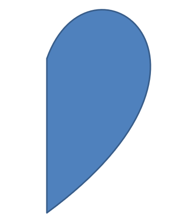

## **ภาพรวม**

บทความนี้อธิบายวิธีปรับแต่งรูปร่างงานนำเสนอใน Aspose.Slides โดยการแก้ไขเรขาคณิตของรูปร่างผ่านจุดแก้ไขและเส้นทางเรขาคณิต ซึ่งจะแสดงวิธีทำงานกับ [GeometryPath](https://reference.aspose.com/slides/th/python-java/aspose.slides/geometrypath/) เพื่อแก้ไขรูปร่างที่มีอยู่, ทำการแก้ไขเส้นทางขั้นพื้นฐาน, เพิ่มหรือลบจุด, และนำเรขาคณิตที่อัปเดตกลับไปใช้กับรูปร่าง

นอกจากนี้ยังสาธิตวิธีสร้างรูปร่างกำหนดเองและคอมโพสิต, สร้างรูปร่างที่มีมุมโค้ง, ตรวจสอบว่ารูปร่างเรขาคณิตเป็นแบบปิดหรือไม่, และแปลงระหว่าง [GeometryPath](https://reference.aspose.com/slides/th/python-java/aspose.slides/geometrypath/) กับ [java.awt.Shape](https://docs.oracle.com/javase/7/docs/api/java/awt/Shape.html) เพื่อใช้ในสถานการณ์การปรับแต่งเรขาคณิตเพิ่มเติม

## **เปลี่ยนรูปร่างโดยใช้จุดแก้ไข**

ลองนึกถึงสี่เหลี่ยมจตุรัส ใน PowerPoint เมื่อใช้ **จุดแก้ไข** คุณสามารถ

* ย้ายมุมของสี่เหลี่ยมเข้าออก
* กำหนดความโค้งของมุมหรือจุด
* เพิ่มจุดใหม่ลงในสี่เหลี่ยม
* จัดการจุดบนสี่เหลี่ยม ฯลฯ

โดยสรุป คุณสามารถทำงานที่อธิบายไว้กับรูปร่างใดก็ได้ การใช้จุดแก้ไขทำให้คุณเปลี่ยนรูปร่างหรือสร้างรูปร่างใหม่จากรูปร่างที่มีอยู่

## **เคล็ดลับการแก้ไขรูปร่าง**


ก่อนที่คุณจะเริ่มแก้ไขรูปร่าง PowerPoint ผ่านจุดแก้ไข คุณอาจต้องพิจารณาเรื่องต่อไปนี้เกี่ยวกับรูปร่าง:

* รูปร่าง (หรือเส้นทางของมัน) สามารถเป็นแบบปิดหรือเปิดได้
* เมื่อรูปร่างเป็นแบบปิด จะไม่มีจุดเริ่มต้นหรือสิ้นสุด เมื่อเป็นแบบเปิด จะมีจุดเริ่มต้นและสิ้นสุด
* รูปร่างทั้งหมดประกอบด้วยจุดยึดอย่างน้อย 2 จุดที่เชื่อมต่อด้วยเส้น
* เส้นอาจเป็นเส้นตรงหรือโค้ง จุดยึดกำหนดลักษณะของเส้น
* จุดยึดมีอยู่เป็นจุดมุม, จุดตรง, หรือจุดเรียบ:
  * จุดมุมคือจุดที่เส้นตรง 2 เส้นมาบรรจบกันเป็นมุม
  * จุดเรียบคือจุดที่มีจุดควบคุม 2 จุดอยู่บนเส้นตรงและส่วนของเส้นเชื่อมต่อกันเป็นโค้งเรียบ ในกรณีนี้ จุดควบคุมทั้งหมดจะห่างจากจุดยึดเท่า ๆ กัน
  * จุดตรงคือจุดที่มีจุดควบคุม 2 จุดอยู่บนเส้นตรงและส่วนของเส้นเชื่อมต่อกันเป็นโค้งเรียบ ในกรณีนี้ จุดควบคุมไม่จำเป็นต้องห่างจากจุดยึดเท่า ๆ กัน
* โดยการย้ายหรือแก้ไขจุดยึด (ซึ่งเปลี่ยนมุมของเส้น) คุณสามารถเปลี่ยนลักษณะของรูปร่างได้

เพื่อแก้ไขรูปร่าง PowerPoint ผ่านจุดแก้ไข, **Aspose.Slides** มีคลาส [GeometryPath](https://reference.aspose.com/slides/th/python-java/aspose.slides/geometrypath/)

* อินสแตนซ์ของ [GeometryPath](https://reference.aspose.com/slides/th/python-java/aspose.slides/geometrypath/) แทนเส้นทางเรขาคณิตของออบเจ็กต์ [GeometryShape](https://reference.aspose.com/slides/th/python-java/aspose.slides/geometryshape/)
* เพื่อดึง [GeometryPath](https://reference.aspose.com/slides/th/python-java/aspose.slides/geometrypath/) จากอินสแตนซ์ของ [GeometryShape](https://reference.aspose.com/slides/th/python-java/aspose.slides/geometryshape/) คุณสามารถใช้เมธอด [GeometryShape.getGeometryPaths](https://reference.aspose.com/slides/th/python-java/aspose.slides/geometryshape/#getGeometryPaths)
* เพื่อกำหนด [GeometryPath](https://reference.aspose.com/slides/th/python-java/aspose.slides/geometrypath/) ให้กับรูปร่าง คุณสามารถใช้เมธอดเหล่านี้: [GeometryShape.setGeometryPath](https://reference.aspose.com/slides/th/python-java/aspose.slides/geometryshape/#setGeometryPath) สำหรับ *รูปร่างเดี่ยว* และ [GeometryShape.setGeometryPaths](https://reference.aspose.com/slides/th/python-java/aspose.slides/geometryshape/#setGeometryPaths) สำหรับ *รูปร่างคอมโพสิต*
* เพื่อเพิ่มเซ็กเมนต์ คุณสามารถใช้เมธอดภายใต้ [GeometryPath](https://reference.aspose.com/slides/th/python-java/aspose.slides/geometrypath/)
* โดยใช้เมธอด [GeometryPath.setStroke](https://reference.aspose.com/slides/th/python-java/aspose.slides/geometrypath/#setStroke) และ [GeometryPath.setFillMode](https://reference.aspose.com/slides/th/python-java/aspose.slides/geometrypath/#setFillMode) คุณสามารถกำหนดลักษณะการแสดงผลของเส้นทางเรขาคณิต
* โดยใช้เมธอด [GeometryPath.getPathData](https://reference.aspose.com/slides/th/python-java/aspose.slides/geometrypath/#getPathData) คุณสามารถดึงข้อมูลเส้นทางของ [GeometryShape](https://reference.aspose.com/slides/th/python-java/aspose.slides/geometryshape/) เป็นอาร์เรย์ของเซ็กเมนต์เส้นทาง
* เพื่อเข้าถึงตัวเลือกการปรับแต่งเรขาคณิตของรูปร่างเพิ่มเติม คุณสามารถแปลง [GeometryPath](https://reference.aspose.com/slides/th/python-java/aspose.slides/geometrypath/) ไปเป็น [java.awt.Shape](https://docs.oracle.com/javase/7/docs/api/java/awt/Shape.html)
* ใช้เมธอด [geometryPathToGraphicsPath](https://reference.aspose.com/slides/th/python-java/aspose.slides/shapeutil/) และ [graphicsPathToGeometryPath](https://reference.aspose.com/slides/th/python-java/aspose.slides/shapeutil/) (จากคลาส [ShapeUtil](https://reference.aspose.com/slides/th/python-java/aspose.slides/shapeutil/)) เพื่อแปลง [GeometryPath](https://reference.aspose.com/slides/th/python-java/aspose.slides/geometrypath/) ไปเป็น [java.awt.Shape](https://docs.oracle.com/javase/7/docs/api/java/awt/Shape.html) และกลับกัน

## **การดำเนินการแก้ไขอย่างง่าย**

คำสั่งต่อไปนี้แสดงการดำเนินการแก้ไขพื้นฐาน:

**เพิ่มเส้น**ไปยังปลายของเส้นทาง:

- `geometry_path.lineTo(point)`
- `geometry_path.lineTo(x, y)`

**เพิ่มเส้น**ไปยังตำแหน่งที่ระบุบนเส้นทาง:

- `geometry_path.lineTo(point, index)`
- `geometry_path.lineTo(x, y, index)`

**เพิ่มโค้งเบซิเออร์แบบคิวบิก**ที่ปลายของเส้นทาง:

- `geometry_path.cubicBezierTo(point1, point2, point3)`
- `geometry_path.cubicBezierTo(x1, y1, x2, y2, x3, y3)`

**เพิ่มโค้งเบซิเออร์แบบคิวบิก**ไปยังตำแหน่งที่ระบุบนเส้นทาง:

- `geometry_path.cubicBezierTo(point1, point2, point3, index)`
- `geometry_path.cubicBezierTo(x1, y1, x2, y2, x3, y3, index)`

**เพิ่มโค้งเบซิเออร์แบบควอดราติก**ที่ปลายของเส้นทาง:

- `geometry_path.quadraticBezierTo(point1, point2)`
- `geometry_path.quadraticBezierTo(x1, y1, x2, y2)`

**เพิ่มโค้งเบซิเออร์แบบควอดราติก**ไปยังตำแหน่งที่ระบุบนเส้นทาง:

- `geometry_path.quadraticBezierTo(point1, point2, index)`
- `geometry_path.quadraticBezierTo(x1, y1, x2, y2, index)`

**ต่อส่วนโค้ง**ที่กำหนดให้กับเส้นทาง:

- `geometry_path.arcTo(width, height, start_angle, sweep_angle)`

**ปิดรูปแบบปัจจุบัน**ของเส้นทาง:

- `geometry_path.closeFigure()`

**กำหนดตำแหน่งสำหรับจุดถัดไป**:

- `geometry_path.moveTo(point)`
- `geometry_path.moveTo(x, y)`

**ลบเซ็กเมนต์เส้นทาง**ที่ตำแหน่งที่กำหนด:

- `geometry_path.removeAt(index)`

## **เพิ่มจุดกำหนดเองไปยังรูปร่าง**

1. สร้างอินสแตนซ์ของคลาส [GeometryShape](https://reference.aspose.com/slides/th/python-java/aspose.slides/geometryshape/) และกำหนดประเภทเป็น [ShapeType.Rectangle](https://reference.aspose.com/slides/th/python-java/aspose.slides/shapetype/#Rectangle)
2. ดึงอินสแตนซ์ของคลาส [GeometryPath](https://reference.aspose.com/slides/th/python-java/aspose.slides/geometrypath/) จากรูปร่าง
3. เพิ่มจุดใหม่ระหว่างสองจุดบนด้านบนของเส้นทาง
4. เพิ่มจุดใหม่ระหว่างสองจุดบนด้านล่างของเส้นทาง
5. นำเส้นทางไปใช้กับรูปร่าง

โค้ด Python นี้แสดงวิธีเพิ่มจุดกำหนดเองไปยังรูปร่าง:

```python
import jpype
import asposeslides

if not jpype.isJVMStarted():
    jpype.startJVM()

from asposeslides.api import Presentation, ShapeType

presentation = Presentation()
try:
    shape = presentation.getSlides().get_Item(0).getShapes().addAutoShape(ShapeType.Rectangle, 100, 100, 200, 100)
    geometry_path = shape.getGeometryPaths()[0]
    geometry_path.lineTo(100, 50, 1)
    geometry_path.lineTo(100, 50, 4)
    shape.setGeometryPath(geometry_path)
finally:
    presentation.dispose()
```


## **ลบจุดจากรูปร่าง**

1. สร้างอินสแตนซ์ของคลาส [GeometryShape](https://reference.aspose.com/slides/th/python-java/aspose.slides/geometryshape/) และกำหนดประเภทเป็น [ShapeType.Heart](https://reference.aspose.com/slides/th/python-java/aspose.slides/shapetype/#Heart)
2. ดึงอินสแตนซ์ของคลาส [GeometryPath](https://reference.aspose.com/slides/th/python-java/aspose.slides/geometrypath/) จากรูปร่าง
3. ลบเซ็กเมนต์ของเส้นทาง
4. นำเส้นทางไปใช้กับรูปร่าง

โค้ด Python นี้แสดงวิธีลบจุดจากรูปร่าง:

```python
import jpype
import asposeslides

if not jpype.isJVMStarted():
    jpype.startJVM()

from asposeslides.api import Presentation, ShapeType

presentation = Presentation()
try:
    shape = presentation.getSlides().get_Item(0).getShapes().addAutoShape(ShapeType.Heart, 100, 100, 300, 300)
    geometry_path = shape.getGeometryPaths()[0]
    geometry_path.removeAt(2)
    shape.setGeometryPath(geometry_path)
finally:
    presentation.dispose()
```


## **สร้างรูปร่างกำหนดเอง**

1. คำนวณจุดสำหรับรูปร่าง
2. สร้างอินสแตนซ์ของคลาส [GeometryPath](https://reference.aspose.com/slides/th/python-java/aspose.slides/geometrypath/)
3. เติมเส้นทางด้วยจุดต่าง ๆ
4. สร้างอินสแตนซ์ของคลาส [GeometryShape](https://reference.aspose.com/slides/th/python-java/aspose.slides/geometryshape/)
5. นำเส้นทางไปใช้กับรูปร่าง

โค้ด Python นี้แสดงวิธีสร้างรูปร่างกำหนดเอง:

```python
import jpype
import asposeslides

if not jpype.isJVMStarted():
    jpype.startJVM()

from asposeslides.api import Presentation, ShapeType, GeometryPath

import math

points = []
outer_radius = 100
inner_radius = 50
step = 72

for angle in range(-90, 270, step):
    radians = math.radians(angle)
    x = outer_radius * math.cos(radians)
    y = outer_radius * math.sin(radians)
    points.append((x + outer_radius, y + outer_radius))

    radians = math.radians(angle + step / 2)
    x = inner_radius * math.cos(radians)
    y = inner_radius * math.sin(radians)
    points.append((x + outer_radius, y + outer_radius))

star_path = GeometryPath()
star_path.moveTo(*points[0])
for point in points[1:]:
    star_path.lineTo(*point)
star_path.closeFigure()

presentation = Presentation()
try:
    shape = presentation.getSlides().get_Item(0).getShapes().addAutoShape(ShapeType.Rectangle, 100, 100, outer_radius * 2, outer_radius * 2)
    shape.setGeometryPath(star_path)
finally:
    presentation.dispose()
```


## **สร้างรูปร่างกำหนดเองแบบคอมโพสิต**

1. สร้างอินสแตนซ์ของคลาส [GeometryShape](https://reference.aspose.com/slides/th/python-java/aspose.slides/geometryshape/)
2. สร้างอินสแตนซ์แรกของคลาส [GeometryPath](https://reference.aspose.com/slides/th/python-java/aspose.slides/geometrypath/)
3. สร้างอินสแตนซ์ที่สองของคลาส [GeometryPath](https://reference.aspose.com/slides/th/python-java/aspose.slides/geometrypath/)
4. นำเส้นทางทั้งสองไปใช้กับรูปร่าง

โค้ด Python นี้แสดงวิธีสร้างรูปร่างคอมโพสิตกำหนดเอง:

```python
import jpype
import asposeslides

if not jpype.isJVMStarted():
    jpype.startJVM()

from asposeslides.api import Presentation, ShapeType, GeometryPath

presentation = Presentation()
try:
    shape = presentation.getSlides().get_Item(0).getShapes().addAutoShape(ShapeType.Rectangle, 100, 100, 200, 100)

    top_path = GeometryPath()
    top_path.moveTo(0, 0)
    top_path.lineTo(shape.getWidth(), 0)
    top_path.lineTo(shape.getWidth(), shape.getHeight() / 3)
    top_path.lineTo(0, shape.getHeight() / 3)
    top_path.closeFigure()

    bottom_path = GeometryPath()
    bottom_path.moveTo(0, shape.getHeight() / 3 * 2)
    bottom_path.lineTo(shape.getWidth(), shape.getHeight() / 3 * 2)
    bottom_path.lineTo(shape.getWidth(), shape.getHeight())
    bottom_path.lineTo(0, shape.getHeight())
    bottom_path.closeFigure()

    shape.setGeometryPaths([top_path, bottom_path])
finally:
    presentation.dispose()
```


## **สร้างรูปร่างกำหนดเองพร้อมมุมโค้ง**

โค้ด Python นี้แสดงวิธีสร้างรูปร่างกำหนดเองที่มีมุมโค้ง (หัวเข้า):

```python
import jpype
import asposeslides

if not jpype.isJVMStarted():
    jpype.startJVM()

from asposeslides.api import Presentation, ShapeType, GeometryPath, SaveFormat

shape_x = 20
shape_y = 20
shape_width = 300
shape_height = 200

left_top_size = 50
right_top_size = 20
right_bottom_size = 40
left_bottom_size = 10

presentation = Presentation()
try:
    shape = presentation.getSlides().get_Item(0).getShapes().addAutoShape(ShapeType.Custom, shape_x, shape_y, shape_width, shape_height)
    geometry_path = GeometryPath()
    geometry_path.moveTo(left_top_size, 0)
    geometry_path.lineTo(shape_width - right_top_size, 0)
    geometry_path.arcTo(right_top_size, right_top_size, 180, -90)
    geometry_path.lineTo(shape_width, shape_height - right_bottom_size)
    geometry_path.arcTo(right_bottom_size, right_bottom_size, -90, -90)
    geometry_path.lineTo(left_bottom_size, shape_height)
    geometry_path.arcTo(left_bottom_size, left_bottom_size, 0, -90)
    geometry_path.lineTo(0, left_top_size)
    geometry_path.arcTo(left_top_size, left_top_size, 90, -90)
    geometry_path.closeFigure()
    shape.setGeometryPath(geometry_path)
    presentation.save("output.pptx", SaveFormat.Pptx)
finally:
    presentation.dispose()
```

## **ค้นหาว่าเรขาคณิตของรูปร่างเป็นแบบปิดหรือไม่**

รูปร่างแบบปิดหมายถึงรูปร่างที่ด้านทั้งหมดเชื่อมต่อกันเป็นเส้นรอบเดี่ยวโดยไม่มีช่องว่าง รูปร่างนี้อาจเป็นรูปทรงเรขาคณิตง่าย ๆ หรือโครงร่างกำหนดเองที่ซับซ้อน ตัวอย่างโค้ดต่อไปนี้แสดงวิธีตรวจสอบว่าเรขาคณิตของรูปร่างเป็นแบบปิดหรือไม่:

```python
import jpype
import asposeslides

if not jpype.isJVMStarted():
    jpype.startJVM()

from asposeslides.api import PathCommandType

def is_geometry_closed(geometry_shape):
    is_closed = False
    for geometry_path in geometry_shape.getGeometryPaths():
        path_data = geometry_path.getPathData()
        if len(path_data) == 0:
            continue
        last_segment = path_data[-1]
        is_closed = last_segment.getPathCommand() == PathCommandType.Close
        if not is_closed:
            return False
    return is_closed
```

## **แปลง GeometryPath เป็น java.awt.Shape**

1. สร้างอินสแตนซ์ของคลาส [GeometryShape](https://reference.aspose.com/slides/th/python-java/aspose.slides/geometryshape/)
2. สร้างอินสแตนซ์ของคลาส [java.awt.Shape](https://docs.oracle.com/javase/7/docs/api/java/awt/Shape.html)
3. แปลงอินสแตนซ์ของ [java.awt.Shape](https://docs.oracle.com/javase/7/docs/api/java/awt/Shape.html) ไปเป็นอินสแตนซ์ของ [GeometryPath](https://reference.aspose.com/slides/th/python-java/aspose.slides/geometrypath/) โดยเดินตาม [PathIterator](https://docs.oracle.com/javase/8/docs/api/java/awt/geom/PathIterator.html) ของมันและทำซ้ำทุกเซ็กเมนต์บนเส้นทาง
4. นำเส้นทางไปใช้กับรูปร่าง

โค้ด Python นี้ดำเนินการตามขั้นตอนข้างต้นเพื่อแปลงกราฟิกพาธเป็นพาธเรขาคณิต:

```python
import jpype
import asposeslides

if not jpype.isJVMStarted():
    jpype.startJVM()

from asposeslides.api import Presentation, ShapeType, GeometryPath, PathFillModeType

from java.awt import Font
from java.awt.geom import PathIterator
from java.awt.image import BufferedImage

presentation = Presentation()
try:
    # สร้างรูปร่างใหม่.
    shape = presentation.getSlides().get_Item(0).getShapes().addAutoShape(ShapeType.Rectangle, 100, 100, 300, 100)

    # ดึงเส้นทางเรขาคณิตของรูปร่าง.
    original_path = shape.getGeometryPaths()[0]
    original_path.setFillMode(PathFillModeType.None_)

    # สร้างกราฟิกพาธใหม่พร้อมข้อความ.
    font = Font("Arial", Font.PLAIN, 40)
    text = "Text in shape"
    image = BufferedImage(100, 100, BufferedImage.TYPE_INT_ARGB)
    graphics = image.createGraphics()
    try:
        glyph_vector = font.createGlyphVector(graphics.getFontRenderContext(), text)
        graphics_path = glyph_vector.getOutline(20.0, -glyph_vector.getVisualBounds().getY() + 10)
    finally:
        graphics.dispose()

    # แปลงกราฟิกพาธเป็นเส้นทางเรขาคณิต.
    text_path = GeometryPath()
    path_iterator = graphics_path.getPathIterator(None)
    points = jpype.JArray(jpype.JFloat)(6)
    while not path_iterator.isDone():
        segment_type = path_iterator.currentSegment(points)
        if segment_type == PathIterator.SEG_MOVETO:
            text_path.moveTo(points[0], points[1])
        elif segment_type == PathIterator.SEG_LINETO:
            text_path.lineTo(points[0], points[1])
        elif segment_type == PathIterator.SEG_QUADTO:
            text_path.quadraticBezierTo(points[0], points[1], points[2], points[3])
        elif segment_type == PathIterator.SEG_CUBICTO:
            text_path.cubicBezierTo(points[0], points[1], points[2], points[3], points[4], points[5])
        elif segment_type == PathIterator.SEG_CLOSE:
            text_path.closeFigure()
        path_iterator.next()
    text_path.setFillMode(PathFillModeType.Normal)

    # ใช้เส้นทางข้อความร่วมกับเส้นทางเรขาคณิตดั้งเดิม.
    shape.setGeometryPaths([original_path, text_path])
finally:
    presentation.dispose()
```


## **FAQ**

**การแทนสีพื้นและเส้นขอบจะเป็นอย่างไรหลังจากเปลี่ยนเรขาคณิต?**

สไตล์ยังคงอยู่กับรูปร่าง; เพียงแค่โครงร่างเปลี่ยนไป สีพื้นและเส้นขอบจะถูกนำไปใช้โดยอัตโนมัติกับเรขาคณิตใหม่

**ฉันจะหมุนรูปร่างกำหนดเองพร้อมกับเรขาคณิตอย่างถูกต้องได้อย่างไร?**

ใช้เมธอด [setRotation](https://reference.aspose.com/slides/th/python-java/aspose.slides/shape/#setRotation) ของรูปร่าง; เรขาคณิตจะหมุนพร้อมกับรูปร่างเนื่องจากถูกผูกกับระบบพิกัดของรูปร่างเอง

**ฉันสามารถแปลงรูปร่างกำหนดเองเป็นภาพเพื่อ “ล็อค” ผลลัพธ์ได้หรือไม่?**

ได้. ส่งออกพื้นที่ [slide](/slides/th/python-java/convert-powerpoint-to-png/) ที่ต้องการหรือ [shape](/slides/th/python-java/create-shape-thumbnails/) เองเป็นรูปแบบเรสเตอร์; วิธีนี้ทำให้การทำงานต่อกับเรขาคณิตที่ซับซ้อนง่ายขึ้น