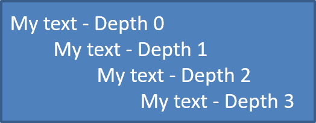

## **ภาพรวม**

Aspose.Slides for Python via .NET ช่วยให้คุณสร้างและจัดรูปแบบรายการหัวข้อสัญลักษณ์และรายการลำดับเลขในงานนำเสนอ PowerPoint และ OpenDocument รายการหนึ่งคือย่อหน้าที่การตั้งค่าหัวข้อสัญลักษณ์ถูกควบคุมผ่านรูปแบบของย่อหน้า

ใช้คุณสมบัติ [Paragraph.paragraph_format](https://reference.aspose.com/slides/th/python-net/aspose.slides/paragraph/paragraph_format/) เพื่อเข้าถึงการตั้งค่ารายการระดับย่อหน้า จุดเริ่มต้นหลักคือ [ParagraphFormat.bullet](https://reference.aspose.com/slides/th/python-net/aspose.slides/paragraphformat/bullet/), ซึ่งคืนค่าออบเจกต์ [BulletFormat](https://reference.aspose.com/slides/th/python-net/aspose.slides/bulletformat/) ด้วยออบเจกต์นี้คุณสามารถตั้งค่าชนิดของหัวข้อสัญลักษณ์, สัญลักษณ์, รูปภาพ, สี, ขนาด, รูปแบบการจัดลำดับเลข, และหมายเลขเริ่มต้นได้

บทความนี้แสดงวิธีการ:

- สร้างรายการหัวข้อสัญลักษณ์ด้วยสัญลักษณ์กำหนดเอง
- สร้างหัวข้อสัญลักษณ์รูปภาพ
- สร้างรายการหลายระดับโดยกำหนดความลึกของย่อหน้า
- สร้างรายการลำดับเลข
- ตรวจสอบและเปลี่ยนรูปแบบรายการในงานนำเสนอที่มีอยู่

## **สร้างรายการหัวข้อสัญลักษณ์**

เพื่อสร้างรายการหัวข้อสัญลักษณ์, เพิ่มออบเจกต์ [Paragraph](https://reference.aspose.com/slides/th/python-net/aspose.slides/paragraph/) ไปยัง [TextFrame](https://reference.aspose.com/slides/th/python-net/aspose.slides/textframe/) และตั้งค่า [BulletFormat.type](https://reference.aspose.com/slides/th/python-net/aspose.slides/bulletformat/type/) เป็น [BulletType.SYMBOL](https://reference.aspose.com/slides/th/python-net/aspose.slides/bullettype/). จากนั้นคุณสามารถตั้งค่า [BulletFormat.char](https://reference.aspose.com/slides/th/python-net/aspose.slides/bulletformat/char/), [BulletFormat.color](https://reference.aspose.com/slides/th/python-net/aspose.slides/bulletformat/color/), และ [BulletFormat.height](https://reference.aspose.com/slides/th/python-net/aspose.slides/bulletformat/height/) เพื่อควบคุมลักษณะของหัวข้อสัญลักษณ์

โค้ด Python ต่อไปนี้สาธิตวิธีสร้างรายการหัวข้อสัญลักษณ์ในสไลด์:

```py
import aspose.slides as slides
import aspose.pydrawing as draw

def create_paragraph(text):
    paragraph = slides.Paragraph()
    paragraph.paragraph_format.bullet.type = slides.BulletType.SYMBOL
    paragraph.paragraph_format.bullet.char = '*'
    paragraph.paragraph_format.indent = 15
    paragraph.paragraph_format.bullet.is_bullet_hard_color = slides.NullableBool.TRUE
    paragraph.paragraph_format.bullet.color.color = draw.Color.indian_red
    paragraph.paragraph_format.bullet.height = 100
    paragraph.text = text
    return paragraph


with slides.Presentation() as presentation:
    slide = presentation.slides[0]
    auto_shape = slide.shapes.add_auto_shape(slides.ShapeType.RECTANGLE, 20, 20, 200, 50)

    text_frame = auto_shape.text_frame
    text_frame.paragraphs.clear()

    paragraph1 = create_paragraph("The first paragraph")
    text_frame.paragraphs.add(paragraph1)

    paragraph2 = create_paragraph("The second paragraph")
    text_frame.paragraphs.add(paragraph2)

    presentation.save("symbol_bullets.pptx", slides.export.SaveFormat.PPTX)
```

ผลลัพธ์:


## **สร้างรายการลำดับเลข**

ใช้รายการลำดับเลขเมื่อลำดับของรายการมีความสำคัญ ตั้งค่า [BulletFormat.type](https://reference.aspose.com/slides/th/python-net/aspose.slides/bulletformat/type/) เป็น [BulletType.NUMBERED](https://reference.aspose.com/slides/th/python-net/aspose.slides/bullettype/). คุณยังสามารถเลือกรูปแบบการจัดลำดับด้วย [BulletFormat.numbered_bullet_style](https://reference.aspose.com/slides/th/python-net/aspose.slides/bulletformat/numbered_bullet_style/) หรือกำหนดค่าเริ่มต้นด้วย [BulletFormat.numbered_bullet_start_with](https://reference.aspose.com/slides/th/python-net/aspose.slides/bulletformat/numbered_bullet_start_with/) เมื่อรายการควรเริ่มจากค่าที่ไม่ใช่ 1

โค้ด Python ต่อไปนี้แสดงวิธีสร้างรายการลำดับเลขในสไลด์:

```py
import aspose.slides as slides

with slides.Presentation() as presentation:
    slide = presentation.slides[0]
    auto_shape = slide.shapes.add_auto_shape(slides.ShapeType.RECTANGLE, 20, 20, 90, 80)

    text_frame = auto_shape.text_frame
    text_frame.paragraphs.clear()

    paragraph1 = slides.Paragraph()
    paragraph1.paragraph_format.bullet.type = slides.BulletType.NUMBERED
    paragraph1.text = "Apple"
    text_frame.paragraphs.add(paragraph1)

    paragraph2 = slides.Paragraph()
    paragraph2.paragraph_format.bullet.type = slides.BulletType.NUMBERED
    paragraph2.text = "Orange"
    text_frame.paragraphs.add(paragraph2)

    paragraph3 = slides.Paragraph()
    paragraph3.paragraph_format.bullet.type = slides.BulletType.NUMBERED
    paragraph3.text = "Banana"
    text_frame.paragraphs.add(paragraph3)

    presentation.save("numbered_bullets.pptx", slides.export.SaveFormat.PPTX)
```

ผลลัพธ์:


## **สร้างหัวข้อสัญลักษณ์รูปภาพ**

Aspose.Slides อนุญาตให้คุณแทนที่สัญลักษณ์หัวข้อสัญลักษณ์ทั่วไปด้วยรูปภาพ หัวข้อสัญลักษณ์รูปภาพทำงานดีที่สุดกับภาพที่เรียบง่ายและยังคงอ่านได้เมื่อขนาดเล็ก เช่น ไอคอนหรือไฟล์ PNG โปร่งใสขนาดเล็ก

{}
โดยแนวคิด, หากคุณวางแผนจะแทนที่สัญลักษณ์หัวข้อสัญลักษณ์ทั่วไปด้วยรูปภาพ ควรเลือกกราฟิกเรียบง่ายที่มีพื้นหลังโปร่งใส ภาพเช่นนี้ทำงานดีเป็นสัญลักษณ์หัวข้อสัญลักษณ์แบบกำหนดเอง

ควรจำไว้ว่าภาพจะถูกย่อขนาดลงเป็นขนาดเล็กมาก ด้วยเหตุนี้เราขอแนะนำให้เลือกภาพที่ยังคงชัดเจนและมีประสิทธิภาพเชิงภาพเมื่อใช้เป็นหัวข้อสัญลักษณ์ในรายการ
{}

เพื่อสร้างหัวข้อสัญลักษณ์รูปภาพ, เพิ่มรูปภาพไปยัง [Presentation.images](https://reference.aspose.com/slides/th/python-net/aspose.slides/presentation/images/) และกำหนดออบเจกต์ภาพที่คืนค่ามาให้กับ [BulletFormat.picture](https://reference.aspose.com/slides/th/python-net/aspose.slides/bulletformat/picture/). ตั้งค่า [BulletFormat.type](https://reference.aspose.com/slides/th/python-net/aspose.slides/bulletformat/type/) เป็น [BulletType.PICTURE](https://reference.aspose.com/slides/th/python-net/aspose.slides/bullettype/) ก่อนการกำหนดภาพ

สมมติว่าเรามีไฟล์ "image.png":


โค้ด Python ต่อไปนี้แสดงวิธีสร้างหัวข้อสัญลักษณ์รูปภาพในสไลด์:

```py
import aspose.slides as slides

def create_paragraph(text, image):
    paragraph = slides.Paragraph()
    paragraph.paragraph_format.bullet.type = slides.BulletType.PICTURE
    paragraph.paragraph_format.bullet.picture.image = image
    paragraph.paragraph_format.indent = 15
    paragraph.paragraph_format.bullet.height = 100
    paragraph.text = text
    return paragraph


with slides.Presentation() as presentation:
    slide = presentation.slides[0]
    auto_shape = slide.shapes.add_auto_shape(slides.ShapeType.RECTANGLE, 20, 20, 200, 50)

    text_frame = auto_shape.text_frame
    text_frame.paragraphs.clear()

    with open("image.png", "rb") as image_stream:
        bullet_image = presentation.images.add_image(image_stream)

    paragraph1 = create_paragraph("The first paragraph", bullet_image)
    text_frame.paragraphs.add(paragraph1)

    paragraph2 = create_paragraph("The second paragraph", bullet_image)
    text_frame.paragraphs.add(paragraph2)

    presentation.save("picture_bullets.pptx", slides.export.SaveFormat.PPTX)
```

ผลลัพธ์:


## **สร้างรายการหลายระดับ**

ใช้ [ParagraphFormat.depth](https://reference.aspose.com/slides/th/python-net/aspose.slides/paragraphformat/depth/) เพื่อวางรายการบนระดับต่าง ๆ ระดับ 0 คือระดับบนสุด ระดับ 1 คือระดับย่อยใต้ระดับนั้น และต่อไป

```py
import aspose.slides as slides

with slides.Presentation() as presentation:
    slide = presentation.slides[0]
    auto_shape = slide.shapes.add_auto_shape(slides.ShapeType.RECTANGLE, 20, 20, 260, 110)

    text_frame = auto_shape.text_frame
    text_frame.paragraphs.clear()

    paragraph1 = slides.Paragraph()
    paragraph1.paragraph_format.depth = 0
    paragraph1.text = "My text - Depth 0"
    text_frame.paragraphs.add(paragraph1)

    paragraph2 = slides.Paragraph()
    paragraph2.paragraph_format.depth = 1
    paragraph2.text = "My text - Depth 1"
    text_frame.paragraphs.add(paragraph2)

    paragraph3 = slides.Paragraph()
    paragraph3.paragraph_format.depth = 2
    paragraph3.text = "My text - Depth 2"
    text_frame.paragraphs.add(paragraph3)

    paragraph4 = slides.Paragraph()
    paragraph4.paragraph_format.depth = 3
    paragraph4.text = "My text - Depth 3"
    text_frame.paragraphs.add(paragraph4)

    presentation.save("multilevel_bullets.pptx", slides.export.SaveFormat.PPTX)
```

ผลลัพธ์:



## **เปลี่ยนรายการที่มีอยู่**

เพื่อเปลี่ยนรูปแบบรายการในงานนำเสนอที่มีอยู่, เข้าถึงย่อหน้าเป้าหมายและอัปเดตการตั้งค่า [ParagraphFormat.bullet](https://reference.aspose.com/slides/th/python-net/aspose.slides/paragraphformat/bullet/) เดียวกันกับที่ใช้สร้างรายการสามารถใช้เพื่อตรวจสอบหรือแก้ไขรายการที่โหลดจากไฟล์ PPT, PPTX, หรือ ODP

```py
import aspose.slides as slides

with slides.Presentation("input.pptx") as presentation:
    slide = presentation.slides[0]
    auto_shape = slide.shapes[0]
    paragraph = auto_shape.text_frame.paragraphs[0]

    paragraph.paragraph_format.bullet.type = slides.BulletType.NUMBERED
    paragraph.paragraph_format.bullet.numbered_bullet_style = slides.NumberedBulletStyle.BULLET_ROMAN_UC_PERIOD
    paragraph.paragraph_format.bullet.numbered_bullet_start_with = 1
    paragraph.paragraph_format.margin_left = 30
    paragraph.paragraph_format.indent = -20

    presentation.save("updated_list.pptx", slides.export.SaveFormat.PPTX)
```

## **คำถามที่พบบ่อย**

**สามารถส่งออกรายการหัวข้อสัญลักษณ์และรายการลำดับเลขเป็น PDF หรือรูปภาพได้หรือไม่?**

ใช่. Aspose.Slides รักษารูปแบบรายการเมื่อรูปแบบเป้าหมายรองรับการจัดวางข้อความและคุณสมบัติหัวข้อสัญลักษณ์ที่สอดคล้องกัน

**ฉันสามารถแก้ไขรายการในงานนำเสนอที่มีอยู่ได้หรือไม่?**

ใช่. โหลดงานนำเสนอ, เข้าถึงย่อหน้าเป้าหมาย, ตรวจสอบหรืออัปเดตการตั้งค่า [ParagraphFormat.bullet](https://reference.aspose.com/slides/th/python-net/aspose.slides/paragraphformat/bullet/) แล้วบันทึกงานนำเสนอ

**รายการสามารถมีข้อความที่ไม่ใช่ละตินได้หรือไม่?**

ใช่. ข้อความของรายการสามารถมีอักขระ Unicode ได้ ดังนั้นคุณสามารถสร้างรายการในงานนำเสนอหลายภาษา ตรวจสอบให้แน่ใจว่าแบบอักษรที่ใช้ในงานนำเสนอรองรับอักขระที่คุณต้องการ