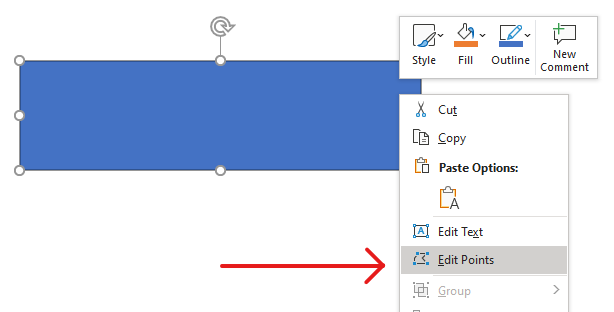
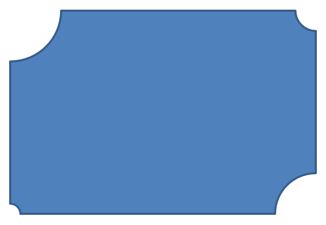

## **บทนำ**

พิจารณาแปลงสี่เหลี่ยมจตุรัสหนึ่งรูป ใน PowerPoint ด้วย **Edit Points** คุณสามารถทำได้ว่า

* ย้ายมุมของแปลง inward หรือ outward,
* ปรับความโค้งของมุมหรือจุด,
* เพิ่มจุดใหม่ให้กับแปลง,
* จัดการจุดของมัน

คุณสามารถใช้การดำเนินการเหล่านี้กับรูปทรงใดก็ได้ ด้วย **Edit Points** คุณสามารถแก้ไขรูปทรงหรือสร้างรูปใหม่จากรูปที่มีอยู่

## **เคล็ดลับการแก้ไขรูปทรง**



ก่อนที่คุณจะเริ่มแก้ไขรูปทรงใน PowerPoint ด้วย **Edit Points** ให้พิจารณาข้อควรจำต่อไปนี้เกี่ยวกับรูปทรง:

* รูปทรง (หรือเส้นทางของมัน) สามารถเป็น **closed** หรือ **open** ได้
* รูปแบบ closed ไม่มีจุดเริ่มต้นหรือจุดสิ้นสุด; รูปแบบ open มีจุดเริ่มต้นและจุดสิ้นสุด
* รูปทรงทุกรูปมีจุดเชื่อมติดตั้งอย่างน้อยสองจุดที่เชื่อมด้วยเส้นส่วน
* เส้นส่วนอาจเป็นเส้นตรงหรือโค้ง; จุดเชื่อมกำหนดลักษณะของเส้นส่วน
* จุดเชื่อมอาจเป็น **corner**, **smooth**, หรือ **straight**:
  * จุด **corner** คือจุดที่เส้นตรงสองเส้นมาบรรจบกันเป็นมุม
  * จุด **smooth** มีสองด้ามที่อยู่บนเส้นตรงเดียวกัน และเส้นส่วนที่เชื่อมต่อกันสร้างโค้งเรียบ ในกรณีนี้ด้ามทั้งสองอยู่ห่างจากจุดเชื่อมเท่ากัน
  * จุด **straight** ก็มีสองด้ามที่อยู่บนเส้นตรงเดียวกัน แต่เส้นส่วนที่เชื่อมต่อกันสร้างโค้งเรียบ ในกรณีนี้ด้ามไม่จำเป็นต้องห่างจากจุดเชื่อมเท่ากัน
* โดยการย้ายหรือแก้ไขจุดเชื่อม (ซึ่งทำให้เปลี่ยนมุมของเส้นส่วน) คุณสามารถเปลี่ยนลักษณะของรูปทรงได้

เพื่อแก้ไขรูปทรงใน PowerPoint Aspose.Slides มีคลาส [GeometryPath](https://reference.aspose.com/slides/th/python-net/aspose.slides/geometrypath/)

* อินสแตนซ์ของ [GeometryPath](https://reference.aspose.com/slides/th/python-net/aspose.slides/geometrypath/) แทนเส้นทางเรขาคณิตของอ็อบเจกต์ [GeometryShape](https://reference.aspose.com/slides/th/python-net/aspose.slides/geometryshape/)
* เพื่อดึง [GeometryPath](https://reference.aspose.com/slides/th/python-net/aspose.slides/geometrypath/) จากอินสแตนซ์ของ [GeometryShape](https://reference.aspose.com/slides/th/python-net/aspose.slides/geometryshape/) ให้ใช้เมธอด [GeometryShape.get_geometry_paths](https://reference.aspose.com/slides/th/python-net/aspose.slides/geometryshape/get_geometry_paths/)
* เพื่อกำหนด [GeometryPath](https://reference.aspose.com/slides/th/python-net/aspose.slides/geometrypath/) ให้กับรูปทรง ให้ใช้ [GeometryShape.set_geometry_path](https://reference.aspose.com/slides/th/python-net/aspose.slides/geometryshape/set_geometry_path/) สำหรับ *solid shapes* และ [GeometryShape.set_geometry_paths](https://reference.aspose.com/slides/th/python-net/aspose.slides/geometryshape/set_geometry_paths/) สำหรับ *composite shapes*
* เพื่อเพิ่มเส้นส่วน ให้ใช้เมธอดบน [GeometryPath](https://reference.aspose.com/slides/th/python-net/aspose.slides/geometrypath/)
* ใช้คุณสมบัติ [GeometryPath.stroke](https://reference.aspose.com/slides/th/python-net/aspose.slides/geometrypath/stroke/) และ [GeometryPath.fill_mode](https://reference.aspose.com/slides/th/python-net/aspose.slides/geometrypath/fill_mode/) เพื่อควบคุมการแสดงผลของเส้นทางเรขาคณิต
* ใช้คุณสมบัติ [GeometryPath.path_data](https://reference.aspose.com/slides/th/python-net/aspose.slides/geometrypath/path_data/) เพื่อดึงเส้นทางเรขาคณิตของรูปทรงเป็นอาเรย์ของเส้นส่วน

## **การดำเนินการแก้ไขพื้นฐาน**

เมธอดต่อไปนี้ใช้สำหรับการดำเนินการแก้ไขพื้นฐาน

**Add a line** to the end of a path:

```py
line_to(point)
line_to(x, y)
```

**Add a line** at a specified position in a path:

```py    
line_to(point, index)
line_to(x, y, index)
```

**Add a cubic Bezier curve** to the end of a path:

```py
cubic_bezier_to(point1, point2, point3)
cubic_bezier_to(x1, y1, x2, y2, x3, y3)
```

**Add a cubic Bezier curve** at a specified position in a path:

```py
cubic_bezier_to(point1, point2, point3, index)
cubic_bezier_to(x1, y1, x2, y2, x3, y3, index)
```

**Add a quadratic Bezier curve** to the end of a path:

```py
quadratic_bezier_to(point1, point2)
quadratic_bezier_to(x1, y1, x2, y2)
```

**Add a quadratic Bezier curve** at a specified position in a path:

```py
quadratic_bezier_to(point1, point2, index)
quadratic_bezier_to(x1, y1, x2, y2, index)
```

**Append an arc** to a path:

```py
arc_to(width, heigth, startAngle, sweepAngle)
```

**Close the current figure** in a path:

```py
close_figure()
```

**Set the position for the next point**:

```py
move_to(point)
move_to(x, y)
```

**Remove the path segment** at a given index:

```py
remove_at(index)
```

## **เพิ่มจุดกำหนดเองให้กับรูปทรง**

ในส่วนนี้คุณจะได้เรียนรู้วิธีกำหนดรูปทรงอิสระโดยการเพิ่มลำดับจุดของคุณเอง โดยการระบุจุดที่เรียงลำดับและประเภทของเส้นส่วน (เส้นตรงหรือเส้นโค้ง) และโดยอาจปิดเส้นทางได้ คุณสามารถวาดกราฟิกกำหนดเองที่แม่นยำ—เช่น รูปหลายเหลี่ยม, ไอคอน, คำอธิบาย, หรือโลโก้—โดยตรงบนสไลด์ของคุณ

1. สร้างอินสแตนซ์ของคลาส [GeometryShape](https://reference.aspose.com/slides/th/python-net/aspose.slides/geometryshape/) และตั้งค่าเป็น [ShapeType.RECTANGLE](https://reference.aspose.com/slides/th/python-net/aspose.slides/shapetype/)
2. ดึงอินสแตนซ์ของ [GeometryPath](https://reference.aspose.com/slides/th/python-net/aspose.slides/geometrypath/) จากรูปทรง
3. ใส่จุดใหม่ระหว่างสองจุดบนสุดของเส้นทาง
4. ใส่จุดใหม่ระหว่างสองจุดล่างสุดของเส้นทาง
5. นำเส้นทางที่อัปเดตไปใช้กับรูปทรง

โค้ด Python ต่อไปนี้แสดงวิธีเพิ่มจุดกำหนดเองให้กับรูปทรง:

```py
import aspose.slides as slides

with slides.Presentation() as presentation:
    slide = presentation.slides[0]

    shape = slide.shapes.add_auto_shape(slides.ShapeType.RECTANGLE, 100, 100, 200, 100)

    geometry_path = shape.get_geometry_paths()[0]
    geometry_path.line_to(100, 50, 1)
    geometry_path.line_to(100, 50, 4)

    shape.set_geometry_path(geometry_path)

    presentation.save("custom_points.pptx", slides.export.SaveFormat.PPTX)
```


##  **ลบจุดออกจากรูปทรง**

บางครั้งรูปทรงกำหนดเองอาจมีจุดที่ไม่จำเป็นทำให้เรขาคณิตซับซ้อนหรือมีผลต่อการเรนเดอร์ ส่วนนี้จะแสดงวิธีลบจุดเฉพาะออกจากเส้นทางของรูปทรง เพื่อให้คุณสามารถทำให้อะแดรสเส้นรอบรูปเรียบง่ายและแม่นยำยิ่งขึ้น

1. สร้างอินสแตนซ์ของคลาส [GeometryShape](https://reference.aspose.com/slides/th/python-net/aspose.slides/geometryshape/) และตั้งค่าเป็นประเภท [ShapeType.HEART](https://reference.aspose.com/slides/th/python-net/aspose.slides/shapetype/)
2. ดึงอินสแตนซ์ของ [GeometryPath](https://reference.aspose.com/slides/th/python-net/aspose.slides/geometrypath/) จากรูปทรง
3. ลบเส้นส่วนออกจากเส้นทาง
4. นำเส้นทางที่อัปเดตไปใช้กับรูปทรง

โค้ด Python ต่อไปนี้แสดงวิธีลบจุดออกจากรูปทรง:

```py
import aspose.slides as slides

with slides.Presentation() as presentation:
    slide = presentation.slides[0]

    shape = slide.shapes.add_auto_shape(slides.ShapeType.HEART, 100, 100, 300, 300)

    path = shape.get_geometry_paths()[0]
    path.remove_at(2)

    shape.set_geometry_path(path)

    presentation.save("removed_points.pptx", slides.export.SaveFormat.PPTX)
```


##  **สร้างรูปทรงกำหนดเอง**

สร้างรูปเวกเตอร์ที่ออกแบบเฉพาะโดยกำหนด [GeometryPath](https://reference.aspose.com/slides/th/python-net/aspose.slides/geometrypath/) และประกอบจากเส้นตรง, วงโค้ง, และเส้นโค้ง Bézier ส่วนนี้แสดงวิธีสร้างเรขาคณิตกำหนดเองจากศูนย์และเพิ่มรูปที่ได้ลงบนสไลด์ของคุณ

1. คำนวณจุดสำหรับรูปทรง
2. สร้างอินสแตนซ์ของคลาส [GeometryPath](https://reference.aspose.com/slides/th/python-net/aspose.slides/geometrypath/)
3. เติมข้อมูลจุดลงในเส้นทาง
4. สร้างอินสแตนซ์ของคลาส [GeometryShape](https://reference.aspose.com/slides/th/python-net/aspose.slides/geometryshape/)
5. นำเส้นทางไปใช้กับรูปทรง

โค้ด Python ต่อไปนี้แสดงวิธีสร้างรูปทรงกำหนดเอง:

```py
import aspose.slides as slides
import aspose.pydrawing as draw
import math

points = []

R = 100
r = 50
step = 72

for angle in range(-90, 270, step):
    radians = angle * (math.pi / 180)
    x = R * math.cos(radians)
    y = R * math.sin(radians)
    points.append(draw.PointF(x + R, y + R))

    radians = math.pi * (angle + step / 2) / 180.0
    x = r * math.cos(radians)
    y = r * math.sin(radians)
    points.append(draw.PointF(x + R, y + R))

star_path = slides.GeometryPath()
star_path.move_to(points[0])

for i in range(len(points)):
    star_path.line_to(points[i])

star_path.close_figure()

with slides.Presentation() as presentation:
    slide = presentation.slides[0]

    shape = slide.shapes.add_auto_shape(slides.ShapeType.RECTANGLE, 100, 100, R * 2, R * 2)
    shape.set_geometry_path(star_path)

    presentation.save("custom_shape.pptx", slides.export.SaveFormat.PPTX)
```


## **สร้างรูปทรงกำหนดเองแบบคอมโพสิต**

การสร้างรูปทรงกำหนดเองแบบคอมโพสิตช่วยให้คุณรวมหลายเส้นทางเรขาคณิตเข้าด้วยกันเป็นรูปเดียวที่สามารถนำกลับมาใช้ซ้ำได้บนสไลด์ กำหนดและผสานเส้นทางเหล่านี้เพื่อสร้างภาพที่ซับซ้อนเกินกว่าชุดรูปมาตรฐาน

1. สร้างอินสแตนซ์ของคลาส [GeometryShape](https://reference.aspose.com/slides/th/python-net/aspose.slides/geometryshape/)
2. สร้างอินสแตนซ์แรกของคลาส [GeometryPath](https://reference.aspose.com/slides/th/python-net/aspose.slides/geometrypath/)
3. สร้างอินสแตนซ์ที่สองของคลาส [GeometryPath](https://reference.aspose.com/slides/th/python-net/aspose.slides/geometrypath/)
4. นำทั้งสองเส้นทางไปใช้กับรูปทรง

โค้ด Python ต่อไปนี้แสดงวิธีสร้างรูปทรงกำหนดเองแบบคอมโพสิต:

```py
import aspose.slides as slides

with slides.Presentation() as presentation:
    slide = presentation.slides[0]

    shape = slide.shapes.add_auto_shape(slides.ShapeType.RECTANGLE, 100, 100, 200, 100)

    geometry_path_0 = slides.GeometryPath()
    geometry_path_0.move_to(0, 0)
    geometry_path_0.line_to(shape.width, 0)
    geometry_path_0.line_to(shape.width, shape.height/3)
    geometry_path_0.line_to(0, shape.height / 3)
    geometry_path_0.close_figure()

    geometry_path_1 = slides.GeometryPath()
    geometry_path_1.move_to(0, shape.height/3 * 2)
    geometry_path_1.line_to(shape.width, shape.height / 3 * 2)
    geometry_path_1.line_to(shape.width, shape.height)
    geometry_path_1.line_to(0, shape.height)
    geometry_path_1.close_figure()

    shape.set_geometry_paths([ geometry_path_0, geometry_path_1])

    presentation.save("composite_shape.pptx", slides.export.SaveFormat.PPTX)
```


## **สร้างรูปทรงกำหนดเองที่มุมโค้งมน**

ส่วนนี้จะแสดงวิธีวาดรูปทรงกำหนดเองที่มุมโค้งมนอย่างนุ่มนวลโดยใช้เส้นทางเรขาคณิต คุณจะผสานเส้นตรงและวงโค้งส่วนวงกลมเพื่อสร้างโครงร่างและเพิ่มรูปที่เสร็จแล้วลงบนสไลด์ของคุณ

โค้ด Python ต่อไปนี้แสดงวิธีสร้างรูปทรงกำหนดเองที่มุมโค้งมน:

```py
import aspose.slides as slides
import aspose.pydrawing as draw

shape_x = 20
shape_y = 20
shape_width = 300
shape_height = 200

left_top_size = 50
right_top_size = 20
right_bottom_size = 40
left_bottom_size = 10

with slides.Presentation() as presentation:
    slide = presentation.slides[0]

    shape = slide.shapes.add_auto_shape(
        slides.ShapeType.CUSTOM, shape_x, shape_y, shape_width, shape_height)

    point1 = draw.PointF(left_top_size, 0)
    point2 = draw.PointF(shape_width - right_top_size, 0)
    point3 = draw.PointF(shape_width, shape_height - right_bottom_size)
    point4 = draw.PointF(left_bottom_size, shape_height)
    point5 = draw.PointF(0, left_top_size)

    geometry_path = slides.GeometryPath()
    geometry_path.move_to(point1)
    geometry_path.line_to(point2)
    geometry_path.arc_to(right_top_size, right_top_size, 180, -90)
    geometry_path.line_to(point3)
    geometry_path.arc_to(right_bottom_size, right_bottom_size, -90, -90)
    geometry_path.line_to(point4)
    geometry_path.arc_to(left_bottom_size, left_bottom_size, 0, -90)
    geometry_path.line_to(point5)
    geometry_path.arc_to(left_top_size, left_top_size, 90, -90)
    geometry_path.close_figure()

    shape.set_geometry_path(geometry_path)

    presentation.save("curved_corners.pptx", slides.export.SaveFormat.PPTX)
```



## **ตรวจสอบว่ารูปทรงของเรขาคณิตเป็น Closed หรือไม่**

รูปทรงที่ปิด (closed) หมายถึงรูปที่ทุกด้านเชื่อมต่อกันครบถ้วนโดยไม่มีช่องว่าง รูปแบบนี้อาจเป็นรูปเรขาคณิตง่ายหรือโครงร่างกำหนดเองที่ซับซ้อน ตัวอย่างโค้ดต่อไปนี้แสดงวิธีตรวจสอบว่ารูปทรงของเรขาคณิตเป็น closed หรือไม่:

```py
def is_geometry_closed(geometry_shape):
    is_closed = None

    for geometry_path in geometry_shape.get_geometry_paths():
        data_length = len(geometry_path.path_data)
        if data_length == 0:
            continue

        last_segment = geometry_path.path_data[data_length - 1]
        is_closed = last_segment.path_command == PathCommandType.CLOSE

        if not is_closed:
            return False

    return is_closed
```

## **FAQ**

**จะเกิดอะไรขึ้นกับการเติมสีและแนวขอบหลังจากเปลี่ยนเรขาคณิต?**

สไตล์จะยังคงอยู่กับรูปทรง; มีเพียงคอนทัวร์ที่เปลี่ยน การเติมสีและแนวขอบจะถูกนำมาใช้โดยอัตโนมัติกับเรขาคณิตใหม่

**ฉันจะหมุนรูปทรงกำหนดเองพร้อมกับเรขาคณิตอย่างถูกต้องได้อย่างไร?**

ใช้คุณสมบัติ [rotation](https://reference.aspose.com/slides/th/python-net/aspose.slides/geometryshape/rotation/) ของรูปทรง; เรขาคณิตจะหมุนพร้อมกับรูปทรงเนื่องจากถูกผูกกับระบบพิกัดของรูปทรงนั้นเอง

**ฉันสามารถแปลงรูปทรงกำหนดเองเป็นภาพเพื่อ “ล็อกผลลัพธ์” ได้หรือไม่?**

ได้. ส่งออกส่วน [slide](/slides/th/python-net/convert-powerpoint-to-png/) ที่ต้องการหรือ [shape](/slides/th/python-net/create-shape-thumbnails/) เองเป็นรูปแบบแรสเตอร์; วิธีนี้จะทำให้การทำงานต่อกับเรขาคณิตที่ซับซ้อนง่ายขึ้น