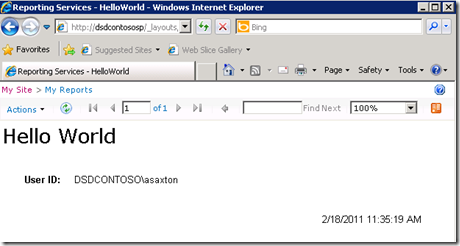

{} 

ขณะนี้ SharePoint ได้รับการติดตั้งและกำหนดค่าในเซิร์ฟเวอร์ RS แล้ว และ RS ได้รับการตั้งค่าผ่าน Reporting Services Configuration Manager เราจึงสามารถไปยังการกำหนดค่าใน Central Admin ได้แล้ว RS 2008 R2 ทำให้กระบวนการนี้ง่ายขึ้นอย่างมาก เราเคยต้องทำขั้นตอน 3 ขั้นตอนเพื่อให้ทำงานได้ ตอนนี้เหลือเพียงขั้นตอนเดียว  

เราต้องการไปที่เว็บไซต์ Central Administrator แล้วเข้าไปที่ General Application Settings ด้านล่างสุดเราจะเห็น Reporting Services. 

{} 

**Figure 17**: การกำหนดค่า SharePoint 

{} 

คลิกที่ **Reporting Services Integration**. 

{} 
## **Web Service URL**
เราจะระบุ URL ของ Report Server ที่พบใน Reporting Services Configuration Manager. 
## **Authentication Mode**
เราจะเลือกโหมดการตรวจสอบสิทธิ์ด้วย . ลิงก์ MSDN ด้านล่างอธิบายรายละเอียดเกี่ยวกับสิ่งเหล่านี้อย่างละเอียด 
[Security Overview for Reporting Services in SharePoint Integrated Mode](https://docs.microsoft.com/en-us/previous-versions/sql/sql-server-2008-r2/bb283324(v=sql.105)) 

โดยสรุป หากไซต์ของคุณใช้ **Claims Authentication** คุณจะต้องใช้ Trusted Authentication เสมอไม่ว่าคุณจะเลือกอะไรที่นี่ หากคุณต้องการส่งข้อมูลประจำตัว Windows คุณควรเลือก Windows Authentication สำหรับ Trusted Authentication เราจะส่ง token ของ SPUser โดยไม่พึ่งพาข้อมูลประจำตัวของ Windows 

คุณควรใช้ Trusted Authentication หากคุณได้กำหนดค่าไซต์ Classic Mode ให้ใช้ NTLM และ RS ถูกตั้งค่าให้ใช้ NTLM . การใช้ Kerberos จำเป็นหากต้องการ Windows Authentication และต้องการส่งผ่านไปยังแหล่งข้อมูลของคุณ. 

**Figure 18**: การตั้งค่า Credential สำหรับ Reporting Services Integration 
## **Activate Feature**
ตัวเลือกนี้ให้คุณเปิดใช้ Reporting Services สำหรับทุก Site collection หรือเลือกเฉพาะที่ต้องการเปิดใช้ นั่นหมายความว่าไซต์ใดจะสามารถใช้ Reporting Services ได้ 
เมื่อเสร็จสิ้น คุณควรเห็นรูปต่อไปนี้. 

**Figure 19**: การบูรณาการ Reporting Services กับสภาพแวดล้อม SharePoint สำเร็จ 

เมื่อกลับไปดู Report Server URL ตามที่แสดงใน Figure 14 เราควรเห็นสิ่งที่คล้ายกับรูปต่อไปนี้. 

**Figure 20**: การตรวจสอบ Reporting Services กับสภาพแวดล้อม SharePoint สำเร็จ 

{} 

หากไซต์ SharePoint ของคุณกำหนดค่าให้ใช้ SSL จะไม่แสดงในรายการนี้ นี่เป็นปัญหาที่ทราบแล้วและไม่ได้หมายความว่ามีข้อผิดพลาด รายงานของคุณยังคงทำงานได้. 

{} 

ตอนนี้เราพร้อมใช้ Reporting Services ใน SharePoint 2010 แล้ว เช่นเดียวกับเวอร์ชันก่อนหน้า เรามีฟีเจอร์ (เปิดใช้เมื่อกำหนดค่า Reporting Services Integration) ใน “Site Collection Feature”. การติดตั้งยังเพิ่ม 3 content type ให้กับไซต์ของเรา ใน Figure 21 เราเห็น 2 content type ที่เพิ่มใน document library เพื่อสร้างรายงานแบบกำหนดเองตามที่แสดงใน Figure 21. 

**Figure 21**: Report Builder 

“**Reporter Builder**” เป็น ActiveX ที่เราต้องดาวน์โหลดบนเซิร์ฟเวอร์ ตามที่เห็นใน Figure 22. 

**Figure 22**: ดาวน์โหลดและติดตั้ง Report Builder 

เมื่อการดาวน์โหลดเสร็จ ให้เรียกใช้ **“Report Builder”** . ตอนนี้เราพร้อมออกแบบรายงานแรกของเรา ตามที่เห็นใน Figure 23. 

**Figure 23**: ตัวช่วยสร้างรายงานใหม่ของ Report Builder 

หลังจากสร้างรายงานแล้ว เราสามารถบันทึกลงใน document library ที่สร้างขึ้นเพื่อเก็บรายงานใน SharePoint 2010. 

Content type อื่นต้องใช้เพื่อสร้างการเชื่อมต่อแชร์เป็นแหล่งข้อมูลและบันทึกไว้ใน document library ใน SharePoint เราสามารถสร้าง document library เพิ่ม content type นี้แล้วใช้การเชื่อมต่อเหล่านั้นเพื่อเปลี่ยนแหล่งข้อมูลของรายงานได้. 

**Figure 24**: ส่งออกรายงานไปยัง Report Server อย่างสำเร็จ