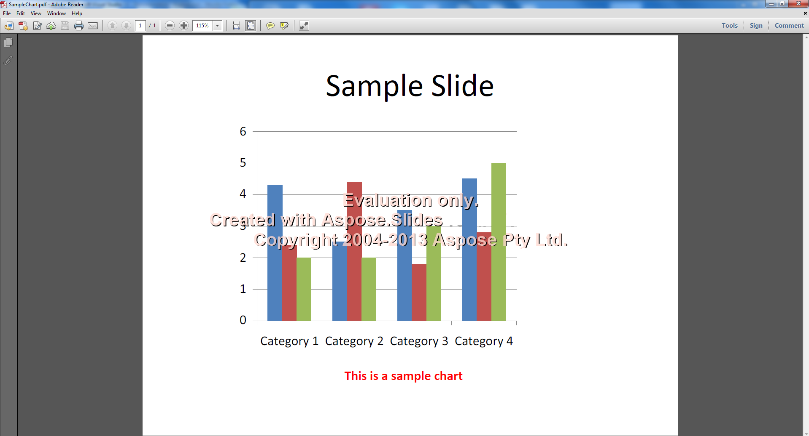

{}

การดาวน์โหลดรุ่นทดลองของ Aspose.Slides for SharePoint เทียบเท่ากับการดาวน์โหลดที่ซื้อแล้ว เมื่อคุณติดตั้งแพ็กเกจโซลูชันลิขสิทธิ์บนฟาร์ม จะกลายเป็นเวอร์ชันที่ได้รับใบอนุญาต; ดู [การติดตั้ง Aspose.Slides for SharePoint License](/slides/th/sharepoint/installing-aspose-slides-for-sharepoint-license/). ไม่มีการใช้โค้ด

หากไม่มีลิขสิทธิ์ Aspose.Slides for SharePoint จะทำการแปลงเป็นทุกรูปแบบที่รองรับ แต่ไฟล์ที่แปลงจะมีลายน้ำรุ่นทดลองและหน้าการแปลงจะแสดงประกาศรุ่นทดลอง

**ลายน้ำรุ่นทดลองในไฟล์ PDF ที่แปลงแล้ว**

{}

{}

หากต้องการทดสอบ Aspose.Slides โดยไม่มีข้อจำกัดของรุ่นทดลอง คุณยังสามารถขอรับลิขสิทธิ์ชั่วคราว 30 วันได้ ดู [วิธีรับลิขสิทธิ์ชั่วคราว?](https://purchase.aspose.com/temporary-license)

{}