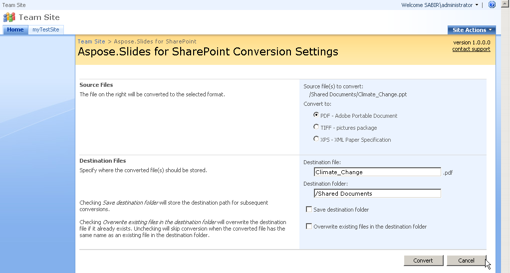

{}

ด้วย Aspose.Slides for SharePoint คุณสามารถแปลงงานนำเสนอ PowerPoint เป็นรูปแบบเอกสารยอดนิยมหลายรูปแบบได้โดยตรงจากไลบรารีเอกสารของ SharePoint

{}

## **รูปแบบไฟล์เข้าแบบที่รองรับ**

Aspose.Slides for SharePoint แปลงรูปแบบไฟล์เข้าเหล่านี้:

- PPT – Microsoft PowerPoint Presentation 97 - 2003
- PPTX – Office Open XML Presentation

{}

เพื่อแปลงเอกสาร Aspose.Slides for SharePoint พึ่งพาเวอร์ชันในตัวของ [Aspose.Slides for .NET](https://products.aspose.com/slides/net/)

{}

## **รูปแบบไฟล์ออกแบบที่รองรับ**

รายการ **Convert to** บนหน้าการแปลงแสดงรูปแบบไฟล์ออกต่อไปนี้ตามลำดับ:

- PDF – Adobe Portable Document
- TIFF – Pictures package
- XPS – XML Paper Specification
- PPS – Slide show presentation
- PPSX – Microsoft PowerPoint Open XML Slide Show
- ODP – OpenDocument presentation
- PPTM – Microsoft PowerPoint Open XML Macro-Enabled Presentation
- PPSM – Microsoft PowerPoint Open XML Macro-Enabled Slide Show
- POTX – Microsoft PowerPoint Template
- POTM – PowerPoint Open XML Macro-Enabled Presentation Template
- PDFNotes – Presentation notes view in PDF format
- HTML – Presentation in HTML format
- TIFFNotes – Presentation notes view as multi-page TIFF image
- SWF – Shockwave Flash Movie
- SWFNotes – Presentation notes view as multi-page SWF

**การเลือกรูปแบบไฟล์ออกบนหน้าการตั้งค่าการแปลง**

ภาพนี้ถ่ายจากเวอร์ชันก่อนหน้า ซึ่งมีเฉพาะรูปแบบ PDF, TIFF และ XPS เท่านั้น