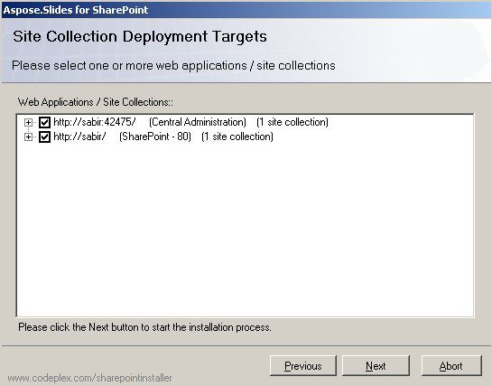

{} 

Aspose.Slides for SharePoint จะถูกดาวน์โหลดเป็นไฟล์บีบอัด Aspose.Slides.SharePoint.zip ไฟล์บีบอัดนี้ประกอบด้วย: 

- **Aspose.Slides.SharePoint.wsp**: ไฟล์โซลูชันของ SharePoint. Aspose.Slides for SharePoint ถูกจัดแพ็คเป็นโซลูชันของ SharePoint เพื่ออำนวยความสะดวกในการเปิดและปิดใช้งานทั่วทั้งฟาร์มเซิร์ฟเวอร์
- **Aspose_LicenseAgreement.rtf**: ข้อตกลงการใช้งานสำหรับผู้ใช้สุดท้าย
- **Setup.exe**: โปรแกรมติดตั้ง
- **Setup.exe.config**: ไฟล์การกำหนดค่าการติดตั้ง

{} 
## **ขั้นตอนการติดตั้ง**
ก่อนทำการติดตั้ง โปรแกรมตั้งค่าสามารถตรวจสอบว่า:

- WSS 3.0 หรือ MOSS 2007 ถูกติดตั้งอยู่
- ผู้ใช้มีสิทธิ์ในการติดตั้งโซลูชันของ SharePoint
- ฐานข้อมูล SharePoint อยู่ในสถานะออนไลน์
- บริการ WSS Administration ทำงานอยู่
- บริการ WSS Timer ทำงานอยู่

บริการ WSS Administration และ Timer จำเป็นต้องมีเพราะบางการกระทำของการติดตั้งอาศัยงานด้านเวลา (timer job) เพื่อกระจายไปยังเซิร์ฟเวอร์ทั้งหมดในฟาร์มเซิร์ฟเวอร์ 
### **การทำงานของการติดตั้ง**
เพื่อทำการติดตั้ง Aspose.Slides for SharePoint: 

1. แตกไฟล์ Aspose.Slides.SharePoint zip ไปยังไดรฟ์ท้องถิ่นบนเซิร์ฟเวอร์ MOSS 7.0 หรือ WSS 3.0
2. เรียกใช้ setup.exe และทำตามคำแนะนำบนหน้าจอ
   โปรแกรมติดตั้งจะดำเนินการต่อไปนี้: 
   1. ตรวจสอบเงื่อนไขเบื้องต้นของการติดตั้ง หากการตรวจสอบใดล้มเหลว โปรแกรมตั้งค่าจะไม่ดำเนินต่อ 

      **กำลังตรวจสอบระบบ** 

3. แสดงข้อตกลงการใช้งานสำหรับผู้ใช้สุดท้าย คุณต้องยอมรับข้อตกลงเพื่อดำเนินการต่อ 

   **ข้อตกลงการใช้งาน** 

4. แสดงการเลือกเป้าหมายการปรับใช้ เลือกเว็บแอปพลิเคชันและคอลเลกชันไซต์ที่คุณต้องการเปิดใช้ฟีเจอร์ 

   **การเลือกเป้าหมายการปรับใช้** 

5. ปรับใช้ฟีเจอร์ไปยังฟาร์มเซิร์ฟเวอร์ 

   **แถบความคืบหน้าการติดตั้ง** 

6. เปิดใช้งาน Aspose.Slides สำหรับคอลเลกชันไซต์ที่เลือกและกำหนดค่าของเว็บแอปพลิเคชันแม่ของพวกมัน
7. แสดงรายการเว็บแอปพลิเคชันและคอลเลกชันไซต์ที่ฟีเจอร์ได้ถูกปรับใช้และเปิดใช้งานแล้ว 

   **การติดตั้งสำเร็จ** 

