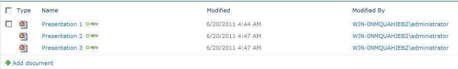

ห้องสมุดเป็นโครงสร้างเนื้อหาที่บรรจุไฟล์. ห้องสมุดอาจบรรจุไฟล์ประเภทเดียวหรือหลายประเภทที่แตกต่างกัน รวมถึงเอกสาร, ตารางคำนวณ, และงานนำเสนอ. ห้องสมุด SharePoint สร้างตำแหน่งเดียวที่ผู้ใช้สามารถอัปโหลดและเข้าถึงเอกสารได้. เอกสารถูกจัดเก็บในรูปแบบไบนารีในฐานข้อมูล SQL Server ที่ใช้โดยไซต์ SharePoint. เอกสารเหล่านี้พร้อมให้ผู้ใช้ SharePoint คนอื่นเข้าถึงในรูปแบบรายการลิงก์. 

**ห้องสมุดเอกสาร SharePoint** 

