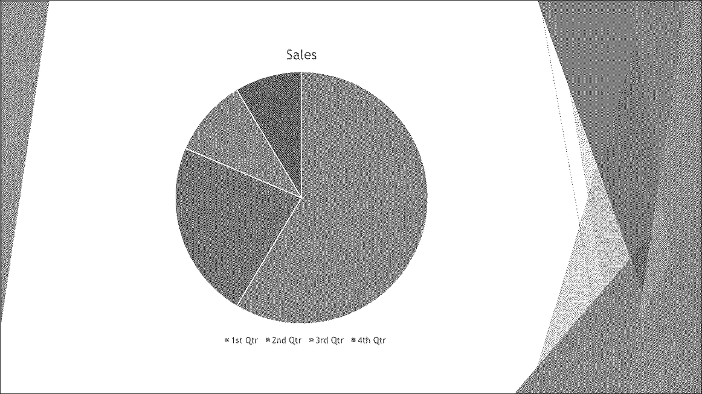

## **Giriş**

TIFF (**Tagged Image File Format**) bir raster görüntü formatıdır ve birden fazla sayfa ve kayıpsız sıkıştırma destekler. Tek bir görüntü dosyasında işlenmiş slaytları saklamak için kullanışlıdır.

Aspose.Slides for Python via Java kullanarak PowerPoint (PPT, PPTX) ve OpenDocument (ODP) sunumlarını TIFF'e dönüştürebilirsiniz. Aşağıdaki her örnek gerektiğinde Java sanal makinesini başlatır ve kullanım sonrası sunumu serbest bırakır. 

## **Sunumu TIFF'ye Dönüştür**

[Presentation] sınıfı tarafından sağlanan [kaydet](https://reference.aspose.com/slides/tr/python-java/aspose.slides/presentation/#save) yöntemi kullanılarak bir PowerPoint sunumunun tamamını hızlıca TIFF'e dönüştürebilirsiniz. Oluşan çok sayfalı TIFF, varsayılan boyutta her slaytın işlenmiş görüntüsünü içerir.

Bu kod, bir PowerPoint sunumunu TIFF'e nasıl dönüştüreceğinizi gösterir:

```python
import jpype
import asposeslides

if not jpype.isJVMStarted():
    jpype.startJVM()

from asposeslides.api import Presentation, SaveFormat

presentation = Presentation("presentation.pptx")
try:
    # Tüm slaytları çok sayfalı bir TIFF dosyasına kaydet.
    presentation.save("output.tiff", SaveFormat.Tiff)
finally:
    presentation.dispose()
```

## **Sunumu Siyah-Beyaz TIFF'ye Dönüştür**

[TiffOptions] sınıfındaki [setBwConversionMode](https://reference.aspose.com/slides/tr/python-java/aspose.slides/tiffoptions/#setBwConversionMode) yöntemi, renkli bir slaytı veya görüntüyü siyah-beyaz TIFF'e dönüştürürken kullanılacak algoritmayı belirlemenizi sağlar. Bu ayarın yalnızca [setCompressionType](https://reference.aspose.com/slides/tr/python-java/aspose.slides/tiffoptions/#setCompressionType) yöntemi [TiffCompressionTypes.CCITT4](https://reference.aspose.com/slides/tr/python-java/aspose.slides/tiffcompressiontypes/#CCITT4) veya [TiffCompressionTypes.CCITT3](https://reference.aspose.com/slides/tr/python-java/aspose.slides/tiffcompressiontypes/#CCITT3) olarak ayarlandığında geçerli olduğunu unutmayın.

{}

[TiffOptions.setBwConversionMode](https://reference.aspose.com/slides/tr/python-java/aspose.slides/tiffoptions/#setBwConversionMode) dışa aktarma seviyesi bir ayardır ve tam TIFF görüntüsü için bir piksel dönüştürme algoritması seçer. Siyah-beyaz gösterim modu etkin olduğunda bireysel bir şeklin nasıl görüneceğini belirlemek için [Shape.setBlackWhiteMode](https://reference.aspose.com/slides/tr/python-java/aspose.slides/shape/#setBlackWhiteMode) yöntemini kullanın. Örnekler için [Control Black-and-White Rendering for Shapes](/slides/tr/python-java/shape-formatting/#control-black-and-white-rendering-for-shapes) bağlantısına bakın.

{}

Örneğin, aşağıdaki slaytı içeren bir "sample.pptx" dosyamız olduğunu varsayalım:


Bu kod, renkli slaytı siyah-beyaz TIFF'e nasıl dönüştüreceğinizi gösterir:

```python
import jpype
import asposeslides

if not jpype.isJVMStarted():
    jpype.startJVM()

from asposeslides.api import BlackWhiteConversionMode, Presentation, SaveFormat, TiffCompressionTypes, TiffOptions

tiff_options = TiffOptions()
tiff_options.setCompressionType(TiffCompressionTypes.CCITT4)
tiff_options.setBwConversionMode(BlackWhiteConversionMode.Dithering)

presentation = Presentation("sample.pptx")
try:
    presentation.save("output.tiff", SaveFormat.Tiff, tiff_options)
finally:
    presentation.dispose()
```

Sonuç:



## **Sunumu Özel Boyutlu TIFF'ye Dönüştür**

Belirli boyutlarda bir TIFF görüntüsü gerekiyorsa, istediğiniz değerleri [TiffOptions](https://reference.aspose.com/slides/tr/python-java/aspose.slides/tiffoptions/) sınıfında mevcut yöntemleri kullanarak ayarlayabilirsiniz. Örneğin, [setImageSize](https://reference.aspose.com/slides/tr/python-java/aspose.slides/tiffoptions/#setImageSize) yöntemi oluşan görüntünün boyutunu tanımlamanıza olanak verir.

Bu kod, bir PowerPoint sunumunu özel boyutlu TIFF görüntülerine nasıl dönüştüreceğinizi gösterir:

```python
import jpype
import asposeslides

if not jpype.isJVMStarted():
    jpype.startJVM()

from asposeslides.api import NotesCommentsLayoutingOptions, NotesPositions, Presentation, SaveFormat, TiffCompressionTypes, TiffOptions
from java.awt import Dimension

presentation = Presentation("presentation.pptx")
try:
    tiff_options = TiffOptions()
    tiff_options.setCompressionType(TiffCompressionTypes.Default)

    # Yatay ve dikey çözünürlüğü ayarla.
    tiff_options.setDpiX(200)
    tiff_options.setDpiY(200)

    # Çıktı boyutlarını piksel olarak ayarla.
    image_size = Dimension(1728, 1078)
    tiff_options.setImageSize(image_size)

    # Her slaydın altında tam konuşmacı notlarını ekle.
    notes_options = NotesCommentsLayoutingOptions()
    notes_options.setNotesPosition(NotesPositions.BottomFull)
    tiff_options.setSlidesLayoutOptions(notes_options)

    presentation.save("tiff-ImageSize.tiff", SaveFormat.Tiff, tiff_options)
finally:
    presentation.dispose()
```

## **Sunumu Özel Görüntü Piksel Biçimiyle TIFF'ye Dönüştür**

[TiffOptions] sınıfından [setPixelFormat](https://reference.aspose.com/slides/tr/python-java/aspose.slides/tiffoptions/#setPixelFormat) yöntemini kullanarak, oluşan TIFF görüntüsü için tercih ettiğiniz piksel biçimini belirtebilirsiniz.

Bu kod, bir PowerPoint sunumunu özel piksel biçimli bir TIFF görüntüsüne nasıl dönüştüreceğinizi gösterir:

```python
import jpype
import asposeslides

if not jpype.isJVMStarted():
    jpype.startJVM()

from asposeslides.api import ImagePixelFormat, Presentation, SaveFormat, TiffOptions

presentation = Presentation("presentation.pptx")
try:
    tiff_options = TiffOptions()
    tiff_options.setPixelFormat(ImagePixelFormat.Format8bppIndexed)

    presentation.save("Tiff-PixelFormat.tiff", SaveFormat.Tiff, tiff_options)
finally:
    presentation.dispose()
```

{}

Aspose'un [Ücretsiz PowerPoint'ten Poster dönüştürücü](https://products.aspose.app/slides/tr/conversion/convert-ppt-to-poster-online) bağlantısına göz atın.

{}

## **SSS**

**Bir PowerPoint sunumunun tamamı yerine yalnızca tek bir slaytı TIFF'e dönüştürebilir miyim?**

Evet. Aspose.Slides, PowerPoint ve OpenDocument sunumlarından bireysel slaytları ayrı ayrı TIFF görüntülerine dönüştürmenize olanak tanır.

**Sunumu TIFF'e dönüştürürken slayt sayısında bir limit var mı?**

TIFF dışa aktarımı için sabit bir slayt sayısı limiti yoktur. Kullanılabilir bellek, slayt karmaşıklığı ve çıktı boyutları işleyebileceğiniz sunumların büyüklüğünü etkiler.

**PowerPoint animasyonları ve geçiş efektleri slaytların TIFF'e dönüştürülürken korunur mu?**

Hayır, TIFF statik bir görüntü formatıdır. Bu nedenle animasyonlar ve geçiş efektleri korunmaz; sadece slaytların statik anlık görüntüleri dışa aktarılır.