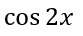

## **Genel Bakış**

PowerPoint, denklemleri Office Math Markup Language (OMML) olarak depolar. Aspose.Slides for Python via Java ile aynı tür matematik içeriğini programlı olarak oluşturabilirsiniz: kesirler, kökler, fonksiyonlar, limitler, N-ary operatörler, matrisler, diziler ve biçimlendirilmiş matematik blokları.

PowerPoint’te kullanıcılar genellikle **Ekle > Denklem** menüsünden denklem ekler:


Sonuç, slaytta düzenlenebilir bir matematik metni olur:


Aspose.Slides bu matematik metnini üç ana nesne aracılığıyla oluşturur:

- [addMathShape](https://reference.aspose.com/slides/tr/python-java/aspose.slides/shapecollection/#addMathShape) ile oluşturulan bir matematik şekli, denklemi içerir.
- [MathPortion](https://reference.aspose.com/slides/tr/python-java/aspose.slides/mathportion/) şeklin metin çerçevesi içinde matematik içeriğini saklar.
- [MathParagraph](https://reference.aspose.com/slides/tr/python-java/aspose.slides/mathparagraph/) bir veya daha fazla [MathBlock](https://reference.aspose.com/slides/tr/python-java/aspose.slides/mathblock/) nesnesi içerir.

Aşağıdaki çoğu örnek, kodu kısa ve okunabilir tutmak için [MathematicalText](https://reference.aspose.com/slides/tr/python-java/aspose.slides/mathematicaltext/) ve [MathElementBase](https://reference.aspose.com/slides/tr/python-java/aspose.slides/mathelementbase/) akıcı yöntemlerini kullanır.

MathML dışa aktarma senaryoları için, bakınız [Export Math Equations from Presentations in Python](/slides/tr/python-java/exporting-math-equations/).

## **Denklem Oluşturma**

Bu örnek bir matematik şekli oluşturur ve Pisagor teoremini ekler:


```python
import jpype
import asposeslides

if not jpype.isJVMStarted():
    jpype.startJVM()

from asposeslides.api import MathematicalText, Presentation, SaveFormat

presentation = Presentation()
try:
    slide = presentation.getSlides().get_Item(0)

    math_shape = slide.getShapes().addMathShape(20, 20, 700, 120)
    math_paragraph = math_shape.getTextFrame().getParagraphs().get_Item(0).getPortions().get_Item(0).getMathParagraph()

    a_squared = MathematicalText("a").setSuperscript("2")
    b_squared = MathematicalText("b").setSuperscript("2")
    equation = MathematicalText("c").setSuperscript("2").join("=").join(a_squared).join("+").join(b_squared)

    math_paragraph.add(equation)

    presentation.save("pythagorean-theorem.pptx", SaveFormat.Pptx)
finally:
    presentation.dispose()
```

{}

[addMathShape](https://reference.aspose.com/slides/tr/python-java/aspose.slides/shapecollection/#addMathShape) zaten bir matematik paragrafı içeren bir şekil oluşturur. İlk [MathPortion] öğesine erişin, onun [MathParagraph] öğesini alın ve ona matematik blokları ya da matematik öğeleri ekleyin.

{}

## **Kesir Ekleme**

Kesir oluşturmak için [divide](https://reference.aspose.com/slides/tr/python-java/aspose.slides/mathelementbase/#divide) kullanın. Kesir stilini [MathFractionTypes](https://reference.aspose.com/slides/tr/python-java/aspose.slides/mathfractiontypes/) ile seçebilirsiniz.


```python
import jpype
import asposeslides

if not jpype.isJVMStarted():
    jpype.startJVM()

from asposeslides.api import MathBlock, MathFractionTypes, MathematicalText, Presentation, SaveFormat

presentation = Presentation()
try:
    slide = presentation.getSlides().get_Item(0)

    math_shape = slide.getShapes().addMathShape(20, 20, 700, 100)
    math_paragraph = math_shape.getTextFrame().getParagraphs().get_Item(0).getPortions().get_Item(0).getMathParagraph()

    fraction = MathematicalText("1").divide("x", MathFractionTypes.Skewed)

    math_block = MathBlock(fraction)
    math_paragraph.add(math_block)

    presentation.save("fraction.pptx", SaveFormat.Pptx)
finally:
    presentation.dispose()
```

Yığılmış bir kesir için [MathFractionTypes.Bar](https://reference.aspose.com/slides/tr/python-java/aspose.slides/mathfractiontypes/#Bar) kullanın:

```python
import jpype
import asposeslides

if not jpype.isJVMStarted():
    jpype.startJVM()

from asposeslides.api import MathFractionTypes, MathematicalText

stacked_fraction = MathematicalText("x + 1").divide("y - 1", MathFractionTypes.Bar)
```

## **Kökler Ekleme**

Karekök, küpkök veya diğer kökleri oluşturmak için [radical](https://reference.aspose.com/slides/tr/python-java/aspose.slides/mathelementbase/#radical) kullanın. Mevcut öğe taban olur, argüman ise derece olur.


```python
import jpype
import asposeslides

if not jpype.isJVMStarted():
    jpype.startJVM()

from asposeslides.api import MathBlock, MathematicalText, Presentation, SaveFormat

presentation = Presentation()
try:
    slide = presentation.getSlides().get_Item(0)

    math_shape = slide.getShapes().addMathShape(20, 20, 700, 100)
    math_paragraph = math_shape.getTextFrame().getParagraphs().get_Item(0).getPortions().get_Item(0).getMathParagraph()

    radical = MathematicalText("x").radical("n")

    math_block = MathBlock(radical)
    math_paragraph.add(math_block)

    presentation.save("radical.pptx", SaveFormat.Pptx)
finally:
    presentation.dispose()
```

## **Fonksiyonlar ve Limitler Ekleme**

`sin(x)`, `log(x)` gibi fonksiyonlar ya da özel fonksiyon adları için [asArgumentOfFunction](https://reference.aspose.com/slides/tr/python-java/aspose.slides/mathelementbase/#asArgumentOfFunction) veya [function](https://reference.aspose.com/slides/tr/python-java/aspose.slides/mathelementbase/#function) kullanın. Limitler için `lim` ifadesini bir [MathLimit](https://reference.aspose.com/slides/tr/python-java/aspose.slides/mathlimit/) içine koyun ya da [setLowerLimit](https://reference.aspose.com/slides/tr/python-java/aspose.slides/mathelementbase/#setLowerLimit) kullanın.


```python
import jpype
import asposeslides

if not jpype.isJVMStarted():
    jpype.startJVM()

from asposeslides.api import MathBlock, MathematicalText, Presentation, SaveFormat

presentation = Presentation()
try:
    slide = presentation.getSlides().get_Item(0)

    math_shape = slide.getShapes().addMathShape(20, 20, 700, 100)
    math_paragraph = math_shape.getTextFrame().getParagraphs().get_Item(0).getPortions().get_Item(0).getMathParagraph()

    limit = MathematicalText("lim").setLowerLimit("x\u2192\u221E").function("x")

    math_block = MathBlock(limit)
    math_paragraph.add(math_block)

    presentation.save("functions-and-limits.pptx", SaveFormat.Pptx)
finally:
    presentation.dispose()
```

Özel bir fonksiyon adı için fonksiyon adını mevcut öğe yapın:

```python
import jpype
import asposeslides

if not jpype.isJVMStarted():
    jpype.startJVM()

from asposeslides.api import MathematicalText

custom_function = MathematicalText("f").function("x + 1")
```

## **N-ary Operatörler ve İntegraller Ekleme**

Toplamalar, birleşimler, kesişimler ve diğer büyük operatörler için [nary](https://reference.aspose.com/slides/tr/python-java/aspose.slides/mathelementbase/#nary) kullanın. İntegraller için [integral](https://reference.aspose.com/slides/tr/python-java/aspose.slides/mathelementbase/#integral) kullanın. Her iki yöntem de alt ve üst limitleri ayarlamanıza olanak tanır.


```python
import jpype
import asposeslides

if not jpype.isJVMStarted():
    jpype.startJVM()

from asposeslides.api import MathBlock, MathNaryOperatorTypes, MathematicalText, Presentation, SaveFormat

presentation = Presentation()
try:
    slide = presentation.getSlides().get_Item(0)

    math_shape = slide.getShapes().addMathShape(20, 20, 700, 120)
    math_paragraph = math_shape.getTextFrame().getParagraphs().get_Item(0).getPortions().get_Item(0).getMathParagraph()

    a_power = MathematicalText("a").setSuperscript("n-k")
    summation_base = MathematicalText("x").setSuperscript("k").join(a_power)

    summation = summation_base.nary(MathNaryOperatorTypes.Summation, "k=0", "n")

    math_block = MathBlock(summation)
    math_paragraph.add(math_block)

    presentation.save("nary-operators.pptx", SaveFormat.Pptx)
finally:
    presentation.dispose()
```

N-ary operatörler, isteğe bağlı limitleri olan büyük operatörler içindir. `+`, `-`, `=` gibi basit operatörler genellikle [MathematicalText](https://reference.aspose.com/slides/tr/python-java/aspose.slides/mathematicaltext/) olarak eklenir ve ifadeye katılır.

Bir integral için [integral] kullanın:

```python
import jpype
import asposeslides

if not jpype.isJVMStarted():
    jpype.startJVM()

from asposeslides.api import MathIntegralTypes, MathematicalText

differential = MathematicalText("dx").toBox()
integral_base = MathematicalText("x").join(differential)
integral = integral_base.integral(MathIntegralTypes.Simple, "0", "1")
```

## **Matrisler Ekleme**

Satır ve sütunlar için [MathMatrix](https://reference.aspose.com/slides/tr/python-java/aspose.slides/mathmatrix/) kullanın. Matrisler varsayılan olarak köşeli parantez içermez; bu yüzden parantez, köşeli parantez ya da süslü parantez gerektiğinde matrisi kendiniz kapsayın.


```python
import jpype
import asposeslides

if not jpype.isJVMStarted():
    jpime.startJVM()

from asposeslides.api import MathBlock, MathMatrix, MathematicalText, Presentation, SaveFormat

presentation = Presentation()
try:
    slide = presentation.getSlides().get_Item(0)

    math_shape = slide.getShapes().addMathShape(20, 20, 700, 120)
    math_paragraph = math_shape.getTextFrame().getParagraphs().get_Item(0).getPortions().get_Item(0).getMathParagraph()

    matrix = MathMatrix(2, 3)
    cell_0_0 = MathematicalText("1")
    matrix.set_Item(0, 0, cell_0_0)
    cell_0_1 = MathematicalText("x")
    matrix.set_Item(0, 1, cell_0_1)
    cell_1_0 = MathematicalText("x")
    matrix.set_Item(1, 0, cell_1_0)
    cell_1_1 = MathematicalText("2")
    matrix.set_Item(1, 1, cell_1_1)
    cell_1_2 = MathematicalText("y")
    matrix.set_Item(1, 2, cell_1_2)

    math_block = MathBlock(matrix)
    math_paragraph.add(math_block)

    presentation.save("matrix.pptx", SaveFormat.Pptx)
finally:
    presentation.dispose()
```

## **Denklem Dizileri Ekleme**

Hizalanmış denklemler ya da dikey olarak istiflenmiş ifadeler gerektiğinde [toMathArray](https://reference.aspose.com/slides/tr/python-java/aspose.slides/mathelementbase/#toMathArray) kullanın.


```python
import jpype
import asposeslides

if not jpype.isJVMStarted():
    jpype.startJVM()

from asposeslides.api import MathBlock, MathematicalText, Presentation, SaveFormat

presentation = Presentation()
try:
    slide = presentation.getSlides().get_Item(0)

    math_shape = slide.getShapes().addMathShape(20, 20, 700, 140)
    math_paragraph = math_shape.getTextFrame().getParagraphs().get_Item(0).getPortions().get_Item(0).getMathParagraph()

    equation_array = MathematicalText("x").join("y").toMathArray()

    math_block = MathBlock(equation_array)
    math_paragraph.add(math_block)

    presentation.save("equation-array.pptx", SaveFormat.Pptx)
finally:
    presentation.dispose()
```

## **Trigonometrik Fonksiyonlar Ekleme**

Argüman mevcut öğe olduğunda ve fonksiyon adı bilindiğinde [asArgumentOfFunction](https://reference.aspose.com/slides/tr/python-java/aspose.slides/mathelementbase/#asArgumentOfFunction) kullanın.



```python
import jpype
import asposeslides

if not jpype.isJVMStarted():
    jpype.startJVM()

from asposeslides.api import MathBlock, MathFunctionsOfOneArgument, MathematicalText, Presentation, SaveFormat

presentation = Presentation()
try:
    slide = presentation.getSlides().get_Item(0)

    math_shape = slide.getShapes().addMathShape(20, 20, 700, 100)
    math_paragraph = math_shape.getTextFrame().getParagraphs().get_Item(0).getPortions().get_Item(0).getMathParagraph()

    cosine = MathematicalText("2x").asArgumentOfFunction(MathFunctionsOfOneArgument.Cos)

    math_block = MathBlock(cosine)
    math_paragraph.add(math_block)

    presentation.save("trigonometric-function.pptx", SaveFormat.Pptx)
finally:
    presentation.dispose()
```

## **Alt Simge ve Üst Simge Ekleme**

İndeksler ve üsler için alt simge ve üst simge yardımcılarını kullanın. İndekslerin tabanın sol tarafında görünmesi gerektiğinde [setSubSuperscriptOnTheLeft](https://reference.aspose.com/slides/tr/python-java/aspose.slides/mathelementbase/#setSubSuperscriptOnTheLeft) kullanın.


```python
import jpype
import asposeslides

if not jpype.isJVMStarted():
    jpype.startJVM()

from asposeslides.api import MathBlock, MathematicalText, Presentation, SaveFormat

presentation = Presentation()
try:
    slide = presentation.getSlides().get_Item(0)

    math_shape = slide.getShapes().addMathShape(20, 20, 700, 100)
    math_paragraph = math_shape.getTextFrame().getParagraphs().get_Item(0).getPortions().get_Item(0).getMathParagraph()

    scripts = MathematicalText("Y").setSubSuperscriptOnTheLeft("1", "n")

    math_block = MathBlock(scripts)
    math_paragraph.add(math_block)

    presentation.save("subscript-superscript.pptx", SaveFormat.Pptx)
finally:
    presentation.dispose()
```

## **Sınırlayıcılar Ekleme**

Bir ifadeyi sınırlayıcılar içine koymak için [enclose](https://reference.aspose.com/slides/tr/python-java/aspose.slides/mathelementbase/#enclose) kullanın. Birden fazla öğe içeren sınırlayıcı ifadeler için ayırıcı karakter de ayarlayabilirsiniz.


```python
import jpype
import asposeslides

if not jpype.isJVMStarted():
    jpype.startJVM()

from asposeslides.api import MathBlock, MathematicalText, Presentation, SaveFormat

presentation = Presentation()
try:
    slide = presentation.getSlides().get_Item(0)

    math_shape = slide.getShapes().addMathShape(20, 20, 700, 100)
    math_paragraph = math_shape.getTextFrame().getParagraphs().get_Item(0).getPortions().get_Item(0).getMathParagraph()

    delimiter = MathematicalText("x").join("y").join("z").enclose('<', '>')
    delimiter.setSeparatorCharacter('|')

    math_block = MathBlock(delimiter)
    math_paragraph.add(math_block)

    presentation.save("delimiters.pptx", SaveFormat.Pptx)
finally:
    presentation.dispose()
```

## **Kenar Kutusu Ekleme**

Denklemin kendisinin bir çerçeve içinde gösterilmesi gerektiğinde [toBorderBox](https://reference.aspose.com/slides/tr/python-java/aspose.slides/mathelementbase/#toBorderBox) kullanın.


```python
import jpype
import asposeslides

if not jpype.isJVMStarted():
    jpype.startJVM()

from asposeslides.api import MathBlock, MathematicalText, Presentation, SaveFormat

presentation = Presentation()
try:
    slide = presentation.getSlides().get_Item(0)

    math_shape = slide.getShapes().addMathShape(20, 20, 700, 100)
    math_paragraph = math_shape.getTextFrame().getParagraphs().get_Item(0).getPortions().get_Item(0).getMathParagraph()

    b_squared = MathematicalText("b").setSuperscript("2")
    c_squared = MathematicalText("c").setSuperscript("2")
    boxed_equation = MathematicalText("a").setSuperscript("2").join("=").join(b_squared).join("+").join(c_squared).toBorderBox()

    math_block = MathBlock(boxed_equation)
    math_paragraph.add(math_block)

    presentation.save("border-box.pptx", SaveFormat.Pptx)
finally:
    presentation.dispose()
```

## **Terimleri Gruplama**

İfadeyi yukarı ya da aşağı bir gruplayıcı karakterle sarmak için [group](https://reference.aspose.com/slides/tr/python-java/aspose.slides/mathelementbase/#group) kullanın. Gruplanan terimleri etiketlemek için bir limit ekleyin.


```python
import jpype
import asposeslides

if not jpype.isJVMStarted():
    jpype.startJVM()

from asposeslides.api import MathBlock, MathTopBotPositions, MathematicalText, Presentation, SaveFormat

presentation = Presentation()
try:
    slide = presentation.getSlides().get_Item(0)

    math_shape = slide.getShapes().addMathShape(20, 20, 700, 120)
    math_paragraph = math_shape.getTextFrame().getParagraphs().get_Item(0).getPortions().get_Item(0).getMathParagraph()

    grouped = MathematicalText("x + y").group('\u23DF', MathTopBotPositions.Bottom, MathTopBotPositions.Top).setLowerLimit("any text")

    math_block = MathBlock(grouped)
    math_paragraph.add(math_block)

    presentation.save("grouped-terms.pptx", SaveFormat.Pptx)
finally:
    presentation.dispose()
```

## **Matematik Öğelerini Biçimlendirme**

Biçimlendirme yardımcılarını yalnızca formülü netleştirdiği durumlarda kullanın. Örneğin, [overbar](https://reference.aspose.com/slides/tr/python-java/aspose.slides/mathelementbase/#overbar) bir matematik öğesinin üstüne bir çubuk ekler.


```python
import jpype
import asposeslides

if not jpype.isJVMStarted():
    jpype.startJVM()

from asposeslides.api import MathBlock, MathematicalText, Presentation, SaveFormat

presentation = Presentation()
try:
    slide = presentation.getSlides().get_Item(0)

    math_shape = slide.getShapes().addMathShape(20, 20, 700, 100)
    math_paragraph = math_shape.getTextFrame().getParagraphs().get_Item(0).getPortions().get_Item(0).getMathParagraph()

    overbar = MathematicalText("ABC").overbar()

    math_block = MathBlock(overbar)
    math_paragraph.add(math_block)

    presentation.save("overbar.pptx", SaveFormat.Pptx)
finally:
    presentation.dispose()
```

## **Hızlı Başvuru**

| Görev | Ana API |
| --- | --- |
| Matematik metni oluşturma | [MathematicalText](https://reference.aspose.com/slides/tr/python-java/aspose.slides/mathematicaltext/) |
| Öğeleri birleştirme | [MathElementBase.join](https://reference.aspose.com/slides/tr/python-java/aspose.slides/mathelementbase/#join) |
| Kesir oluşturma | [MathElementBase.divide](https://reference.aspose.com/slides/tr/python-java/aspose.slides/mathelementbase/#divide) |
| Üst/Alt simge ekleme | [setSuperscript](https://reference.aspose.com/slides/tr/python-java/aspose.slides/mathelementbase/#setSuperscript), [setSubscript](https://reference.aspose.com/slides/tr/python-java/aspose.slides/mathelementbase/#setSubscript) |
| Fonksiyon ekleme | [function](https://reference.aspose.com/slides/tr/python-java/aspose.slides/mathelementbase/#function), [asArgumentOfFunction](https://reference.aspose.com/slides/tr/python-java/aspose.slides/mathelementbase/#asArgumentOfFunction) |
| Kök ekleme | [MathElementBase.radical](https://reference.aspose.com/slides/tr/python-java/aspose.slides/mathelementbase/#radical) |
| Limit ekleme | [setLowerLimit](https://reference.aspose.com/slides/tr/python-java/aspose.slides/mathelementbase/#setLowerLimit), [setUpperLimit](https://reference.aspose.com/slides/tr/python-java/aspose.slides/mathelementbase/#setUpperLimit) |
| Sol taraflı script ekleme | [setSubSuperscriptOnTheLeft](https://reference.aspose.com/slides/tr/python-java/aspose.slides/mathelementbase/#setSubSuperscriptOnTheLeft) |
| Toplam ve integral ekleme | [nary](https://reference.aspose.com/slides/tr/python-java/aspose.slides/mathelementbase/#nary), [integral](https://reference.aspose.com/slides/tr/python-java/aspose.slides/mathelementbase/#integral) |
| Matris ekleme | [MathMatrix](https://reference.aspose.com/slides/tr/python-java/aspose.slides/mathmatrix/) |
| Denklem dizileri ekleme | [toMathArray](https://reference.aspose.com/slides/tr/python-java/aspose.slides/mathelementbase/#toMathArray) |
| Sınırlayıcı ekleme | [enclose](https://reference.aspose.com/slides/tr/python-java/aspose.slides/mathelementbase/#enclose) |
| Çubuk ve kenar ekleme | [overbar](https://reference.aspose.com/slides/tr/python-java/aspose.slides/mathelementbase/#overbar), [toBorderBox](https://reference.aspose.com/slides/tr/python-java/aspose.slides/mathelementbase/#toBorderBox) |
| Terimleri gruplama | [group](https://reference.aspose.com/slides/tr/python-java/aspose.slides/mathelementbase/#group) |

## **SSS**

**Mevcut bir PowerPoint denklemini düzenleyebilir miyim?**

Evet. Sunumu açın, bir [MathPortion] içeren şekli bulun, onun [MathParagraph] öğesini alın ve o paragraftaki matematik bloklarını güncelleyin.

**Denklikler düzenlenebilir PowerPoint matematiği olarak kaydedilir mi?**

Evet. PPTX olarak kaydettiğinizde, Aspose.Slides denklemi düzenlenebilir Office matematik içeriği olarak yazar.

**Denklikleri LaTeX’e dışa aktarabilir miyim?**

Evet. Denklemin [MathParagraph] öğesini, onun [MathPortion] öğesinden alın ve doğrudan dışa aktarmak için [MathParagraph.toLatex](https://reference.aspose.com/slides/tr/python-java/aspose.slides/mathparagraph/#toLatex) çağrısı yapın. Tam bir örnek için bakınız [Export Math Equations from Presentations in Python](/slides/tr/python-java/exporting-math-equations/#export-math-equations-to-latex).