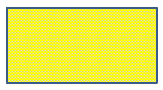

## **Giriş**

PowerPoint'te slaytlara şekil ekleyebilirsiniz. Şekiller çizgilerden oluştuğu için kenar çizgilerini değiştirerek veya etkiler uygulayarak biçimlendirebilirsiniz. Ayrıca, şekillerin içlerinin nasıl doldurulacağını kontrol eden ayarları belirterek şekilleri biçimlendirebilirsiniz.


Aspose.Slides for Python via Java, PowerPoint'te mevcut olan aynı seçenekleri kullanarak şekilleri biçimlendirmenizi sağlayan sınıf ve yöntemler sunar.

## **Çizgileri Biçimlendirme**

Aspose.Slides kullanarak bir şekil için özel bir çizgi stili belirleyebilirsiniz. Aşağıdaki adımlar prosedürü özetlemektedir:

1. Bir [Presentation](https://reference.aspose.com/slides/tr/python-java/aspose.slides/presentation/) sınıfının bir örneğini oluşturun.
1. Dizini kullanarak bir slayta referans alın.
1. Slayta bir [AutoShape](https://reference.aspose.com/slides/tr/python-java/aspose.slides/autoshape/) ekleyin.
1. Şeklin [çizgi stili](https://reference.aspose.com/slides/tr/python-java/aspose.slides/linestyle/) özelliğini ayarlayın.
1. Çizgi kalınlığını ayarlayın.
1. Çizginin [dash style](https://reference.aspose.com/slides/tr/python-java/aspose.slides/linedashstyle/) özelliğini ayarlayın.
1. Şekil için çizgi rengini ayarlayın.
1. Değiştirilmiş sunumu PPTX dosyası olarak kaydedin.

Aşağıdaki kod, bir dikdörtgen [AutoShape](https://reference.aspose.com/slides/tr/python-java/aspose.slides/autoshape/) nasıl biçimlendirileceğini göstermektedir:

```python
import jpype
import asposeslides

if not jpype.isJVMStarted():
    jpype.startJVM()

from asposeslides.api import FillType, LineDashStyle, LineStyle, Presentation, SaveFormat, ShapeType
from java.awt import Color

# Sunum dosyasını temsil eden Presentation sınıfını örnekleyin.
presentation = Presentation()
try:
    # İlk slaytı alın.
    slide = presentation.getSlides().get_Item(0)

    # Rectangle tipinde bir otomatik şekil ekleyin.
    shape = slide.getShapes().addAutoShape(ShapeType.Rectangle, 50, 150, 150, 75)

    # Dikdörtgen şeklinin dolgu rengini ayarlayın.
    shape.getFillFormat().setFillType(FillType.NoFill)

    # Dikdörtgenin çizgilerine biçimlendirme uygulayın.
    shape.getLineFormat().setStyle(LineStyle.ThickThin)
    shape.getLineFormat().setWidth(7)
    shape.getLineFormat().setDashStyle(LineDashStyle.Dash)

    # Dikdörtgenin çizgisinin rengini ayarlayın.
    shape.getLineFormat().getFillFormat().setFillType(FillType.Solid)
    shape.getLineFormat().getFillFormat().getSolidFillColor().setColor(Color.BLUE)

    # PPTX dosyasını diske kaydedin.
    presentation.save("formatted_lines.pptx", SaveFormat.Pptx)
finally:
    presentation.dispose()
```

Sonuç:


## **Şekil Çizgilerine Çizim Efektleri Uygulama**

Bir skeç efekti, şekil çizgisinin el çizimi gibi görünmesini sağlar. Çizgi ayarlarına erişmek için [Shape.getLineFormat](https://reference.aspose.com/slides/tr/python-java/aspose.slides/shape/#getLineFormat), skeç ayarlarına erişmek için [LineFormat.getSketchFormat](https://reference.aspose.com/slides/tr/python-java/aspose.slides/lineformat/#getSketchFormat), ve [SketchFormat.setSketchType](https://reference.aspose.com/slides/tr/python-java/aspose.slides/sketchformat/#setSketchType) ile [LineSketchType](https://reference.aspose.com/slides/tr/python-java/aspose.slides/linesketchtype/) enumarasyonundan bir değer seçin.

Aşağıdaki Python kodu, bir [LineSketchType.Curved](https://reference.aspose.com/slides/tr/python-java/aspose.slides/linesketchtype/#Curved) etkisini uygulamayı, açıkça atanmış değeri okumayı ve [LineSketchType.None_](https://reference.aspose.com/slides/tr/python-java/aspose.slides/linesketchtype/#None) ile efekti kaldırmayı gösterir:

```python
import jpype
import asposeslides

if not jpype.isJVMStarted():
    jpype.startJVM()

from asposeslides.api import LineSketchType, Presentation, ShapeType

presentation = Presentation()
try:
    slide = presentation.getSlides().get_Item(0)
    shape = slide.getShapes().addAutoShape(ShapeType.Rectangle, 50, 50, 200, 100)

    # Şeklin çizgi biçimine ve onun skeç biçimine erişin.
    sketch_format = shape.getLineFormat().getSketchFormat()

    # Bir skeç efekti uygulayın.
    sketch_format.setSketchType(LineSketchType.Curved)

    # Şekle doğrudan atanmış skeç efekti okuyun.
    explicit_sketch_type = sketch_format.getSketchType()
    print(f"Explicit sketch type: {explicit_sketch_type}")

    # Skeç efektini kaldırın.
    sketch_format.setSketchType(LineSketchType.None_)
finally:
    presentation.dispose()
```

[SketchFormat.getSketchType](https://reference.aspose.com/slides/tr/python-java/aspose.slides/sketchformat/#getSketchType) tarafından döndürülen değer, doğrudan şekle atanmış ayarı temsil eder. Çizgi biçimlendirmesi bir temadan, ana slayttan veya düzen slaytından miras alınabiliyorsa, [LineFormat.getEffective](https://reference.aspose.com/slides/tr/python-java/aspose.slides/lineformat/#getEffective) kullanın, `LineFormatEffectiveData.getSketchFormat` öğesine erişin ve `SketchFormatEffectiveData.getSketchType` öğesini okuyun. Etkin değer, miras çözülüp uygulanmış gerçek biçimlendirmeyi yansıtır:

```python
import jpype
import asposeslides

if not jpype.isJVMStarted():
    jpype.startJVM()

from asposeslides.api import Presentation

presentation = Presentation("presentation.pptx")
try:
    shape = presentation.getSlides().get_Item(0).getShapes().get_Item(0)
    line_format = shape.getLineFormat()

    explicit_sketch_type = line_format.getSketchFormat().getSketchType()
    effective_line_format = line_format.getEffective()
    effective_sketch_type = effective_line_format.getSketchFormat().getSketchType()

    print(f"Explicit sketch type: {explicit_sketch_type}")
    print(f"Effective sketch type: {effective_sketch_type}")
finally:
    presentation.dispose()
```

## **Bağlama Stillerini Biçimlendirme**

İşte üç bağlama tipi seçeneği:

* Yuvarlak
* Miter
* Bevel

Varsayılan olarak, PowerPoint iki çizgiyi bir açıda (örneğin bir şeklin köşesinde) birleştirirken **Yuvarlak** ayarını kullanır. Ancak keskin açıları olan bir şekil çiziyorsanız **Miter** seçeneğini tercih edebilirsiniz.


Aşağıdaki Python kodu, yukarıdaki görüntüde gösterildiği gibi üç dikdörtgenin Miter, Bevel ve Round bağlama tipi ayarları kullanılarak nasıl oluşturulduğunu gösterir:

```python
import jpype
import asposeslides

if not jpype.isJVMStarted():
    jpype.startJVM()

from asposeslides.api import FillType, LineJoinStyle, Presentation, SaveFormat, ShapeType
from java.awt import Color

# Sunum dosyasını temsil eden Presentation sınıfını örnekleyin.
presentation = Presentation()
try:
    # İlk slaytı alın.
    slide = presentation.getSlides().get_Item(0)

    # Rectangle tipinde üç otomatik şekil ekleyin.
    miter_shape = slide.getShapes().addAutoShape(ShapeType.Rectangle, 20, 20, 150, 75)
    bevel_shape = slide.getShapes().addAutoShape(ShapeType.Rectangle, 210, 20, 150, 75)
    round_shape = slide.getShapes().addAutoShape(ShapeType.Rectangle, 20, 135, 150, 75)

    # Her dikdörtgen şeklinin dolgu rengini ayarlayın.
    miter_shape.getFillFormat().setFillType(FillType.Solid)
    miter_shape.getFillFormat().getSolidFillColor().setColor(Color.BLACK)
    bevel_shape.getFillFormat().setFillType(FillType.Solid)
    bevel_shape.getFillFormat().getSolidFillColor().setColor(Color.BLACK)
    round_shape.getFillFormat().setFillType(FillType.Solid)
    round_shape.getFillFormat().getSolidFillColor().setColor(Color.BLACK)

    # Çizgi kalınlığını ayarlayın.
    miter_shape.getLineFormat().setWidth(15)
    bevel_shape.getLineFormat().setWidth(15)
    round_shape.getLineFormat().setWidth(15)

    # Her dikdörtgenin çizgi rengini ayarlayın.
    miter_shape.getLineFormat().getFillFormat().setFillType(FillType.Solid)
    miter_shape.getLineFormat().getFillFormat().getSolidFillColor().setColor(Color.BLUE)
    bevel_shape.getLineFormat().getFillFormat().setFillType(FillType.Solid)
    bevel_shape.getLineFormat().getFillFormat().getSolidFillColor().setColor(Color.BLUE)
    round_shape.getLineFormat().getFillFormat().setFillType(FillType.Solid)
    round_shape.getLineFormat().getFillFormat().getSolidFillColor().setColor(Color.BLUE)

    # Bağlama stilini ayarlayın.
    miter_shape.getLineFormat().setJoinStyle(LineJoinStyle.Miter)
    bevel_shape.getLineFormat().setJoinStyle(LineJoinStyle.Bevel)
    round_shape.getLineFormat().setJoinStyle(LineJoinStyle.Round)

    # Her dikdörtgene metin ekleyin.
    miter_shape.getTextFrame().setText("Miter Join Style")
    bevel_shape.getTextFrame().setText("Bevel Join Style")
    round_shape.getTextFrame().setText("Round Join Style")

    # PPTX dosyasını diske kaydedin.
    presentation.save("join_styles.pptx", SaveFormat.Pptx)
finally:
    presentation.dispose()
```

## **Gradyan Dolgu**

PowerPoint'te Gradyan Dolgu, bir şekle sürekli renk geçişi uygulamanızı sağlayan bir biçimlendirme seçeneğidir. Örneğin, iki veya daha fazla rengi birinin diğerine yavaşça karıştığı şekilde uygulayabilirsiniz.

Aspose.Slides kullanarak bir şekle gradyan dolgu uygulamak için aşağıdaki adımları izleyin:

1. Bir [Presentation](https://reference.aspose.com/slides/tr/python-java/aspose.slides/presentation/) sınıfının bir örneğini oluşturun.
1. Dizini kullanarak bir slayta referans alın.
1. Slayta bir [AutoShape](https://reference.aspose.com/slides/tr/python-java/aspose.slides/autoshape/) ekleyin.
1. Şeklin [FillType](https://reference.aspose.com/slides/tr/python-java/aspose.slides/filltype/) özelliğini `Gradient` olarak ayarlayın.
1. [GradientFormat](https://reference.aspose.com/slides/tr/python-java/aspose.slides/gradientformat/) sınıfı tarafından sağlanan gradyan durak koleksiyonunun [addPresetColor](https://reference.aspose.com/slides/tr/python-java/aspose.slides/gradientstopcollection/#addPresetColor) yöntemini kullanarak tanımlı konumlarla iki tercih ettiğiniz rengi ekleyin.
1. Değiştirilmiş sunumu PPTX dosyası olarak kaydedin.

```python
import jpype
import asposeslides

if not jpype.isJVMStarted():
    jpype.startJVM()

from asposeslides.api import FillType, GradientDirection, GradientShape, Presentation, PresetColor, SaveFormat, ShapeType
from java.awt import Color

# Sunum dosyasını temsil eden Presentation sınıfını örnekleyin.
presentation = Presentation()
try:
    # İlk slaytı alın.
    slide = presentation.getSlides().get_Item(0)

    # Ellipse tipinde bir otomatik şekil ekleyin.
    shape = slide.getShapes().addAutoShape(ShapeType.Ellipse, 50, 50, 150, 75)

    # Elipseye gradyan biçimlendirmesi uygulayın.
    shape.getFillFormat().setFillType(FillType.Gradient)
    shape.getFillFormat().getGradientFormat().setGradientShape(GradientShape.Linear)

    # Gradyanın yönünü ayarlayın.
    shape.getFillFormat().getGradientFormat().setGradientDirection(GradientDirection.FromCorner2)

    # İki gradyan durak ekleyin.
    shape.getFillFormat().getGradientFormat().getGradientStops().addPresetColor(1.0, PresetColor.Purple)
    shape.getFillFormat().getGradientFormat().getGradientStops().addPresetColor(0.0, PresetColor.Red)

    # PPTX dosyasını diske kaydedin.
    presentation.save("gradient_fill.pptx", SaveFormat.Pptx)
finally:
    presentation.dispose()
```


## **Desen Dolgu**

PowerPoint'te Pattern Fill, bir şekle iki renkli bir tasarım—örneğin nokta, çizgi, çapraz çizgi veya kare—uygulamanızı sağlayan bir biçimlendirme seçeneğidir. Desenin ön plan ve arka plan renklerini özelleştirebilirsiniz.

Aspose.Slides, sunumlarınızın görsel çekiciliğini artırmak için şekillere uygulayabileceğiniz 45'ten fazla ön tanımlı desen stili sunar. Ön tanımlı deseni seçtikten sonra bile kullanılacak kesin renkleri belirtebilirsiniz.

Aspose.Slides kullanarak bir şekle desen dolgu uygulamak için şu adımları izleyin:

1. Bir [Presentation](https://reference.aspose.com/slides/tr/python-java/aspose.slides/presentation/) sınıfının bir örneğini oluşturun.
1. Dizini kullanarak bir slayta referans alın.
1. Slayta bir [AutoShape](https://reference.aspose.com/slides/tr/python-java/aspose.slides/autoshape/) ekleyin.
1. Şeklin [FillType](https://reference.aspose.com/slides/tr/python-java/aspose.slides/filltype/) özelliğini `Pattern` olarak ayarlayın.
1. Ön tanımlı seçeneklerden bir desen stili seçin.
1. Desenin [Background Color](https://reference.aspose.com/slides/tr/python-java/aspose.slides/patternformat/#getBackColor) rengini ayarlayın.
1. Desenin [Foreground Color](https://reference.aspose.com/slides/tr/python-java/aspose.slides/patternformat/#getForeColor) rengini ayarlayın.
1. Değiştirilmiş sunumu PPTX dosyası olarak kaydedin.

```python
import jpype
import asposeslides

if not jpype.isJVMStarted():
    jpype.startJVM()

from asposeslides.api import FillType, PatternStyle, Presentation, SaveFormat, ShapeType
from java.awt import Color

# Sunum dosyasını temsil eden Presentation sınıfını örnekleyin.
presentation = Presentation()
try:
    # İlk slaytı alın.
    slide = presentation.getSlides().get_Item(0)

    # Rectangle tipinde bir otomatik şekil ekleyin.
    shape = slide.getShapes().addAutoShape(ShapeType.Rectangle, 50, 50, 150, 75)

    # Dolgu tipini Pattern olarak ayarlayın.
    shape.getFillFormat().setFillType(FillType.Pattern)

    # Desen stilini ayarlayın.
    shape.getFillFormat().getPatternFormat().setPatternStyle(PatternStyle.Trellis)

    # Desenin arka plan ve ön plan renklerini ayarlayın.
    shape.getFillFormat().getPatternFormat().getBackColor().setColor(Color.LIGHT_GRAY)
    shape.getFillFormat().getPatternFormat().getForeColor().setColor(Color.YELLOW)

    # PPTX dosyasını diske kaydedin.
    presentation.save("pattern_fill.pptx", SaveFormat.Pptx)
finally:
    presentation.dispose()
```



## **Resim Dolgu**

PowerPoint'te Picture Fill, bir şeklin içine bir resim eklemenizi sağlayan bir biçimlendirme seçeneğidir; bu şekilde resmi şeklin arka planı olarak kullanırsınız.

Aspose.Slides kullanarak bir şekle resim dolgu uygulamak için şu adımları izleyin:

1. Bir [Presentation](https://reference.aspose.com/slides/tr/python-java/aspose.slides/presentation/) sınıfının bir örneğini oluşturun.
1. Dizini kullanarak bir slayta referans alın.
1. Slayta bir [AutoShape](https://reference.aspose.com/slides/tr/python-java/aspose.slides/autoshape/) ekleyin.
1. Şeklin [FillType](https://reference.aspose.com/slides/tr/python-java/aspose.slides/filltype/) özelliğini `Picture` olarak ayarlayın.
1. Resim dolgu modunu `Tile` (veya başka bir tercih edilen mod) olarak ayarlayın.
1. Kullandığınız görüntüden bir [PPImage](https://reference.aspose.com/slides/tr/python-java/aspose.slides/ppimage/) nesnesi oluşturun.
1. Görüntüyü `SlidesPicture.setImage` yöntemine aktarın.
1. Değiştirilmiş sunumu PPTX dosyası olarak kaydedin.

Örneğin aşağıdaki resimle bir "lotus.png" dosyamız olduğunu varsayalım:


```python
import jpype
import asposeslides

if not jpype.isJVMStarted():
    jpype.startJVM()

from asposeslides.api import FillType, Images, PictureFillMode, Presentation, SaveFormat, ShapeType

# Sunum dosyasını temsil eden Presentation sınıfını örnekleyin.
presentation = Presentation()
try:
    # İlk slaytı alın.
    slide = presentation.getSlides().get_Item(0)

    # Rectangle tipinde bir otomatik şekil ekleyin.
    shape = slide.getShapes().addAutoShape(ShapeType.Rectangle, 50, 50, 255, 130)
    
    # Dolgu tipini Picture olarak ayarlayın.
    shape.getFillFormat().setFillType(FillType.Picture)

    # Resim dolgu modunu ayarlayın.
    shape.getFillFormat().getPictureFillFormat().setPictureFillMode(PictureFillMode.Tile)

    # Bir görüntü yükleyin ve sunum kaynaklarına ekleyin.
    image = Images.fromFile("lotus.png")
    picture = presentation.getImages().addImage(image)
    image.dispose()

    # Resmi ayarlayın.
    shape.getFillFormat().getPictureFillFormat().getPicture().setImage(picture)

    # PPTX dosyasını diske kaydedin.
    presentation.save("picture_fill.pptx", SaveFormat.Pptx)
finally:
    presentation.dispose()
```


### **Resmi Doku Olarak Döşeme**

Eğer döşenmiş bir resmi doku olarak ayarlamak ve döşeme davranışını özelleştirmek istiyorsanız, [PictureFillFormat](https://reference.aspose.com/slides/tr/python-java/aspose.slides/picturefillformat/) sınıfının aşağıdaki yöntemlerini kullanabilirsiniz:

- [setPictureFillMode](https://reference.aspose.com/slides/tr/python-java/aspose.slides/picturefillformat/#setPictureFillMode): Resim dolgu modunu ayarlar—`Tile` ya da `Stretch`.
- [setTileAlignment](https://reference.aspose.com/slides/tr/python-java/aspose.slides/picturefillformat/#setTileAlignment): Döşemenin şekil içinde hizalamasını belirtir.
- [setTileFlip](https://reference.aspose.com/slides/tr/python-java/aspose.slides/picturefillformat/#setTileFlip): Döşemenin yatay, dikey veya her iki yönde çevrilip çevrilmeyeceğini kontrol eder.
- [setTileOffsetX](https://reference.aspose.com/slides/tr/python-java/aspose.slides/picturefillformat/#setTileOffsetX): Döşemenin şeklin orijininin yatay ofsetini (puan cinsinden) ayarlar.
- [setTileOffsetY](https://reference.aspose.com/slides/tr/python-java/aspose.slides/picturefillformat/#setTileOffsetY): Döşemenin şeklin orijininin dikey ofsetini (puan cinsinden) ayarlar.
- [setTileScaleX](https://reference.aspose.com/slides/tr/python-java/aspose.slides/picturefillformat/#setTileScaleX): Döşemenin yatay ölçeğini yüzde olarak tanımlar.
- [setTileScaleY](https://reference.aspose.com/slides/tr/python-java/aspose.slides/picturefillformat/#setTileScaleY): Döşemenin dikey ölçeğini yüzde olarak tanımlar.

```python
import jpype
import asposeslides

if not jpype.isJVMStarted():
    jpype.startJVM()

from asposeslides.api import FillType, Images, PictureFillMode, Presentation, RectangleAlignment, SaveFormat, ShapeType, TileFlip

# Sunum dosyasını temsil eden Presentation sınıfını örnekleyin.
presentation = Presentation()
try:
    # İlk slaytı alın.
    first_slide = presentation.getSlides().get_Item(0)

    # Bir dikdörtgen otomatik şekil ekleyin.
    shape = first_slide.getShapes().addAutoShape(ShapeType.Rectangle, 50, 50, 190, 95)

    # Şeklin dolgu tipini Picture olarak ayarlayın.
    shape.getFillFormat().setFillType(FillType.Picture)

    # Görüntüyü yükleyin ve sunum kaynaklarına ekleyin.
    source_image = Images.fromFile("lotus.png")
    presentation_image = presentation.getImages().addImage(source_image)
    source_image.dispose()

    # Görüntüyü şekle atayın.
    picture_fill_format = shape.getFillFormat().getPictureFillFormat()
    picture_fill_format.getPicture().setImage(presentation_image)

    # Resim dolgu modunu ve döşeme özelliklerini yapılandırın.
    picture_fill_format.setPictureFillMode(PictureFillMode.Tile)
    picture_fill_format.setTileOffsetX(-32)
    picture_fill_format.setTileOffsetY(-32)
    picture_fill_format.setTileScaleX(50)
    picture_fill_format.setTileScaleY(50)
    picture_fill_format.setTileAlignment(RectangleAlignment.BottomRight)
    picture_fill_format.setTileFlip(TileFlip.FlipBoth)

    # PPTX dosyasını diske kaydedin.
    presentation.save("tile.pptx", SaveFormat.Pptx)
finally:
    presentation.dispose()
```


## **Tek Renk Dolgu**

PowerPoint'te Solid Color Fill, bir şekli tek, tekdüze bir renk ile dolduran bir biçimlendirme seçeneğidir. Bu düz arka plan rengi, gradyan, doku veya desen olmadan uygulanır.

Aspose.Slides ile bir şekle tek renk dolgu uygulamak için şu adımları izleyin:

1. Bir [Presentation](https://reference.aspose.com/slides/tr/python-java/aspose.slides/presentation/) sınıfının bir örneğini oluşturun.
1. Dizini kullanarak bir slayta referans alın.
1. Slayta bir [AutoShape](https://reference.aspose.com/slides/tr/python-java/aspose.slides/autoshape/) ekleyin.
1. Şeklin [FillType](https://reference.aspose.com/slides/tr/python-java/aspose.slides/filltype/) özelliğini `Solid` olarak ayarlayın.
1. Şekle istediğiniz dolgu rengini atayın.
1. Değiştirilmiş sunumu PPTX dosyası olarak kaydedin.

```python
import jpype
import asposeslides

if not jpype.isJVMStarted():
    jpype.startJVM()

from asposeslides.api import FillType, Presentation, SaveFormat, ShapeType
from java.awt import Color

# Sunum dosyasını temsil eden Presentation sınıfını örnekleyin.
presentation = Presentation()
try:
    # İlk slaytı alın.
    slide = presentation.getSlides().get_Item(0)

    # Rectangle tipinde bir otomatik şekil ekleyin.
    shape = slide.getShapes().addAutoShape(ShapeType.Rectangle, 50, 50, 150, 75)

    # Dolgu tipini Solid olarak ayarlayın.
    shape.getFillFormat().setFillType(FillType.Solid)

    # Dolgu rengini ayarlayın.
    shape.getFillFormat().getSolidFillColor().setColor(Color.YELLOW)

    # PPTX dosyasını diske kaydedin.
    presentation.save("solid_color_fill.pptx", SaveFormat.Pptx)
finally:
    presentation.dispose()
```


## **Şeffaflık Ayarlama**

PowerPoint'te bir şekle tek renk, gradyan, resim veya doku dolgusu uyguladığınızda, dolgunun opaklığını kontrol etmek için bir şeffaflık seviyesi de ayarlayabilirsiniz. Daha yüksek bir şeffaflık değeri, şeklin daha fazla saydam olmasını sağlar ve arka plan ya da alt nesnelerin kısmen görünür olmasına izin verir.

Aspose.Slides, dolgu için kullanılan rengin alfa değerini ayarlayarak şeffaflık seviyesini belirlemenize olanak tanır. İşte nasıl yapılır:

1. Bir [Presentation](https://reference.aspose.com/slides/tr/python-java/aspose.slides/presentation/) sınıfının bir örneğini oluşturun.
1. Dizini kullanarak bir slayta referans alın.
1. Slayta bir [AutoShape](https://reference.aspose.com/slides/tr/python-java/aspose.slides/autoshape/) ekleyin.
1. [FillType](https://reference.aspose.com/slides/tr/python-java/aspose.slides/filltype/) özelliğini `Solid` olarak ayarlayın.
1. [Color](https://docs.oracle.com/en/java/javase/17/docs/api/java.desktop/java/awt/Color.html) sınıfını kullanarak şeffaflığı (alpha bileşeni şeffaflığı kontrol eder) içeren bir renk tanımlayın.
1. Sunumu kaydedin.

```python
import jpype
import asposeslides

if not jpype.isJVMStarted():
    jpype.startJVM()

from asposeslides.api import FillType, Presentation, SaveFormat, ShapeType
from java.awt import Color

# Sunum dosyasını temsil eden Presentation sınıfını örnekleyin.
presentation = Presentation()
try:
    # İlk slaytı alın.
    slide = presentation.getSlides().get_Item(0)

    # Katı bir dikdörtgen otomatik şekil ekleyin.
    solid_shape = slide.getShapes().addAutoShape(ShapeType.Rectangle, 50, 50, 150, 75)

    # Katı şeklin üzerine şeffaf bir dikdörtgen otomatik şekil ekleyin.
    transparent_shape = slide.getShapes().addAutoShape(ShapeType.Rectangle, 80, 80, 150, 75)
    transparent_shape.getFillFormat().setFillType(FillType.Solid)
    transparent_color = Color(255, 255, 0, 204)
    transparent_shape.getFillFormat().getSolidFillColor().setColor(transparent_color)

    # PPTX dosyasını diske kaydedin.
    presentation.save("shape_transparency.pptx", SaveFormat.Pptx)
finally:
    presentation.dispose()
```


## **Şekilleri Döndürme**

Aspose.Slides, PowerPoint sunumlarında şekilleri döndürmenizi sağlar. Bu, görsel öğeleri belirli hizalama veya tasarım ihtiyaçlarıyla konumlandırırken faydalı olabilir.

Bir slayttaki bir şekli döndürmek için şu adımları izleyin:

1. Bir [Presentation](https://reference.aspose.com/slides/tr/python-java/aspose.slides/presentation/) sınıfının bir örneğini oluşturun.
1. Dizini kullanarak bir slayta referans alın.
1. Slayta bir [AutoShape](https://reference.aspose.com/slides/tr/python-java/aspose.slides/autoshape/) ekleyin.
1. Şeklin döndürme özelliğini istediğiniz açıya ayarlayın.
1. Sunumu kaydedin.

```python
import jpype
import asposeslides

if not jpype.isJVMStarted():
    jpype.startJVM()

from asposeslides.api import Presentation, SaveFormat, ShapeType

# Sunum dosyasını temsil eden Presentation sınıfını örnekleyin.
presentation = Presentation()
try:
    # İlk slaytı alın.
    slide = presentation.getSlides().get_Item(0)

    # Rectangle tipinde bir otomatik şekil ekleyin.
    shape = slide.getShapes().addAutoShape(ShapeType.Rectangle, 50, 50, 150, 75)

    # Şekli 5 derece döndürün.
    shape.setRotation(5)

    # PPTX dosyasını diske kaydedin.
    presentation.save("shape_rotation.pptx", SaveFormat.Pptx)
finally:
    presentation.dispose()
```


## **3B Kavis Efektleri Ekleme**

Aspose.Slides, şekillerin [ThreeDFormat](https://reference.aspose.com/slides/tr/python-java/aspose.slides/threedformat/) özelliklerini yapılandırarak 3B kavis (bevel) efektleri uygulamanızı sağlar.

Bir şekle 3B kavis efekti eklemek için şu adımları izleyin:

1. Bir [Presentation](https://reference.aspose.com/slides/tr/python-java/aspose.slides/presentation/) sınıfının bir örneğini oluşturun.
1. Dizini kullanarak bir slayta referans alın.
1. Slayta bir [AutoShape](https://reference.aspose.com/slides/tr/python-java/aspose.slides/autoshape/) ekleyin.
1. Şeklin [ThreeDFormat](https://reference.aspose.com/slides/tr/python-java/aspose.slides/threedformat/) özelliğini kavis ayarlarını tanımlayacak şekilde yapılandırın.
1. Sunumu kaydedin.

```python
import jpype
import asposeslides

if not jpype.isJVMStarted():
    jpype.startJVM()

from asposeslides.api import BevelPresetType, CameraPresetType, FillType, LightRigPresetType, LightingDirection, Presentation, SaveFormat, ShapeType
from java.awt import Color

# Presentation sınıfının bir örneğini oluşturun.
presentation = Presentation()
try:
    slide = presentation.getSlides().get_Item(0)

    # Slayta bir şekil ekleyin.
    shape = slide.getShapes().addAutoShape(ShapeType.Ellipse, 50, 50, 100, 100)
    shape.getFillFormat().setFillType(FillType.Solid)
    shape.getFillFormat().getSolidFillColor().setColor(Color.GREEN)
    shape.getLineFormat().getFillFormat().setFillType(FillType.Solid)
    shape.getLineFormat().getFillFormat().getSolidFillColor().setColor(Color.ORANGE)
    shape.getLineFormat().setWidth(2.0)

    # Şeklin ThreeDFormat özelliklerini ayarlayın.
    shape.getThreeDFormat().setDepth(4)
    shape.getThreeDFormat().getBevelTop().setBevelType(BevelPresetType.Circle)
    shape.getThreeDFormat().getBevelTop().setHeight(6)
    shape.getThreeDFormat().getBevelTop().setWidth(6)
    shape.getThreeDFormat().getCamera().setCameraType(CameraPresetType.OrthographicFront)
    shape.getThreeDFormat().getLightRig().setLightType(LightRigPresetType.ThreePt)
    shape.getThreeDFormat().getLightRig().setDirection(LightingDirection.Top)

    # Sunumu PPTX dosyası olarak kaydedin.
    presentation.save("3D_bevel_effect.pptx", SaveFormat.Pptx)
finally:
    presentation.dispose()
```


## **3B Döndürme Efektleri Ekleme**

Aspose.Slides, şekillerin [ThreeDFormat](https://reference.aspose.com/slides/tr/python-java/aspose.slides/threedformat/) özelliklerini yapılandırarak 3B döndürme efektleri uygulamanızı sağlar.

Bir şekle 3B döndürme uygulamak için:

1. Bir [Presentation](https://reference.aspose.com/slides/tr/python-java/aspose.slides/presentation/) sınıfının bir örneğini oluşturun.
1. Dizini kullanarak bir slayta referans alın.
1. Slayta bir [AutoShape](https://reference.aspose.com/slides/tr/python-java/aspose.slides/autoshape/) ekleyin.
1. 3B döndürmeyi tanımlamak için [setCameraType](https://reference.aspose.com/slides/tr/python-java/aspose.slides/camera/#setCameraType) ve [setLightType](https://reference.aspose.com/slides/tr/python-java/aspose.slides/lightrig/#setLightType) yöntemlerini kullanın.
1. Sunumu kaydedin.

```python
import jpype
import asposeslides

if not jpype.isJVMStarted():
    jpype.startJVM()

from asposeslides.api import CameraPresetType, LightRigPresetType, Presentation, SaveFormat, ShapeType

# Presentation sınıfının bir örneğini oluşturun.
presentation = Presentation()
try:
    slide = presentation.getSlides().get_Item(0)

    auto_shape = slide.getShapes().addAutoShape(ShapeType.Rectangle, 50, 50, 150, 75)
    auto_shape.getTextFrame().setText("Hello, Aspose!")

    auto_shape.getThreeDFormat().setDepth(6)
    auto_shape.getThreeDFormat().getCamera().setRotation(40, 35, 20)
    auto_shape.getThreeDFormat().getCamera().setCameraType(CameraPresetType.IsometricLeftUp)
    auto_shape.getThreeDFormat().getLightRig().setLightType(LightRigPresetType.Balanced)

    # Sunumu PPTX dosyası olarak kaydedin.
    presentation.save("3D_rotation_effect.pptx", SaveFormat.Pptx)
finally:
    presentation.dispose()
```


## **Şekiller için Siyah-Beyaz Renderlamayı Kontrol Etme**

[Shape.setBlackWhiteMode](https://reference.aspose.com/slides/tr/python-java/aspose.slides/shape/#setBlackWhiteMode) yöntemi, bir sunum siyah-beyaz modunda görüntülendiğinde veya işlendiğinde bireysel bir şeklin nasıl renderlanacağını belirtir. Bu yöntem tek başına siyah-beyaz görüntüyü etkinleştirmez ve normal renk modunda şeklin dolgu, çizgi veya diğer biçimlendirmesini değiştirmez.

İstenilen davranışı seçmek için [BlackWhiteMode](https://reference.aspose.com/slides/tr/python-java/aspose.slides/blackwhitemode/) sınıfından bir değer kullanın. Örneğin, `Automatic` render uygulamasının dönüşümü seçmesine izin verir, `Gray` ve `LightGray` gri renkleme kullanır, `BlackWhite` sadece siyah ve beyazı kullanır, `Black` ve `White` tek bir rengi zorlar, `Color` normal renklemeyi korur ve `Hidden` şekli siyah-beyaz modunda atar. `NotDefined` ise şekil seviyesinde bir modun atanmadığını ifade eder.

Aşağıdaki Python kodu, renkli bir şekil oluşturur ve siyah-beyaz görüntü modunda gri görünmesini sağlar:

```python
import jpype
import asposeslides

if not jpype.isJVMStarted():
    jpype.startJVM()

from asposeslides.api import BlackWhiteMode, FillType, Presentation, SaveFormat, ShapeType
from java.awt import Color

presentation = Presentation()
try:
    slide = presentation.getSlides().get_Item(0)

    shape = slide.getShapes().addAutoShape(ShapeType.Rectangle, 50, 50, 200, 100)
    shape.getFillFormat().setFillType(FillType.Solid)
    shape.getFillFormat().getSolidFillColor().setColor(Color.ORANGE)

    # Renk modunda turuncu doldurmayı koruyun, ancak siyah-beyaz modunda şekli gri renkle renderlayın.
    shape.setBlackWhiteMode(BlackWhiteMode.Gray)

    presentation.save("shape_black_white_mode.pptx", SaveFormat.Pptx)
finally:
    presentation.dispose()
```

Normal renk modunda, dikdörtgen turuncu dolgusunu korur. Siyah-beyaz görüntü iş akışında, modu `Gray` olarak ayarlandığı için gri renkleme kullanır. Bu, tam renkli bir slaytı korurken, baskı, ön izleme veya sunumun siyah-beyaz görüntü ayarlarını dikkate alan diğer iş akışları için farklı bir görünüm tanımlamanızı sağlar.

## **Biçimlendirmeyi Sıfırlama**

Aşağıdaki Python kodu, bir slaydın biçimlendirmesini sıfırlamayı ve [LayoutSlide](https://reference.aspose.com/slides/tr/python-java/aspose.slides/layoutslide/) üzerindeki tüm yer tutuculu şekillerin konum, boyut ve biçimlendirmesini varsayılan ayarlarına geri döndürmeyi gösterir:

```python
import jpype
import asposeslides

if not jpype.isJVMStarted():
    jpype.startJVM()

from asposeslides.api import Presentation, SaveFormat

presentation = Presentation("sample.pptx")
try:
    for slide in presentation.getSlides():
        # Yer tutucuya sahip slayttaki her şekli sıfırla.
        slide.reset()

    presentation.save("reset_formatting.pptx", SaveFormat.Pptx)
finally:
    presentation.dispose()
```

## **SSS**

**Şekil biçimlendirmesi son sunum dosya boyutunu etkiler mi?**

Sadece çok az. Gömülü görüntüler ve medya dosyaları dosya alanının çoğunu kaplarken, renkler, efektler ve gradyanlar gibi şekil parametreleri meta veri olarak saklanır ve neredeyse hiç ek boyut eklemez.

**Bir slayttaki aynı biçimlendirmeyi paylaşan şekilleri nasıl tespit edip gruplandırabilirim?**

Her şeklin ana biçimlendirme özelliklerini—doldurmayı, çizgiyi ve efekt ayarlarını—karşılaştırın. Tüm ilgili değerler eşleşiyorsa, stillerini aynı olarak kabul edin ve bu şekilleri mantıksal olarak gruplayın; bu, sonraki stil yönetimini basitleştirir.

**Özel şekil stillerinin bir setini ayrı bir dosyada kaydedip diğer sunumlarda yeniden kullanabilir miyim?**

Evet. İstenilen stillere sahip örnek şekilleri bir şablon slayt paketi ya da .POTX şablon dosyasında saklayın. Yeni bir sunum oluştururken şablonu açın, ihtiyaç duyduğunuz stillendirilmiş şekilleri klonlayın ve gerektiği yerde biçimlendirmelerini tekrar uygulayın.