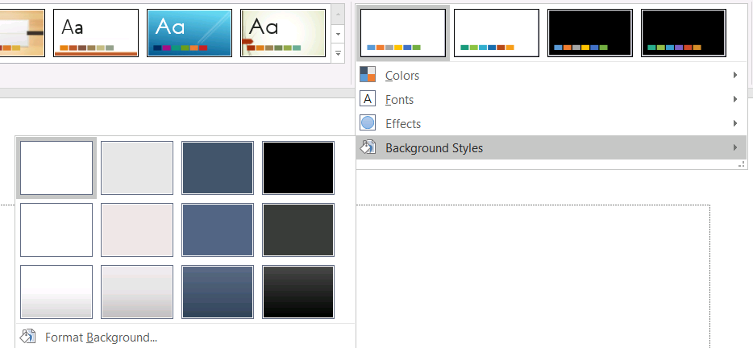

## **Giriş**

Bir sunum teması, renkler, yazı tipleri, arka plan stilleri, doldurmalar, çizgiler ve efektlerin koordineli bir kümesini tanımlar. Tema‑bilinçli nesneler, her görsel özelliği sabit bir değer olarak depolamak yerine bu ortak tanımlara başvurur; böylece bir tema değişikliği bir kerede birçok nesneyi güncelleyebilir.

Aspose.Slides içinde, sunum seviyesindeki tema, [Presentation.getMasterTheme](https://reference.aspose.com/slides/tr/python-java/aspose.slides/presentation/#getMasterTheme) aracılığıyla kullanılabilir. Bir sunum ayrıca daha düşük seviyelerde tema geçersiz kılmalarını da içerebilir. Bir master, [MasterThemeManager.getOverrideTheme](https://reference.aspose.com/slides/tr/python-java/aspose.slides/masterthememanager/#getOverrideTheme) ile sunum temasını geçersiz kılabilir; bir düzen ya da bireysel slayt ise [BaseOverrideThemeManager.getOverrideTheme](https://reference.aspose.com/slides/tr/python-java/aspose.slides/baseoverridethememanager/#getOverrideTheme) ile kalıtılan temasını geçersiz kılabilir. Pratikte, bir slayt için geçerli tema, şu kalıtım zinciri üzerinden çözülür: sunum teması, master geçersiz kılma, düzen geçersiz kılma ve slayt geçersiz kılma.


Aşağıdaki bölümler en yaygın tema iş akışlarını gösterir: bir temayı inceleme, renk ve yazı tiplerini değiştirme, bir temayı kopyalama veya uygulama, arka plan ve efekt stillerini güncelleme ve kalıtım ve geçersiz kılmalar çözüldükten sonra etkili değerleri okuma.

## **Bir Temayı İnceleme**

[MasterTheme](https://reference.aspose.com/slides/tr/python-java/aspose.slides/mastertheme/) nesnesi, temanın renk şemasını, yazı tipi şemasını ve format şemasını sırasıyla [MasterTheme.getColorScheme](https://reference.aspose.com/slides/tr/python-java/aspose.slides/mastertheme/#getColorScheme), [MasterTheme.getFontScheme](https://reference.aspose.com/slides/tr/python-java/aspose.slides/mastertheme/#getFontScheme) ve [MasterTheme.getFormatScheme](https://reference.aspose.com/slides/tr/python-java/aspose.slides/mastertheme/#getFormatScheme) aracılığıyla sunar. Bu koleksiyonları değiştirmeden önce incelemek, özellikle bir sunum dış bir kaynaktan geliyorsa faydalıdır; çünkü stil girişlerinin sayısı ve içeriği değişkenlik gösterebilir.

Aşağıdaki örnek, ana tema özelliklerini okur ve temada kaç arka plan, dolgu, çizgi ve efekt stilinin depolandığını raporlar:

```python
import jpype
import asposeslides

if not jpype.isJVMStarted():
    jpype.startJVM()

from asposeslides.api import Presentation

presentation = Presentation("input.pptx")
try:
    theme = presentation.getMasterTheme()
    print("Theme name:", theme.getName())
    print("Accent 1:", theme.getColorScheme().getAccent1().getColor())
    print("Major Latin font:", theme.getFontScheme().getMajor().getLatinFont().getFontName())
    print("Minor Latin font:", theme.getFontScheme().getMinor().getLatinFont().getFontName())
    print("Background fill styles:", theme.getFormatScheme().getBackgroundFillStyles().size())
    print("Fill styles:", theme.getFormatScheme().getFillStyles().size())
    print("Line styles:", theme.getFormatScheme().getLineStyles().size())
    print("Effect styles:", theme.getFormatScheme().getEffectStyles().size())
finally:
    presentation.dispose()
```

Bir dosya birden fazla master kullanıyorsa, her slaytın aynı etkili temaya sahip olduğunu varsamamalısınız. Slayt ile ilişkilendirilmiş masterʼı inceleyin ve düzen veya slayt geçersiz kılmalarının mevcut olabileceği durumlarda bu makalede daha sonra gösterilen etkili‑tema iş akışını kullanın.

## **Tema Renklerini Değiştirme**

Tema‑bilinçli dolgu, çizgi ve metin, [SchemeColor](https://reference.aspose.com/slides/tr/python-java/aspose.slides/schemecolor/) enumʼundan mantıksal bir renge başvurabilir. [ColorScheme](https://reference.aspose.com/slides/tr/python-java/aspose.slides/colorscheme/) içinde ilgili girdiyi değiştirdiğinizde, hâlâ o tema rengini referans veren tüm nesneler yeni değere göre çözümlenir. Doğrudan bir RGB rengi kullanan nesneler, tema‑rengi güncellemesinden etkilenmez.

Aşağıdaki uçtan uca örnek, `Accent4` kullanan bir şekil oluşturur, temadaki `Accent4` rengini kırmızıya değiştirir, sunumu kaydeder, yeniden açar ve etkili dolgu rengini yazdırır:

```python
import jpype
import asposeslides

if not jpype.isJVMStarted():
    jpype.startJVM()

from asposeslides.api import FillType, Presentation, SaveFormat, SchemeColor, ShapeType
from java.awt import Color

presentation = Presentation()
try:
    slide = presentation.getSlides().get_Item(0)
    shape = slide.getShapes().addAutoShape(ShapeType.Rectangle, 10, 10, 100, 100)
    shape.getFillFormat().setFillType(FillType.Solid)
    shape.getFillFormat().getSolidFillColor().setSchemeColor(SchemeColor.Accent4)
    presentation.getMasterTheme().getColorScheme().getAccent4().setColor(Color.RED)
    presentation.save("theme-color.pptx", SaveFormat.Pptx)
finally:
    presentation.dispose()

saved_presentation = Presentation("theme-color.pptx")
try:
    saved_slide = saved_presentation.getSlides().get_Item(0)
    saved_shape = saved_slide.getShapes().get_Item(0)
    effective_fill = saved_shape.getFillFormat().getEffective()
    print("Effective fill color:", effective_fill.getSolidFillColor())
finally:
    saved_presentation.dispose()
```

Dikdörtgen `Accent4`e bağlı kaldığından, tema değiştirildiğinde görünen rengi kırmızı olur. Şekildeki şema rengini doğrudan bir renkle değiştirirseniz, daha sonraki `Accent4` değişiklikleri bu dolgu üzerinde artık etkili olmaz.

### **Ek Paletten Renk Kullanma**

PowerPoint, bir tema renginden daha açık ve daha koyu varyantlar türetmek için renk dönüşümleri uygular. Aspose.Slides bu dönüşümleri [ColorTransformOperation](https://reference.aspose.com/slides/tr/python-java/aspose.slides/colortransformoperation/) enumʼu aracılığıyla sunar.


**1** – Ana tema renkleri.

**2** – Ana tema renklerinden üretilen daha açık ve daha koyu varyantlar.

Aşağıdaki örnek, `Accent4` tabanlı altı dikdörtgen oluşturur, beş tanesine parlaklık dönüşümleri uygular ve sonucu kaydeder:

```python
import jpype
import asposeslides

if not jpype.isJVMStarted():
    jpype.startJVM()

from asposeslides.api import ColorTransformOperation, FillType, Presentation, SaveFormat, SchemeColor, ShapeType

presentation = Presentation()
try:
    slide = presentation.getSlides().get_Item(0)

    base_shape = slide.getShapes().addAutoShape(ShapeType.Rectangle, 10, 10, 50, 50)
    base_shape.getFillFormat().setFillType(FillType.Solid)
    base_shape.getFillFormat().getSolidFillColor().setSchemeColor(SchemeColor.Accent4)

    lightest_shape = slide.getShapes().addAutoShape(ShapeType.Rectangle, 10, 70, 50, 50)
    lightest_shape.getFillFormat().setFillType(FillType.Solid)
    lightest_shape.getFillFormat().getSolidFillColor().setSchemeColor(SchemeColor.Accent4)
    lightest_shape.getFillFormat().getSolidFillColor().getColorTransform().add(ColorTransformOperation.MultiplyLuminance, 0.2)
    lightest_shape.getFillFormat().getSolidFillColor().getColorTransform().add(ColorTransformOperation.AddLuminance, 0.8)

    lighter_shape = slide.getShapes().addAutoShape(ShapeType.Rectangle, 10, 130, 50, 50)
    lighter_shape.getFillFormat().setFillType(FillType.Solid)
    lighter_shape.getFillFormat().getSolidFillColor().setSchemeColor(SchemeColor.Accent4)
    lighter_shape.getFillFormat().getSolidFillColor().getColorTransform().add(ColorTransformOperation.MultiplyLuminance, 0.4)
    lighter_shape.getFillFormat().getSolidFillColor().getColorTransform().add(ColorTransformOperation.AddLuminance, 0.6)

    light_shape = slide.getShapes().addAutoShape(ShapeType.Rectangle, 10, 190, 50, 50)
    light_shape.getFillFormat().setFillType(FillType.Solid)
    light_shape.getFillFormat().getSolidFillColor().setSchemeColor(SchemeColor.Accent4)
    light_shape.getFillFormat().getSolidFillColor().getColorTransform().add(ColorTransformOperation.MultiplyLuminance, 0.6)
    light_shape.getFillFormat().getSolidFillColor().getColorTransform().add(ColorTransformOperation.AddLuminance, 0.4)

    dark_shape = slide.getShapes().addAutoShape(ShapeType.Rectangle, 10, 250, 50, 50)
    dark_shape.getFillFormat().setFillType(FillType.Solid)
    dark_shape.getFillFormat().getSolidFillColor().setSchemeColor(SchemeColor.Accent4)
    dark_shape.getFillFormat().getSolidFillColor().getColorTransform().add(ColorTransformOperation.MultiplyLuminance, 0.75)

    darker_shape = slide.getShapes().addAutoShape(ShapeType.Rectangle, 10, 310, 50, 50)
    darker_shape.getFillFormat().setFillType(FillType.Solid)
    darker_shape.getFillFormat().getSolidFillColor().setSchemeColor(SchemeColor.Accent4)
    darker_shape.getFillFormat().getSolidFillColor().getColorTransform().add(ColorTransformOperation.MultiplyLuminance, 0.5)

    presentation.save("theme-color-palette.pptx", SaveFormat.Pptx)
finally:
    presentation.dispose()
```

Bu varyantlar tema rengine dayalı kalır. `Accent4` daha sonra değişirse, dönüştürülmüş renkler yeni `Accent4` değerinden yeniden hesaplanır.

### **`SchemeColor` Değerlerini `ColorScheme` Yuvalarına Eşleme**

[SchemeColor](https://reference.aspose.com/slides/tr/python-java/aspose.slides/schemecolor/) enumʼu `Text1`, `Background1`, `Text2` ve `Background2` değerlerini, [ColorScheme](https://reference.aspose.com/slides/tr/python-java/aspose.slides/colorscheme/) ise aynı tema yuvalarını `Dark1`, `Light1`, `Dark2` ve `Light2` olarak sunar. Eşleme sabittir:

* `Text1` = `Dark1`
* `Background1` = `Light1`
* `Text2` = `Dark2`
* `Background2` = `Light2`

Bunlar aynı tema yuvalarının alternatif adlarıdır; bir formdan diğerine dinamik bir dönüşüm değildir.

## **Tema Yazı Tiplerini Değiştirme**

Bir tema yazı tipi şeması, başlıklar için büyük bir yazı tipi seti ve gövde metni için küçük bir yazı tipi seti içerir. [FontScheme.getMajor](https://reference.aspose.com/slides/tr/python-java/aspose.slides/fontscheme/#getMajor) ve [FontScheme.getMinor](https://reference.aspose.com/slides/tr/python-java/aspose.slides/fontscheme/#getMinor) yöntemleri bu setleri ortaya çıkarır.

PowerPoint‑uyumlu tema yazı tipi tanımlayıcıları metin biçimlendirmesinde kullanılabilir:

* `+mn-lt` – Gövde Yazı Tipi Latin (Minor Latin Font)
* `+mj-lt` – Başlık Yazı Tipi Latin (Major Latin Font)
* `+mn-ea` – Gövde Yazı Tipi Doğu Asya (Minor East Asian Font)
* `+mj-ea` – Başlık Yazı Tipi Doğu Asya (Major East Asian Font)

Aşağıdaki örnek, büyük Latin tema yazı tipini kullanan bir başlık ve küçük Latin tema yazı tipini kullanan bir gövde satırı oluşturur. Ardından tema yazı tiplerini değiştirir ve sonucu kaydeder:

```python
import jpype
import asposeslides

if not jpype.isJVMStarted():
    jpype.startJVM()

from asposeslides.api import FontData, Presentation, SaveFormat, ShapeType

presentation = Presentation()
try:
    slide = presentation.getSlides().get_Item(0)

    heading = slide.getShapes().addAutoShape(ShapeType.Rectangle, 40, 40, 500, 60)
    heading.getTextFrame().setText("Theme heading")
    font_data = FontData("+mj-lt")
    heading.getTextFrame().getParagraphs().get_Item(0).getPortions().get_Item(0).getPortionFormat().setLatinFont(font_data)

    body = slide.getShapes().addAutoShape(ShapeType.Rectangle, 40, 120, 500, 60)
    body.getTextFrame().setText("Theme body text")
    font_data = FontData("+mn-lt")
    body.getTextFrame().getParagraphs().get_Item(0).getPortions().get_Item(0).getPortionFormat().setLatinFont(font_data)

    font_data = FontData("Aptos Display")
    presentation.getMasterTheme().getFontScheme().getMajor().setLatinFont(font_data)
    font_data = FontData("Arial")
    presentation.getMasterTheme().getFontScheme().getMinor().setLatinFont(font_data)
    presentation.save("theme-fonts.pptx", SaveFormat.Pptx)
finally:
    presentation.dispose()
```

Başlık büyük yazı tipini, gövde metni ise küçük yazı tipini izler. Tema tanımlayıcısı yerine açık bir yazı tipi adı verilmiş metin, tema yazı tipi şeması değiştiğinde otomatik olarak değişmez.

Büyük ve küçük yazı tipi koleksiyonları ayrıca Kiril, Arapça, Japonca, Gürcüce ve Thaana gibi bireysel yazı sistemleri için yazı tipi eşlemeleri içerebilir. Bu eşlemeleri incelemek, eklemek, değiştirmek veya kaldırmak için [Script‑Specific Theme Fonts](/slides/tr/python-java/script-specific-font-mappings/) bölümüne bakın.

{}

Sunum yazı tipleri hakkında daha fazla bilgi için [PowerPoint Fonts](/slides/tr/python-java/powerpoint-fonts/) sayfasına bakın.

{}

## **Bir Temayı Kopyalama veya Uygulama**

Aşağıdaki iş akışları farklı tema‑ile ilgili sorunları çözer.

### **Harici Bir Temayı Masterʼa Bağlı Slaytlara Uygulama**

Bir PowerPoint tema dosyanız (`.thmx`) varsa ve belirli bir masterʼa bağlı tüm slaytların stilini değiştirmek istiyorsanız, [MasterSlide.applyExternalThemeToDependingSlides](https://reference.aspose.com/slides/tr/python-java/aspose.slides/masterslide/#applyExternalThemeToDependingSlides) kullanın. [Presentation.getMasters](https://reference.aspose.com/slides/tr/python-java/aspose.slides/presentation/#getMasters) koleksiyonundan (bu koleksiyon [MasterSlideCollection](https://reference.aspose.com/slides/tr/python-java/aspose.slides/masterslidecollection/) ile temsil edilir) masterʼı seçin ve tema dosyası yolunu metoda aktarın.

Metot aşağıdaki işlemleri gerçekleştirir:

1. Seçilen master temelinde yeni bir master slayt oluşturur.
1. Harici temayı yeni masterʼa uygular.
1. Yeni masterʼı, daha önce seçilen masterʼa bağlı olan tüm slaytlara atar.
1. Yeni oluşturulan [MasterSlide](https://reference.aspose.com/slides/tr/python-java/aspose.slides/masterslide/) nesnesini döndürür.

Aşağıdaki örnek, ilk masterʼa bağlı slaytlara harici bir temayı uygular ve sunumu kaydeder:

```python
import jpype
import asposeslides

if not jpype.isJVMStarted():
    jpype.startJVM()

from asposeslides.api import Presentation, SaveFormat

presentation = Presentation("presentation.pptx")
try:
    selected_master = presentation.getMasters().get_Item(0)
    themed_master = selected_master.applyExternalThemeToDependingSlides("corporate-theme.thmx")

    print("Created master:", themed_master.getName())
    presentation.save("presentation-with-external-theme.pptx", SaveFormat.Pptx)
finally:
    presentation.dispose()
```

Geçersiz, bozuk veya desteklenmeyen bir tema, [PptxReadException](https://reference.aspose.com/slides/tr/python-java/aspose.slides/pptxreadexception/) oluşturabilir. Kullanıcıların sağladığı yolları doğrulayın, dosya sistemi erişim hatalarını yönetin ve temayı başarılı bir şekilde uyguladıktan sonra sunumu kaydedin.

Yalnızca seçilen masterʼa bağlı slaytlar yeniden atanır. Diğer masterʼlarla ilişkili slaytlar mevcut master ve temalarını korur. Tema‑bilinçli renkler, yazı tipleri, dolgular, çizgiler, arka planlar ve efektler harici temaya göre çözülür. Doğrudan atanmış renkler, yazı tipleri, dolgular ve diğer açık biçimlendirmeler değişmeden kalabilir. Düzen‑seviyesindeki ve slayt‑seviyesindeki geçersiz kılmalar da yeni masterʼdan miras alınan değerler üzerinde öncelik kazanabilir.

Tema, çalışma zamanında mevcut olmayan yazı tiplerine başvurabilir. Tutarlı render ve dışa aktarma için gereken yazı tiplerini kurun, bunları [özel yazı tipi kaynakları](/slides/tr/python-java/custom-font/) aracılığıyla sağlayın veya [yazı tipi ikamesi](/slides/tr/python-java/font-substitution/) yapılandırın.

Bu doğrudan master‑seviyesi bir iş akışıdır: metod bir `.thmx` dosya yolu alır ve slayt‑seviyesi veya düzen‑seviyesi tema geçersiz kılmalarının manuel olarak oluşturulmasını gerektirmez.

### **Çok‑Masterlı Bir Sunumda Farklı Harici Temalar Uygulama**

İlgili master önceden bilinmiyorsa, onu temsili bir slayttan [Slide.getLayoutSlide](https://reference.aspose.com/slides/tr/python-java/aspose.slides/slide/#getLayoutSlide) ve [LayoutSlide.getMasterSlide](https://reference.aspose.com/slides/tr/python-java/aspose.slides/layoutslide/#getMasterSlide) aracılığıyla elde edin. Her temayı uygulamadan önce orijinal master referanslarını saklayın; çünkü her çağrı sunumda yeni bir master oluşturur.

Aşağıdaki örnek, iki bölümden slaytları kullanarak masterʼlarını bulur ve her grup için farklı bir harici tema uygular:

```python
import jpype
import asposeslides

if not jpype.isJVMStarted():
    jpype.startJVM()

from asposeslides.api import Presentation, SaveFormat

presentation = Presentation("multi-master-presentation.pptx")
try:
    if presentation.getSlides().size() < 5:
        print("The presentation does not contain the expected representative slides.")
    else:
        first_group_master = presentation.getSlides().get_Item(0).getLayoutSlide().getMasterSlide()
        second_group_master = presentation.getSlides().get_Item(4).getLayoutSlide().getMasterSlide()

        if first_group_master.getSlideId() == second_group_master.getSlideId():
            print("The representative slides use the same master.")
        else:
            first_themed_master = first_group_master.applyExternalThemeToDependingSlides("blue-theme.thmx")
            second_themed_master = second_group_master.applyExternalThemeToDependingSlides("green-theme.thmx")

            print("First themed master:", first_themed_master.getName())
            print("Second themed master:", second_themed_master.getName())
            presentation.save("multi-master-with-external-themes.pptx", SaveFormat.Pptx)
finally:
    presentation.dispose()
```

İlk çağrı yalnızca `first_group_master`a bağlı slaytları etkiler, ikinci çağrı yalnızca `second_group_master`a bağlı slaytları etkiler. Başka herhangi bir masterʼa bağlı slaytlar yeniden stilize edilmez.

### **Kaynak Temayı Slayt Taşıma Sırasında Korumak**

Bir slaytı başka bir sunuma taşıyıp orijinal tasarımını korumak istiyorsanız, kaynak masterʼı hedef sunuma [MasterSlideCollection.addClone](https://reference.aspose.com/slides/tr/python-java/aspose.slides/masterslidecollection/#addClone) ile klonlayın, ardından slaytı ve klonlanmış masterʼı [SlideCollection.addClone](https://reference.aspose.com/slides/tr/python-java/aspose.slides/slidecollection/#addClone) ile klonlayın. Bu, masterʼı, onun düzenlerini ve ilişkili temayı birlikte taşır.

```python
import jpype
import asposeslides

if not jpype.isJVMStarted():
    jpype.startJVM()

from asposeslides.api import Presentation, SaveFormat

source = Presentation("source-theme.pptx")
try:
    target = Presentation("target.pptx")
    try:
        source_slide = source.getSlides().get_Item(0)
        source_master = source_slide.getLayoutSlide().getMasterSlide()
        cloned_master = target.getMasters().addClone(source_master)
        target.getSlides().addClone(source_slide, cloned_master, True)
        target.save("theme-preserved.pptx", SaveFormat.Pptx)
    finally:
        target.dispose()
finally:
    source.dispose()
```

Bu, kaynak slaytın hedefte aynı görünüme sahip olması gerektiğinde tercih edilen iş akışıdır. İçeriği bağımsız bir hedef masterʼa klonlamak tema‑tabanlı renk, yazı tipi, arka plan ve efekt değişikliklerine yol açabilir.

### **Mevcut Bir Slayta Tema Değerleri Uygulama**

Hedef slayt mevcut master ve düzeninde kalmalıysa, kaynak temadan bir slayt‑seviyesi geçersiz kılma başlatın. [OverrideTheme.initColorSchemeFrom](https://reference.aspose.com/slides/tr/python-java/aspose.slides/overridetheme/#initColorSchemeFrom), [OverrideTheme.initFontSchemeFrom](https://reference.aspose.com/slides/tr/python-java/aspose.slides/overridetheme/#initFontSchemeFrom) ve [OverrideTheme.initFormatSchemeFrom](https://reference.aspose.com/slides/tr/python-java/aspose.slides/overridetheme/#initFormatSchemeFrom) yöntemleri üç ana tema bileşenini geçersiz kılmaya kopyalar.

```python
import jpype
import asposeslides

if not jpype.isJVMStarted():
    jpype.startJVM()

from asposeslides.api import Presentation, SaveFormat

source = Presentation("source-theme.pptx")
try:
    target = Presentation("target.pptx")
    try:
        target_slide = target.getSlides().get_Item(0)
        override_theme = target_slide.getThemeManager().getOverrideTheme()
        override_theme.initColorSchemeFrom(source.getMasterTheme().getColorScheme())
        override_theme.initFontSchemeFrom(source.getMasterTheme().getFontScheme())
        override_theme.initFormatSchemeFrom(source.getMasterTheme().getFormatScheme())
        target.save("theme-applied-to-slide.pptx", SaveFormat.Pptx)
    finally:
        target.dispose()
finally:
    source.dispose()
```

Bu, diğer slaytların miras aldığı temayı değiştirmeden yalnızca o slaytın temasını değiştirir. Yerel geçersiz kılmayı kaldırmak ve miras alınan değerlere geri dönmek için [OverrideTheme.clear](https://reference.aspose.com/slides/tr/python-java/aspose.slides/overridetheme/#clear) çağırın.

### **Bir Düzen’e Tema Geçersiz Kılma Uygulama**

Düzen‑seviyesi geçersiz kılma, o düzeni kullanan slaytlara uygulanır; yalnızca belirli bir slayt kendi geçersiz kılmasını yapmadıkça. Aynı başlangıç yöntemleri, [LayoutSlideThemeManager](https://reference.aspose.com/slides/tr/python-java/aspose.slides/layoutslidethememanager/) üzerinden kullanılabilir:

```python
import jpype
import asposeslides

if not jpype.isJVMStarted():
    jpype.startJVM()

from asposeslides.api import Presentation, SaveFormat

source = Presentation("source-theme.pptx")
try:
    target = Presentation("target.pptx")
    try:
        target_slide = target.getSlides().get_Item(0)
        target_layout = target_slide.getLayoutSlide()
        override_theme = target_layout.getThemeManager().getOverrideTheme()
        override_theme.initColorSchemeFrom(source.getMasterTheme().getColorScheme())
        override_theme.initFontSchemeFrom(source.getMasterTheme().getFontScheme())
        override_theme.initFormatSchemeFrom(source.getMasterTheme().getFormatScheme())
        target.save("theme-applied-to-layout.pptx", SaveFormat.Pptx)
    finally:
        target.dispose()
finally:
    source.dispose()
```

Birçok düzen ve slayt aynı temel tasarımı paylaşacaksa master veya sunum‑seviyesi temayı, tek bir düzen ailesinin farklı stil gerektirdiği durumlarda düzen geçersiz kılmasını ve yalnızca gerçek istisnalar için slayt geçersiz kılmasını kullanın. Aşırı slayt‑seviyesi geçersiz kılmalar, daha sonraki küresel tema değişikliklerini tahmin etmeyi zorlaştırır.

## **Tema Arka Plan Stillerini Güncelleme**

Temanın arka plan dolguları, [FormatScheme.getBackgroundFillStyles](https://reference.aspose.com/slides/tr/python-java/aspose.slides/formatscheme/#getBackgroundFillStyles) içinde depolanır. PowerPoint, UIʼsinde temadan gelen dolguları tema renkleri ve diğer stil referanslarıyla birleştirerek, bu koleksiyonda fiziksel olarak tanımlı dolgu sayısından daha fazla arka plan seçeneği sunabilir.



Bir arka plan stilini kullanmadan önce, depolanmış koleksiyonu ve geçerli [Background.getStyleIndex](https://reference.aspose.com/slides/tr/python-java/aspose.slides/background/#getStyleIndex) değerini inceleyin. `0` stil indeksi temalı bir dolgu olmadığını, pozitif değerler ise tema arka plan‑stil referanslarını gösterir. Bu, koleksiyonu doğrudan indekslemeden (`get_Item(0)` ilk depolanmış öğedir) farklıdır. Her sunumun aynı sayıda arka plan dolgu stiline sahip olduğunu varsaymayın.

Aşağıdaki örnek, mevcut arka plan dolgu sayısını raporlar, ilk masterʼa temalı bir arka plan referansı atar ve sunumu kaydeder:

```python
import jpype
import asposeslides

if not jpype.isJVMStarted():
    jpype.startJVM()

from asposeslides.api import BackgroundType, Presentation, SaveFormat

presentation = Presentation("input.pptx")
try:
    background_styles = presentation.getMasterTheme().getFormatScheme().getBackgroundFillStyles()
    print("Background fill styles:", background_styles.size())
    if background_styles.size() == 0:
        print("The presentation theme does not contain background fill styles.")
    else:
        master_slide = presentation.getMasters().get_Item(0)
        master_slide.getBackground().setType(BackgroundType.Themed)
        master_slide.getBackground().setStyleIndex(1)
        presentation.save("theme-background.pptx", SaveFormat.Pptx)
finally:
    presentation.dispose()
```

Görsel sonuç, master tarafından referans verilen tema girişine ve düzen veya slayt seviyesindeki olası arka plan geçersiz kılmalarına bağlıdır. Bir slayt kendi arka planını kullanıyorsa, yalnızca master arka planını değiştirmek o slaytı etkilemez. Kalıtım uygulandıktan sonra nihai arka planı öğrenmek için [Background.getEffective](https://reference.aspose.com/slides/tr/python-java/aspose.slides/background/#getEffective) kullanın.

{}

Stil indeksini sıfır‑bazlı bir koleksiyon indeksi gibi kullanmayın. Ayrıca bir dosyadan stil numarasını sabit kodlayıp başka bir dosyada aynı görünüm olduğunu varsaymayın; tema stil tanımları sunuma özgüdür.

{}

{}

Doğrudan arka plan biçimlendirme ve arka plan kalıtımı için [Presentation Background](/slides/tr/python-java/presentation-background/) sayfasına bakın.

{}

## **Tema Efektlerini Güncelleme**

Tema format şeması, ayrı dolgu, çizgi ve efekt stil koleksiyonlarını [FormatScheme.getFillStyles](https://reference.aspose.com/slides/tr/python-java/aspose.slides/formatscheme/#getFillStyles), [FormatScheme.getLineStyles](https://reference.aspose.com/slides/tr/python-java/aspose.slides/formatscheme/#getLineStyles) ve [FormatScheme.getEffectStyles](https://reference.aspose.com/slides/tr/python-java/aspose.slides/formatscheme/#getEffectStyles) aracılığıyla sunar. Tipik Office temaları görsel olarak hafif, orta ve yoğun biçimlendirmelere karşılık gelen üç temel stil girişi içerir; ancak kod sabit bir sayıya dayanmak yerine her koleksiyonu denetlemelidir.


Python üzerinden Javaʼda bu koleksiyonlara erişirken, koleksiyon indeksi sıfır‑bazlıdır: `get_Item(0)` ilk depolanmış stil, `get_Item(2)` üçüncüsüdür. Bir şeklin stil‑referans indeksleri ayrı bir kavramdır ve [ShapeStyle](https://reference.aspose.com/slides/tr/python-java/aspose.slides/shapestyle/) aracılığıyla sunulur. Bir tema stilini değiştirmek, o tema stilini referans eden şekilleri etkiler; doğrudan biçimlendirilmiş şekiller değişmeden kalabilir.

Aşağıdaki örnek, gerekli stil girişlerinin var olduğunu kontrol eder, ilk çizgi stilini, üçüncü dolgu stilini değiştirir, üçüncü efekt stilinde dış gölgeyi etkinleştirir ve sonucu kaydeder:

```python
import jpype
import asposeslides

if not jpype.isJVMStarted():
    jpype.startJVM()

from asposeslides.api import FillType, Presentation, SaveFormat
from java.awt import Color

presentation = Presentation("Subtle_Moderate_Intense.pptx")
try:
    format_scheme = presentation.getMasterTheme().getFormatScheme()
    if format_scheme.getLineStyles().size() < 1 or format_scheme.getFillStyles().size() < 3 or format_scheme.getEffectStyles().size() < 3:
        print("The theme does not contain the style entries required by this example.")
    else:
        format_scheme.getLineStyles().get_Item(0).getFillFormat().setFillType(FillType.Solid)
        format_scheme.getLineStyles().get_Item(0).getFillFormat().getSolidFillColor().setColor(Color.RED)
        format_scheme.getFillStyles().get_Item(2).setFillType(FillType.Solid)
        forest_green = Color(34, 139, 34)
        format_scheme.getFillStyles().get_Item(2).getSolidFillColor().setColor(forest_green)
        effect_format = format_scheme.getEffectStyles().get_Item(2).getEffectFormat()
        effect_format.enableOuterShadowEffect()
        effect_format.getOuterShadowEffect().setDistance(10)
        presentation.save("theme-effects.pptx", SaveFormat.Pptx)
finally:
    presentation.dispose()
```

Bu yuvalara referans veren şekiller için, ilk tema çizgi stili kırmızı, üçüncü tema dolgu stili katı orman yeşili ve üçüncü efekt stili 10 puan mesafeli bir dış gölge kazanır. Kesin görsel sonuç, her şeklin hangi yuvalara referans verdiğine ve doğrudan biçimlendirmelerin temayı geçersiz kılıp kılmadığına bağlıdır.


## **Etkili Katı Dolgunun Tema Rengi Kullanıp Kullanmadığını Belirleme**

Bir dolgu, doğrudan bir nesneye atanabilir veya bir paragraf, düzen, master, tema stili ya da başka bir biçimlendirme seviyesinden kalıtılabilir. [FillFormat.getEffective](https://reference.aspose.com/slides/tr/python-java/aspose.slides/fillformat/#getEffective) çağırarak bu hiyerarşiyi değiştirilemez bir etkili dolgu verisine dönüştürün. İlk olarak, etkili veri nesnesinde `getFillType` kontrol edin. Yalnızca `FillType.Solid` olduğunda katı‑dolgu özelliklerini okuyun.

Katı dolgu için `getSolidFillColor`, kalıtım, tema araması ve renk dönüşümleri uygulandıktan sonra elde edilen son RGB değerini döndürür. `getSolidFillSchemeColor` ise ilgili mantıksal [SchemeColor](https://reference.aspose.com/slides/tr/python-java/aspose.slides/schemecolor/) yuvasını verir; örneğin `Text1` veya `Accent6`. `SchemeColor.NotDefined` değeri, etkili katı dolgunun bir şema rengine dayanmadığını gösterir. Tema renkleri ya da doğrudan RGB renkleri kullanan bir iş akışında bu değer, doğrudan RGB dolgu olduğunu belirler.

Yerel [ColorFormat.getSchemeColor](https://reference.aspose.com/slides/tr/python-java/aspose.slides/colorformat/#getSchemeColor) değerine yalnızca dayanarak bir dolgu sınıflandırmayın. Örneğin, bir metin parçasının yerel şema rengi tanımlı olmayabilir, bu yüzden yerel değeri `NotDefined` iken, etkili dolgu bir tema rengine miras alıp `Text1` ya da `Accent6` olarak çözülür. Öte yandan, `getSolidFillSchemeColor` hangi mantıksal tema yuvasının etkili rengi ürettiğini söyler, fakat bu yuvanın nesneden, paragraftan, düzen, master ya da başka bir seviyeden gelip gelmediğini söylemez.

Aşağıdaki örnek, bir sunum yükler, şekil dolgularını ve metin‑parça dolgularını denetler, her bir son RGB değerini ve ilişkili şema rengini yazdırır ve tema rengi değişikliklerini takip etmeyecek katı dolguları işaretler:

```python
import jpype
import asposeslides

if not jpype.isJVMStarted():
    jpype.startJVM()

from asposeslides.api import AutoShape, FillType, Presentation, SchemeColor

def audit_fill(object_name, local_fill):
    effective_fill = local_fill.getEffective()
    if effective_fill.getFillType() != FillType.Solid:
        print(f"{object_name}: fill type = {effective_fill.getFillType()}; not a solid fill.")
        return

    rgb = effective_fill.getSolidFillColor()
    effective_scheme_color = effective_fill.getSolidFillSchemeColor()
    local_scheme_color = local_fill.getSolidFillColor().getSchemeColor()
    print(f"{object_name}: RGB = #{rgb.getRed():02X}{rgb.getGreen():02X}{rgb.getBlue():02X}")
    print(f"{object_name}: local scheme = {local_scheme_color}, effective scheme = {effective_scheme_color}")
    if effective_scheme_color == SchemeColor.NotDefined:
        print(f"{object_name}: direct RGB or another non-scheme fill; audit as theme-independent.")
    else:
        print(f"{object_name}: theme-dependent through {effective_scheme_color}.")


presentation = Presentation("input.pptx")
try:
    for slide_index, slide in enumerate(presentation.getSlides()):
        for shape_index, shape in enumerate(slide.getShapes()):
            shape_name = f"Slide {slide_index + 1}, shape {shape_index + 1}"
            audit_fill(shape_name, shape.getFillFormat())
            if isinstance(shape, AutoShape):
                for paragraph_index, paragraph in enumerate(shape.getTextFrame().getParagraphs()):
                    for portion_index, portion in enumerate(paragraph.getPortions()):
                        portion_name = f"{shape_name}, paragraph {paragraph_index + 1}, portion {portion_index + 1}"
                        audit_fill(portion_name, portion.getPortionFormat().getFillFormat())
finally:
    presentation.dispose()
```

`NotDefined` dalı, tema rengi yuvalarındaki değişikliklere yanıt vermeyecek katı dolguların denetim listesini verir. Yeni bir marka paletine geçildiğinde bu nesneleri gözden geçirin. Raporlanan RGB değeri hâlâ mevcut görünümü gösterirken, şema değeri ise bu görünümün tema ile bağlantılı olup olmadığını açıklar.

Etkili‑format nesneleri anlık görüntüdür. Sunum temasını, bir tema geçersiz kılmasını ya da herhangi bir kalıtılan biçimlendirmeyi değiştirdikten sonra, `getEffective` metodunu yeniden çağırın ve renkleri karşılaştırmadan ya da raporlamadan önce yeni bir etkili dolgu veri nesnesi okuyun.

## **Etkili Tema Değerlerini Okuma**

Ham tema nesneleri, belirli bir seviyede tanımlı olanları gösterir. Etkili değerler ise bir slayt ya da şeklin kalıtım ve yerel geçersiz kılmalar çözüldükten sonra gerçekte ne kullandığını gösterir. Bir slayt için [BaseOverrideThemeManager.createThemeEffective](https://reference.aspose.com/slides/tr/python-java/aspose.slides/baseoverridethememanager/#createThemeEffective) metodunu çağırın. Arka plan için [Background.getEffective](https://reference.aspose.com/slides/tr/python-java/aspose.slides/background/#getEffective), dolgu için ise [FillFormat.getEffective](https://reference.aspose.com/slides/tr/python-java/aspose.slides/fillformat/#getEffective) kullanın.

Aşağıdaki örnek, bir slayttan etkili temayı, arka planı ve ilk şekil dolgusunu okur:

```python
import jpype
import asposeslides

if not jpype.isJVMStarted():
    jpype.startJVM()

from asposeslides.api import FillType, Presentation

presentation = Presentation("input.pptx")
try:
    slide = presentation.getSlides().get_Item(0)
    effective_theme = slide.getThemeManager().createThemeEffective()
    effective_background = slide.getBackground().getEffective()
    print("Effective major Latin font:", effective_theme.getFontScheme().getMajor().getLatinFont().getFontName())
    print("Effective minor Latin font:", effective_theme.getFontScheme().getMinor().getLatinFont().getFontName())
    print("Effective background fill type:", effective_background.getFillFormat().getFillType())
    if slide.getShapes().size() > 0:
        effective_fill = slide.getShapes().get_Item(0).getFillFormat().getEffective()
        print("First shape effective fill type:", effective_fill.getFillType())
        if effective_fill.getFillType() == FillType.Solid:
            print("First shape effective fill color:", effective_fill.getSolidFillColor())
finally:
    presentation.dispose()
```

Render teşhisleri, doğrulama ve karşılaştırmalar için etkili verileri kullanın. Yalnızca [Presentation.getMasterTheme](https://reference.aspose.com/slides/tr/python-java/aspose.slides/presentation/#getMasterTheme) denetlerseniz, bir master, düzen, slayt ya da şekil geçersiz kılmasının nihai görünümü değiştirdiğini kaçırabilirsiniz.

## **SSS**

**Harici bir tema uygulamak sunumdaki her slaytı etkiler mi?**

Hayır. [MasterSlide.applyExternalThemeToDependingSlides](https://reference.aspose.com/slides/tr/python-java/aspose.slides/masterslide/#applyExternalThemeToDependingSlides) yalnızca seçilen masterʼa bağlı slaytları yeniden atar. Diğer masterʼları kullanan slaytlar mevcut temalarını korur.

**Masterʼı değiştirmeden tek bir slayta tema uygulayabilir miyim?**

Evet. Slaytın [SlideThemeManager](https://reference.aspose.com/slides/tr/python-java/aspose.slides/slidethememanager/) kullanın ve geçersiz kılma temasını başlatın. Değişiklik yalnızca o slayta yerel olur; diğer slaytlar mevcut temalarını miras alır.

**Bir temayı bir sunumdan diğerine taşımak için en güvenli yol nedir?**

Bir slaytı taşırken ve kaynak görünümünü korurken, kaynak masterʼı hedefe klonlayın ve ardından slaytı o master ile birlikte [MasterSlideCollection.addClone](https://reference.aspose.com/slides/tr/python-java/aspose.slides/masterslidecollection/#addClone) ve [SlideCollection.addClone](https://reference.aspose.com/slides/tr/python-java/aspose.slides/slidecollection/#addClone) ile klonlayın. Bu, masterʼı, düzenleri ve temayı birlikte tutar.

**Kalıtım ve geçersiz kılmalardan sonra etkili değerleri nasıl görebilirim?**

Bir slayt ya da düzen teması için [BaseOverrideThemeManager.createThemeEffective](https://reference.aspose.com/slides/tr/python-java/aspose.slides/baseoverridethememanager/#createThemeEffective) ve format nesneleri için ilgili etkili‑veri metodlarını (örn. [Background.getEffective](https://reference.aspose.com/slides/tr/python-java/aspose.slides/background/#getEffective) ve [FillFormat.getEffective](https://reference.aspose.com/slides/tr/python-java/aspose.slides/fillformat/#getEffective)) kullanın. Bu API'ler, kalıtım ve geçersiz kılmalar uygulandıktan sonra çözümlenmiş değerleri döndürür.