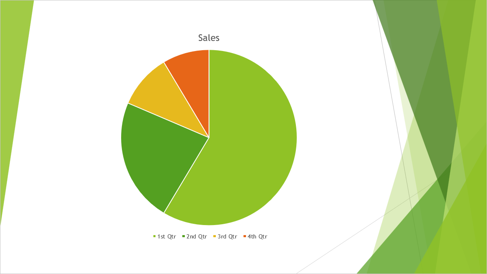

## **Giới thiệu**

TIFF (**Tagged Image File Format**) là một định dạng ảnh raster không mất dữ liệu, được sử dụng rộng rãi và nổi tiếng với chất lượng xuất sắc và khả năng bảo tồn chi tiết đồ họa. Các nhà thiết kế, nhiếp ảnh gia và nhà xuất bản bàn làm việc thường chọn TIFF để duy trì các lớp, độ chính xác màu và cài đặt gốc trong hình ảnh của họ.

Sử dụng Aspose.Slides, bạn có thể dễ dàng chuyển đổi các slide PowerPoint (PPT, PPTX) và slide OpenDocument (ODP) trực tiếp thành hình ảnh TIFF chất lượng cao, đảm bảo bài thuyết trình của bạn giữ lại độ trung thực hình ảnh tối đa. 

## **Chuyển đổi bản trình chiếu sang TIFF**

Sử dụng phương thức [save](https://reference.aspose.com/slides/vi/androidjava/com.aspose.slides/presentation/#save-java.lang.String-int-) được cung cấp bởi lớp [Presentation](https://reference.aspose.com/slides/vi/androidjava/com.aspose.slides/presentation/) , bạn có thể nhanh chóng chuyển đổi toàn bộ bản trình chiếu PowerPoint sang TIFF. Các hình ảnh TIFF tạo ra tương ứng với kích thước slide mặc định.

Đoạn mã dưới đây minh họa cách chuyển đổi bản trình chiếu PowerPoint sang TIFF:

```java
import com.aspose.slides.*;

// Tạo một thể hiện của lớp Presentation đại diện cho tệp bản trình chiếu (PPT, PPTX, ODP, v.v.).
Presentation presentation = new Presentation("presentation.pptx");
try {
    // Lưu bản trình chiếu dưới dạng TIFF.
    presentation.save("output.tiff", SaveFormat.Tiff);
} finally {
    presentation.dispose();
}
```

## **Chuyển đổi bản trình chiếu sang TIFF đen trắng**

Phương thức [setBwConversionMode](https://reference.aspose.com/slides/vi/androidjava/com.aspose.slides/tiffoptions/#setBwConversionMode-int-) trong lớp [TiffOptions](https://reference.aspose.com/slides/vi/androidjava/com.aspose.slides/tiffoptions/) cho phép bạn chỉ định thuật toán được sử dụng khi chuyển đổi một slide hoặc ảnh màu sang TIFF đen trắng. Lưu ý rằng cài đặt này chỉ áp dụng khi phương thức [setCompressionType](https://reference.aspose.com/slides/vi/androidjava/com.aspose.slides/tiffoptions/#setCompressionType-int-) được đặt thành `CCITT4` hoặc `CCITT3`.

Giả sử chúng ta có một tệp "sample.pptx" với slide sau:



Đoạn mã dưới đây minh họa cách chuyển đổi slide màu sang TIFF đen trắng:

```java
import com.aspose.slides.*;

TiffOptions tiffOptions = new TiffOptions();
tiffOptions.setCompressionType(TiffCompressionTypes.CCITT4);
tiffOptions.setBwConversionMode(BlackWhiteConversionMode.Dithering);

Presentation presentation = new Presentation("sample.pptx");
try {
    presentation.save("output.tiff", SaveFormat.Tiff, tiffOptions);
} finally {
    presentation.dispose();
}
```

Kết quả:


## **Chuyển đổi bản trình chiếu sang TIFF với kích thước tùy chỉnh**

Nếu bạn cần một hình ảnh TIFF với kích thước cụ thể, bạn có thể đặt các giá trị mong muốn bằng các phương thức có sẵn trong [TiffOptions](https://reference.aspose.com/slides/vi/androidjava/com.aspose.slides/tiffoptions/). Ví dụ, phương thức [setImageSize](https://reference.aspose.com/slides/vi/androidjava/com.aspose.slides/tiffoptions/#setImageSize-com.aspose.slides.android.Size-) cho phép bạn xác định kích thước của ảnh kết quả.

Đoạn mã dưới đây minh họa cách chuyển đổi bản trình chiếu PowerPoint sang các hình ảnh TIFF với kích thước tùy chỉnh:

```java
import com.aspose.slides.*;
import com.aspose.slides.android.Size;

// Tạo một thể hiện của lớp Presentation đại diện cho tệp bản trình chiếu (PPT, PPTX, ODP, v.v.).
Presentation presentation = new Presentation("presentation.pptx");
try {
    TiffOptions tiffOptions = new TiffOptions();

    // Đặt loại nén.
    tiffOptions.setCompressionType(TiffCompressionTypes.Default);
    /*
    Các loại nén:
        Default - Chỉ định phương án nén mặc định (LZW).
        None - Chỉ định không nén.
        CCITT3
        CCITT4
        LZW
        RLE
    */

    // Độ sâu phụ thuộc vào loại nén và không thể được đặt thủ công.

    // Đặt DPI của ảnh.
    tiffOptions.setDpiX(200);
    tiffOptions.setDpiY(200);

    // Đặt kích thước ảnh.
    tiffOptions.setImageSize(new Size(1728, 1078));

    NotesCommentsLayoutingOptions notesOptions = new NotesCommentsLayoutingOptions();
    notesOptions.setNotesPosition(NotesPositions.BottomFull);
    tiffOptions.setSlidesLayoutOptions(notesOptions);

    // Lưu bản trình chiếu dưới dạng TIFF với kích thước đã chỉ định.
    presentation.save("tiff-ImageSize.tiff", SaveFormat.Tiff, tiffOptions);
} finally {
    presentation.dispose();
}   
```

## **Chuyển đổi bản trình chiếu sang TIFF với định dạng pixel ảnh tùy chỉnh**

Sử dụng phương thức [setPixelFormat](https://reference.aspose.com/slides/vi/androidjava/com.aspose.slides/tiffoptions/#setPixelFormat-int-) từ lớp [TiffOptions](https://reference.aspose.com/slides/vi/androidjava/com.aspose.slides/tiffoptions/) , bạn có thể chỉ định định dạng pixel ưa thích cho ảnh TIFF kết quả.

Đoạn mã dưới đây minh họa cách chuyển đổi bản trình chiếu PowerPoint sang một ảnh TIFF với định dạng pixel tùy chỉnh:

```java
import com.aspose.slides.*;

// Tạo một thể hiện của lớp Presentation đại diện cho tệp bản trình chiếu (PPT, PPTX, ODP, v.v.).
Presentation presentation = new Presentation("presentation.pptx");
try {
    TiffOptions tiffOptions = new TiffOptions();

    tiffOptions.setPixelFormat(ImagePixelFormat.Format8bppIndexed);
    /*
    ImagePixelFormat chứa các giá trị sau (theo tài liệu):
        Format1bppIndexed - 1 bit mỗi pixel, đã lập chỉ mục.
        Format4bppIndexed - 4 bit mỗi pixel, đã lập chỉ mục.
        Format8bppIndexed - 8 bit mỗi pixel, đã lập chỉ mục.
        Format24bppRgb    - 24 bit mỗi pixel, RGB.
        Format32bppArgb   - 32 bit mỗi pixel, ARGB.
    */
    
    // Lưu bản trình chiếu dưới dạng TIFF với định dạng pixel đã chỉ định.
    presentation.save("Tiff-PixelFormat.tiff", SaveFormat.Tiff, tiffOptions);
} finally {
    presentation.dispose();
}
```

{}
Hãy xem công cụ chuyển đổi [MIỄN PHÍ PowerPoint sang Poster](https://products.aspose.app/slides/vi/conversion/convert-ppt-to-poster-online) của Aspose.
{}

## **Câu hỏi thường gặp**

### Tôi có thể chuyển đổi một slide riêng lẻ thay vì toàn bộ bản trình chiếu PowerPoint sang TIFF không?

Có. Aspose.Slides cho phép bạn chuyển đổi các slide riêng lẻ từ bản trình chiếu PowerPoint và OpenDocument thành các ảnh TIFF một cách riêng rẽ.

### Có giới hạn nào về số lượng slide khi chuyển đổi bản trình chiếu sang TIFF không?

Không, Aspose.Slides không đặt bất kỳ hạn chế nào về số lượng slide. Bạn có thể chuyển đổi các bản trình chiếu có kích thước bất kỳ sang định dạng TIFF.

### Các hoạt ảnh và hiệu ứng chuyển tiếp của PowerPoint có được giữ lại khi chuyển đổi slide sang TIFF không?

Không, TIFF là định dạng ảnh tĩnh. Do đó, các hoạt ảnh và hiệu ứng chuyển tiếp không được giữ lại; chỉ có các ảnh chụp tĩnh của các slide được xuất.