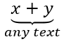

## **Tổng quan**

PowerPoint lưu trữ các phương trình dưới dạng Office Math Markup Language (OMML). Với Aspose.Slides cho Android qua Java, bạn có thể tạo cùng loại nội dung toán học một cách lập trình: phân số, căn bậc, hàm, giới hạn, toán tử N-ary, ma trận, mảng và các khối toán học có định dạng.

Trong PowerPoint, người dùng thường thêm phương trình từ **Insert > Equation**:


Kết quả là văn bản toán học có thể chỉnh sửa trên slide:


Aspose.Slides tạo ra văn bản toán học đó thông qua ba đối tượng chính:

- Một hình dạng toán học, được tạo bằng [addMathShape](https://reference.aspose.com/slides/vi/androidjava/com.aspose.slides/ishapecollection/), là hình chứa phương trình.
- [MathPortion](https://reference.aspose.com/slides/vi/androidjava/com.aspose.slides/mathportion/) lưu trữ nội dung toán học trong khung văn bản của hình.
- [MathParagraph](https://reference.aspose.com/slides/vi/androidjava/com.aspose.slides/mathparagraph/) chứa một hoặc nhiều đối tượng [MathBlock](https://reference.aspose.com/slides/vi/androidjava/com.aspose.slides/mathblock/).

Hầu hết các ví dụ dưới đây sử dụng [MathematicalText](https://reference.aspose.com/slides/vi/androidjava/com.aspose.slides/mathematicaltext/) và các phương thức lưu loát từ [IMathElement](https://reference.aspose.com/slides/vi/androidjava/com.aspose.slides/imathelement/) để giữ mã ngắn gọn và dễ đọc.

Đối với các trường hợp xuất MathML, xem [Export Math Equations from Presentations on Android](/slides/vi/androidjava/exporting-math-equations/).

## **Tạo một Phương trình**

Ví dụ này tạo một hình dạng toán học và thêm định lý Pythagoras:


```java
Presentation presentation = new Presentation();
try {
    ISlide slide = presentation.getSlides().get_Item(0);

    IAutoShape mathShape = slide.getShapes().addMathShape(20, 20, 700, 120);
    IMathParagraph mathParagraph = ((MathPortion) mathShape.getTextFrame().getParagraphs()
            .get_Item(0).getPortions().get_Item(0)).getMathParagraph();

    IMathBlock equation = new MathematicalText("c")
            .setSuperscript("2")
            .join("=")
            .join(new MathematicalText("a").setSuperscript("2"))
            .join("+")
            .join(new MathematicalText("b").setSuperscript("2"));

    mathParagraph.add(equation);

    presentation.save("pythagorean-theorem.pptx", SaveFormat.Pptx);
} finally {
    presentation.dispose();
}
```

{}
`addMathShape` tạo một hình đã chứa sẵn một đoạn toán học. Truy cập `MathPortion` đầu tiên, lấy `MathParagraph` của nó và thêm các khối toán học hoặc phần tử toán học vào đó.
{}

## **Thêm Phân số**

Sử dụng `divide` để tạo một phân số. Bạn có thể chọn kiểu phân số bằng [MathFractionTypes](https://reference.aspose.com/slides/vi/androidjava/com.aspose.slides/mathfractiontypes/).


```java
Presentation presentation = new Presentation();
try {
    ISlide slide = presentation.getSlides().get_Item(0);

    IAutoShape mathShape = slide.getShapes().addMathShape(20, 20, 700, 100);
    IMathParagraph mathParagraph = ((MathPortion) mathShape.getTextFrame().getParagraphs()
            .get_Item(0).getPortions().get_Item(0)).getMathParagraph();

    IMathFraction fraction = new MathematicalText("1")
            .divide("x", MathFractionTypes.Skewed);

    mathParagraph.add(new MathBlock(fraction));

    presentation.save("fraction.pptx", SaveFormat.Pptx);
} finally {
    presentation.dispose();
}
```

Đối với phân số chồng, sử dụng `MathFractionTypes.Bar`:

```java
IMathFraction stackedFraction = new MathematicalText("x + 1").divide("y - 1", MathFractionTypes.Bar);
```

## **Thêm Cân bậc**

Sử dụng `radical` để tạo căn bậc hai, căn bậc ba hoặc các căn khác. Phần tử hiện tại trở thành cơ số, và đối số trở thành bậc.


```java
Presentation presentation = new Presentation();
try {
    ISlide slide = presentation.getSlides().get_Item(0);

    IAutoShape mathShape = slide.getShapes().addMathShape(20, 20, 700, 100);
    IMathParagraph mathParagraph = ((MathPortion) mathShape.getTextFrame().getParagraphs()
            .get_Item(0).getPortions().get_Item(0)).getMathParagraph();

    IMathRadical radical = new MathematicalText("x")
            .radical("n");

    mathParagraph.add(new MathBlock(radical));

    presentation.save("radical.pptx", SaveFormat.Pptx);
} finally {
    presentation.dispose();
}
```

## **Thêm Hàm và Giới hạn**

Sử dụng `asArgumentOfFunction` hoặc `function` cho các hàm như `sin(x)`, `log(x)`, hoặc tên hàm tùy chỉnh. Đối với giới hạn, đặt `lim` trong một [MathLimit](https://reference.aspose.com/slides/vi/androidjava/com.aspose.slides/mathlimit/) hoặc sử dụng `setLowerLimit`.


```java
Presentation presentation = new Presentation();
try {
    ISlide slide = presentation.getSlides().get_Item(0);

    IAutoShape mathShape = slide.getShapes().addMathShape(20, 20, 700, 100);
    IMathParagraph mathParagraph = ((MathPortion) mathShape.getTextFrame().getParagraphs()
            .get_Item(0).getPortions().get_Item(0)).getMathParagraph();

    IMathFunction limit = new MathematicalText("lim")
            .setLowerLimit("x→∞")
            .function("x");

    mathParagraph.add(new MathBlock(limit));

    presentation.save("functions-and-limits.pptx", SaveFormat.Pptx);
} finally {
    presentation.dispose();
}
```

Đối với tên hàm tùy chỉnh, đặt tên hàm làm phần tử hiện tại:

```java
IMathFunction customFunction = new MathematicalText("f").function("x + 1");
```

## **Thêm Toán tử N-ary và Tích phân**

Sử dụng `nary` cho các phép cộng, hợp, giao và các toán tử lớn khác. Sử dụng `integral` cho tích phân. Cả hai phương pháp đều cho phép bạn đặt giới hạn dưới và trên.


```java
Presentation presentation = new Presentation();
try {
    ISlide slide = presentation.getSlides().get_Item(0);

    IAutoShape mathShape = slide.getShapes().addMathShape(20, 20, 700, 120);
    IMathParagraph mathParagraph = ((MathPortion) mathShape.getTextFrame().getParagraphs()
            .get_Item(0).getPortions().get_Item(0)).getMathParagraph();

    IMathBlock summationBase = new MathematicalText("x")
            .setSuperscript("k")
            .join(new MathematicalText("a").setSuperscript("n-k"));

    IMathNaryOperator summation = summationBase.nary(MathNaryOperatorTypes.Summation, "k=0", "n");

    mathParagraph.add(new MathBlock(summation));

    presentation.save("nary-operators.pptx", SaveFormat.Pptx);
} finally {
    presentation.dispose();
}
```

Các toán tử N-ary dùng cho các toán tử lớn có tùy chọn giới hạn. Các toán tử đơn giản như `+`, `-`, và `=` thường được thêm dưới dạng `MathematicalText` và nối vào biểu thức.

Đối với một tích phân, sử dụng `integral`:

```java
IMathBlock integralBase = new MathematicalText("x").join(new MathematicalText("dx").toBox());
IMathNaryOperator integral = integralBase.integral(MathIntegralTypes.Simple, "0", "1");
```

## **Thêm Ma trận**

Sử dụng [MathMatrix](https://reference.aspose.com/slides/vi/androidjava/com.aspose.slides/mathmatrix/) cho hàng và cột. Ma trận không bao gồm dấu ngoặc theo mặc định, vì vậy hãy bao quanh ma trận khi bạn cần dấu ngoặc đơn, dấu ngoặc vuông hoặc dấu ngoặc nhọn.


```java
Presentation presentation = new Presentation();
try {
    ISlide slide = presentation.getSlides().get_Item(0);

    IAutoShape mathShape = slide.getShapes().addMathShape(20, 20, 700, 120);
    IMathParagraph mathParagraph = ((MathPortion) mathShape.getTextFrame().getParagraphs()
            .get_Item(0).getPortions().get_Item(0)).getMathParagraph();

    MathMatrix matrix = new MathMatrix(2, 3);
    matrix.set_Item(0, 0, new MathematicalText("1"));
    matrix.set_Item(0, 1, new MathematicalText("x"));
    matrix.set_Item(1, 0, new MathematicalText("x"));
    matrix.set_Item(1, 1, new MathematicalText("2"));
    matrix.set_Item(1, 2, new MathematicalText("y"));

    mathParagraph.add(new MathBlock(matrix));

    presentation.save("matrix.pptx", SaveFormat.Pptx);
} finally {
    presentation.dispose();
}
```

## **Thêm Mảng Phương trình**

Sử dụng `toMathArray` khi bạn cần các phương trình được căn chỉnh hoặc một chồng dọc các biểu thức.


```java
Presentation presentation = new Presentation();
try {
    ISlide slide = presentation.getSlides().get_Item(0);

    IAutoShape mathShape = slide.getShapes().addMathShape(20, 20, 700, 140);
    IMathParagraph mathParagraph = ((MathPortion) mathShape.getTextFrame().getParagraphs()
            .get_Item(0).getPortions().get_Item(0)).getMathParagraph();

    IMathArray equationArray = new MathematicalText("x")
            .join("y")
            .toMathArray();

    mathParagraph.add(new MathBlock(equationArray));

    presentation.save("equation-array.pptx", SaveFormat.Pptx);
} finally {
    presentation.dispose();
}
```

## **Thêm Hàm lượng giác**

Sử dụng `asArgumentOfFunction` khi đối số là phần tử hiện tại và tên hàm đã biết.


```java
Presentation presentation = new Presentation();
try {
    ISlide slide = presentation.getSlides().get_Item(0);

    IAutoShape mathShape = slide.getShapes().addMathShape(20, 20, 700, 100);
    IMathParagraph mathParagraph = ((MathPortion) mathShape.getTextFrame().getParagraphs()
            .get_Item(0).getPortions().get_Item(0)).getMathParagraph();

    IMathFunction cosine = new MathematicalText("2x")
            .asArgumentOfFunction(MathFunctionsOfOneArgument.Cos);

    mathParagraph.add(new MathBlock(cosine));

    presentation.save("trigonometric-function.pptx", SaveFormat.Pptx);
} finally {
    presentation.dispose();
}
```

## **Thêm Chỉ mục và Số mũ**

Sử dụng các trợ giúp subscript và superscript cho chỉ mục và lũy thừa. Khi các chỉ mục phải xuất hiện ở phía bên trái của cơ số, sử dụng `setSubSuperscriptOnTheLeft`.


```java
Presentation presentation = new Presentation();
try {
    ISlide slide = presentation.getSlides().get_Item(0);

    IAutoShape mathShape = slide.getShapes().addMathShape(20, 20, 700, 100);
    IMathParagraph mathParagraph = ((MathPortion) mathShape.getTextFrame().getParagraphs()
            .get_Item(0).getPortions().get_Item(0)).getMathParagraph();

    IMathLeftSubSuperscriptElement scripts = new MathematicalText("Y")
            .setSubSuperscriptOnTheLeft("1", "n");

    mathParagraph.add(new MathBlock(scripts));

    presentation.save("subscript-superscript.pptx", SaveFormat.Pptx);
} finally {
    presentation.dispose();
}
```

## **Thêm Dấu bao**

Sử dụng `enclose` để đặt một biểu thức bên trong dấu bao. Bạn cũng có thể đặt ký tự phân tách cho các biểu thức dấu bao chứa nhiều phần tử.


```java
Presentation presentation = new Presentation();
try {
    ISlide slide = presentation.getSlides().get_Item(0);

    IAutoShape mathShape = slide.getShapes().addMathShape(20, 20, 700, 100);
    IMathParagraph mathParagraph = ((MathPortion) mathShape.getTextFrame().getParagraphs()
            .get_Item(0).getPortions().get_Item(0)).getMathParagraph();

    IMathDelimiter delimiter = new MathematicalText("x")
            .join("y")
            .join("z")
            .enclose('<', '>');
    delimiter.setSeparatorCharacter('|');

    mathParagraph.add(new MathBlock(delimiter));

    presentation.save("delimiters.pptx", SaveFormat.Pptx);
} finally {
    presentation.dispose();
}
```

## **Thêm Khung viền**

Sử dụng `toBorderBox` khi phương trình cần được bao quanh bởi một khung.


```java
Presentation presentation = new Presentation();
try {
    ISlide slide = presentation.getSlides().get_Item(0);

    IAutoShape mathShape = slide.getShapes().addMathShape(20, 20, 700, 100);
    IMathParagraph mathParagraph = ((MathPortion) mathShape.getTextFrame().getParagraphs()
            .get_Item(0).getPortions().get_Item(0)).getMathParagraph();

    IMathBorderBox boxedEquation = new MathematicalText("a")
            .setSuperscript("2")
            .join("=")
            .join(new MathematicalText("b").setSuperscript("2"))
            .join("+")
            .join(new MathematicalText("c").setSuperscript("2"))
            .toBorderBox();

    mathParagraph.add(new MathBlock(boxedEquation));

    presentation.save("border-box.pptx", SaveFormat.Pptx);
} finally {
    presentation.dispose();
}
```

## **Nhóm các Thành phần**

Sử dụng `group` để đặt ký tự nhóm phía trên hoặc phía dưới một biểu thức. Thêm giới hạn để dán nhãn cho các thành phần đã nhóm.



```java
Presentation presentation = new Presentation();
try {
    ISlide slide = presentation.getSlides().get_Item(0);

    IAutoShape mathShape = slide.getShapes().addMathShape(20, 20, 700, 120);
    IMathParagraph mathParagraph = ((MathPortion) mathShape.getTextFrame().getParagraphs()
            .get_Item(0).getPortions().get_Item(0)).getMathParagraph();

    IMathLimit grouped = new MathematicalText("x + y")
            .group('\u23DF', MathTopBotPositions.Bottom, MathTopBotPositions.Top)
            .setLowerLimit("any text");

    mathParagraph.add(new MathBlock(grouped));

    presentation.save("grouped-terms.pptx", SaveFormat.Pptx);
} finally {
    presentation.dispose();
}
```

## **Định dạng Các Phần tử Toán học**

Chỉ sử dụng các trợ giúp định dạng khi chúng làm rõ công thức. Ví dụ, `overbar` đặt một thanh phía trên một phần tử toán học.


```java
Presentation presentation = new Presentation();
try {
    ISlide slide = presentation.getSlides().get_Item(0);

    IAutoShape mathShape = slide.getShapes().addMathShape(20, 20, 700, 100);
    IMathParagraph mathParagraph = ((MathPortion) mathShape.getTextFrame().getParagraphs()
            .get_Item(0).getPortions().get_Item(0)).getMathParagraph();

    IMathBar overbar = new MathematicalText("ABC").overbar();

    mathParagraph.add(new MathBlock(overbar));

    presentation.save("overbar.pptx", SaveFormat.Pptx);
} finally {
    presentation.dispose();
}
```

## **Tham chiếu nhanh**

| Nhiệm vụ | API chính |
| --- | --- |
| Tạo văn bản toán học | [MathematicalText](https://reference.aspose.com/slides/vi/androidjava/com.aspose.slides/mathematicaltext/) |
| Kết hợp các phần tử | [IMathElement.join](https://reference.aspose.com/slides/vi/androidjava/com.aspose.slides/imathelement/) |
| Tạo phân số | [IMathElement.divide](https://reference.aspose.com/slides/vi/androidjava/com.aspose.slides/imathelement/) |
| Thêm chỉ số trên hoặc chỉ số dưới | [setSuperscript](https://reference.aspose.com/slides/vi/androidjava/com.aspose.slides/imathelement/), [setSubscript](https://reference.aspose.com/slides/vi/androidjava/com.aspose.slides/imathelement/) |
| Thêm hàm | [function](https://reference.aspose.com/slides/vi/androidjava/com.aspose.slides/imathelement/), [asArgumentOfFunction](https://reference.aspose.com/slides/vi/androidjava/com.aspose.slides/imathelement/) |
| Thêm căn bậc | [IMathElement.radical](https://reference.aspose.com/slides/vi/androidjava/com.aspose.slides/imathelement/) |
| Thêm giới hạn | [setLowerLimit](https://reference.aspose.com/slides/vi/androidjava/com.aspose.slides/imathelement/), [setUpperLimit](https://reference.aspose.com/slides/vi/androidjava/com.aspose.slides/imathelement/) |
| Thêm chỉ mục bên trái | [setSubSuperscriptOnTheLeft](https://reference.aspose.com/slides/vi/androidjava/com.aspose.slides/imathelement/) |
| Thêm phép cộng và tích phân | [nary](https://reference.aspose.com/slides/vi/androidjava/com.aspose.slides/imathelement/), [integral](https://reference.aspose.com/slides/vi/androidjava/com.aspose.slides/imathelement/) |
| Thêm ma trận | [MathMatrix](https://reference.aspose.com/slides/vi/androidjava/com.aspose.slides/mathmatrix/) |
| Thêm mảng phương trình | [toMathArray](https://reference.aspose.com/slides/vi/androidjava/com.aspose.slides/imathelement/) |
| Thêm dấu bao | [enclose](https://reference.aspose.com/slides/vi/androidjava/com.aspose.slides/imathelement/) |
| Thêm thanh và khung viền | [overbar](https://reference.aspose.com/slides/vi/androidjava/com.aspose.slides/imathelement/), [toBorderBox](https://reference.aspose.com/slides/vi/androidjava/com.aspose.slides/imathelement/) |
| Nhóm các thành phần | [group](https://reference.aspose.com/slides/vi/androidjava/com.aspose.slides/imathelement/) |

## **Câu hỏi thường gặp**

**Tôi có thể chỉnh sửa một phương trình PowerPoint hiện có không?**

Có. Mở bản trình chiếu, tìm hình chứa `MathPortion`, lấy `MathParagraph` của nó và cập nhật các khối toán học trong đoạn đó.

**Các phương trình có được lưu dưới dạng toán học PowerPoint có thể chỉnh sửa không?**

Có. Khi lưu dưới dạng PPTX, Aspose.Slides ghi phương trình dưới dạng nội dung toán học Office có thể chỉnh sửa.

**Tôi có thể xuất các phương trình sang LaTeX không?**

Có. Lấy [IMathParagraph](https://reference.aspose.com/slides/vi/androidjava/com.aspose.slides/imathparagraph/) của phương trình từ [IMathPortion](https://reference.aspose.com/slides/vi/androidjava/com.aspose.slides/imathportion/), và gọi [IMathParagraph.toLatex](https://reference.aspose.com/slides/vi/androidjava/com.aspose.slides/imathparagraph/#toLatex--) để xuất trực tiếp. Đối với ví dụ đầy đủ, xem [Export Math Equations from Presentations in Android via Java](/slides/vi/androidjava/exporting-math-equations/#export-math-equations-to-latex).