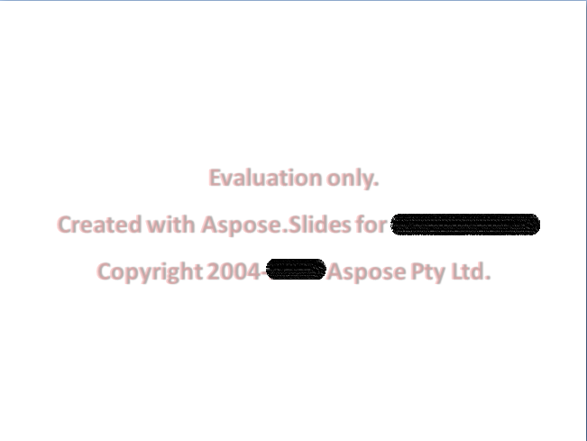

## **Đánh giá Aspose.Slides**

Bạn có thể tải xuống Aspose.Slides để đánh giá. Gói đánh giá giống với gói đã mua; nó sẽ được cấp phép sau khi bạn thêm một vài dòng mã để áp dụng giấy phép.

Nếu không có giấy phép, Aspose.Slides cung cấp đầy đủ chức năng trong chế độ đánh giá, nhưng có hai hạn chế: nó thêm một hộp văn bản watermark đánh giá vào mỗi slide của mỗi bản trình bày khi lưu, và văn bản mà mã của bạn đọc từ một bản trình bày sẽ bị cắt ngắn đến vài ký tự đầu tiên, kèm theo thông báo về hạn chế đánh giá. Văn bản mà mã của bạn ghi sẽ được lưu đầy đủ.

{}
Nếu bạn muốn thử Aspose.Slides mà không gặp các hạn chế của phiên bản đánh giá, bạn có thể yêu cầu Giấy phép tạm thời 30 ngày. Vui lòng tham khảo [Cách lấy Giấy phép tạm thời?](https://purchase.aspose.com/temporary-license) để biết thêm thông tin.
{}

Để thêm gói đánh giá vào dự án Android của bạn, xem [Cài đặt](/slides/vi/androidjava/install-aspose-slides-for-android-via-java/). Để loại bỏ các hạn chế, [áp dụng giấy phép](/slides/vi/androidjava/licensing/).

## **FAQ**

### Tôi có thể kiểm thử nhiều bản trình bày cùng lúc trên các luồng khác nhau trong chế độ đánh giá không?

Có. Bạn có thể xử lý các tài liệu khác nhau song song; bạn không nên chia sẻ cùng một đối tượng bản trình bày [trên các luồng](/slides/vi/androidjava/multithreading/). Chế độ đánh giá không ảnh hưởng đến việc này.

### Tôi có cần cài đặt Microsoft PowerPoint để đánh giá thư viện trên server hoặc trong CI không?

Không. Aspose.Slides là một engine độc lập và không yêu cầu cài đặt PowerPoint cho cả chế độ đánh giá và sản xuất.

### Tôi có thể hoàn toàn kiểm thử chuyển đổi PPT/PPTX sang PDF và hình ảnh trong chế độ đánh giá không?

Có. Các [bộ chuyển đổi](/slides/vi/androidjava/convert-presentation/) hoạt động; kết quả sẽ bao gồm một watermark.

### Tôi có thể sử dụng giấy phép tạm thời để kiểm thử tải mà không có watermark không?

Có. Giấy phép tạm thời 30 ngày loại bỏ các hạn chế của chế độ đánh giá và cho phép kiểm thử mà không có watermark.