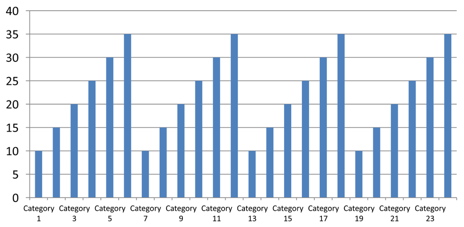

## **Tổng quan**

Bài viết này giải thích cách tùy chỉnh trục biểu đồ với Aspose.Slides cho C++. Nó bao gồm các giá trị trục được tính toán, việc hoán đổi hàng và cột của biểu đồ, hiển thị trục, khoảng cách nhãn danh mục và dấu tick, danh mục ngày và định dạng, xoay tiêu đề, vị trí trục và đơn vị hiển thị.

## **Lấy các Giá Trị Tối Đa trên Trục Dọc trong Biểu Đồ**

Tạo một [Presentation](https://reference.aspose.com/slides/cpp/aspose.slides/presentation/) và thêm một biểu đồ khu vực với dữ liệu mặc định. Gọi [ValidateChartLayout](https://reference.aspose.com/slides/cpp/aspose.slides.charts/chart/validatechartlayout/) trước khi đọc các giá trị trục đã tính để bố cục biểu đồ được cập nhật.

Đọc [get_ActualMaxValue](https://reference.aspose.com/slides/cpp/aspose.slides.charts/axis/get_actualmaxvalue/) và [get_ActualMinValue](https://reference.aspose.com/slides/cpp/aspose.slides.charts/axis/get_actualminvalue/) để lấy giới hạn trục, và [get_ActualMajorUnit](https://reference.aspose.com/slides/cpp/aspose.slides.charts/axis/get_actualmajorunit/) và [get_ActualMinorUnit](https://reference.aspose.com/slides/cpp/aspose.slides.charts/axis/get_actualminorunit/) để lấy khoảng cách dấu tick. [get_ActualMajorUnitScale](https://reference.aspose.com/slides/cpp/aspose.slides.charts/axis/get_actualmajorunitscale/) và [get_ActualMinorUnitScale](https://reference.aspose.com/slides/cpp/aspose.slides.charts/axis/get_actualminorunitscale/) cung cấp thang đo thời gian, có liên quan đến trục ngày. Ví dụ lưu các giá trị này vào các biến cục bộ và lưu biểu đồ.

```cpp
#include <DOM/Presentation.h>
#include <DOM/ISlide.h>
#include <DOM/IShapeCollection.h>
#include <DOM/IChart.h>
#include <DOM/Chart/ChartType.h>
#include <DOM/Chart/IAxesManager.h>
#include <DOM/Chart/IAxis.h>
#include <Export/SaveFormat.h>

using namespace Aspose::Slides;
using namespace Aspose::Slides::Charts;
using namespace Aspose::Slides::Export;

auto presentation = System::MakeObject<Presentation>();
auto slide = presentation->get_Slide(0);

auto chart = slide->get_Shapes()->AddChart(ChartType::Area, 100, 100, 500, 350);
chart->ValidateChartLayout();

auto maxValue = chart->get_Axes()->get_VerticalAxis()->get_ActualMaxValue();
auto minValue = chart->get_Axes()->get_VerticalAxis()->get_ActualMinValue();

auto majorUnit = chart->get_Axes()->get_VerticalAxis()->get_ActualMajorUnit();
auto minorUnit = chart->get_Axes()->get_VerticalAxis()->get_ActualMinorUnit();

auto majorUnitScale = chart->get_Axes()->get_VerticalAxis()->get_ActualMajorUnitScale();
auto minorUnitScale = chart->get_Axes()->get_VerticalAxis()->get_ActualMinorUnitScale();

presentation->Save(u"AxisValues_out.pptx", SaveFormat::Pptx);
```

## **Hoán Đổi Dữ Liệu giữa Các Trục**

Sử dụng [SwitchRowColumn](https://reference.aspose.com/slides/cpp/aspose.slides.charts/chartdata/switchrowcolumn/) để hoán đổi vai trò của chuỗi và danh mục trong dữ liệu biểu đồ. Mỗi danh mục trước đây trở thành một chuỗi, và mỗi chuỗi trước đây trở thành một danh mục. Điều này thay đổi cách nhóm dữ liệu; nó không hoán đổi trục ngang và trục dọc. Ví dụ sử dụng [SetRange](https://reference.aspose.com/slides/cpp/aspose.slides.charts/chartdata/setrange/) để liên kết dữ liệu mặc định với `Sheet1!A1:D5`, bao gồm hàng tiêu đề và cột danh mục, trước khi hoán đổi hàng và cột. Nó lưu một biểu đồ có bốn chuỗi và ba danh mục.

```cpp
#include <DOM/Presentation.h>
#include <DOM/ISlide.h>
#include <DOM/IShapeCollection.h>
#include <DOM/IChart.h>
#include <DOM/Chart/ChartType.h>
#include <DOM/Chart/IAxesManager.h>
#include <DOM/Chart/IAxis.h>
#include <Export/SaveFormat.h>
#include <DOM/Chart/IChartData.h>

using namespace Aspose::Slides;
using namespace Aspose::Slides::Charts;
using namespace Aspose::Slides::Export;

auto presentation = System::MakeObject<Presentation>();
auto slide = presentation->get_Slide(0);

auto chart = slide->get_Shapes()->AddChart(ChartType::ClusteredColumn, 100, 100, 400, 300);

chart->get_ChartData()->SetRange(u"Sheet1!A1:D5");
chart->get_ChartData()->SwitchRowColumn();

presentation->Save(u"SwitchChartRowColumns_out.pptx", SaveFormat::Pptx);
```

## **Vô Hiệu Hóa Trục Dọc cho Biểu Đồ Đường**

Sử dụng [set_IsVisible](https://reference.aspose.com/slides/cpp/aspose.slides.charts/axis/set_isvisible/) với `false` trên trục dọc để ẩn nó. Ví dụ tạo một biểu đồ đường với dữ liệu mặc định và lưu nó với trục dọc ẩn.

```cpp
#include <DOM/Presentation.h>
#include <DOM/ISlide.h>
#include <DOM/IShapeCollection.h>
#include <DOM/IChart.h>
#include <DOM/Chart/ChartType.h>
#include <DOM/Chart/IAxesManager.h>
#include <DOM/Chart/IAxis.h>
#include <Export/SaveFormat.h>

using namespace Aspose::Slides;
using namespace Aspose::Slides::Charts;
using namespace Aspose::Slides::Export;

auto presentation = System::MakeObject<Presentation>();
auto slide = presentation->get_Slide(0);

auto chart = slide->get_Shapes()->AddChart(ChartType::Line, 100, 100, 400, 300);
chart->get_Axes()->get_VerticalAxis()->set_IsVisible(false);

presentation->Save(u"HiddenVerticalAxis.pptx", SaveFormat::Pptx);
```

## **Vô Hiệu Hóa Trục Ngang cho Biểu Đồ Đường**

Sử dụng [set_IsVisible](https://reference.aspose.com/slides/cpp/aspose.slides.charts/axis/set_isvisible/) với `false` trên trục ngang để ẩn nó. Ví dụ tạo một biểu đồ đường với dữ liệu mặc định và lưu nó với trục ngang ẩn.

```cpp
#include <DOM/Presentation.h>
#include <DOM/ISlide.h>
#include <DOM/IShapeCollection.h>
#include <DOM/IChart.h>
#include <DOM/Chart/ChartType.h>
#include <DOM/Chart/IAxesManager.h>
#include <DOM/Chart/IAxis.h>
#include <Export/SaveFormat.h>

using namespace Aspose::Slides;
using namespace Aspose::Slides::Charts;
using namespace Aspose::Slides::Export;

auto presentation = System::MakeObject<Presentation>();
auto slide = presentation->get_Slide(0);

auto chart = slide->get_Shapes()->AddChart(ChartType::Line, 100, 100, 400, 300);
chart->get_Axes()->get_HorizontalAxis()->set_IsVisible(false);

presentation->Save(u"HiddenHorizontalAxis.pptx", SaveFormat::Pptx);
```

## **Thay Đổi Trục Danh Mục**

Sử dụng [set_CategoryAxisType](https://reference.aspose.com/slides/cpp/aspose.slides.charts/axis/set_categoryaxistype/) để chọn trục danh mục ngày hoặc văn bản. Ví dụ này yêu cầu `ExistingChart.pptx`, với một biểu đồ là hình dạng đầu tiên trên slide đầu tiên và các ô danh mục chứa giá trị ngày Excel dạng số. Nó thay đổi trục ngang thành trục ngày. Gọi [set_IsAutomaticMajorUnit](https://reference.aspose.com/slides/cpp/aspose.slides.charts/axis/set_isautomaticmajorunit/) với `false`, [set_MajorUnit](https://reference.aspose.com/slides/cpp/aspose.slides.charts/axis/set_majorunit/) với `1`, và [set_MajorUnitScale](https://reference.aspose.com/slides/cpp/aspose.slides.charts/axis/set_majorunitscale/) với tháng để đặt các dấu tick chính ở khoảng một tháng.

```cpp
#include <DOM/Presentation.h>
#include <DOM/ISlide.h>
#include <DOM/IShapeCollection.h>
#include <DOM/IChart.h>
#include <DOM/Chart/ChartType.h>
#include <DOM/Chart/IAxesManager.h>
#include <DOM/Chart/IAxis.h>
#include <Export/SaveFormat.h>
#include <DOM/Chart/CategoryAxisType.h>
#include <DOM/Chart/TimeUnitType.h>
#include <system/object_ext.h>

using namespace Aspose::Slides;
using namespace Aspose::Slides::Charts;
using namespace Aspose::Slides::Export;

auto presentation = System::MakeObject<Presentation>(u"ExistingChart.pptx");
auto slide = presentation->get_Slide(0);

auto chart = System::ExplicitCast<IChart>(slide->get_Shape(0));
chart->get_Axes()->get_HorizontalAxis()->set_CategoryAxisType(CategoryAxisType::Date);
chart->get_Axes()->get_HorizontalAxis()->set_IsAutomaticMajorUnit(false);
chart->get_Axes()->get_HorizontalAxis()->set_MajorUnit(1);
chart->get_Axes()->get_HorizontalAxis()->set_MajorUnitScale(TimeUnitType::Months);

presentation->Save(u"ChangeChartCategoryAxis_out.pptx", SaveFormat::Pptx);
```

## **Kiểm Soát Khoảng Cách Nhãn Trục Danh Mục**

Khi biểu đồ có nhiều danh mục, giảm số lượng nhãn trục hiển thị mà không xóa danh mục hoặc điểm dữ liệu. Sử dụng [set_IsAutomaticTickLabelSpacing](https://reference.aspose.com/slides/cpp/aspose.slides.charts/iaxis/set_isautomaticticklabelspacing/) với `false`, sau đó dùng [set_TickLabelSpacing](https://reference.aspose.com/slides/cpp/aspose.slides.charts/iaxis/set_ticklabelspacing/) với khoảng cách danh mục mong muốn. Đối với danh mục văn bản theo thứ tự bình thường, việc đếm bắt đầu từ danh mục đầu tiên:

| Khoảng cách | Nhãn hiển thị trong ví dụ |
| --- | --- |
| `1` | Danh mục 1, Danh mục 2, Danh mục 3, ... Danh mục 24 |
| `2` | Danh mục 1, Danh mục 3, Danh mục 5, ... Danh mục 23 |
| `3` | Danh mục 1, Danh mục 4, Danh mục 7, ... Danh mục 22 |

Một khoảng cách `3` hiển thị mỗi nhãn thứ ba, để lại hai nhãn ẩn giữa các nhãn được hiển thị. Nó không xóa các cột tương ứng. Khoảng cách tự động chọn một khoảng dựa trên không gian có sẵn; nó không nhất thiết hiển thị mọi nhãn.

Dấu tick có các điều khiển riêng. Sử dụng [set_IsAutomaticTickMarksSpacing](https://reference.aspose.com/slides/cpp/aspose.slides.charts/iaxis/set_isautomatictickmarksspacing/) với `false` và dùng [set_TickMarksSpacing](https://reference.aspose.com/slides/cpp/aspose.slides.charts/iaxis/set_tickmarksspacing/) để đặt khoảng cách của chúng. Ví dụ, `1` giữ một dấu tick ở mỗi khoảng danh mục trong khi nhãn chỉ xuất hiện mỗi danh mục thứ ba. Sử dụng [set_MajorTickMark](https://reference.aspose.com/slides/cpp/aspose.slides.charts/iaxis/set_majortickmark/) với kiểu hiển thị để bạn có thể thấy kết quả. Đặt lại bất kỳ thuộc tính khoảng cách tự động nào thành `true` sẽ cho phép biểu đồ chọn lại khoảng cách đó.

Ví dụ tự chứa dưới đây tạo 24 danh mục và một chuỗi, sau đó lưu ba slide trong `CategoryAxisIntervals.pptx`: khoảng cách tự động, khoảng cách nhãn thủ công với các dấu tick độc lập, và khôi phục khoảng cách tự động. Hai bản sao giữ nguyên dữ liệu biểu đồ gốc. Không cần bản trình bày đầu vào. Văn bản nhãn ngang giúp dễ dàng nhìn thấy sự khác biệt về mật độ.

```cpp
#include <DOM/Presentation.h>
#include <DOM/ISlide.h>
#include <DOM/IShapeCollection.h>
#include <DOM/IChart.h>
#include <DOM/Chart/ChartType.h>
#include <DOM/Chart/IAxesManager.h>
#include <DOM/Chart/IAxis.h>
#include <Export/SaveFormat.h>
#include <DOM/Chart/IChartData.h>
#include <DOM/Chart/CategoryAxisType.h>
#include <DOM/Chart/TickMarkType.h>
#include <DOM/Chart/IChartTextFormat.h>
#include <DOM/Chart/IChartTextBlockFormat.h>
#include <DOM/Chart/IChartPortionFormat.h>
#include <DOM/Chart/IChartDataWorkbook.h>
#include <DOM/Chart/IChartDataCell.h>
#include <DOM/Chart/IChartCategoryCollection.h>
#include <DOM/Chart/IChartSeriesCollection.h>
#include <DOM/Chart/IChartSeries.h>
#include <DOM/Chart/IChartDataPointCollection.h>
#include <system/object_ext.h>
#include <DOM/ISlideCollection.h>

using namespace Aspose::Slides;
using namespace Aspose::Slides::Charts;
using namespace Aspose::Slides::Export;

auto presentation = System::MakeObject<Presentation>();
auto slide = presentation->get_Slide(0);

auto chart = slide->get_Shapes()->AddChart(ChartType::ClusteredColumn, 30, 40, 660, 320);

chart->set_HasLegend(false);
chart->get_ChartData()->get_Categories()->Clear();
chart->get_ChartData()->get_Series()->Clear();

auto workbook = chart->get_ChartData()->get_ChartDataWorkbook();
workbook->Clear(0);

auto series = chart->get_ChartData()->get_Series()->Add(ChartType::ClusteredColumn);
for (auto i = 0; i < 24; i++)
{
    auto categoryName = System::String::Format(u"Category {0}", i + 1);
    auto categoryCell = workbook->GetCell(0, i + 1, 0, System::ObjectExt::Box(categoryName));
    chart->get_ChartData()->get_Categories()->Add(categoryCell);
    auto valueCell = workbook->GetCell(0, i + 1, 1, System::ObjectExt::Box(10 + i % 6 * 5));
    series->get_DataPoints()->AddDataPointForBarSeries(valueCell);
}

auto axis = chart->get_Axes()->get_HorizontalAxis();
axis->set_CategoryAxisType(CategoryAxisType::Text);
axis->get_TextFormat()->get_TextBlockFormat()->set_RotationAngle(0);
axis->get_TextFormat()->get_PortionFormat()->set_FontHeight(12);
axis->set_MajorTickMark(TickMarkType::Outside);
axis->set_IsAutomaticTickLabelSpacing(true);
axis->set_IsAutomaticTickMarksSpacing(true);

// Slide 2: hiển thị mỗi nhãn thứ ba, nhưng vẫn giữ dấu tick cho mỗi danh mục.
auto manualSlide = presentation->get_Slides()->AddClone(slide);
auto manualChart = System::ExplicitCast<IChart>(manualSlide->get_Shape(0));
auto manualAxis = manualChart->get_Axes()->get_HorizontalAxis();
manualAxis->set_IsAutomaticTickLabelSpacing(false);
manualAxis->set_TickLabelSpacing(3);
manualAxis->set_IsAutomaticTickMarksSpacing(false);
manualAxis->set_TickMarksSpacing(1);

// Slide 3: để biểu đồ chọn lại cả hai khoảng cách.
auto restoredSlide = presentation->get_Slides()->AddClone(manualSlide);
auto restoredChart = System::ExplicitCast<IChart>(restoredSlide->get_Shape(0));
restoredChart->get_Axes()->get_HorizontalAxis()->set_IsAutomaticTickLabelSpacing(true);
restoredChart->get_Axes()->get_HorizontalAxis()->set_IsAutomaticTickMarksSpacing(true);

presentation->Save(u"CategoryAxisIntervals.pptx", SaveFormat::Pptx);
```

**Khoảng cách tự động (slide 1):** Trong bản hiển thị này, mỗi nhãn danh mục thứ hai được hiển thị và ngắt thành hai dòng. Kết quả tự động có thể thay đổi tùy thuộc vào kích thước biểu đồ, phông chữ và bộ render.



**Khoảng cách thủ công (slide 2):** Mỗi nhãn thứ ba được hiển thị trên một dòng, trong khi các dấu tick vẫn ở mỗi khoảng danh mục. Tất cả 24 cột, bao gồm những cột không có nhãn, vẫn hiển thị với cùng giá trị. Slide 3 khôi phục lại giao diện tự động được mô tả ở trên.


### **Chọn Trục và Khoảng Cách Phù Hợp**

Sử dụng khoảng cách đếm danh mục này cho trục danh mục văn bản, chẳng hạn như trục danh mục của biểu đồ cột, đường, khu vực hoặc thanh. Trong biểu đồ cột, nó là trục ngang. Trong biểu đồ thanh ngang, trục danh mục là trục dọc, vì vậy áp dụng các thiết lập này cho [get_VerticalAxis](https://reference.aspose.com/slides/cpp/aspose.slides.charts/iaxesmanager/get_verticalaxis/). Khoảng cách dấu tick cũng áp dụng cho trục chuỗi trong các biểu đồ có trục này.

Không sử dụng khoảng cách nhãn danh mục để đặt thang số của trục giá trị. Trên trục giá trị, [set_MajorUnit](https://reference.aspose.com/slides/cpp/aspose.slides.charts/iaxis/set_majorunit/) xác định sự chênh lệch giá trị: ví dụ, một đơn vị lớn `10` tạo các dấu tick ở 0, 10, 20, v.v. khi trục bắt đầu từ zero. Khoảng cách nhãn danh mục `3` thay vào đó đếm vị trí danh mục, bất kể giá trị dữ liệu của chúng. Biểu đồ phân tán và bong bóng sử dụng trục giá trị thay vì trục danh mục văn bản. Đối với trục ngày, sử dụng các đơn vị lớn và thang đo dựa trên thời gian như mô tả trong [Change a Category Axis](#change-a-category-axis).

## **Đặt Định Dạng Ngày cho Giá Trị Trục Danh Mục**

Ví dụ thay thế dữ liệu biểu đồ mặc định bằng bốn giá trị hàng năm. Ngày được lưu dưới dạng số serial OLE Automation trong trang tính đầu tiên (chỉ mục `0`). Sử dụng [set_CategoryAxisType](https://reference.aspose.com/slides/cpp/aspose.slides.charts/axis/set_categoryaxistype/) để chọn trục ngày, tắt định dạng liên kết nguồn bằng [set_IsNumberFormatLinkedToSource](https://reference.aspose.com/slides/cpp/aspose.slides.charts/axis/set_isnumberformatlinkedtosource/), và gán `yyyy` bằng [set_NumberFormat](https://reference.aspose.com/slides/cpp/aspose.slides.charts/axis/set_numberformat/) để nhãn danh mục hiển thị năm bốn chữ số độc lập với định dạng ô.

```cpp
#include <DOM/Presentation.h>
#include <DOM/ISlide.h>
#include <DOM/IShapeCollection.h>
#include <DOM/IChart.h>
#include <DOM/Chart/ChartType.h>
#include <DOM/Chart/IAxesManager.h>
#include <DOM/Chart/IAxis.h>
#include <Export/SaveFormat.h>
#include <DOM/Chart/IChartData.h>
#include <DOM/Chart/CategoryAxisType.h>
#include <DOM/Chart/IChartDataWorkbook.h>
#include <DOM/Chart/IChartDataCell.h>
#include <DOM/Chart/IChartCategoryCollection.h>
#include <DOM/Chart/IChartSeriesCollection.h>
#include <DOM/Chart/IChartSeries.h>
#include <DOM/Chart/IChartDataPointCollection.h>
#include <system/object_ext.h>
#include <system/date_time.h>

using namespace Aspose::Slides;
using namespace Aspose::Slides::Charts;
using namespace Aspose::Slides::Export;

auto presentation = System::MakeObject<Presentation>();
auto slide = presentation->get_Slide(0);

auto chart = slide->get_Shapes()->AddChart(ChartType::Line, 50, 50, 450, 300);

chart->get_ChartData()->get_Categories()->Clear();
chart->get_ChartData()->get_Series()->Clear();

auto workbook = chart->get_ChartData()->get_ChartDataWorkbook();
workbook->Clear(0);

auto series = chart->get_ChartData()->get_Series()->Add(ChartType::Line);
for (auto i = 0; i < 4; i++)
{
    auto date = System::DateTime(2015 + i, 1, 1);
    auto categoryCell = workbook->GetCell(0, i + 1, 0, System::ObjectExt::Box(date.ToOADate()));
    chart->get_ChartData()->get_Categories()->Add(categoryCell);

    auto valueCell = workbook->GetCell(0, i + 1, 1, System::ObjectExt::Box(i + 1));
    series->get_DataPoints()->AddDataPointForLineSeries(valueCell);
}

chart->get_Axes()->get_HorizontalAxis()->set_CategoryAxisType(CategoryAxisType::Date);
chart->get_Axes()->get_HorizontalAxis()->set_IsNumberFormatLinkedToSource(false);
chart->get_Axes()->get_HorizontalAxis()->set_NumberFormat(u"yyyy");

presentation->Save(u"DateAxisFormat.pptx", SaveFormat::Pptx);
```

## **Đặt Góc Xoay cho Tiêu Đề Trục Biểu Đồ**

Kích hoạt tiêu đề trục dọc bằng [set_HasTitle](https://reference.aspose.com/slides/cpp/aspose.slides.charts/axis/set_hastitle/), cung cấp văn bản tiêu đề, và sử dụng [set_RotationAngle](https://reference.aspose.com/slides/cpp/aspose.slides.charts/icharttextblockformat/set_rotationangle/) để xoay tiêu đề. Góc đo bằng độ; ví dụ này lưu một biểu đồ cột với tiêu đề trục giá trị được xoay 90 độ.

```cpp
#include <DOM/Presentation.h>
#include <DOM/ISlide.h>
#include <DOM/IShapeCollection.h>
#include <DOM/IChart.h>
#include <DOM/Chart/ChartType.h>
#include <DOM/Chart/IAxesManager.h>
#include <DOM/Chart/IAxis.h>
#include <Export/SaveFormat.h>
#include <DOM/Chart/IChartTextFormat.h>
#include <DOM/Chart/IChartTextBlockFormat.h>
#include <DOM/Chart/IChartTitle.h>

using namespace Aspose::Slides;
using namespace Aspose::Slides::Charts;
using namespace Aspose::Slides::Export;

auto presentation = System::MakeObject<Presentation>();
auto slide = presentation->get_Slide(0);

auto chart = slide->get_Shapes()->AddChart(ChartType::ClusteredColumn, 50, 50, 450, 300);
chart->get_Axes()->get_VerticalAxis()->set_HasTitle(true);
chart->get_Axes()->get_VerticalAxis()->get_Title()->AddTextFrameForOverriding(u"Value");
chart->get_Axes()->get_VerticalAxis()->get_Title()->get_TextFormat()->get_TextBlockFormat()->set_RotationAngle(90);

presentation->Save(u"RotatedAxisTitle.pptx", SaveFormat::Pptx);
```

## **Đặt Vị Trí Trục trên Trục Danh Mục hoặc Trục Giá Trị**

Sử dụng [set_AxisBetweenCategories](https://reference.aspose.com/slides/cpp/aspose.slides.charts/axis/set_axisbetweencategories/) để kiểm soát việc trục giá trị cắt qua trục danh mục giữa các danh mục hoặc tại các dấu tick danh mục. Thuộc tính này áp dụng cho trục danh mục. Ví dụ đặt nó thành `true` trên trục danh mục ngang của biểu đồ cột và lưu kết quả.

```cpp
#include <DOM/Presentation.h>
#include <DOM/ISlide.h>
#include <DOM/IShapeCollection.h>
#include <DOM/IChart.h>
#include <DOM/Chart/ChartType.h>
#include <DOM/Chart/IAxesManager.h>
#include <DOM/Chart/IAxis.h>
#include <Export/SaveFormat.h>

using namespace Aspose::Slides;
using namespace Aspose::Slides::Charts;
using namespace Aspose::Slides::Export;

auto presentation = System::MakeObject<Presentation>();
auto slide = presentation->get_Slide(0);

auto chart = slide->get_Shapes()->AddChart(ChartType::ClusteredColumn, 50, 50, 450, 300);
chart->get_Axes()->get_HorizontalAxis()->set_AxisBetweenCategories(true);

presentation->Save(u"AxisBetweenCategories.pptx", SaveFormat::Pptx);
```

## **Đặt Đơn Vị Hiển Thị trên Trục Giá Trị của Biểu Đồ**

Sử dụng [set_DisplayUnit](https://reference.aspose.com/slides/cpp/aspose.slides.charts/axis/set_displayunit/) để tỷ lệ các nhãn trên trục giá trị mà không thay đổi dữ liệu gốc. Khi [DisplayUnitType](https://reference.aspose.com/slides/cpp/aspose.slides.charts/displayunittype/) được đặt thành `Millions`, giá trị 60.000.000 sẽ hiển thị là 60. Ví dụ tạo một biểu đồ cột và áp dụng đơn vị hiển thị hàng triệu cho trục dọc của nó.

```cpp
#include <DOM/Presentation.h>
#include <DOM/ISlide.h>
#include <DOM/IShapeCollection.h>
#include <DOM/IChart.h>
#include <DOM/Chart/ChartType.h>
#include <DOM/Chart/IAxesManager.h>
#include <DOM/Chart/IAxis.h>
#include <Export/SaveFormat.h>
#include <DOM/Chart/DisplayUnitType.h>

using namespace Aspose::Slides;
using namespace Aspose::Slides::Charts;
using namespace Aspose::Slides::Export;

auto presentation = System::MakeObject<Presentation>();
auto slide = presentation->get_Slide(0);

auto chart = slide->get_Shapes()->AddChart(ChartType::ClusteredColumn, 50, 50, 450, 300);
chart->get_Axes()->get_VerticalAxis()->set_DisplayUnit(DisplayUnitType::Millions);

presentation->Save(u"Result.pptx", SaveFormat::Pptx);
```

## **FAQ**

**Làm thế nào để đặt giá trị mà một trục cắt qua trục kia (điểm cắt trục)?**

Sử dụng [set_CrossType](https://reference.aspose.com/slides/cpp/aspose.slides.charts/axis/set_crosstype/) để chọn hành vi cắt. Để chỉ định một giá trị cắt số, dùng [set_CrossAt](https://reference.aspose.com/slides/cpp/aspose.slides.charts/axis/set_crossat/). Các thiết lập này cho phép bạn di chuyển điểm cắt trục đến một đường cơ sở phù hợp.

**Làm thế nào để định vị nhãn tick so với trục?**

Sử dụng [set_TickLabelPosition](https://reference.aspose.com/slides/cpp/aspose.slides.charts/axis/set_ticklabelposition/) với một giá trị từ [TickLabelPositionType](https://reference.aspose.com/slides/cpp/aspose.slides.charts/ticklabelpositiontype/): `Low`, `High`, `NextTo`, hoặc `None`. Để điều khiển các dấu tick, dùng [set_MajorTickMark](https://reference.aspose.com/slides/cpp/aspose.slides.charts/axis/set_majortickmark/) hoặc [set_MinorTickMark](https://reference.aspose.com/slides/cpp/aspose.slides.charts/axis/set_minortickmark/); chúng riêng biệt với vị trí nhãn.