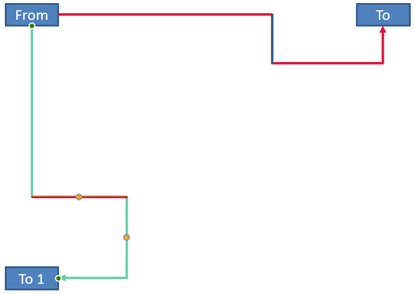

## **Tổng quan**

Một connector (đường kết nối) là một đường thẳng có thể giữ được việc gắn vào hai shape (hình) khi bất kỳ shape nào di chuyển. Các đầu của nó gắn vào connection sites (điểm kết nối), được biểu thị bằng các chấm màu xanh lá trong PowerPoint. Một số connector uốn cong và cong cũng hiển thị các adjustment points (điểm điều chỉnh), được biểu thị bằng các chấm màu cam, kiểm soát vị trí của các đoạn connector riêng lẻ.

Aspose.Slides biểu diễn các connector thông qua giao diện [IConnector](https://reference.aspose.com/slides/vi/cpp/aspose.slides/iconnector/). Bạn có thể tạo chúng, gắn các đầu của chúng vào shape, chọn connection sites, reroute (định tuyến lại) và chỉnh sửa hình học của các connector có adjustment points.

## **Các loại Connector**

Enum [ShapeType](https://reference.aspose.com/slides/vi/cpp/aspose.slides/shapetype/) bao gồm các preset connector thẳng, uốn cong và cong. Bảng sau hiển thị các hình học connector có sẵn và số lượng adjustment points được định nghĩa cho mỗi preset.

| Connector | Image | Number of adjustment points |
|---|---|---|
| `ShapeType::Line` |  | 0 |
| `ShapeType::StraightConnector1` |  | 0 |
| `ShapeType::BentConnector2` |  | 0 |
| `ShapeType::BentConnector3` |  | 1 |
| `ShapeType::BentConnector4` |  | 2 |
| `ShapeType::BentConnector5` |  | 3 |
| `ShapeType::CurvedConnector2` |  | 0 |
| `ShapeType::CurvedConnector3` |  | 1 |
| `ShapeType::CurvedConnector4` |  | 2 |
| `ShapeType::CurvedConnector5` |  | 3 |

Số lượng và ý nghĩa của các adjustment points là một phần của preset connector đã chọn. Đừng cho rằng hai loại connector khác nhau sẽ hiển thị cùng một bố cục collection.

## **Kết nối Hai Shape**

Sử dụng [IShapeCollection::AddConnector](https://reference.aspose.com/slides/vi/cpp/aspose.slides/ishapecollection/addconnector/) để thêm một connector, và gọi [IConnector::set_StartShapeConnectedTo](https://reference.aspose.com/slides/vi/cpp/aspose.slides/iconnector/set_startshapeconnectedto/) và [IConnector::set_EndShapeConnectedTo](https://reference.aspose.com/slides/vi/cpp/aspose.slides/iconnector/set_endshapeconnectedto/) để gắn các đầu của nó. Sau khi cả hai đầu đã được gắn, [IConnector::Reroute](https://reference.aspose.com/slides/vi/cpp/aspose.slides/iconnector/reroute/) sẽ chọn một tuyến ngắn giữa các shape.

Ví dụ sau kết nối một ellipse và một rectangle bằng một bent connector:

```cpp
#include <DOM/IAutoShape.h>
#include <DOM/IConnector.h>
#include <DOM/IShapeCollection.h>
#include <DOM/ISlide.h>
#include <DOM/Presentation.h>
#include <DOM/ShapeType.h>
#include <Export/SaveFormat.h>

using namespace Aspose::Slides;
using namespace Aspose::Slides::Export;

System::SharedPtr<Presentation> presentation = System::MakeObject<Presentation>();
auto slide = presentation->get_Slide(0);
auto shapes = slide->get_Shapes();

auto ellipse = shapes->AddAutoShape(ShapeType::Ellipse, 40, 80, 120, 80);
auto rectangle = shapes->AddAutoShape(ShapeType::Rectangle, 320, 240, 140, 80);
auto connector = shapes->AddConnector(ShapeType::BentConnector2, 0, 0, 10, 10);

connector->set_StartShapeConnectedTo(ellipse);
connector->set_EndShapeConnectedTo(rectangle);
connector->Reroute();

presentation->Save(u"connected-shapes.pptx", SaveFormat::Pptx);
```

{}
Gọi `IConnector::Reroute` có thể thay đổi các giá trị [IConnector::set_StartShapeConnectionSiteIndex](https://reference.aspose.com/slides/vi/cpp/aspose.slides/iconnector/set_startshapeconnectionsiteindex/) và [IConnector::set_EndShapeConnectionSiteIndex](https://reference.aspose.com/slides/vi/cpp/aspose.slides/iconnector/set_endshapeconnectionsiteindex/). Gán các connection site cụ thể sau khi reroute nếu các site đó phải được giữ cố định.
{}

## **Chọn Connection Site**

Mỗi shape có thể kết nối báo cáo số lượng site của nó thông qua [IShape::get_ConnectionSiteCount](https://reference.aspose.com/slides/vi/cpp/aspose.slides/ishape/get_connectionsitecount/). Hãy xác thực một chỉ mục site (zero‑based) mong muốn trước khi gán nó cho đầu của connector; số lượng site thay đổi tùy theo hình học shape.

Ví dụ này gắn connector vào một site cụ thể trên ellipse khi site đó tồn tại:

```cpp
#include <DOM/IAutoShape.h>
#include <DOM/IConnector.h>
#include <DOM/IShapeCollection.h>
#include <DOM/ISlide.h>
#include <DOM/Presentation.h>
#include <DOM/ShapeType.h>
#include <Export/SaveFormat.h>
#include <system/console.h>

using namespace Aspose::Slides;
using namespace Aspose::Slides::Export;
using namespace System;

auto presentation = MakeObject<Presentation>();
auto slide = presentation->get_Slide(0);
auto shapes = slide->get_Shapes();

auto ellipse = shapes->AddAutoShape(ShapeType::Ellipse, 40, 80, 120, 80);
auto rectangle = shapes->AddAutoShape(ShapeType::Rectangle, 320, 240, 140, 80);
auto connector = shapes->AddConnector(ShapeType::BentConnector3, 0, 0, 10, 10);

connector->set_StartShapeConnectedTo(ellipse);
connector->set_EndShapeConnectedTo(rectangle);

int32_t preferredSiteIndex = 2;
if (preferredSiteIndex < ellipse->get_ConnectionSiteCount())
{
    connector->set_StartShapeConnectionSiteIndex(preferredSiteIndex);
}
else
{
    Console::WriteLine(u"The ellipse has only {0} connection sites.", ellipse->get_ConnectionSiteCount());
}

presentation->Save(u"specific-connection-site.pptx", SaveFormat::Pptx);
```

## **Điều chỉnh một Điểm Connector**

Các connector có adjustment points sẽ lộ chúng thông qua [IGeometryShape::get_Adjustments](https://reference.aspose.com/slides/vi/cpp/aspose.slides/igeometryshape/get_adjustments/). Kiểm tra mỗi [IAdjustValue](https://reference.aspose.com/slides/vi/cpp/aspose.slides/iadjustvalue/) và kiểm tra [IAdjustValue::get_Type](https://reference.aspose.com/slides/vi/cpp/aspose.slides/iadjustvalue/get_type/) trước khi thay đổi [IAdjustValue::set_RawValue](https://reference.aspose.com/slides/vi/cpp/aspose.slides/iadjustvalue/set_rawvalue/). Các quy tắc chung để xác định các adjustment của shape preset được mô tả trong [Shape Manipulation](/slides/vi/cpp/shape-manipulations/).

Số lượng, thứ tự, ý nghĩa và phạm vi giá trị hợp lệ của các adjustment connector phụ thuộc vào preset connector. Kiểu trả về bởi `IAdjustValue::get_Type` là read‑only, trong khi giá trị raw adjustment có thể ghi được. Phương thức read‑only [IAdjustValue::get_Name](https://reference.aspose.com/slides/vi/cpp/aspose.slides/iadjustvalue/get_name/) cung cấp thêm thông tin nhận dạng khi một connector chứa nhiều hơn một adjustment có cùng loại ngữ nghĩa.

### **Định Tuyến Xung Quanh Một Chướng Ngại Vật**

Trong bố cục dưới đây, một connector `ShapeType::BentConnector5` giữa hai shape đi qua một shape thứ ba:


Đoạn mã này tạo connector bị cản trở:

```cpp
#include <DOM/FillType.h>
#include <DOM/IAutoShape.h>
#include <DOM/IColorFormat.h>
#include <DOM/IConnector.h>
#include <DOM/ILineFillFormat.h>
#include <DOM/ILineFormat.h>
#include <DOM/IShapeCollection.h>
#include <DOM/ISlide.h>
#include <DOM/LineArrowheadStyle.h>
#include <DOM/Presentation.h>
#include <DOM/ShapeType.h>
#include <Export/SaveFormat.h>
#include <drawing/color.h>

using namespace Aspose::Slides;
using namespace Aspose::Slides::Export;
using namespace System::Drawing;

auto presentation = System::MakeObject<Presentation>();
auto slide = presentation->get_Slide(0);
auto shapes = slide->get_Shapes();

shapes->AddAutoShape(ShapeType::Rectangle, 300, 150, 150, 75);
auto sourceShape = shapes->AddAutoShape(ShapeType::Rectangle, 500, 400, 100, 50);
auto targetShape = shapes->AddAutoShape(ShapeType::Rectangle, 100, 100, 70, 30);
auto connector = shapes->AddConnector(ShapeType::BentConnector5, 20, 20, 400, 300);

auto lineFormat = connector->get_LineFormat();
lineFormat->set_EndArrowheadStyle(LineArrowheadStyle::Triangle);
auto lineFillFormat = lineFormat->get_FillFormat();
lineFillFormat->set_FillType(FillType::Solid);
lineFillFormat->get_SolidFillColor()->set_Color(Color::get_Black());
connector->set_StartShapeConnectedTo(sourceShape);
connector->set_EndShapeConnectedTo(targetShape);
connector->set_StartShapeConnectionSiteIndex(2);

presentation->Save(u"connector-obstruction.pptx", SaveFormat::Pptx);
```

Di chuyển bend dọc thay đổi tuyến sao cho connector bỏ qua chướng ngại vật:


Thay vì giả định rằng chỉ mục collection `1` luôn đại diện cho bend dọc, ví dụ này tìm kiếm `ShapeAdjustmentType::ConnectorBendPositionY` và chỉ thay đổi nó khi loại ngữ nghĩa mong đợi có mặt:

```cpp
#include <DOM/FillType.h>
#include <DOM/IAdjustValue.h>
#include <DOM/IAdjustValueCollection.h>
#include <DOM/IAutoShape.h>
#include <DOM/IColorFormat.h>
#include <DOM/IConnector.h>
#include <DOM/ILineFillFormat.h>
#include <DOM/ILineFormat.h>
#include <DOM/IShapeCollection.h>
#include <DOM/ISlide.h>
#include <DOM/LineArrowheadStyle.h>
#include <DOM/Presentation.h>
#include <DOM/ShapeAdjustmentType.h>
#include <DOM/ShapeType.h>
#include <Export/SaveFormat.h>
#include <drawing/color.h>
#include <system/console.h>

using namespace Aspose::Slides;
using namespace Aspose::Slides::Export;
using namespace System;
using namespace System::Drawing;

auto presentation = MakeObject<Presentation>();
auto slide = presentation->get_Slide(0);
auto shapes = slide->get_Shapes();

shapes->AddAutoShape(ShapeType::Rectangle, 300, 150, 150, 75);
auto sourceShape = shapes->AddAutoShape(ShapeType::Rectangle, 500, 400, 100, 50);
auto targetShape = shapes->AddAutoShape(ShapeType::Rectangle, 100, 100, 70, 30);
auto connector = shapes->AddConnector(ShapeType::BentConnector5, 20, 20, 400, 300);

auto lineFormat = connector->get_LineFormat();
lineFormat->set_EndArrowheadStyle(LineArrowheadStyle::Triangle);
auto lineFillFormat = lineFormat->get_FillFormat();
lineFillFormat->set_FillType(FillType::Solid);
lineFillFormat->get_SolidFillColor()->set_Color(Color::get_Black());
connector->set_StartShapeConnectedTo(sourceShape);
connector->set_EndShapeConnectedTo(targetShape);
connector->set_StartShapeConnectionSiteIndex(2);

SharedPtr<IAdjustValue> verticalBend;
auto adjustments = connector->get_Adjustments();
for (int32_t adjustmentIndex = 0; adjustmentIndex < adjustments->get_Count(); ++adjustmentIndex)
{
    auto adjustment = adjustments->idx_get(adjustmentIndex);
    Console::WriteLine(u"{0}: type = {1}, raw value = {2}", adjustment->get_Name(), static_cast<int32_t>(adjustment->get_Type()), adjustment->get_RawValue());
    if (adjustment->get_Type() == ShapeAdjustmentType::ConnectorBendPositionY)
    {
        verticalBend = adjustment;
        break;
    }
}

if (verticalBend == nullptr)
{
    Console::WriteLine(u"The connector does not expose a vertical bend adjustment.");
}
else
{
    verticalBend->set_RawValue(60000);
    presentation->Save(u"connector-obstruction-fixed.pptx", SaveFormat::Pptx);
}
```

Một `ShapeType::BentConnector5` có hai adjustment `ShapeAdjustmentType::ConnectorBendPositionX` và một adjustment `ShapeAdjustmentType::ConnectorBendPositionY`. Nếu loại bạn cần xuất hiện nhiều hơn một lần, hãy kiểm tra `IAdjustValue::get_Name` và hình học đã biết của preset trước khi chọn. Nếu một adjustment báo cáo `ShapeAdjustmentType::Custom`, hãy coi ý nghĩa và phạm vi của nó là đặc thù cho preset và không thay đổi cho đến khi hợp đồng này được xác định.

## **Liên Kết Giá Trị Adjustment Với Hình Học Connector**

Đối với các bent connector, giá trị adjustment có thể được dùng để ước tính vị trí của các đoạn riêng lẻ. Các phép tính này cụ thể cho preset connector:

- `ShapeType::BentConnector4` thường hiển thị một adjustment `ShapeAdjustmentType::ConnectorBendPositionX` và một `ShapeAdjustmentType::ConnectorBendPositionY`.
- Đối với các vị trí bend này, `RawValue / 100000.0f` tạo ra phần của chiều rộng hoặc chiều cao khung connector được sử dụng trong các ví dụ dưới đây.
- Khung connector có thể được xoay hoặc lật, vì vậy tọa độ khung phải được chuyển đổi trước khi so sánh với tọa độ slide.

Các ví dụ sau sử dụng `IAdjustValue::get_Type` để xác định các adjustment trước. Chúng không coi chỉ mục collection là định danh di động.

### **Connector Không Xoay**

Bố cục ban đầu có hai shape văn bản được kết nối bằng một `ShapeType::BentConnector4`:


Ví dụ này kiểm tra connector và lấy các adjustment bend theo chiều ngang và chiều dọc:

```cpp
#include <DOM/FillType.h>
#include <DOM/IAdjustValue.h>
#include <DOM/IAdjustValueCollection.h>
#include <DOM/IAutoShape.h>
#include <DOM/IColorFormat.h>
#include <DOM/IConnector.h>
#include <DOM/ILineFillFormat.h>
#include <DOM/ILineFormat.h>
#include <DOM/IShapeCollection.h>
#include <DOM/ISlide.h>
#include <DOM/ITextFrame.h>
#include <DOM/LineArrowheadStyle.h>
#include <DOM/Presentation.h>
#include <DOM/ShapeAdjustmentType.h>
#include <DOM/ShapeType.h>
#include <drawing/color.h>
#include <system/console.h>

using namespace Aspose::Slides;
using namespace System;
using namespace System::Drawing;

auto presentation = MakeObject<Presentation>();
auto slide = presentation->get_Slide(0);
auto shapes = slide->get_Shapes();

auto sourceShape = shapes->AddAutoShape(ShapeType::Rectangle, 100, 100, 60, 25);
sourceShape->get_TextFrame()->set_Text(u"From");
auto targetShape = shapes->AddAutoShape(ShapeType::Rectangle, 500, 100, 60, 25);
targetShape->get_TextFrame()->set_Text(u"To");
auto connector = shapes->AddConnector(ShapeType::BentConnector4, 20, 20, 400, 300);

auto lineFormat = connector->get_LineFormat();
lineFormat->set_EndArrowheadStyle(LineArrowheadStyle::Triangle);
auto lineFillFormat = lineFormat->get_FillFormat();
lineFillFormat->set_FillType(FillType::Solid);
lineFillFormat->get_SolidFillColor()->set_Color(Color::get_Crimson());
lineFormat->set_Width(3);
connector->set_StartShapeConnectedTo(sourceShape);
connector->set_StartShapeConnectionSiteIndex(3);
connector->set_EndShapeConnectedTo(targetShape);
connector->set_EndShapeConnectionSiteIndex(2);

auto adjustments = connector->get_Adjustments();
for (int32_t adjustmentIndex = 0; adjustmentIndex < adjustments->get_Count(); ++adjustmentIndex)
{
    auto adjustment = adjustments->idx_get(adjustmentIndex);
    Console::WriteLine(u"{0}: type = {1}, raw value = {2}", adjustment->get_Name(), static_cast<int32_t>(adjustment->get_Type()), adjustment->get_RawValue());
}
```

Để thay đổi cả hai bend, hãy định vị mỗi kiểu mong đợi và chỉ sửa giá trị sau khi cả hai đã được tìm thấy:

```cpp
#include <DOM/IAdjustValue.h>
#include <DOM/IAdjustValueCollection.h>
#include <DOM/IAutoShape.h>
#include <DOM/IConnector.h>
#include <DOM/IShapeCollection.h>
#include <DOM/ISlide.h>
#include <DOM/Presentation.h>
#include <DOM/ShapeAdjustmentType.h>
#include <DOM/ShapeType.h>
#include <Export/SaveFormat.h>
#include <system/console.h>

using namespace Aspose::Slides;
using namespace Aspose::Slides::Export;
using namespace System;

auto presentation = MakeObject<Presentation>();
auto slide = presentation->get_Slide(0);
auto shapes = slide->get_Shapes();

auto sourceShape = shapes->AddAutoShape(ShapeType::Rectangle, 100, 100, 60, 25);
auto targetShape = shapes->AddAutoShape(ShapeType::Rectangle, 500, 100, 60, 25);
auto connector = shapes->AddConnector(ShapeType::BentConnector4, 20, 20, 400, 300);
connector->set_StartShapeConnectedTo(sourceShape);
connector->set_StartShapeConnectionSiteIndex(3);
connector->set_EndShapeConnectedTo(targetShape);
connector->set_EndShapeConnectionSiteIndex(2);

SharedPtr<IAdjustValue> horizontalBend;
SharedPtr<IAdjustValue> verticalBend;
auto adjustments = connector->get_Adjustments();
for (int32_t adjustmentIndex = 0; adjustmentIndex < adjustments->get_Count(); ++adjustmentIndex)
{
    auto adjustment = adjustments->idx_get(adjustmentIndex);
    if (adjustment->get_Type() == ShapeAdjustmentType::ConnectorBendPositionX)
    {
        horizontalBend = adjustment;
    }
    else if (adjustment->get_Type() == ShapeAdjustmentType::ConnectorBendPositionY)
    {
        verticalBend = adjustment;
    }
}

if (horizontalBend == nullptr || verticalBend == nullptr)
{
    Console::WriteLine(u"The connector does not expose the expected bend adjustments.");
}
else
{
    horizontalBend->set_RawValue(horizontalBend->get_RawValue() + 20000);
    verticalBend->set_RawValue(verticalBend->get_RawValue() + 200000);
    presentation->Save(u"connector-adjusted.pptx", SaveFormat::Pptx);
}
```

Kết quả là một connector mà các đoạn ngang và dọc đã di chuyển:


Khi đã biết các kiểu ngữ nghĩa, giá trị của chúng có thể được chuyển đổi thành tọa độ khung connector. Ví dụ này vẽ một hình chữ nhật mỏng lên đoạn dọc được điều khiển bởi hai bend adjustment:

```cpp
#include <DOM/IAdjustValue.h>
#include <DOM/IAdjustValueCollection.h>
#include <DOM/IAutoShape.h>
#include <DOM/IConnector.h>
#include <DOM/IShapeCollection.h>
#include <DOM/ISlide.h>
#include <DOM/Presentation.h>
#include <DOM/ShapeAdjustmentType.h>
#include <DOM/ShapeType.h>
#include <Export/SaveFormat.h>
#include <system/console.h>

using namespace Aspose::Slides;
using namespace Aspose::Slides::Export;
using namespace System;

auto presentation = MakeObject<Presentation>();
auto slide = presentation->get_Slide(0);
auto shapes = slide->get_Shapes();

auto sourceShape = shapes->AddAutoShape(ShapeType::Rectangle, 100, 100, 60, 25);
auto targetShape = shapes->AddAutoShape(ShapeType::Rectangle, 500, 100, 60, 25);
auto connector = shapes->AddConnector(ShapeType::BentConnector4, 20, 20, 400, 300);
connector->set_StartShapeConnectedTo(sourceShape);
connector->set_StartShapeConnectionSiteIndex(3);
connector->set_EndShapeConnectedTo(targetShape);
connector->set_EndShapeConnectionSiteIndex(2);

SharedPtr<IAdjustValue> horizontalBend;
SharedPtr<IAdjustValue> verticalBend;
auto adjustments = connector->get_Adjustments();
for (int32_t adjustmentIndex = 0; adjustmentIndex < adjustments->get_Count(); ++adjustmentIndex)
{
    auto adjustment = adjustments->idx_get(adjustmentIndex);
    if (adjustment->get_Type() == ShapeAdjustmentType::ConnectorBendPositionX)
    {
        horizontalBend = adjustment;
    }
    else if (adjustment->get_Type() == ShapeAdjustmentType::ConnectorBendPositionY)
    {
        verticalBend = adjustment;
    }
}

if (horizontalBend == nullptr || verticalBend == nullptr)
{
    Console::WriteLine(u"The connector does not expose the expected bend adjustments.");
}
else
{
    float x = connector->get_X() + connector->get_Width() * horizontalBend->get_RawValue() / 100000.0f;
    float y = connector->get_Y();
    float height = connector->get_Height() * verticalBend->get_RawValue() / 100000.0f;
    shapes->AddAutoShape(ShapeType::Rectangle, x, y, 1, height);
    presentation->Save(u"connector-segment-guide.pptx", SaveFormat::Pptx);
}
```

Hình guide đánh dấu đoạn đã tính toán:


### **Connector Được Xoay Hoặc Lật**

Khi cùng một hình học connector được định hướng dọc, các giá trị [IShape::get_Frame](https://reference.aspose.com/slides/vi/cpp/aspose.slides/ishape/get_frame/), [IShapeFrame::get_FlipH](https://reference.aspose.com/slides/vi/cpp/aspose.slides/ishapeframe/get_fliph/), và [IShapeFrame::get_FlipV](https://reference.aspose.com/slides/vi/cpp/aspose.slides/ishapeframe/get_flipv/) ảnh hưởng đến việc chuyển đổi từ tọa độ khung connector sang tọa độ slide.

Ví dụ này tạo và điều chỉnh connector được định hướng dọc:

```cpp
#include <DOM/FillType.h>
#include <DOM/IAdjustValue.h>
#include <DOM/IAdjustValueCollection.h>
#include <DOM/IAutoShape.h>
#include <DOM/IColorFormat.h>
#include <DOM/IConnector.h>
#include <DOM/ILineFillFormat.h>
#include <DOM/ILineFormat.h>
#include <DOM/IShapeCollection.h>
#include <DOM/ISlide.h>
#include <DOM/ITextFrame.h>
#include <DOM/LineArrowheadStyle.h>
#include <DOM/Presentation.h>
#include <DOM/ShapeAdjustmentType.h>
#include <DOM/ShapeType.h>
#include <Export/SaveFormat.h>
#include <drawing/color.h>

using namespace Aspose::Slides;
using namespace Aspose::Slides::Export;
using namespace System::Drawing;

auto presentation = System::MakeObject<Presentation>();
auto slide = presentation->get_Slide(0);
auto shapes = slide->get_Shapes();

auto sourceShape = shapes->AddAutoShape(ShapeType::Rectangle, 100, 100, 60, 25);
sourceShape->get_TextFrame()->set_Text(u"From");
auto targetShape = shapes->AddAutoShape(ShapeType::Rectangle, 100, 400, 60, 25);
targetShape->get_TextFrame()->set_Text(u"To 1");
auto connector = shapes->AddConnector(ShapeType::BentConnector4, 20, 20, 400, 300);

auto lineFormat = connector->get_LineFormat();
lineFormat->set_EndArrowheadStyle(LineArrowheadStyle::Triangle);
auto lineFillFormat = lineFormat->get_FillFormat();
lineFillFormat->set_FillType(FillType::Solid);
lineFillFormat->get_SolidFillColor()->set_Color(Color::get_MediumAquamarine());
lineFormat->set_Width(3);
connector->set_StartShapeConnectedTo(sourceShape);
connector->set_StartShapeConnectionSiteIndex(2);
connector->set_EndShapeConnectedTo(targetShape);
connector->set_EndShapeConnectionSiteIndex(3);

auto adjustments = connector->get_Adjustments();
for (int32_t adjustmentIndex = 0; adjustmentIndex < adjustments->get_Count(); ++adjustmentIndex)
{
    auto adjustment = adjustments->idx_get(adjustmentIndex);
    if (adjustment->get_Type() == ShapeAdjustmentType::ConnectorBendPositionX)
    {
        adjustment->set_RawValue(adjustment->get_RawValue() + 20000);
    }
    else if (adjustment->get_Type() == ShapeAdjustmentType::ConnectorBendPositionY)
    {
        adjustment->set_RawValue(adjustment->get_RawValue() + 200000);
    }
}

presentation->Save(u"vertical-connector-adjusted.pptx", SaveFormat::Pptx);
```

Connector đã điều chỉnh xuất hiện dọc giữa các shape:


Đối với một góc quay tùy ý `alpha`, quay một điểm khung connector `(x, y)` quanh trung tâm khung `(x0, y0)`:

`X = (x - x0) * cos(alpha) - (y - y0) * sin(alpha) + x0`

`Y = (x - x0) * sin(alpha) + (y - y0) * cos(alpha) + y0`

Đoạn mã sau xử lý hướng 90 độ được dùng trong ví dụ này và vẽ một guide màu đỏ lên đoạn connector tương ứng:

```cpp
#include <DOM/FillType.h>
#include <DOM/IAdjustValue.h>
#include <DOM/IAdjustValueCollection.h>
#include <DOM/IAutoShape.h>
#include <DOM/IColorFormat.h>
#include <DOM/IConnector.h>
#include <DOM/ILineFillFormat.h>
#include <DOM/ILineFormat.h>
#include <DOM/IShapeCollection.h>
#include <DOM/IShapeFrame.h>
#include <DOM/ISlide.h>
#include <DOM/NullableBool.h>
#include <DOM/Presentation.h>
#include <DOM/ShapeAdjustmentType.h>
#include <DOM/ShapeType.h>
#include <Export/SaveFormat.h>
#include <drawing/color.h>
#include <system/console.h>

using namespace Aspose::Slides;
using namespace Aspose::Slides::Export;
using namespace System;
using namespace System::Drawing;

auto presentation = MakeObject<Presentation>();
auto slide = presentation->get_Slide(0);
auto shapes = slide->get_Shapes();

auto sourceShape = shapes->AddAutoShape(ShapeType::Rectangle, 100, 100, 60, 25);
auto targetShape = shapes->AddAutoShape(ShapeType::Rectangle, 100, 400, 60, 25);
auto connector = shapes->AddConnector(ShapeType::BentConnector4, 20, 20, 400, 300);
connector->set_StartShapeConnectedTo(sourceShape);
connector->set_StartShapeConnectionSiteIndex(2);
connector->set_EndShapeConnectedTo(targetShape);
connector->set_EndShapeConnectionSiteIndex(3);

SharedPtr<IAdjustValue> horizontalBend;
SharedPtr<IAdjustValue> verticalBend;
auto adjustments = connector->get_Adjustments();
for (int32_t adjustmentIndex = 0; adjustmentIndex < adjustments->get_Count(); ++adjustmentIndex)
{
    auto adjustment = adjustments->idx_get(adjustmentIndex);
    if (adjustment->get_Type() == ShapeAdjustmentType::ConnectorBendPositionX)
    {
        horizontalBend = adjustment;
    }
    else if (adjustment->get_Type() == ShapeAdjustmentType::ConnectorBendPositionY)
    {
        verticalBend = adjustment;
    }
}

if (horizontalBend == nullptr || verticalBend == nullptr)
{
    Console::WriteLine(u"The connector does not expose the expected bend adjustments.");
}
else
{
    horizontalBend->set_RawValue(horizontalBend->get_RawValue() + 20000);
    verticalBend->set_RawValue(verticalBend->get_RawValue() + 200000);

    float x = connector->get_X();
    float y = connector->get_Y();
    auto frame = connector->get_Frame();
    if (frame->get_FlipH() == NullableBool::True)
    {
        x += connector->get_Width();
    }
    if (frame->get_FlipV() == NullableBool::True)
    {
        y += connector->get_Height();
    }

    x += connector->get_Width() * horizontalBend->get_RawValue() / 100000.0f;
    float rotatedX = frame->get_CenterX() - y + frame->get_CenterY();
    float rotatedY = x - frame->get_CenterX() + frame->get_CenterY();
    float segmentWidth = connector->get_Height() * verticalBend->get_RawValue() / 100000.0f;
    auto guide = shapes->AddAutoShape(ShapeType::Rectangle, rotatedX, rotatedY, segmentWidth, 1);
    auto guideLineFillFormat = guide->get_LineFormat()->get_FillFormat();
    guideLineFillFormat->set_FillType(FillType::Solid);
    guideLineFillFormat->get_SolidFillColor()->set_Color(Color::get_Red());

    presentation->Save(u"rotated-connector-segment-guide.pptx", SaveFormat::Pptx);
}
```

Guide màu đỏ đánh dấu đoạn đã tính toán sau khi chuyển đổi tọa độ:



Các công thức này mô tả các preset được dùng trong các ví dụ, không phải mô hình connector chung. Hãy xác thực các kiểu adjustment, hướng khung và phạm vi giá trị trước khi áp dụng cùng phép tính cho một preset khác.

## **Tìm Góc Hướng của Connector**

Hướng của một straight connector có thể được tính từ chiều rộng và chiều cao của nó, kèm theo các phép lật ngang và dọc. Ví dụ sau báo cáo góc theo chiều kim đồng hồ tính từ trục ngang dương trong tọa độ slide:

```cpp
#include <DOM/IConnector.h>
#include <DOM/IShapeCollection.h>
#include <DOM/IShapeFrame.h>
#include <DOM/ISlide.h>
#include <DOM/NullableBool.h>
#include <DOM/Presentation.h>
#include <DOM/ShapeType.h>
#include <system/console.h>
#include <system/math.h>

using namespace Aspose::Slides;
using namespace System;

auto presentation = MakeObject<Presentation>();
auto slide = presentation->get_Slide(0);
auto connector = slide->get_Shapes()->AddConnector(ShapeType::StraightConnector1, 100, 100, 200, 100);
auto frame = connector->get_Frame();

bool flipH = frame->get_FlipH() == NullableBool::True;
bool flipV = frame->get_FlipV() == NullableBool::True;
float deltaX = connector->get_Width() * (flipH ? -1 : 1);
float deltaY = connector->get_Height() * (flipV ? -1 : 1);
double angle = Math::Atan2(deltaY, deltaX) * 180.0 / Math::PI;

if (angle < 0)
{
    angle += 360;
}

Console::WriteLine(u"Connector direction: {0:F2} degrees", angle);
```

## **Câu hỏi Thường gặp**

**Làm sao tôi biết một connector có thể gắn vào một shape hay không?**

Kiểm tra giá trị `IShape::get_ConnectionSiteCount` của shape. Giá trị dương nghĩa là shape cung cấp các connection site. Xác thực chỉ mục site đã chọn trước khi gán nó cho bất kỳ đầu nào của connector.

**Tôi có thể xác định một adjustment connector bằng chỉ mục collection của nó không?**

Một chỉ mục chỉ có ý nghĩa đối với một preset connector đã biết và bố cục collection. Kiểm tra `IAdjustValue::get_Type` trước khi sửa đổi giá trị, và dùng `IAdjustValue::get_Name` như thông tin bổ sung khi cùng một kiểu ngữ nghĩa xuất hiện hơn một lần.

**Điều gì xảy ra khi một shape đã được kết nối bị xóa?**

Đầu connector tương ứng sẽ bị tách rời. Connector vẫn còn trên slide và có thể bị xóa, đặt làm một đường tự do, hoặc gắn lại vào một shape khác.

**Các ràng buộc connector có được giữ lại khi sao chép slide không?**

Các ràng buộc thường được giữ khi các shape đã kết nối được sao chép cùng slide. Nếu một connector được sao chép mà không có một trong các shape mục tiêu, đầu bị ảnh hưởng phải được gắn lại.