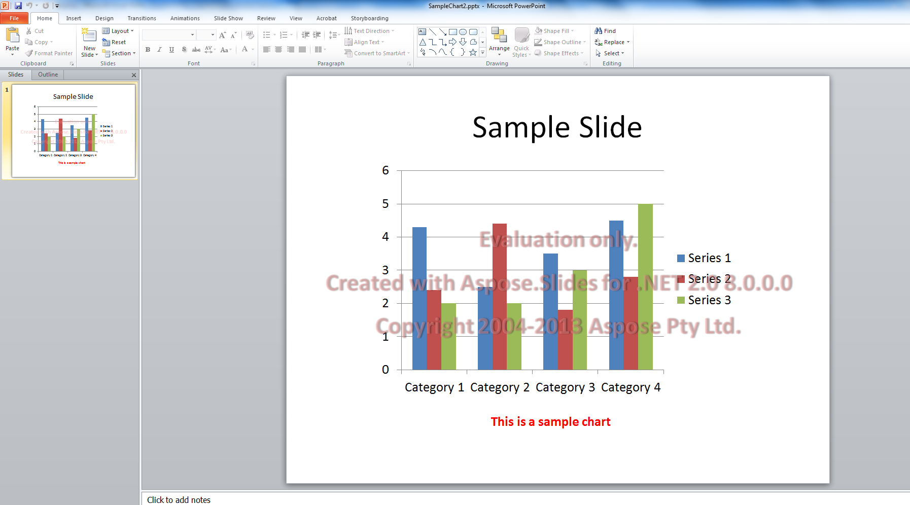

## **Đánh giá Aspose.Slides**

Bạn có thể dễ dàng tải xuống Aspose.Slides để đánh giá. Bản tải xuống để đánh giá giống hệt bản đã mua. Phiên bản đánh giá sẽ trở thành có giấy phép khi bạn thêm một vài dòng mã để áp dụng giấy phép.

Phiên bản đánh giá của Aspose.Slides (không chỉ định giấy phép) cung cấp đầy đủ chức năng của sản phẩm, nhưng nó chèn một dấu nước đánh giá ở đầu tài liệu khi mở và lưu, và giới hạn chỉ một slide khi trích xuất văn bản từ các slide trình chiếu.

{}
Nếu bạn muốn thử Aspose.Slides mà không bị giới hạn của phiên bản đánh giá, bạn cũng có thể yêu cầu Giấy phép Tạm thời 30 ngày. Vui lòng tham khảo [Cách nhận Giấy phép Tạm thời?](https://purchase.aspose.com/temporary-license)
{}

## **Câu hỏi thường gặp**

### Tôi có thể kiểm tra nhiều bản trình chiếu đồng thời trên các luồng khác nhau trong chế độ đánh giá không?
Có. Bạn có thể xử lý các tài liệu khác nhau đồng thời; bạn không nên chia sẻ cùng một đối tượng bản trình chiếu [trên các luồng](/slides/vi/cpp/multithreading/). Chế độ đánh giá không ảnh hưởng tới điều này.

### Tôi có cần cài đặt Microsoft PowerPoint để đánh giá thư viện trên máy chủ hoặc trong CI không?
Không. Aspose.Slides là một engine độc lập và không yêu cầu PowerPoint được cài đặt cho cả chế độ đánh giá lẫn sản xuất.

### Tôi có thể kiểm tra đầy đủ việc chuyển đổi PPT/PPTX sang PDF và ảnh trong chế độ đánh giá không?
Có. Các [bộ chuyển đổi](/slides/vi/cpp/convert-presentation/) hoạt động; kết quả sẽ bao gồm một dấu nước.

### Tôi có thể sử dụng giấy phép tạm thời để thử tải mà không có dấu nước không?
Có. Giấy phép tạm thời 30 ngày loại bỏ các giới hạn của chế độ đánh giá và cho phép kiểm tra mà không có dấu nước.