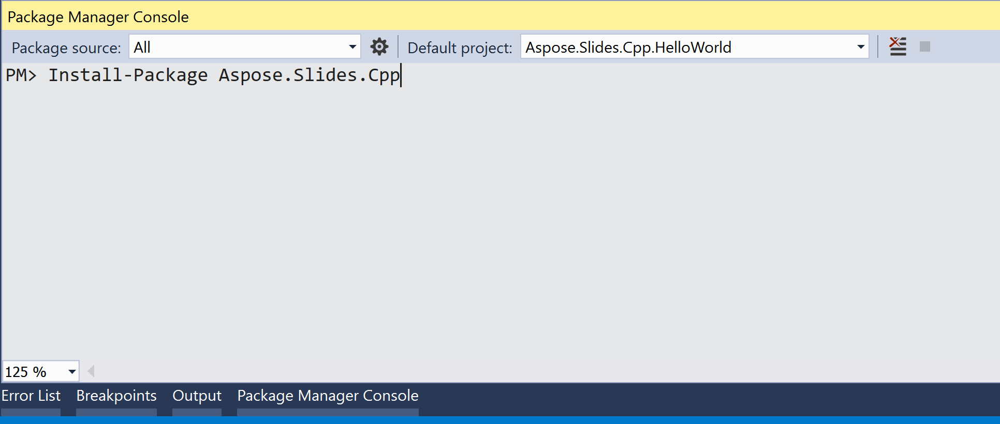

## **Tổng quan**

Bài viết này giải thích cách cài đặt Aspose.Slides trên Windows. Nó tập trung vào việc cài đặt dựa trên NuGet và cho thấy cách thêm thư viện vào dự án Visual Studio thông qua NuGet Package Manager hoặc Package Manager Console trên Windows. Ngoài ra, nó mô tả cách cập nhật gói và cài đặt các bản dựng trước khi phát hành khi cần.

## **Windows**
NuGet cung cấp con đường dễ nhất để tải xuống và cài đặt các API Aspose cho C++ trên máy tính để bàn. 

### **Tùy chọn 1: Cài đặt hoặc Cập nhật Aspose.Slides cho C++ từ NuGet Package Manager**

1. Mở Microsoft Visual Studio. 
2. Tạo một ứng dụng console đơn giản. Hoặc bạn có thể mở dự án ưa thích của mình. 
3. Đi qua **Tools** > **NuGet package manager**.
4. Trong **Browse**, nhập *Aspose.Slides.Cpp* vào trường văn bản. 

3. Nhấp vào phiên bản bạn cần **Aspose.Slides.Cpp** rồi nhấp **Install**. 
   * Nếu bạn muốn cập nhật Aspose.Slides — nghĩa là bạn đã cài đặt nó — hãy nhấp **Update** thay thế. 

API đã chọn sẽ được tải xuống và tham chiếu trong dự án của bạn.

### **Tùy chọn 2: Cài đặt hoặc Cập nhật Aspose.Slides thông qua Package Manager Console**

Để tham chiếu [Aspose.Slides API](https://www.nuget.org/packages/Aspose.Slides.Cpp/) bằng console quản lý gói, thực hiện các bước sau:

1. Mở solution/dự án của bạn trong Visual Studio.

1. Đi qua **Tools** > **NuGet Package Manager** > **Package Manager Console**. 

Package Manager Console sẽ mở. 

4. Gõ lệnh sau: `Install-Package Aspose.Slides.Cpp` 
> Nếu bạn muốn cài đặt phiên bản x86, sử dụng gói Aspose.Slides.Cpp.x86: `Install-Package Aspose.Slides.Cpp.x86`

5. Nhấn phím Enter.

Bản phát hành đầy đủ mới nhất sẽ được cài đặt vào ứng dụng của bạn. 

* Ngoài ra, bạn có thể thêm hậu tố `-prerelease` vào lệnh để chỉ định rằng bản phát hành mới nhất (bao gồm các bản hotfix) cũng phải được cài đặt.

Khi quá trình tải xuống hoàn tất, bạn sẽ thấy một số thông báo xác nhận.  

Nếu bạn không quen thuộc với [Aspose EULA](https://about.aspose.com/legal/eula), bạn có thể muốn đọc giấy phép được tham chiếu trong URL. 

Trong Package Manager Console, bạn có thể chạy lệnh `Update-Package Aspose.Slides.Cpp` để kiểm tra các bản cập nhật cho gói Aspose.Slides. Các bản cập nhật (nếu có) sẽ được cài đặt tự động. Bạn cũng có thể sử dụng hậu tố `-prerelease` để cập nhật bản phát hành mới nhất.

### **Sử dụng thư mục Include và lib**
1. [Tải xuống](https://downloads.aspose.com/slides/vi/cpp) phiên bản Aspose.Slides cho C++ mới nhất.
1. Giải nén thư mục vào môi trường sản xuất.
1. Để sử dụng Aspose.Slides cho C++, tham chiếu các thư mục Include và lib trong dự án của bạn

## **Câu hỏi thường gặp**

**Có phiên bản miễn phí hoặc hạn chế thử nghiệm không?**

Có, theo mặc định, Aspose.Slides chạy ở chế độ đánh giá, hiển thị watermark và có thể có các hạn chế khác. Để bỏ các giới hạn, bạn cần áp dụng một [giấy phép](/slides/vi/cpp/licensing/) hợp lệ.