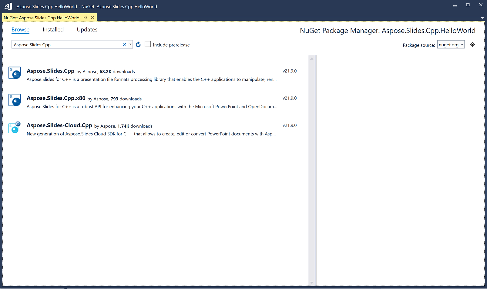

## **Tổng quan**

Aspose.Slides cho C++ được phân phối dưới hai hình thức:

| Hình thức | Sử dụng cho | Nơi tải |
|---|---|---|
| Gói NuGet: [Aspose.Slides.Cpp](https://www.nuget.org/packages/Aspose.Slides.Cpp/) (64-bit) và [Aspose.Slides.Cpp.x86](https://www.nuget.org/packages/Aspose.Slides.Cpp.x86/) (32-bit) | Dự án Visual Studio C++ trên Windows | NuGet |
| Gói ZIP cho Windows, Linux và macOS | Các bản dựng không dùng NuGet, như dự án CMake | Trang [trang tải xuống](https://releases.aspose.com/slides/cpp/) |

Bài viết này hướng dẫn cách cài đặt gói NuGet trong Visual Studio trên Windows và cách sử dụng gói ZIP với CMake trên Linux. Cả hai cách đều kết thúc bằng cùng một bước kiểm tra: biên dịch và chạy ví dụ đầu tiên trong [Tạo Bài Trình Chiếu](/slides/vi/cpp/create-presentation/).

## **Windows**

Trên Windows, thêm gói NuGet vào một dự án Visual Studio C++. Gói này cũng sẽ cài đặt phụ thuộc của nó, CodePorting.Translator.Cs2Cpp.Framework, và sao chép các DLL mà chương trình của bạn cần vào thư mục đầu ra của quá trình biên dịch.

Chọn gói dựa trên nền tảng bạn biên dịch: **Aspose.Slides.Cpp** cho x64, và **Aspose.Slides.Cpp.x86** cho Win32 (x86). Gói Aspose.Slides.Cpp không được áp dụng cho bản dựng Win32, vì vậy trình biên dịch không thể tìm thấy các tiêu đề của nó ở đó.

Một gói ZIP cho Windows cũng có sẵn tại [trang tải xuống](https://releases.aspose.com/slides/cpp/).

### **Phương pháp 1: Cài đặt hoặc Cập nhật Aspose.Slides từ Trình quản lý Gói NuGet**

1. Mở Microsoft Visual Studio.
2. Tạo một dự án **Console App** C++, hoặc mở một dự án hiện có.
3. Trong **Solution Explorer**, nhấp chuột phải vào dự án và chọn **Manage NuGet Packages** (hoặc vào **Project** > **Manage NuGet Packages**).
4. Dưới **Browse**, tìm kiếm *Aspose.Slides.Cpp*.

5. Nhấp vào **Aspose.Slides.Cpp** (hoặc **Aspose.Slides.Cpp.x86** cho bản dựng 32-bit) và sau đó nhấp vào **Install**.
   * Nếu bạn đã cài đặt Aspose.Slides và muốn cập nhật, nhấp **Update** thay thế.

Gói được tải xuống và tham chiếu trong dự án của bạn.

### **Phương pháp 2: Cài đặt hoặc Cập nhật Aspose.Slides qua Console Trình quản lý Gói**

1. Mở Microsoft Visual Studio.
2. Tạo một dự án **Console App** C++, hoặc mở một dự án hiện có.
3. Vào **Tools** > **NuGet Package Manager** > **Package Manager Console**.

4. Chạy lệnh sau:

   ```powershell
   Install-Package Aspose.Slides.Cpp
   ```

   Đối với bản dựng 32-bit (Win32), cài đặt gói x86 thay thế:

   ```powershell
   Install-Package Aspose.Slides.Cpp.x86
   ```


Khi quá trình cài đặt hoàn tất, các tin nhắn xác nhận sẽ hiển thị. Gói này được phân phối theo [Aspose EULA](https://about.aspose.com/legal/eula).


Để cập nhật gói, chạy `Update-Package Aspose.Slides.Cpp` (hoặc `Update-Package Aspose.Slides.Cpp.x86`) trong Console Trình quản lý Gói.

### **Kiểm tra Cài đặt**

1. Thay thế nội dung của tệp *.cpp* chính của dự án (tệp chứa `main`) bằng ví dụ đầu tiên trong [Tạo Bài Trình Chiếu](/slides/vi/cpp/create-presentation/).
2. Trong thanh công cụ, chọn nền tảng **x64**, hoặc **x86** nếu bạn đã cài đặt Aspose.Slides.Cpp.x86.
3. Nhấn **Ctrl+F5** để biên dịch và chạy chương trình.

Chương trình sẽ lưu *hello.pptx* vào thư mục dự án, đây là thư mục làm việc mặc định khi Visual Studio chạy chương trình.

## **Linux**

Trên Linux, sử dụng gói ZIP Linux cùng với CMake. Gói này chứa thư viện Aspose.Slides, phụ thuộc của nó là CodePorting.Translator.Cs2Cpp.Framework, và một tệp cấu hình CMake cho mỗi thành phần. Các thư viện được biên dịch cho Linux x86_64 với glibc 2.23 trở lên.

1. Cài đặt trình biên dịch C++, make, CMake, unzip, và thư viện fontconfig, mà các thư viện Aspose.Slides phụ thuộc vào. Trên Debian và Ubuntu:
   ```bash
   sudo apt-get update && sudo apt-get install -y g++ make cmake unzip libfontconfig1
   ```
2. Tạo một thư mục dự án và chuyển vào đó:
   ```bash
   mkdir hello-slides
   cd hello-slides
   ```
3. Tải xuống gói ZIP Linux (**Aspose.Slides for C++ Linux**) từ [trang tải xuống](https://releases.aspose.com/slides/cpp/) vào thư mục dự án, và giải nén vào thư mục con *aspose-slides-cpp*:
   ```bash
   unzip aspose-slides-cpp-linux-*.zip -d aspose-slides-cpp
   ```
4. Tạo một tệp tên *CMakeLists.txt* trong thư mục dự án với nội dung sau:
   ```cmake
   cmake_minimum_required(VERSION 3.13)
   project(HelloSlides CXX)

   set(CMAKE_CXX_STANDARD 14)
   set(CMAKE_CXX_STANDARD_REQUIRED ON)

   set(ASPOSE_SLIDES_DIR "${CMAKE_CURRENT_SOURCE_DIR}/aspose-slides-cpp")
   find_package(CodePorting.Translator.Cs2Cpp.Framework REQUIRED CONFIG PATHS "${ASPOSE_SLIDES_DIR}" NO_DEFAULT_PATH)
   find_package(Aspose.Slides.Cpp REQUIRED CONFIG PATHS "${ASPOSE_SLIDES_DIR}" NO_DEFAULT_PATH)

   add_executable(hello main.cpp)
   target_link_libraries(hello PRIVATE Aspose.Slides.Cpp)
   ```

   Hai lời gọi `find_package` tải các tệp cấu hình CMake từ gói đã giải nén. Framework được tìm thấy trước vì Aspose.Slides phụ thuộc vào nó. Liên kết mục tiêu `Aspose.Slides.Cpp` sẽ thêm các thư mục include và cả hai thư viện vào quá trình biên dịch.
5. Lưu ví dụ đầu tiên trong [Tạo Bài Trình Chiếu](/slides/vi/cpp/create-presentation/) dưới tên *main.cpp* trong thư mục dự án.
6. Biên dịch và chạy chương trình:
   ```bash
   cmake -S . -B build -DCMAKE_BUILD_TYPE=Release
   cmake --build build
   ./build/hello
   ```

Chương trình sẽ lưu *hello.pptx* trong thư mục hiện tại. CMake ghi lại vị trí của các thư viện trong chương trình, vì vậy bạn không cần đặt `LD_LIBRARY_PATH` miễn là thư mục *aspose-slides-cpp* vẫn ở vị trí.

Các phông chữ được sử dụng trong bài trình chiếu của bạn, hoặc các phông thay thế phù hợp, phải được cài đặt trên hệ thống để văn bản được hiển thị đúng khi bạn chuyển đổi slide sang PDF hoặc hình ảnh.

## **Câu hỏi thường gặp**

**Có phiên bản miễn phí hoặc giới hạn dùng thử không?**

Có. Khi không có giấy phép, Aspose.Slides chạy ở chế độ đánh giá: nó sẽ thêm một watermark đánh giá vào mỗi slide khi lưu và cắt ngắn văn bản đọc từ các bài trình chiếu. Để loại bỏ những hạn chế này, áp dụng một [giấy phép](/slides/vi/cpp/licensing/) hợp lệ.

**Tại sao trình biên dịch báo không thể mở *DOM/Presentation.h*?**

Gói đã cài không khớp với nền tảng bạn đang biên dịch. Aspose.Slides.Cpp chỉ áp dụng cho bản dựng x64, và Aspose.Slides.Cpp.x86 chỉ cho bản dựng Win32. Hãy chọn nền tảng phù hợp trong Visual Studio, hoặc cài đặt gói còn lại.