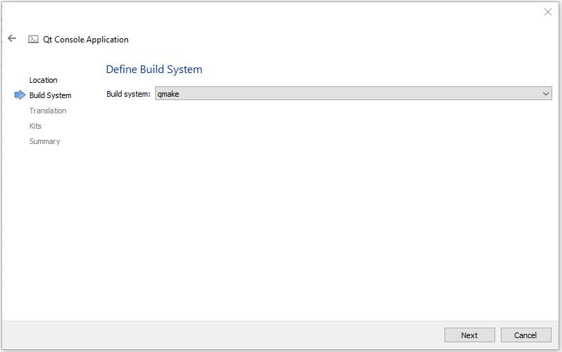
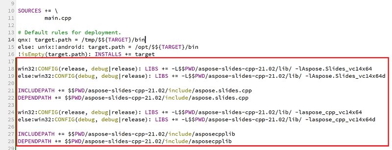

## **Giới thiệu**

Qt là một khung phát triển ứng dụng đa nền tảng dựa trên C++ được sử dụng rộng rãi để tạo ra nhiều loại ứng dụng trên máy tính để bàn, thiết bị di động và hệ thống nhúng. Aspose.Slides for C++ có thể được tích hợp vào Qt để tạo và thao tác các tài liệu PowerPoint trong các ứng dụng Qt của bạn.

## **Sử dụng Aspose.Slides for C++ trong Qt Creator**

Để sử dụng Aspose.Slides for C++ trong ứng dụng Qt của bạn, tải phiên bản mới nhất của API từ phần [tải xuống](https://downloads.aspose.com/slides/vi/cpp). Khi API đã được tải, bạn có thể tích hợp thư viện C++ vào Qt Creator hoặc Visual Studio.

Để tích hợp và sử dụng thư viện Aspose.Slides for C++ trong một ứng dụng Qt Console được phát triển bằng Qt Creator, vui lòng thực hiện các bước dưới đây:

- Mở Qt Creator và tạo một *Qt Console Application* mới.

- Chọn tùy chọn QMake từ danh sách thả xuống *Build System*.

- Chọn kit phù hợp và hoàn tất wizard.
- Sao chép thư mục aspose-slides-cpp-21.02 từ gói đã giải nén của Aspose.Slides for C++ vào thư mục gốc của dự án.

- Để thêm đường dẫn tới các thư mục lib và include, nhấp chuột phải vào dự án trong bảng bên trái và chọn *Add Library*.

- Chọn tùy chọn External Library và duyệt các đường dẫn tới các thư mục lib từng cái một.

- Khi hoàn tất, file .pro của bạn sẽ chứa các mục sau:

- Xây dựng (build) ứng dụng và bạn đã hoàn thành việc tích hợp.  

{}

Lưu ý: Xem [dự án demo đầy đủ](https://github.com/aspose-slides/Aspose.Slides-for-C/tree/master/QtDemos/QtCreator/Qt_AsposeSlides_QMake) để biết thêm thông tin.

{}

## **Sử dụng Aspose.Slides for C++ trong các ứng dụng Qt bằng Visual Studio**

Để phát triển một ứng dụng Qt bằng Visual Studio, bạn cần cài đặt [Qt Visual Studio Tools](https://marketplace.visualstudio.com/items?itemName=TheQtCompany.QtVisualStudioTools-19123). Khi đã cài đặt, tải phiên bản mới nhất của API từ phần [tải xuống](https://downloads.aspose.com/slides/vi/cpp) và thực hiện các bước sau:

- Mở Microsoft Visual Studio và tạo một *Qt Console Application* mới.

- Chọn kit phù hợp và hoàn tất wizard.
- Để tích hợp và sử dụng thư viện Aspose.Slides for C++, nhấp chuột phải vào dự án và chọn *Manage NuGet Packages...*.

- Tìm và cài đặt gói *Aspose.Slides.Cpp* cần thiết.

- Xây dựng dự án và bạn đã hoàn thành việc tích hợp.  

{}

Lưu ý: Xem [dự án demo đầy đủ](https://github.com/aspose-slides/Aspose.Slides-for-C/tree/master/QtDemos/Visual%20Studio/Qt_AsposeSlides_VS) để biết thêm thông tin.

{}