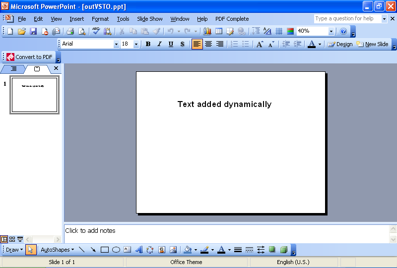

{} 

Một nhiệm vụ phổ biến mà các nhà phát triển cần thực hiện là thêm văn bản vào các slide một cách động. Bài viết này cung cấp các ví dụ mã cho việc thêm văn bản động bằng cách sử dụng [VSTO](/slides/vi/java/adding-text-dynamically-using-vsto-and-aspose-slides-for-java/) và [Aspose.Slides for Java](/slides/vi/java/adding-text-dynamically-using-vsto-and-aspose-slides-for-java/).

{} 
## **Thêm Văn Bản Động**
Cả hai phương pháp đều thực hiện các bước sau:

1. Tạo một bài thuyết trình.
1. Thêm một slide trống.
1. Thêm một hộp văn bản.
1. Đặt một số văn bản.
1. Ghi lại bài thuyết trình.
## **Ví Dụ Mã VSTO**
Các đoạn mã dưới đây tạo ra một bài thuyết trình với một slide trống và một chuỗi văn bản trên đó.

**Bài thuyết trình được tạo bằng VSTO** 


## **Ví Dụ Aspose.Slides cho Java**
Các đoạn mã dưới đây sử dụng Aspose.Slides để tạo một bài thuyết trình với một slide trống và một chuỗi văn bản trên đó.

**Bài thuyết trình được tạo bằng Aspose.Slides cho Java** 

