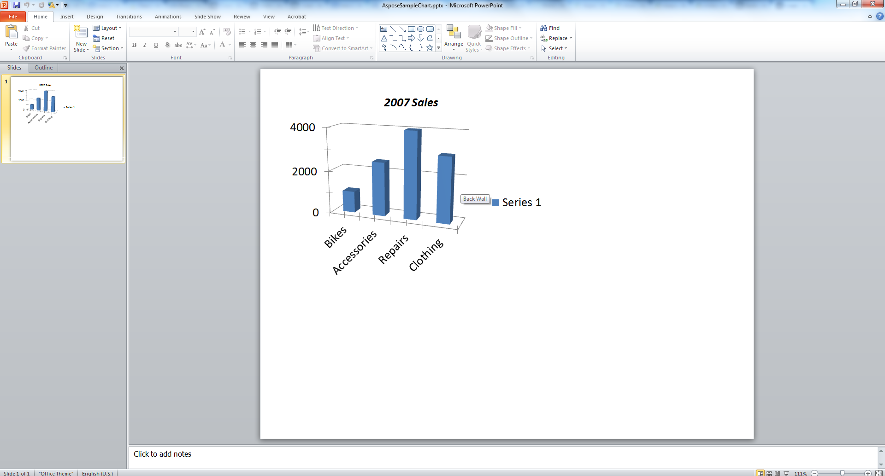

{} 

Biểu đồ là biểu diễn trực quan của dữ liệu, được sử dụng rộng rãi trong các bài thuyết trình. Bài viết này trình bày mã để tạo biểu đồ trong Microsoft PowerPoint một cách lập trình bằng cách sử dụng [VSTO](/slides/vi/java/create-a-chart-in-a-microsoft-powerpoint-presentation/) và [Aspose.Slides for Java](/slides/vi/java/create-a-chart-in-a-microsoft-powerpoint-presentation/).

{} 
## **Tạo biểu đồ**
Các ví dụ mã dưới đây mô tả quy trình thêm một biểu đồ cột cụm 3D đơn giản bằng VSTO. Bạn tạo một thể hiện của bản trình bày, thêm một biểu đồ mặc định vào đó. Sau đó sử dụng sổ làm việc Microsoft Excel để truy cập và chỉnh sửa dữ liệu biểu đồ cùng với việc thiết lập các thuộc tính của biểu đồ. Cuối cùng, lưu bản trình bày.
### **Ví dụ VSTO**
Sử dụng VSTO, các bước sau được thực hiện:

1. Tạo một thể hiện của bản trình bày Microsoft PowerPoint.
1. Thêm một slide trống vào bản trình bày.
1. Thêm một biểu đồ **3D clustered column** và truy cập vào nó.
1. Tạo một thể hiện mới của Microsoft Excel Workbook và tải dữ liệu biểu đồ.
1. Truy cập bảng tính dữ liệu biểu đồ bằng thể hiện Microsoft Excel Workbook instancefromworkbook.
1. Đặt phạm vi biểu đồ trong bảng tính và loại bỏ series 2 và 3 khỏi biểu đồ.
1. Sửa đổi dữ liệu danh mục của biểu đồ trong bảng tính dữ liệu biểu đồ.
1. Sửa đổi dữ liệu series 1 của biểu đồ trong bảng tính dữ liệu biểu đồ.
1. Bây giờ, truy cập tiêu đề biểu đồ và thiết lập các thuộc tính phông chữ.
1. Truy cập trục giá trị của biểu đồ và thiết lập đơn vị lớn, đơn vị nhỏ, giá trị lớn nhất và giá trị nhỏ nhất.
1. Truy cập độ sâu biểu đồ hoặc trục series và loại bỏ nó vì trong ví dụ này, chỉ sử dụng một series.
1. Bây giờ, thiết lập góc quay của biểu đồ theo hướng X và Y.
1. Lưu bản trình bày.
1. Đóng các thể hiện của Microsoft Excel và PowerPoint.

**Bản trình bày đầu ra, được tạo bằng VSTO** 




### **Ví dụ Aspose.Slides for Java**
Sử dụng Aspose.Slides for Java, các bước sau được thực hiện:

1. Tạo một thể hiện của bản trình bày Microsoft PowerPoint.
1. Thêm một slide trống vào bản trình bày.
1. Thêm một biểu đồ **3D clustered column** và truy cập nó.
1. Truy cập bảng tính dữ liệu biểu đồ bằng thể hiện Microsoft Excel Workbook instancefromworkbook.
1. Loại bỏ series 2 và 3 không sử dụng.
1. Truy cập các danh mục biểu đồ và sửa đổi nhãn.
1. Truy cập series 1 và sửa đổi các giá trị series.
1. Bây giờ, truy cập tiêu đề biểu đồ và thiết lập các thuộc tính phông chữ.
1. Truy cập trục giá trị của biểu đồ và thiết lập đơn vị lớn, đơn vị nhỏ, giá trị lớn nhất và giá trị nhỏ nhất.
1. Bây giờ, thiết lập góc quay của biểu đồ theo hướng X và Y.
1. Lưu bản trình bày ở định dạng PPTX.

**Bản trình bày đầu ra, được tạo bằng Aspose.Slides** 



## **Câu hỏi thường gặp**

**Tôi có thể tạo các loại biểu đồ khác như biểu đồ tròn, biểu đồ đường hoặc biểu đồ cột với Aspose.Slides không?**

Có. Aspose.Slides hỗ trợ một loạt các [loại biểu đồ](/slides/vi/java/create-chart/), bao gồm biểu đồ tròn, biểu đồ đường, biểu đồ cột, biểu đồ phân tán, biểu đồ bong bóng và nhiều hơn nữa. Bạn có thể chỉ định loại biểu đồ mong muốn bằng cách sử dụng lớp [ChartType](https://reference.aspose.com/slides/vi/java/com.aspose.slides/charttype/) khi thêm một biểu đồ.

**Tôi có thể áp dụng các kiểu hoặc chủ đề tùy chỉnh cho biểu đồ không?**

Có. Bạn có thể tùy chỉnh hoàn toàn giao diện của biểu đồ, bao gồm màu sắc, phông chữ, nền tô, đường viền, lưới và bố cục. Tuy nhiên, việc áp dụng các chủ đề Office chính xác như trong PowerPoint yêu cầu thiết lập thủ công từng kiểu riêng lẻ.

**Tôi có thể xuất biểu đồ dưới dạng hình ảnh riêng biệt khỏi slide không?**

Có, Aspose.Slides cho phép bạn xuất bất kỳ hình dạng nào — bao gồm cả biểu đồ — dưới dạng hình ảnh riêng (ví dụ: PNG, JPEG) bằng cách sử dụng phương thức `getImage` trên [shape](https://reference.aspose.com/slides/vi/java/com.aspose.slides/shape/) của biểu đồ.