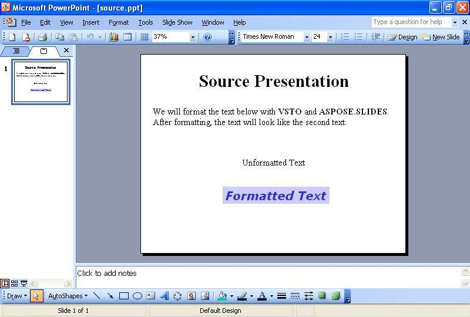

{} 

Đôi khi, bạn cần định dạng văn bản trên các slide một cách lập trình. Bài viết này trình bày cách đọc một bản thuyết trình mẫu có một số văn bản trên slide đầu tiên bằng cách sử dụng [VSTO](/slides/vi/java/format-text-using-vsto-and-aspose-slides-for-java/) và [Aspose.Slides for Java](/slides/vi/java/format-text-using-vsto-and-aspose-slides-for-java/). Mã sẽ định dạng văn bản trong ô văn bản thứ ba trên slide sao cho trông giống như văn bản trong ô cuối cùng.

{} 
## **Định dạng văn bản**
Cả hai phương pháp VSTO và Aspose.Slides thực hiện các bước sau:

1. Mở bản thuyết trình nguồn.
1. Truy cập slide đầu tiên.
1. Truy cập ô văn bản thứ ba.
1. Thay đổi định dạng của văn bản trong ô văn bản thứ ba.
1. Lưu bản thuyết trình vào đĩa.

Các ảnh chụp màn hình bên dưới hiển thị slide mẫu trước và sau khi thực thi mã VSTO và Aspose.Slides for Java.

**Bản thuyết trình đầu vào** 

### **Ví dụ mã VSTO**
Mã dưới đây cho thấy cách định dạng lại văn bản trên một slide bằng VSTO.

**Văn bản đã được định dạng lại bằng VSTO** 



### **Ví dụ Aspose.Slides for Java**
Để định dạng văn bản với Aspose.Slides, hãy thêm phông chữ trước khi định dạng văn bản.

**Bản thuyết trình output được tạo bởi Aspose.Slides** 

