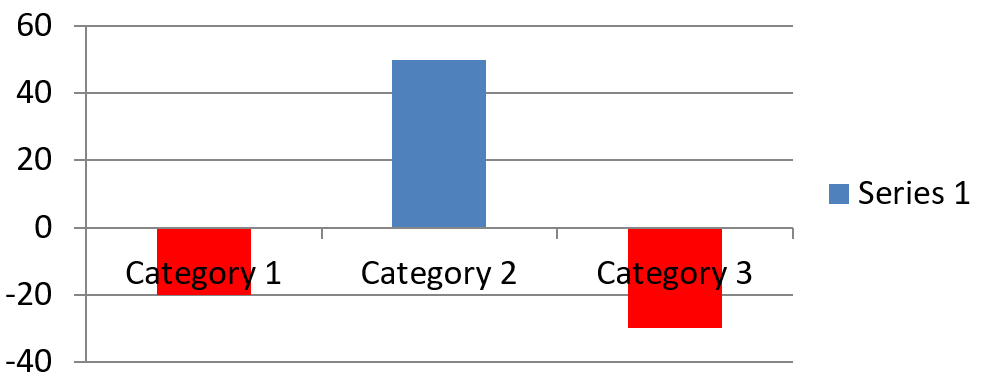

## **Tổng quan**

Một biểu đồ lưu trữ dữ liệu đã vẽ trong một workbook dữ liệu biểu đồ. Một [IChartSeries](https://reference.aspose.com/slides/vi/java/com.aspose.slides/ichartseries/) đại diện cho một tập hợp các giá trị liên quan, và mỗi [IChartDataPoint](https://reference.aspose.com/slides/vi/java/com.aspose.slides/ichartdatapoint/) trong tập hợp tham chiếu tới một hoặc nhiều ô trong workbook. Các đối tượng [IChartCategory](https://reference.aspose.com/slides/vi/java/com.aspose.slides/ichartcategory/) cung cấp các nhãn hoặc giá trị nhóm chung cho các tập hợp. Vì vậy, tên tập hợp, các danh mục và giá trị điểm được liên kết với các đối tượng [IChartDataCell](https://reference.aspose.com/slides/vi/java/com.aspose.slides/ichartdatacell/) thay vì chỉ được lưu dưới dạng văn bản hiển thị.

Đối với một biểu đồ danh mục điển hình, workbook mặc định sử dụng hàng 0 cho tên series, cột 0 cho tên danh mục và các ô còn lại cho giá trị series. Các chỉ mục worksheet, hàng và cột truyền cho [IChartDataWorkbook.getCell](https://reference.aspose.com/slides/vi/java/com.aspose.slides/ichartdataworkbook/#getCell-int-int-int-) đều bắt đầu từ 0. Bố cục này hữu ích khi bạn tạo biểu đồ với dữ liệu mặc định, nhưng không nên cho rằng mọi biểu đồ hiện có đều sử dụng nó. Đối với một bản trình bày đã tải, hãy kiểm tra các ô được series, categories và data points tham chiếu trước khi thay đổi giá trị workbook.

Cài đặt biểu đồ có ba phạm vi khác nhau:

- Cài đặt cấp series, chẳng hạn như [IChartSeries.getFormat](https://reference.aspose.com/slides/vi/java/com.aspose.slides/ichartseries/#getFormat--), cung cấp giao diện mặc định cho tất cả các điểm trong một series.
- Cài đặt cấp điểm dữ liệu, chẳng hạn như [IChartDataPoint.getFormat](https://reference.aspose.com/slides/vi/java/com.aspose.slides/ichartdatapoint/#getFormat--), ghi đè giao diện series cho một điểm.
- Cài đặt nhóm áp dụng cho các series tương thích thuộc cùng một [IChartSeriesGroup](https://reference.aspose.com/slides/vi/java/com.aspose.slides/ichartseriesgroup/). Truy cập nhóm qua [IChartSeries.getParentSeriesGroup](https://reference.aspose.com/slides/vi/java/com.aspose.slides/ichartseries/#getParentSeriesGroup--) khi bạn cần đặt các tùy chọn như overlap hoặc gap width.

Khi không có màu nền điểm hoặc series nào được đặt rõ ràng, kiểu biểu đồ và theme sẽ xác định giao diện tự động. Khi cả định dạng series và điểm đều tồn tại, định dạng điểm sẽ có độ ưu tiên cho điểm đó.


## **Đặt Overlap cho Series biểu đồ**

[IChartSeries.getOverlap](https://reference.aspose.com/slides/vi/java/com.aspose.slides/ichartseries/#getOverlap--) báo cáo mức độ các thanh hoặc cột chồng lên nhau trong biểu đồ 2D, từ -100 đến 100 phần trăm. Đây là một phép chiếu chỉ đọc của cài đặt trên nhóm series cha. Sử dụng [IChartSeriesGroup.setOverlap](https://reference.aspose.com/slides/vi/java/com.aspose.slides/ichartseriesgroup/#setOverlap-byte-) để cập nhật mọi series tương thích trong nhóm đó. Tùy chọn này áp dụng cho các loại biểu đồ hiển thị các thanh hoặc cột được nhóm lại; nó không ảnh hưởng đến các nhóm series không liên quan trong một biểu đồ kết hợp.

Ví dụ sau đặt overlap cho nhóm chứa series đầu tiên:

```java
import com.aspose.slides.*;

final int firstSlideIndex = 0;
final int firstSeriesIndex = 0;
final byte overlapPercent = 30;

Presentation presentation = new Presentation();
try {
    ISlide slide = presentation.getSlides().get_Item(firstSlideIndex);

    // Biểu đồ mới chứa các series mẫu, danh mục và giá trị.
    IChart chart = slide.getShapes().addChart(ChartType.ClusteredColumn, 20, 20, 500, 200);

    IChartSeries series = chart.getChartData().getSeries().get_Item(firstSeriesIndex);
    series.getParentSeriesGroup().setOverlap(overlapPercent);

    presentation.save("series_overlap.pptx", SaveFormat.Pptx);
} finally {
    presentation.dispose();
}
```

Kết quả:


## **Thay đổi màu nền Series**

Sử dụng [IChartSeries.getFormat](https://reference.aspose.com/slides/vi/java/com.aspose.slides/ichartseries/#getFormat--) để đặt màu nền mặc định cho toàn bộ series. Nếu một điểm đã có màu nền rõ ràng, cài đặt [IChartDataPoint.getFormat](https://reference.aspose.com/slides/vi/java/com.aspose.slides/ichartdatapoint/#getFormat--) của nó sẽ ghi đè màu nền series cho điểm đó.

Ví dụ sau áp dụng màu nền xanh đậm đặc cho series đầu tiên:

```java
import com.aspose.slides.*;
import java.awt.Color;

final int firstSlideIndex = 0;
final int firstSeriesIndex = 0;

Presentation presentation = new Presentation();
try {
    ISlide slide = presentation.getSlides().get_Item(firstSlideIndex);

    IChart chart = slide.getShapes().addChart(ChartType.ClusteredColumn, 20, 20, 500, 200);

    IChartSeries series = chart.getChartData().getSeries().get_Item(firstSeriesIndex);
    series.getFormat().getFill().setFillType(FillType.Solid);
    series.getFormat().getFill().getSolidFillColor().setColor(Color.BLUE);

    presentation.save("series_color.pptx", SaveFormat.Pptx);
} finally {
    presentation.dispose();
}
```

Kết quả:


## **Thay đổi Tên Series**

Tên series được lưu trong workbook dữ liệu biểu đồ và thường được hiển thị trong legend. Trong workbook mặc định được tạo cho biểu đồ cột nhóm, ô B1 nằm tại hàng 0, cột 1 và chứa tên của series đầu tiên. Các hằng số được đặt tên trong ví dụ sau làm rõ cấu trúc này:

```java
import com.aspose.slides.*;

final int firstSlideIndex = 0;
final int worksheetIndex = 0;
final int seriesNameRowIndex = 0;
final int firstSeriesColumnIndex = 1;

Presentation presentation = new Presentation();
try {
    ISlide slide = presentation.getSlides().get_Item(firstSlideIndex);

    IChart chart = slide.getShapes().addChart(ChartType.ClusteredColumn, 20, 20, 500, 200);

    IChartDataWorkbook workbook = chart.getChartData().getChartDataWorkbook();
    IChartDataCell seriesNameCell = workbook.getCell(worksheetIndex, seriesNameRowIndex, firstSeriesColumnIndex);
    seriesNameCell.setValue("Revenue");

    presentation.save("series_name.pptx", SaveFormat.Pptx);
} finally {
    presentation.dispose();
}
```

Bạn cũng có thể cập nhật ô đã được [IChartSeries.getName](https://reference.aspose.com/slides/vi/java/com.aspose.slides/ichartseries/#getName--) tham chiếu. Cách này tránh việc giả định một hàng và cột cụ thể trong một biểu đồ đã tồn tại:

```java
import com.aspose.slides.*;

final int firstSlideIndex = 0;
final int firstSeriesIndex = 0;
final int firstNameCellIndex = 0;

Presentation presentation = new Presentation();
try {
    ISlide slide = presentation.getSlides().get_Item(firstSlideIndex);

    IChart chart = slide.getShapes().addChart(ChartType.ClusteredColumn, 20, 20, 500, 200);

    IChartSeries series = chart.getChartData().getSeries().get_Item(firstSeriesIndex);
    IChartDataCell seriesNameCell = series.getName().getAsCells().get_Item(firstNameCellIndex);
    seriesNameCell.setValue("Revenue");

    presentation.save("series_name.pptx", SaveFormat.Pptx);
} finally {
    presentation.dispose();
}
```

Kết quả:


## **Lấy màu nền Series tự động**

[IChartSeries.getAutomaticSeriesColor](https://reference.aspose.com/slides/vi/java/com.aspose.slides/ichartseries/#getAutomaticSeriesColor--) trả về màu được tính dựa trên chỉ số series và kiểu biểu đồ. Đây là màu được sử dụng khi màu nền series chưa được định nghĩa rõ ràng. Gọi phương thức này chỉ đọc màu đã tính; nó không gán màu mới.

Ví dụ sau in màu tự động của mỗi series mặc định:

```java
import com.aspose.slides.*;
import java.awt.Color;

final int firstSlideIndex = 0;

Presentation presentation = new Presentation();
try {
    ISlide slide = presentation.getSlides().get_Item(firstSlideIndex);

    IChart chart = slide.getShapes().addChart(ChartType.ClusteredColumn, 20, 20, 500, 200);

    int seriesCount = chart.getChartData().getSeries().size();
    for (int seriesIndex = 0; seriesIndex < seriesCount; seriesIndex++) {
        IChartSeries series = chart.getChartData().getSeries().get_Item(seriesIndex);
        Color automaticColor = series.getAutomaticSeriesColor();
        System.out.println("Series " + seriesIndex + ": " + automaticColor);
    }
} finally {
    presentation.dispose();
}
```

Đầu ra mẫu cho kiểu biểu đồ mặc định:

```text
Series 0: java.awt.Color[r=79,g=129,b=189]
Series 1: java.awt.Color[r=192,g=80,b=77]
Series 2: java.awt.Color[r=155,g=187,b=89]
```

Màu sắc chính xác phụ thuộc vào kiểu biểu đồ và theme.

## **Đặt màu nền Invert cho Series biểu đồ**

Đối với series thanh, cột và bubble, [IChartSeries.setInvertIfNegative](https://reference.aspose.com/slides/vi/java/com.aspose.slides/ichartseries/#setInvertIfNegative-boolean-) có thể hiển thị các giá trị âm với màu nền khác. Đặt màu nền series thường thành màu đặc, bật tính năng invert và chỉ định màu cho giá trị âm qua [IChartSeries.getInvertedSolidFillColor](https://reference.aspose.com/slides/vi/java/com.aspose.slides/ichartseries/#getInvertedSolidFillColor--). Các số âm không thay đổi trong workbook; chỉ màu hiển thị thay đổi.

Ví dụ sau thay thế dữ liệu biểu đồ mặc định bằng một series. Hàng 0 của worksheet chứa tên series, cột 0 chứa tên danh mục, và cột 1 chứa các giá trị:

```java
import com.aspose.slides.*;
import java.awt.Color;

final int firstSlideIndex = 0;
final int worksheetIndex = 0;
final int headerRowIndex = 0;
final int categoryColumnIndex = 0;
final int firstSeriesColumnIndex = 1;
final int firstDataRowIndex = 1;

String[] categoryNames = { "Category 1", "Category 2", "Category 3" };
int[] seriesValues = { -20, 50, -30 };

Presentation presentation = new Presentation();
try {
    ISlide slide = presentation.getSlides().get_Item(firstSlideIndex);

    IChart chart = slide.getShapes().addChart(ChartType.ClusteredColumn, 20, 20, 500, 200);
    IChartData chartData = chart.getChartData();
    IChartDataWorkbook workbook = chartData.getChartDataWorkbook();

    chartData.getSeries().clear();
    chartData.getCategories().clear();

    IChartDataCell seriesNameCell = workbook.getCell(worksheetIndex, headerRowIndex, firstSeriesColumnIndex, "Series 1");
    int chartType = chart.getType();
    IChartSeries series = chartData.getSeries().add(seriesNameCell, chartType);

    for (int categoryIndex = 0; categoryIndex < categoryNames.length; categoryIndex++) {
        int dataRowIndex = firstDataRowIndex + categoryIndex;
        String categoryName = categoryNames[categoryIndex];
        int seriesValue = seriesValues[categoryIndex];

        IChartDataCell categoryCell = workbook.getCell(worksheetIndex, dataRowIndex, categoryColumnIndex, categoryName);
        chartData.getCategories().add(categoryCell);

        IChartDataCell valueCell = workbook.getCell(worksheetIndex, dataRowIndex, firstSeriesColumnIndex, seriesValue);
        series.getDataPoints().addDataPointForBarSeries(valueCell);
    }

    Color automaticSeriesColor = series.getAutomaticSeriesColor();
    series.getFormat().getFill().setFillType(FillType.Solid);
    series.getFormat().getFill().getSolidFillColor().setColor(automaticSeriesColor);
    series.setInvertIfNegative(true);
    series.getInvertedSolidFillColor().setColor(Color.RED);

    presentation.save("inverted_solid_fill_color.pptx", SaveFormat.Pptx);
} finally {
    presentation.dispose();
}
```

Kết quả:



Bạn có thể bật invert cho một điểm qua [IChartDataPoint.setInvertIfNegative](https://reference.aspose.com/slides/vi/java/com.aspose.slides/ichartdatapoint/#setInvertIfNegative-boolean-). Trong ví dụ sau, invert bị tắt cho series và chỉ bật cho điểm đã chọn. Điểm này cũng được gán giá trị âm để hiệu ứng hiển thị:

```java
import com.aspose.slides.*;
import java.awt.Color;

final int firstSlideIndex = 0;
final int firstSeriesIndex = 0;
final int targetDataPointIndex = 2;
final int negativeValue = -30;

Presentation presentation = new Presentation();
try {
    ISlide slide = presentation.getSlides().get_Item(firstSlideIndex);

    IChart chart = slide.getShapes().addChart(ChartType.ClusteredColumn, 20, 20, 500, 200);

    IChartSeries series = chart.getChartData().getSeries().get_Item(firstSeriesIndex);
    Color automaticSeriesColor = series.getAutomaticSeriesColor();
    series.getFormat().getFill().setFillType(FillType.Solid);
    series.getFormat().getFill().getSolidFillColor().setColor(automaticSeriesColor);
    series.getInvertedSolidFillColor().setColor(Color.RED);
    series.setInvertIfNegative(false);

    IChartDataPoint dataPoint = series.getDataPoints().get_Item(targetDataPointIndex);
    dataPoint.getValue().getAsCell().setValue(negativeValue);
    dataPoint.setInvertIfNegative(true);

    presentation.save("data_point_invert_color_if_negative.pptx", SaveFormat.Pptx);
} finally {
    presentation.dispose();
}
```

## **Xóa Giá trị Data Point cụ thể**

Để làm cho một điểm trở nên trống mà không xóa các điểm khác, đặt ô workbook hỗ trợ của nó thành `null`. Đối với biểu đồ cột, giá trị được vẽ có thể lấy qua [IChartDataPoint.getValue](https://reference.aspose.com/slides/vi/java/com.aspose.slides/ichartdatapoint/#getValue--). Điểm dữ liệu vẫn giữ vị trí danh mục, nhưng biểu đồ sẽ coi giá trị của nó là trống theo cài đặt blank-value của biểu đồ.

Ví dụ sau chỉ xóa điểm thứ hai trong series đầu tiên:

```java
import com.aspose.slides.*;

final int firstSlideIndex = 0;
final int firstSeriesIndex = 0;
final int targetDataPointIndex = 1;

Presentation presentation = new Presentation();
try {
    ISlide slide = presentation.getSlides().get_Item(firstSlideIndex);

    IChart chart = slide.getShapes().addChart(ChartType.ClusteredColumn, 20, 20, 500, 200);

    IChartSeries series = chart.getChartData().getSeries().get_Item(firstSeriesIndex);
    IChartDataPoint dataPoint = series.getDataPoints().get_Item(targetDataPointIndex);
    dataPoint.getValue().getAsCell().setValue(null);

    presentation.save("clear_data_point_value.pptx", SaveFormat.Pptx);
} finally {
    presentation.dispose();
}
```

Biểu đồ scatter sử dụng các ô X và Y riêng biệt, và biểu đồ bubble còn sử dụng ô kích thước. Chỉ xóa ô đại diện cho giá trị bạn muốn loại bỏ. Đừng gọi [IChartDataPointCollection.clear](https://reference.aspose.com/slides/vi/java/com.aspose.slides/ichartdatapointcollection/#clear--) khi bạn muốn giữ lại các điểm khác, vì phương thức này sẽ xóa mọi điểm dữ liệu khỏi collection.

## **Đặt Gap Width cho Series**

Gap width là khoảng cách giữa các cụm thanh hoặc cột liền kề, được biểu thị dưới dạng phần trăm của chiều rộng thanh hoặc cột. Giống như overlap, nó thuộc về nhóm series cha chứ không phải một series riêng. Gọi [IChartSeriesGroup.setGapWidth](https://reference.aspose.com/slides/vi/java/com.aspose.slides/ichartseriesgroup/#setGapWidth-int-) một lần cho nhóm. Giá trị lớn hơn tạo ra nhiều không gian hơn giữa các cụm; giá trị nhỏ hơn làm chúng dày đặc hơn.

Ví dụ sau thay đổi gap width và lưu chỉ bản trình bày cuối cùng:

```java
import com.aspose.slides.*;

final int firstSlideIndex = 0;
final int firstSeriesIndex = 0;
final int gapWidthPercent = 30;

Presentation presentation = new Presentation();
try {
    ISlide slide = presentation.getSlides().get_Item(firstSlideIndex);

    IChart chart = slide.getShapes().addChart(ChartType.StackedColumn, 20, 20, 500, 200);

    IChartSeries series = chart.getChartData().getSeries().get_Item(firstSeriesIndex);
    series.getParentSeriesGroup().setGapWidth(gapWidthPercent);

    presentation.save("gap_width_30.pptx", SaveFormat.Pptx);
} finally {
    presentation.dispose();
}
```

Kết quả:


## **Câu hỏi thường gặp**

**Các loại biểu đồ nào hỗ trợ series dữ liệu?**

Tất cả các loại biểu đồ được biểu diễn bằng enum [ChartType](https://reference.aspose.com/slides/vi/java/com.aspose.slides/charttype/) đều sử dụng dữ liệu biểu đồ, nhưng series của chúng không phải luôn có cùng cấu trúc giá trị hay cùng cài đặt. Ví dụ, biểu đồ danh mục sử dụng categories và values, biểu đồ scatter sử dụng giá trị X và Y, và biểu đồ bubble còn thêm kích thước bubble. Hãy sử dụng phương pháp tạo data-point phù hợp với loại series. Các tùy chọn như overlap và gap width chỉ áp dụng cho các nhóm thanh hoặc cột tương thích.

**Series group là gì?**

Một [IChartSeriesGroup](https://reference.aspose.com/slides/vi/java/com.aspose.slides/ichartseriesgroup/) chứa các series tương thích chia sẻ các cài đặt vẽ ở mức nhóm. Một biểu đồ kết hợp có thể chứa nhiều hơn một nhóm, vì vậy việc thay đổi nhóm được truy cập qua một series không nhất thiết thay đổi mọi series trong biểu đồ.

**Biểu đồ mới tạo có chứa dữ liệu mặc định không?**

Có. Mặc định, [IShapeCollection.addChart](https://reference.aspose.com/slides/vi/java/com.aspose.slides/ishapecollection/#addChart-int-float-float-float-float-) tạo ra các series, categories và values mẫu. Bạn có thể chỉnh sửa các ô này hoặc xóa cả collection series và category trước khi thêm một tập dữ liệu tùy chỉnh hoàn toàn. Một overload cũng có thể tạo biểu đồ mà không có dữ liệu mặc định.

**Các đối tượng biểu đồ được kết nối với các ô workbook như thế nào?**

Tên series, nhãn category và giá trị data-point tham chiếu đến các ô trong một [IChartDataWorkbook](https://reference.aspose.com/slides/vi/java/com.aspose.slides/ichartdataworkbook/). Thay đổi một ô được tham chiếu sẽ cập nhật phần tử biểu đồ tương ứng. Khi bạn xây dựng dữ liệu tùy chỉnh, hãy giữ cho các hàng category và các hàng giá trị series được căn chỉnh sao cho mỗi điểm được vẽ dưới đúng category.

**Làm sao để xóa một điểm thay vì toàn bộ series?**

Đặt ô giá trị tương ứng thành `null` để giữ vị trí category của điểm dưới dạng một điểm trống. Sử dụng [IChartDataPointCollection.clear](https://reference.aspose.com/slides/vi/java/com.aspose.slides/ichartdatapointcollection/#clear--) chỉ khi bạn muốn xóa mọi điểm trong series đó. Nếu bạn cũng xóa các category, hãy cập nhật mọi series để các giá trị của chúng vẫn căn chỉnh với collection category.

**Các điểm trống được hiển thị như thế nào?**

Kết quả phụ thuộc vào loại biểu đồ và giá trị được cấu hình qua [IChart.setDisplayBlanksAs](https://reference.aspose.com/slides/vi/java/com.aspose.slides/ichart/#setDisplayBlanksAs-int-). Các biểu đồ hỗ trợ có thể hiển thị blanks dưới dạng khoảng trống, giá trị zero, hoặc bằng cách nối các điểm lân cận. Chọn cài đặt phù hợp với ý nghĩa của dữ liệu thiếu trong bản trình bày của bạn.

**Giá trị âm được định dạng ra sao?**

Đối với các series thanh, cột và bubble được hỗ trợ, gọi [IChartSeries.setInvertIfNegative](https://reference.aspose.com/slides/vi/java/com.aspose.slides/ichartseries/#setInvertIfNegative-boolean-) và đặt màu trả về từ [IChartSeries.getInvertedSolidFillColor](https://reference.aspose.com/slides/vi/java/com.aspose.slides/ichartseries/#getInvertedSolidFillColor--). Bạn có thể ghi đè hành vi cho một điểm riêng lẻ bằng [IChartDataPoint.setInvertIfNegative](https://reference.aspose.com/slides/vi/java/com.aspose.slides/ichartdatapoint/#setInvertIfNegative-boolean-). Những phương thức này ảnh hưởng đến định dạng, không phải giá trị số được lưu.

**Khi cả series và điểm đều được định dạng, định dạng nào thắng?**

Định dạng data-point rõ ràng có độ ưu tiên cho điểm đó. Các điểm khác tiếp tục sử dụng định dạng series rõ ràng hoặc, nếu series không có định dạng, dùng kiểu biểu đồ và theme tự động. Các cài đặt nhóm như overlap và gap width kiểm soát bố cục và không phải là các ghi đè định dạng ở mức điểm.

**Có giới hạn số series mà một biểu đồ có thể chứa không?**

Aspose.Slides không đặt giới hạn cố định cho số series. Trong thực tế, các hạn chế của file trình bày, bộ nhớ khả dụng, thời gian render và khả năng đọc biểu đồ sẽ quyết định một giới hạn thực tế.

**Nên thay đổi gì khi các cột quá gần nhau hoặc quá cách xa?**

Gọi [IChartSeriesGroup.setGapWidth](https://reference.aspose.com/slides/vi/java/com.aspose.slides/ichartseriesgroup/#setGapWidth-int-) trên nhóm series cha tương ứng. Tăng giá trị để mở rộng không gian giữa các cụm, hoặc giảm để đưa các cụm lại gần nhau hơn.