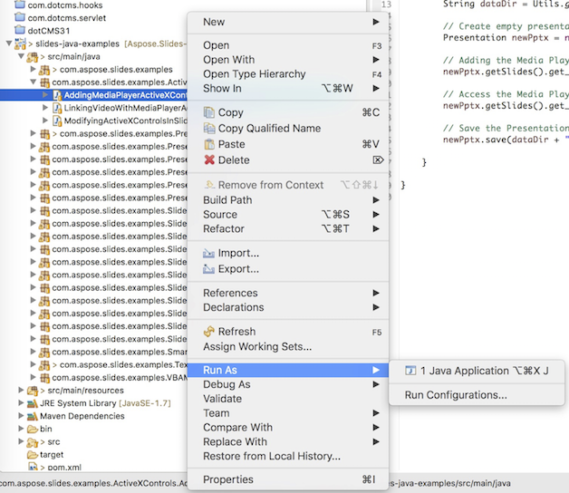

## **Tải Aspose.Slides từ GitHub**
Tất cả các ví dụ của Aspose.Slides cho Java được lưu trữ trên [Github](https://github.com/aspose-slides/Aspose.Slides-for-Java). Bạn có thể sao chép kho lưu trữ bằng trình khách Github yêu thích của mình hoặc tải tệp ZIP từ [đây](https://codeload.github.com/aspose-slides/Aspose.Slides-for-Java/zip/master).

Giải nén nội dung của tệp ZIP vào bất kỳ thư mục nào trên máy tính của bạn. Tất cả các ví dụ nằm trong thư mục **Examples**.


## **Nhập các ví dụ vào IDE**
Dự án sử dụng hệ thống xây dựng Maven. Bất kỳ IDE hiện đại nào cũng có thể dễ dàng mở hoặc nhập dự án và các phụ thuộc của nó. Dưới đây chúng tôi sẽ cho bạn thấy cách sử dụng các IDE phổ biến để biên dịch và chạy các ví dụ.

### **IntelliJ IDEA**
Nhấp vào menu **File** và chọn **Open**. Duyệt tới thư mục dự án và chọn tệp **pom.xml**.


Nó sẽ mở dự án và tự động tải các phụ thuộc. Từ tab Project, duyệt các ví dụ trong thư mục **src/main/java**. Để chạy một ví dụ, chỉ cần nhấp chuột phải vào tệp và chọn "Run ..", ví dụ sẽ được thực thi và đầu ra sẽ được hiển thị trong cửa sổ console tích hợp.


### **Eclipse**
Nhấp vào menu **File** và chọn **Import**. Chọn **Maven** - Existing Maven Projects.


Duyệt tới thư mục bạn đã sao chép hoặc tải về từ GitHub và chọn tệp **pom.xml**. Nó sẽ mở dự án và tự động tải các phụ thuộc. Từ tab Package Explorer, duyệt các ví dụ trong thư mục **src/main/java**. Để chạy một ví dụ, chỉ cần nhấp chuột phải vào tệp và chọn **Run As** - **Java Application**, ví dụ sẽ được thực thi và đầu ra sẽ được hiển thị trong cửa sổ console tích hợp.



### **NetBeans**
Nhấp vào menu **File** và chọn **Open Project**. Duyệt tới thư mục bạn đã sao chép hoặc tải về từ GitHub. Biểu tượng của thư mục **Examples** sẽ cho thấy đó là một dự án Maven. Chọn Examples và mở nó.


Nó sẽ mở dự án và tự động tải các phụ thuộc. Từ tab Projects, duyệt các ví dụ trong **source packages**. Để chạy một ví dụ, chỉ cần nhấp chuột phải vào tệp và chọn **Run File**, ví dụ sẽ được thực thi và đầu ra sẽ được hiển thị trong cửa sổ console tích hợp.


## **Thêm thư viện Aspose.Slides vào Maven Local Repository**
Khi bạn nhập dự án **Aspose.Slides Examples** vào IDE, Maven sẽ tự động tải tệp JAR aspose.slides từ [Aspose Maven Repository](https://releases.aspose.com/java/repo/com/aspose/). Trong trường hợp bạn không có truy cập internet, bạn có thể thêm JAR vào kho lưu trữ cục bộ của mình một cách thủ công.

### **mvn install**
Tải xuống [aspose.slides](https://releases.aspose.com/java/repo/com/aspose/aspose-slides/), giải nén và sao chép tệp aspose.slides-version.jar đến một vị trí khác, ví dụ, ổ C. Thực hiện lệnh sau:

```
mvn install:install-file
    - Dfile=c:\aspose.slides-version.jar
    - DgroupId=com.aspose
    - DartifactId=aspose-slides
    - Dversion={version}
    - Dpackaging=jar
```

Bây giờ, tệp jar **aspose.slides** đã được sao chép vào Maven local repository của bạn.

### **pom.xml**
Sau khi cài đặt, chỉ cần khai báo tọa độ **aspose.slides** trong pom.xml. Thêm kho lưu trữ sau vào tab repositories và phụ thuộc vào tab dependencies.

``` xml
<repository>
    <id>AsposeJavaAPI</id>
    <name>Aspose Java API</name>
    <url>https://releases.aspose.com/java/repo/</url>
</repository>

<dependency>
    <groupId>com.aspose</groupId>
    <artifactId>aspose-slides</artifactId>
    <version>25.12</version>
    <classifier>jdk16</classifier>
</dependency>
```

### **Xong**
Biên dịch nó, bây giờ tệp jar **aspose.slides** có thể được lấy từ Maven local repository của bạn.

## **Đóng góp**
Nếu bạn muốn thêm hoặc cải thiện một ví dụ, chúng tôi khuyến khích bạn đóng góp vào dự án. Tất cả các ví dụ và dự án showcase trong kho này là nguồn mở và có thể được sử dụng tự do trong các ứng dụng của bạn.

Để đóng góp, bạn có thể fork kho lưu trữ, chỉnh sửa mã nguồn và gửi một Pull Request. Chúng tôi sẽ xem xét các thay đổi và đưa chúng vào kho nếu thấy hữu ích.