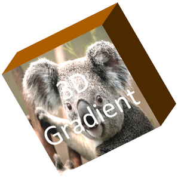

## **Tổng quan**

Aspose.Slides for .NET có thể tạo, chỉnh sửa, giữ lại và hiển thị định dạng 3D theo kiểu PowerPoint cho các hình dạng và văn bản. Bài viết này đề cập đến các hiệu ứng 3D như xoay, nhô ra, viền, ánh sáng, vật liệu, phủ gradient hoặc hình ảnh và văn bản 3D.

{}
Bài viết này nói về các hiệu ứng định dạng 3D trên các hình dạng và văn bản trong PowerPoint. Nó không liên quan đến việc chèn hoặc chỉnh sửa các tệp mô hình 3D độc lập. Khi bạn xuất một slide ra ảnh, PDF hoặc HTML, Aspose.Slides sẽ chuyển các hiệu ứng 3D này thành đầu ra 2D đã xuất.
{}

## **Khái niệm Định dạng 3D**

Sử dụng thuộc tính [IShape.ThreeDFormat](https://reference.aspose.com/slides/vi/net/aspose.slides/ishape/properties/threedformat) để áp dụng định dạng 3D cho một hình dạng. Thuộc tính này khai thác [IThreeDFormat](https://reference.aspose.com/slides/vi/net/aspose.slides/ithreedformat), chịu trách nhiệm điều khiển cảnh 3D cho hình dạng đó.

Đối với văn bản, sử dụng thuộc tính [ITextFrameFormat.ThreeDFormat](https://reference.aspose.com/slides/vi/net/aspose.slides/itextframeformat/properties/threedformat). Thuộc tính này áp dụng định dạng 3D cho khung văn bản thay vì phần thân hình dạng.

Các thuộc tính quan trọng nhất là:

| Thuộc tính | Kiểm soát gì | Khi nào nên dùng |
|---|---|---|
| [Camera](https://reference.aspose.com/slides/vi/net/aspose.slides/ithreedformat/properties/camera) | Điểm nhìn, loại máy ảnh preset, xoay, thu phóng và phối cảnh. | Xoay đối tượng trong không gian 3D hoặc khớp với preset xoay 3D của PowerPoint. |
| [LightRig](https://reference.aspose.com/slides/vi/net/aspose.slides/ithreedformat/properties/lightrig) | Preset ánh sáng, hướng và góc quay của ánh sáng. | Thay đổi cách các điểm sáng và bóng xuất hiện trên bề mặt 3D. |
| [Material](https://reference.aspose.com/slides/vi/net/aspose.slides/ithreedformat/properties/material) | Vật liệu bề mặt, như phẳng, mờ, nhựa hoặc kim loại. | Làm cho hình dạng cùng một hình học trông phẳng hơn, mềm hơn, bóng hơn hoặc kim loại hơn. |
| [ExtrusionHeight](https://reference.aspose.com/slides/vi/net/aspose.slides/ithreedformat/properties/extrusionheight) | Khoảng cách hình dạng kéo dài ra phía sau mặt trước. | Biến một hình dạng phẳng thành một đối tượng 3D dày nhìn thấy được. |
| [ExtrusionColor](https://reference.aspose.com/slides/vi/net/aspose.slides/ithreedformat/properties/extrusioncolor) | Màu của các mặt bên được nhô ra. | Làm cho độ sâu nhìn thấy được hoặc phối màu mặt bên với màu nền mặt trước. |
| [Depth](https://reference.aspose.com/slides/vi/net/aspose.slides/ithreedformat/properties/depth) | Độ sâu 3D bổ sung được PowerPoint sử dụng trong định dạng 3D. | Tinh chỉnh độ sâu cho hình dạng hoặc văn bản, đặc biệt khi kết hợp với cài đặt viền và vật liệu. |
| [BevelTop](https://reference.aspose.com/slides/vi/net/aspose.slides/ithreedformat/properties/beveltop) và [BevelBottom](https://reference.aspose.com/slides/vi/net/aspose.slides/ithreedformat/properties/bevelbottom) | Các cạnh được nâng lên hoặc bo tròn trên mặt trước và mặt sau. | Thêm một cạnh mềm mại hoặc tạo khuôn thay vì một mặt phẳng sắc nhọn. |
| [ContourColor](https://reference.aspose.com/slides/vi/net/aspose.slides/ithreedformat/properties/contourcolor) và [ContourWidth](https://reference.aspose.com/slides/vi/net/aspose.slides/ithreedformat/properties/contourwidth) | Viền bao quanh đối tượng 3D. | Nhấn mạnh ranh giới đối tượng trong đầu ra đã render. |

## **Tạo một Hình dạng 3D**

Một hình dạng thường cần bốn loại cài đặt trước khi nó trông giống như 3D một cách thuyết phục:

- Cài đặt máy ảnh, vì góc nhìn mặt trước mặc định có thể làm ẩn phần nhô ra.
- Cài đặt ánh sáng, vì ánh sáng giúp các mặt và bên của hình dạng có thể nhìn thấy.
- Cài đặt vật liệu, vì bề mặt ảnh hưởng đến cách ánh sáng được hiển thị.
- Cài đặt nhô ra hoặc độ sâu, vì một hình dạng phẳng cần độ dày.

Ví dụ dưới đây tạo một hình chữ nhật, thêm văn bản vào mặt trước, áp dụng định dạng 3D, lưu bản trình chiếu dưới dạng PPTX và render slide thành ảnh PNG.

```csharp
const float imageScale = 2;

using var presentation = new Presentation();

var slide = presentation.Slides[0];
var shape = slide.Shapes.AddAutoShape(ShapeType.Rectangle, 200, 150, 200, 200);
shape.TextFrame.Text = "3D";
shape.TextFrame.Paragraphs[0].ParagraphFormat.DefaultPortionFormat.FontHeight = 64;

shape.FillFormat.FillType = FillType.Solid;
shape.FillFormat.SolidFillColor.Color = Color.CornflowerBlue;

shape.ThreeDFormat.Camera.CameraType = CameraPresetType.OrthographicFront;
shape.ThreeDFormat.Camera.SetRotation(20, 30, 40);
shape.ThreeDFormat.LightRig.LightType = LightRigPresetType.Flat;
shape.ThreeDFormat.LightRig.Direction = LightingDirection.Top;
shape.ThreeDFormat.Material = MaterialPresetType.Flat;
shape.ThreeDFormat.ExtrusionHeight = 100;
shape.ThreeDFormat.ExtrusionColor.Color = Color.Blue;

using var thumbnail = slide.GetImage(imageScale, imageScale);
thumbnail.Save("shape_3d.png");

presentation.Save("shape_3d.pptx", SaveFormat.Pptx);
```

Hình ảnh slide được render hiển thị hình chữ nhật như một khối 3D dày:


## **Xoay một Hình dạng bằng Máy ảnh**

Trong PowerPoint, việc xoay 3D được cấu hình từ bảng Xoay 3D. Các giá trị xoay X, Y và Z tương ứng với việc xoay bạn đặt qua API máy ảnh.


Trong Aspose.Slides, thiết lập loại máy ảnh và góc quay qua [IThreeDFormat.Camera](https://reference.aspose.com/slides/vi/net/aspose.slides/ithreedformat/properties/camera):

```csharp
shape.ThreeDFormat.Camera.CameraType = CameraPresetType.OrthographicFront;
shape.ThreeDFormat.Camera.SetRotation(20, 30, 40);
```

Sử dụng máy ảnh khi bạn cần thay đổi cách người xem nhìn đối tượng. Nó không thay đổi hình học 2D của hình dạng trên slide. Nó thay đổi quan điểm 3D được PowerPoint và Aspose.Slides sử dụng khi render.

## **Thêm Nhô ra và Độ sâu**

Nhô ra làm cho một hình dạng trông dày bằng cách mở rộng nó ra phía sau mặt trước. Trong PowerPoint, điều khiển độ sâu đặt độ dày hiển thị này, và điều khiển màu đặt màu cho các mặt bên.


Đặt [IThreeDFormat.ExtrusionHeight](https://reference.aspose.com/slides/vi/net/aspose.slides/ithreedformat/properties/extrusionheight) để xác định độ dày và [IThreeDFormat.ExtrusionColor](https://reference.aspose.com/slides/vi/net/aspose.slides/ithreedformat/properties/extrusioncolor) để đặt màu mặt bên:

```csharp
shape.ThreeDFormat.Camera.SetRotation(20, 30, 40);
shape.ThreeDFormat.ExtrusionHeight = 100;
shape.ThreeDFormat.ExtrusionColor.Color = Color.Purple;
```

Sử dụng [IThreeDFormat.Depth](https://reference.aspose.com/slides/vi/net/aspose.slides/ithreedformat/properties/depth) khi bạn cần làm việc trực tiếp với giá trị độ sâu của PowerPoint hoặc kết hợp độ sâu với viền, vật liệu và hiệu ứng văn bản. Trong nhiều trường hợp hình dạng, `ExtrusionHeight` là cài đặt rõ ràng hơn vì nó trực tiếp thể hiện độ nhô ra nhìn thấy được.

## **Sử dụng Phủ Gradient hoặc Hình ảnh với Hiệu ứng 3D**

Định dạng 3D độc lập với việc phủ hình dạng. Bạn có thể áp dụng màu đặc, gradient, mẫu hoặc hình ảnh cho mặt trước và vẫn sử dụng cùng các cài đặt máy ảnh, ánh sáng, vật liệu và nhô ra.

Ví dụ này áp dụng một phủ gradient cho hình dạng và màu nhô ra tối hơn cho các mặt bên:

```csharp
const float imageScale = 2;

using var presentation = new Presentation();

var slide = presentation.Slides[0];
var shape = slide.Shapes.AddAutoShape(ShapeType.Rectangle, 200, 150, 250, 250);
shape.TextFrame.Text = "3D Gradient";
shape.TextFrame.Paragraphs[0].ParagraphFormat.DefaultPortionFormat.FontHeight = 64;

shape.FillFormat.FillType = FillType.Gradient;
shape.FillFormat.GradientFormat.GradientStops.Add(0, Color.Blue);
shape.FillFormat.GradientFormat.GradientStops.Add(100, Color.Orange);

shape.ThreeDFormat.Camera.CameraType = CameraPresetType.OrthographicFront;
shape.ThreeDFormat.Camera.SetRotation(10, 20, 30);
shape.ThreeDFormat.LightRig.LightType = LightRigPresetType.Flat;
shape.ThreeDFormat.LightRig.Direction = LightingDirection.Top;
shape.ThreeDFormat.Material = MaterialPresetType.Flat;
shape.ThreeDFormat.ExtrusionHeight = 150;
shape.ThreeDFormat.ExtrusionColor.Color = Color.DarkOrange;

using var thumbnail = slide.GetImage(imageScale, imageScale);
thumbnail.Save("gradient_3d.png");
```

Kết quả render vẫn giữ gradient trên mặt trước và render phần nhô ra riêng biệt:


Để sử dụng phủ hình ảnh thay thế, thêm hình ảnh vào bản trình chiếu và gán nó cho phần phủ của hình dạng:

```csharp
var imageData = File.ReadAllBytes("image.jpg");
var image = presentation.Images.AddImage(imageData);

shape.FillFormat.FillType = FillType.Picture;
shape.FillFormat.PictureFillFormat.Picture.Image = image;
shape.FillFormat.PictureFillFormat.PictureFillMode = PictureFillMode.Stretch;

shape.ThreeDFormat.Camera.SetRotation(10, 20, 30);
shape.ThreeDFormat.ExtrusionHeight = 150;
shape.ThreeDFormat.ExtrusionColor.Color = Color.DarkOrange;
```

Hình ảnh được render trên mặt trước, trong khi phần nhô ra được render như bề mặt 3D bên:



## **Áp dụng Định dạng 3D cho Văn bản**

Định dạng 3D cho hình dạng ảnh hưởng đến phần thân hình dạng. Định dạng 3D cho văn bản ảnh hưởng đến khung văn bản. Điều này hữu ích cho các hiệu ứng kiểu WordArt nơi các ký tự cần nhô ra, vật liệu, ánh sáng và cài đặt máy ảnh.

Ví dụ dưới đây tạo văn bản với phủ mẫu, áp dụng biến đổi WordArt và cấu hình cài đặt 3D trên [ITextFrameFormat](https://reference.aspose.com/slides/vi/net/aspose.slides/itextframeformat):

```csharp
const float imageScale = 2;

using var presentation = new Presentation();

var slide = presentation.Slides[0];
var shape = slide.Shapes.AddAutoShape(ShapeType.Rectangle, 200, 150, 250, 250);
shape.FillFormat.FillType = FillType.NoFill;
shape.LineFormat.FillFormat.FillType = FillType.NoFill;
shape.TextFrame.Text = "3D Text";

var portion = shape.TextFrame.Paragraphs[0].Portions[0];
portion.PortionFormat.FillFormat.FillType = FillType.Pattern;
portion.PortionFormat.FillFormat.PatternFormat.ForeColor.Color = Color.DarkOrange;
portion.PortionFormat.FillFormat.PatternFormat.BackColor.Color = Color.White;
portion.PortionFormat.FillFormat.PatternFormat.PatternStyle = PatternStyle.LargeGrid;

shape.TextFrame.Paragraphs[0].ParagraphFormat.DefaultPortionFormat.FontHeight = 128;

var textFrameFormat = shape.TextFrame.TextFrameFormat;
textFrameFormat.Transform = TextShapeType.ArchUp;
textFrameFormat.ThreeDFormat.ExtrusionHeight = 3.5f;
textFrameFormat.ThreeDFormat.Depth = 3;
textFrameFormat.ThreeDFormat.Material = MaterialPresetType.Plastic;
textFrameFormat.ThreeDFormat.LightRig.Direction = LightingDirection.Top;
textFrameFormat.ThreeDFormat.LightRig.LightType = LightRigPresetType.Balanced;
textFrameFormat.ThreeDFormat.LightRig.SetRotation(0, 0, 40);
textFrameFormat.ThreeDFormat.Camera.CameraType = CameraPresetType.PerspectiveContrastingRightFacing;

using var thumbnail = slide.GetImage(imageScale, imageScale);
thumbnail.Save("text_3d.png");

presentation.Save("text_3d.pptx", SaveFormat.Pptx);
```

Văn bản được render dưới dạng chữ 3D cong, nhô ra:


## **Hành vi Xuất và Render**

Aspose.Slides giữ lại định dạng 3D khi lưu dưới các định dạng PowerPoint như PPTX. Khi render hoặc xuất sang các định dạng bố cục cố định, cảnh 3D được raster hoá hoặc vẽ vào đầu ra dưới dạng kết quả 2D. Điều này áp dụng khi bạn render slide sang [PNG](/slides/vi/net/convert-powerpoint-to-png/), xuất sang [PDF](/slides/vi/net/convert-powerpoint-to-pdf/), xuất sang [HTML](/slides/vi/net/convert-powerpoint-to-html/), hoặc tạo khung cho [video conversion](/slides/vi/net/convert-powerpoint-to-video/).

Lưu ý những điểm sau:

- Hình ảnh và PDF đã xuất không có tính tương tác. Đối tượng không thể được xoay bởi người xem sau khi xuất.
- Ngoại hình cuối cùng phụ thuộc vào sự kết hợp của máy ảnh, bộ ánh sáng, vật liệu, nhô ra, phủ và tỷ lệ slide.
- Nếu bạn cần kiểm tra các giá trị định dạng kế thừa hoặc dựa trên giao diện, đọc [effective shape properties](/slides/vi/net/shape-effective-properties/).
- Một số định dạng đầu ra không thể lưu định dạng 3D PowerPoint có thể chỉnh sửa. Trong những định dạng đó, kết quả hình ảnh được render thay vì được giữ như cài đặt 3D có thể chỉnh sửa.

## **CÂU HỎI THƯỜNG GẶP**

**Aspose.Slides có thể tạo bài thuyết trình 3D tương tác không?**

Aspose.Slides tạo và render các hiệu ứng 3D của PowerPoint cho hình dạng và văn bản. Nó không làm cho các hình ảnh, PDF hoặc trang HTML được xuất ra trở thành các cảnh 3D tương tác mà người xem có thể xoay. Trong PPTX, định dạng 3D vẫn có thể chỉnh sửa trong PowerPoint khi định dạng hỗ trợ.

**Sự khác biệt giữa mô hình 3D và hiệu ứng 3D là gì?**

Mô hình 3D là một đối tượng 3D riêng biệt được chèn vào bản trình chiếu. Hiệu ứng 3D là định dạng được áp dụng cho một hình dạng hoặc văn bản PowerPoint thông thường, chẳng hạn như xoay, nhô ra, viền, ánh sáng và vật liệu. Bài viết này đề cập đến các hiệu ứng 3D.

**Cài đặt nào cần thiết cho một hình dạng 3D có thể nhìn thấy?**

Ít nhất, cần đặt một góc quay máy ảnh và một trong các cài đặt nhô ra hoặc độ sâu. Trong thực tế, cũng nên đặt bộ ánh sáng và vật liệu để các mặt được render có điểm nhấn và bóng rõ ràng.

**Tôi có thể áp dụng hiệu ứng 3D cho cả hình dạng và văn bản không?**

Có. Sử dụng [IShape.ThreeDFormat](https://reference.aspose.com/slides/vi/net/aspose.slides/ishape/properties/threedformat) cho phần thân hình dạng và [ITextFrameFormat.ThreeDFormat](https://reference.aspose.com/slides/vi/net/aspose.slides/itextframeformat/properties/threedformat) cho văn bản.

**Các hiệu ứng 3D có xuất hiện khi xuất sang ảnh, PDF, HTML hoặc khung video không?**

Có. Aspose.Slides render các hiệu ứng 3D khi tạo ảnh slide, đầu ra PDF, HTML và các khung dùng cho chuyển đổi video. Đầu ra đã xuất chứa ngoại hình đã render, không phải một đối tượng 3D có thể chỉnh sửa.

**Tôi có thể đọc các giá trị 3D cuối cùng sau khi áp dụng kế thừa và cài đặt giao diện không?**

Có. Sử dụng API định dạng hiệu quả được mô tả trong [Shape Effective Properties](/slides/vi/net/shape-effective-properties/) để đọc máy ảnh, bộ ánh sáng, viền và các giá trị 3D liên quan cuối cùng.