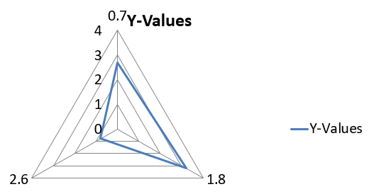

## **Tổng quan**

Bài viết này cung cấp hướng dẫn toàn diện về cách tạo và tùy chỉnh biểu đồ bằng Aspose.Slides cho .NET. Bạn sẽ học cách thêm biểu đồ vào slide một cách lập trình, điền dữ liệu vào và áp dụng các tùy chọn định dạng khác nhau để phù hợp với yêu cầu thiết kế cụ thể của bạn. Trong suốt bài viết, các ví dụ mã chi tiết minh họa từng bước, từ việc khởi tạo presentation và đối tượng biểu đồ đến cấu hình series, trục và legend. Bằng cách làm theo hướng dẫn này, bạn sẽ nắm vững cách tích hợp việc tạo biểu đồ động vào ứng dụng .NET của mình, giúp việc tạo các bản trình bày dựa trên dữ liệu trở nên dễ dàng hơn.

## **Tạo biểu đồ**

Biểu đồ giúp người dùng nhanh chóng hình dung dữ liệu và rút ra những hiểu biết có thể không ngay lập tức hiển thị trong bảng hoặc bảng tính.

**Tại sao nên tạo biểu đồ?**

Sử dụng biểu đồ, bạn có thể:

* tổng hợp, rút gọn hoặc tóm tắt lượng lớn dữ liệu trên một slide trong bản trình bày;
* khám phá các mô hình và xu hướng trong dữ liệu;
* suy ra hướng và đà của dữ liệu theo thời gian hoặc theo một đơn vị đo lường cụ thể;
* phát hiện các giá trị ngoại lệ, sai lệch, lỗi và dữ liệu vô nghĩa;
* truyền đạt hoặc trình bày dữ liệu phức tạp.

Trong PowerPoint, bạn có thể tạo biểu đồ thông qua chức năng *Insert*, cung cấp các mẫu để thiết kế nhiều loại biểu đồ. Sử dụng Aspose.Slides, bạn có thể tạo cả biểu đồ thông thường (dựa trên các loại biểu đồ phổ biến) và biểu đồ tùy chỉnh.

{} 
Sử dụng enumeration [ChartType](https://reference.aspose.com/slides/vi/net/aspose.slides.charts/charttype/) trong không gian tên [Aspose.Slides.Charts](https://reference.aspose.com/slides/vi/net/aspose.slides.charts/). Các giá trị trong enumeration này tương ứng với các loại biểu đồ khác nhau.
{} 

### **Tạo biểu đồ Cột Nhóm**

Phần này giải thích cách tạo biểu đồ cột nhóm bằng Aspose.Slides cho .NET. Bạn sẽ học cách khởi tạo một presentation, thêm biểu đồ và tùy chỉnh các yếu tố như tiêu đề, dữ liệu, series, danh mục và kiểu dáng. Thực hiện các bước dưới đây để xem cách một biểu đồ cột nhóm tiêu chuẩn được tạo ra:

1. Tạo một thể hiện của lớp [Presentation](https://reference.aspose.com/slides/vi/net/aspose.slides/presentation).
1. Lấy tham chiếu đến một slide bằng chỉ mục của nó.
1. Thêm một biểu đồ với một số dữ liệu và chỉ định loại `ChartType.ClusteredColumn`.
1. Thêm tiêu đề cho biểu đồ.
1. Truy cập worksheet dữ liệu của biểu đồ.
1. Xóa tất cả series và danh mục mặc định.
1. Thêm series và danh mục mới.
1. Thêm dữ liệu biểu đồ mới cho series.
1. Áp dụng màu nền cho series biểu đồ.
1. Thêm nhãn cho series biểu đồ.
1. Lưu presentation đã chỉnh sửa dưới dạng tệp PPTX.

Đoạn mã C# này minh họa cách tạo biểu đồ cột nhóm:

```c#
using System.Drawing;
using Aspose.Slides;
using Aspose.Slides.Charts;
using Aspose.Slides.Export;

// Tạo một thể hiện của lớp Presentation.
using (Presentation presentation = new Presentation())
{
    // Truy cập slide đầu tiên.
    ISlide slide = presentation.Slides[0];

    // Thêm một biểu đồ cột nhóm với dữ liệu mặc định của nó.
    IChart chart = slide.Shapes.AddChart(ChartType.ClusteredColumn, 20, 20, 500, 300);

    // Đặt tiêu đề cho biểu đồ.
    chart.ChartTitle.AddTextFrameForOverriding("Sample Title");
    chart.ChartTitle.TextFrameForOverriding.TextFrameFormat.CenterText = NullableBool.True;
    chart.ChartTitle.Height = 20;
    chart.HasTitle = true;

    // Đặt chỉ mục của bảng dữ liệu biểu đồ.
    int worksheetIndex = 0;

    // Lấy workbook dữ liệu biểu đồ.
    IChartDataWorkbook workbook = chart.ChartData.ChartDataWorkbook;

    // Xóa các series và danh mục được tạo mặc định.
    chart.ChartData.Series.Clear();
    chart.ChartData.Categories.Clear();

    // Thêm series mới.
    chart.ChartData.Series.Add(workbook.GetCell(worksheetIndex, 0, 1, "Series 1"), chart.Type);
    chart.ChartData.Series.Add(workbook.GetCell(worksheetIndex, 0, 2, "Series 2"), chart.Type);

    // Thêm danh mục mới.
    chart.ChartData.Categories.Add(workbook.GetCell(worksheetIndex, 1, 0, "Category 1"));
    chart.ChartData.Categories.Add(workbook.GetCell(worksheetIndex, 2, 0, "Category 2"));
    chart.ChartData.Categories.Add(workbook.GetCell(worksheetIndex, 3, 0, "Category 3"));

    // Lấy series biểu đồ đầu tiên.
    IChartSeries series = chart.ChartData.Series[0];

    // Điền dữ liệu cho series.
    series.DataPoints.AddDataPointForBarSeries(workbook.GetCell(worksheetIndex, 1, 1, 20));
    series.DataPoints.AddDataPointForBarSeries(workbook.GetCell(worksheetIndex, 2, 1, 50));
    series.DataPoints.AddDataPointForBarSeries(workbook.GetCell(worksheetIndex, 3, 1, 30));

    // Đặt màu nền cho series.
    series.Format.Fill.FillType = FillType.Solid;
    series.Format.Fill.SolidFillColor.Color = Color.Red;

    // Lấy series biểu đồ thứ hai.
    series = chart.ChartData.Series[1];

    // Điền dữ liệu cho series.
    series.DataPoints.AddDataPointForBarSeries(workbook.GetCell(worksheetIndex, 1, 2, 30));
    series.DataPoints.AddDataPointForBarSeries(workbook.GetCell(worksheetIndex, 2, 2, 10));
    series.DataPoints.AddDataPointForBarSeries(workbook.GetCell(worksheetIndex, 3, 2, 60));

    // Đặt màu nền cho series.
    series.Format.Fill.FillType = FillType.Solid;
    series.Format.Fill.SolidFillColor.Color = Color.Green;

    // Đặt nhãn đầu tiên để hiển thị tên danh mục.
    IDataLabel label = series.DataPoints[0].Label;
    label.DataLabelFormat.ShowCategoryName = true;

    label = series.DataPoints[1].Label;
    label.DataLabelFormat.ShowSeriesName = true;

    // Đặt series để hiển thị giá trị cho nhãn thứ ba.
    label = series.DataPoints[2].Label;
    label.DataLabelFormat.ShowValue = true;
    label.DataLabelFormat.ShowSeriesName = true;
    label.DataLabelFormat.Separator = "/";

    // Lưu presentation vào đĩa dưới dạng tệp PPTX.
    presentation.Save("AsposeChart_out.pptx", SaveFormat.Pptx);
}
```

Kết quả:


### **Tạo biểu đồ Scatter**

Biểu đồ scatter (còn gọi là scatter plot hoặc đồ thị x-y) thường được dùng để kiểm tra các mẫu hoặc chứng minh mối tương quan giữa hai biến.

Sử dụng biểu đồ scatter khi:

* Bạn có dữ liệu số theo cặp.
* Bạn có hai biến liên quan chặt chẽ với nhau.
* Bạn muốn xác định liệu hai biến có liên quan hay không.
* Bạn có một biến độc lập có nhiều giá trị cho một biến phụ thuộc.

Đoạn mã C# này cho thấy cách tạo một biểu đồ scatter với các marker thuộc series khác nhau:

```c#
using Aspose.Slides;
using Aspose.Slides.Charts;
using Aspose.Slides.Export;

// Tạo một thể hiện của lớp Presentation.
using (Presentation presentation = new Presentation())
{
    // Truy cập slide đầu tiên.
    ISlide slide = presentation.Slides[0];

    // Tạo biểu đồ scatter mặc định.
    IChart chart = slide.Shapes.AddChart(ChartType.ScatterWithSmoothLines, 20, 20, 500, 300);

    // Đặt chỉ mục của bảng dữ liệu biểu đồ.
    int worksheetIndex = 0;

    // Lấy workbook dữ liệu biểu đồ.
    IChartDataWorkbook workbook = chart.ChartData.ChartDataWorkbook;

    // Xóa series mặc định.
    chart.ChartData.Series.Clear();

    // Thêm series mới.
    chart.ChartData.Series.Add(workbook.GetCell(worksheetIndex, 1, 1, "Series 1"), chart.Type);
    chart.ChartData.Series.Add(workbook.GetCell(worksheetIndex, 1, 3, "Series 2"), chart.Type);

    // Lấy series biểu đồ đầu tiên.
    IChartSeries series = chart.ChartData.Series[0];

    // Thêm một điểm mới (1:3) vào series.
    series.DataPoints.AddDataPointForScatterSeries(workbook.GetCell(worksheetIndex, 2, 1, 1), workbook.GetCell(worksheetIndex, 2, 2, 3));

    // Thêm một điểm mới (2:10).
    series.DataPoints.AddDataPointForScatterSeries(workbook.GetCell(worksheetIndex, 3, 1, 2), workbook.GetCell(worksheetIndex, 3, 2, 10));

    // Thay đổi kiểu series.
    series.Type = ChartType.ScatterWithStraightLinesAndMarkers;

    // Thay đổi marker của series biểu đồ.
    series.Marker.Size = 10;
    series.Marker.Symbol = MarkerStyleType.Star;

    // Lấy series biểu đồ thứ hai.
    series = chart.ChartData.Series[1];

    // Thêm một điểm mới (5:2) vào series biểu đồ.
    series.DataPoints.AddDataPointForScatterSeries(workbook.GetCell(worksheetIndex, 2, 3, 5), workbook.GetCell(worksheetIndex, 2, 4, 2));

    // Thêm một điểm mới (3:1).
    series.DataPoints.AddDataPointForScatterSeries(workbook.GetCell(worksheetIndex, 3, 3, 3), workbook.GetCell(worksheetIndex, 3, 4, 1));

    // Thêm một điểm mới (2:2).
    series.DataPoints.AddDataPointForScatterSeries(workbook.GetCell(worksheetIndex, 4, 3, 2), workbook.GetCell(worksheetIndex, 4, 4, 2));

    // Thêm một điểm mới (5:1).
    series.DataPoints.AddDataPointForScatterSeries(workbook.GetCell(worksheetIndex, 5, 3, 5), workbook.GetCell(worksheetIndex, 5, 4, 1));

    // Thay đổi marker của series biểu đồ.
    series.Marker.Size = 10;
    series.Marker.Symbol = MarkerStyleType.Circle;

    // Lưu presentation vào đĩa dưới dạng tệp PPTX.
    presentation.Save("AsposeChart_out.pptx", SaveFormat.Pptx);
}
```

Kết quả:


### **Tạo biểu đồ Tròn**

Biểu đồ tròn thích hợp nhất để hiển thị mối quan hệ phần‑to‑toàn trong dữ liệu, đặc biệt khi dữ liệu chứa các nhãn phân loại kèm giá trị số. Tuy nhiên, nếu dữ liệu của bạn có quá nhiều phần hoặc nhãn, bạn có thể xem xét sử dụng biểu đồ cột thay thế.

1. Tạo một thể hiện của lớp [Presentation](https://reference.aspose.com/slides/vi/net/aspose.slides/presentation).
1. Lấy tham chiếu đến một slide bằng chỉ mục của nó.
1. Thêm một biểu đồ với dữ liệu mặc định và chỉ định loại `ChartType.Pie`.
1. Truy cập workbook dữ liệu của biểu đồ ([IChartDataWorkbook](https://reference.aspose.com/slides/vi/net/aspose.slides.charts/ichartdataworkbook/)).
1. Xóa series và danh mục mặc định.
1. Thêm series và danh mục mới.
1. Thêm dữ liệu biểu đồ mới cho series.
1. Thêm các điểm mới cho biểu đồ và áp dụng màu tùy chỉnh cho các sector của biểu đồ tròn.
1. Đặt nhãn cho series.
1. Bật dây dẫn cho nhãn series.
1. Đặt góc xoay cho biểu đồ tròn.
1. Lưu presentation đã chỉnh sửa dưới dạng tệp PPTX.

Đoạn mã C# này cho thấy cách tạo một biểu đồ tròn:

```c#
using System.Drawing;
using Aspose.Slides;
using Aspose.Slides.Charts;
using Aspose.Slides.Export;

// Tạo một thể hiện của lớp Presentation.
using (Presentation presentation = new Presentation())
{
    // Truy cập slide đầu tiên.
    ISlide slide = presentation.Slides[0];

    // Thêm một biểu đồ với dữ liệu mặc định của nó.
    IChart chart = slide.Shapes.AddChart(ChartType.Pie, 20, 20, 500, 300);

    // Đặt tiêu đề cho biểu đồ.
    chart.ChartTitle.AddTextFrameForOverriding("Sample Title");
    chart.ChartTitle.TextFrameForOverriding.TextFrameFormat.CenterText = NullableBool.True;
    chart.ChartTitle.Height = 20;
    chart.HasTitle = true;

    // Đặt series đầu tiên để hiển thị giá trị.
    chart.ChartData.Series[0].Labels.DefaultDataLabelFormat.ShowValue = true;

    // Đặt chỉ mục của bảng dữ liệu biểu đồ.
    int worksheetIndex = 0;

    // Lấy workbook dữ liệu biểu đồ.
    IChartDataWorkbook workbook = chart.ChartData.ChartDataWorkbook;

    // Xóa các series và danh mục được tạo mặc định.
    chart.ChartData.Series.Clear();
    chart.ChartData.Categories.Clear();

    // Thêm danh mục mới.
    chart.ChartData.Categories.Add(workbook.GetCell(0, 1, 0, "1st Qtr"));
    chart.ChartData.Categories.Add(workbook.GetCell(0, 2, 0, "2nd Qtr"));
    chart.ChartData.Categories.Add(workbook.GetCell(0, 3, 0, "3rd Qtr"));

    // Thêm series mới.
    IChartSeries series = chart.ChartData.Series.Add(workbook.GetCell(0, 0, 1, "Series 1"), chart.Type);

    // Điền dữ liệu cho series.
    series.DataPoints.AddDataPointForPieSeries(workbook.GetCell(worksheetIndex, 1, 1, 20));
    series.DataPoints.AddDataPointForPieSeries(workbook.GetCell(worksheetIndex, 2, 1, 50));
    series.DataPoints.AddDataPointForPieSeries(workbook.GetCell(worksheetIndex, 3, 1, 30));

    // Đặt màu cho sector.
    chart.ChartData.SeriesGroups[0].IsColorVaried = true;

    IChartDataPoint point = series.DataPoints[0];
    point.Format.Fill.FillType = FillType.Solid;
    point.Format.Fill.SolidFillColor.Color = Color.Cyan;

    // Đặt viền cho sector.
    point.Format.Line.FillFormat.FillType = FillType.Solid;
    point.Format.Line.FillFormat.SolidFillColor.Color = Color.Gray;
    point.Format.Line.Width = 3.0;
    point.Format.Line.Style = LineStyle.ThinThick;
    point.Format.Line.DashStyle = LineDashStyle.LargeDash;

    IChartDataPoint point1 = series.DataPoints[1];
    point1.Format.Fill.FillType = FillType.Solid;
    point1.Format.Fill.SolidFillColor.Color = Color.Brown;

    // Đặt viền cho sector.
    point1.Format.Line.FillFormat.FillType = FillType.Solid;
    point1.Format.Line.FillFormat.SolidFillColor.Color = Color.Blue;
    point1.Format.Line.Width = 3.0;
    point1.Format.Line.Style = LineStyle.Single;
    point1.Format.Line.DashStyle = LineDashStyle.LargeDashDot;

    IChartDataPoint point2 = series.DataPoints[2];
    point2.Format.Fill.FillType = FillType.Solid;
    point2.Format.Fill.SolidFillColor.Color = Color.Coral;

    // Đặt viền cho sector.
    point2.Format.Line.FillFormat.FillType = FillType.Solid;
    point2.Format.Line.FillFormat.SolidFillColor.Color = Color.Red;
    point2.Format.Line.Width = 2.0;
    point2.Format.Line.Style = LineStyle.ThinThin;
    point2.Format.Line.DashStyle = LineDashStyle.LargeDashDotDot;

    // Tạo nhãn tùy chỉnh cho mỗi danh mục trong series mới.
    IDataLabel label1 = series.DataPoints[0].Label;

    label1.DataLabelFormat.ShowValue = true;

    IDataLabel label2 = series.DataPoints[1].Label;
    label2.DataLabelFormat.ShowValue = true;
    label2.DataLabelFormat.ShowLegendKey = true;
    label2.DataLabelFormat.ShowPercentage = true;

    IDataLabel label3 = series.DataPoints[2].Label;
    label3.DataLabelFormat.ShowSeriesName = true;
    label3.DataLabelFormat.ShowPercentage = true;

    // Đặt series để hiển thị leader lines cho biểu đồ.
    series.Labels.DefaultDataLabelFormat.ShowLeaderLines = true;

    // Đặt góc xoay cho các sector của biểu đồ tròn.
    chart.ChartData.SeriesGroups[0].FirstSliceAngle = 180;

    // Lưu presentation vào đĩa dưới dạng tệp PPTX.
    presentation.Save("PieChart_out.pptx", SaveFormat.Pptx);
}
```

Kết quả:


### **Tạo biểu đồ Đường**

Biểu đồ đường (còn gọi là line graph) thích hợp trong các trường hợp bạn muốn minh họa sự biến đổi giá trị theo thời gian. Sử dụng biểu đồ đường, bạn có thể so sánh một lượng lớn dữ liệu một lúc, theo dõi các thay đổi và xu hướng theo thời gian, làm nổi bật các bất thường trong series dữ liệu, và nhiều hơn nữa.

1. Tạo một thể hiện của lớp [Presentation](https://reference.aspose.com/slides/vi/net/aspose.slides/presentation).
1. Lấy tham chiếu đến một slide bằng chỉ mục của nó.
1. Thêm một biểu đồ với dữ liệu mặc định và chỉ định loại `ChartType.Line`.
1. Truy cập workbook dữ liệu của biểu đồ ([IChartDataWorkbook](https://reference.aspose.com/slides/vi/net/aspose.slides.charts/ichartdataworkbook/)).
1. Xóa series và danh mục mặc định.
1. Thêm series và danh mục mới.
1. Thêm dữ liệu biểu đồ mới cho series.
1. Lưu presentation đã chỉnh sửa dưới dạng tệp PPTX.

Đoạn mã C# này cho thấy cách tạo một biểu đồ đường:

```c#
using Aspose.Slides;
using Aspose.Slides.Charts;
using Aspose.Slides.Export;

using (Presentation presentation = new Presentation())
{
    IChart lineChart = presentation.Slides[0].Shapes.AddChart(ChartType.Line, 20, 20, 500, 300);

    presentation.Save("lineChart.pptx", SaveFormat.Pptx);
}
```

Mặc định, các điểm trên biểu đồ đường được nối bằng các đường thẳng liên tục. Nếu bạn muốn các điểm được nối bằng nét đứt, bạn có thể chỉ định kiểu dash ưa thích như sau:

```c#
using Aspose.Slides;
using Aspose.Slides.Charts;

using (Presentation presentation = new Presentation())
{
    IChart lineChart = presentation.Slides[0].Shapes.AddChart(ChartType.Line, 20, 20, 500, 300);

    foreach (IChartSeries series in lineChart.ChartData.Series)
    {
        series.Format.Line.DashStyle = LineDashStyle.Dash;
    }
}
```

Kết quả:


### **Tạo biểu đồ Cây (Tree Map)**

Biểu đồ cây thích hợp cho dữ liệu bán hàng khi bạn muốn hiển thị kích thước tương đối của các danh mục dữ liệu và nhanh chóng thu hút sự chú ý đến những mục đóng góp lớn trong mỗi danh mục.

1. Tạo một thể hiện của lớp [Presentation](https://reference.aspose.com/slides/vi/net/aspose.slides/presentation).
1. Lấy tham chiếu đến một slide bằng chỉ mục của nó.
1. Thêm một biểu đồ với dữ liệu mặc định và chỉ định loại `ChartType.Treemap`.
1. Truy cập workbook dữ liệu của biểu đồ ([IChartDataWorkbook](https://reference.aspose.com/slides/vi/net/aspose.slides.charts/ichartdataworkbook/)).
1. Xóa series và danh mục mặc định.
1. Thêm series và danh mục mới.
1. Thêm dữ liệu biểu đồ mới cho series.
1. Lưu presentation đã chỉnh sửa dưới dạng tệp PPTX.

Đoạn mã C# này cho thấy cách tạo một biểu đồ cây:

```c#
using Aspose.Slides;
using Aspose.Slides.Charts;
using Aspose.Slides.Export;

using (Presentation presentation = new Presentation())
{
    IChart chart = presentation.Slides[0].Shapes.AddChart(ChartType.Treemap, 20, 20, 500, 300);
    chart.ChartData.Categories.Clear();
    chart.ChartData.Series.Clear();

    IChartDataWorkbook workbook = chart.ChartData.ChartDataWorkbook;
    workbook.Clear(0);

    // Nhánh 1
    IChartCategory leaf = chart.ChartData.Categories.Add(workbook.GetCell(0, "C1", "Leaf1"));
    leaf.GroupingLevels.SetGroupingItem(1, "Stem1");
    leaf.GroupingLevels.SetGroupingItem(2, "Branch1");

    chart.ChartData.Categories.Add(workbook.GetCell(0, "C2", "Leaf2"));

    leaf = chart.ChartData.Categories.Add(workbook.GetCell(0, "C3", "Leaf3"));
    leaf.GroupingLevels.SetGroupingItem(1, "Stem2");

    chart.ChartData.Categories.Add(workbook.GetCell(0, "C4", "Leaf4"));

    // Nhánh 2
    leaf = chart.ChartData.Categories.Add(workbook.GetCell(0, "C5", "Leaf5"));
    leaf.GroupingLevels.SetGroupingItem(1, "Stem3");
    leaf.GroupingLevels.SetGroupingItem(2, "Branch2");

    chart.ChartData.Categories.Add(workbook.GetCell(0, "C6", "Leaf6"));

    leaf = chart.ChartData.Categories.Add(workbook.GetCell(0, "C7", "Leaf7"));
    leaf.GroupingLevels.SetGroupingItem(1, "Stem4");

    chart.ChartData.Categories.Add(workbook.GetCell(0, "C8", "Leaf8"));

    IChartSeries series = chart.ChartData.Series.Add(ChartType.Treemap);
    series.Labels.DefaultDataLabelFormat.ShowCategoryName = true;
    series.DataPoints.AddDataPointForTreemapSeries(workbook.GetCell(0, "D1", 4));
    series.DataPoints.AddDataPointForTreemapSeries(workbook.GetCell(0, "D2", 5));
    series.DataPoints.AddDataPointForTreemapSeries(workbook.GetCell(0, "D3", 3));
    series.DataPoints.AddDataPointForTreemapSeries(workbook.GetCell(0, "D4", 6));
    series.DataPoints.AddDataPointForTreemapSeries(workbook.GetCell(0, "D5", 9));
    series.DataPoints.AddDataPointForTreemapSeries(workbook.GetCell(0, "D6", 9));
    series.DataPoints.AddDataPointForTreemapSeries(workbook.GetCell(0, "D7", 4));
    series.DataPoints.AddDataPointForTreemapSeries(workbook.GetCell(0, "D8", 3));

    series.ParentLabelLayout = ParentLabelLayoutType.Overlapping;

    presentation.Save("Treemap.pptx", SaveFormat.Pptx);
}
```

Kết quả:


### **Tạo biểu đồ Cổ phiếu (Stock)**

Biểu đồ cổ phiếu được sử dụng để hiển thị dữ liệu tài chính như giá mở cửa, cao nhất, thấp nhất và đóng cửa, giúp phân tích xu hướng thị trường và độ biến động. Chúng cung cấp những hiểu biết thiết yếu về hiệu suất cổ phiếu, hỗ trợ nhà đầu tư và nhà phân tích đưa ra quyết định thông minh.

1. Tạo một thể hiện của lớp [Presentation](https://reference.aspose.com/slides/vi/net/aspose.slides/presentation).
1. Lấy tham chiếu đến một slide bằng chỉ mục của nó.
1. Thêm một biểu đồ với dữ liệu mặc định và chỉ định loại `ChartType.OpenHighLowClose`.
1. Truy cập workbook dữ liệu của biểu đồ ([IChartDataWorkbook](https://reference.aspose.com/slides/vi/net/aspose.slides.charts/ichartdataworkbook/)).
1. Xóa series và danh mục mặc định.
1. Thêm series và danh mục mới.
1. Thêm dữ liệu biểu đồ mới cho series.
1. Chỉ định định dạng HiLowLines.
1. Lưu presentation đã chỉnh sửa dưới dạng tệp PPTX.

Đoạn mã C# này cho thấy cách tạo một biểu đồ cổ phiếu:

```c#
using Aspose.Slides;
using Aspose.Slides.Charts;
using Aspose.Slides.Export;

using (Presentation presentation = new Presentation())
{
    IChart chart = presentation.Slides[0].Shapes.AddChart(ChartType.OpenHighLowClose, 20, 20, 500, 300, false);

    IChartDataWorkbook workbook = chart.ChartData.ChartDataWorkbook;

    chart.ChartData.Categories.Add(workbook.GetCell(0, 1, 0, "A"));
    chart.ChartData.Categories.Add(workbook.GetCell(0, 2, 0, "B"));
    chart.ChartData.Categories.Add(workbook.GetCell(0, 3, 0, "C"));

    chart.ChartData.Series.Add(workbook.GetCell(0, 0, 1, "Open"), chart.Type);
    chart.ChartData.Series.Add(workbook.GetCell(0, 0, 2, "High"), chart.Type);
    chart.ChartData.Series.Add(workbook.GetCell(0, 0, 3, "Low"), chart.Type);
    chart.ChartData.Series.Add(workbook.GetCell(0, 0, 4, "Close"), chart.Type);

    IChartSeries series = chart.ChartData.Series[0];
    series.DataPoints.AddDataPointForStockSeries(workbook.GetCell(0, 1, 1, 72));
    series.DataPoints.AddDataPointForStockSeries(workbook.GetCell(0, 2, 1, 25));
    series.DataPoints.AddDataPointForStockSeries(workbook.GetCell(0, 3, 1, 38));

    series = chart.ChartData.Series[1];
    series.DataPoints.AddDataPointForStockSeries(workbook.GetCell(0, 1, 2, 172));
    series.DataPoints.AddDataPointForStockSeries(workbook.GetCell(0, 2, 2, 57));
    series.DataPoints.AddDataPointForStockSeries(workbook.GetCell(0, 3, 2, 57));

    series = chart.ChartData.Series[2];
    series.DataPoints.AddDataPointForStockSeries(workbook.GetCell(0, 1, 3, 12));
    series.DataPoints.AddDataPointForStockSeries(workbook.GetCell(0, 2, 3, 12));
    series.DataPoints.AddDataPointForStockSeries(workbook.GetCell(0, 3, 3, 13));

    series = chart.ChartData.Series[3];
    series.DataPoints.AddDataPointForStockSeries(workbook.GetCell(0, 1, 4, 25));
    series.DataPoints.AddDataPointForStockSeries(workbook.GetCell(0, 2, 4, 38));
    series.DataPoints.AddDataPointForStockSeries(workbook.GetCell(0, 3, 4, 50));

    chart.ChartData.SeriesGroups[0].UpDownBars.HasUpDownBars = true;
    chart.ChartData.SeriesGroups[0].HiLowLinesFormat.Line.FillFormat.FillType = FillType.Solid;

    foreach (IChartSeries ser in chart.ChartData.Series)
    {
        ser.Format.Line.FillFormat.FillType = FillType.NoFill;
    }

    chart.Axes.VerticalAxis.MinorGridLinesFormat.Line.FillFormat.FillType = FillType.NoFill;

    presentation.Save("Stock-chart.pptx", SaveFormat.Pptx);
}
```

Kết quả:


### **Tạo biểu đồ Hộp và Râu (Box and Whisker)**

Biểu đồ hộp và râu được dùng để hiển thị phân phối dữ liệu bằng cách tóm tắt các chỉ số thống kê chính, chẳng hạn như trung vị, các phần tư và các ngoại lệ tiềm năng. Chúng đặc biệt hữu ích trong phân tích dữ liệu thăm dò và các nghiên cứu thống kê để nhanh chóng nắm bắt độ biến thiên của dữ liệu và xác định bất thường.

1. Tạo một thể hiện của lớp [Presentation](https://reference.aspose.com/slides/vi/net/aspose.slides/presentation).
1. Lấy tham chiếu đến một slide bằng chỉ mục của nó.
1. Thêm một biểu đồ với dữ liệu mặc định và chỉ định loại `ChartType.BoxAndWhisker`.
1. Truy cập workbook dữ liệu của biểu đồ ([IChartDataWorkbook](https://reference.aspose.com/slides/vi/net/aspose.slides.charts/ichartdataworkbook/)).
1. Xóa series và danh mục mặc định.
1. Thêm series và danh mục mới.
1. Thêm dữ liệu biểu đồ mới cho series.
1. Lưu presentation đã chỉnh sửa dưới dạng tệp PPTX.

Đoạn mã C# này cho thấy cách tạo một biểu đồ hộp và râu:

```c#
using Aspose.Slides;
using Aspose.Slides.Charts;
using Aspose.Slides.Export;

using (Presentation presentation = new Presentation())
{
    IChart chart = presentation.Slides[0].Shapes.AddChart(ChartType.BoxAndWhisker, 20, 20, 500, 300);
    chart.ChartData.Categories.Clear();
    chart.ChartData.Series.Clear();

    IChartDataWorkbook workbook = chart.ChartData.ChartDataWorkbook;
    workbook.Clear(0);

    chart.ChartData.Categories.Add(workbook.GetCell(0, "A1", "Category 1"));
    chart.ChartData.Categories.Add(workbook.GetCell(0, "A2", "Category 2"));
    chart.ChartData.Categories.Add(workbook.GetCell(0, "A3", "Category 3"));
    chart.ChartData.Categories.Add(workbook.GetCell(0, "A4", "Category 4"));
    chart.ChartData.Categories.Add(workbook.GetCell(0, "A5", "Category 5"));
    chart.ChartData.Categories.Add(workbook.GetCell(0, "A6", "Category 6"));

    IChartSeries series = chart.ChartData.Series.Add(ChartType.BoxAndWhisker);

    series.QuartileMethod = QuartileMethodType.Exclusive;
    series.ShowMeanLine = true;
    series.ShowMeanMarkers = true;
    series.ShowInnerPoints = true;
    series.ShowOutlierPoints = true;

    series.DataPoints.AddDataPointForBoxAndWhiskerSeries(workbook.GetCell(0, "B1", 15));
    series.DataPoints.AddDataPointForBoxAndWhiskerSeries(workbook.GetCell(0, "B2", 41));
    series.DataPoints.AddDataPointForBoxAndWhiskerSeries(workbook.GetCell(0, "B3", 16));
    series.DataPoints.AddDataPointForBoxAndWhiskerSeries(workbook.GetCell(0, "B4", 10));
    series.DataPoints.AddDataPointForBoxAndWhiskerSeries(workbook.GetCell(0, "B5", 23));
    series.DataPoints.AddDataPointForBoxAndWhiskerSeries(workbook.GetCell(0, "B6", 16));

    presentation.Save("BoxAndWhisker.pptx", SaveFormat.Pptx);
}
```

### **Tạo biểu đồ Phễu (Funnel)**

Biểu đồ phễu được dùng để hình dung các quy trình gồm nhiều giai đoạn tuần tự, trong đó khối lượng dữ liệu giảm dần khi tiến tới các bước tiếp theo. Chúng đặc biệt hữu ích để phân tích tỷ lệ chuyển đổi, xác định các nút thắt, và theo dõi hiệu quả của quy trình bán hàng hoặc tiếp thị.

1. Tạo một thể hiện của lớp [Presentation](https://reference.aspose.com/slides/vi/net/aspose.slides/presentation).
1. Lấy tham chiếu đến một slide bằng chỉ mục của nó.
1. Thêm một biểu đồ với dữ liệu mặc định và chỉ định loại `ChartType.Funnel`.
1. Lưu presentation đã chỉnh sửa dưới dạng tệp PPTX.

Đoạn mã C# này cho thấy cách tạo một biểu đồ phễu:

```c#
using Aspose.Slides;
using Aspose.Slides.Charts;
using Aspose.Slides.Export;

using (Presentation presentation = new Presentation("test.pptx"))
{
    IChart chart = presentation.Slides[0].Shapes.AddChart(ChartType.Funnel, 50, 50, 500, 400);
    chart.ChartData.Categories.Clear();
    chart.ChartData.Series.Clear();

    IChartDataWorkbook workbook = chart.ChartData.ChartDataWorkbook;
    workbook.Clear(0);

    chart.ChartData.Categories.Add(workbook.GetCell(0, "A1", "Category 1"));
    chart.ChartData.Categories.Add(workbook.GetCell(0, "A2", "Category 2"));
    chart.ChartData.Categories.Add(workbook.GetCell(0, "A3", "Category 3"));
    chart.ChartData.Categories.Add(workbook.GetCell(0, "A4", "Category 4"));
    chart.ChartData.Categories.Add(workbook.GetCell(0, "A5", "Category 5"));
    chart.ChartData.Categories.Add(workbook.GetCell(0, "A6", "Category 6"));

    IChartSeries series = chart.ChartData.Series.Add(ChartType.Funnel);

    series.DataPoints.AddDataPointForFunnelSeries(workbook.GetCell(0, "B1", 50));
    series.DataPoints.AddDataPointForFunnelSeries(workbook.GetCell(0, "B2", 100));
    series.DataPoints.AddDataPointForFunnelSeries(workbook.GetCell(0, "B3", 200));
    series.DataPoints.AddDataPointForFunnelSeries(workbook.GetCell(0, "B4", 300));
    series.DataPoints.AddDataPointForFunnelSeries(workbook.GetCell(0, "B5", 400));
    series.DataPoints.AddDataPointForFunnelSeries(workbook.GetCell(0, "B6", 500));

    presentation.Save("Funnel.pptx", SaveFormat.Pptx);
}
```

Kết quả:


### **Tạo biểu đồ Mặt trời (Sunburst)**

Biểu đồ mặt trời được dùng để hình dung dữ liệu phân cấp, hiển thị các mức độ dưới dạng các vòng đồng tâm. Chúng giúp minh họa các mối quan hệ phần‑to‑toàn và lý tưởng cho việc đại diện các danh mục và danh mục con lồng nhau một cách rõ ràng, gọn gàng.

1. Tạo một thể hiện của lớp [Presentation](https://reference.aspose.com/slides/vi/net/aspose.slides/presentation).
1. Lấy tham chiếu đến một slide bằng chỉ mục của nó.
1. Thêm một biểu đồ với dữ liệu mặc định và chỉ định loại `ChartType.Sunburst`.
1. Lưu presentation đã chỉnh sửa dưới dạng tệp PPTX.

Đoạn mã C# này cho thấy cách tạo một biểu đồ mặt trời:

```c#
using Aspose.Slides;
using Aspose.Slides.Charts;
using Aspose.Slides.Export;

using (Presentation presentation = new Presentation())
{
    IChart chart = presentation.Slides[0].Shapes.AddChart(ChartType.Sunburst, 20, 20, 500, 300);
    chart.ChartData.Categories.Clear();
    chart.ChartData.Series.Clear();

    IChartDataWorkbook workbook = chart.ChartData.ChartDataWorkbook;
    workbook.Clear(0);

    // Nhánh 1
    IChartCategory leaf = chart.ChartData.Categories.Add(workbook.GetCell(0, "C1", "Leaf1"));
    leaf.GroupingLevels.SetGroupingItem(1, "Stem1");
    leaf.GroupingLevels.SetGroupingItem(2, "Branch1");

    chart.ChartData.Categories.Add(workbook.GetCell(0, "C2", "Leaf2"));

    leaf = chart.ChartData.Categories.Add(workbook.GetCell(0, "C3", "Leaf3"));
    leaf.GroupingLevels.SetGroupingItem(1, "Stem2");

    chart.ChartData.Categories.Add(workbook.GetCell(0, "C4", "Leaf4"));

    // Nhánh 2
    leaf = chart.ChartData.Categories.Add(workbook.GetCell(0, "C5", "Leaf5"));
    leaf.GroupingLevels.SetGroupingItem(1, "Stem3");
    leaf.GroupingLevels.SetGroupingItem(2, "Branch2");

    chart.ChartData.Categories.Add(workbook.GetCell(0, "C6", "Leaf6"));

    leaf = chart.ChartData.Categories.Add(workbook.GetCell(0, "C7", "Leaf7"));
    leaf.GroupingLevels.SetGroupingItem(1, "Stem4");

    chart.ChartData.Categories.Add(workbook.GetCell(0, "C8", "Leaf8"));

    IChartSeries series = chart.ChartData.Series.Add(ChartType.Sunburst);
    series.Labels.DefaultDataLabelFormat.ShowCategoryName = true;
    series.DataPoints.AddDataPointForSunburstSeries(workbook.GetCell(0, "D1", 4));
    series.DataPoints.AddDataPointForSunburstSeries(workbook.GetCell(0, "D2", 5));
    series.DataPoints.AddDataPointForSunburstSeries(workbook.GetCell(0, "D3", 3));
    series.DataPoints.AddDataPointForSunburstSeries(workbook.GetCell(0, "D4", 6));
    series.DataPoints.AddDataPointForSunburstSeries(workbook.GetCell(0, "D5", 9));
    series.DataPoints.AddDataPointForSunburstSeries(workbook.GetCell(0, "D6", 9));
    series.DataPoints.AddDataPointForSunburstSeries(workbook.GetCell(0, "D7", 4));
    series.DataPoints.AddDataPointForSunburstSeries(workbook.GetCell(0, "D8", 3));

    presentation.Save("Sunburst.pptx", SaveFormat.Pptx);
}
```

Kết quả:


### **Tạo biểu đồ Histogram**

Biểu đồ histogram được dùng để biểu thị phân phối của dữ liệu số bằng cách nhóm các giá trị thành các khoảng hoặc bin. Chúng rất hữu ích để xác định các mẫu dữ liệu như tần suất, độ lệch và phân tán, cũng như phát hiện các ngoại lệ trong bộ dữ liệu.

1. Tạo một thể hiện của lớp [Presentation](https://reference.aspose.com/slides/vi/net/aspose.slides/presentation).
1. Lấy tham chiếu đến một slide bằng chỉ mục của nó.
1. Thêm một biểu đồ với một số dữ liệu và chỉ định loại `ChartType.Histogram`.
1. Truy cập workbook dữ liệu của biểu đồ ([IChartDataWorkbook](https://reference.aspose.com/slides/vi/net/aspose.slides.charts/ichartdataworkbook/)).
1. Xóa series và danh mục mặc định.
1. Thêm series và danh mục mới.
1. Lưu presentation đã chỉnh sửa dưới dạng tệp PPTX.

Đoạn mã C# này cho thấy cách tạo một biểu đồ histogram:

```c#
using Aspose.Slides;
using Aspose.Slides.Charts;
using Aspose.Slides.Export;

using (Presentation presentation = new Presentation())
{
    IChart chart = presentation.Slides[0].Shapes.AddChart(ChartType.Histogram, 20, 20, 500, 300);
    chart.ChartData.Categories.Clear();
    chart.ChartData.Series.Clear();

    IChartDataWorkbook workbook = chart.ChartData.ChartDataWorkbook;
    workbook.Clear(0);

    IChartSeries series = chart.ChartData.Series.Add(ChartType.Histogram);
    series.DataPoints.AddDataPointForHistogramSeries(workbook.GetCell(0, "A1", 15));
    series.DataPoints.AddDataPointForHistogramSeries(workbook.GetCell(0, "A2", -41));
    series.DataPoints.AddDataPointForHistogramSeries(workbook.GetCell(0, "A3", 16));
    series.DataPoints.AddDataPointForHistogramSeries(workbook.GetCell(0, "A4", 10));
    series.DataPoints.AddDataPointForHistogramSeries(workbook.GetCell(0, "A5", -23));
    series.DataPoints.AddDataPointForHistogramSeries(workbook.GetCell(0, "A6", 16));

    chart.Axes.HorizontalAxis.AggregationType = AxisAggregationType.Automatic;

    presentation.Save("Histogram.pptx", SaveFormat.Pptx);
}
```

Kết quả:


### **Tạo biểu đồ Radar**

Biểu đồ radar được dùng để hiển thị dữ liệu đa biến trong một định dạng hai chiều, cho phép so sánh dễ dàng nhiều biến cùng lúc. Chúng đặc biệt hữu ích để xác định các mẫu, điểm mạnh và điểm yếu trên nhiều chỉ số hiệu suất hoặc thuộc tính.

1. Tạo một thể hiện của lớp [Presentation](https://reference.aspose.com/slides/vi/net/aspose.slides/presentation).
1. Lấy tham chiếu đến một slide bằng chỉ mục của nó.
1. Thêm một biểu đồ với một số dữ liệu và chỉ định loại `ChartType.Radar`.
1. Lưu presentation đã chỉnh sửa dưới dạng tệp PPTX.

Đoạn mã C# này cho thấy cách tạo một biểu đồ radar:

```c#
using Aspose.Slides;
using Aspose.Slides.Charts;
using Aspose.Slides.Export;

using (Presentation presentation = new Presentation())
{
    presentation.Slides[0].Shapes.AddChart(ChartType.Radar, 20, 20, 500, 300);
    presentation.Save("Radar-chart.pptx", SaveFormat.Pptx);
}
```

Kết quả:



### **Tạo biểu đồ Đa Danh Mục (Multi-Category)**

Biểu đồ đa danh mục được dùng để hiển thị dữ liệu có hơn một nhóm danh mục, cho phép bạn so sánh giá trị qua nhiều chiều đồng thời. Chúng rất hữu ích khi bạn cần phân tích xu hướng và mối quan hệ trong các bộ dữ liệu phức tạp, nhiều lớp.

1. Tạo một thể hiện của lớp [Presentation](https://reference.aspose.com/slides/vi/net/aspose.slides/presentation).
1. Lấy tham chiếu đến một slide bằng chỉ mục của nó.
1. Thêm một biểu đồ với dữ liệu mặc định và chỉ định loại `ChartType.ClusteredColumn`.
1. Truy cập workbook dữ liệu của biểu đồ ([IChartDataWorkbook](https://reference.aspose.com/slides/vi/net/aspose.slides.charts/ichartdataworkbook/)).
1. Xóa series và danh mục mặc định.
1. Thêm series và danh mục mới.
1. Thêm dữ liệu biểu đồ mới cho series.
1. Lưu presentation đã chỉnh sửa dưới dạng tệp PPTX.

Đoạn mã C# này cho thấy cách tạo một biểu đồ đa danh mục:

```c#
using Aspose.Slides;
using Aspose.Slides.Charts;
using Aspose.Slides.Export;

using (Presentation presentation = new Presentation())
{
    ISlide slide = presentation.Slides[0];

    IChart chart = presentation.Slides[0].Shapes.AddChart(ChartType.ClusteredColumn, 20, 20, 500, 300);
    chart.ChartData.Series.Clear();
    chart.ChartData.Categories.Clear();

    IChartDataWorkbook workbook = chart.ChartData.ChartDataWorkbook;
    workbook.Clear(0);

    int worksheetIndex = 0;

    IChartCategory category = chart.ChartData.Categories.Add(workbook.GetCell(0, "c2", "A"));
    category.GroupingLevels.SetGroupingItem(1, "Group1");
    category = chart.ChartData.Categories.Add(workbook.GetCell(0, "c3", "B"));

    category = chart.ChartData.Categories.Add(workbook.GetCell(0, "c4", "C"));
    category.GroupingLevels.SetGroupingItem(1, "Group2");
    category = chart.ChartData.Categories.Add(workbook.GetCell(0, "c5", "D"));

    category = chart.ChartData.Categories.Add(workbook.GetCell(0, "c6", "E"));
    category.GroupingLevels.SetGroupingItem(1, "Group3");
    category = chart.ChartData.Categories.Add(workbook.GetCell(0, "c7", "F"));

    category = chart.ChartData.Categories.Add(workbook.GetCell(0, "c8", "G"));
    category.GroupingLevels.SetGroupingItem(1, "Group4");
    category = chart.ChartData.Categories.Add(workbook.GetCell(0, "c9", "H"));

    // Thêm một series.
    IChartSeries series = chart.ChartData.Series.Add(workbook.GetCell(0, "D1", "Series 1"), ChartType.ClusteredColumn);

    series.DataPoints.AddDataPointForBarSeries(workbook.GetCell(worksheetIndex, "D2", 10));
    series.DataPoints.AddDataPointForBarSeries(workbook.GetCell(worksheetIndex, "D3", 20));
    series.DataPoints.AddDataPointForBarSeries(workbook.GetCell(worksheetIndex, "D4", 30));
    series.DataPoints.AddDataPointForBarSeries(workbook.GetCell(worksheetIndex, "D5", 40));
    series.DataPoints.AddDataPointForBarSeries(workbook.GetCell(worksheetIndex, "D6", 50));
    series.DataPoints.AddDataPointForBarSeries(workbook.GetCell(worksheetIndex, "D7", 60));
    series.DataPoints.AddDataPointForBarSeries(workbook.GetCell(worksheetIndex, "D8", 70));
    series.DataPoints.AddDataPointForBarSeries(workbook.GetCell(worksheetIndex, "D9", 80));

    // Lưu bản trình bày kèm biểu đồ.
    presentation.Save("AsposeChart_out.pptx", SaveFormat.Pptx);
}
```

Kết quả:


### **Tạo biểu đồ Bản đồ (Map)**

Biểu đồ bản đồ được dùng để hình dung dữ liệu địa lý bằng cách gán thông tin tới các vị trí cụ thể như quốc gia, tiểu bang hoặc thành phố. Chúng đặc biệt hữu ích để phân tích xu hướng khu vực, dữ liệu nhân khẩu và phân bố không gian một cách rõ ràng, hấp dẫn.

Đoạn mã C# này cho thấy cách tạo một biểu đồ bản đồ:

```c#
using Aspose.Slides;
using Aspose.Slides.Charts;
using Aspose.Slides.Export;

using (Presentation presentation = new Presentation())
{
    IChart chart = presentation.Slides[0].Shapes.AddChart(ChartType.Map, 20, 20, 500, 300);
    presentation.Save("mapChart.pptx", SaveFormat.Pptx);
}
```

Kết quả:


{} 
Hình trên cho thấy presentation đã lưu được mở trong PowerPoint. Aspose.Slides ghi đúng biểu đồ bản đồ và dữ liệu của nó, nhưng không tự vẽ biểu đồ bản đồ: khi một slide chứa biểu đồ này được render thành hình ảnh hoặc chuyển đổi sang PDF hoặc SVG, khu vực biểu đồ sẽ trống. Các hình dạng khác trên cùng slide không bị ảnh hưởng.
{} 

### **Tạo biểu đồ Kết hợp (Combination)**

Biểu đồ kết hợp (hoặc combo chart) kết hợp hai hoặc nhiều loại biểu đồ trong một đồ thị duy nhất. Biểu đồ này cho phép bạn làm nổi bật, so sánh hoặc kiểm tra sự khác nhau giữa hai hoặc nhiều bộ dữ liệu, giúp xác định mối quan hệ giữa chúng.


Đoạn mã C# sau đây cho thấy cách tạo biểu đồ kết hợp như trên trong một presentation PowerPoint:

```c#
using System.Drawing;
using Aspose.Slides;
using Aspose.Slides.Charts;
using Aspose.Slides.Export;

private static void CreateComboChart()
{
    using (Presentation presentation = new Presentation())
    {
        IChart chart = CreateChartWithFirstSeries(presentation.Slides[0]);

        AddSecondSeriesToChart(chart);
        AddThirdSeriesToChart(chart);

        SetPrimaryAxesFormat(chart);
        SetSecondaryAxesFormat(chart);

        presentation.Save("combo-chart.pptx", SaveFormat.Pptx);
    }
}

private static IChart CreateChartWithFirstSeries(ISlide slide)
{
    IChart chart = slide.Shapes.AddChart(ChartType.ClusteredColumn, 50, 50, 600, 400);

    // Đặt tiêu đề cho biểu đồ
    chart.HasTitle = true;
    chart.ChartTitle.AddTextFrameForOverriding("Chart Title");
    chart.ChartTitle.Overlay = false;
    IPortionFormat portionFormat = 
       chart.ChartTitle.TextFrameForOverriding.Paragraphs[0].ParagraphFormat.DefaultPortionFormat;
    portionFormat.FontBold = NullableBool.False;
    portionFormat.FontHeight = 18f;

    // Đặt chú giải cho biểu đồ
    chart.Legend.Position = LegendPositionType.Bottom;
    chart.Legend.TextFormat.PortionFormat.FontHeight = 12f;

    // Xóa series và danh mục được tạo mặc định
    chart.ChartData.Series.Clear();
    chart.ChartData.Categories.Clear();

    int worksheetIndex = 0;
    IChartDataWorkbook workbook = chart.ChartData.ChartDataWorkbook;

    // Thêm danh mục mới
    chart.ChartData.Categories.Add(workbook.GetCell(worksheetIndex, 1, 0, "Category 1"));
    chart.ChartData.Categories.Add(workbook.GetCell(worksheetIndex, 2, 0, "Category 2"));
    chart.ChartData.Categories.Add(workbook.GetCell(worksheetIndex, 3, 0, "Category 3"));
    chart.ChartData.Categories.Add(workbook.GetCell(worksheetIndex, 4, 0, "Category 4"));

    // Thêm series đầu tiên
    IChartSeries series = chart.ChartData.Series.Add(
        workbook.GetCell(worksheetIndex, 0, 1, "Series 1"), chart.Type);

    series.ParentSeriesGroup.Overlap = -25;
    series.ParentSeriesGroup.GapWidth = 220;

    series.DataPoints.AddDataPointForBarSeries(workbook.GetCell(worksheetIndex, 1, 1, 4.3));
    series.DataPoints.AddDataPointForBarSeries(workbook.GetCell(worksheetIndex, 2, 1, 2.5));
    series.DataPoints.AddDataPointForBarSeries(workbook.GetCell(worksheetIndex, 3, 1, 3.5));
    series.DataPoints.AddDataPointForBarSeries(workbook.GetCell(worksheetIndex, 4, 1, 4.5));

    return chart;
}

private static void AddSecondSeriesToChart(IChart chart)
{
    IChartDataWorkbook workbook = chart.ChartData.ChartDataWorkbook;
    const int worksheetIndex = 0;

    IChartSeries series = chart.ChartData.Series.Add(
        workbook.GetCell(worksheetIndex, 0, 2, "Series 2"), ChartType.ClusteredColumn);

    series.ParentSeriesGroup.Overlap = -25;
    series.ParentSeriesGroup.GapWidth = 220;

    series.DataPoints.AddDataPointForBarSeries(workbook.GetCell(worksheetIndex, 1, 2, 2.4));
    series.DataPoints.AddDataPointForBarSeries(workbook.GetCell(worksheetIndex, 2, 2, 4.4));
    series.DataPoints.AddDataPointForBarSeries(workbook.GetCell(worksheetIndex, 3, 2, 1.8));
    series.DataPoints.AddDataPointForBarSeries(workbook.GetCell(worksheetIndex, 4, 2, 2.8));
}

private static void AddThirdSeriesToChart(IChart chart)
{
    IChartDataWorkbook workbook = chart.ChartData.ChartDataWorkbook;
    const int worksheetIndex = 0;

    IChartSeries series = chart.ChartData.Series.Add(
        workbook.GetCell(worksheetIndex, 0, 3, "Series 3"), ChartType.Line);

    series.DataPoints.AddDataPointForLineSeries(workbook.GetCell(worksheetIndex, 1, 3, 2.0));
    series.DataPoints.AddDataPointForLineSeries(workbook.GetCell(worksheetIndex, 2, 3, 2.0));
    series.DataPoints.AddDataPointForLineSeries(workbook.GetCell(worksheetIndex, 3, 3, 3.0));
    series.DataPoints.AddDataPointForLineSeries(workbook.GetCell(worksheetIndex, 4, 3, 5.0));

    series.PlotOnSecondAxis = true;
}

private static void SetPrimaryAxesFormat(IChart chart)
{
    // Đặt trục ngang
    IAxis horizontalAxis = chart.Axes.HorizontalAxis;
    horizontalAxis.TextFormat.PortionFormat.FontHeight = 12f;
    horizontalAxis.Format.Line.FillFormat.FillType = FillType.NoFill;

    SetAxisTitle(horizontalAxis, "X Axis");

    // Đặt trục dọc
    IAxis verticalAxis = chart.Axes.VerticalAxis;
    verticalAxis.TextFormat.PortionFormat.FontHeight = 12f;
    verticalAxis.Format.Line.FillFormat.FillType = FillType.NoFill;

    SetAxisTitle(verticalAxis, "Y Axis 1");

    // Đặt màu cho lưới chính dọc
    ILineFillFormat majorGridLinesFormat = verticalAxis.MajorGridLinesFormat.Line.FillFormat;
    majorGridLinesFormat.FillType = FillType.Solid;
    majorGridLinesFormat.SolidFillColor.Color = Color.FromArgb(217, 217, 217);
}

private static void SetSecondaryAxesFormat(IChart chart)
{
    // Đặt trục ngang phụ
    IAxis secondaryHorizontalAxis = chart.Axes.SecondaryHorizontalAxis;
    secondaryHorizontalAxis.Position = AxisPositionType.Bottom;
    secondaryHorizontalAxis.CrossType = CrossesType.Maximum;
    secondaryHorizontalAxis.IsVisible = false;
    secondaryHorizontalAxis.MajorGridLinesFormat.Line.FillFormat.FillType = FillType.NoFill;
    secondaryHorizontalAxis.MinorGridLinesFormat.Line.FillFormat.FillType = FillType.NoFill;

    // Đặt trục dọc phụ
    IAxis secondaryVerticalAxis = chart.Axes.SecondaryVerticalAxis;
    secondaryVerticalAxis.Position = AxisPositionType.Right;
    secondaryVerticalAxis.TextFormat.PortionFormat.FontHeight = 12f;
    secondaryVerticalAxis.Format.Line.FillFormat.FillType = FillType.NoFill;
    secondaryVerticalAxis.MajorGridLinesFormat.Line.FillFormat.FillType = FillType.NoFill;
    secondaryVerticalAxis.MinorGridLinesFormat.Line.FillFormat.FillType = FillType.NoFill;

    SetAxisTitle(secondaryVerticalAxis, "Y Axis 2");
}

private static void SetAxisTitle(IAxis axis, string axisTitle)
{
    axis.HasTitle = true;
    axis.Title.Overlay = false;
    IPortionFormat titlePortionFormat =
        axis.Title.AddTextFrameForOverriding(axisTitle).Paragraphs[0].ParagraphFormat.DefaultPortionFormat;
    titlePortionFormat.FontBold = NullableBool.False;
    titlePortionFormat.FontHeight = 12f;
}
```

## **Cập nhật biểu đồ**

Aspose.Slides cho .NET cho phép bạn cập nhật các biểu đồ PowerPoint bằng cách sửa đổi dữ liệu, định dạng và kiểu dáng biểu đồ. Tính năng này đơn giản hoá quá trình giữ cho các bản trình bày luôn cập nhật với nội dung động và đảm bảo biểu đồ phản ánh chính xác dữ liệu hiện tại và tiêu chuẩn hình ảnh.

1. Khởi tạo lớp [Presentation](https://reference.aspose.com/slides/vi/net/aspose.slides/presentation) đại diện cho presentation chứa biểu đồ.
1. Lấy tham chiếu đến một slide bằng chỉ mục của nó.
1. Duyệt qua tất cả các shape để tìm biểu đồ.
1. Truy cập worksheet dữ liệu của biểu đồ.
1. Sửa đổi series dữ liệu biểu đồ bằng cách thay đổi giá trị series.
1. Thêm một series mới và điền dữ liệu cho nó.
1. Lưu presentation đã chỉnh sửa dưới dạng tệp PPTX.

Đoạn mã C# này cho thấy cách cập nhật một biểu đồ:

```c#
using Aspose.Slides;
using Aspose.Slides.Charts;
using Aspose.Slides.Export;

const string chartName = "My chart";

// Khởi tạo lớp Presentation đại diện cho tệp PPTX.
using (Presentation presentation = new Presentation("ExistingChart.pptx"))
{
    // Truy cập slide đầu tiên.
    ISlide slide = presentation.Slides[0];

    foreach (IShape shape in slide.Shapes)
    {
        if (shape is IChart chart && chart.Name == chartName)
        {
            // Đặt chỉ mục của bảng dữ liệu biểu đồ.
            int worksheetIndex = 0;

            // Lấy workbook dữ liệu biểu đồ.
            IChartDataWorkbook workbook = chart.ChartData.ChartDataWorkbook;

            // Thay đổi tên các danh mục của biểu đồ.
            workbook.GetCell(worksheetIndex, 1, 0, "Modified Category 1");
            workbook.GetCell(worksheetIndex, 2, 0, "Modified Category 2");

            // Lấy series đầu tiên của biểu đồ.
            IChartSeries series = chart.ChartData.Series[0];

            // Cập nhật dữ liệu cho series.
            workbook.GetCell(worksheetIndex, 0, 1, "New_Series 1"); // Sửa đổi tên series.
            series.DataPoints[0].Value.Data = 90;
            series.DataPoints[1].Value.Data = 123;
            series.DataPoints[2].Value.Data = 44;

            // Lấy series thứ hai của biểu đồ.
            series = chart.ChartData.Series[1];

            // Cập nhật dữ liệu cho series.
            workbook.GetCell(worksheetIndex, 0, 2, "New_Series 2"); // Sửa đổi tên series.
            series.DataPoints[0].Value.Data = 23;
            series.DataPoints[1].Value.Data = 67;
            series.DataPoints[2].Value.Data = 99;

            // Thêm một series mới.
            series = chart.ChartData.Series.Add(workbook.GetCell(worksheetIndex, 0, 3, "Series 3"), chart.Type);

            // Điền dữ liệu cho series.
            series.DataPoints.AddDataPointForBarSeries(workbook.GetCell(worksheetIndex, 1, 3, 20));
            series.DataPoints.AddDataPointForBarSeries(workbook.GetCell(worksheetIndex, 2, 3, 50));
            series.DataPoints.AddDataPointForBarSeries(workbook.GetCell(worksheetIndex, 3, 3, 30));

            chart.Type = ChartType.ClusteredCylinder;
        }
    }

    // Lưu presentation kèm biểu đồ.
    presentation.Save("AsposeChartModified_out.pptx", SaveFormat.Pptx);
}
```

## **Đặt phạm vi dữ liệu cho biểu đồ**

Aspose.Slides cho .NET cung cấp khả năng định nghĩa một phạm vi dữ liệu cụ thể từ worksheet làm nguồn dữ liệu cho biểu đồ. Điều này có nghĩa là bạn có thể ánh xạ trực tiếp một phần của worksheet vào biểu đồ, cho phép kiểm soát các ô nào đóng góp vào series và danh mục của biểu đồ. Kết quả, bạn có thể dễ dàng cập nhật và đồng bộ biểu đồ với các thay đổi dữ liệu mới nhất trong worksheet, đảm bảo các bản trình bày PowerPoint của bạn phản ánh thông tin hiện tại và chính xác.

1. Khởi tạo lớp [Presentation](https://reference.aspose.com/slides/vi/net/aspose.slides/presentation) đại diện cho presentation chứa biểu đồ.
1. Lấy tham chiếu đến một slide bằng chỉ mục của nó.
1. Duyệt qua tất cả các shape để tìm biểu đồ.
1. Truy cập dữ liệu biểu đồ và đặt phạm vi.
1. Lưu presentation đã chỉnh sửa dưới dạng tệp PPTX.

Đoạn mã C# này cho thấy cách đặt phạm vi dữ liệu cho một biểu đồ:

```c#
using Aspose.Slides;
using Aspose.Slides.Charts;
using Aspose.Slides.Export;

const string chartName = "My chart";

// Khởi tạo lớp Presentation đại diện cho tệp PPTX.
using (Presentation presentation = new Presentation("ExistingChart.pptx"))
{
    // Truy cập slide đầu tiên.
    ISlide slide = presentation.Slides[0];

    foreach (IShape shape in slide.Shapes)
    {
        if (shape is IChart chart && chart.Name == chartName)
        {
            chart.ChartData.SetRange("Sheet1!A1:B4");
        }
    }

    presentation.Save("SetDataRange_out.pptx", SaveFormat.Pptx);
}
```

## **Sử dụng marker mặc định trong biểu đồ**

Khi bạn sử dụng marker mặc định trong biểu đồ, mỗi series sẽ tự động nhận một ký hiệu marker mặc định khác nhau.

Đoạn mã C# này cho thấy cách tự động đặt marker cho một series biểu đồ:

```c#
using Aspose.Slides;
using Aspose.Slides.Charts;
using Aspose.Slides.Export;

using (Presentation presentation = new Presentation())
{
    ISlide slide = presentation.Slides[0];
    IChart chart = slide.Shapes.AddChart(ChartType.LineWithMarkers, 10, 10, 400, 400);

    chart.ChartData.Series.Clear();
    chart.ChartData.Categories.Clear();

    IChartDataWorkbook workbook = chart.ChartData.ChartDataWorkbook;

    IChartSeries series = chart.ChartData.Series.Add(workbook.GetCell(0, 0, 1, "Series 1"), chart.Type);

    chart.ChartData.Categories.Add(workbook.GetCell(0, 1, 0, "C1"));
    series.DataPoints.AddDataPointForLineSeries(workbook.GetCell(0, 1, 1, 24));

    chart.ChartData.Categories.Add(workbook.GetCell(0, 2, 0, "C2"));
    series.DataPoints.AddDataPointForLineSeries(workbook.GetCell(0, 2, 1, 23));

    chart.ChartData.Categories.Add(workbook.GetCell(0, 3, 0, "C3"));
    series.DataPoints.AddDataPointForLineSeries(workbook.GetCell(0, 3, 1, -10));

    chart.ChartData.Categories.Add(workbook.GetCell(0, 4, 0, "C4"));
    series.DataPoints.AddDataPointForLineSeries(workbook.GetCell(0, 4, 1, null));

    IChartSeries series2 = chart.ChartData.Series.Add(workbook.GetCell(0, 0, 2, "Series 2"), chart.Type);

    // Điền dữ liệu cho series.
    series2.DataPoints.AddDataPointForLineSeries(workbook.GetCell(0, 1, 2, 30));
    series2.DataPoints.AddDataPointForLineSeries(workbook.GetCell(0, 2, 2, 10));
    series2.DataPoints.AddDataPointForLineSeries(workbook.GetCell(0, 3, 2, 60));
    series2.DataPoints.AddDataPointForLineSeries(workbook.GetCell(0, 4, 2, 40));

    chart.HasLegend = true;
    chart.Legend.Overlay = false;

    presentation.Save("DefaultMarkersInChart.pptx", SaveFormat.Pptx);
}
```

## **Câu hỏi thường gặp**

**Các loại biểu đồ nào được hỗ trợ bởi Aspose.Slides cho .NET?**

Aspose.Slides cho .NET hỗ trợ nhiều loại biểu đồ, bao gồm thanh, đường, tròn, khu vực, scatter, histogram, radar và nhiều loại khác. Sự linh hoạt này cho phép bạn chọn loại biểu đồ phù hợp nhất cho nhu cầu trực quan hoá dữ liệu của mình.

**Làm thế nào để thêm một biểu đồ mới vào slide?**

Để thêm biểu đồ, trước tiên bạn tạo một thể hiện của lớp [Presentation](https://reference.aspose.com/slides/vi/net/aspose.slides/presentation), lấy slide mong muốn bằng chỉ mục, sau đó gọi phương thức thêm biểu đồ, chỉ định loại biểu đồ và dữ liệu khởi tạo. Quy trình này tích hợp biểu đồ trực tiếp vào presentation của bạn.

**Làm sao tôi có thể cập nhật dữ liệu hiển thị trong biểu đồ?**

Bạn có thể cập nhật dữ liệu của biểu đồ bằng cách truy cập workbook dữ liệu của nó ([IChartDataWorkbook](https://reference.aspose.com/slides/vi/net/aspose.slides.charts/ichartdataworkbook/)), xóa bất kỳ series và danh mục mặc định nào, rồi thêm dữ liệu tùy chỉnh của bạn. Điều này cho phép bạn làm mới biểu đồ một cách lập trình để phản ánh dữ liệu mới nhất.

**Có thể tùy chỉnh giao diện của biểu đồ không?**

Có, Aspose.Slides cho .NET cung cấp nhiều tùy chọn tùy chỉnh. Bạn có thể thay đổi màu sắc, phông chữ, nhãn, legend và các yếu tố định dạng khác để điều chỉnh giao diện biểu đồ phù hợp với yêu cầu thiết kế của mình.