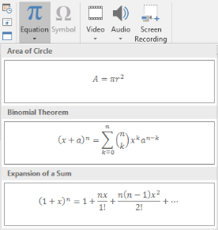

## **Tổng quan**

PowerPoint lưu các phương trình dưới dạng Office Math Markup Language (OMML). Với Aspose.Slides cho .NET, bạn có thể tạo cùng loại nội dung toán học một cách lập trình: phân số, căn bậc, hàm, giới hạn, toán tử N-ary, ma trận, mảng và các khối toán học được định dạng.

Trong PowerPoint, người dùng thường thêm phương trình từ **Insert > Equation**:



Kết quả là văn bản toán học có thể chỉnh sửa trên slide:


Aspose.Slides xây dựng văn bản toán học này qua ba đối tượng chính:

- Một hình dạng toán học, được tạo bằng [AddMathShape](https://reference.aspose.com/slides/vi/net/aspose.slides/ishapecollection/addmathshape/), là hình chứa phương trình.
- [MathPortion](https://reference.aspose.com/slides/vi/net/aspose.slides.mathtext/mathportion/) lưu nội dung toán học bên trong khung văn bản của hình.
- [MathParagraph](https://reference.aspose.com/slides/vi/net/aspose.slides.mathtext/mathparagraph/) chứa một hoặc nhiều đối tượng [MathBlock](https://reference.aspose.com/slides/vi/net/aspose.slides.mathtext/mathblock/).

Hầu hết các ví dụ bên dưới sử dụng [MathematicalText](https://reference.aspose.com/slides/vi/net/aspose.slides.mathtext/mathematicaltext/) và các phương thức fluent từ [IMathElement](https://reference.aspose.com/slides/vi/net/aspose.slides.mathtext/imathelement/) để giữ cho mã ngắn gọn và dễ đọc.

Đối với các kịch bản xuất MathML, xem [Export Math Equations from Presentations in .NET](/slides/vi/net/exporting-math-equations/).

## **Tạo một Phương trình**

Ví dụ này tạo một hình dạng toán học và thêm định lý Pythagoras:


```csharp
using var presentation = new Presentation();
var slide = presentation.Slides[0];

var mathShape = slide.Shapes.AddMathShape(20, 20, 700, 120);
var mathParagraph = ((MathPortion)mathShape.TextFrame.Paragraphs[0].Portions[0]).MathParagraph;

var equation = new MathematicalText("c")
    .SetSuperscript("2")
    .Join("=")
    .Join(new MathematicalText("a").SetSuperscript("2"))
    .Join("+")
    .Join(new MathematicalText("b").SetSuperscript("2"));

mathParagraph.Add(equation);

presentation.Save("pythagorean-theorem.pptx", SaveFormat.Pptx);
```

{}

`AddMathShape` tạo một hình có sẵn một đoạn MathParagraph. Truy cập `MathPortion` đầu tiên, lấy `MathParagraph` của nó và thêm các MathBlock hoặc MathElement vào đó.

{}

## **Thêm Phân số**

Sử dụng `Divide` để tạo một phân số. Bạn có thể chọn kiểu phân số bằng [MathFractionTypes](https://reference.aspose.com/slides/vi/net/aspose.slides.mathtext/mathfractiontypes/).


```csharp
using var presentation = new Presentation();
var slide = presentation.Slides[0];

var mathShape = slide.Shapes.AddMathShape(20, 20, 700, 100);
var mathParagraph = ((MathPortion)mathShape.TextFrame.Paragraphs[0].Portions[0]).MathParagraph;

var fraction = new MathematicalText("1")
    .Divide("x", MathFractionTypes.Skewed);

mathParagraph.Add(new MathBlock(fraction));

presentation.Save("fraction.pptx", SaveFormat.Pptx);
```

Đối với phân số chồng, sử dụng `MathFractionTypes.Bar`:

```csharp
var stackedFraction = new MathematicalText("x + 1").Divide("y - 1", MathFractionTypes.Bar);
```

## **Thêm Căn bậc**

Sử dụng `Radical` để tạo căn bậc hai, căn bậc ba hoặc các căn bậc khác. Phần tử hiện tại trở thành cơ sở, và đối số trở thành bậc.


```csharp
using var presentation = new Presentation();
var slide = presentation.Slides[0];

var mathShape = slide.Shapes.AddMathShape(20, 20, 700, 100);
var mathParagraph = ((MathPortion)mathShape.TextFrame.Paragraphs[0].Portions[0]).MathParagraph;

var radical = new MathematicalText("x")
    .Radical("n");

mathParagraph.Add(new MathBlock(radical));

presentation.Save("radical.pptx", SaveFormat.Pptx);
```

## **Thêm Hàm và Giới hạn**

Sử dụng `AsArgumentOfFunction` hoặc `Function` cho các hàm như `sin(x)`, `log(x)`, hoặc tên hàm tùy chỉnh. Đối với giới hạn, đặt `lim` trong một [MathLimit](https://reference.aspose.com/slides/vi/net/aspose.slides.mathtext/mathlimit/) hoặc sử dụng `SetLowerLimit`.


```csharp
using var presentation = new Presentation();
var slide = presentation.Slides[0];

var mathShape = slide.Shapes.AddMathShape(20, 20, 700, 100);
var mathParagraph = ((MathPortion)mathShape.TextFrame.Paragraphs[0].Portions[0]).MathParagraph;

var limit = new MathematicalText("lim")
    .SetLowerLimit("x→∞")
    .Function("x");

mathParagraph.Add(new MathBlock(limit));

presentation.Save("functions-and-limits.pptx", SaveFormat.Pptx);
```

Đối với tên hàm tùy chỉnh, làm tên hàm thành phần tử hiện tại:

```csharp
var customFunction = new MathematicalText("f").Function("x + 1");
```

## **Thêm Toán tử N-ary và Tích phân**

Sử dụng `Nary` cho tổng, hợp, giao và các toán tử lớn khác. Sử dụng `Integral` cho tích phân. Cả hai phương thức đều cho phép bạn đặt giới hạn dưới và trên.


```csharp
using var presentation = new Presentation();
var slide = presentation.Slides[0];

var mathShape = slide.Shapes.AddMathShape(20, 20, 700, 120);
var mathParagraph = ((MathPortion)mathShape.TextFrame.Paragraphs[0].Portions[0]).MathParagraph;

var summationBase = new MathematicalText("x")
    .SetSuperscript("k")
    .Join(new MathematicalText("a").SetSuperscript("n-k"));

var summation = summationBase.Nary(MathNaryOperatorTypes.Summation, "k=0", "n");

mathParagraph.Add(new MathBlock(summation));

presentation.Save("nary-operators.pptx", SaveFormat.Pptx);
```

Toán tử N-ary dành cho các toán tử lớn có thể có giới hạn tùy chọn. Các toán tử đơn giản như `+`, `-`, và `=` thường được thêm dưới dạng `MathematicalText` và nối vào biểu thức.

Đối với một tích phân, sử dụng `Integral`:

```csharp
var integralBase = new MathematicalText("x").Join(new MathematicalText("dx").ToBox());
var integral = integralBase.Integral(MathIntegralTypes.Simple, "0", "1");
```

## **Thêm Ma trận**

Sử dụng [MathMatrix](https://reference.aspose.com/slides/vi/net/aspose.slides.mathtext/mathmatrix/) cho hàng và cột. Ma trận không tự động bao quanh dấu ngoặc, vì vậy hãy bao quanh ma trận khi bạn cần dấu ngoặc tròn, vuông hoặc ngoặc nhọn.


```csharp
using var presentation = new Presentation();
var slide = presentation.Slides[0];

var mathShape = slide.Shapes.AddMathShape(20, 20, 700, 120);
var mathParagraph = ((MathPortion)mathShape.TextFrame.Paragraphs[0].Portions[0]).MathParagraph;

var matrix = new MathMatrix(2, 3);
matrix[0, 0] = new MathematicalText("1");
matrix[0, 1] = new MathematicalText("x");
matrix[1, 0] = new MathematicalText("x");
matrix[1, 1] = new MathematicalText("2");
matrix[1, 2] = new MathematicalText("y");

mathParagraph.Add(new MathBlock(matrix));

presentation.Save("matrix.pptx", SaveFormat.Pptx);
```

## **Thêm Mảng Phương trình**

Sử dụng `ToMathArray` khi bạn cần các phương trình căn chỉnh hoặc một dải dọc các biểu thức.


```csharp
using var presentation = new Presentation();
var slide = presentation.Slides[0];

var mathShape = slide.Shapes.AddMathShape(20, 20, 700, 140);
var mathParagraph = ((MathPortion)mathShape.TextFrame.Paragraphs[0].Portions[0]).MathParagraph;

var equationArray = new MathematicalText("x")
    .Join("y")
    .ToMathArray();

mathParagraph.Add(new MathBlock(equationArray));

presentation.Save("equation-array.pptx", SaveFormat.Pptx);
```

## **Thêm Hàm Lượng giác**

Sử dụng `AsArgumentOfFunction` khi đối số là phần tử hiện tại và tên hàm đã biết.


```csharp
using var presentation = new Presentation();
var slide = presentation.Slides[0];

var mathShape = slide.Shapes.AddMathShape(20, 20, 700, 100);
var mathParagraph = ((MathPortion)mathShape.TextFrame.Paragraphs[0].Portions[0]).MathParagraph;

var cosine = new MathematicalText("2x")
    .AsArgumentOfFunction(MathFunctionsOfOneArgument.Cos);

mathParagraph.Add(new MathBlock(cosine));

presentation.Save("trigonometric-function.pptx", SaveFormat.Pptx);
```

## **Thêm Chỉ số và Lũy thừa**

Sử dụng các trợ giúp chỉ số và lũy thừa cho các chỉ mục và mũ. Khi các chỉ mục phải xuất hiện ở phía trái của cơ sở, sử dụng `SetSubSuperscriptOnTheLeft`.


```csharp
using var presentation = new Presentation();
var slide = presentation.Slides[0];

var mathShape = slide.Shapes.AddMathShape(20, 20, 700, 100);
var mathParagraph = ((MathPortion)mathShape.TextFrame.Paragraphs[0].Portions[0]).MathParagraph;

var scripts = new MathematicalText("Y")
    .SetSubSuperscriptOnTheLeft("1", "n");

mathParagraph.Add(new MathBlock(scripts));

presentation.Save("subscript-superscript.pptx", SaveFormat.Pptx);
```

## **Thêm Dấu phân cách**

Sử dụng `Enclose` để đặt một biểu thức bên trong dấu phân cách. Bạn cũng có thể đặt ký tự phân tách cho các biểu thức dấu phân cách chứa nhiều phần tử.


```csharp
using var presentation = new Presentation();
var slide = presentation.Slides[0];

var mathShape = slide.Shapes.AddMathShape(20, 20, 700, 100);
var mathParagraph = ((MathPortion)mathShape.TextFrame.Paragraphs[0].Portions[0]).MathParagraph;

var delimiter = new MathematicalText("x")
    .Join("y")
    .Join("z")
    .Enclose('<', '>');
delimiter.SeparatorCharacter = '|';

mathParagraph.Add(new MathBlock(delimiter));

presentation.Save("delimiters.pptx", SaveFormat.Pptx);
```

## **Thêm Hộp Viền**

Sử dụng `ToBorderBox` khi phương trình cần được bao quanh bởi một khung.


```csharp
using var presentation = new Presentation();
var slide = presentation.Slides[0];

var mathShape = slide.Shapes.AddMathShape(20, 20, 700, 100);
var mathParagraph = ((MathPortion)mathShape.TextFrame.Paragraphs[0].Portions[0]).MathParagraph;

var boxedEquation = new MathematicalText("a")
    .SetSuperscript("2")
    .Join("=")
    .Join(new MathematicalText("b").SetSuperscript("2"))
    .Join("+")
    .Join(new MathematicalText("c").SetSuperscript("2"))
    .ToBorderBox();

mathParagraph.Add(new MathBlock(boxedEquation));

presentation.Save("border-box.pptx", SaveFormat.Pptx);
```

## **Nhóm Các Thành phần**

Sử dụng `Group` để đặt ký tự nhóm bên trên hoặc bên dưới một biểu thức. Thêm một giới hạn để gắn nhãn cho các thành phần đã nhóm.


```csharp
using var presentation = new Presentation();
var slide = presentation.Slides[0];

var mathShape = slide.Shapes.AddMathShape(20, 20, 700, 120);
var mathParagraph = ((MathPortion)mathShape.TextFrame.Paragraphs[0].Portions[0]).MathParagraph;

var grouped = new MathematicalText("x + y")
    .Group('\u23DF', MathTopBotPositions.Bottom, MathTopBotPositions.Top)
    .SetLowerLimit("any text");

mathParagraph.Add(new MathBlock(grouped));

presentation.Save("grouped-terms.pptx", SaveFormat.Pptx);
```

## **Định dạng Các Thành phần Toán học**

Chỉ sử dụng các trợ giúp định dạng khi chúng làm rõ công thức. Ví dụ, `Overbar` đặt một thanh ngang phía trên một thành phần toán học.


```csharp
using var presentation = new Presentation();
var slide = presentation.Slides[0];

var mathShape = slide.Shapes.AddMathShape(20, 20, 700, 100);
var mathParagraph = ((MathPortion)mathShape.TextFrame.Paragraphs[0].Portions[0]).MathParagraph;

var overbar = new MathematicalText("ABC").Overbar();

mathParagraph.Add(new MathBlock(overbar));

presentation.Save("overbar.pptx", SaveFormat.Pptx);
```

## **Tham chiếu nhanh**

| Nhiệm vụ | API chính |
| --- | --- |
| Tạo văn bản toán học | [MathematicalText](https://reference.aspose.com/slides/vi/net/aspose.slides.mathtext/mathematicaltext/) |
| Kết hợp các phần tử | [IMathElement.Join](https://reference.aspose.com/slides/vi/net/aspose.slides.mathtext/imathelement/join/) |
| Tạo phân số | [IMathElement.Divide](https://reference.aspose.com/slides/vi/net/aspose.slides.mathtext/imathelement/divide/) |
| Thêm lũy thừa hoặc chỉ số | [SetSuperscript](https://reference.aspose.com/slides/vi/net/aspose.slides.mathtext/imathelement/setsuperscript/), [SetSubscript](https://reference.aspose.com/slides/vi/net/aspose.slides.mathtext/imathelement/setsubscript/) |
| Thêm hàm | [Function](https://reference.aspose.com/slides/vi/net/aspose.slides.mathtext/imathelement/function/), [AsArgumentOfFunction](https://reference.aspose.com/slides/vi/net/aspose.slides.mathtext/imathelement/asargumentoffunction/) |
| Thêm căn bậc | [IMathElement.Radical](https://reference.aspose.com/slides/vi/net/aspose.slides.mathtext/imathelement/radical/) |
| Thêm giới hạn | [SetLowerLimit](https://reference.aspose.com/slides/vi/net/aspose.slides.mathtext/imathelement/setlowerlimit/), [SetUpperLimit](https://reference.aspose.com/slides/vi/net/aspose.slides.mathtext/imathelement/setupperlimit/) |
| Thêm chỉ số bên trái | [SetSubSuperscriptOnTheLeft](https://reference.aspose.com/slides/vi/net/aspose.slides.mathtext/imathelement/setsubsuperscriptontheleft/) |
| Thêm tổng và tích phân | [Nary](https://reference.aspose.com/slides/vi/net/aspose.slides.mathtext/imathelement/nary/), [Integral](https://reference.aspose.com/slides/vi/net/aspose.slides.mathtext/imathelement/integral/) |
| Thêm ma trận | [MathMatrix](https://reference.aspose.com/slides/vi/net/aspose.slides.mathtext/mathmatrix/) |
| Thêm mảng phương trình | [ToMathArray](https://reference.aspose.com/slides/vi/net/aspose.slides.mathtext/imathelement/tomatharray/) |
| Thêm dấu phân cách | [Enclose](https://reference.aspose.com/slides/vi/net/aspose.slides.mathtext/imathelement/enclose/) |
| Thêm thanh và khung | [Overbar](https://reference.aspose.com/slides/vi/net/aspose.slides.mathtext/imathelement/overbar/), [ToBorderBox](https://reference.aspose.com/slides/vi/net/aspose.slides.mathtext/imathelement/toborderbox/) |
| Nhóm các thành phần | [Group](https://reference.aspose.com/slides/vi/net/aspose.slides.mathtext/imathelement/group/) |

## **Câu hỏi thường gặp**

**Tôi có thể chỉnh sửa một phương trình PowerPoint hiện có không?**

Có. Mở bản trình chiếu, tìm hình chứa `MathPortion`, lấy `MathParagraph` của nó và cập nhật các MathBlock trong đoạn đó.

**Các phương trình có được lưu dưới dạng toán học PowerPoint có thể chỉnh sửa không?**

Có. Khi lưu dưới dạng PPTX, Aspose.Slides ghi phương trình dưới dạng nội dung Office Math có thể chỉnh sửa.

**Tôi có thể xuất các phương trình sang LaTeX không?**

Có. Lấy [IMathParagraph](https://reference.aspose.com/slides/vi/net/aspose.slides.mathtext/imathparagraph/) của phương trình từ [MathPortion](https://reference.aspose.com/slides/vi/net/aspose.slides.mathtext/mathportion/), sau đó gọi [IMathParagraph.ToLatex](https://reference.aspose.com/slides/vi/net/aspose.slides.mathtext/imathparagraph/tolatex/) để xuất trực tiếp. Đối với ví dụ hoàn chỉnh, xem [Export Math Equations from Presentations in .NET](/slides/vi/net/exporting-math-equations/#export-math-equations-to-latex).