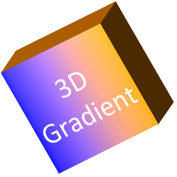

## **Tổng quan**

Aspose.Slides for Node.js via Java có thể tạo, chỉnh sửa, giữ nguyên và hiển thị định dạng 3D kiểu PowerPoint cho hình dạng và văn bản. Bài viết này đề cập đến các hiệu ứng 3D như quay, đè, viền góc, ánh sáng, vật liệu, tô màu gradient hoặc hình ảnh, và văn bản 3D.

{}
Bài viết này nói về các hiệu ứng định dạng 3D trên các hình dạng và văn bản trong PowerPoint. Nó không liên quan đến việc chèn hoặc chỉnh sửa các tệp mô hình 3D độc lập. Khi bạn xuất một slide thành ảnh, PDF hoặc HTML, Aspose.Slides sẽ render các hiệu ứng 3D đó vào đầu ra 2D đã xuất.
{}

## **Khái niệm Định dạng 3D**

Sử dụng [Shape](https://reference.aspose.com/slides/vi/nodejs-java/aspose.slides/shape/).`getThreeDFormat()` để áp dụng định dạng 3D cho một hình dạng. Đối tượng [ThreeDFormat](https://reference.aspose.com/slides/vi/nodejs-java/aspose.slides/threedformat/) trả về điều khiển cảnh 3D cho hình dạng đó.

Đối với văn bản, sử dụng [TextFrameFormat](https://reference.aspose.com/slides/vi/nodejs-java/aspose.slides/textframeformat/).`getThreeDFormat()`. Điều này áp dụng định dạng 3D cho khung văn bản thay vì thân hình dạng.

Các thành viên API quan trọng nhất là:

| Thành viên API | Điều khiển gì | Khi nào nên sử dụng |
|---|---|---|
| [getCamera](https://reference.aspose.com/slides/vi/nodejs-java/aspose.slides/threedformat/#getCamera) | Góc nhìn, loại camera preset, quay, thu phóng và phối cảnh. | Quay đối tượng trong không gian 3D hoặc khớp với preset quay 3D của PowerPoint. |
| [getLightRig](https://reference.aspose.com/slides/vi/nodejs-java/aspose.slides/threedformat/#getLightRig) | Ánh sáng preset, hướng và quay ánh sáng. | Thay đổi cách làm nổi bật và bóng tối xuất hiện trên bề mặt 3D. |
| [getMaterial](https://reference.aspose.com/slides/vi/nodejs-java/aspose.slides/threedformat/#getMaterial) và [setMaterial](https://reference.aspose.com/slides/vi/nodejs-java/aspose.slides/threedformat/#setMaterial) | Vật liệu bề mặt, chẳng hạn như phẳng, mờ, nhựa hoặc kim loại. | Làm cho cùng một hình học trông phẳng hơn, mềm hơn, bóng hơn hoặc kim loại hơn. |
| [getExtrusionHeight](https://reference.aspose.com/slides/vi/nodejs-java/aspose.slides/threedformat/#getExtrusionHeight) và [setExtrusionHeight](https://reference.aspose.com/slides/vi/nodejs-java/aspose.slides/threedformat/#setExtrusionHeight) | Độ sâu mà hình dạng mở rộng ra phía sau mặt trước. | Chuyển một hình dạng phẳng thành một vật thể 3D dày có thể nhìn thấy. |
| [getExtrusionColor](https://reference.aspose.com/slides/vi/nodejs-java/aspose.slides/threedformat/#getExtrusionColor) | Màu của các mặt bên được đè. | Làm cho độ sâu hiển thị hoặc đồng nhất màu mặt bên với màu tô phía trước. |
| [getDepth](https://reference.aspose.com/slides/vi/nodejs-java/aspose.slides/threedformat/#getDepth) và [setDepth](https://reference.aspose.com/slides/vi/nodejs-java/aspose.slides/threedformat/#setDepth) | Độ sâu 3D bổ sung được PowerPoint sử dụng. | Tinh chỉnh độ sâu cho hình dạng hoặc văn bản, đặc biệt khi kết hợp với bevel và vật liệu. |
| [getBevelTop](https://reference.aspose.com/slides/vi/nodejs-java/aspose.slides/threedformat/#getBevelTop) và [getBevelBottom](https://reference.aspose.com/slides/vi/nodejs-java/aspose.slides/threedformat/#getBevelBottom) | Các cạnh nhô lên hoặc làm tròn trên mặt trước và mặt sau. | Thêm một cạnh mềm mại hoặc đúc thay vì một mặt phẳng sắc nhọn. |
| [getContourColor](https://reference.aspose.com/slides/vi/nodejs-java/aspose.slides/threedformat/#getContourColor), [getContourWidth](https://reference.aspose.com/slides/vi/nodejs-java/aspose.slides/threedformat/#getContourWidth) và [setContourWidth](https://reference.aspose.com/slides/vi/nodejs-java/aspose.slides/threedformat/#setContourWidth) | Đường viền quanh đối tượng 3D. | Nhấn mạnh giới hạn đối tượng trong kết quả render. |

## **Tạo hình dạng 3D**

Một hình dạng thường cần bốn loại cài đặt trước khi trông nó thực sự 3D:

- Cài đặt camera, vì góc nhìn mặc định có thể che khuất phần đè.
- Cài đặt ánh sáng, vì ánh sáng làm cho các mặt và các bên trở nên dễ nhìn.
- Cài đặt vật liệu, vì bề mặt ảnh hưởng đến cách ánh sáng được render.
- Cài đặt đè hoặc độ sâu, vì một hình dạng phẳng cần có độ dày.

Ví dụ sau tạo một hình chữ nhật, thêm văn bản vào mặt trước, áp dụng định dạng 3D, lưu bản trình chiếu dưới dạng PPTX và render slide thành ảnh PNG.

```javascript
const imageScale = 2;

const presentation = new aspose.slides.Presentation();
try {
    const slide = presentation.getSlides().get_Item(0);
    const shape = slide.getShapes().addAutoShape(aspose.slides.ShapeType.Rectangle, 200, 150, 200, 200);
    shape.getTextFrame().setText("3D");
    shape.getTextFrame().getParagraphs().get_Item(0).getParagraphFormat().getDefaultPortionFormat().setFontHeight(64);

    const blueColor = java.getStaticFieldValue("java.awt.Color", "BLUE");
    shape.getFillFormat().setFillType(java.newByte(aspose.slides.FillType.Solid));
    shape.getFillFormat().getSolidFillColor().setColor(blueColor);

    shape.getThreeDFormat().getCamera().setCameraType(aspose.slides.CameraPresetType.OrthographicFront);
    shape.getThreeDFormat().getCamera().setRotation(20, 30, 40);
    shape.getThreeDFormat().getLightRig().setLightType(aspose.slides.LightRigPresetType.Flat);
    shape.getThreeDFormat().getLightRig().setDirection(aspose.slides.LightingDirection.Top);
    shape.getThreeDFormat().setMaterial(aspose.slides.MaterialPresetType.Flat);
    shape.getThreeDFormat().setExtrusionHeight(100);
    shape.getThreeDFormat().getExtrusionColor().setColor(blueColor);

    const thumbnail = slide.getImage(imageScale, imageScale);
    try {
        thumbnail.save("shape_3d.png", aspose.slides.ImageFormat.Png);
    } finally {
        thumbnail.dispose();
    }

    presentation.save("shape_3d.pptx", aspose.slides.SaveFormat.Pptx);
} finally {
    presentation.dispose();
}
```

Ảnh slide đã render cho thấy hình chữ nhật như một khối 3D dày:


## **Xoay hình dạng bằng Camera**

Trong PowerPoint, việc quay 3D được cấu hình từ bảng 3-D Rotation. Các giá trị quay X, Y và Z tương ứng với việc quay bạn thiết lập thông qua API camera.


Trong Aspose.Slides, đặt loại camera và quay thông qua định dạng 3D được trả về bởi `shape.getThreeDFormat()`:

```javascript
shape.getThreeDFormat().getCamera().setCameraType(aspose.slides.CameraPresetType.OrthographicFront);
shape.getThreeDFormat().getCamera().setRotation(20, 30, 40);
```

Sử dụng camera khi bạn cần thay đổi cách người xem nhìn đối tượng. Nó không thay đổi hình học 2D của hình trên slide. Nó thay đổi góc nhìn 3D mà PowerPoint và Aspose.Slides sử dụng khi render.

## **Thêm Đè và Độ sâu**

Đè làm cho một hình dạng trông dày hơn bằng cách mở rộng nó ra phía sau mặt trước. Trong PowerPoint, điều khiển độ sâu thiết lập độ dày này, và điều khiển màu thiết lập màu của các mặt bên.


Đặt chiều cao đè cho độ dày và màu đè cho màu bên:

```javascript
const extrusionColor = java.newInstanceSync("java.awt.Color", 128, 0, 128);

shape.getThreeDFormat().getCamera().setRotation(20, 30, 40);
shape.getThreeDFormat().setExtrusionHeight(100);
shape.getThreeDFormat().getExtrusionColor().setColor(extrusionColor);
```

Sử dụng cài đặt độ sâu khi bạn cần làm việc trực tiếp với giá trị độ sâu của PowerPoint hoặc kết hợp độ sâu với bevel, vật liệu và hiệu ứng văn bản. Trong nhiều trường hợp, chiều cao đè là cài đặt rõ ràng hơn vì nó trực tiếp biểu thị độ dày có thể nhìn thấy.

## **Sử dụng Đổ màu Gradient hoặc Hình ảnh với Hiệu ứng 3D**

Định dạng 3D độc lập với việc tô màu hình dạng. Bạn có thể áp dụng màu nền đặc, gradient, mẫu hoặc hình ảnh cho mặt trước và vẫn sử dụng cùng các cài đặt camera, ánh sáng, vật liệu và đè.

Ví dụ này áp dụng một gradient cho hình và màu đè tối hơn cho các mặt bên:

```javascript
const imageScale = 2;

const presentation = new aspose.slides.Presentation();
try {
    const slide = presentation.getSlides().get_Item(0);
    const shape = slide.getShapes().addAutoShape(aspose.slides.ShapeType.Rectangle, 200, 150, 250, 250);
    shape.getTextFrame().setText("3D Gradient");
    shape.getTextFrame().getParagraphs().get_Item(0).getParagraphFormat().getDefaultPortionFormat().setFontHeight(64);

    const blueColor = java.getStaticFieldValue("java.awt.Color", "BLUE");
    const orangeColor = java.getStaticFieldValue("java.awt.Color", "ORANGE");
    shape.getFillFormat().setFillType(java.newByte(aspose.slides.FillType.Gradient));
    shape.getFillFormat().getGradientFormat().getGradientStops().add(0, blueColor);
    shape.getFillFormat().getGradientFormat().getGradientStops().add(100, orangeColor);

    const darkOrangeColor = java.newInstanceSync("java.awt.Color", 255, 140, 0);
    shape.getThreeDFormat().getCamera().setCameraType(aspose.slides.CameraPresetType.OrthographicFront);
    shape.getThreeDFormat().getCamera().setRotation(10, 20, 30);
    shape.getThreeDFormat().getLightRig().setLightType(aspose.slides.LightRigPresetType.Flat);
    shape.getThreeDFormat().getLightRig().setDirection(aspose.slides.LightingDirection.Top);
    shape.getThreeDFormat().setMaterial(aspose.slides.MaterialPresetType.Flat);
    shape.getThreeDFormat().setExtrusionHeight(150);
    shape.getThreeDFormat().getExtrusionColor().setColor(darkOrangeColor);

    const thumbnail = slide.getImage(imageScale, imageScale);
    try {
        thumbnail.save("gradient_3d.png", aspose.slides.ImageFormat.Png);
    } finally {
        thumbnail.dispose();
    }
} finally {
    presentation.dispose();
}
```

Kết quả render giữ gradient trên mặt trước và render đè riêng biệt:



Để sử dụng hình ảnh thay vì gradient, thêm ảnh vào bản trình chiếu và gán nó cho phần tô màu của hình:

```javascript
const sourceImage = aspose.slides.Images.fromFile("image.jpg");
let presentationImage;
try {
    presentationImage = presentation.getImages().addImage(sourceImage);
} finally {
    sourceImage.dispose();
}

shape.getFillFormat().setFillType(java.newByte(aspose.slides.FillType.Picture));
shape.getFillFormat().getPictureFillFormat().getPicture().setImage(presentationImage);
shape.getFillFormat().getPictureFillFormat().setPictureFillMode(aspose.slides.PictureFillMode.Stretch);

const darkOrangeColor = java.newInstanceSync("java.awt.Color", 255, 140, 0);
shape.getThreeDFormat().getCamera().setRotation(10, 20, 30);
shape.getThreeDFormat().setExtrusionHeight(150);
shape.getThreeDFormat().getExtrusionColor().setColor(darkOrangeColor);
```

Hình ảnh được render trên mặt trước, trong khi đè được render như bề mặt bên 3D:


## **Áp dụng Định dạng 3D cho Văn bản**

Định dạng 3D của hình ảnh ảnh hưởng đến thân hình dạng. Định dạng 3D của văn bản ảnh hưởng đến khung văn bản. Điều này hữu ích cho các hiệu ứng kiểu WordArt, nơi các ký tự cần có đè, vật liệu, ánh sáng và cài đặt camera.

Ví dụ sau tạo văn bản với mẫu tô, áp dụng biến đổi WordArt và cấu hình các cài đặt 3D trên [TextFrameFormat](https://reference.aspose.com/slides/vi/nodejs-java/aspose.slides/textframeformat/):

```javascript
const imageScale = 2;

const presentation = new aspose.slides.Presentation();
try {
    const slide = presentation.getSlides().get_Item(0);
    const shape = slide.getShapes().addAutoShape(aspose.slides.ShapeType.Rectangle, 200, 150, 250, 250);
    shape.getFillFormat().setFillType(java.newByte(aspose.slides.FillType.NoFill));
    shape.getLineFormat().getFillFormat().setFillType(java.newByte(aspose.slides.FillType.NoFill));
    shape.getTextFrame().setText("3D Text");

    const portion = shape.getTextFrame().getParagraphs().get_Item(0).getPortions().get_Item(0);
    portion.getPortionFormat().getFillFormat().setFillType(java.newByte(aspose.slides.FillType.Pattern));
    const darkOrangeColor = java.newInstanceSync("java.awt.Color", 255, 140, 0);
    const whiteColor = java.getStaticFieldValue("java.awt.Color", "WHITE");
    portion.getPortionFormat().getFillFormat().getPatternFormat().getForeColor().setColor(darkOrangeColor);
    portion.getPortionFormat().getFillFormat().getPatternFormat().getBackColor().setColor(whiteColor);
    portion.getPortionFormat().getFillFormat().getPatternFormat().setPatternStyle(java.newByte(aspose.slides.PatternStyle.LargeGrid));

    shape.getTextFrame().getParagraphs().get_Item(0).getParagraphFormat().getDefaultPortionFormat().setFontHeight(128);

    const textFrameFormat = shape.getTextFrame().getTextFrameFormat();
    textFrameFormat.setTransform(java.newByte(aspose.slides.TextShapeType.ArchUp));
    textFrameFormat.getThreeDFormat().setExtrusionHeight(3.5);
    textFrameFormat.getThreeDFormat().setDepth(3);
    textFrameFormat.getThreeDFormat().setMaterial(aspose.slides.MaterialPresetType.Plastic);
    textFrameFormat.getThreeDFormat().getLightRig().setDirection(aspose.slides.LightingDirection.Top);
    textFrameFormat.getThreeDFormat().getLightRig().setLightType(aspose.slides.LightRigPresetType.Balanced);
    textFrameFormat.getThreeDFormat().getLightRig().setRotation(0, 0, 40);
    textFrameFormat.getThreeDFormat().getCamera().setCameraType(aspose.slides.CameraPresetType.PerspectiveContrastingRightFacing);

    const thumbnail = slide.getImage(imageScale, imageScale);
    try {
        thumbnail.save("text_3d.png", aspose.slides.ImageFormat.Png);
    } finally {
        thumbnail.dispose();
    }

    presentation.save("text_3d.pptx", aspose.slides.SaveFormat.Pptx);
} finally {
    presentation.dispose();
}
```

Văn bản được render dưới dạng chữ 3D cong, đè:


## **Hành vi Xuất và Kết xuất**

Aspose.Slides giữ nguyên định dạng 3D khi lưu sang các định dạng PowerPoint như PPTX. Khi render hoặc xuất sang các định dạng bố cục cố định, cảnh 3D được raster hoá hoặc vẽ vào đầu ra dưới dạng kết quả 2D. Điều này áp dụng khi bạn render slide sang [PNG](/slides/vi/nodejs-java/convert-powerpoint-to-png/), xuất sang [PDF](/slides/vi/nodejs-java/convert-powerpoint-to-pdf/), xuất sang [HTML](/slides/vi/nodejs-java/convert-powerpoint-to-html/), hoặc tạo khung cho [video conversion](/slides/vi/nodejs-java/convert-powerpoint-to-video/).

Hãy nhớ các điểm sau:

- Ảnh và PDF đã xuất không tương tác. Đối tượng không thể được quay bởi người xem sau khi xuất.
- Ngoại hình cuối cùng phụ thuộc vào sự kết hợp của camera, light rig, vật liệu, đè, tô màu và tỷ lệ slide.
- Nếu bạn cần kiểm tra các giá trị định dạng kế thừa hoặc dựa trên chủ đề, đọc [effective shape properties](/slides/vi/nodejs-java/shape-effective-properties/).
- Một số định dạng đầu ra không thể lưu trữ định dạng 3D PowerPoint có thể chỉnh sửa. Trong những định dạng đó, kết quả hình ảnh được render thay vì được giữ dưới dạng cài đặt 3D có thể chỉnh sửa.

## **Câu hỏi thường gặp**

**Aspose.Slides có thể tạo bản trình chiếu 3D tương tác không?**

Aspose.Slides tạo và render các hiệu ứng 3D của PowerPoint cho hình dạng và văn bản. Nó không làm cho các ảnh, PDF hoặc trang HTML xuất ra trở thành các cảnh 3D tương tác mà người xem có thể quay. Trong PPTX, định dạng 3D vẫn có thể chỉnh sửa trong PowerPoint khi định dạng hỗ trợ.

**Sự khác biệt giữa mô hình 3D và hiệu ứng 3D là gì?**

Mô hình 3D là một đối tượng 3D riêng biệt được chèn vào bản trình chiếu. Hiệu ứng 3D là định dạng được áp dụng cho một hình dạng hoặc văn bản PowerPoint thông thường, chẳng hạn như quay, đè, bevel, ánh sáng và vật liệu. Bài viết này đề cập đến các hiệu ứng 3D.

**Cài đặt nào cần thiết để có một hình dạng 3D nhìn thấy được?**

Ít nhất, cần đặt quay camera và hoặc đè hoặc độ sâu. Thực tế, cũng nên đặt light rig và vật liệu để các mặt được render có điểm nhấn và bóng rõ ràng.

**Tôi có thể áp dụng hiệu ứng 3D cho cả hình dạng và văn bản không?**

Có. Sử dụng [Shape](https://reference.aspose.com/slides/vi/nodejs-java/aspose.slides/shape/).`getThreeDFormat()` cho thân hình dạng và [TextFrameFormat](https://reference.aspose.com/slides/vi/nodejs-java/aspose.slides/textframeformat/).`getThreeDFormat()` cho văn bản.

**Hiệu ứng 3D có xuất hiện khi xuất sang ảnh, PDF, HTML hoặc khung video không?**

Có. Aspose.Slides render hiệu ứng 3D khi tạo ảnh slide, đầu ra PDF, đầu ra HTML và các khung được dùng cho chuyển đổi video. Đầu ra đã xuất chứa giao diện đã render, không phải đối tượng 3D có thể chỉnh sửa.

**Tôi có thể đọc các giá trị 3D cuối cùng sau khi đã áp dụng kế thừa và cài đặt chủ đề không?**

Có. Sử dụng các API định dạng hiệu quả được mô tả trong [Shape Effective Properties](/slides/vi/nodejs-java/shape-effective-properties/) để đọc camera, light rig, bevel và các giá trị 3D liên quan cuối cùng.