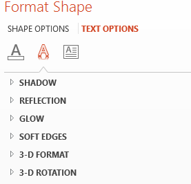

## **Tổng quan**

Hiệu ứng WordArt cho phép bạn thêm văn bản được thiết kế đẹp mắt và phong cách vào bài thuyết trình PowerPoint. Với Aspose.Slides, các nhà phát triển có thể tạo, tùy chỉnh và quản lý WordArt một cách lập trình, giống như trong Microsoft PowerPoint—không cần cài đặt Office. Bài viết này cung cấp cái nhìn tổng quan về cách làm việc với WordArt, bao gồm cách áp dụng biến đổi văn bản, kiểu tô màu, đường viền, bóng đèn và các tùy chọn định dạng khác để làm cho nội dung trình chiếu của bạn trở nên biểu cảm và hấp dẫn hơn. WordArt cho phép bạn xử lý văn bản như một đối tượng đồ họa. Nó bao gồm các hiệu ứng hoặc chỉnh sửa đặc biệt được áp dụng lên văn bản để làm cho nó thu hút hoặc nổi bật hơn.

## **Tạo mẫu WordArt đơn giản và áp dụng vào văn bản**

**Sử dụng Aspose.Slides** 

Đầu tiên, chúng ta tạo một đoạn văn bản đơn giản bằng đoạn mã JavaScript sau:

```javascript
var pres = new aspose.slides.Presentation();
try {
    var slide = pres.getSlides().get_Item(0);
    var autoShape = slide.getShapes().addAutoShape(aspose.slides.ShapeType.Rectangle, 200, 200, 400, 200);
    var textFrame = autoShape.getTextFrame();
    var portion = textFrame.getParagraphs().get_Item(0).getPortions().get_Item(0);
    portion.setText("Aspose.Slides");
} finally {
    if (pres != null) {
        pres.dispose();
    }
}
```
Tiếp theo, chúng ta đặt kích thước phông chữ của văn bản lên giá trị lớn hơn để hiệu ứng rõ hơn bằng đoạn mã sau:

```javascript
var fontData = new aspose.slides.FontData("Arial Black");
portion.getPortionFormat().setLatinFont(fontData);
portion.getPortionFormat().setFontHeight(36);
```

**Sử dụng Microsoft PowerPoint**

Đi tới menu hiệu ứng WordArt trong Microsoft PowerPoint:


Từ menu bên phải, bạn có thể chọn một hiệu ứng WordArt được định sẵn. Từ menu bên trái, bạn có thể chỉ định các cài đặt cho một WordArt mới. 

Đây là một số tham số hoặc tùy chọn có sẵn:


**Sử dụng Aspose.Slides**

Ở đây, chúng ta áp dụng màu mẫu [SmallGrid](https://reference.aspose.com/slides/vi/nodejs-java/aspose.slides/PatternStyle#SmallGrid) vào văn bản và thêm đường viền văn bản màu đen độ rộng 1 bằng đoạn mã sau:

```javascript
portion.getPortionFormat().getFillFormat().setFillType(java.newByte(aspose.slides.FillType.Pattern));
portion.getPortionFormat().getFillFormat().getPatternFormat().getForeColor().setColor(java.getStaticFieldValue("java.awt.Color", "ORANGE"));
portion.getPortionFormat().getFillFormat().getPatternFormat().getBackColor().setColor(java.getStaticFieldValue("java.awt.Color", "WHITE"));
portion.getPortionFormat().getFillFormat().getPatternFormat().setPatternStyle(java.newByte(aspose.slides.PatternStyle.SmallGrid));
portion.getPortionFormat().getLineFormat().getFillFormat().setFillType(java.newByte(aspose.slides.FillType.Solid));
portion.getPortionFormat().getLineFormat().getFillFormat().getSolidFillColor().setColor(java.getStaticFieldValue("java.awt.Color", "BLACK"));
```

Văn bản kết quả:


## **Áp dụng các hiệu ứng WordArt khác**

**Sử dụng Microsoft PowerPoint**

Từ lớp chương trình, bạn có thể áp dụng các hiệu ứng này vào văn bản, khối văn bản, hình dạng hoặc các yếu tố tương tự:



Ví dụ, các hiệu ứng Bóng đèn, Phản chiếu và Phát sáng có thể được áp dụng cho văn bản; các hiệu ứng Định dạng 3D và Xoay 3D có thể được áp dụng cho khối văn bản; thuộc tính Đầu mút mềm có thể được áp dụng cho Đối tượng Hình (vẫn có hiệu ứng khi không đặt thuộc tính Định dạng 3D).

### **Áp dụng hiệu ứng Bóng đèn**

Ở đây, chúng ta chỉ định các thuộc tính liên quan đến văn bản. Chúng ta áp dụng hiệu ứng bóng đèn cho văn bản bằng đoạn mã JavaScript sau:

```javascript
portion.getPortionFormat().getEffectFormat().enableOuterShadowEffect();
portion.getPortionFormat().getEffectFormat().getOuterShadowEffect().getShadowColor().setColor(java.getStaticFieldValue("java.awt.Color", "BLACK"));
portion.getPortionFormat().getEffectFormat().getOuterShadowEffect().setScaleHorizontal(100);
portion.getPortionFormat().getEffectFormat().getOuterShadowEffect().setScaleVertical(65);
portion.getPortionFormat().getEffectFormat().getOuterShadowEffect().setBlurRadius(4.73);
portion.getPortionFormat().getEffectFormat().getOuterShadowEffect().setDirection(230);
portion.getPortionFormat().getEffectFormat().getOuterShadowEffect().setDistance(2);
portion.getPortionFormat().getEffectFormat().getOuterShadowEffect().setSkewHorizontal(30);
portion.getPortionFormat().getEffectFormat().getOuterShadowEffect().setSkewVertical(0);
portion.getPortionFormat().getEffectFormat().getOuterShadowEffect().getShadowColor().getColorTransform().add(aspose.slides.ColorTransformOperation.SetAlpha, 0.32);
```

API Aspose.Slides hỗ trợ ba loại bóng: OuterShadow, InnerShadow và PresetShadow. 

Với PresetShadow, bạn có thể áp dụng bóng cho văn bản (sử dụng các giá trị định sẵn). 

**Sử dụng Microsoft PowerPoint**

Trong PowerPoint, bạn chỉ có một loại bóng. Dưới đây là một ví dụ:


**Sử dụng Aspose.Slides**

Aspose.Slides thực tế cho phép bạn áp dụng đồng thời hai loại bóng: InnerShadow và PresetShadow.

**Lưu ý:**

- Khi OuterShadow và PresetShadow được sử dụng cùng nhau, chỉ hiệu ứng OuterShadow được áp dụng. 
- Nếu OuterShadow và InnerShadow được sử dụng đồng thời, hiệu ứng kết quả hoặc áp dụng phụ thuộc vào phiên bản PowerPoint. Ví dụ, trong PowerPoint 2013, hiệu ứng được nhân đôi. Tuy nhiên trong PowerPoint 2007, hiệu ứng OuterShadow được áp dụng. 

### **Áp dụng hiển thị cho Văn bản**

Chúng ta thêm hiển thị cho văn bản bằng đoạn mã JavaScript sau:

```javascript
portion.getPortionFormat().getEffectFormat().enableReflectionEffect();
portion.getPortionFormat().getEffectFormat().getReflectionEffect().setBlurRadius(0.5);
portion.getPortionFormat().getEffectFormat().getReflectionEffect().setDistance(4.72);
portion.getPortionFormat().getEffectFormat().getReflectionEffect().setStartPosAlpha(0.0);
portion.getPortionFormat().getEffectFormat().getReflectionEffect().setEndPosAlpha(60.0);
portion.getPortionFormat().getEffectFormat().getReflectionEffect().setDirection(90);
portion.getPortionFormat().getEffectFormat().getReflectionEffect().setScaleHorizontal(100);
portion.getPortionFormat().getEffectFormat().getReflectionEffect().setScaleVertical(-100);
portion.getPortionFormat().getEffectFormat().getReflectionEffect().setStartReflectionOpacity(60.0);
portion.getPortionFormat().getEffectFormat().getReflectionEffect().setEndReflectionOpacity(0.9);
portion.getPortionFormat().getEffectFormat().getReflectionEffect().setRectangleAlign(aspose.slides.RectangleAlignment.BottomLeft);
```

### **Áp dụng hiệu ứng Phát sáng cho Văn bản**

Chúng ta áp dụng hiệu ứng phát sáng cho văn bản để nó tỏa sáng hoặc nổi bật bằng đoạn mã sau:

```javascript
portion.getPortionFormat().getEffectFormat().enableGlowEffect();
portion.getPortionFormat().getEffectFormat().getGlowEffect().getColor().setR(255);
portion.getPortionFormat().getEffectFormat().getGlowEffect().getColor().getColorTransform().add(aspose.slides.ColorTransformOperation.SetAlpha, 0.54);
portion.getPortionFormat().getEffectFormat().getGlowEffect().setRadius(7);
```

Kết quả của thao tác:


{} 

Bạn có thể thay đổi các tham số cho bóng, hiển thị và phát sáng. Các thuộc tính của hiệu ứng được đặt riêng cho từng phần của văn bản. 

{} 

### **Sử dụng Biến đổi trong WordArt**

Chúng ta sử dụng thuộc tính Transform (áp dụng cho toàn bộ khối văn bản) bằng đoạn mã sau:
```javascript
textFrame.getTextFrameFormat().setTransform(java.newByte(aspose.slides.TextShapeType.ArchUpPour));
```

Kết quả:


{} 

Cả Microsoft PowerPoint và Aspose.Slides cho Node.js via Java đều cung cấp một số loại biến đổi được định sẵn.

{} 

**Sử dụng PowerPoint**

Để truy cập các loại biến đổi được định sẵn, vào: **Format** -> **TextEffect** -> **Transform**

**Sử dụng Aspose.Slides**

Để chọn loại biến đổi, sử dụng enum TextShapeType. 

### **Áp dụng hiệu ứng 3D cho Văn bản và Hình dạng**

Chúng ta đặt một hiệu ứng 3D cho hình dạng văn bản bằng đoạn mã mẫu sau:

```javascript
autoShape.getThreeDFormat().getBevelBottom().setBevelType(aspose.slides.BevelPresetType.Circle);
autoShape.getThreeDFormat().getBevelBottom().setHeight(10.5);
autoShape.getThreeDFormat().getBevelBottom().setWidth(10.5);
autoShape.getThreeDFormat().getBevelTop().setBevelType(aspose.slides.BevelPresetType.Circle);
autoShape.getThreeDFormat().getBevelTop().setHeight(12.5);
autoShape.getThreeDFormat().getBevelTop().setWidth(11);
autoShape.getThreeDFormat().getExtrusionColor().setColor(java.getStaticFieldValue("java.awt.Color", "ORANGE"));
autoShape.getThreeDFormat().setExtrusionHeight(6);
autoShape.getThreeDFormat().getContourColor().setColor(java.getStaticFieldValue("java.awt.Color", "RED"));
autoShape.getThreeDFormat().setContourWidth(1.5);
autoShape.getThreeDFormat().setDepth(3);
autoShape.getThreeDFormat().setMaterial(aspose.slides.MaterialPresetType.Plastic);
autoShape.getThreeDFormat().getLightRig().setDirection(aspose.slides.LightingDirection.Top);
autoShape.getThreeDFormat().getLightRig().setLightType(aspose.slides.LightRigPresetType.Balanced);
autoShape.getThreeDFormat().getLightRig().setRotation(0, 0, 40);
autoShape.getThreeDFormat().getCamera().setCameraType(aspose.slides.CameraPresetType.PerspectiveContrastingRightFacing);
```

Văn bản và hình dạng kết quả:


Chúng ta áp dụng hiệu ứng 3D cho văn bản bằng đoạn mã JavaScript sau:

```javascript
textFrame.getTextFrameFormat().getThreeDFormat().getBevelBottom().setBevelType(aspose.slides.BevelPresetType.Circle);
textFrame.getTextFrameFormat().getThreeDFormat().getBevelBottom().setHeight(3.5);
textFrame.getTextFrameFormat().getThreeDFormat().getBevelBottom().setWidth(3.5);
textFrame.getTextFrameFormat().getThreeDFormat().getBevelTop().setBevelType(aspose.slides.BevelPresetType.Circle);
textFrame.getTextFrameFormat().getThreeDFormat().getBevelTop().setHeight(4);
textFrame.getTextFrameFormat().getThreeDFormat().getBevelTop().setWidth(4);
textFrame.getTextFrameFormat().getThreeDFormat().getExtrusionColor().setColor(java.getStaticFieldValue("java.awt.Color", "ORANGE"));
textFrame.getTextFrameFormat().getThreeDFormat().setExtrusionHeight(6);
textFrame.getTextFrameFormat().getThreeDFormat().getContourColor().setColor(java.getStaticFieldValue("java.awt.Color", "RED"));
textFrame.getTextFrameFormat().getThreeDFormat().setContourWidth(1.5);
textFrame.getTextFrameFormat().getThreeDFormat().setDepth(3);
textFrame.getTextFrameFormat().getThreeDFormat().setMaterial(aspose.slides.MaterialPresetType.Plastic);
textFrame.getTextFrameFormat().getThreeDFormat().getLightRig().setDirection(aspose.slides.LightingDirection.Top);
textFrame.getTextFrameFormat().getThreeDFormat().getLightRig().setLightType(aspose.slides.LightRigPresetType.Balanced);
textFrame.getTextFrameFormat().getThreeDFormat().getLightRig().setRotation(0, 0, 40);
textFrame.getTextFrameFormat().getThreeDFormat().getCamera().setCameraType(aspose.slides.CameraPresetType.PerspectiveContrastingRightFacing);
```

Kết quả của thao tác:


{} 

Việc áp dụng hiệu ứng 3D cho văn bản hoặc hình dạng của chúng và tương tác giữa các hiệu ứng dựa trên một số quy tắc. 

Xem xét một cảnh cho văn bản và hình dạng chứa văn bản đó. Hiệu ứng 3D bao gồm biểu diễn đối tượng 3D và cảnh mà đối tượng được đặt lên. 

- Khi cảnh được đặt cho cả hình dạng và văn bản, cảnh của hình dạng có ưu tiên cao hơn—cảnh của văn bản bị bỏ qua. 
- Khi hình dạng không có cảnh riêng nhưng có biểu diễn 3D, cảnh của văn bản được sử dụng. 
- Ngược lại—khi hình dạng ban đầu không có hiệu ứng 3D—hình dạng sẽ phẳng và hiệu ứng 3D chỉ được áp dụng cho văn bản. 

Những mô tả này liên quan tới các phương thức ThreeDFormat.getLightRig() và ThreeDFormat.getCamera(). 

{} 

## **Áp dụng hiệu ứng Outer Shadow cho Văn bản**

Aspose.Slides cho Node.js via Java cung cấp các lớp [**OuterShadow**](https://reference.aspose.com/slides/vi/nodejs-java/aspose.slides/outershadow/) và [**InnerShadow**](https://reference.aspose.com/slides/vi/nodejs-java/aspose.slides/innershadow/) cho phép bạn áp dụng hiệu ứng bóng cho văn bản được chứa trong [TextFrame](https://reference.aspose.com/slides/vi/nodejs-java/aspose.slides/textframe/). Thực hiện các bước sau:

1. Tạo một thể hiện của lớp [Presentation](https://reference.aspose.com/slides/vi/nodejs-java/aspose.slides/presentation). 
2. Lấy tham chiếu tới một slide bằng chỉ số của nó. 
3. Thêm một AutoShape loại Rectangle vào slide. 
4. Truy cập TextFrame liên kết với AutoShape. 
5. Đặt FillType của AutoShape thành NoFill. 
6. Tạo thể hiện lớp OuterShadow 
7. Đặt BlurRadius cho bóng. 
8. Đặt Direction cho bóng 
9. Đặt Distance cho bóng. 
10. Đặt RectanglelAlign thành TopLeft. 
11. Đặt PresetColor của bóng thành Black. 
12. Ghi bài thuyết trình dưới dạng tệp [PPTX](https://docs.fileformat.com/presentation/pptx/). 

Đoạn mã mẫu bằng Java—cài đặt các bước trên—cho bạn thấy cách áp dụng hiệu ứng outer shadow cho văn bản:

```javascript
var pres = new aspose.slides.Presentation();
try {
    // Lấy tham chiếu của slide
    var sld = pres.getSlides().get_Item(0);
    // Thêm một AutoShape loại Rectangle
    var ashp = sld.getShapes().addAutoShape(aspose.slides.ShapeType.Rectangle, 150, 75, 150, 50);
    // Thêm TextFrame vào Rectangle
    ashp.addTextFrame("Aspose TextBox");
    // Vô hiệu hóa màu nền của hình nếu chúng ta muốn lấy bóng cho văn bản
    ashp.getFillFormat().setFillType(java.newByte(aspose.slides.FillType.NoFill));
    // Thêm outer shadow và đặt tất cả các tham số cần thiết
    ashp.getEffectFormat().enableOuterShadowEffect();
    var shadow = ashp.getEffectFormat().getOuterShadowEffect();
    shadow.setBlurRadius(4.0);
    shadow.setDirection(45);
    shadow.setDistance(3);
    shadow.setRectangleAlign(aspose.slides.RectangleAlignment.TopLeft);
    shadow.getShadowColor().setPresetColor(aspose.slides.PresetColor.Black);
    // Ghi bài thuyết trình ra đĩa
    pres.save("pres_out.pptx", aspose.slides.SaveFormat.Pptx);
} finally {
    if (pres != null) {
        pres.dispose();
    }
}
```

## **Áp dụng hiệu ứng Inner Shadow cho Hình dạng**

Thực hiện các bước sau:

1. Tạo một thể hiện của lớp [Presentation](https://reference.aspose.com/slides/vi/nodejs-java/aspose.slides/presentation). 
2. Lấy tham chiếu tới slide. 
3. Thêm một AutoShape loại Rectangle. 
4. Bật InnerShadowEffect. 
5. Đặt tất cả các tham số cần thiết. 
6. Đặt ColorType thành Scheme. 
7. Đặt Scheme Color. 
8. Ghi bài thuyết trình dưới dạng tệp [PPTX](https://docs.fileformat.com/presentation/pptx/). 

Đoạn mã mẫu (dựa trên các bước trên) cho bạn thấy cách thêm một kết nối giữa hai hình dạng trong JavaScript:

```javascript
var pres = new aspose.slides.Presentation();
try {
    // Lấy tham chiếu của slide
    var slide = pres.getSlides().get_Item(0);
    // Thêm một AutoShape loại Rectangle
    var ashp = slide.getShapes().addAutoShape(aspose.slides.ShapeType.Rectangle, 150, 75, 400, 300);
    ashp.getFillFormat().setFillType(java.newByte(aspose.slides.FillType.NoFill));
    // Thêm TextFrame vào Rectangle
    ashp.addTextFrame("Aspose TextBox");
    var port = ashp.getTextFrame().getParagraphs().get_Item(0).getPortions().get_Item(0);
    var pf = port.getPortionFormat();
    pf.setFontHeight(50);
    // Bật InnerShadowEffect
    var ef = pf.getEffectFormat();
    ef.enableInnerShadowEffect();
    // Đặt tất cả các tham số cần thiết
    ef.getInnerShadowEffect().setBlurRadius(8.0);
    ef.getInnerShadowEffect().setDirection(90.0);
    ef.getInnerShadowEffect().setDistance(6.0);
    ef.getInnerShadowEffect().getShadowColor().setB(189);
    // Đặt ColorType thành Scheme
    ef.getInnerShadowEffect().getShadowColor().setColorType(aspose.slides.ColorType.Scheme);
    // Đặt Scheme Color
    ef.getInnerShadowEffect().getShadowColor().setSchemeColor(aspose.slides.SchemeColor.Accent1);
    // Lưu Bản thuyết trình
    pres.save("WordArt_out.pptx", aspose.slides.SaveFormat.Pptx);
} finally {
    if (pres != null) {
        pres.dispose();
    }
}
```

## **Câu hỏi thường gặp**

**Có thể sử dụng hiệu ứng WordArt với các phông chữ hoặc kịch bản khác nhau (ví dụ: Ả Rập, Trung Quốc) không?**

Có, Aspose.Slides hỗ trợ Unicode và làm việc với mọi phông chữ và kịch bản chính. Các hiệu ứng WordArt như bóng, tô màu và đường viền có thể được áp dụng bất kể ngôn ngữ, mặc dù tính sẵn có và việc render phông chữ có thể phụ thuộc vào phông chữ hệ thống.

**Có thể áp dụng hiệu ứng WordArt cho các yếu tố master slide không?**

Có, bạn có thể áp dụng hiệu ứng WordArt cho các hình dạng trên slide master, bao gồm các placeholder tiêu đề, footer hoặc văn bản nền. Những thay đổi trên bố cục master sẽ được phản ánh trên tất cả các slide liên quan.

**Hiệu ứng WordArt có ảnh hưởng đến kích thước file bài thuyết trình không?**

Một chút. Các hiệu ứng WordArt như bóng, phát sáng và tô gradient có thể làm tăng nhẹ kích thước file do thêm siêu dữ liệu định dạng, nhưng sự khác biệt thường không đáng kể.

**Có thể xem trước kết quả của hiệu ứng WordArt mà không lưu bài thuyết trình không?**

Có, bạn có thể render các slide chứa WordArt thành hình ảnh (ví dụ: PNG, JPEG) bằng phương thức `getImage` từ lớp [Shape](https://reference.aspose.com/slides/vi/nodejs-java/aspose.slides/shape/) hoặc [Slide](https://reference.aspose.com/slides/vi/nodejs-java/aspose.slides/slide/). Điều này cho phép bạn xem trước kết quả trong bộ nhớ hoặc trên màn hình trước khi lưu hoặc xuất bản thuyết trình đầy đủ.