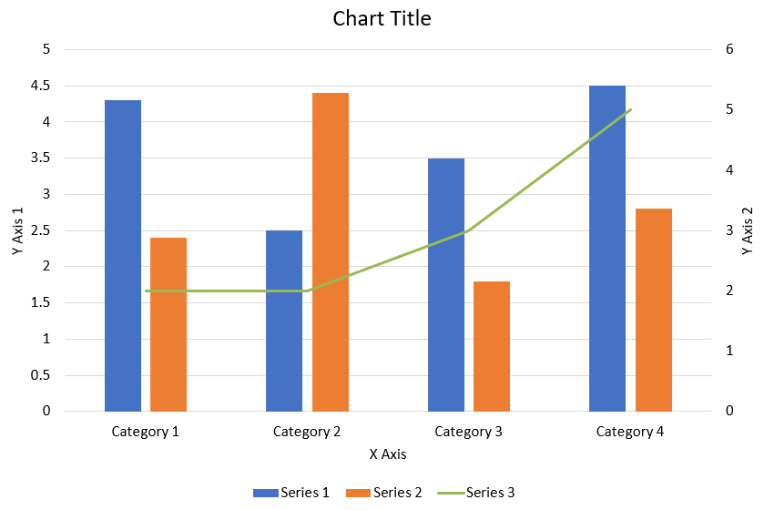

## **Tổng quan**

Bài viết này cung cấp hướng dẫn toàn diện về cách tạo và tùy chỉnh biểu đồ bằng Aspose.Slides. Bạn sẽ học cách lập trình thêm biểu đồ vào một slide, đưa dữ liệu vào và áp dụng các tùy chọn định dạng khác nhau để phù hợp với yêu cầu thiết kế cụ thể của bạn. Trong suốt bài viết, các ví dụ mã chi tiết minh họa từng bước, từ khởi tạo đối tượng presentation và chart cho đến cấu hình series, axes và legends. Bằng cách làm theo hướng dẫn này, bạn sẽ nắm vững cách tích hợp việc tạo biểu đồ động vào ứng dụng, giúp việc tạo bản trình bày dựa trên dữ liệu trở nên nhanh chóng hơn.

## **Tạo biểu đồ**

Biểu đồ giúp mọi người nhanh chóng hình dung dữ liệu và rút ra những hiểu biết có thể không ngay lập tức rõ ràng từ bảng hoặc bảng tính.

**Tại sao nên tạo biểu đồ?**

Sử dụng biểu đồ, bạn có thể:

* tổng hợp, nén hoặc tóm tắt lượng dữ liệu lớn trên một slide trong bản trình bày
* phát hiện mẫu và xu hướng trong dữ liệu
* suy ra hướng và động lực của dữ liệu theo thời gian hoặc theo một đơn vị đo cụ thể
* phát hiện các giá trị ngoại lệ, sai lệch, lỗi, dữ liệu vô nghĩa, v.v.
* truyền đạt hoặc trình bày dữ liệu phức tạp

Trong PowerPoint, bạn có thể tạo biểu đồ qua chức năng *Insert*, cung cấp các mẫu để thiết kế nhiều loại biểu đồ. Sử dụng Aspose.Slides, bạn có thể tạo cả biểu đồ thông thường (dựa trên các loại biểu đồ phổ biến) và biểu đồ tùy chỉnh.

{}
Để tạo biểu đồ, sử dụng lớp [ChartType](https://reference.aspose.com/slides/nodejs-java/aspose.slides/charttype/). Các trường trong lớp này tương ứng với các loại biểu đồ khác nhau.
{}

### **Tạo biểu đồ Cột Gom Nhóm**

Phần này giải thích cách tạo biểu đồ cột gom nhóm bằng Aspose.Slides. Bạn sẽ học cách khởi tạo một presentation, thêm biểu đồ và tùy chỉnh các yếu tố như tiêu đề, dữ liệu, series, categories và kiểu dáng. Thực hiện các bước dưới đây để xem cách một biểu đồ cột gom nhóm tiêu chuẩn được tạo ra:

1. Tạo một thể hiện của lớp [Presentation](https://reference.aspose.com/slides/nodejs-java/aspose.slides/presentation) .
1. Lấy tham chiếu đến một slide bằng chỉ mục của nó.
1. Thêm biểu đồ với một số dữ liệu và chỉ định loại `ChartType.ClusteredColumn` .
1. Thêm tiêu đề cho biểu đồ.
1. Truy cập worksheet dữ liệu của biểu đồ.
1. Xóa tất cả series và categories mặc định.
1. Thêm series và categories mới.
1. Thêm dữ liệu biểu đồ mới cho các series.
1. Áp dụng màu nền cho các series.
1. Thêm nhãn cho các series.
1. Lưu presentation đã sửa dưới dạng file PPTX.

Mã JavaScript này minh họa cách tạo biểu đồ cột gom nhóm:

```javascript
var aspose = aspose || {};
aspose.slides = require("aspose.slides.via.java");
const java = require("java");

// Khởi tạo lớp presentation đại diện cho file PPTX
var pres = new aspose.slides.Presentation();
try {
    // Truy cập slide đầu tiên
    var sld = pres.getSlides().get_Item(0);
    // Thêm biểu đồ với dữ liệu mặc định của nó
    var chart = sld.getShapes().addChart(aspose.slides.ChartType.ClusteredColumn, 0, 0, 500, 500);
    // Đặt tiêu đề cho biểu đồ
    chart.setTitle(true);
    chart.getChartTitle().addTextFrameForOverriding("Sample Title");
    chart.getChartTitle().getTextFrameForOverriding().getTextFrameFormat().setCenterText(java.newByte(aspose.slides.NullableBool.True));
    chart.getChartTitle().setHeight(20);
    // Đặt series đầu tiên hiển thị giá trị
    chart.getChartData().getSeries().get_Item(0).getLabels().getDefaultDataLabelFormat().setShowValue(true);
    // Đặt chỉ số cho bảng dữ liệu biểu đồ
    var defaultWorksheetIndex = 0;
    // Lấy WorkSheet dữ liệu biểu đồ
    var fact = chart.getChartData().getChartDataWorkbook();
    // Xóa series và categories được tạo mặc định
    chart.getChartData().getSeries().clear();
    chart.getChartData().getCategories().clear();
    var s = chart.getChartData().getSeries().size();
    s = chart.getChartData().getCategories().size();
    // Thêm series mới
    chart.getChartData().getSeries().add(fact.getCell(defaultWorksheetIndex, 0, 1, "Series 1"), chart.getType());
    chart.getChartData().getSeries().add(fact.getCell(defaultWorksheetIndex, 0, 2, "Series 2"), chart.getType());
    // Thêm categories mới
    chart.getChartData().getCategories().add(fact.getCell(defaultWorksheetIndex, 1, 0, "Caetegoty 1"));
    chart.getChartData().getCategories().add(fact.getCell(defaultWorksheetIndex, 2, 0, "Caetegoty 2"));
    chart.getChartData().getCategories().add(fact.getCell(defaultWorksheetIndex, 3, 0, "Caetegoty 3"));
    // Lấy series biểu đồ đầu tiên
    var series = chart.getChartData().getSeries().get_Item(0);
    // Bây giờ điền dữ liệu cho series
    series.getDataPoints().addDataPointForBarSeries(fact.getCell(defaultWorksheetIndex, 1, 1, 20));
    series.getDataPoints().addDataPointForBarSeries(fact.getCell(defaultWorksheetIndex, 2, 1, 50));
    series.getDataPoints().addDataPointForBarSeries(fact.getCell(defaultWorksheetIndex, 3, 1, 30));
    // Đặt màu nền cho series
    series.getFormat().getFill().setFillType(java.newByte(aspose.slides.FillType.Solid));
    series.getFormat().getFill().getSolidFillColor().setColor(java.getStaticFieldValue("java.awt.Color", "RED"));
    // Lấy series biểu đồ thứ hai
    series = chart.getChartData().getSeries().get_Item(1);
    // Điền dữ liệu cho series
    series.getDataPoints().addDataPointForBarSeries(fact.getCell(defaultWorksheetIndex, 1, 2, 30));
    series.getDataPoints().addDataPointForBarSeries(fact.getCell(defaultWorksheetIndex, 2, 2, 10));
    series.getDataPoints().addDataPointForBarSeries(fact.getCell(defaultWorksheetIndex, 3, 2, 60));
    // Đặt màu nền cho series
    series.getFormat().getFill().setFillType(java.newByte(aspose.slides.FillType.Solid));
    series.getFormat().getFill().getSolidFillColor().setColor(java.getStaticFieldValue("java.awt.Color", "GREEN"));
    // Tạo nhãn tùy chỉnh cho mỗi category cho series mới
    // Đặt nhãn đầu tiên hiển thị tên Category
    var lbl = series.getDataPoints().get_Item(0).getLabel();
    lbl.getDataLabelFormat().setShowCategoryName(true);
    lbl = series.getDataPoints().get_Item(1).getLabel();
    lbl.getDataLabelFormat().setShowSeriesName(true);
    // Hiển thị giá trị cho nhãn thứ ba
    lbl = series.getDataPoints().get_Item(2).getLabel();
    lbl.getDataLabelFormat().setShowValue(true);
    lbl.getDataLabelFormat().setShowSeriesName(true);
    lbl.getDataLabelFormat().setSeparator("/");
    // Lưu presentation cùng biểu đồ
    pres.save("output.pptx", aspose.slides.SaveFormat.Pptx);
} finally {
    if (pres != null) {
        pres.dispose();
    }
}
```

### **Tạo biểu đồ Phân tán**
Biểu đồ phân tán (còn gọi là scatter plot hoặc đồ thị x‑y) thường được dùng để kiểm tra mẫu hoặc minh họa mối tương quan giữa hai biến.

Sử dụng biểu đồ phân tán khi:

* bạn có dữ liệu số cặp đôi
* bạn có hai biến phù hợp với nhau
* bạn muốn xác định liệu hai biến có liên quan hay không
* bạn có một biến độc lập có nhiều giá trị cho một biến phụ thuộc

1. Thực hiện các bước trong [Create Clustered Column Charts](#create-clustered-column-charts) .
2. Ở bước thứ ba, thêm biểu đồ với một số dữ liệu và chỉ định loại biểu đồ là một trong các lựa chọn sau:
   1. [ChartType.ScatterWithMarkers](https://reference.aspose.com/slides/nodejs-java/aspose.slides/charttype/#ScatterWithMarkers) - _Biểu diễn một biểu đồ phân tán._
   2. [ChartType.ScatterWithSmoothLinesAndMarkers](https://reference.aspose.com/slides/nodejs-java/aspose.slides/charttype/#ScatterWithSmoothLinesAndMarkers) - _Biểu diễn một biểu đồ phân tán được nối bằng đường cong, có dấu dữ liệu._
   3. [ChartType.ScatterWithSmoothLines](https://reference.aspose.com/slides/nodejs-java/aspose.slides/charttype/#ScatterWithSmoothLines) - _Biểu diễn một biểu đồ phân tán được nối bằng đường cong, không có dấu dữ liệu._
   4. [ChartType.ScatterWithStraightLinesAndMarkers](https://reference.aspose.com/slides/nodejs-java/aspose.slides/charttype/#ScatterWithStraightLinesAndMarkers) - _Biểu diễn một biểu đồ phân tán được nối bằng đường thẳng, có dấu dữ liệu._
   5. [ChartType.ScatterWithStraightLines](https://reference.aspose.com/slides/nodejs-java/aspose.slides/charttype/#ScatterWithStraightLines) - _Biểu diễn một biểu đồ phân tán được nối bằng đường thẳng, không có dấu dữ liệu._

Mã JavaScript này cho thấy cách tạo biểu đồ phân tán với các dấu khác nhau cho mỗi series:

```javascript
var aspose = aspose || {};
aspose.slides = require("aspose.slides.via.java");

// Khởi tạo lớp presentation đại diện cho tệp PPTX
var pres = new aspose.slides.Presentation();
try {
    // Truy cập slide đầu tiên
    var slide = pres.getSlides().get_Item(0);
    // Tạo biểu đồ mặc định
    var chart = slide.getShapes().addChart(aspose.slides.ChartType.ScatterWithSmoothLines, 0, 0, 400, 400);
    // Lấy chỉ số worksheet dữ liệu biểu đồ mặc định
    var defaultWorksheetIndex = 0;
    // Lấy worksheet dữ liệu biểu đồ
    var fact = chart.getChartData().getChartDataWorkbook();
    // Xóa series mẫu
    chart.getChartData().getSeries().clear();
    // Thêm series mới
    chart.getChartData().getSeries().add(fact.getCell(defaultWorksheetIndex, 1, 1, "Series 1"), chart.getType());
    chart.getChartData().getSeries().add(fact.getCell(defaultWorksheetIndex, 1, 3, "Series 2"), chart.getType());
    // Lấy series biểu đồ đầu tiên
    var series = chart.getChartData().getSeries().get_Item(0);
    // Thêm một điểm mới (1:3) vào series
    series.getDataPoints().addDataPointForScatterSeries(fact.getCell(defaultWorksheetIndex, 2, 1, 1), fact.getCell(defaultWorksheetIndex, 2, 2, 3));
    // Thêm một điểm mới (2:10)
    series.getDataPoints().addDataPointForScatterSeries(fact.getCell(defaultWorksheetIndex, 3, 1, 2), fact.getCell(defaultWorksheetIndex, 3, 2, 10));
    // Thay đổi loại series
    series.setType(aspose.slides.ChartType.ScatterWithStraightLinesAndMarkers);
    // Thay đổi dấu đánh dấu của series biểu đồ
    series.getMarker().setSize(10);
    series.getMarker().setSymbol(aspose.slides.MarkerStyleType.Star);
    // Lấy series biểu đồ thứ hai
    series = chart.getChartData().getSeries().get_Item(1);
    // Thêm một điểm mới (5:2) ở đó
    series.getDataPoints().addDataPointForScatterSeries(fact.getCell(defaultWorksheetIndex, 2, 3, 5), fact.getCell(defaultWorksheetIndex, 2, 4, 2));
    // Thêm một điểm mới (3:1)
    series.getDataPoints().addDataPointForScatterSeries(fact.getCell(defaultWorksheetIndex, 3, 3, 3), fact.getCell(defaultWorksheetIndex, 3, 4, 1));
    // Thêm một điểm mới (2:2)
    series.getDataPoints().addDataPointForScatterSeries(fact.getCell(defaultWorksheetIndex, 4, 3, 2), fact.getCell(defaultWorksheetIndex, 4, 4, 2));
    // Thêm một điểm mới (5:1)
    series.getDataPoints().addDataPointForScatterSeries(fact.getCell(defaultWorksheetIndex, 5, 3, 5), fact.getCell(defaultWorksheetIndex, 5, 4, 1));
    // Thay đổi dấu đánh dấu của series biểu đồ
    series.getMarker().setSize(10);
    series.getMarker().setSymbol(aspose.slides.MarkerStyleType.Circle);
    pres.save("AsposeChart_out.pptx", aspose.slides.SaveFormat.Pptx);
} finally {
    if (pres != null) {
        pres.dispose();
    }
}
```

### **Tạo biểu đồ Tròn**

Biểu đồ tròn thích hợp để hiển thị mối quan hệ phần‑trong‑toàn trong dữ liệu, đặc biệt khi dữ liệu có các nhãn phân loại kèm giá trị số. Tuy nhiên, nếu dữ liệu của bạn có quá nhiều phần hoặc nhãn, bạn có thể cân nhắc sử dụng biểu đồ cột thay thế.

1. Tạo một thể hiện của lớp [Presentation](https://reference.aspose.com/slides/nodejs-java/aspose.slides/presentation/) .
2. Lấy tham chiếu đến một slide bằng chỉ mục của nó.
3. Thêm biểu đồ với dữ liệu mặc định và chỉ định loại [ChartType.Pie](https://reference.aspose.com/slides/nodejs-java/aspose.slides/charttype/#Pie) .
4. Truy cập workbook dữ liệu biểu đồ [ChartDataWorkbook](https://reference.aspose.com/slides/nodejs-java/aspose.slides/chartdataworkbook/) .
5. Xóa series và categories mặc định.
6. Thêm series và categories mới.
7. Thêm dữ liệu biểu đồ mới cho các series.
8. Thêm các điểm mới cho biểu đồ và áp dụng màu tùy chỉnh cho các sector của biểu đồ tròn.
9. Đặt nhãn cho các series.
10. Bật đường dẫn (leader lines) cho nhãn series.
11. Đặt góc quay cho các sector của biểu đồ tròn.
12. Lưu presentation đã sửa dưới dạng file PPTX.

Mã JavaScript này cho thấy cách tạo biểu đồ tròn:

```javascript
var aspose = aspose || {};
aspose.slides = require("aspose.slides.via.java");
const java = require("java");

// Khởi tạo lớp presentation đại diện cho tệp PPTX
var pres = new aspose.slides.Presentation();
try {
    // Truy cập slide đầu tiên
    var slides = pres.getSlides().get_Item(0);
    // Thêm biểu đồ với dữ liệu mặc định
    var chart = slides.getShapes().addChart(aspose.slides.ChartType.Pie, 100, 100, 400, 400);
    // Đặt tiêu đề cho biểu đồ
    chart.getChartTitle().addTextFrameForOverriding("Sample Title");
    chart.getChartTitle().getTextFrameForOverriding().getTextFrameFormat().setCenterText(java.newByte(aspose.slides.NullableBool.True));
    chart.getChartTitle().setHeight(20);
    chart.setTitle(true);
    // Đặt series đầu tiên hiển thị giá trị
    chart.getChartData().getSeries().get_Item(0).getLabels().getDefaultDataLabelFormat().setShowValue(true);
    // Đặt chỉ số cho sheet dữ liệu biểu đồ
    var defaultWorksheetIndex = 0;
    // Lấy worksheet dữ liệu biểu đồ
    var fact = chart.getChartData().getChartDataWorkbook();
    // Xóa series và categories được tạo mặc định
    chart.getChartData().getSeries().clear();
    chart.getChartData().getCategories().clear();
    // Thêm categories mới
    chart.getChartData().getCategories().add(fact.getCell(0, 1, 0, "First Qtr"));
    chart.getChartData().getCategories().add(fact.getCell(0, 2, 0, "2nd Qtr"));
    chart.getChartData().getCategories().add(fact.getCell(0, 3, 0, "3rd Qtr"));
    // Thêm series mới
    var series = chart.getChartData().getSeries().add(fact.getCell(0, 0, 1, "Series 1"), chart.getType());
    // Điền dữ liệu cho series
    series.getDataPoints().addDataPointForPieSeries(fact.getCell(defaultWorksheetIndex, 1, 1, 20));
    series.getDataPoints().addDataPointForPieSeries(fact.getCell(defaultWorksheetIndex, 2, 1, 50));
    series.getDataPoints().addDataPointForPieSeries(fact.getCell(defaultWorksheetIndex, 3, 1, 30));
    // Không hoạt động trong phiên bản mới
    // Adding new points and setting sector color
    // series.IsColorVaried = true;
    chart.getChartData().getSeriesGroups().get_Item(0).setColorVaried(true);
    var point = series.getDataPoints().get_Item(0);
    point.getFormat().getFill().setFillType(java.newByte(aspose.slides.FillType.Solid));
    point.getFormat().getFill().getSolidFillColor().setColor(java.getStaticFieldValue("java.awt.Color", "CYAN"));
    // Đặt viền Sector
    point.getFormat().getLine().getFillFormat().setFillType(java.newByte(aspose.slides.FillType.Solid));
    point.getFormat().getLine().getFillFormat().getSolidFillColor().setColor(java.getStaticFieldValue("java.awt.Color", "GRAY"));
    point.getFormat().getLine().setWidth(3.0);
    point.getFormat().getLine().setStyle(java.newByte(aspose.slides.LineStyle.ThinThick));
    point.getFormat().getLine().setDashStyle(java.newByte(aspose.slides.LineDashStyle.DashDot));
    var point1 = series.getDataPoints().get_Item(1);
    point1.getFormat().getFill().setFillType(java.newByte(aspose.slides.FillType.Solid));
    point1.getFormat().getFill().getSolidFillColor().setColor(java.getStaticFieldValue("java.awt.Color", "ORANGE"));
    // Đặt viền Sector
    point1.getFormat().getLine().getFillFormat().setFillType(java.newByte(aspose.slides.FillType.Solid));
    point1.getFormat().getLine().getFillFormat().getSolidFillColor().setColor(java.getStaticFieldValue("java.awt.Color", "BLUE"));
    point1.getFormat().getLine().setWidth(3.0);
    point1.getFormat().getLine().setStyle(java.newByte(aspose.slides.LineStyle.Single));
    point1.getFormat().getLine().setDashStyle(java.newByte(aspose.slides.LineDashStyle.LargeDashDot));
    var point2 = series.getDataPoints().get_Item(2);
    point2.getFormat().getFill().setFillType(java.newByte(aspose.slides.FillType.Solid));
    point2.getFormat().getFill().getSolidFillColor().setColor(java.getStaticFieldValue("java.awt.Color", "YELLOW"));
    // Đặt viền Sector
    point2.getFormat().getLine().getFillFormat().setFillType(java.newByte(aspose.slides.FillType.Solid));
    point2.getFormat().getLine().getFillFormat().getSolidFillColor().setColor(java.getStaticFieldValue("java.awt.Color", "RED"));
    point2.getFormat().getLine().setWidth(2.0);
    point2.getFormat().getLine().setStyle(java.newByte(aspose.slides.LineStyle.ThinThin));
    point2.getFormat().getLine().setDashStyle(java.newByte(aspose.slides.LineDashStyle.LargeDashDotDot));
    // Tạo nhãn tùy chỉnh cho mỗi category cho series mới
    var lbl1 = series.getDataPoints().get_Item(0).getLabel();
    // lbl.ShowCategoryName = true;
    lbl1.getDataLabelFormat().setShowValue(true);
    var lbl2 = series.getDataPoints().get_Item(1).getLabel();
    lbl2.getDataLabelFormat().setShowValue(true);
    lbl2.getDataLabelFormat().setShowLegendKey(true);
    lbl2.getDataLabelFormat().setShowPercentage(true);
    var lbl3 = series.getDataPoints().get_Item(2).getLabel();
    lbl3.getDataLabelFormat().setShowSeriesName(true);
    lbl3.getDataLabelFormat().setShowPercentage(true);
    // Hiển thị Leader Lines cho biểu đồ
    series.getLabels().getDefaultDataLabelFormat().setShowLeaderLines(true);
    // Đặt góc quay cho các sector của biểu đồ tròn
    chart.getChartData().getSeriesGroups().get_Item(0).setFirstSliceAngle(180);
    // Lưu presentation cùng biểu đồ
    pres.save("PieChart_out.pptx", aspose.slides.SaveFormat.Pptx);
} finally {
    if (pres != null) {
        pres.dispose();
    }
}
```

### **Tạo biểu đồ Đường**

Biểu đồ đường (còn gọi là line graph) thích hợp khi bạn muốn minh họa sự thay đổi giá trị theo thời gian. Sử dụng biểu đồ đường, bạn có thể so sánh một lượng lớn dữ liệu cùng lúc, theo dõi các xu hướng theo thời gian, làm nổi bật các bất thường trong series và hơn thế nữa.

1. Tạo một thể hiện của lớp [Presentation](https://reference.aspose.com/slides/nodejs-java/aspose.slides/presentation/) .
1. Lấy tham chiếu đến một slide bằng chỉ mục của nó.
1. Thêm biểu đồ với dữ liệu mặc định và chỉ định loại [ChartType.Line](https://reference.aspose.com/slides/nodejs-java/aspose.slides/charttype/#Line) .
1. Truy cập workbook dữ liệu biểu đồ ([ChartDataWorkbook](https://reference.aspose.com/slides/nodejs-java/aspose.slides/chartdataworkbook/)) .
1. Xóa series và categories mặc định.
1. Thêm series và categories mới.
1. Thêm dữ liệu biểu đồ mới cho các series.
1. Lưu presentation đã sửa dưới dạng file PPTX.

Mã JavaScript này cho thấy cách tạo biểu đồ đường:

```javascript
var aspose = aspose || {};
aspose.slides = require("aspose.slides.via.java");

var pres = new aspose.slides.Presentation();
try {
    var lineChart = pres.getSlides().get_Item(0).getShapes().addChart(aspose.slides.ChartType.Line, 10, 50, 600, 350);
    pres.save("lineChart.pptx", aspose.slides.SaveFormat.Pptx);
} finally {
    if (pres != null) {
        pres.dispose();
    }
}
```

Mặc định, các điểm trên biểu đồ đường được nối bằng các đường thẳng liên tục. Nếu bạn muốn các điểm được nối bằng dấu gạch nối, hãy chỉ định kiểu dash mong muốn như sau:

```javascript
var aspose = aspose || {};
aspose.slides = require("aspose.slides.via.java");
const java = require("java");

var pres = new aspose.slides.Presentation();
try {
    var lineChart = pres.getSlides().get_Item(0).getShapes().addChart(aspose.slides.ChartType.Line, 10, 50, 600, 350);
    for (let i = 0; i < lineChart.getChartData().getSeries().size(); i++) {
        let series = lineChart.getChartData().getSeries().get_Item(i);
        series.getFormat().getLine().setDashStyle(java.newByte(aspose.slides.LineDashStyle.Dash));
    }
    pres.save("lineChart.pptx", aspose.slides.SaveFormat.Pptx);
} finally {
    if (pres != null) {
        pres.dispose();
    }
}
```

### **Tạo biểu đồ Cây (Tree Map)**

Biểu đồ cây thích hợp cho dữ liệu bán hàng khi bạn muốn hiển thị kích thước tương đối của các danh mục dữ liệu và nhanh chóng thu hút sự chú ý tới các mục đóng góp lớn trong mỗi danh mục.

1. Tạo một thể hiện của lớp [Presentation](https://reference.aspose.com/slides/nodejs-java/aspose.slides/presentation/) .
2. Lấy tham chiếu đến một slide bằng chỉ mục của nó.
3. Thêm biểu đồ với dữ liệu mặc định và chỉ định loại [ChartType.Treemap](https://reference.aspose.com/slides/nodejs-java/aspose.slides/charttype/#Treemap) .
4. Truy cập workbook dữ liệu biểu đồ [ChartDataWorkbook](https://reference.aspose.com/slides/nodejs-java/aspose.slides/chartdataworkbook/) .
5. Xóa series và categories mặc định.
6. Thêm series và categories mới.
7. Thêm dữ liệu biểu đồ mới cho các series.
8. Lưu presentation đã sửa dưới dạng file PPTX.

Mã JavaScript này cho thấy cách tạo biểu đồ cây:

```javascript
var aspose = aspose || {};
aspose.slides = require("aspose.slides.via.java");

var pres = new aspose.slides.Presentation();
try {
    var chart = pres.getSlides().get_Item(0).getShapes().addChart(aspose.slides.ChartType.Treemap, 50, 50, 500, 400);
    chart.getChartData().getCategories().clear();
    chart.getChartData().getSeries().clear();
    var wb = chart.getChartData().getChartDataWorkbook();
    wb.clear(0);
    // nhánh 1
    var leaf = chart.getChartData().getCategories().add(wb.getCell(0, "C1", "Leaf1"));
    leaf.getGroupingLevels().setGroupingItem(1, "Stem1");
    leaf.getGroupingLevels().setGroupingItem(2, "Branch1");
    chart.getChartData().getCategories().add(wb.getCell(0, "C2", "Leaf2"));
    leaf = chart.getChartData().getCategories().add(wb.getCell(0, "C3", "Leaf3"));
    leaf.getGroupingLevels().setGroupingItem(1, "Stem2");
    chart.getChartData().getCategories().add(wb.getCell(0, "C4", "Leaf4"));
    // nhánh 2
    leaf = chart.getChartData().getCategories().add(wb.getCell(0, "C5", "Leaf5"));
    leaf.getGroupingLevels().setGroupingItem(1, "Stem3");
    leaf.getGroupingLevels().setGroupingItem(2, "Branch2");
    chart.getChartData().getCategories().add(wb.getCell(0, "C6", "Leaf6"));
    leaf = chart.getChartData().getCategories().add(wb.getCell(0, "C7", "Leaf7"));
    leaf.getGroupingLevels().setGroupingItem(1, "Stem4");
    chart.getChartData().getCategories().add(wb.getCell(0, "C8", "Leaf8"));
    var series = chart.getChartData().getSeries().add(aspose.slides.ChartType.Treemap);
    series.getLabels().getDefaultDataLabelFormat().setShowCategoryName(true);
    series.getDataPoints().addDataPointForTreemapSeries(wb.getCell(0, "D1", 4));
    series.getDataPoints().addDataPointForTreemapSeries(wb.getCell(0, "D2", 5));
    series.getDataPoints().addDataPointForTreemapSeries(wb.getCell(0, "D3", 3));
    series.getDataPoints().addDataPointForTreemapSeries(wb.getCell(0, "D4", 6));
    series.getDataPoints().addDataPointForTreemapSeries(wb.getCell(0, "D5", 9));
    series.getDataPoints().addDataPointForTreemapSeries(wb.getCell(0, "D6", 9));
    series.getDataPoints().addDataPointForTreemapSeries(wb.getCell(0, "D7", 4));
    series.getDataPoints().addDataPointForTreemapSeries(wb.getCell(0, "D8", 3));
    series.setParentLabelLayout(aspose.slides.ParentLabelLayoutType.Overlapping);
    pres.save("Treemap.pptx", aspose.slides.SaveFormat.Pptx);
} finally {
    if (pres != null) {
        pres.dispose();
    }
}
```

### **Tạo biểu đồ Cổ phiếu (Stock)**

1. Tạo một thể hiện của lớp [Presentation](https://reference.aspose.com/slides/nodejs-java/aspose.slides/presentation/) .
2. Lấy tham chiếu đến một slide bằng chỉ mục của nó.
3. Thêm biểu đồ với dữ liệu mặc định và chỉ định loại [ChartType.OpenHighLowClose](https://reference.aspose.com/slides/nodejs-java/aspose.slides/charttype/#OpenHighLowClose) .
4. Truy cập workbook dữ liệu biểu đồ [ChartDataWorkbook](https://reference.aspose.com/slides/nodejs-java/aspose.slides/chartdataworkbook/) .
5. Xóa series và categories mặc định.
6. Thêm series và categories mới.
7. Thêm dữ liệu biểu đồ mới cho các series.
8. Chỉ định định dạng đường high‑low.
9. Lưu presentation đã sửa dưới dạng file PPTX.

Mã JavaScript này cho thấy cách tạo biểu đồ cổ phiếu:

```javascript
var aspose = aspose || {};
aspose.slides = require("aspose.slides.via.java");
const java = require("java");

var pres = new aspose.slides.Presentation();
try {
    var chart = pres.getSlides().get_Item(0).getShapes().addChart(aspose.slides.ChartType.OpenHighLowClose, 50, 50, 600, 400);

    chart.getChartData().getCategories().clear();
    chart.getChartData().getSeries().clear();
    var wb = chart.getChartData().getChartDataWorkbook();
    wb.clear(0);
    chart.getChartData().getCategories().add(wb.getCell(0, 1, 0, "A"));
    chart.getChartData().getCategories().add(wb.getCell(0, 2, 0, "B"));
    chart.getChartData().getCategories().add(wb.getCell(0, 3, 0, "C"));
    chart.getChartData().getSeries().add(wb.getCell(0, 0, 1, "Open"), chart.getType());
    chart.getChartData().getSeries().add(wb.getCell(0, 0, 2, "High"), chart.getType());
    chart.getChartData().getSeries().add(wb.getCell(0, 0, 3, "Low"), chart.getType());
    chart.getChartData().getSeries().add(wb.getCell(0, 0, 4, "Close"), chart.getType());
    var series = chart.getChartData().getSeries().get_Item(0);
    series.getDataPoints().addDataPointForStockSeries(wb.getCell(0, 1, 1, 72));
    series.getDataPoints().addDataPointForStockSeries(wb.getCell(0, 2, 1, 25));
    series.getDataPoints().addDataPointForStockSeries(wb.getCell(0, 3, 1, 38));
    series = chart.getChartData().getSeries().get_Item(1);
    series.getDataPoints().addDataPointForStockSeries(wb.getCell(0, 1, 2, 172));
    series.getDataPoints().addDataPointForStockSeries(wb.getCell(0, 2, 2, 57));
    series.getDataPoints().addDataPointForStockSeries(wb.getCell(0, 3, 2, 57));
    series = chart.getChartData().getSeries().get_Item(2);
    series.getDataPoints().addDataPointForStockSeries(wb.getCell(0, 1, 3, 12));
    series.getDataPoints().addDataPointForStockSeries(wb.getCell(0, 2, 3, 12));
    series.getDataPoints().addDataPointForStockSeries(wb.getCell(0, 3, 3, 13));
    series = chart.getChartData().getSeries().get_Item(3);
    series.getDataPoints().addDataPointForStockSeries(wb.getCell(0, 1, 4, 25));
    series.getDataPoints().addDataPointForStockSeries(wb.getCell(0, 2, 4, 38));
    series.getDataPoints().addDataPointForStockSeries(wb.getCell(0, 3, 4, 50));
    chart.getChartData().getSeriesGroups().get_Item(0).getUpDownBars().setUpDownBars(true);
    chart.getChartData().getSeriesGroups().get_Item(0).getHiLowLinesFormat().getLine().getFillFormat().setFillType(java.newByte(aspose.slides.FillType.Solid));
    for (let i = 0; i < chart.getChartData().getSeries().size(); i++) {
        let ser = chart.getChartData().getSeries().get_Item(i);
        ser.getFormat().getLine().getFillFormat().setFillType(java.newByte(aspose.slides.FillType.NoFill));
    }
    pres.save("output.pptx", aspose.slides.SaveFormat.Pptx);
} finally {
    if (pres != null) {
        pres.dispose();
    }
}
```

### **Tạo biểu đồ Hộp và Râu (Box and Whisker)**

1. Tạo một thể hiện của lớp [Presentation](https://reference.aspose.com/slides/nodejs-java/aspose.slides/presentation/) .
2. Lấy tham chiếu đến một slide bằng chỉ mục của nó.
3. Thêm biểu đồ với dữ liệu mặc định và chỉ định loại [ChartType.BoxAndWhisker](https://reference.aspose.com/slides/nodejs-java/aspose.slides/charttype/#BoxAndWhisker) .
4. Truy cập workbook dữ liệu biểu đồ [ChartDataWorkbook](https://reference.aspose.com/slides/nodejs-java/aspose.slides/chartdataworkbook/) .
5. Xóa series và categories mặc định.
6. Thêm series và categories mới.
7. Thêm dữ liệu biểu đồ mới cho các series.
8. Lưu presentation đã sửa dưới dạng file PPTX.

Mã JavaScript này cho thấy cách tạo biểu đồ hộp và râu:

```javascript
var aspose = aspose || {};
aspose.slides = require("aspose.slides.via.java");

var pres = new aspose.slides.Presentation();
try {
    var chart = pres.getSlides().get_Item(0).getShapes().addChart(aspose.slides.ChartType.BoxAndWhisker, 50, 50, 500, 400);
    chart.getChartData().getCategories().clear();
    chart.getChartData().getSeries().clear();
    var wb = chart.getChartData().getChartDataWorkbook();
    wb.clear(0);
    chart.getChartData().getCategories().add(wb.getCell(0, "A1", "Category 1"));
    chart.getChartData().getCategories().add(wb.getCell(0, "A2", "Category 1"));
    chart.getChartData().getCategories().add(wb.getCell(0, "A3", "Category 1"));
    chart.getChartData().getCategories().add(wb.getCell(0, "A4", "Category 1"));
    chart.getChartData().getCategories().add(wb.getCell(0, "A5", "Category 1"));
    chart.getChartData().getCategories().add(wb.getCell(0, "A6", "Category 1"));
    var series = chart.getChartData().getSeries().add(aspose.slides.ChartType.BoxAndWhisker);
    series.setQuartileMethod(aspose.slides.QuartileMethodType.Exclusive);
    series.setShowMeanLine(true);
    series.setShowMeanMarkers(true);
    series.setShowInnerPoints(true);
    series.setShowOutlierPoints(true);
    series.getDataPoints().addDataPointForBoxAndWhiskerSeries(wb.getCell(0, "B1", 15));
    series.getDataPoints().addDataPointForBoxAndWhiskerSeries(wb.getCell(0, "B2", 41));
    series.getDataPoints().addDataPointForBoxAndWhiskerSeries(wb.getCell(0, "B3", 16));
    series.getDataPoints().addDataPointForBoxAndWhiskerSeries(wb.getCell(0, "B4", 10));
    series.getDataPoints().addDataPointForBoxAndWhiskerSeries(wb.getCell(0, "B5", 23));
    series.getDataPoints().addDataPointForBoxAndWhiskerSeries(wb.getCell(0, "B6", 16));
    pres.save("BoxAndWhisker.pptx", aspose.slides.SaveFormat.Pptx);
} finally {
    if (pres != null) {
        pres.dispose();
    }
}
```

### **Tạo biểu đồ Phễu (Funnel)**

1. Tạo một thể hiện của lớp [Presentation](https://reference.aspose.com/slides/nodejs-java/aspose.slides/presentation/) .
2. Lấy tham chiếu đến một slide bằng chỉ mục của nó.
3. Thêm biểu đồ với dữ liệu mặc định và chỉ định loại [ChartType.Funnel](https://reference.aspose.com/slides/nodejs-java/aspose.slides/charttype/#Funnel) .
4. Lưu presentation đã sửa dưới dạng file PPTX.

Mã JavaScript này cho thấy cách tạo biểu đồ phễu:

```javascript
var aspose = aspose || {};
aspose.slides = require("aspose.slides.via.java");

var pres = new aspose.slides.Presentation();
try {
    var chart = pres.getSlides().get_Item(0).getShapes().addChart(aspose.slides.ChartType.Funnel, 50, 50, 500, 400);
    chart.getChartData().getCategories().clear();
    chart.getChartData().getSeries().clear();
    var wb = chart.getChartData().getChartDataWorkbook();
    wb.clear(0);
    chart.getChartData().getCategories().add(wb.getCell(0, "A1", "Category 1"));
    chart.getChartData().getCategories().add(wb.getCell(0, "A2", "Category 2"));
    chart.getChartData().getCategories().add(wb.getCell(0, "A3", "Category 3"));
    chart.getChartData().getCategories().add(wb.getCell(0, "A4", "Category 4"));
    chart.getChartData().getCategories().add(wb.getCell(0, "A5", "Category 5"));
    chart.getChartData().getCategories().add(wb.getCell(0, "A6", "Category 6"));
    var series = chart.getChartData().getSeries().add(aspose.slides.ChartType.Funnel);
    series.getDataPoints().addDataPointForFunnelSeries(wb.getCell(0, "B1", 50));
    series.getDataPoints().addDataPointForFunnelSeries(wb.getCell(0, "B2", 100));
    series.getDataPoints().addDataPointForFunnelSeries(wb.getCell(0, "B3", 200));
    series.getDataPoints().addDataPointForFunnelSeries(wb.getCell(0, "B4", 300));
    series.getDataPoints().addDataPointForFunnelSeries(wb.getCell(0, "B5", 400));
    series.getDataPoints().addDataPointForFunnelSeries(wb.getCell(0, "B6", 500));
    pres.save("Funnel.pptx", aspose.slides.SaveFormat.Pptx);
} finally {
    if (pres != null) {
        pres.dispose();
    }
}
```

### **Tạo biểu đồ Mặt Trời (Sunburst)**

1. Tạo một thể hiện của lớp [Presentation](https://reference.aspose.com/slides/nodejs-java/aspose.slides/presentation/) .
2. Lấy tham chiếu đến một slide bằng chỉ mục của nó.
3. Thêm biểu đồ với dữ liệu mặc định và chỉ định loại [ChartType.Sunburst](https://reference.aspose.com/slides/nodejs-java/aspose.slides/charttype/#Sunburst) .
4. Lưu presentation đã sửa dưới dạng file PPTX.

Mã JavaScript này cho thấy cách tạo biểu đồ mặt trời:

```javascript
var aspose = aspose || {};
aspose.slides = require("aspose.slides.via.java");

var pres = new aspose.slides.Presentation();
try {
    var chart = pres.getSlides().get_Item(0).getShapes().addChart(aspose.slides.ChartType.Sunburst, 50, 50, 500, 400);
    chart.getChartData().getCategories().clear();
    chart.getChartData().getSeries().clear();
    var wb = chart.getChartData().getChartDataWorkbook();
    wb.clear(0);
    // nhánh 1
    var leaf = chart.getChartData().getCategories().add(wb.getCell(0, "C1", "Leaf1"));
    leaf.getGroupingLevels().setGroupingItem(1, "Stem1");
    leaf.getGroupingLevels().setGroupingItem(2, "Branch1");
    chart.getChartData().getCategories().add(wb.getCell(0, "C2", "Leaf2"));
    leaf = chart.getChartData().getCategories().add(wb.getCell(0, "C3", "Leaf3"));
    leaf.getGroupingLevels().setGroupingItem(1, "Stem2");
    chart.getChartData().getCategories().add(wb.getCell(0, "C4", "Leaf4"));
    // nhánh 2
    leaf = chart.getChartData().getCategories().add(wb.getCell(0, "C5", "Leaf5"));
    leaf.getGroupingLevels().setGroupingItem(1, "Stem3");
    leaf.getGroupingLevels().setGroupingItem(2, "Branch2");
    chart.getChartData().getCategories().add(wb.getCell(0, "C6", "Leaf6"));
    leaf = chart.getChartData().getCategories().add(wb.getCell(0, "C7", "Leaf7"));
    leaf.getGroupingLevels().setGroupingItem(1, "Stem4");
    chart.getChartData().getCategories().add(wb.getCell(0, "C8", "Leaf8"));
    var series = chart.getChartData().getSeries().add(aspose.slides.ChartType.Sunburst);
    series.getLabels().getDefaultDataLabelFormat().setShowCategoryName(true);
    series.getDataPoints().addDataPointForSunburstSeries(wb.getCell(0, "D1", 4));
    series.getDataPoints().addDataPointForSunburstSeries(wb.getCell(0, "D2", 5));
    series.getDataPoints().addDataPointForSunburstSeries(wb.getCell(0, "D3", 3));
    series.getDataPoints().addDataPointForSunburstSeries(wb.getCell(0, "D4", 6));
    series.getDataPoints().addDataPointForSunburstSeries(wb.getCell(0, "D5", 9));
    series.getDataPoints().addDataPointForSunburstSeries(wb.getCell(0, "D6", 9));
    series.getDataPoints().addDataPointForSunburstSeries(wb.getCell(0, "D7", 4));
    series.getDataPoints().addDataPointForSunburstSeries(wb.getCell(0, "D8", 3));
    pres.save("Sunburst.pptx", aspose.slides.SaveFormat.Pptx);
} finally {
    if (pres != null) {
        pres.dispose();
    }
}
```

### **Tạo biểu đồ Phân phối (Histogram)**

1. Tạo một thể hiện của lớp [Presentation](https://reference.aspose.com/slides/nodejs-java/aspose.slides/presentation/) .
2. Lấy tham chiếu đến một slide bằng chỉ mục của nó.
3. Thêm biểu đồ với dữ liệu mặc định và chỉ định loại [ChartType.Histogram](https://reference.aspose.com/slides/nodejs-java/aspose.slides/charttype/#Histogram) .
4. Truy cập workbook dữ liệu biểu đồ [ChartDataWorkbook](https://reference.aspose.com/slides/nodejs-java/aspose.slides/chartdataworkbook/) .
5. Xóa series và categories mặc định.
6. Thêm series và categories mới.
7. Lưu presentation đã sửa dưới dạng file PPTX.

Mã JavaScript này cho thấy cách tạo biểu đồ phân phối:

```javascript
var aspose = aspose || {};
aspose.slides = require("aspose.slides.via.java");

var pres = new aspose.slides.Presentation();
var chart = pres.getSlides().get_Item(0).getShapes().addChart(aspose.slides.ChartType.Histogram, 50, 50, 500, 400);
chart.getChartData().getCategories().clear();
chart.getChartData().getSeries().clear();
var wb = chart.getChartData().getChartDataWorkbook();
wb.clear(0);
var series = chart.getChartData().getSeries().add(aspose.slides.ChartType.Histogram);
series.getDataPoints().addDataPointForHistogramSeries(wb.getCell(0, "A1", 15));
series.getDataPoints().addDataPointForHistogramSeries(wb.getCell(0, "A2", -41));
series.getDataPoints().addDataPointForHistogramSeries(wb.getCell(0, "A3", 16));
series.getDataPoints().addDataPointForHistogramSeries(wb.getCell(0, "A4", 10));
series.getDataPoints().addDataPointForHistogramSeries(wb.getCell(0, "A5", -23));
series.getDataPoints().addDataPointForHistogramSeries(wb.getCell(0, "A6", 16));
chart.getAxes().getHorizontalAxis().setAggregationType(aspose.slides.AxisAggregationType.Automatic);
```

### **Tạo biểu đồ Radar**

1. Tạo một thể hiện của lớp [Presentation](https://reference.aspose.com/slides/nodejs-java/aspose.slides/presentation/) .
2. Lấy tham chiếu đến một slide bằng chỉ mục của nó.
3. Thêm biểu đồ với một số dữ liệu và chỉ định loại biểu đồ ưa thích của bạn ([ChartType.Radar](https://reference.aspose.com/slides/nodejs-java/aspose.slides/charttype/#Radar) trong trường hợp này).
4. Lưu presentation đã sửa dưới dạng file PPTX.

Mã JavaScript này cho thấy cách tạo biểu đồ radar:

```javascript
var aspose = aspose || {};
aspose.slides = require("aspose.slides.via.java");

var pres = new aspose.slides.Presentation();
try {
    pres.getSlides().get_Item(0).getShapes().addChart(aspose.slides.ChartType.Radar, 20, 20, 400, 300);
    pres.save("Radar-chart.pptx", aspose.slides.SaveFormat.Pptx);
} finally {
    if (pres != null) {
        pres.dispose();
    }
}
```

### **Tạo biểu đồ Đa‑Danh Mục (Multi‑Category)**

1. Tạo một thể hiện của lớp [Presentation](https://reference.aspose.com/slides/nodejs-java/aspose.slides/presentation/) .
2. Lấy tham chiếu đến một slide bằng chỉ mục của nó.
3. Thêm biểu đồ với dữ liệu mặc định và chỉ định loại [ChartType.ClusteredColumn](https://reference.aspose.com/slides/nodejs-java/aspose.slides/charttype/#ClusteredColumn) .
4. Truy cập workbook dữ liệu biểu đồ [ChartDataWorkbook](https://reference.aspose.com/slides/nodejs-java/aspose.slides/chartdataworkbook/) .
5. Xóa series và categories mặc định.
6. Thêm series và categories mới.
7. Thêm dữ liệu biểu đồ mới cho các series.
8. Lưu presentation đã sửa dưới dạng file PPTX.

Mã JavaScript này cho thấy cách tạo biểu đồ đa‑danh mục:

```javascript
var aspose = aspose || {};
aspose.slides = require("aspose.slides.via.java");

var pres = new aspose.slides.Presentation();
try {
    var ch = pres.getSlides().get_Item(0).getShapes().addChart(aspose.slides.ChartType.ClusteredColumn, 100, 100, 600, 450);
    ch.getChartData().getSeries().clear();
    ch.getChartData().getCategories().clear();
    var fact = ch.getChartData().getChartDataWorkbook();
    fact.clear(0);
    var defaultWorksheetIndex = 0;
    var category = ch.getChartData().getCategories().add(fact.getCell(0, "c2", "A"));
    category.getGroupingLevels().setGroupingItem(1, "Group1");
    category = ch.getChartData().getCategories().add(fact.getCell(0, "c3", "B"));
    category = ch.getChartData().getCategories().add(fact.getCell(0, "c4", "C"));
    category.getGroupingLevels().setGroupingItem(1, "Group2");
    category = ch.getChartData().getCategories().add(fact.getCell(0, "c5", "D"));
    category = ch.getChartData().getCategories().add(fact.getCell(0, "c6", "E"));
    category.getGroupingLevels().setGroupingItem(1, "Group3");
    category = ch.getChartData().getCategories().add(fact.getCell(0, "c7", "F"));
    category = ch.getChartData().getCategories().add(fact.getCell(0, "c8", "G"));
    category.getGroupingLevels().setGroupingItem(1, "Group4");
    category = ch.getChartData().getCategories().add(fact.getCell(0, "c9", "H"));
    // Thêm Series
    var series = ch.getChartData().getSeries().add(fact.getCell(0, "D1", "Series 1"), aspose.slides.ChartType.ClusteredColumn);
    series.getDataPoints().addDataPointForBarSeries(fact.getCell(defaultWorksheetIndex, "D2", 10));
    series.getDataPoints().addDataPointForBarSeries(fact.getCell(defaultWorksheetIndex, "D3", 20));
    series.getDataPoints().addDataPointForBarSeries(fact.getCell(defaultWorksheetIndex, "D4", 30));
    series.getDataPoints().addDataPointForBarSeries(fact.getCell(defaultWorksheetIndex, "D5", 40));
    series.getDataPoints().addDataPointForBarSeries(fact.getCell(defaultWorksheetIndex, "D6", 50));
    series.getDataPoints().addDataPointForBarSeries(fact.getCell(defaultWorksheetIndex, "D7", 60));
    series.getDataPoints().addDataPointForBarSeries(fact.getCell(defaultWorksheetIndex, "D8", 70));
    series.getDataPoints().addDataPointForBarSeries(fact.getCell(defaultWorksheetIndex, "D9", 80));
    // Lưu presentation cùng biểu đồ
    pres.save("AsposeChart_out.pptx", aspose.slides.SaveFormat.Pptx);
} finally {
    if (pres != null) {
        pres.dispose();
    }
}
```

### **Tạo biểu đồ Bản đồ (Map)**

Biểu đồ bản đồ trực quan hoá dữ liệu địa lý và giúp so sánh các giá trị giữa các khu vực.

Mã JavaScript này cho thấy cách tạo biểu đồ bản đồ:

```javascript
var aspose = aspose || {};
aspose.slides = require("aspose.slides.via.java");

let pres = new aspose.slides.Presentation();
try {
    let chart = pres.getSlides().get_Item(0).getShapes().addChart(aspose.slides.ChartType.Map, 50, 50, 500, 400);
    pres.save("mapChart.pptx", aspose.slides.SaveFormat.Pptx);
} finally {
    if (pres != null) {
        pres.dispose();
    }
}
```

### **Tạo biểu đồ Kết hợp (Combination)**

Biểu đồ kết hợp (hay combo chart) kết hợp hai hoặc nhiều loại biểu đồ trong một đồ thị duy nhất. Biểu đồ này cho phép bạn làm nổi bật, so sánh hoặc xem xét sự khác biệt giữa hai hoặc nhiều bộ dữ liệu, giúp nhận diện các mối quan hệ giữa chúng.



Đoạn mã JavaScript sau đây cho thấy cách tạo biểu đồ kết hợp như hình trên trong một bản PowerPoint:

```js
var aspose = aspose || {};
aspose.slides = require("aspose.slides.via.java");
const java = require("java");

function createComboChart() {
    let presentation = new aspose.slides.Presentation();
    let slide = presentation.getSlides().get_Item(0);
    try {
        let chart = createChartWithFirstSeries(slide);

        addSecondSeriesToChart(chart);
        addThirdSeriesToChart(chart);

        setPrimaryAxesFormat(chart);
        setSecondaryAxesFormat(chart);

        presentation.save("combo-chart.pptx", aspose.slides.SaveFormat.Pptx);
    } finally {
        presentation.dispose();
    }
}

function createChartWithFirstSeries(slide) {
    let chart = slide.getShapes().addChart(aspose.slides.ChartType.ClusteredColumn, 50, 50, 600, 400);

    // Đặt tiêu đề cho biểu đồ.
    chart.setTitle(true);
    chart.getChartTitle().addTextFrameForOverriding("Chart Title");
    chart.getChartTitle().setOverlay(false);
    let titleParagraph = chart.getChartTitle().getTextFrameForOverriding().getParagraphs().get_Item(0);
    let titleFormat = titleParagraph.getParagraphFormat().getDefaultPortionFormat();
    titleFormat.setFontBold(java.newByte(aspose.slides.NullableBool.False));
    titleFormat.setFontHeight(18);

    // Đặt chú giải cho biểu đồ.
    chart.getLegend().setPosition(aspose.slides.LegendPositionType.Bottom);
    chart.getLegend().getTextFormat().getPortionFormat().setFontHeight(12);

    // Xóa series và categories được tạo mặc định.
    chart.getChartData().getSeries().clear();
    chart.getChartData().getCategories().clear();

    const worksheetIndex = 0;
    let workbook = chart.getChartData().getChartDataWorkbook();

    // Thêm các category mới.
    chart.getChartData().getCategories().add(workbook.getCell(worksheetIndex, 1, 0, "Category 1"));
    chart.getChartData().getCategories().add(workbook.getCell(worksheetIndex, 2, 0, "Category 2"));
    chart.getChartData().getCategories().add(workbook.getCell(worksheetIndex, 3, 0, "Category 3"));
    chart.getChartData().getCategories().add(workbook.getCell(worksheetIndex, 4, 0, "Category 4"));

    // Thêm series đầu tiên.
    let seriesNameCell = workbook.getCell(worksheetIndex, 0, 1, "Series 1");
    let series = chart.getChartData().getSeries().add(seriesNameCell, chart.getType());

    series.getParentSeriesGroup().setOverlap(java.newByte(-25));
    series.getParentSeriesGroup().setGapWidth(220);

    series.getDataPoints().addDataPointForBarSeries(workbook.getCell(worksheetIndex, 1, 1, 4.3));
    series.getDataPoints().addDataPointForBarSeries(workbook.getCell(worksheetIndex, 2, 1, 2.5));
    series.getDataPoints().addDataPointForBarSeries(workbook.getCell(worksheetIndex, 3, 1, 3.5));
    series.getDataPoints().addDataPointForBarSeries(workbook.getCell(worksheetIndex, 4, 1, 4.5));

    return chart;
}

function addSecondSeriesToChart(chart) {
    let workbook = chart.getChartData().getChartDataWorkbook();
    const worksheetIndex = 0;

    let seriesNameCell = workbook.getCell(worksheetIndex, 0, 2, "Series 2");
    let series = chart.getChartData().getSeries().add(seriesNameCell, aspose.slides.ChartType.ClusteredColumn);

    series.getParentSeriesGroup().setOverlap(java.newByte(-25));
    series.getParentSeriesGroup().setGapWidth(220);

    series.getDataPoints().addDataPointForBarSeries(workbook.getCell(worksheetIndex, 1, 2, 2.4));
    series.getDataPoints().addDataPointForBarSeries(workbook.getCell(worksheetIndex, 2, 2, 4.4));
    series.getDataPoints().addDataPointForBarSeries(workbook.getCell(worksheetIndex, 3, 2, 1.8));
    series.getDataPoints().addDataPointForBarSeries(workbook.getCell(worksheetIndex, 4, 2, 2.8));
}

function addThirdSeriesToChart(chart) {
    let workbook = chart.getChartData().getChartDataWorkbook();
    const worksheetIndex = 0;

    let seriesNameCell = workbook.getCell(worksheetIndex, 0, 3, "Series 3");
    let series = chart.getChartData().getSeries().add(seriesNameCell, aspose.slides.ChartType.Line);

    series.getDataPoints().addDataPointForLineSeries(workbook.getCell(worksheetIndex, 1, 3, 2.0));
    series.getDataPoints().addDataPointForLineSeries(workbook.getCell(worksheetIndex, 2, 3, 2.0));
    series.getDataPoints().addDataPointForLineSeries(workbook.getCell(worksheetIndex, 3, 3, 3.0));
    series.getDataPoints().addDataPointForLineSeries(workbook.getCell(worksheetIndex, 4, 3, 5.0));

    series.setPlotOnSecondAxis(true);
}

function setPrimaryAxesFormat(chart) {
    // Đặt trục hoành.
    let horizontalAxis = chart.getAxes().getHorizontalAxis();
    horizontalAxis.getTextFormat().getPortionFormat().setFontHeight(12);
    horizontalAxis.getFormat().getLine().getFillFormat().setFillType(java.newByte(aspose.slides.FillType.NoFill));

    setAxisTitle(horizontalAxis, "X Axis");

    // Đặt trục tung.
    let verticalAxis = chart.getAxes().getVerticalAxis();
    verticalAxis.getTextFormat().getPortionFormat().setFontHeight(12);
    verticalAxis.getFormat().getLine().getFillFormat().setFillType(java.newByte(aspose.slides.FillType.NoFill));

    setAxisTitle(verticalAxis, "Y Axis 1");

    // Đặt màu cho các đường lưới chính của trục tung.
    let majorGridLinesFormat = verticalAxis.getMajorGridLinesFormat().getLine().getFillFormat();
    majorGridLinesFormat.setFillType(java.newByte(aspose.slides.FillType.Solid));
    majorGridLinesFormat.getSolidFillColor().setColor(java.newInstanceSync("java.awt.Color", 217, 217, 217));
}

function setSecondaryAxesFormat(chart) {
    // Đặt trục hoành phụ.
    let secondaryHorizontalAxis = chart.getAxes().getSecondaryHorizontalAxis();
    secondaryHorizontalAxis.setPosition(aspose.slides.AxisPositionType.Bottom);
    secondaryHorizontalAxis.setCrossType(aspose.slides.CrossesType.Maximum);
    secondaryHorizontalAxis.setVisible(false);
    secondaryHorizontalAxis.getMajorGridLinesFormat().getLine().getFillFormat().setFillType(java.newByte(aspose.slides.FillType.NoFill));
    secondaryHorizontalAxis.getMinorGridLinesFormat().getLine().getFillFormat().setFillType(java.newByte(aspose.slides.FillType.NoFill));

    // Đặt trục tung phụ.
    let secondaryVerticalAxis = chart.getAxes().getSecondaryVerticalAxis();
    secondaryVerticalAxis.setPosition(aspose.slides.AxisPositionType.Right);
    secondaryVerticalAxis.getTextFormat().getPortionFormat().setFontHeight(12);
    secondaryVerticalAxis.getFormat().getLine().getFillFormat().setFillType(java.newByte(aspose.slides.FillType.NoFill));
    secondaryVerticalAxis.getMajorGridLinesFormat().getLine().getFillFormat().setFillType(java.newByte(aspose.slides.FillType.NoFill));
    secondaryVerticalAxis.getMinorGridLinesFormat().getLine().getFillFormat().setFillType(java.newByte(aspose.slides.FillType.NoFill));

    setAxisTitle(secondaryVerticalAxis, "Y Axis 2");
}

function setAxisTitle(axis, axisTitle) {
    axis.setTitle(true);
    axis.getTitle().setOverlay(false);
    let titleParagraph = axis.getTitle().addTextFrameForOverriding(axisTitle).getParagraphs().get_Item(0);
    let titleFormat = titleParagraph.getParagraphFormat().getDefaultPortionFormat();
    titleFormat.setFontBold(java.newByte(aspose.slides.NullableBool.False));
    titleFormat.setFontHeight(12);
}
```

## **Cập nhật biểu đồ**

1. Tạo một thể hiện của lớp [Presentation](https://reference.aspose.com/slides/nodejs-java/aspose.slides/presentation/) đại diện cho presentation chứa biểu đồ bạn muốn cập nhật.
2. Lấy tham chiếu đến một slide bằng chỉ mục của nó.
3. Duyệt qua tất cả các shape để tìm biểu đồ mong muốn.
4. Truy cập worksheet dữ liệu của biểu đồ.
5. Sửa đổi series dữ liệu của biểu đồ bằng cách thay đổi giá trị series.
6. Thêm series mới và điền dữ liệu cho nó.
7. Lưu presentation đã sửa dưới dạng file PPTX.

Mã JavaScript này cho thấy cách cập nhật một biểu đồ:

```javascript
var aspose = aspose || {};
aspose.slides = require("aspose.slides.via.java");

var pres = new aspose.slides.Presentation("ExistingChart.pptx");
try {
    // Truy cập slide đầu tiên
    var sld = pres.getSlides().get_Item(0);
    // Lấy biểu đồ với dữ liệu mặc định
    var chart = sld.getShapes().get_Item(0);
    // Đặt chỉ số của sheet dữ liệu biểu đồ
    var defaultWorksheetIndex = 0;
    // Lấy worksheet dữ liệu biểu đồ
    var fact = chart.getChartData().getChartDataWorkbook();
    // Thay đổi tên Category của biểu đồ
    fact.getCell(defaultWorksheetIndex, 1, 0, "Modified Category 1");
    fact.getCell(defaultWorksheetIndex, 2, 0, "Modified Category 2");
    // Lấy series biểu đồ đầu tiên
    var series = chart.getChartData().getSeries().get_Item(0);
    // Bây giờ cập nhật dữ liệu cho series
    fact.getCell(defaultWorksheetIndex, 0, 1, "New_Series1");// Sửa tên series
    series.getDataPoints().get_Item(0).getValue().setData(90);
    series.getDataPoints().get_Item(1).getValue().setData(123);
    series.getDataPoints().get_Item(2).getValue().setData(44);
    // Lấy series biểu đồ thứ hai
    series = chart.getChartData().getSeries().get_Item(1);
    // Bây giờ cập nhật dữ liệu cho series
    fact.getCell(defaultWorksheetIndex, 0, 2, "New_Series2");// Sửa tên series
    series.getDataPoints().get_Item(0).getValue().setData(23);
    series.getDataPoints().get_Item(1).getValue().setData(67);
    series.getDataPoints().get_Item(2).getValue().setData(99);
    // Bây giờ, Thêm một series mới
    chart.getChartData().getSeries().add(fact.getCell(defaultWorksheetIndex, 0, 3, "Series 3"), chart.getType());
    // Lấy series biểu đồ thứ ba
    series = chart.getChartData().getSeries().get_Item(2);
    // Bây giờ điền dữ liệu cho series
    series.getDataPoints().addDataPointForBarSeries(fact.getCell(defaultWorksheetIndex, 1, 3, 20));
    series.getDataPoints().addDataPointForBarSeries(fact.getCell(defaultWorksheetIndex, 2, 3, 50));
    series.getDataPoints().addDataPointForBarSeries(fact.getCell(defaultWorksheetIndex, 3, 3, 30));
    chart.setType(aspose.slides.ChartType.ClusteredCylinder);
    // Lưu presentation cùng biểu đồ
    pres.save("AsposeChartModified_out.pptx", aspose.slides.SaveFormat.Pptx);
} finally {
    if (pres != null) {
        pres.dispose();
    }
}
```

## **Đặt phạm vi dữ liệu cho biểu đồ**

Để kiểm tra phạm vi đã được biểu đồ hiện có sử dụng, xem [Retrieve a Chart's Data Range](/slides/vi/nodejs-java/chart-workbook/#retrieve-a-charts-data-range) .

Để đặt phạm vi dữ liệu cho một biểu đồ, thực hiện các bước sau:

1. Tạo một thể hiện của lớp [Presentation](https://reference.aspose.com/slides/nodejs-java/aspose.slides/presentation/) đại diện cho presentation chứa biểu đồ.
2. Lấy tham chiếu đến một slide bằng chỉ mục của nó.
3. Duyệt qua tất cả các shape để tìm biểu đồ mong muốn.
4. Truy cập dữ liệu biểu đồ và đặt phạm vi.
5. Lưu presentation đã sửa dưới dạng file PPTX.

Mã JavaScript này cho thấy cách đặt phạm vi dữ liệu cho một biểu đồ:

```javascript
var aspose = aspose || {};
aspose.slides = require("aspose.slides.via.java");

var pres = new aspose.slides.Presentation("ExistingChart.pptx");
try {
    var slide = pres.getSlides().get_Item(0);
    var chart = slide.getShapes().get_Item(0);
    chart.getChartData().setRange("Sheet1!A1:B4");
    pres.save("SetDataRange_out.pptx", aspose.slides.SaveFormat.Pptx);
} finally {
    if (pres != null) {
        pres.dispose();
    }
}
```

## **Sử dụng dấu mặc định trong biểu đồ**

Khi bạn sử dụng dấu mặc định trong biểu đồ, mỗi series sẽ tự động nhận một biểu tượng dấu khác nhau.

Mã JavaScript này cho thấy cách tự động đặt dấu cho một series biểu đồ:

```javascript
var aspose = aspose || {};
aspose.slides = require("aspose.slides.via.java");

var pres = new aspose.slides.Presentation();
try {
    var slide = pres.getSlides().get_Item(0);
    var chart = slide.getShapes().addChart(aspose.slides.ChartType.LineWithMarkers, 10, 10, 400, 400);
    chart.getChartData().getSeries().clear();
    chart.getChartData().getCategories().clear();
    var fact = chart.getChartData().getChartDataWorkbook();
    chart.getChartData().getSeries().add(fact.getCell(0, 0, 1, "Series 1"), chart.getType());
    var series = chart.getChartData().getSeries().get_Item(0);
    chart.getChartData().getCategories().add(fact.getCell(0, 1, 0, "C1"));
    series.getDataPoints().addDataPointForLineSeries(fact.getCell(0, 1, 1, 24));
    chart.getChartData().getCategories().add(fact.getCell(0, 2, 0, "C2"));
    series.getDataPoints().addDataPointForLineSeries(fact.getCell(0, 2, 1, 23));
    chart.getChartData().getCategories().add(fact.getCell(0, 3, 0, "C3"));
    series.getDataPoints().addDataPointForLineSeries(fact.getCell(0, 3, 1, -10));
    chart.getChartData().getCategories().add(fact.getCell(0, 4, 0, "C4"));
    series.getDataPoints().addDataPointForLineSeries(fact.getCell(0, 4, 1, null));
    chart.getChartData().getSeries().add(fact.getCell(0, 0, 2, "Series 2"), chart.getType());
    // Lấy series biểu đồ thứ hai
    var series2 = chart.getChartData().getSeries().get_Item(1);
    // Bây giờ đang điền dữ liệu cho series
    series2.getDataPoints().addDataPointForLineSeries(fact.getCell(0, 1, 2, 30));
    series2.getDataPoints().addDataPointForLineSeries(fact.getCell(0, 2, 2, 10));
    series2.getDataPoints().addDataPointForLineSeries(fact.getCell(0, 3, 2, 60));
    series2.getDataPoints().addDataPointForLineSeries(fact.getCell(0, 4, 2, 40));
    chart.setLegend(true);
    chart.getLegend().setOverlay(false);
    pres.save("DefaultMarkersInChart.pptx", aspose.slides.SaveFormat.Pptx);
} finally {
    if (pres != null) {
        pres.dispose();
    }
}
```

## **Câu hỏi thường gặp**

**Các loại biểu đồ nào được Aspose.Slides hỗ trợ?**

Aspose.Slides hỗ trợ một loạt các [chart types](https://reference.aspose.com/slides/nodejs-java/aspose.slides/charttype/), bao gồm bar, line, pie, area, scatter, histogram, radar và nhiều hơn nữa. Sự linh hoạt này cho phép bạn chọn loại biểu đồ phù hợp nhất cho nhu cầu trực quan hoá dữ liệu của mình.

**Làm thế nào để thêm một biểu đồ mới vào slide?**

Để thêm biểu đồ, trước tiên bạn tạo một thể hiện của lớp [Presentation](https://reference.aspose.com/slides/nodejs-java/aspose.slides/presentation/) , lấy slide mong muốn bằng chỉ mục của nó, sau đó gọi phương thức để thêm biểu đồ, chỉ định loại biểu đồ và dữ liệu ban đầu. Quy trình này tích hợp biểu đồ trực tiếp vào presentation của bạn.

**Làm sao tôi có thể cập nhật dữ liệu hiển thị trong biểu đồ?**

Bạn có thể cập nhật dữ liệu của biểu đồ bằng cách truy cập workbook dữ liệu của nó ([ChartDataWorkbook](https://reference.aspose.com/slides/nodejs-java/aspose.slides/chartdataworkbook/)), xóa bất kỳ series và categories mặc định nào, và sau đó thêm dữ liệu tùy chỉnh của bạn. Điều này cho phép bạn lập trình làm mới biểu đồ để phản ánh dữ liệu mới nhất.

**Có thể tùy chỉnh giao diện của biểu đồ không?**

Có, Aspose.Slides cung cấp nhiều tùy chọn tùy chỉnh. Bạn có thể sửa đổi màu sắc, phông chữ, nhãn, legend và các [formatting elements](/slides/vi/nodejs-java/chart-entities/) khác để điều chỉnh giao diện biểu đồ theo yêu cầu thiết kế cụ thể của mình.