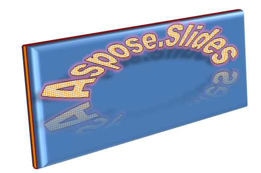

## **Tổng quan**

Hiệu ứng WordArt cho phép bạn thêm văn bản có kiểu dáng hấp dẫn và trực quan vào bản trình bày PowerPoint của mình. Với Aspose.Slides, các nhà phát triển có thể tạo, tùy chỉnh và quản lý WordArt một cách lập trình, giống như trong Microsoft PowerPoint—mà không cần cài đặt Office. Bài viết này cung cấp tổng quan về cách làm việc với WordArt, bao gồm cách áp dụng các biến đổi văn bản, kiểu tô đầy, viền, bóng đổ và các tùy chọn định dạng khác để làm cho nội dung bản trình bày trở nên biểu cảm và hấp dẫn hơn. WordArt cho phép bạn coi văn bản như một đối tượng đồ họa. Nó bao gồm các hiệu ứng hoặc sửa đổi đặc biệt được áp dụng lên văn bản để làm cho nó hấp dẫn hoặc nổi bật hơn.

## **Tạo một mẫu WordArt đơn giản và áp dụng nó vào văn bản**

**Using Aspose.Slides** 

Đầu tiên, chúng ta tạo một văn bản đơn giản bằng mã PHP sau:

```php
  $pres = new Presentation();
  try {
    $slide = $pres->getSlides()->get_Item(0);
    $autoShape = $slide->getShapes()->addAutoShape(ShapeType::Rectangle, 200, 200, 400, 200);
    $textFrame = $autoShape->getTextFrame();
    $portion = $textFrame->getParagraphs()->get_Item(0)->getPortions()->get_Item(0);
    $portion->setText("Aspose.Slides");
  } finally {
    if (!java_is_null($pres)) {
      $pres->dispose();
    }
  }
```
Bây giờ, chúng ta đặt kích thước phông chữ của văn bản lên giá trị lớn hơn để làm cho hiệu ứng rõ nét hơn bằng mã sau:

```php
  $fontData = new FontData("Arial Black");
  $portion->getPortionFormat()->setLatinFont($fontData);
  $portion->getPortionFormat()->setFontHeight(36);

```

**Using Microsoft PowerPoint**

Đi tới menu hiệu ứng WordArt trong Microsoft PowerPoint:


Từ menu bên phải, bạn có thể chọn một hiệu ứng WordArt đã được định trước. Từ menu bên trái, bạn có thể chỉ định các cài đặt cho một WordArt mới.

Đây là một số tham số hoặc tùy chọn có sẵn:


**Using Aspose.Slides**

Ở đây, chúng ta áp dụng màu mẫu [SmallGrid](https://reference.aspose.com/slides/vi/php-java/aspose.slides/patternstyle/#SmallGrid) cho văn bản và thêm viền văn bản màu đen dày 1 bằng mã sau:

```php
  $portion->getPortionFormat()->getFillFormat()->setFillType(FillType::Pattern);
  $portion->getPortionFormat()->getFillFormat()->getPatternFormat()->getForeColor()->setColor(java("java.awt.Color")->ORANGE);
  $portion->getPortionFormat()->getFillFormat()->getPatternFormat()->getBackColor()->setColor(java("java.awt.Color")->WHITE);
  $portion->getPortionFormat()->getFillFormat()->getPatternFormat()->setPatternStyle(PatternStyle->SmallGrid);
  $portion->getPortionFormat()->getLineFormat()->getFillFormat()->setFillType(FillType::Solid);
  $portion->getPortionFormat()->getLineFormat()->getFillFormat()->getSolidFillColor()->setColor(java("java.awt.Color")->BLACK);

```

Văn bản kết quả:


## **Áp dụng các hiệu ứng WordArt khác**

**Using Microsoft PowerPoint**

Từ giao diện của chương trình, bạn có thể áp dụng các hiệu ứng này lên văn bản, khối văn bản, hình dạng hoặc phần tử tương tự:


Ví dụ, các hiệu ứng Bóng đổ, Phản chiếu và Hào quang có thể được áp dụng lên văn bản; các hiệu ứng Định dạng 3D và Xoay 3D có thể được áp dụng lên khối văn bản; thuộc tính Soft Edges (Cạnh mềm) có thể được áp dụng cho Đối tượng Shape (vẫn có hiệu ứng ngay cả khi không đặt thuộc tính Định dạng 3D).

### **Áp dụng hiệu ứng Bóng đổ**

Ở đây, chúng ta chỉ định các thuộc tính liên quan đến văn bản. Chúng ta áp dụng hiệu ứng bóng đổ lên văn bản bằng mã sau :

```php
  $portion->getPortionFormat()->getEffectFormat()->enableOuterShadowEffect();
  $portion->getPortionFormat()->getEffectFormat()->getOuterShadowEffect()->getShadowColor()->setColor(java("java.awt.Color")->BLACK);
  $portion->getPortionFormat()->getEffectFormat()->getOuterShadowEffect()->setScaleHorizontal(100);
  $portion->getPortionFormat()->getEffectFormat()->getOuterShadowEffect()->setScaleVertical(65);
  $portion->getPortionFormat()->getEffectFormat()->getOuterShadowEffect()->setBlurRadius(4.73);
  $portion->getPortionFormat()->getEffectFormat()->getOuterShadowEffect()->setDirection(230);
  $portion->getPortionFormat()->getEffectFormat()->getOuterShadowEffect()->setDistance(2);
  $portion->getPortionFormat()->getEffectFormat()->getOuterShadowEffect()->setSkewHorizontal(30);
  $portion->getPortionFormat()->getEffectFormat()->getOuterShadowEffect()->setSkewVertical(0);
  $portion->getPortionFormat()->getEffectFormat()->getOuterShadowEffect()->getShadowColor()->getColorTransform()->add(ColorTransformOperation->SetAlpha, 0.32);

```

API Aspose.Slides hỗ trợ ba loại bóng: OuterShadow, InnerShadow và PresetShadow.

Với PresetShadow, bạn có thể áp dụng bóng cho văn bản (sử dụng các giá trị định trước).

**Using Microsoft PowerPoint**

Trong PowerPoint, bạn có thể sử dụng một loại bóng. Đây là một ví dụ:


**Using Aspose.Slides**

Thực tế, Aspose.Slides cho phép bạn áp dụng đồng thời hai loại bóng: InnerShadow và PresetShadow.

**Lưu ý:**

- Khi OuterShadow và PresetShadow được sử dụng cùng nhau, chỉ hiệu ứng OuterShadow được áp dụng. 
- Nếu OuterShadow và InnerShadow được sử dụng đồng thời, hiệu ứng kết quả phụ thuộc vào phiên bản PowerPoint. Ví dụ, trong PowerPoint 2013, hiệu ứng được nhân đôi. Nhưng trong PowerPoint 2007, hiệu ứng OuterShadow được áp dụng. 

### **Áp dụng hiệu ứng Phản chiếu cho Văn bản**

Chúng tôi thêm hiệu ứng hiển thị vào văn bản bằng mẫu mã sau :

```php
  $portion->getPortionFormat()->getEffectFormat()->enableReflectionEffect();
  $portion->getPortionFormat()->getEffectFormat()->getReflectionEffect()->setBlurRadius(0.5);
  $portion->getPortionFormat()->getEffectFormat()->getReflectionEffect()->setDistance(4.72);
  $portion->getPortionFormat()->getEffectFormat()->getReflectionEffect()->setStartPosAlpha(0.0);
  $portion->getPortionFormat()->getEffectFormat()->getReflectionEffect()->setEndPosAlpha(60.0);
  $portion->getPortionFormat()->getEffectFormat()->getReflectionEffect()->setDirection(90);
  $portion->getPortionFormat()->getEffectFormat()->getReflectionEffect()->setScaleHorizontal(100);
  $portion->getPortionFormat()->getEffectFormat()->getReflectionEffect()->setScaleVertical(-100);
  $portion->getPortionFormat()->getEffectFormat()->getReflectionEffect()->setStartReflectionOpacity(60.0);
  $portion->getPortionFormat()->getEffectFormat()->getReflectionEffect()->setEndReflectionOpacity(0.9);
  $portion->getPortionFormat()->getEffectFormat()->getReflectionEffect()->setRectangleAlign(RectangleAlignment->BottomLeft);
```

### **Áp dụng hiệu ứng Hào quang cho Văn bản**

Chúng tôi áp dụng hiệu ứng hào quang vào văn bản để làm nó sáng hoặc nổi bật bằng mã sau:

```php
  $portion->getPortionFormat()->getEffectFormat()->enableGlowEffect();
  $portion->getPortionFormat()->getEffectFormat()->getGlowEffect()->getColor()->setR(255);
  $portion->getPortionFormat()->getEffectFormat()->getGlowEffect()->getColor()->getColorTransform()->add(ColorTransformOperation->SetAlpha, 0.54);
  $portion->getPortionFormat()->getEffectFormat()->getGlowEffect()->setRadius(7);

```

Kết quả của thao tác:


{} 
Bạn có thể thay đổi các tham số cho bóng, hiển thị và hào quang. Các thuộc tính của hiệu ứng được đặt riêng cho mỗi phần của văn bản. 
{} 

### **Sử dụng biến đổi trong WordArt**

Chúng tôi sử dụng thuộc tính Transform (áp dụng cho toàn bộ khối văn bản) qua mã sau:

```php
  $textFrame->getTextFrameFormat()->setTransform(TextShapeType::ArchUpPour);
```

Kết quả:


{} 
Cả Microsoft PowerPoint và Aspose.Slides cho PHP thông qua Java đều cung cấp một số loại biến đổi đã được định trước. 
{} 

**Using PowerPoint**

Để truy cập các loại biến đổi đã được định trước, hãy thực hiện: **Format** -> **TextEffect** -> **Transform**

**Using Aspose.Slides**

Để chọn một loại biến đổi, sử dụng enum TextShapeType. 

### **Áp dụng hiệu ứng 3D cho Văn bản và Hình dạng**

Chúng tôi đặt hiệu ứng 3D cho một hình dạng văn bản bằng mẫu mã sau:

```php
  $autoShape->getThreeDFormat()->getBevelBottom()->setBevelType(BevelPresetType::Circle);
  $autoShape->getThreeDFormat()->getBevelBottom()->setHeight(10.5);
  $autoShape->getThreeDFormat()->getBevelBottom()->setWidth(10.5);
  $autoShape->getThreeDFormat()->getBevelTop()->setBevelType(BevelPresetType::Circle);
  $autoShape->getThreeDFormat()->getBevelTop()->setHeight(12.5);
  $autoShape->getThreeDFormat()->getBevelTop()->setWidth(11);
  $autoShape->getThreeDFormat()->getExtrusionColor()->setColor(java("java.awt.Color")->ORANGE);
  $autoShape->getThreeDFormat()->setExtrusionHeight(6);
  $autoShape->getThreeDFormat()->getContourColor()->setColor(java("java.awt.Color")->RED);
  $autoShape->getThreeDFormat()->setContourWidth(1.5);
  $autoShape->getThreeDFormat()->setDepth(3);
  $autoShape->getThreeDFormat()->setMaterial(MaterialPresetType::Plastic);
  $autoShape->getThreeDFormat()->getLightRig()->setDirection(LightingDirection::Top);
  $autoShape->getThreeDFormat()->getLightRig()->setLightType(LightRigPresetType::Balanced);
  $autoShape->getThreeDFormat()->getLightRig()->setRotation(0, 0, 40);
  $autoShape->getThreeDFormat()->getCamera()->setCameraType(CameraPresetType::PerspectiveContrastingRightFacing);
```

Văn bản và hình dạng kết quả:



Chúng tôi áp dụng hiệu ứng 3D cho văn bản bằng mã PHP sau:

```php
  $textFrame->getTextFrameFormat()->getThreeDFormat()->getBevelBottom()->setBevelType(BevelPresetType::Circle);
  $textFrame->getTextFrameFormat()->getThreeDFormat()->getBevelBottom()->setHeight(3.5);
  $textFrame->getTextFrameFormat()->getThreeDFormat()->getBevelBottom()->setWidth(3.5);
  $textFrame->getTextFrameFormat()->getThreeDFormat()->getBevelTop()->setBevelType(BevelPresetType::Circle);
  $textFrame->getTextFrameFormat()->getThreeDFormat()->getBevelTop()->setHeight(4);
  $textFrame->getTextFrameFormat()->getThreeDFormat()->getBevelTop()->setWidth(4);
  $textFrame->getTextFrameFormat()->getThreeDFormat()->getExtrusionColor()->setColor(java("java.awt.Color")->ORANGE);
  $textFrame->getTextFrameFormat()->getThreeDFormat()->setExtrusionHeight(6);
  $textFrame->getTextFrameFormat()->getThreeDFormat()->getContourColor()->setColor(java("java.awt.Color")->RED);
  $textFrame->getTextFrameFormat()->getThreeDFormat()->setContourWidth(1.5);
  $textFrame->getTextFrameFormat()->getThreeDFormat()->setDepth(3);
  $textFrame->getTextFrameFormat()->getThreeDFormat()->setMaterial(MaterialPresetType::Plastic);
  $textFrame->getTextFrameFormat()->getThreeDFormat()->getLightRig()->setDirection(LightingDirection::Top);
  $textFrame->getTextFrameFormat()->getThreeDFormat()->getLightRig()->setLightType(LightRigPresetType::Balanced);
  $textFrame->getTextFrameFormat()->getThreeDFormat()->getLightRig()->setRotation(0, 0, 40);
  $textFrame->getTextFrameFormat()->getThreeDFormat()->getCamera()->setCameraType(CameraPresetType::PerspectiveContrastingRightFacing);
```

Kết quả của thao tác:


{} 
Việc áp dụng hiệu ứng 3D cho văn bản hoặc các hình dạng của chúng và sự tương tác giữa các hiệu ứng dựa trên một số quy tắc.

Xem xét một cảnh cho văn bản và hình dạng chứa văn bản đó. Hiệu ứng 3D bao gồm biểu diễn đối tượng 3D và cảnh mà đối tượng được đặt lên.

- Khi cảnh được đặt cho cả hình và văn bản, cảnh của hình có ưu tiên cao hơn — cảnh của văn bản bị bỏ qua.
- Khi hình không có cảnh riêng nhưng có biểu diễn 3D, thì cảnh của văn bản được sử dụng.
- Ngược lại — khi hình ban đầu không có hiệu ứng 3D — hình sẽ phẳng và hiệu ứng 3D chỉ được áp dụng cho văn bản.

Các mô tả này liên quan đến các phương thức ThreeDFormat.getLightRig() và ThreeDFormat.getCamera(). 
{} 

## **Áp dụng hiệu ứng Outer Shadow cho Văn bản**
Aspose.Slides cho PHP thông qua Java cung cấp các lớp [OuterShadow](https://reference.aspose.com/slides/vi/php-java/aspose.slides/outershadow/) và [InnerShadow](https://reference.aspose.com/slides/vi/php-java/aspose.slides/innershadow/) cho phép bạn áp dụng hiệu ứng bóng cho một văn bản được chứa trong [TextFrame](https://reference.aspose.com/slides/vi/php-java/aspose.slides/textframe/). Thực hiện các bước sau:

1. Tạo một thể hiện của lớp [Presentation](https://reference.aspose.com/slides/vi/php-java/aspose.slides/presentation/). 
2. Lấy tham chiếu của một slide bằng cách sử dụng chỉ mục của nó. 
3. Thêm một AutoShape loại Rectangle vào slide. 
4. Truy cập TextFrame liên quan tới AutoShape. 
5. Đặt FillType của AutoShape thành NoFill. 
6. Tạo thể hiện lớp OuterShadow 
7. Đặt BlurRadius cho bóng. 
8. Đặt Direction cho bóng 
9. Đặt Distance cho bóng. 
10. Đặt RectanglelAlign thành TopLeft. 
11. Đặt PresetColor của bóng thành Black. 
12. Ghi bản trình bày dưới dạng tệp [PPTX](https://docs.fileformat.com/presentation/pptx/) file.

```php
  $pres = new Presentation();
  try {
    # Lấy tham chiếu của slide
    $sld = $pres->getSlides()->get_Item(0);
    # Thêm một AutoShape loại Rectangle
    $ashp = $sld->getShapes()->addAutoShape(ShapeType::Rectangle, 150, 75, 150, 50);
    # Thêm TextFrame vào Rectangle
    $ashp->addTextFrame("Aspose TextBox");
    # Tắt độ đổ màu của hình dạng trong trường hợp chúng ta muốn lấy bóng cho văn bản
    $ashp->getFillFormat()->setFillType(FillType::NoFill);
    # Thêm bóng ngoài và đặt tất cả các tham số cần thiết
    $ashp->getEffectFormat()->enableOuterShadowEffect();
    $shadow = $ashp->getEffectFormat()->getOuterShadowEffect();
    $shadow->setBlurRadius(4.0);
    $shadow->setDirection(45);
    $shadow->setDistance(3);
    $shadow->setRectangleAlign(RectangleAlignment->TopLeft);
    $shadow->getShadowColor()->setPresetColor(PresetColor->Black);
    # Ghi bản trình bày ra đĩa
    $pres->save("pres_out.pptx", SaveFormat::Pptx);
  } finally {
    if (!java_is_null($pres)) {
      $pres->dispose();
    }
  }
```

## **Áp dụng hiệu ứng Inner Shadow cho Hình dạng**
Thực hiện các bước sau:

1. Tạo một thể hiện của lớp [Presentation](https://reference.aspose.com/slides/vi/php-java/aspose.slides/presentation/). 
2. Lấy tham chiếu của slide. 
3. Thêm một AutoShape loại Rectangle. 
4. Bật InnerShadowEffect. 
5. Đặt tất cả các tham số cần thiết. 
6. Đặt ColorType thành Scheme. 
7. Đặt Scheme Color. 
8. Ghi bản trình bày dưới dạng tệp [PPTX](https://docs.fileformat.com/presentation/pptx/) file.

```php
  $pres = new Presentation();
  try {
    # Lấy tham chiếu của slide
    $slide = $pres->getSlides()->get_Item(0);
    # Thêm một AutoShape loại Rectangle
    $ashp = $slide->getShapes()->addAutoShape(ShapeType::Rectangle, 150, 75, 400, 300);
    $ashp->getFillFormat()->setFillType(FillType::NoFill);
    # Thêm TextFrame vào Rectangle
    $ashp->addTextFrame("Aspose TextBox");
    $port = $ashp->getTextFrame()->getParagraphs()->get_Item(0)->getPortions()->get_Item(0);
    $pf = $port->getPortionFormat();
    $pf->setFontHeight(50);
    # Kích hoạt InnerShadowEffect
    $ef = $pf->getEffectFormat();
    $ef->enableInnerShadowEffect();
    # Đặt tất cả các tham số cần thiết
    $ef->getInnerShadowEffect()->setBlurRadius(8.0);
    $ef->getInnerShadowEffect()->setDirection(90.0);
    $ef->getInnerShadowEffect()->setDistance(6.0);
    $ef->getInnerShadowEffect()->getShadowColor()->setB(189);
    # Đặt ColorType là Scheme
    $ef->getInnerShadowEffect()->getShadowColor()->setColorType(ColorType::Scheme);
    # Đặt Scheme Color
    $ef->getInnerShadowEffect()->getShadowColor()->setSchemeColor(SchemeColor->Accent1);
    # Lưu bản trình bày
    $pres->save("WordArt_out.pptx", SaveFormat::Pptx);
  } finally {
    if (!java_is_null($pres)) {
      $pres->dispose();
    }
  }
```

## **Câu hỏi thường gặp**

**Tôi có thể sử dụng hiệu ứng WordArt với các phông chữ hoặc tập lệnh khác nhau (ví dụ: Ả Rập, Trung Quốc) không?**

Có, Aspose.Slides hỗ trợ Unicode và làm việc với mọi phông chữ và tập lệnh chính. Các hiệu ứng WordArt như bóng, tô đầy và viền có thể được áp dụng bất kể ngôn ngữ, dù việc có sẵn phông chữ và việc render có thể phụ thuộc vào phông chữ hệ thống.

**Tôi có thể áp dụng hiệu ứng WordArt cho các yếu tố của slide master không?**

Có, bạn có thể áp dụng hiệu ứng WordArt cho các hình dạng trên slide master, bao gồm các trình giữ chỗ tiêu đề, chân trang hoặc văn bản nền. Các thay đổi được thực hiện trên bố cục master sẽ được phản ánh trên tất cả các slide liên quan.

**Hiệu ứng WordArt có ảnh hưởng đến kích thước tệp trình bày không?**

Một chút. Các hiệu ứng WordArt như bóng, hào quang và tô đầy gradient có thể làm tăng nhẹ kích thước tệp do thêm metadata định dạng, nhưng sự khác biệt thường không đáng kể.

**Tôi có thể xem trước kết quả của hiệu ứng WordArt mà không lưu bản trình bày không?**

Có, bạn có thể render các slide chứa WordArt thành hình ảnh (ví dụ: PNG, JPEG) bằng phương thức `getImage` từ các lớp [Shape](https://reference.aspose.com/slides/vi/php-java/aspose.slides/shape/) hoặc [Slide](https://reference.aspose.com/slides/vi/php-java/aspose.slides/slide/). Điều này cho phép bạn xem trước kết quả trong bộ nhớ hoặc trên màn hình trước khi lưu hoặc xuất bản trình bày đầy đủ.