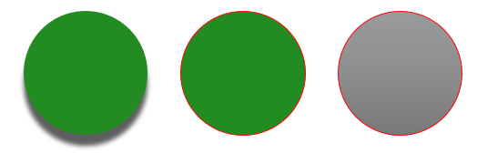

## **Giới thiệu**

Một chủ đề bài thuyết trình xác định các thuộc tính của các yếu tố thiết kế. Khi bạn chọn một chủ đề bài thuyết trình, về cơ bản bạn đang chọn một tập hợp cụ thể các yếu tố trực quan và các thuộc tính của chúng.

Trong PowerPoint, một chủ đề bao gồm màu sắc, [fonts](/slides/vi/php-java/powerpoint-fonts/), [background styles](/slides/vi/php-java/presentation-background/), và hiệu ứng.


## **Thay đổi màu sắc Theme**

Một chủ đề PowerPoint sử dụng một tập hợp màu sắc cụ thể cho các yếu tố khác nhau trên một slide. Nếu bạn không thích các màu sắc, bạn có thể thay đổi chúng bằng cách áp dụng màu mới cho chủ đề. Để cho phép bạn chọn màu sắc theme mới, Aspose.Slides cung cấp các giá trị dưới danh sách [SchemeColor](https://reference.aspose.com/slides/vi/php-java/aspose.slides/SchemeColor).

Đoạn mã PHP này cho thấy cách thay đổi màu nhấn cho một theme:

```php
  $pres = new Presentation();
  try {
    $shape = $pres->getSlides()->get_Item(0)->getShapes()->addAutoShape(ShapeType::Rectangle, 10, 10, 100, 100);
    $shape->getFillFormat()->setFillType(FillType::Solid);
    $shape->getFillFormat()->getSolidFillColor()->setSchemeColor(SchemeColor->Accent4);
  } finally {
    if (!java_is_null($pres)) {
      $pres->dispose();
    }
  }
```

Bạn có thể xác định giá trị thực tế của màu kết quả theo cách này:

```php
  $fillEffective = $shape->getFillFormat()->getEffective();
  $effectiveColor = $fillEffective->getSolidFillColor();
  echo(sprintf("Color [A=%d, R=%d, G=%d, B=%d]", $effectiveColor->getAlpha(), $effectiveColor->getRed(), $effectiveColor->getGreen(), $effectiveColor->getBlue()));

```

Để minh họa thêm thao tác thay đổi màu, chúng tôi tạo một yếu tố khác và gán màu nhấn (từ thao tác ban đầu) cho nó. Sau đó chúng tôi thay đổi màu trong theme:

```php
  $otherShape = $pres->getSlides()->get_Item(0)->getShapes()->addAutoShape(ShapeType::Rectangle, 10, 120, 100, 100);
  $otherShape->getFillFormat()->setFillType(FillType::Solid);
  $otherShape->getFillFormat()->getSolidFillColor()->setSchemeColor(SchemeColor->Accent4);
  $pres->getMasterTheme()->getColorScheme()->getAccent4()->setColor(java("java.awt.Color")->RED);
```

Màu mới sẽ được áp dụng tự động cho cả hai yếu tố.

### **Đặt màu Theme từ Bảng màu bổ sung**

Khi bạn áp dụng các phép biến đổi độ sáng cho màu theme chính(1), các màu từ bảng màu bổ sung(2) sẽ được tạo ra. Bạn có thể đặt và lấy các màu theme đó.


**1** - Màu theme chính

**2** - Màu từ bảng màu bổ sung.

Đoạn mã PHP này minh họa một thao tác trong đó các màu từ bảng màu bổ sung được lấy từ màu theme chính và sau đó được sử dụng trong các hình dạng:

```php
  $presentation = new Presentation();
  try {
    $slide = $presentation->getSlides()->get_Item(0);
    # Accent 4
    $shape1 = $slide->getShapes()->addAutoShape(ShapeType::Rectangle, 10, 10, 50, 50);
    $shape1->getFillFormat()->setFillType(FillType::Solid);
    $shape1->getFillFormat()->getSolidFillColor()->setSchemeColor(SchemeColor->Accent4);
    # Accent 4, Sáng hơn 80%
    $shape2 = $slide->getShapes()->addAutoShape(ShapeType::Rectangle, 10, 70, 50, 50);
    $shape2->getFillFormat()->setFillType(FillType::Solid);
    $shape2->getFillFormat()->getSolidFillColor()->setSchemeColor(SchemeColor->Accent4);
    $shape2->getFillFormat()->getSolidFillColor()->getColorTransform()->add(ColorTransformOperation->MultiplyLuminance, 0.2);
    $shape2->getFillFormat()->getSolidFillColor()->getColorTransform()->add(ColorTransformOperation->AddLuminance, 0.8);
    # Accent 4, Sáng hơn 60%
    $shape3 = $slide->getShapes()->addAutoShape(ShapeType::Rectangle, 10, 130, 50, 50);
    $shape3->getFillFormat()->setFillType(FillType::Solid);
    $shape3->getFillFormat()->getSolidFillColor()->setSchemeColor(SchemeColor->Accent4);
    $shape3->getFillFormat()->getSolidFillColor()->getColorTransform()->add(ColorTransformOperation->MultiplyLuminance, 0.4);
    $shape3->getFillFormat()->getSolidFillColor()->getColorTransform()->add(ColorTransformOperation->AddLuminance, 0.6);
    # Accent 4, Sáng hơn 40%
    $shape4 = $slide->getShapes()->addAutoShape(ShapeType::Rectangle, 10, 190, 50, 50);
    $shape4->getFillFormat()->setFillType(FillType::Solid);
    $shape4->getFillFormat()->getSolidFillColor()->setSchemeColor(SchemeColor->Accent4);
    $shape4->getFillFormat()->getSolidFillColor()->getColorTransform()->add(ColorTransformOperation->MultiplyLuminance, 0.6);
    $shape4->getFillFormat()->getSolidFillColor()->getColorTransform()->add(ColorTransformOperation->AddLuminance, 0.4);
    # Accent 4, Đậm hơn 25%
    $shape5 = $slide->getShapes()->addAutoShape(ShapeType::Rectangle, 10, 250, 50, 50);
    $shape5->getFillFormat()->setFillType(FillType::Solid);
    $shape5->getFillFormat()->getSolidFillColor()->setSchemeColor(SchemeColor->Accent4);
    $shape5->getFillFormat()->getSolidFillColor()->getColorTransform()->add(ColorTransformOperation->MultiplyLuminance, 0.75);
    # Accent 4, Đậm hơn 50%
    $shape6 = $slide->getShapes()->addAutoShape(ShapeType::Rectangle, 10, 310, 50, 50);
    $shape6->getFillFormat()->setFillType(FillType::Solid);
    $shape6->getFillFormat()->getSolidFillColor()->setSchemeColor(SchemeColor->Accent4);
    $shape6->getFillFormat()->getSolidFillColor()->getColorTransform()->add(ColorTransformOperation->MultiplyLuminance, 0.5);
    $presentation->save($path . "example_accent4.pptx", SaveFormat::Pptx);
  } finally {
    if (!java_is_null($presentation)) {
      $presentation->dispose();
    }
  }
```

### **Ánh xạ `SchemeColor` tới các màu `ColorScheme`**

Khi bạn làm việc với [SchemeColor](https://reference.aspose.com/slides/vi/php-java/aspose.slides/schemecolor/), bạn có thể nhận thấy nó chứa các giá trị màu theme sau:

`Background1`, `Background2`, `Text1`, và `Text2`.

Tuy nhiên, `Presentation::getMasterTheme()::getColorScheme()` trả về [ColorScheme](https://reference.aspose.com/slides/vi/php-java/aspose.slides/colorscheme/), trong đó các màu tương ứng được hiển thị là:

`Dark1`, `Dark2`, `Light1`, và `Light2`.

Sự khác nhau này chỉ ở tên gọi. Các giá trị này đề cập đến cùng các vị trí màu theme và ánh xạ là cố định:

* `Text1` = `Dark1`
* `Background1` = `Light1`
* `Text2` = `Dark2`
* `Background2` = `Light2`

Không có chuyển đổi động nào giữa `Text`/`Background` và `Dark`/`Light`. Chúng chỉ là các tên thay thế cho cùng các màu theme.

Sự khác biệt về tên gọi này bắt nguồn từ thuật ngữ của Microsoft Office. Các phiên bản Office cũ sử dụng `Dark 1`, `Light 1`, `Dark 2`, và `Light 2`, trong khi các giao diện UI mới hiển thị cùng các vị trí này dưới dạng `Text 1`, `Background 1`, `Text 2`, và `Background 2`.

## **Thay đổi Font Theme**

Để cho phép bạn chọn phông chữ cho các theme và các mục đích khác, Aspose.Slides sử dụng các định danh đặc biệt này (tương tự như những gì được sử dụng trong PowerPoint):

* **+mn-lt** - Font Latin cho nội dung (Minor Latin Font)
* **+mj-lt** - Font Latin cho tiêu đề (Major Latin Font)
* **+mn-ea** - Font Đông Á cho nội dung (Minor East Asian Font)
* **+mj-ea** - Font Đông Á cho tiêu đề (Major East Asian Font)

Đoạn mã PHP này cho thấy cách gán phông Latin cho một yếu tố theme:

```php
  $shape = $pres->getSlides()->get_Item(0)->getShapes()->addAutoShape(ShapeType::Rectangle, 10, 10, 100, 100);
  $paragraph = new Paragraph();
  $portion = new Portion("Theme text format");
  $paragraph->getPortions()->add($portion);
  $shape->getTextFrame()->getParagraphs()->add($paragraph);
  $portion->getPortionFormat()->setLatinFont(new FontData("+mn-lt"));
```

Đoạn mã PHP này cho thấy cách thay đổi phông chữ của theme bài thuyết trình:

```php
  $pres->getMasterTheme()->getFontScheme()->getMinor()->setLatinFont(new FontData("Arial"));

```

Phông chữ trong tất cả các hộp văn bản sẽ được cập nhật.

{} 
Bạn có thể muốn xem [PowerPoint fonts](/slides/vi/php-java/powerpoint-fonts/).
{}

## **Thay đổi Kiểu Nền Theme**

Mặc định, ứng dụng PowerPoint cung cấp 12 nền được định sẵn nhưng chỉ 3 trong số 12 nền đó được lưu trong một bài thuyết trình điển hình. 


Ví dụ, sau khi bạn lưu một bài thuyết trình trong ứng dụng PowerPoint, bạn có thể chạy đoạn mã PHP này để biết số lượng nền định sẵn có trong bài thuyết trình:

```php
  $pres = new Presentation("pres.pptx");
  try {
    $numberOfBackgroundFills = $pres->getMasterTheme()->getFormatScheme()->getBackgroundFillStyles()->size();
    echo("Number of background fill styles for theme is " . $numberOfBackgroundFills);
  } finally {
    if (!java_is_null($pres)) {
      $pres->dispose();
    }
  }
```

{} 
Bằng cách sử dụng thuộc tính [BackgroundFillStyles](https://reference.aspose.com/slides/vi/php-java/aspose.slides/FormatScheme#getBackgroundFillStyles--) từ lớp [FormatScheme](https://reference.aspose.com/slides/vi/php-java/aspose.slides/FormatScheme), bạn có thể thêm hoặc truy cập kiểu nền trong một theme PowerPoint.
{} 

Đoạn mã PHP này cho thấy cách đặt nền cho một bài thuyết trình:

```php
  $pres->getMasters()->get_Item(0)->getBackground()->setStyleIndex(2);
```

**Hướng dẫn chỉ mục**: 0 được dùng cho không có nền. Chỉ mục bắt đầu từ 1.

{} 
Bạn có thể muốn xem [PowerPoint Background](/slides/vi/php-java/presentation-background/).
{}

## **Thay đổi Hiệu Ứng Theme**

Một theme PowerPoint thường chứa 3 giá trị cho mỗi mảng kiểu. Các mảng này được kết hợp thành 3 hiệu ứng: subtle, moderate, và intense. Ví dụ, đây là kết quả khi các hiệu ứng được áp dụng cho một hình dạng cụ thể:


Bằng cách sử dụng 3 thuộc tính ([FillStyles](https://reference.aspose.com/slides/vi/php-java/aspose.slides/FormatScheme#getFillStyles--), [LineStyles](https://reference.aspose.com/slides/vi/php-java/aspose.slides/FormatScheme#getLineStyles--), [EffectStyles](https://reference.aspose.com/slides/vi/php-java/aspose.slides/FormatScheme#getEffectStyles--)) từ lớp [FormatScheme](https://reference.aspose.com/slides/vi/php-java/aspose.slides/FormatScheme) bạn có thể thay đổi các yếu tố trong một theme (cậm linh hơn so với các tùy chọn trong PowerPoint).

Đoạn mã PHP này cho thấy cách thay đổi một hiệu ứng theme bằng cách điều chỉnh các phần của yếu tố:

```php
  $pres = new Presentation("Subtle_Moderate_Intense.pptx");
  try {
    $pres->getMasterTheme()->getFormatScheme()->getLineStyles()->get_Item(0)->getFillFormat()->getSolidFillColor()->setColor(java("java.awt.Color")->RED);
    $pres->getMasterTheme()->getFormatScheme()->getFillStyles()->get_Item(2)->setFillType(FillType::Solid);
    $pres->getMasterTheme()->getFormatScheme()->getFillStyles()->get_Item(2)->getSolidFillColor()->setColor(java("java.awt.Color")->GREEN);
    $pres->getMasterTheme()->getFormatScheme()->getEffectStyles()->get_Item(2)->getEffectFormat()->getOuterShadowEffect()->setDistance(10.0);
    $pres->save("Design_04_Subtle_Moderate_Intense-out.pptx", SaveFormat::Pptx);
  } finally {
    if (!java_is_null($pres)) {
      $pres->dispose();
    }
  }
```

Các thay đổi kết quả trong màu nền, kiểu nền, hiệu ứng đổ bóng, v.v.:



## **Câu Hỏi Thường Gặp**

**Tôi có thể áp dụng một theme cho một slide riêng mà không thay đổi master không?**

Có. Aspose.Slides hỗ trợ ghi đè theme ở cấp slide, vì vậy bạn có thể áp dụng một theme cục bộ chỉ cho slide đó trong khi giữ nguyên theme master (thông qua [SlideThemeManager](https://reference.aspose.com/slides/vi/php-java/aspose.slides/slidethememanager/)).

**Cách an toàn nhất để chuyển theme từ bài thuyết trình này sang bài thuyết trình khác là gì?**

[Clone slides](/slides/vi/php-java/clone-slides/) cùng với master của chúng vào bài thuyết trình đích. Điều này bảo tồn master, bố cục và theme liên quan để giao diện vẫn nhất quán.

**Làm sao tôi có thể xem các giá trị "effective" sau mọi kế thừa và ghi đè?**

Sử dụng các ["effective" views](/slides/vi/php-java/shape-effective-properties/) của API cho theme/màu/font/hiệu ứng. Những view này trả về các thuộc tính đã được giải quyết, cuối cùng sau khi áp dụng master và bất kỳ ghi đè cục bộ nào.