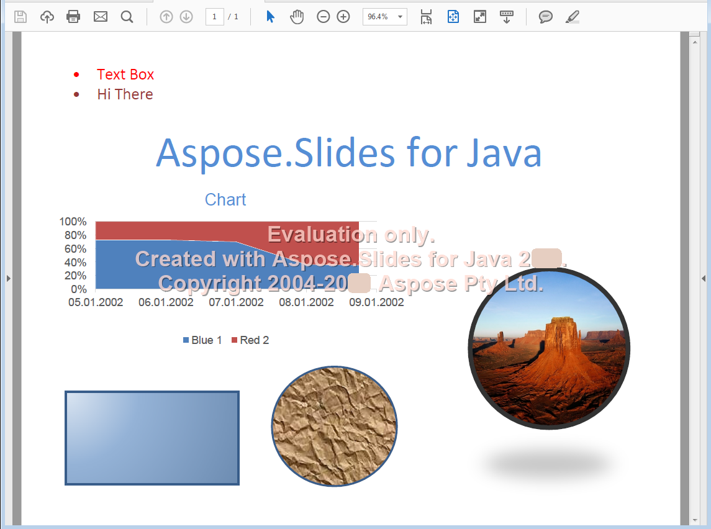

{} 

Portable Document Format là một định dạng tệp được tạo ra bởi Adobe Systems để trao đổi tài liệu giữa các tổ chức. Mục đích của định dạng này là giữ nguyên nội dung và bố cục, bất kể nền tảng nào mà nó được xem. Aspose.Slides for PHP via Java cho phép bạn chuyển đổi các tệp trình chiếu sang PDF.

{} 

## **PDF trong Aspose.Slides cho PHP qua Java**
Bất kỳ bản trình chiếu nào có thể được tải vào Aspose.Slides for PHP via Java đều có thể chuyển đổi sang PDF tuân thủ [PDF 1.5](https://en.wikipedia.org/wiki/PDF/A), [PDF/A-1a](https://en.wikipedia.org/wiki/PDF/A), [PDF/A-1b](https://en.wikipedia.org/wiki/PDF/A) hoặc [PDF/UA](https://en.wikipedia.org/wiki/PDF/UA) tùy theo lựa chọn của bạn. Aspose.Slides for PHP via Java xuất bản trình chiếu sang PDF và trong hầu hết các trường hợp, PDF đầu ra trông giống hệt bản trình chiếu gốc.

Aspose.Slides hỗ trợ các tính năng trình chiếu sau khi chuyển đổi sang PDF:

- Hình ảnh, hộp văn bản và các hình dạng khác.
- Văn bản và định dạng.
- Đoạn văn và định dạng.
- Liên kết siêu văn bản.
- Đầu trang và chân trang.
- Dấu đầu dòng.
- Bảng.

Bạn có thể xuất bản trình chiếu sang PDF trực tiếp bằng Aspose.Slides for PHP via Java: bạn không cần bất kỳ thành phần nào khác. Hơn nữa, bạn có thể tùy chỉnh việc xuất bản trình chiếu sang PDF với nhiều tùy chọn khác nhau như được giải thích trong [Converting to PDF](/slides/vi/php-java/convert-powerpoint-to-pdf/).

**Bản trình chiếu đầu vào** 

**Bản trình chiếu được chuyển đổi sang PDF bằng Aspose.Slides cho PHP qua Java** 

