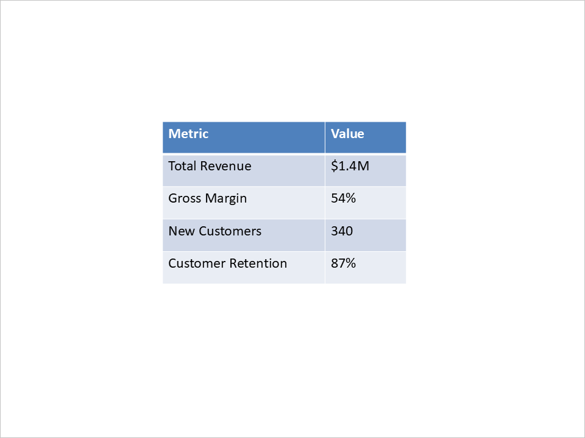

## **Giới thiệu**

Tạo bài thuyết trình PowerPoint thủ công có thể tốn thời gian và lặp đi lặp lại—đặc biệt khi nội dung dựa trên dữ liệu động thường xuyên thay đổi. Cho dù là tạo báo cáo kinh doanh hàng tuần, biên soạn tài liệu giáo dục, hay tạo bộ slide bán hàng sẵn sàng cho khách hàng, tự động hoá có thể tiết kiệm vô số giờ và đảm bảo tính nhất quán giữa các đội.

Đối với các nhà phát triển PHP, tự động hoá việc tạo bài thuyết trình PowerPoint mở ra những khả năng mạnh mẽ. Bạn có thể tích hợp việc tạo slide vào các cổng web, deskt op tools, dịch vụ backend, hoặc nền tảng đám mây để chuyển đổi dữ liệu một cách động thành các bài thuyết trình chuyên nghiệp, có thương hiệu—theo yêu cầu.

Trong bài viết này, chúng tôi sẽ khám phá các trường hợp sử dụng phổ biến cho việc tạo PowerPoint tự động trong các ứng dụng PHP (bao gồm triển khai trên các nền tảng đám mây) và lý do tại sao nó đang trở thành tính năng thiết yếu trong các giải pháp hiện đại. Từ việc lấy dữ liệu kinh doanh thời gian thực tới chuyển đổi văn bản hoặc hình ảnh thành các slide, mục tiêu là biến nội dung thô thành các định dạng cấu trúc, trực quan mà khán giả của bạn có thể hiểu ngay lập tức.

## **Các Trường Hợp Sử Dụng Thông Thường cho Tự Động Hóa PowerPoint trong PHP**

Tự động hoá việc tạo PowerPoint đặc biệt hữu ích trong các kịch bản mà nội dung bài thuyết trình cần được lắp ráp động, cá nhân hoá, hoặc cập nhật thường xuyên. Một số trường hợp sử dụng thực tế phổ biến nhất bao gồm:

- **Báo Cáo Kinh Doanh & Bảng Điều Khiển**
  Tạo các bản tóm tắt bán hàng, KPI, hoặc báo cáo hiệu suất tài chính bằng cách lấy dữ liệu trực tiếp từ cơ sở dữ liệu hoặc API.

- **Deck Bán Hàng & Tiếp Thị Cá Nhân Hóa**
  Tự động tạo các deck thuyết trình cho khách hàng cụ thể bằng cách sử dụng dữ liệu CRM hoặc biểu mẫu, đảm bảo thời gian phản hồi nhanh và sự nhất quán về thương hiệu.

- **Nội Dung Giáo Dục**
  Chuyển đổi tài liệu học tập, câu hỏi trắc nghiệm, hoặc tóm tắt khóa học thành các deck slide có cấu trúc cho nền tảng e‑learning.

- **Thông Tin Dựa Trên Dữ Liệu & AI**
  Sử dụng xử lý ngôn ngữ tự nhiên hoặc các công cụ phân tích để biến dữ liệu thô hoặc văn bản dài thành các bài thuyết trình tóm tắt.

- **Slide Dựa Trên Media**
  Tập hợp các bài thuyết trình từ hình ảnh tải lên, ảnh chụp màn hình có chú thích, hoặc khung hình video kèm mô tả hỗ trợ.

- **Chuyển Đổi Tài Liệu**
  Tự động chuyển đổi các tài liệu Word, PDF, hoặc dữ liệu biểu mẫu thành các bài thuyết trình trực quan với ít công sức thủ công.

- **Công Cụ Phát Triển và Kỹ Thuật**
  Tạo các bản demo công nghệ, tổng quan tài liệu, hoặc nhật ký thay đổi dưới dạng slide trực tiếp từ mã nguồn hoặc nội dung markdown.

Bằng cách tự động hoá các quy trình làm việc này, các tổ chức có thể mở rộng việc tạo nội dung, duy trì tính nhất quán và giải phóng thời gian cho các công việc chiến lược hơn.

## **Hãy Viết Code**

Trong ví dụ này, chúng tôi đã chọn **[Aspose.Slides for PHP](https://products.aspose.com/slides/vi/php-java/)** để minh họa tự động hoá PowerPoint nhờ bộ tính năng toàn diện và dễ sử dụng khi làm việc với các bài thuyết trình một cách lập trình.

Khác với các thư viện cấp thấp, yêu cầu nhà phát triển làm việc trực tiếp với cấu trúc Open XML (thường dẫn đến mã dài dòng và khó đọc), Aspose.Slides cung cấp một API cấp cao. Nó trừu tượng hoá sự phức tạp, cho phép nhà phát triển tập trung vào logic bài thuyết trình—như bố cục, định dạng và ràng buộc dữ liệu—mà không cần hiểu chi tiết định dạng tệp PowerPoint.

Mặc dù Aspose.Slides là một thư viện thương mại, nó cung cấp một phiên bản [bản dùng thử miễn phí](https://releases.aspose.com/slides/vi/php-java/) có khả năng chạy đầy đủ các ví dụ được đưa ra trong bài viết này. Đối với mục đích minh họa ý tưởng, kiểm tra tính năng, hoặc xây dựng bằng chứng ý tưởng như chúng tôi đang trình bày, bản dùng thử là hoàn toàn đủ. Điều này khiến nó trở thành lựa chọn thuận tiện để thử nghiệm tự động hoá PowerPoint mà không cần cam kết mua giấy phép ngay lập tức.

Đồng ý, hãy cùng đi qua việc xây dựng một bài thuyết trình mẫu bằng nội dung thực tế.

### **Tạo Slide Tiêu Đề**

Chúng ta sẽ bắt đầu bằng việc tạo một bài thuyết trình mới và thêm một slide tiêu đề với tiêu đề chính và phụ đề.

```php
$presentation = new Presentation();

$slide0 = $presentation->getSlides()->get_Item(0);

$layoutSlide = $presentation->getLayoutSlides()->getByType(SlideLayoutType::Title);
$slide0->setLayoutSlide($layoutSlide);

$titleShape = $slide0->getShapes()->get_Item(0);
$subtitleShape = $slide0->getShapes()->get_Item(1);

$titleShape->getTextFrame()->setText("Quarterly Business Review – Q1 2025");
$subtitleShape->getTextFrame()->setText("Prepared for Executive Team");
```


### **Thêm Slide với Biểu Đồ Cột**

Tiếp theo, chúng ta sẽ tạo một slide hiển thị hiệu suất bán hàng khu vực dưới dạng biểu đồ cột.

```php
$layoutSlide1 = $presentation->getLayoutSlides()->getByType(SlideLayoutType::Blank);
$slide1 = $presentation->getSlides()->addEmptySlide($layoutSlide1);

$chart = $slide1->getShapes()->addChart(ChartType::ClusteredColumn, 100, 100, 500, 350, false);
$chart->getLegend()->setPosition(LegendPositionType::Bottom);
$chart->setTitle(true);
$chart->getChartTitle()->addTextFrameForOverriding("Data from January – March 2025");
$chart->getChartTitle()->setOverlay(false);

$workbook = $chart->getChartData()->getChartDataWorkbook();
$worksheetIndex = 0;

$chart->getChartData()->getCategories()->add($workbook->getCell($worksheetIndex, 1, 0, "North America"));
$chart->getChartData()->getCategories()->add($workbook->getCell($worksheetIndex, 2, 0, "Europe"));
$chart->getChartData()->getCategories()->add($workbook->getCell($worksheetIndex, 3, 0, "Asia Pacific"));
$chart->getChartData()->getCategories()->add($workbook->getCell($worksheetIndex, 4, 0, "Latin America"));
$chart->getChartData()->getCategories()->add($workbook->getCell($worksheetIndex, 5, 0, "Middle East"));

$series = $chart->getChartData()->getSeries()->add($workbook->getCell($worksheetIndex, 0, 1, "Sales (\$K)"), $chart->getType());
$series->getDataPoints()->addDataPointForBarSeries($workbook->getCell($worksheetIndex, 1, 1, 480));
$series->getDataPoints()->addDataPointForBarSeries($workbook->getCell($worksheetIndex, 2, 1, 365));
$series->getDataPoints()->addDataPointForBarSeries($workbook->getCell($worksheetIndex, 3, 1, 290));
$series->getDataPoints()->addDataPointForBarSeries($workbook->getCell($worksheetIndex, 4, 1, 150));
$series->getDataPoints()->addDataPointForBarSeries($workbook->getCell($worksheetIndex, 5, 1, 120));
```


### **Thêm Slide với Bảng**

Bây giờ chúng ta sẽ thêm một slide trình bày các chỉ số hiệu suất chính dưới dạng bảng.

```php
$layoutSlide2 = $presentation->getLayoutSlides()->getByType(SlideLayoutType::Blank);
$slide2 = $presentation->getSlides()->addEmptySlide($layoutSlide2);

$columnWidths = [200, 100];
$rowHeights = [40, 40, 40, 40, 40];

$table = $slide2->getShapes()->addTable(200, 200, $columnWidths, $rowHeights);
$table->getColumns()->get_Item(0)->get_Item(0)->getTextFrame()->setText("Metric");
$table->getColumns()->get_Item(1)->get_Item(0)->getTextFrame()->setText("Value");
$table->getColumns()->get_Item(0)->get_Item(1)->getTextFrame()->setText("Total Revenue");
$table->getColumns()->get_Item(1)->get_Item(1)->getTextFrame()->setText("\$1.4M");
$table->getColumns()->get_Item(0)->get_Item(2)->getTextFrame()->setText("Gross Margin");
$table->getColumns()->get_Item(1)->get_Item(2)->getTextFrame()->setText("54%");
$table->getColumns()->get_Item(0)->get_Item(3)->getTextFrame()->setText("New Customers");
$table->getColumns()->get_Item(1)->get_Item(3)->getTextFrame()->setText("340");
$table->getColumns()->get_Item(0)->get_Item(4)->getTextFrame()->setText("Customer Retention");
$table->getColumns()->get_Item(1)->get_Item(4)->getTextFrame()->setText("87%");
```



### **Thêm Slide Tóm Tắt với Các Điểm Gạch Đầu**

Cuối cùng, chúng ta sẽ bao gồm một bản tóm tắt và kế hoạch hành động bằng danh sách gạch đầu dòng đơn giản.

```php
function createBulletParagraph($text) {
    $paragraph = new Paragraph();
    $paragraph->getParagraphFormat()->getBullet()->setType(BulletType::Symbol);
    $paragraph->getParagraphFormat()->setIndent(15);
    $paragraph->getParagraphFormat()->getDefaultPortionFormat()->getFillFormat()->setFillType(FillType::Solid);
    $paragraph->getParagraphFormat()->getDefaultPortionFormat()->getFillFormat()->getSolidFillColor()->setColor(java("java.awt.Color")->BLACK);
    $paragraph->setText($text);
    return $paragraph;
}
```
```php
$layoutSlide3 = $presentation->getLayoutSlides()->getByType(SlideLayoutType::Blank);
$slide3 = $presentation->getSlides()->addEmptySlide($layoutSlide3);

$bulletList = $slide3->getShapes()->addAutoShape(ShapeType::Rectangle, 100, 50, 600, 200);
$bulletList->getFillFormat()->setFillType(FillType::NoFill);
$bulletList->getLineFormat()->getFillFormat()->setFillType(FillType::NoFill);

$bulletList->getTextFrame()->getParagraphs()->clear();
$bulletList->getTextFrame()->getParagraphs()->add(createBulletParagraph("Strong performance in North America; growth opportunity in Asia Pacific"));
$bulletList->getTextFrame()->getParagraphs()->add(createBulletParagraph("Improve marketing outreach in underperforming regions"));
$bulletList->getTextFrame()->getParagraphs()->add(createBulletParagraph("Prepare new campaign strategy for Q2"));
$bulletList->getTextFrame()->getParagraphs()->add(createBulletParagraph("Schedule follow-up review in early July"));
```


### **Lưu Bài Thuyết Trình**

Cuối cùng, chúng ta lưu bài thuyết trình vào ổ đĩa:

```php
$presentation->save("presentation.pptx", SaveFormat::Pptx);
```

## **Kết Luận**

Tự động hoá việc tạo PowerPoint trong các ứng dụng PHP mang lại lợi ích rõ ràng trong việc tiết kiệm thời gian và giảm công sức thủ công. Bằng cách tích hợp nội dung động như biểu đồ, bảng và văn bản, các nhà phát triển có thể nhanh chóng tạo ra các bài thuyết trình nhất quán, chuyên nghiệp—lý tưởng cho báo cáo kinh doanh, cuộc họp khách hàng, hoặc nội dung giáo dục.

Trong bài viết này, chúng tôi đã trình diễn cách tự động hoá việc tạo một bài thuyết trình từ đầu, bao gồm việc thêm slide tiêu đề, biểu đồ và bảng. Cách tiếp cận này có thể áp dụng cho nhiều trường hợp sử dụng khác nhau khi cần các bài thuyết trình tự động, dựa trên dữ liệu.

Bằng cách khai thác các công cụ phù hợp, các nhà phát triển PHP có thể tự động hoá việc tạo PowerPoint một cách hiệu quả, nâng cao năng suất và đảm bảo tính nhất quán giữa các bài thuyết trình.