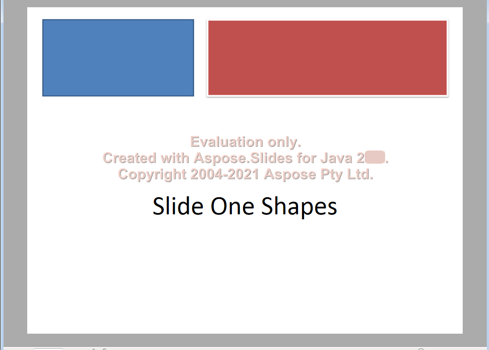

## **Tổng quan**

Aspose.Slides for Python via Java cho phép bạn chuyển đổi các bản trình chiếu PowerPoint sang XPS bằng cách lưu tệp PPT hoặc PPTX ở định dạng XPS. Bài viết này giải thích khi nào XPS có thể hữu ích và cho thấy cách xuất bản trình chiếu bằng các cài đặt mặc định hoặc tùy chỉnh [XpsOptions](https://reference.aspose.com/slides/vi/python-java/aspose.slides/xpsoptions/) .

## **Về XPS**

XPS (XML Paper Specification) là một định dạng tài liệu dựa trên XML do Microsoft phát triển. Nó mô tả các trang cố định, giữ nguyên bố cục của văn bản và đồ họa để xem và in bằng phần mềm tương thích.

## **Khi nào sử dụng định dạng Microsoft XPS**

Sử dụng XPS khi quy trình làm việc tài liệu yêu cầu các tệp bố cục cố định để chia sẻ hoặc in thông qua các công cụ tương thích XPS. Người nhận cần phần mềm hỗ trợ XPS. Nếu quy trình của bạn yêu cầu PDF, hãy xem [Convert PowerPoint to PDF](/slides/vi/python-java/convert-powerpoint-to-pdf/) .

{}

Để thử chuyển đổi bản trình chiếu PPT hoặc PPTX sang XPS, hãy sử dụng [công cụ chuyển đổi trực tuyến miễn phí](https://products.aspose.app/slides/vi/conversion).

{}

| Bản trình chiếu PowerPoint đầu vào | Tài liệu XPS đầu ra |
| --- | --- |
|  |  |

## **Chuyển đổi XPS với Aspose.Slides**

Sử dụng phương thức [save](https://reference.aspose.com/slides/vi/python-java/aspose.slides/presentation/#save) của lớp [Presentation](https://reference.aspose.com/slides/vi/python-java/aspose.slides/presentation/) với [SaveFormat.Xps](https://reference.aspose.com/slides/vi/python-java/aspose.slides/saveformat/#Xps) để xuất bản trình chiếu. Bạn có thể dùng các cài đặt xuất mặc định hoặc cung cấp [XpsOptions](https://reference.aspose.com/slides/vi/python-java/aspose.slides/xpsoptions/) để tùy chỉnh đầu ra.

Mỗi ví dụ bên dưới sẽ khởi động máy ảo Java nếu cần và giải phóng bản trình chiếu sau khi sử dụng. Thay thế tên tệp đầu vào bằng đường dẫn tới tệp PPT hoặc PPTX của bạn.

### **Chuyển đổi bản trình chiếu sang XPS bằng cài đặt mặc định**

Mã Python sau đây chuyển đổi bản trình chiếu sang XPS bằng các cài đặt mặc định:

```python
import jpype
import asposeslides

if not jpype.isJVMStarted():
    jpype.startJVM()

from asposeslides.api import Presentation, SaveFormat

presentation = Presentation("presentation.pptx")
try:
    # Lưu bản trình chiếu dưới dạng tài liệu XPS.
    presentation.save("output.xps", SaveFormat.Xps)
finally:
    presentation.dispose()
```

### **Chuyển đổi bản trình chiếu sang XPS bằng cài đặt tùy chỉnh**

Ví dụ sau sử dụng [XpsOptions.setSaveMetafilesAsPng](https://reference.aspose.com/slides/vi/python-java/aspose.slides/xpsoptions/#setSaveMetafilesAsPng) để lưu các metafile dưới dạng hình PNG trong tài liệu XPS tạo ra:

```python
import jpype
import asposeslides

if not jpype.isJVMStarted():
    jpype.startJVM()

from asposeslides.api import Presentation, SaveFormat, XpsOptions

presentation = Presentation("presentation.pptx")
try:
    xps_options = XpsOptions()
    xps_options.setSaveMetafilesAsPng(True)

    # Lưu bản trình chiếu với các cài đặt XPS tùy chỉnh.
    presentation.save("output_custom.xps", SaveFormat.Xps, xps_options)
finally:
    presentation.dispose()
```

## **Câu hỏi thường gặp**

**Tôi có thể lưu XPS vào một luồng thay vì tệp không?**

Có. Phương thức [Presentation.save](https://reference.aspose.com/slides/vi/python-java/aspose.slides/presentation/#save) có các overload cho phép truyền một luồng đầu ra Java. Khi dùng Python qua Java, hãy sử dụng một luồng Java tương thích qua JPype, chẳng hạn như Java ByteArrayOutputStream, để giữ dữ liệu đã xuất trong bộ nhớ.

**Các slide ẩn có được bao gồm trong đầu ra XPS không?**

Các slide ẩn mặc định bị loại bỏ. Để bao gồm chúng, đặt [XpsOptions.setShowHiddenSlides](https://reference.aspose.com/slides/vi/python-java/aspose.slides/xpsoptions/#setShowHiddenSlides) thành `True` trước khi lưu.

**Các hoạt ảnh và chuyển đổi slide có được giữ lại trong XPS không?**

Không. XPS chứa các trang cố định, vì vậy các slide đã xuất không phát hoạt ảnh hay hiệu ứng chuyển đổi.