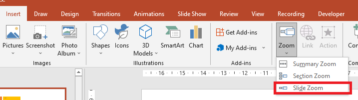

## **Giới thiệu**

Zoom trong PowerPoint cho phép bạn chuyển đến và quay lại các slide, phần và đoạn cụ thể của bài thuyết trình. Khi bạn đang trình bày, khả năng điều hướng nhanh chóng qua nội dung này có thể rất hữu ích.


* Để tóm tắt toàn bộ bài thuyết trình trên một slide duy nhất, sử dụng [Summary Zoom](#summary-zoom).
* Để hiển thị chỉ các slide đã chọn, sử dụng [Slide Zoom](#slide-zoom).
* Để hiển thị chỉ một phần duy nhất, sử dụng [Section Zoom](#section-zoom).

## **Slide Zoom**
Slide zoom có thể làm cho bài thuyết trình của bạn trở nên động hơn, cho phép bạn điều hướng tự do giữa các slide theo bất kỳ thứ tự nào bạn chọn mà không làm gián đoạn luồng trình bày. Slide zoom rất phù hợp cho các bài thuyết trình ngắn không có nhiều phần, nhưng bạn vẫn có thể sử dụng chúng trong các kịch bản thuyết trình khác nhau.

Slide zoom giúp bạn khám phá sâu nhiều phần thông tin trong khi vẫn cảm thấy như đang ở trên một bối cảnh duy nhất.



Đối với các đối tượng slide zoom, Aspose.Slides cung cấp enumeration [ZoomImageType](https://reference.aspose.com/slides/vi/python-java/aspose.slides/zoomimagetype/), lớp [ZoomFrame](https://reference.aspose.com/slides/vi/python-java/aspose.slides/zoomframe/) và một số phương thức trong lớp [ShapeCollection](https://reference.aspose.com/slides/vi/python-java/aspose.slides/shapecollection/).

### **Tạo Khung Zoom**

Bạn có thể thêm một khung zoom vào một slide theo cách sau:

1. Tạo một thể hiện của lớp [Presentation](https://reference.aspose.com/slides/vi/python-java/aspose.slides/presentation/).
2. Tạo các slide mới mà bạn dự định liên kết với các khung zoom.
3. Thêm văn bản nhận dạng và nền cho các slide đã tạo.
4. Thêm các khung zoom (chứa các tham chiếu tới các slide đã tạo) vào slide đầu tiên.
5. Ghi bài thuyết trình đã sửa đổi dưới dạng tệp PPTX.

Đoạn mã Python này cho bạn thấy cách tạo một khung zoom trên slide:

```python
import jpype
import asposeslides

if not jpype.isJVMStarted():
    jpype.startJVM()

from asposeslides.api import BackgroundType, FillType, Presentation, SaveFormat, ShapeType
from java.awt import Color

presentation = Presentation()
try:
    # Thêm các slide mới vào bài thuyết trình
    second_slide = presentation.getSlides().addEmptySlide(presentation.getSlides().get_Item(0).getLayoutSlide())
    third_slide = presentation.getSlides().addEmptySlide(presentation.getSlides().get_Item(0).getLayoutSlide())

    #  Tạo nền cho slide thứ hai
    second_slide.getBackground().setType(BackgroundType.OwnBackground)
    second_slide.getBackground().getFillFormat().setFillType(FillType.Solid)
    second_slide.getBackground().getFillFormat().getSolidFillColor().setColor(Color.cyan)

    #  Tạo hộp văn bản cho slide thứ hai
    auto_shape = second_slide.getShapes().addAutoShape(ShapeType.Rectangle, 100, 200, 500, 200)
    auto_shape.getTextFrame().setText("Second Slide")

    #  Tạo nền cho slide thứ ba
    third_slide.getBackground().setType(BackgroundType.OwnBackground)
    third_slide.getBackground().getFillFormat().setFillType(FillType.Solid)
    third_slide.getBackground().getFillFormat().getSolidFillColor().setColor(Color.darkGray)

    #  Tạo hộp văn bản cho slide thứ ba
    auto_shape = third_slide.getShapes().addAutoShape(ShapeType.Rectangle, 100, 200, 500, 200)
    auto_shape.getTextFrame().setText("Third Slide")

    # Thêm các đối tượng ZoomFrame
    presentation.getSlides().get_Item(0).getShapes().addZoomFrame(20, 20, 250, 200, second_slide)
    presentation.getSlides().get_Item(0).getShapes().addZoomFrame(200, 250, 250, 200, third_slide)

    #  Lưu bài thuyết trình
    presentation.save("presentation.pptx", SaveFormat.Pptx)
finally:
    presentation.dispose()
```
### **Tạo Khung Zoom với Hình ảnh Tùy chỉnh**

Với Aspose.Slides cho Python qua Java, bạn có thể tạo một khung zoom với hình ảnh xem trước slide khác nhau theo cách sau:

1. Tạo một thể hiện của lớp [Presentation](https://reference.aspose.com/slides/vi/python-java/aspose.slides/presentation/).
2. Tạo một slide mới mà bạn dự định liên kết với khung zoom.
3. Thêm văn bản nhận dạng và nền cho slide.
4. Tạo một đối tượng [PPImage](https://reference.aspose.com/slides/vi/python-java/aspose.slides/ppimage/) bằng cách thêm một hình ảnh vào bộ sưu tập hình ảnh liên kết với đối tượng [Presentation](https://reference.aspose.com/slides/vi/python-java/aspose.slides/presentation/) sẽ được dùng để điền vào khung.
5. Thêm các khung zoom (chứa tham chiếu tới slide đã tạo) vào slide đầu tiên.
6. Ghi bài thuyết trình đã sửa đổi dưới dạng tệp PPTX.

Đoạn mã Python này cho bạn thấy cách tạo một khung zoom với hình ảnh khác:

```python
import jpype
import asposeslides

if not jpype.isJVMStarted():
    jpamespace.startJVM()

from asposeslides.api import BackgroundType, FillType, Images, Presentation, SaveFormat, ShapeType
from java.awt import Color

presentation = Presentation()
try:
    # Thêm một slide mới vào bài thuyết trình
    slide = presentation.getSlides().addEmptySlide(presentation.getSlides().get_Item(0).getLayoutSlide())

    #  Tạo nền cho slide thứ hai
    slide.getBackground().setType(BackgroundType.OwnBackground)
    slide.getBackground().getFillFormat().setFillType(FillType.Solid)
    slide.getBackground().getFillFormat().getSolidFillColor().setColor(Color.cyan)

    #  Tạo hộp văn bản cho slide thứ hai
    auto_shape = slide.getShapes().addAutoShape(ShapeType.Rectangle, 100, 200, 500, 200)
    auto_shape.getTextFrame().setText("Second Slide")

    #  Tạo hình ảnh mới cho đối tượng zoom
    image = Images.fromFile("image.png")
    try:
        picture = presentation.getImages().addImage(image)
    finally:
        image.dispose()

    # Thêm đối tượng ZoomFrame
    presentation.getSlides().get_Item(0).getShapes().addZoomFrame(20, 20, 300, 200, slide, picture)

    #  Lưu bài thuyết trình
    presentation.save("presentation.pptx", SaveFormat.Pptx)
finally:
    presentation.dispose()
```
### **Định dạng Khung Zoom**

Trong các phần trước, chúng tôi đã chỉ cho bạn cách tạo các khung zoom đơn giản. Để tạo các khung zoom phức tạp hơn, bạn phải thay đổi định dạng của một khung đơn giản. Có một số tùy chọn định dạng mà bạn có thể áp dụng cho một khung zoom.

Bạn có thể kiểm soát định dạng của khung zoom trên slide theo cách sau:

1. Tạo một thể hiện của lớp [Presentation](https://reference.aspose.com/slides/vi/python-java/aspose.slides/presentation/).
2. Tạo các slide mới mà bạn dự định liên kết với các khung zoom.
3. Thêm văn bản nhận dạng và nền cho các slide đã tạo.
4. Thêm các khung zoom (chứa các tham chiếu tới các slide đã tạo) vào slide đầu tiên.
5. Tạo một đối tượng [PPImage](https://reference.aspose.com/slides/vi/python-java/aspose.slides/ppimage/) bằng cách thêm một hình ảnh vào bộ sưu tập hình ảnh liên kết với đối tượng [Presentation](https://reference.aspose.com/slides/vi/python-java/aspose.slides/presentation/) sẽ được dùng để điền vào khung.
6. Đặt hình ảnh tùy chỉnh cho đối tượng khung zoom đầu tiên.
7. Thay đổi định dạng đường viền cho đối tượng khung zoom thứ hai.
8. Xóa nền khỏi hình ảnh của đối tượng khung zoom thứ hai.
9. Ghi bài thuyết trình đã sửa đổi dưới dạng tệp PPTX.

Đoạn mã Python này cho bạn thấy cách thay đổi định dạng của khung zoom trên slide:

```python
import jpype
import asposeslides

if not jpype.isJVMStarted():
    jpype.startJVM()

from asposeslides.api import BackgroundType, FillType, Images, LineDashStyle, Presentation, SaveFormat, ShapeType
from java.awt import Color

presentation = Presentation()
try:
    # Thêm các slide mới vào bài thuyết trình
    second_slide = presentation.getSlides().addEmptySlide(presentation.getSlides().get_Item(0).getLayoutSlide())
    third_slide = presentation.getSlides().addEmptySlide(presentation.getSlides().get_Item(0).getLayoutSlide())

    #  Tạo nền cho slide thứ hai
    second_slide.getBackground().setType(BackgroundType.OwnBackground)
    second_slide.getBackground().getFillFormat().setFillType(FillType.Solid)
    second_slide.getBackground().getFillFormat().getSolidFillColor().setColor(Color.cyan)

    #  Tạo hộp văn bản cho slide thứ hai
    auto_shape = second_slide.getShapes().addAutoShape(ShapeType.Rectangle, 100, 200, 500, 200)
    auto_shape.getTextFrame().setText("Second Slide")

    #  Tạo nền cho slide thứ ba
    third_slide.getBackground().setType(BackgroundType.OwnBackground)
    third_slide.getBackground().getFillFormat().setFillType(FillType.Solid)
    third_slide.getBackground().getFillFormat().getSolidFillColor().setColor(Color.darkGray)

    #  Tạo hộp văn bản cho slide thứ ba
    auto_shape = third_slide.getShapes().addAutoShape(ShapeType.Rectangle, 100, 200, 500, 200)
    auto_shape.getTextFrame().setText("Third Slide")

    # Thêm các đối tượng ZoomFrame
    first_zoom_frame = presentation.getSlides().get_Item(0).getShapes().addZoomFrame(20, 20, 250, 200, second_slide)
    second_zoom_frame = presentation.getSlides().get_Item(0).getShapes().addZoomFrame(200, 250, 250, 200, third_slide)

    #  Tạo hình ảnh mới cho đối tượng zoom
    image = Images.fromFile("image.png")
    try:
        picture = presentation.getImages().addImage(image)
    finally:
        image.dispose()

    #  Đặt hình ảnh tùy chỉnh cho đối tượng first_zoom_frame
    first_zoom_frame.setZoomImage(picture)

    #  Đặt định dạng khung zoom cho đối tượng second_zoom_frame
    second_zoom_frame.getLineFormat().setWidth(5)
    second_zoom_frame.getLineFormat().getFillFormat().setFillType(FillType.Solid)
    second_zoom_frame.getLineFormat().getFillFormat().getSolidFillColor().setColor(Color.pink)
    second_zoom_frame.getLineFormat().setDashStyle(LineDashStyle.DashDot)

    #  Cài đặt để không hiển thị nền cho đối tượng second_zoom_frame
    second_zoom_frame.setShowBackground(False)

    #  Lưu bài thuyết trình
    presentation.save("presentation.pptx", SaveFormat.Pptx)
finally:
    presentation.dispose()
```

## **Section Zoom**

Section zoom là một liên kết tới một phần trong bài thuyết trình của bạn. Bạn có thể sử dụng section zoom để quay lại các phần mà bạn muốn nhấn mạnh. Hoặc bạn có thể dùng chúng để làm nổi bật cách các phần cụ thể của bài thuyết trình kết nối với nhau.


Đối với các đối tượng section zoom, Aspose.Slides cung cấp lớp [SectionZoomFrame](https://reference.aspose.com/slides/vi/python-java/aspose.slides/sectionzoomframe/) và một số phương thức trong lớp [ShapeCollection](https://reference.aspose.com/slides/vi/python-java/aspose.slides/shapecollection/).

### **Tạo Khung Section Zoom**

Bạn có thể thêm một khung section zoom vào slide theo cách sau:

1. Tạo một thể hiện của lớp [Presentation](https://reference.aspose.com/slides/vi/python-java/aspose.slides/presentation/).
2. Tạo một slide mới.
3. Thêm nền đặc trưng cho slide đã tạo.
4. Tạo một phần mới mà bạn dự định liên kết với khung zoom.
5. Thêm một khung section zoom (chứa các tham chiếu tới phần đã tạo) vào slide đầu tiên.
6. Ghi bài thuyết trình đã sửa đổi dưới dạng tệp PPTX.

Đoạn mã Python này cho bạn thấy cách tạo một khung zoom trên slide:

```python
import jpype
import asposeslides

if not jpype.isJVMStarted():
    jpype.startJVM()

from asposeslides.api import BackgroundType, FillType, Presentation, SaveFormat
from java.awt import Color

presentation = Presentation()
try:
    # Thêm một slide mới vào bài thuyết trình
    slide = presentation.getSlides().addEmptySlide(presentation.getSlides().get_Item(0).getLayoutSlide())
    slide.getBackground().getFillFormat().setFillType(FillType.Solid)
    slide.getBackground().getFillFormat().getSolidFillColor().setColor(Color.yellow)
    slide.getBackground().setType(BackgroundType.OwnBackground)

    #  Thêm một Section mới vào bài thuyết trình
    presentation.getSections().addSection("Section 1", slide)

    #  Thêm một đối tượng SectionZoomFrame
    section_zoom_frame = presentation.getSlides().get_Item(0).getShapes().addSectionZoomFrame(20, 20, 300, 200, presentation.getSections().get_Item(1))

    #  Lưu bài thuyết trình
    presentation.save("presentation.pptx", SaveFormat.Pptx)
finally:
    presentation.dispose()
```
### **Tạo Khung Section Zoom với Hình ảnh Tùy chỉnh**

Sử dụng Aspose.Slides cho Python qua Java, bạn có thể tạo một khung section zoom với hình ảnh xem trước slide khác nhau theo cách sau:

1. Tạo một thể hiện của lớp [Presentation](https://reference.aspose.com/slides/vi/python-java/aspose.slides/presentation/).
2. Tạo một slide mới.
3. Thêm nền đặc trưng cho slide đã tạo.
4. Tạo một phần mới mà bạn dự định liên kết với khung zoom.
5. Tạo một đối tượng [PPImage](https://reference.aspose.com/slides/vi/python-java/aspose.slides/ppimage/) bằng cách thêm một hình ảnh vào bộ sưu tập hình ảnh liên kết với đối tượng [Presentation](https://reference.aspose.com/slides/vi/python-java/aspose.slides/presentation/) sẽ được dùng để điền vào khung.
6. Thêm một khung section zoom (chứa tham chiếu tới phần đã tạo) vào slide đầu tiên.
7. Ghi bài thuyết trình đã sửa đổi dưới dạng tệp PPTX.

Đoạn mã Python này cho bạn thấy cách tạo một khung zoom với hình ảnh khác:

```python
import jpype
import asposeslides

if not jpype.isJVMStarted():
    jpype.startJVM()

from asposeslides.api import BackgroundType, FillType, Images, Presentation, SaveFormat
from java.awt import Color

presentation = Presentation()
try:
    # Thêm slide mới vào bài thuyết trình
    slide = presentation.getSlides().addEmptySlide(presentation.getSlides().get_Item(0).getLayoutSlide())
    slide.getBackground().getFillFormat().setFillType(FillType.Solid)
    slide.getBackground().getFillFormat().getSolidFillColor().setColor(Color.yellow)
    slide.getBackground().setType(BackgroundType.OwnBackground)

    #  Thêm một Section mới vào bài thuyết trình
    presentation.getSections().addSection("Section 1", slide)

    #  Tạo hình ảnh mới cho đối tượng zoom
    image = Images.fromFile("image.png")
    try:
        picture = presentation.getImages().addImage(image)
    finally:
        image.dispose()

    #  Thêm đối tượng SectionZoomFrame
    section_zoom_frame = presentation.getSlides().get_Item(0).getShapes().addSectionZoomFrame(20, 20, 300, 200, presentation.getSections().get_Item(1), picture)

    #  Lưu bài thuyết trình
    presentation.save("presentation.pptx", SaveFormat.Pptx)
finally:
    presentation.dispose()
```
### **Định dạng Khung Section Zoom**

Để tạo các khung section zoom phức tạp hơn, bạn phải thay đổi định dạng của một khung đơn giản. Có một số tùy chọn định dạng mà bạn có thể áp dụng cho một khung section zoom.

Bạn có thể kiểm soát định dạng của khung section zoom trên slide theo cách sau:

1. Tạo một thể hiện của lớp [Presentation](https://reference.aspose.com/slides/vi/python-java/aspose.slides/presentation/).
2. Tạo một slide mới.
3. Thêm nền đặc trưng cho slide đã tạo.
4. Tạo một phần mới mà bạn dự định liên kết với khung zoom.
5. Thêm một khung section zoom (chứa các tham chiếu tới phần đã tạo) vào slide đầu tiên.
6. Thay đổi kích thước và vị trí cho đối tượng section zoom đã tạo.
7. Tạo một đối tượng [PPImage](https://reference.aspose.com/slides/vi/python-java/aspose.slides/ppimage/) bằng cách thêm một hình ảnh vào bộ sưu tập hình ảnh liên kết với đối tượng [Presentation](https://reference.aspose.com/slides/vi/python-java/aspose.slides/presentation/) sẽ được dùng để điền vào khung.
8. Đặt hình ảnh tùy chỉnh cho đối tượng khung section zoom đã tạo.
9. Đặt khả năng *trở về slide gốc từ phần đã liên kết*.
10. Xóa nền khỏi hình ảnh của đối tượng khung section zoom.
11. Thay đổi định dạng đường viền cho đối tượng khung section zoom.
12. Thay đổi thời lượng chuyển đổi.
13. Ghi bài thuyết trình đã sửa đổi dưới dạng tệp PPTX.

```python
import jpype
import asposeslides

if not jpype.isJVMStarted():
    jpype.startJVM()

from asposeslides.api import BackgroundType, FillType, Images, LineDashStyle, Presentation, SaveFormat
from java.awt import Color

presentation = Presentation()
try:
    # Thêm một slide mới vào bài thuyết trình
    slide = presentation.getSlides().addEmptySlide(presentation.getSlides().get_Item(0).getLayoutSlide())
    slide.getBackground().getFillFormat().setFillType(FillType.Solid)
    slide.getBackground().getFillFormat().getSolidFillColor().setColor(Color.yellow)
    slide.getBackground().setType(BackgroundType.OwnBackground)

    #  Thêm một Section mới vào bài thuyết trình
    presentation.getSections().addSection("Section 1", slide)

    #  Thêm đối tượng SectionZoomFrame
    section_zoom_frame = presentation.getSlides().get_Item(0).getShapes().addSectionZoomFrame(20, 20, 300, 200, presentation.getSections().get_Item(1))

    #  Định dạng cho SectionZoomFrame
    section_zoom_frame.setX(100)
    section_zoom_frame.setY(300)
    section_zoom_frame.setWidth(100)
    section_zoom_frame.setHeight(75)

    image = Images.fromFile("image.png")
    try:
        picture = presentation.getImages().addImage(image)
    finally:
        image.dispose()
    section_zoom_frame.setZoomImage(picture)

    section_zoom_frame.setReturnToParent(True)
    section_zoom_frame.setShowBackground(False)

    section_zoom_frame.getLineFormat().getFillFormat().setFillType(FillType.Solid)
    section_zoom_frame.getLineFormat().getFillFormat().getSolidFillColor().setColor(Color.gray)
    section_zoom_frame.getLineFormat().setDashStyle(LineDashStyle.DashDot)
    section_zoom_frame.getLineFormat().setWidth(2.5)

    section_zoom_frame.setTransitionDuration(1.5)

    #  Lưu bài thuyết trình
    presentation.save("presentation.pptx", SaveFormat.Pptx)
finally:
    presentation.dispose()
```
## **Summary Zoom**

Summary zoom giống như một trang đích nơi tất cả các phần của bài thuyết trình được hiển thị đồng thời. Khi bạn đang trình bày, bạn có thể sử dụng zoom để chuyển từ một vị trí trong bài thuyết trình sang vị trí khác theo bất kỳ thứ tự nào bạn muốn. Bạn có thể sáng tạo, bỏ qua một phần, hoặc quay lại các phần của trình chiếu mà không làm gián đoạn luồng trình bày.


Đối với các đối tượng summary zoom, Aspose.Slides cung cấp các lớp [SummaryZoomFrame](https://reference.aspose.com/slides/vi/python-java/aspose.slides/summaryzoomframe/), [SummaryZoomSection](https://reference.aspose.com/slides/vi/python-java/aspose.slides/summaryzoomsection/), và [SummaryZoomSectionCollection](https://reference.aspose.com/slides/vi/python-java/aspose.slides/summaryzoomsectioncollection/) cùng một số phương thức trong lớp [ShapeCollection](https://reference.aspose.com/slides/vi/python-java/aspose.slides/shapecollection/).

### **Tạo Summary Zoom**

Bạn có thể thêm một khung summary zoom vào slide theo cách sau:

1. Tạo một thể hiện của lớp [Presentation](https://reference.aspose.com/slides/vi/python-java/aspose.slides/presentation/).
2. Tạo các slide mới với nền đặc trưng và các phần mới cho các slide đã tạo.
3. Thêm khung summary zoom vào slide đầu tiên.
4. Ghi bài thuyết trình đã sửa đổi dưới dạng tệp PPTX.

```python
import jpype
import asposeslides

if not jpype.isJVMStarted():
    jpype.startJVM()

from asposeslides.api import BackgroundType, FillType, Presentation, SaveFormat
from java.awt import Color

presentation = Presentation()
try:
    # Thêm một slide mới vào bài thuyết trình
    slide = presentation.getSlides().addEmptySlide(presentation.getSlides().get_Item(0).getLayoutSlide())
    slide.getBackground().getFillFormat().setFillType(FillType.Solid)
    slide.getBackground().getFillFormat().getSolidFillColor().setColor(Color.gray)
    slide.getBackground().setType(BackgroundType.OwnBackground)

    #  Thêm một section mới vào bài thuyết trình
    presentation.getSections().addSection("Section 1", slide)

    # Thêm một slide mới vào bài thuyết trình
    slide = presentation.getSlides().addEmptySlide(presentation.getSlides().get_Item(0).getLayoutSlide())
    slide.getBackground().getFillFormat().setFillType(FillType.Solid)
    slide.getBackground().getFillFormat().getSolidFillColor().setColor(Color.cyan)
    slide.getBackground().setType(BackgroundType.OwnBackground)

    #  Thêm một section mới vào bài thuyết trình
    presentation.getSections().addSection("Section 2", slide)

    # Thêm một slide mới vào bài thuyết trình
    slide = presentation.getSlides().addEmptySlide(presentation.getSlides().get_Item(0).getLayoutSlide())
    slide.getBackground().getFillFormat().setFillType(FillType.Solid)
    slide.getBackground().getFillFormat().getSolidFillColor().setColor(Color.magenta)
    slide.getBackground().setType(BackgroundType.OwnBackground)

    #  Thêm một section mới vào bài thuyết trình
    presentation.getSections().addSection("Section 3", slide)

    # Thêm một slide mới vào bài thuyết trình
    slide = presentation.getSlides().addEmptySlide(presentation.getSlides().get_Item(0).getLayoutSlide())
    slide.getBackground().getFillFormat().setFillType(FillType.Solid)
    slide.getBackground().getFillFormat().getSolidFillColor().setColor(Color.green)
    slide.getBackground().setType(BackgroundType.OwnBackground)

    #  Thêm một section mới vào bài thuyết trình
    presentation.getSections().addSection("Section 4", slide)

    #  Thêm đối tượng SummaryZoomFrame
    summary_zoom_frame = presentation.getSlides().get_Item(0).getShapes().addSummaryZoomFrame(150, 50, 300, 200)

    #  Lưu bài thuyết trình
    presentation.save("presentation.pptx", SaveFormat.Pptx)
finally:
    presentation.dispose()
```
### **Thêm và Xóa Section Summary Zoom**

Tất cả các phần trong một khung summary zoom được biểu diễn bằng các đối tượng [SummaryZoomSection](https://reference.aspose.com/slides/vi/python-java/aspose.slides/summaryzoomsection/), được lưu trong đối tượng [SummaryZoomSectionCollection](https://reference.aspose.com/slides/vi/python-java/aspose.slides/summaryzoomsectioncollection/). Bạn có thể thêm hoặc xóa một đối tượng summary zoom section thông qua lớp [SummaryZoomSectionCollection](https://reference.aspose.com/slides/vi/python-java/aspose.slides/summaryzoomsectioncollection/) theo cách sau:

1. Tạo một thể hiện của lớp [Presentation](https://reference.aspose.com/slides/vi/python-java/aspose.slides/presentation/).
2. Tạo các slide mới với nền đặc trưng và các phần mới cho các slide đã tạo.
3. Thêm một khung summary zoom vào slide đầu tiên.
4. Thêm một slide và một phần mới vào bài thuyết trình.
5. Thêm phần đã tạo vào khung summary zoom.
6. Xóa phần đầu tiên khỏi khung summary zoom.
7. Ghi bài thuyết trình đã sửa đổi dưới dạng tệp PPTX.

```python
import jpype
import asposeslides

if not jpype.isJVMStarted():
    jpype.startJVM()

from asposeslides.api import BackgroundType, FillType, Presentation, SaveFormat
from java.awt import Color

presentation = Presentation()
try:
    # Thêm một slide mới vào bài thuyết trình
    slide = presentation.getSlides().addEmptySlide(presentation.getSlides().get_Item(0).getLayoutSlide())
    slide.getBackground().getFillFormat().setFillType(FillType.Solid)
    slide.getBackground().getFillFormat().getSolidFillColor().setColor(Color.gray)
    slide.getBackground().setType(BackgroundType.OwnBackground)

    #  Thêm một section mới vào bài thuyết trình
    presentation.getSections().addSection("Section 1", slide)

    # Thêm một slide mới vào bài thuyết trình
    slide = presentation.getSlides().addEmptySlide(presentation.getSlides().get_Item(0).getLayoutSlide())
    slide.getBackground().getFillFormat().setFillType(FillType.Solid)
    slide.getBackground().getFillFormat().getSolidFillColor().setColor(Color.cyan)
    slide.getBackground().setType(BackgroundType.OwnBackground)

    #  Thêm một section mới vào bài thuyết trình
    presentation.getSections().addSection("Section 2", slide)

    #  Thêm đối tượng SummaryZoomFrame
    summary_zoom_frame = presentation.getSlides().get_Item(0).getShapes().addSummaryZoomFrame(150, 50, 300, 200)

    # Thêm một slide mới vào bài thuyết trình
    slide = presentation.getSlides().addEmptySlide(presentation.getSlides().get_Item(0).getLayoutSlide())
    slide.getBackground().getFillFormat().setFillType(FillType.Solid)
    slide.getBackground().getFillFormat().getSolidFillColor().setColor(Color.magenta)
    slide.getBackground().setType(BackgroundType.OwnBackground)

    #  Thêm một section mới vào bài thuyết trình
    third_section = presentation.getSections().addSection("Section 3", slide)

    #  Thêm một section vào Summary Zoom
    summary_zoom_frame.getSummaryZoomCollection().addSummaryZoomSection(third_section)

    #  Xóa section khỏi Summary Zoom
    summary_zoom_frame.getSummaryZoomCollection().removeSummaryZoomSection(presentation.getSections().get_Item(1))

    #  Lưu bài thuyết trình
    presentation.save("presentation.pptx", SaveFormat.Pptx)
finally:
    presentation.dispose()
```
### **Định dạng Section Summary Zoom**

Để tạo các đối tượng summary zoom section phức tạp hơn, bạn phải thay đổi định dạng của một khung đơn giản. Có một số tùy chọn định dạng mà bạn có thể áp dụng cho một đối tượng summary zoom section.

Bạn có thể kiểm soát định dạng của một đối tượng summary zoom section trong khung summary zoom theo cách sau:

1. Tạo một thể hiện của lớp [Presentation](https://reference.aspose.com/slides/vi/python-java/aspose.slides/presentation/).
2. Tạo các slide mới với nền đặc trưng và các phần mới cho các slide đã tạo.
3. Thêm một khung summary zoom vào slide đầu tiên.
4. Lấy đối tượng summary zoom section đầu tiên từ [SummaryZoomSectionCollection](https://reference.aspose.com/slides/vi/python-java/aspose.slides/summaryzoomsectioncollection/).
5. Tạo một đối tượng [PPImage](https://reference.aspose.com/slides/vi/python-java/aspose.slides/ppimage/) bằng cách thêm một hình ảnh vào bộ sưu tập hình ảnh liên kết với đối tượng [Presentation](https://reference.aspose.com/slides/vi/python-java/aspose.slides/presentation/) sẽ được dùng để điền vào khung.
6. Đặt hình ảnh tùy chỉnh cho đối tượng summary zoom section.
7. Đặt khả năng *trở về slide gốc từ phần đã liên kết*.
8. Thay đổi định dạng đường viền cho đối tượng summary zoom section.
9. Thay đổi thời lượng chuyển đổi.
10. Ghi bài thuyết trình đã sửa đổi dưới dạng tệp PPTX.

```python
import jpype
import asposeslides

if not jpype.isJVMStarted():
    jpype.startJVM()

from asposeslides.api import BackgroundType, FillType, Images, LineDashStyle, Presentation, SaveFormat
from java.awt import Color

presentation = Presentation()
try:
    # Thêm một slide mới vào bài thuyết trình
    slide = presentation.getSlides().addEmptySlide(presentation.getSlides().get_Item(0).getLayoutSlide())
    slide.getBackground().getFillFormat().setFillType(FillType.Solid)
    slide.getBackground().getFillFormat().getSolidFillColor().setColor(Color.gray)
    slide.getBackground().setType(BackgroundType.OwnBackground)

    #  Thêm một section mới vào bài thuyết trình
    presentation.getSections().addSection("Section 1", slide)

    # Thêm một slide mới vào bài thuyết trình
    slide = presentation.getSlides().addEmptySlide(presentation.getSlides().get_Item(0).getLayoutSlide())
    slide.getBackground().getFillFormat().setFillType(FillType.Solid)
    slide.getBackground().getFillFormat().getSolidFillColor().setColor(Color.cyan)
    slide.getBackground().setType(BackgroundType.OwnBackground)

    #  Thêm một section mới vào bài thuyết trình
    presentation.getSections().addSection("Section 2", slide)

    #  Thêm đối tượng SummaryZoomFrame
    summary_zoom_frame = presentation.getSlides().get_Item(0).getShapes().addSummaryZoomFrame(150, 50, 300, 200)

    #  Lấy đối tượng SummaryZoomSection đầu tiên
    summary_section = summary_zoom_frame.getSummaryZoomCollection().get_Item(0)

    #  Định dạng cho đối tượng SummaryZoomSection
    image = Images.fromFile("image.png")
    try:
        picture = presentation.getImages().addImage(image)
    finally:
        image.dispose()
    summary_section.setZoomImage(picture)

    summary_section.setReturnToParent(False)

    summary_section.getLineFormat().getFillFormat().setFillType(FillType.Solid)
    summary_section.getLineFormat().getFillFormat().getSolidFillColor().setColor(Color.black)
    summary_section.getLineFormat().setDashStyle(LineDashStyle.DashDot)
    summary_section.getLineFormat().setWidth(1.5)

    summary_section.setTransitionDuration(1.5)

    #  Lưu bài thuyết trình
    presentation.save("presentation.pptx", SaveFormat.Pptx)
finally:
    presentation.dispose()
```

## **FAQ**

**Tôi có thể kiểm soát việc quay lại slide 'bố mẹ' sau khi hiển thị mục tiêu không?**

Có. Các lớp [ZoomFrame](https://reference.aspose.com/slides/vi/python-java/aspose.slides/zoomframe/) hoặc [SectionZoomFrame](https://reference.aspose.com/slides/vi/python-java/aspose.slides/sectionzoomframe/) hỗ trợ quay lại slide gốc thông qua [setReturnToParent](https://reference.aspose.com/slides/vi/python-java/aspose.slides/zoomobject/#setReturnToParent), cho phép người xem trở lại sau khi họ xem nội dung mục tiêu khi tính năng này được bật.

**Tôi có thể điều chỉnh 'tốc độ' hoặc thời lượng của chuyển đổi Zoom không?**

Có. Zoom hỗ trợ thiết lập thời lượng chuyển đổi bằng [setTransitionDuration](https://reference.aspose.com/slides/vi/python-java/aspose.slides/zoomobject/#setTransitionDuration), vì vậy bạn có thể kiểm soát thời gian của hoạt ảnh chuyển đổi.

**Có giới hạn về số lượng đối tượng Zoom mà một bài thuyết trình có thể chứa không?**

Không có giới hạn API cứng nào được tài liệu ghi nhận. Các giới hạn thực tế phụ thuộc vào độ phức tạp tổng thể của bài thuyết trình và hiệu năng của trình xem. Bạn có thể thêm nhiều khung Zoom, nhưng nên cân nhắc kích thước tệp và thời gian render.