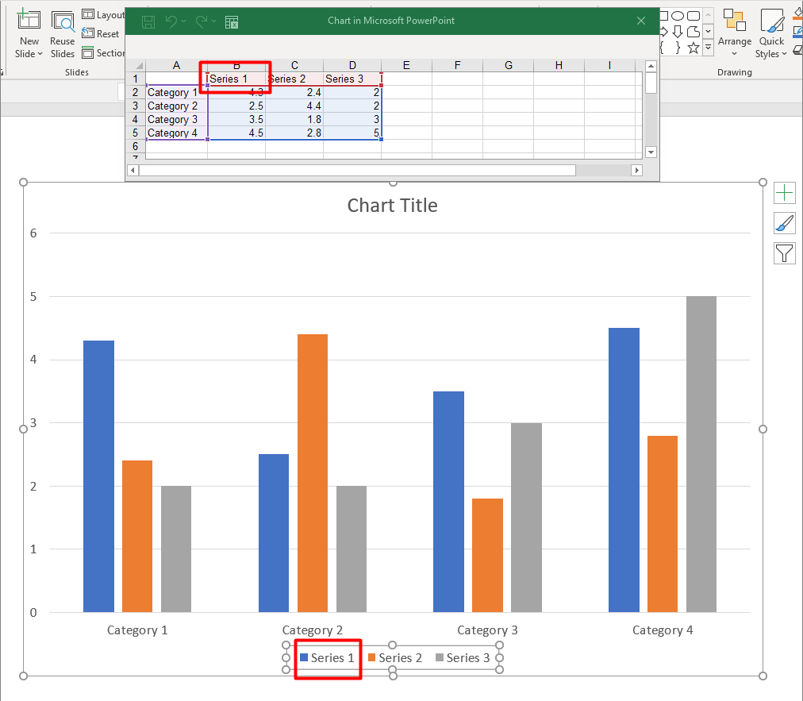

## **Tổng quan**

Biểu đồ lưu trữ dữ liệu đã vẽ của nó trong một sổ làm việc dữ liệu biểu đồ. Một [ChartSeries](https://reference.aspose.com/slides/vi/python-java/aspose.slides/chartseries/) đại diện cho một tập hợp các giá trị liên quan, và mỗi [ChartDataPoint](https://reference.aspose.com/slides/vi/python-java/aspose.slides/chartdatapoint/) trong series tham chiếu tới một hoặc nhiều ô trong sổ làm việc. Các đối tượng [ChartCategory](https://reference.aspose.com/slides/vi/python-java/aspose.slides/chartcategory/) cung cấp các nhãn hoặc giá trị nhóm được chia sẻ bởi các series. Do đó, tên series, các danh mục và giá trị điểm đều được kết nối với các đối tượng [ChartDataCell](https://reference.aspose.com/slides/vi/python-java/aspose.slides/chartdatacell/) thay vì chỉ được lưu dưới dạng văn bản hiển thị.

Đối với biểu đồ danh mục điển hình, sổ làm việc mặc định sử dụng hàng 0 cho tên series, cột 0 cho tên danh mục và các ô còn lại cho giá trị series. Các chỉ mục worksheet, hàng và cột được truyền vào [ChartDataWorkbook.getCell](https://reference.aspose.com/slides/vi/python-java/aspose.slides/chartdataworkbook/#getCell) là chỉ số bắt đầu từ 0. Bố cục này hữu ích khi bạn tạo biểu đồ với dữ liệu mặc định, nhưng không nên giả định rằng mọi biểu đồ tồn tại đều sử dụng nó. Đối với một bản trình chiếu đã tải, hãy kiểm tra các ô mà các series, danh mục và điểm dữ liệu tham chiếu trước khi thay đổi giá trị trong sổ làm việc.

Cài đặt biểu đồ có ba phạm vi khác nhau:

- Cài đặt mức series, như [ChartSeries.getFormat](https://reference.aspose.com/slides/vi/python-java/aspose.slides/chartseries/#getFormat), cung cấp giao diện mặc định cho tất cả các điểm trong một series.
- Cài đặt mức điểm dữ liệu, như [ChartDataPoint.getFormat](https://reference.aspose.com/slides/vi/python-java/aspose.slides/chartdatapoint/#getFormat), ghi đè giao diện của series cho một điểm.
- Cài đặt nhóm áp dụng cho các series tương thích thuộc cùng một [ChartSeriesGroup](https://reference.aspose.com/slides/vi/python-java/aspose.slides/chartseriesgroup/). Truy cập nhóm thông qua [ChartSeries.getParentSeriesGroup](https://reference.aspose.com/slides/vi/python-java/aspose.slides/chartseries/#getParentSeriesGroup) khi bạn cần đặt các tùy chọn như độ chồng lấn hoặc độ rộng khoảng trống.

Khi không có màu nền điểm hoặc series nào được chỉ định rõ ràng, kiểu biểu đồ và chủ đề sẽ xác định giao diện tự động. Khi cả định dạng series và điểm đều tồn tại, định dạng điểm sẽ ưu tiên cho điểm đó.



## **Đặt độ chồng lấn của Series biểu đồ**

[ChartSeries.getOverlap](https://reference.aspose.com/slides/vi/python-java/aspose.slides/chartseries/#getOverlap) báo cáo mức độ chồng lấn của các thanh hoặc cột trong biểu đồ 2D, từ -100 đến 100 phần trăm. Đây là một phép chiếu chỉ đọc của cài đặt trên nhóm series cha. Sử dụng [ChartSeriesGroup.setOverlap](https://reference.aspose.com/slides/vi/python-java/aspose.slides/chartseriesgroup/#setOverlap) để cập nhật mọi series tương thích trong nhóm đó. Tùy chọn này áp dụng cho các loại biểu đồ hiển thị các thanh hoặc cột được nhóm lại; nó không ảnh hưởng tới các nhóm series không liên quan trong biểu đồ kết hợp.

Ví dụ sau đặt độ chồng lấn cho nhóm chứa series đầu tiên:

```python
import jpype
import asposeslides

if not jpype.isJVMStarted():
    jpave.startJVM()

from asposeslides.api import ChartType, Presentation, SaveFormat

first_slide_index = 0
first_series_index = 0
overlap_percent = 30

presentation = Presentation()
try:
    slide = presentation.getSlides().get_Item(first_slide_index)

    # Biểu đồ mới chứa các series mẫu, danh mục và giá trị.
    chart = slide.getShapes().addChart(ChartType.ClusteredColumn, 20, 20, 500, 200)

    series = chart.getChartData().getSeries().get_Item(first_series_index)
    series.getParentSeriesGroup().setOverlap(overlap_percent)

    presentation.save("series_overlap.pptx", SaveFormat.Pptx)
finally:
    presentation.dispose()
```

Kết quả:


## **Thay đổi màu nền của Series**

Sử dụng [ChartSeries.getFormat](https://reference.aspose.com/slides/vi/python-java/aspose.slides/chartseries/#getFormat) để đặt màu nền mặc định cho toàn bộ một series. Nếu một điểm đã có màu nền được chỉ định rõ ràng, cài đặt [ChartDataPoint.getFormat](https://reference.aspose.com/slides/vi/python-java/aspose.slides/chartdatapoint/#getFormat) của nó sẽ ghi đè màu nền của series cho điểm đó.

Ví dụ sau áp dụng màu nền xanh dương đặc cho series đầu tiên:

```python
import jpype
import asposeslides

if not jpype.isJVMStarted():
    jpype.startJVM()

from asposeslides.api import ChartType, FillType, Presentation, SaveFormat

Color = jpype.JClass("java.awt.Color")

first_slide_index = 0
first_series_index = 0

presentation = Presentation()
try:
    slide = presentation.getSlides().get_Item(first_slide_index)

    chart = slide.getShapes().addChart(ChartType.ClusteredColumn, 20, 20, 500, 200)

    series = chart.getChartData().getSeries().get_Item(first_series_index)
    series.getFormat().getFill().setFillType(FillType.Solid)
    series.getFormat().getFill().getSolidFillColor().setColor(Color.BLUE)

    presentation.save("series_color.pptx", SaveFormat.Pptx)
finally:
    presentation.dispose()
```

Kết quả:


## **Thay đổi tên Series**

Tên series được lưu trong sổ làm việc dữ liệu biểu đồ và thường được hiển thị trong chú giải. Trong sổ làm việc mặc định được tạo cho một biểu đồ cột nhóm, ô B1 nằm ở hàng 0, cột 1 và chứa tên của series đầu tiên. Các biến được đặt tên trong ví dụ sau làm rõ cấu trúc đó:

```python
import jpype
import asposeslides

if not jpype.isJVMStarted():
    jpype.startJVM()

from asposeslides.api import ChartType, Presentation, SaveFormat

first_slide_index = 0
worksheet_index = 0
series_name_row_index = 0
first_series_column_index = 1

presentation = Presentation()
try:
    slide = presentation.getSlides().get_Item(first_slide_index)

    chart = slide.getShapes().addChart(ChartType.ClusteredColumn, 20, 20, 500, 200)

    workbook = chart.getChartData().getChartDataWorkbook()
    series_name_cell = workbook.getCell(worksheet_index, series_name_row_index, first_series_column_index)
    series_name_cell.setValue("Revenue")

    presentation.save("series_name.pptx", SaveFormat.Pptx)
finally:
    presentation.dispose()
```

Bạn cũng có thể cập nhật ô đã được [ChartSeries.getName](https://reference.aspose.com/slides/vi/python-java/aspose.slides/chartseries/#getName) tham chiếu. Cách tiếp cận này tránh việc giả định một hàng và cột cụ thể trong một biểu đồ hiện có:

```python
import jpype
import asposeslides

if not jpype.isJVMStarted():
    jpype.startJVM()

from asposeslides.api import ChartType, Presentation, SaveFormat

first_slide_index = 0
first_series_index = 0
first_name_cell_index = 0

presentation = Presentation()
try:
    slide = presentation.getSlides().get_Item(first_slide_index)

    chart = slide.getShapes().addChart(ChartType.ClusteredColumn, 20, 20, 500, 200)

    series = chart.getChartData().getSeries().get_Item(first_series_index)
    series_name_cell = series.getName().getAsCells().get_Item(first_name_cell_index)
    series_name_cell.setValue("Revenue")

    presentation.save("series_name.pptx", SaveFormat.Pptx)
finally:
    presentation.dispose()
```

Kết quả:


## **Lấy màu nền tự động của Series**

[ChartSeries.getAutomaticSeriesColor](https://reference.aspose.com/slides/vi/python-java/aspose.slides/chartseries/#getAutomaticSeriesColor) trả về màu được tính dựa trên chỉ mục series và kiểu biểu đồ. Đây là màu được sử dụng khi màu nền của series chưa được xác định rõ ràng. Gọi phương thức này chỉ đọc màu đã tính; nó không gán màu nền mới.

Ví dụ sau in ra màu tự động của mỗi series mặc định:

```python
import jpype
import asposeslides

if not jpype.isJVMStarted():
    jpype.startJVM()

from asposeslides.api import ChartType, Presentation

first_slide_index = 0

presentation = Presentation()
try:
    slide = presentation.getSlides().get_Item(first_slide_index)

    chart = slide.getShapes().addChart(ChartType.ClusteredColumn, 20, 20, 500, 200)

    series_count = chart.getChartData().getSeries().size()
    for series_index in range(series_count):
        series = chart.getChartData().getSeries().get_Item(series_index)
        automatic_color = series.getAutomaticSeriesColor()
        print(f"Series {series_index}: {automatic_color}")
finally:
    presentation.dispose()
```

Kết quả mẫu cho kiểu biểu đồ mặc định:

```text
Series 0: java.awt.Color[r=79,g=129,b=189]
Series 1: java.awt.Color[r=192,g=80,b=77]
Series 2: java.awt.Color[r=155,g=187,b=89]
```

Màu sắc chính xác phụ thuộc vào kiểu biểu đồ và chủ đề.

## **Đặt màu đảo ngược cho Series biểu đồ**

Đối với các series thanh, cột và bong bóng, [ChartSeries.setInvertIfNegative](https://reference.aspose.com/slides/vi/python-java/aspose.slides/chartseries/#setInvertIfNegative) có thể hiển thị các giá trị âm bằng một màu nền khác. Đặt màu nền thường của series thành màu đặc, bật tính năng đảo ngược và chỉ định màu cho giá trị âm thông qua [ChartSeries.getInvertedSolidFillColor](https://reference.aspose.com/slides/vi/python-java/aspose.slides/chartseries/#getInvertedSolidFillColor). Các số âm vẫn không thay đổi trong sổ làm việc; chỉ màu hiển thị của chúng thay đổi.

Ví dụ sau thay thế dữ liệu biểu đồ mặc định bằng một series. Hàng 0 của worksheet chứa tên series, cột 0 chứa tên danh mục, và cột 1 chứa các giá trị:

```python
import jpype
import asposeslides

if not jpype.isJVMStarted():
    jpype.startJVM()

from asposeslides.api import ChartType, FillType, Presentation, SaveFormat

Color = jpype.JClass("java.awt.Color")

first_slide_index = 0
worksheet_index = 0
header_row_index = 0
category_column_index = 0
first_series_column_index = 1
first_data_row_index = 1

category_names = ["Category 1", "Category 2", "Category 3"]
series_values = [-20, 50, -30]

presentation = Presentation()
try:
    slide = presentation.getSlides().get_Item(first_slide_index)

    chart = slide.getShapes().addChart(ChartType.ClusteredColumn, 20, 20, 500, 200)
    chart_data = chart.getChartData()
    workbook = chart_data.getChartDataWorkbook()

    chart_data.getSeries().clear()
    chart_data.getCategories().clear()

    series_name_cell = workbook.getCell(worksheet_index, header_row_index, first_series_column_index, "Series 1")
    chart_type = chart.getType()
    series = chart_data.getSeries().add(series_name_cell, chart_type)

    for category_index in range(len(category_names)):
        data_row_index = first_data_row_index + category_index
        category_name = category_names[category_index]
        series_value = series_values[category_index]

        category_cell = workbook.getCell(worksheet_index, data_row_index, category_column_index, category_name)
        chart_data.getCategories().add(category_cell)

        value_cell = workbook.getCell(worksheet_index, data_row_index, first_series_column_index, series_value)
        series.getDataPoints().addDataPointForBarSeries(value_cell)

    automatic_series_color = series.getAutomaticSeriesColor()
    series.getFormat().getFill().setFillType(FillType.Solid)
    series.getFormat().getFill().getSolidFillColor().setColor(automatic_series_color)
    series.setInvertIfNegative(True)
    series.getInvertedSolidFillColor().setColor(Color.RED)

    presentation.save("inverted_solid_fill_color.pptx", SaveFormat.Pptx)
finally:
    presentation.dispose()
```

Kết quả:


Bạn có thể bật tính năng đảo ngược cho một điểm thông qua [ChartDataPoint.setInvertIfNegative](https://reference.aspose.com/slides/vi/python-java/aspose.slides/chartdatapoint/#setInvertIfNegative). Trong ví dụ sau, việc đảo ngược bị tắt cho series và chỉ được bật cho điểm đã chọn. Điểm này cũng được gán một giá trị âm để hiệu ứng hiển thị:

```python
import jpype
import asposeslides

if not jpype.isJVMStarted():
    jpype.startJVM()

from asposeslides.api import ChartType, FillType, Presentation, SaveFormat

Color = jpype.JClass("java.awt.Color")

first_slide_index = 0
first_series_index = 0
target_data_point_index = 2
negative_value = -30

presentation = Presentation()
try:
    slide = presentation.getSlides().get_Item(first_slide_index)

    chart = slide.getShapes().addChart(ChartType.ClusteredColumn, 20, 20, 500, 200)

    series = chart.getChartData().getSeries().get_Item(first_series_index)
    automatic_series_color = series.getAutomaticSeriesColor()
    series.getFormat().getFill().setFillType(FillType.Solid)
    series.getFormat().getFill().getSolidFillColor().setColor(automatic_series_color)
    series.getInvertedSolidFillColor().setColor(Color.RED)
    series.setInvertIfNegative(False)

    data_point = series.getDataPoints().get_Item(target_data_point_index)
    data_point.getValue().getAsCell().setValue(negative_value)
    data_point.setInvertIfNegative(True)

    presentation.save("data_point_invert_color_if_negative.pptx", SaveFormat.Pptx)
finally:
    presentation.dispose()
```

## **Xóa giá trị điểm dữ liệu cụ thể**

Để làm cho một điểm trống mà không xóa các điểm khác, đặt ô sổ làm việc tương ứng của nó thành `None`. Đối với biểu đồ cột, giá trị đã vẽ sẵn có thể lấy qua [ChartDataPoint.getValue](https://reference.aspose.com/slides/vi/python-java/aspose.slides/chartdatapoint/#getValue). Điểm dữ liệu vẫn giữ vị trí danh mục giống nhau, nhưng biểu đồ sẽ coi giá trị của nó là trống theo cài đặt giá trị trống của biểu đồ.

Ví dụ sau chỉ xóa điểm thứ hai trong series đầu tiên:

```python
import jpype
import asposeslides

if not jpype.isJVMStarted():
    jpype.startJVM()

from asposeslides.api import ChartType, Presentation, SaveFormat

first_slide_index = 0
first_series_index = 0
target_data_point_index = 1

presentation = Presentation()
try:
    slide = presentation.getSlides().get_Item(first_slide_index)

    chart = slide.getShapes().addChart(ChartType.ClusteredColumn, 20, 20, 500, 200)

    series = chart.getChartData().getSeries().get_Item(first_series_index)
    data_point = series.getDataPoints().get_Item(target_data_point_index)
    data_point.getValue().getAsCell().setValue(None)

    presentation.save("clear_data_point_value.pptx", SaveFormat.Pptx)
finally:
    presentation.dispose()
```

Biểu đồ scatter sử dụng các ô X và Y riêng biệt, và biểu đồ bong bóng cũng sử dụng một ô kích thước. Chỉ xóa ô đại diện cho giá trị bạn muốn loại bỏ. Không gọi [ChartDataPointCollection.clear](https://reference.aspose.com/slides/vi/python-java/aspose.slides/chartdatapointcollection/#clear) khi bạn muốn giữ lại các điểm khác, vì phương thức đó sẽ xóa mọi điểm dữ liệu khỏi bộ sưu tập.

## **Đặt độ rộng khoảng cách giữa các Series**

Độ rộng khoảng cách là không gian giữa các cụm thanh hoặc cột liền kề, được biểu thị dưới dạng phần trăm của chiều rộng thanh hoặc cột. Giống như độ chồng lấn, nó thuộc về nhóm series cha chứ không phải một series riêng. Gọi [ChartSeriesGroup.setGapWidth](https://reference.aspose.com/slides/vi/python-java/aspose.slides/chartseriesgroup/#setGapWidth) một lần cho nhóm. Giá trị lớn hơn tạo ra nhiều không gian hơn giữa các cụm; giá trị nhỏ hơn làm chúng dày đặc hơn.

Ví dụ sau thay đổi độ rộng khoảng cách và chỉ lưu bản trình chiếu cuối cùng:

```python
import jpype
import asposeslides

if not jpype.isJVMStarted():
    jpype.startJVM()

from asposeslides.api import ChartType, Presentation, SaveFormat

first_slide_index = 0
first_series_index = 0
gap_width_percent = 30

presentation = Presentation()
try:
    slide = presentation.getSlides().get_Item(first_slide_index)

    chart = slide.getShapes().addChart(ChartType.StackedColumn, 20, 20, 500, 200)

    series = chart.getChartData().getSeries().get_Item(first_series_index)
    series.getParentSeriesGroup().setGapWidth(gap_width_percent)

    presentation.save("gap_width_30.pptx", SaveFormat.Pptx)
finally:
    presentation.dispose()
```

Kết quả:


## **Câu hỏi thường gặp**

**Loại biểu đồ nào hỗ trợ series dữ liệu?**

Tất cả các loại biểu đồ được biểu diễn bởi enum [ChartType](https://reference.aspose.com/slides/vi/python-java/aspose.slides/charttype/) đều sử dụng dữ liệu biểu đồ, nhưng các series của chúng không có cùng cấu trúc giá trị hoặc cài đặt. Ví dụ, biểu đồ danh mục sử dụng danh mục và giá trị, biểu đồ scatter sử dụng giá trị X và Y, và biểu đồ bong bóng thêm kích thước bong bóng. Hãy sử dụng phương pháp tạo điểm dữ liệu phù hợp với loại series. Các tùy chọn như độ chồng lấn và độ rộng khoảng cách chỉ áp dụng cho các nhóm thanh hoặc cột tương thích.

**Nhóm series biểu đồ là gì?**

Một [ChartSeriesGroup](https://reference.aspose.com/slides/vi/python-java/aspose.slides/chartseriesgroup/) chứa các series tương thích chia sẻ các cài đặt vẽ cấp nhóm. Một biểu đồ kết hợp có thể chứa nhiều hơn một nhóm, vì vậy việc thay đổi nhóm thông qua một series không nhất thiết sẽ thay đổi mọi series trong biểu đồ.

**Biểu đồ mới tạo có chứa dữ liệu mặc định không?**

Có. Mặc định, [ShapeCollection.addChart](https://reference.aspose.com/slides/vi/python-java/aspose.slides/shapecollection/#addChart) tạo các series mẫu, danh mục và giá trị. Bạn có thể chỉnh sửa các ô này hoặc xóa cả bộ sưu tập series và danh mục trước khi thêm một bộ dữ liệu tùy chỉnh hoàn toàn. Một overload cũng có thể tạo biểu đồ mà không có dữ liệu mặc định.

**Các đối tượng biểu đồ được kết nối với các ô trong sổ làm việc như thế nào?**

Tên series, nhãn danh mục và giá trị điểm dữ liệu tham chiếu các ô trong một [ChartDataWorkbook](https://reference.aspose.com/slides/vi/python-java/aspose.slides/chartdataworkbook/). Thay đổi một ô được tham chiếu sẽ cập nhật phần tử biểu đồ tương ứng. Khi bạn xây dựng dữ liệu tùy chỉnh, hãy giữ các hàng danh mục và các hàng giá trị series được căn chỉnh để mỗi điểm được vẽ dưới danh mục mong muốn.

**Làm sao để xóa một điểm thay vì toàn bộ series?**

Đặt ô giá trị liên quan thành `None` để giữ vị trí danh mục của điểm như một điểm trống. Chỉ sử dụng [ChartDataPointCollection.clear](https://reference.aspose.com/slides/vi/python-java/aspose.slides/chartdatapointcollection/#clear) khi bạn muốn xóa mọi điểm khỏi series đó. Nếu bạn cũng xóa các danh mục, hãy cập nhật mọi series sao cho giá trị của chúng vẫn được căn chỉnh với bộ sưu tập danh mục.

**Các điểm trống được hiển thị như thế nào?**

Kết quả phụ thuộc vào loại biểu đồ và giá trị được cấu hình qua [Chart.setDisplayBlanksAs](https://reference.aspose.com/slides/vi/python-java/aspose.slides/chart/#setDisplayBlanksAs). Các biểu đồ được hỗ trợ có thể hiển thị các khoảng trống dưới dạng khoảng cách, giá trị 0, hoặc bằng cách nối các điểm lân cận. Chọn cài đặt phù hợp với ý nghĩa của dữ liệu thiếu trong bản trình chiếu của bạn.

**Giá trị âm được định dạng như thế nào?**

Đối với các series thanh, cột và bong bóng được hỗ trợ, gọi [ChartSeries.setInvertIfNegative](https://reference.aspose.com/slides/vi/python-java/aspose.slides/chartseries/#setInvertIfNegative) và đặt màu trả về bởi [ChartSeries.getInvertedSolidFillColor](https://reference.aspose.com/slides/vi/python-java/aspose.slides/chartseries/#getInvertedSolidFillColor). Bạn có thể ghi đè hành vi cho một điểm riêng lẻ bằng [ChartDataPoint.setInvertIfNegative](https://reference.aspose.com/slides/vi/python-java/aspose.slides/chartdatapoint/#setInvertIfNegative). Những phương thức này ảnh hưởng đến định dạng, không phải giá trị số được lưu.

**Định dạng nào được ưu tiên khi cả series và điểm đều được định dạng?**

Định dạng điểm dữ liệu rõ ràng sẽ được ưu tiên cho điểm đó. Các điểm khác tiếp tục sử dụng định dạng series rõ ràng hoặc, khi định dạng series chưa được định nghĩa, kiểu và chủ đề biểu đồ tự động. Các cài đặt nhóm như độ chồng lấn và độ rộng khoảng cách kiểm soát bố cục và không phải là các ghi đè định dạng mức điểm.

**Có giới hạn nào về số lượng series mà một biểu đồ có thể chứa không?**

Aspose.Slides không áp đặt một giới hạn cố định riêng cho số lượng series. Trong thực tế, các ràng buộc của file trình chiếu, bộ nhớ khả dụng, thời gian render và độ dễ đọc của biểu đồ quyết định một giới hạn hữu ích.

**Tôi nên thay đổi gì khi các cột quá gần nhau hoặc quá xa nhau?**

Gọi [ChartSeriesGroup.setGapWidth](https://reference.aspose.com/slides/vi/python-java/aspose.slides/chartseriesgroup/#setGapWidth) trên nhóm series cha phù hợp. Tăng giá trị để mở rộng không gian giữa các cụm, hoặc giảm nó để các cụm lại gần nhau hơn.