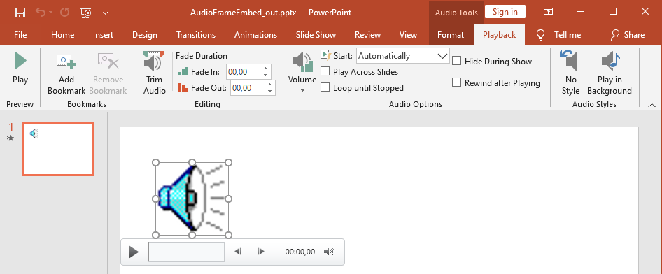

## **Tổng quan**

Bài viết này giải thích cách làm việc với khung âm thanh trong Aspose.Slides. Nó cho thấy cách thêm âm thanh nhúng vào các slide, tùy chỉnh hình thu nhỏ của khung âm thanh, cấu hình các tùy chọn phát như âm lượng, lặp lại, ẩn, cắt và thời gian mờ, và trích xuất âm thanh được sử dụng trong chuyển đổi trình chiếu.

## **Tạo Khung Âm Thanh**

Aspose.Slides cho Python thông qua .NET cho phép bạn thêm các tệp âm thanh vào các slide. Các tệp âm thanh được nhúng trong slide dưới dạng khung âm thanh. 

1. Tạo một thể hiện của lớp [Presentation](https://reference.aspose.com/slides/vi/python-net/aspose.slides/presentation/) .
2. Lấy tham chiếu của slide thông qua chỉ mục của nó.
3. Tải luồng tệp âm thanh mà bạn muốn nhúng vào slide.
4. Thêm khung âm thanh nhúng (chứa tệp âm thanh) vào slide.
5. Đặt [PlayMode](https://reference.aspose.com/slides/vi/python-net/aspose.slides/audioplaymodepreset) và `Volume` được cung cấp bởi đối tượng [IAudioFrame](https://reference.aspose.com/slides/vi/python-net/aspose.slides/audioframe/) .
6. Lưu bản trình chiếu đã chỉnh sửa.

Đoạn mã Python này cho bạn thấy cách thêm một khung âm thanh nhúng vào slide:

```python
import aspose.slides as slides

# Khởi tạo một lớp Presentation đại diện cho tệp trình chiếu
with slides.Presentation() as pres:
    # Lấy slide đầu tiên
    sld = pres.slides[0]

    # Tải tệp âm thanh wav vào luồng
    with open(path + "sampleaudio.wav", "rb") as in_file:
        # Thêm Audio Frame
        audio_frame = sld.shapes.add_audio_frame_embedded(50, 150, 100, 100, in_file)

        # Đặt chế độ phát và âm lượng cho Audio
        audio_frame.play_mode = slides.AudioPlayModePreset.AUTO
        audio_frame.volume = slides.AudioVolumeMode.LOUD

        # Ghi tệp PowerPoint vào đĩa
        pres.save("AudioFrameEmbed_out.pptx", slides.export.SaveFormat.PPTX)
```

## **Thay Đổi Hình Thu Nhỏ Khung Âm Thanh**

Khi bạn thêm một tệp âm thanh vào bản trình chiếu, âm thanh sẽ xuất hiện dưới dạng khung với hình ảnh mặc định tiêu chuẩn (xem hình trong phần dưới). Bạn có thể thay đổi hình thu nhỏ của khung âm thanh (đặt hình ảnh ưa thích của bạn).

Đoạn mã Python này cho bạn thấy cách thay đổi hình thu nhỏ hoặc hình ảnh preview của khung âm thanh:

```python
import aspose.slides as slides

with slides.Presentation() as presentation:
    slide = presentation.slides[0]

    # Thêm một khung âm thanh vào slide với vị trí và kích thước đã chỉ định.
    with open("sample2.mp3", "rb") as audio_fs:
        audioFrame = slide.shapes.add_audio_frame_embedded(150, 100, 50, 50, audio_fs)

        # Thêm một hình ảnh vào tài nguyên của bản trình chiếu.
        with open("eagle.jpeg", "rb") as image_fs:
            data = image_fs.read()
        
        audioImage = presentation.images.add_image(data)

        # Đặt hình ảnh cho khung âm thanh.
        audioFrame.picture_format.picture.image = audioImage
        
        #Lưu bản trình chiếu đã chỉnh sửa vào đĩa
        presentation.save("example_out.pptx", slides.export.SaveFormat.PPTX)
```

## **Thay Đổi Tùy Chọn Phát Âm Thanh**

Aspose.Slides cho Python thông qua .NET cho phép bạn thay đổi các tùy chọn kiểm soát việc phát hoặc thuộc tính của âm thanh. Ví dụ, bạn có thể điều chỉnh âm lượng của âm thanh, đặt âm thanh phát vòng lặp, hoặc thậm chí ẩn biểu tượng âm thanh.

Bảng **Audio Options** trong Microsoft PowerPoint:



PowerPoint **Audio Options** tương ứng với các thuộc tính [AudioFrame](https://reference.aspose.com/slides/vi/python-net/aspose.slides/audioframe/) của Aspose.Slides:
- **Start** danh sách thả xuống khớp với thuộc tính [AudioFrame.play_mode](https://reference.aspose.com/slides/vi/python-net/aspose.slides/audioframe/play_mode/) 
- **Volume** khớp với thuộc tính [AudioFrame.volume](https://reference.aspose.com/slides/vi/python-net/aspose.slides/audioframe/volume/) 
- **Play Across Slides** khớp với thuộc tính [AudioFrame.play_across_slides](https://reference.aspose.com/slides/vi/python-net/aspose.slides/audioframe/play_across_slides/) 
- **Loop until Stopped** khớp với thuộc tính [AudioFrame.play_loop_mode](https://reference.aspose.com/slides/vi/python-net/aspose.slides/audioframe/play_loop_mode/) 
- **Hide During Show** khớp với thuộc tính [AudioFrame.hide_at_showing](https://reference.aspose.com/slides/vi/python-net/aspose.slides/audioframe/hide_at_showing/) 
- **Rewind after Playing** khớp với thuộc tính [AudioFrame.rewind_audio](https://reference.aspose.com/slides/vi/python-net/aspose.slides/audioframe/rewind_audio/) 

PowerPoint **Editing** tương ứng với các thuộc tính [AudioFrame](https://reference.aspose.com/slides/vi/python-net/aspose.slides/audioframe/) của Aspose.Slides:
- **Fade In** khớp với thuộc tính [AudioFrame.fade_in_duration](https://reference.aspose.com/slides/vi/python-net/aspose.slides/audioframe/fade_in_duration/) 
- **Fade Out** khớp với thuộc tính [AudioFrame.fade_out_duration](https://reference.aspose.com/slides/vi/python-net/aspose.slides/audioframe/fade_out_duration/) 
- **Trim Audio Start Time** khớp với thuộc tính [AudioFrame.trim_from_start](https://reference.aspose.com/slides/vi/python-net/aspose.slides/audioframe/trim_from_start/) 
- **Trim Audio End Time** giá trị bằng độ dài âm thanh trừ giá trị của thuộc tính [AudioFrame.trim_from_end](https://reference.aspose.com/slides/vi/python-net/aspose.slides/audioframe/trim_from_end/) 

Điều khiển **Volume** trên bảng điều khiển âm thanh của PowerPoint tương ứng với thuộc tính [AudioFrame.volume_value](https://reference.aspose.com/slides/vi/python-net/aspose.slides/audioframe/volume_value/). Nó cho phép bạn thay đổi âm lượng âm thanh dưới dạng phần trăm.

Đây là cách bạn thay đổi các tùy chọn phát âm thanh:
1. [Create](#create-audio-frame) hoặc lấy Audio Frame.
2. Đặt giá trị mới cho các thuộc tính Audio Frame mà bạn muốn điều chỉnh.
3. Lưu tệp PowerPoint đã chỉnh sửa.

Đoạn mã Python này minh họa một thao tác trong đó các tùy chọn của âm thanh được điều chỉnh:

```python
import aspose.slides as slides

with slides.Presentation("AudioFrameEmbed_out.pptx") as pres:
    # Lấy shape AudioFrame
    audioFrame = pres.slides[0].shapes[0]

    # Đặt chế độ Play để phát khi nhấp
    audioFrame.play_mode = slides.AudioPlayModePreset.ON_CLICK

    # Đặt âm lượng thành Thấp
    audioFrame.volume = slides.AudioVolumeMode.LOW

    # Đặt âm thanh phát xuyên suốt các slide
    audioFrame.play_across_slides = True

    # Tắt vòng lặp cho âm thanh
    audioFrame.play_loop_mode = False

    # Ẩn AudioFrame trong khi trình chiếu
    audioFrame.hide_at_showing = True

    # Tua lại âm thanh về đầu sau khi phát
    audioFrame.rewind_audio = True

    # Lưu tệp PowerPoint vào đĩa
    pres.save("AudioFrameEmbed_changed.pptx", slides.export.SaveFormat.PPTX)
```

Ví dụ Python này cho thấy cách thêm một khung âm thanh mới với âm thanh nhúng, cắt nó, và đặt thời gian mờ:

```py
with slides.Presentation() as pres:
    slide = pres.slides[0]

    with open("sampleaudio.mp3", "rb") as audio_stream:
        audio_data = audio_stream.read()

    audio = pres.audios.add_audio(audio_data)
    audio_frame = slide.shapes.add_audio_frame_embedded(50, 50, 100, 100, audio)

    # Đặt độ lệch bắt đầu cắt thành 1,5 giây
    audio_frame.trim_from_start = 1500.0
    # Đặt độ lệch kết thúc cắt thành 2 giây
    audio_frame.trim_from_end = 2000.0

    # Đặt thời gian fade-in thành 200 ms
    audio_frame.fade_in_duration = 200.0
    # Đặt thời gian fade-out thành 500 ms
    audio_frame.fade_out_duration = 500.0

    pres.save("AudioFrameTrimFade_out.pptx", slides.export.SaveFormat.PPTX)
```

Mẫu mã sau đây cho thấy cách lấy một khung âm thanh có âm thanh nhúng và đặt âm lượng của nó thành 85%:

```py
with slides.Presentation("AudioFrameEmbed_out.pptx") as pres:
    # Lấy shape khung âm thanh
    audio_frame = pres.slides[0].shapes[0]

    # Đặt âm lượng âm thanh thành 85%
    audio_frame.volume_value = 85.0

    pres.save("AudioFrameValue_out.pptx", slides.export.SaveFormat.PPTX)
```

## **Quản Lý Phụ Đề Âm Thanh**

Aspose.Slides cho phép bạn thêm phụ đề đóng vào một khung âm thanh thông qua thuộc tính [caption_tracks](https://reference.aspose.com/slides/vi/python-net/aspose.slides/audioframe/caption_tracks/). Thuộc tính này trả về một [CaptionsCollection](https://reference.aspose.com/slides/vi/python-net/aspose.slides/captionscollection/), cho phép bạn thêm các track phụ đề WebVTT, duyệt qua các track hiện có, và xóa chúng khi cần.

**Thêm Phụ Đề Âm Thanh**

Sử dụng thuộc tính [caption_tracks](https://reference.aspose.com/slides/vi/python-net/aspose.slides/audioframe/caption_tracks/) để gắn một hoặc nhiều track phụ đề vào một khung âm thanh. Trong ví dụ sau, một tệp âm thanh được thêm vào slide, sau đó một track phụ đề mới được tải từ tệp `.vtt`.

```py
with slides.Presentation() as presentation:
    with open("audio.mp3", "rb") as audio_stream:
        audio = presentation.audios.add_audio(audio_stream.read())

    slide = presentation.slides[0]
    audio_frame = slide.shapes.add_audio_frame_embedded(10, 10, 50, 50, audio)

    # Thêm một track phụ đề mới từ tệp WebVTT.
    presentation.save("audio_with_captions.pptx", slides.export.SaveFormat.PPTX)
```

**Trích Xuất Phụ Đề Âm Thanh**

Bạn có thể duyệt qua các track phụ đề liên kết với một khung âm thanh và lưu chúng dưới dạng tệp `.vtt`. Mỗi track phụ đề cung cấp dữ liệu nhị phân và định danh duy nhất, có thể được sử dụng khi xuất phụ đề.

```py
with slides.Presentation("audio_with_captions.pptx") as presentation:
    slide = presentation.slides[0]
    for shape in slide.shapes:
        if isinstance(shape, slides.AudioFrame):
            audio_frame = shape
            for caption_track in audio_frame.caption_tracks:
                # Lưu track phụ đề dưới dạng tệp .vtt.
                with open(f"{caption_track.caption_id}.vtt", "wb") as track_stream:
                    track_stream.write(caption_track.binary_data)
```

**Xóa Phụ Đề Âm Thanh**

Để xóa phụ đề khỏi một khung âm thanh, sử dụng các phương thức do [CaptionsCollection](https://reference.aspose.com/slides/vi/python-net/aspose.slides/captionscollection/) cung cấp, chẳng hạn như [clear](https://reference.aspose.com/slides/vi/python-net/aspose.slides/captionscollection/clear/), [remove](https://reference.aspose.com/slides/vi/python-net/aspose.slides/captionscollection/remove/), hoặc [remove_at](https://reference.aspose.com/slides/vi/python-net/aspose.slides/captionscollection/remove_at/). Ví dụ dưới đây xóa tất cả các track phụ đề khỏi một khung âm thanh.

```py
with slides.Presentation("audio_with_captions.pptx") as presentation:
    slide = presentation.slides[0]
    audio_frame = slide.shapes[0]  # loại: slides.AudioFrame

    # Xóa tất cả các track phụ đề khỏi khung âm thanh.
    audio_frame.caption_tracks.clear()

    presentation.save("audio_without_captions.pptx", slides.export.SaveFormat.PPTX)
```

## **Trích Xuất Âm Thanh**
Aspose.Slides cho Python thông qua .NET cho phép bạn trích xuất âm thanh được sử dụng trong các chuyển đổi trình chiếu. Ví dụ, bạn có thể trích xuất âm thanh được sử dụng trong một slide cụ thể.

1. Tạo một thể hiện của lớp [Presentation](https://reference.aspose.com/slides/vi/python-net/aspose.slides/presentation/) và tải bản trình chiếu chứa âm thanh.
2. Lấy tham chiếu của slide liên quan thông qua chỉ mục của nó.
3. Truy cập các chuyển đổi trình chiếu cho slide.
4. Trích xuất âm thanh dưới dạng dữ liệu byte.

Đoạn mã Python này cho bạn thấy cách trích xuất âm thanh được sử dụng trong một slide:

```python
import aspose.slides as slides

#with slides.Presentation("AudioSlide.pptx") as pres:
with slides.Presentation("AudioFrameEmbed_changed.pptx") as pres:
    # Truy cập slide mong muốn
    slide = pres.slides[0]  

    # Lấy các hiệu ứng chuyển đổi trình chiếu cho slide
    transition = slide.slide_show_transition

    #Trích xuất âm thanh dưới dạng mảng byte
    audio = transition.sound.binary_data

    print("Length: " + str(len(audio)))
```

## **FAQ**

**Tôi có thể tái sử dụng cùng một tài nguyên âm thanh trên nhiều slide mà không làm tăng kích thước tệp không?**

Có. Thêm âm thanh một lần vào [audio collection](https://reference.aspose.com/slides/vi/python-net/aspose.slides/presentation/audios/) chia sẻ của bản trình chiếu và tạo các khung âm thanh bổ sung tham chiếu tới tài nguyên hiện có. Điều này tránh việc sao chép dữ liệu phương tiện và giữ kích thước bản trình chiếu trong tầm kiểm soát.

**Tôi có thể thay thế âm thanh trong một khung âm thanh hiện có mà không tạo lại hình dạng không?**

Có. Đối với âm thanh được liên kết, cập nhật [link path](https://reference.aspose.com/slides/vi/python-net/aspose.slides/audioframe/link_path_long/) để trỏ tới tệp mới. Đối với âm thanh nhúng, thay thế đối tượng [embedded audio](https://reference.aspose.com/slides/vi/python-net/aspose.slides/audioframe/embedded_audio/) bằng một đối tượng khác từ [audio collection](https://reference.aspose.com/slides/vi/python-net/aspose.slides/presentation/audios/) của bản trình chiếu. Định dạng của khung và hầu hết các cài đặt phát vẫn giữ nguyên.

**Việc cắt ảnh có thay đổi dữ liệu âm thanh nền lưu trong bản trình chiếu không?**

Không. Việc cắt chỉ điều chỉnh giới hạn phát. Các byte âm thanh gốc vẫn không bị thay đổi và có thể truy cập thông qua âm thanh nhúng hoặc [audio collection](https://reference.aspose.com/slides/vi/python-net/aspose.slides/presentation/audios/) của bản trình chiếu.