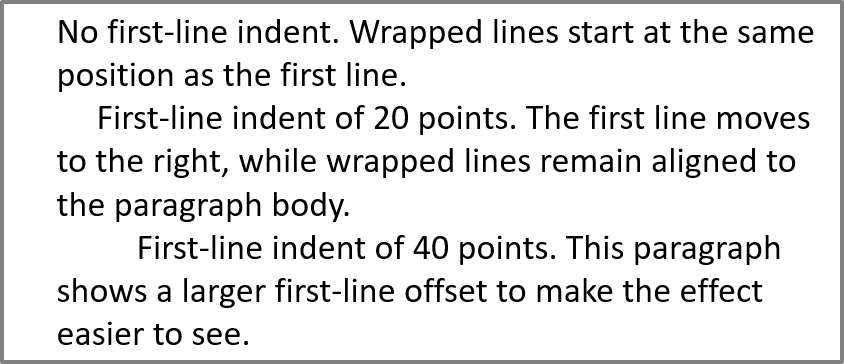

## **Tổng quan**

Aspose.Slides for Python via .NET biểu diễn văn bản dưới dạng một cấu trúc phân cấp gồm các khung văn bản, đoạn văn và phần:

* [TextFrame](https://reference.aspose.com/slides/vi/python-net/aspose.slides/textframe/) đại diện cho vùng chứa văn bản trong một hình dạng và cung cấp quyền truy cập vào bộ sưu tập đoạn văn của nó.
* [Paragraph](https://reference.aspose.com/slides/vi/python-net/aspose.slides/paragraph/) đại diện cho một đoạn văn trong khung văn bản và cung cấp quyền truy cập vào các phần và định dạng cấp độ đoạn.
* [Portion](https://reference.aspose.com/slides/vi/python-net/aspose.slides/portion/) đại diện cho một dãy ký tự trong một đoạn văn. Mỗi phần có thể có định dạng văn bản và ký tự riêng.

Do đó, một đoạn văn có thể chứa văn bản với các phông chữ, màu sắc, kích thước và định dạng khác nhau bằng cách sử dụng nhiều phần.

## **Tạo và Định dạng Đoạn Văn**

### **Tạo Đoạn Văn với Nhiều Phần**

Các bước sau tạo một khung văn bản với ba đoạn, mỗi đoạn chứa ba phần:

1. Tạo một thể hiện của lớp [Presentation](https://reference.aspose.com/slides/vi/python-net/aspose.slides/presentation/).
2. Truy cập slide tương ứng qua chỉ mục của nó.
3. Thêm một [AutoShape](https://reference.aspose.com/slides/vi/python-net/aspose.slides/autoshape/) hình chữ nhật vào slide.
4. Truy cập [TextFrame](https://reference.aspose.com/slides/vi/python-net/aspose.slides/textframe/) của hình dạng.
5. Sử dụng đoạn văn mặc định và thêm hai đối tượng [Paragraph](https://reference.aspose.com/slides/vi/python-net/aspose.slides/paragraph/) nữa vào khung văn bản.
6. Thêm đủ các đối tượng [Portion](https://reference.aspose.com/slides/vi/python-net/aspose.slides/portion/) cho mỗi đoạn để chứa ba phần. Đoạn văn mặc định đã chứa một phần trống.
7. Đặt văn bản cho mỗi phần.
8. Áp dụng định dạng cấp ký tự qua [Portion.portion_format](https://reference.aspose.com/slides/vi/python-net/aspose.slides/portion/portion_format/).
9. Lưu bản trình bày đã chỉnh sửa.

Ví dụ Python thực hiện các bước này:

```python
import aspose.pydrawing as draw
import aspose.slides as slides

with slides.Presentation() as presentation:
    slide = presentation.slides[0]
    shape = slide.shapes.add_auto_shape(slides.ShapeType.RECTANGLE, 50, 150, 300, 150)
    text_frame = shape.text_frame

    first_paragraph = text_frame.paragraphs[0]
    first_paragraph.portions.add(slides.Portion())
    first_paragraph.portions.add(slides.Portion())

    second_paragraph = slides.Paragraph()
    second_paragraph.portions.add(slides.Portion())
    second_paragraph.portions.add(slides.Portion())
    second_paragraph.portions.add(slides.Portion())
    text_frame.paragraphs.add(second_paragraph)

    third_paragraph = slides.Paragraph()
    third_paragraph.portions.add(slides.Portion())
    third_paragraph.portions.add(slides.Portion())
    third_paragraph.portions.add(slides.Portion())
    text_frame.paragraphs.add(third_paragraph)

    for paragraph_index in range(text_frame.paragraphs.count):
        paragraph = text_frame.paragraphs[paragraph_index]
        for portion_index in range(paragraph.portions.count):
            portion = paragraph.portions[portion_index]
            portion.text = f"Portion {paragraph_index + 1}.{portion_index + 1}"

            if portion_index == 0:
                portion.portion_format.fill_format.fill_type = slides.FillType.SOLID
                portion.portion_format.fill_format.solid_fill_color.color = draw.Color.red
                portion.portion_format.font_bold = slides.NullableBool.TRUE
                portion.portion_format.font_height = 15
            elif portion_index == 1:
                portion.portion_format.fill_format.fill_type = slides.FillType.SOLID
                portion.portion_format.fill_format.solid_fill_color.color = draw.Color.blue
                portion.portion_format.font_italic = slides.NullableBool.TRUE
                portion.portion_format.font_height = 18

    presentation.save("paragraphs_with_portions.pptx", slides.export.SaveFormat.PPTX)
```

## **Tạo Danh Sách Gạch Đầu Dòng và Đánh Số**

### **Tạo Danh Sách Gạch Đầu Dòng hoặc Đánh Số**

Gạch đầu dòng và đánh số giúp người đọc dễ dàng quét các mục liên quan. Trong Aspose.Slides, cài đặt danh sách được định nghĩa qua [BulletFormat](https://reference.aspose.com/slides/vi/python-net/aspose.slides/bulletformat/).

1. Tạo một thể hiện của lớp [Presentation](https://reference.aspose.com/slides/vi/python-net/aspose.slides/presentation/).
2. Truy cập slide tương ứng qua chỉ mục của nó.
3. Thêm một [AutoShape](https://reference.aspose.com/slides/vi/python-net/aspose.slides/autoshape/) vào slide đã chọn.
4. Truy cập [TextFrame](https://reference.aspose.com/slides/vi/python-net/aspose.slides/textframe/) của hình dạng.
5. Xóa đoạn văn mặc định khỏi khung văn bản.
6. Tạo một [Paragraph](https://reference.aspose.com/slides/vi/python-net/aspose.slides/paragraph/) cho gạch đầu dòng ký hiệu.
7. Đặt [BulletFormat.type](https://reference.aspose.com/slides/vi/python-net/aspose.slides/bulletformat/type/) thành [BulletType.SYMBOL](https://reference.aspose.com/slides/vi/python-net/aspose.slides/bullettype/) và chỉ định ký tự gạch đầu dòng.
8. Đặt văn bản đoạn, thụt lề, màu gạch đầu dòng và chiều cao gạch đầu dòng.
9. Thêm đoạn vào khung văn bản.
10. Tạo đoạn thứ hai và đặt [BulletFormat.type](https://reference.aspose.com/slides/vi/python-net/aspose.slides/bulletformat/type/) thành [BulletType.NUMBERED](https://reference.aspose.com/slides/vi/python-net/aspose.slides/bullettype/).
11. Cấu hình kiểu gạch đầu dòng có số và thêm đoạn vào khung văn bản.
12. Lưu bản trình bày.

Ví dụ Python này tạo một gạch đầu dòng ký hiệu và một gạch đầu dòng có số:

```python
import aspose.pydrawing as draw
import aspose.slides as slides

with slides.Presentation() as presentation:
    slide = presentation.slides[0]
    shape = slide.shapes.add_auto_shape(slides.ShapeType.RECTANGLE, 200, 200, 400, 200)
    text_frame = shape.text_frame
    text_frame.paragraphs.clear()

    symbol_paragraph = slides.Paragraph()
    symbol_paragraph.text = "Welcome to Aspose.Slides"
    symbol_paragraph.paragraph_format.bullet.type = slides.BulletType.SYMBOL
    symbol_paragraph.paragraph_format.bullet.char = chr(0x2022)
    symbol_paragraph.paragraph_format.indent = 25
    symbol_paragraph.paragraph_format.bullet.color.color_type = slides.ColorType.RGB
    symbol_paragraph.paragraph_format.bullet.color.color = draw.Color.black
    symbol_paragraph.paragraph_format.bullet.is_bullet_hard_color = slides.NullableBool.TRUE
    symbol_paragraph.paragraph_format.bullet.height = 100
    text_frame.paragraphs.add(symbol_paragraph)

    numbered_paragraph = slides.Paragraph()
    numbered_paragraph.text = "This is a numbered item"
    numbered_paragraph.paragraph_format.bullet.type = slides.BulletType.NUMBERED
    numbered_paragraph.paragraph_format.bullet.numbered_bullet_style = slides.NumberedBulletStyle.BULLET_CIRCLE_NUM_WD_BLACK_PLAIN
    numbered_paragraph.paragraph_format.indent = 25
    numbered_paragraph.paragraph_format.bullet.color.color_type = slides.ColorType.RGB
    numbered_paragraph.paragraph_format.bullet.color.color = draw.Color.black
    numbered_paragraph.paragraph_format.bullet.is_bullet_hard_color = slides.NullableBool.TRUE
    numbered_paragraph.paragraph_format.bullet.height = 100
    text_frame.paragraphs.add(numbered_paragraph)

    presentation.save("bulleted_and_numbered_list.pptx", slides.export.SaveFormat.PPTX)
```

### **Sử Dụng Gạch Đầu Dòng Hình Ảnh**

Gạch đầu dòng hình ảnh cho phép bạn dùng hình ảnh tùy chỉnh thay cho ký hiệu hoặc số.

1. Tạo một thể hiện của lớp [Presentation](https://reference.aspose.com/slides/vi/python-net/aspose.slides/presentation/).
2. Truy cập slide tương ứng qua chỉ mục của nó.
3. Thêm một [AutoShape](https://reference.aspose.com/slides/vi/python-net/aspose.slides/autoshape/) và truy cập [TextFrame](https://reference.aspose.com/slides/vi/python-net/aspose.slides/textframe/) của nó.
4. Xóa đoạn văn mặc định khỏi khung văn bản.
5. Tải ảnh gạch đầu dòng và thêm nó vào bộ sưu tập ảnh của bản trình bày dưới dạng một [PPImage](https://reference.aspose.com/slides/vi/python-net/aspose.slides/ppimage/).
6. Tạo một [Paragraph](https://reference.aspose.com/slides/vi/python-net/aspose.slides/paragraph/) và đặt văn bản cho nó.
7. Đặt [BulletFormat.type](https://reference.aspose.com/slides/vi/python-net/aspose.slides/bulletformat/type/) thành [BulletType.PICTURE](https://reference.aspose.com/slides/vi/python-net/aspose.slides/bullettype/).
8. Gán ảnh qua [BulletFormat.picture](https://reference.aspose.com/slides/vi/python-net/aspose.slides/bulletformat/picture/) và đặt chiều cao gạch đầu dòng.
9. Thêm đoạn vào khung văn bản.
10. Lưu bản trình bày đã chỉnh sửa.

Ví dụ Python này tạo một gạch đầu dòng hình ảnh:

```python
import aspose.slides as slides

with slides.Presentation() as presentation:
    slide = presentation.slides[0]

    with slides.Images.from_file("bullets.png") as bullet_image:
        presentation_image = presentation.images.add_image(bullet_image)

    shape = slide.shapes.add_auto_shape(slides.ShapeType.RECTANGLE, 200, 200, 400, 200)
    text_frame = shape.text_frame
    text_frame.paragraphs.clear()

    paragraph = slides.Paragraph()
    paragraph.text = "Welcome to Aspose.Slides"
    paragraph.paragraph_format.bullet.type = slides.BulletType.PICTURE
    paragraph.paragraph_format.bullet.picture.image = presentation_image
    paragraph.paragraph_format.bullet.height = 100
    text_frame.paragraphs.add(paragraph)

    presentation.save("picture_bullet.pptx", slides.export.SaveFormat.PPTX)
    presentation.save("picture_bullet.ppt", slides.export.SaveFormat.PPT)
```

### **Tạo Danh Sách Đa Cấp**

Đặt [ParagraphFormat.depth](https://reference.aspose.com/slides/vi/python-net/aspose.slides/paragraphformat/depth/) để đặt các đoạn ở các mức độ khác nhau của danh sách. Mức cao nhất có độ sâu `0`.

1. Tạo một [Presentation](https://reference.aspose.com/slides/vi/python-net/aspose.slides/presentation/) và truy cập một slide.
2. Thêm một [AutoShape](https://reference.aspose.com/slides/vi/python-net/aspose.slides/autoshape/) và xóa đoạn văn mặc định khỏi khung văn bản của nó.
3. Tạo bốn đoạn và cấu hình ký hiệu gạch đầu dòng cho chúng.
4. Đặt giá trị [ParagraphFormat.depth](https://reference.aspose.com/slides/vi/python-net/aspose.slides/paragraphformat/depth/) của chúng thành `0`, `1`, `2` và `3`.
5. Thêm các đoạn vào khung văn bản và lưu bản trình bày.

Ví dụ Python này tạo một danh sách gạch đầu dòng bốn cấp:

```python
import aspose.pydrawing as draw
import aspose.slides as slides

with slides.Presentation() as presentation:
    slide = presentation.slides[0]
    shape = slide.shapes.add_auto_shape(slides.ShapeType.RECTANGLE, 200, 200, 400, 200)
    text_frame = shape.text_frame
    text_frame.paragraphs.clear()

    first_paragraph = slides.Paragraph()
    first_paragraph.text = "Content"
    first_paragraph.paragraph_format.bullet.type = slides.BulletType.SYMBOL
    first_paragraph.paragraph_format.bullet.char = chr(0x2022)
    first_paragraph.paragraph_format.default_portion_format.fill_format.fill_type = slides.FillType.SOLID
    first_paragraph.paragraph_format.default_portion_format.fill_format.solid_fill_color.color = draw.Color.black
    first_paragraph.paragraph_format.depth = 0

    second_paragraph = slides.Paragraph()
    second_paragraph.text = "Second level"
    second_paragraph.paragraph_format.bullet.type = slides.BulletType.SYMBOL
    second_paragraph.paragraph_format.bullet.char = "-"
    second_paragraph.paragraph_format.default_portion_format.fill_format.fill_type = slides.FillType.SOLID
    second_paragraph.paragraph_format.default_portion_format.fill_format.solid_fill_color.color = draw.Color.black
    second_paragraph.paragraph_format.depth = 1

    third_paragraph = slides.Paragraph()
    third_paragraph.text = "Third level"
    third_paragraph.paragraph_format.bullet.type = slides.BulletType.SYMBOL
    third_paragraph.paragraph_format.bullet.char = chr(0x2022)
    third_paragraph.paragraph_format.default_portion_format.fill_format.fill_type = slides.FillType.SOLID
    third_paragraph.paragraph_format.default_portion_format.fill_format.solid_fill_color.color = draw.Color.black
    third_paragraph.paragraph_format.depth = 2

    fourth_paragraph = slides.Paragraph()
    fourth_paragraph.text = "Fourth level"
    fourth_paragraph.paragraph_format.bullet.type = slides.BulletType.SYMBOL
    fourth_paragraph.paragraph_format.bullet.char = "-"
    fourth_paragraph.paragraph_format.default_portion_format.fill_format.fill_type = slides.FillType.SOLID
    fourth_paragraph.paragraph_format.default_portion_format.fill_format.solid_fill_color.color = draw.Color.black
    fourth_paragraph.paragraph_format.depth = 3

    text_frame.paragraphs.add(first_paragraph)
    text_frame.paragraphs.add(second_paragraph)
    text_frame.paragraphs.add(third_paragraph)
    text_frame.paragraphs.add(fourth_paragraph)

    presentation.save("multilevel_list.pptx", slides.export.SaveFormat.PPTX)
```

### **Bắt Đầu Các Mục Danh Sách Đánh Số với Giá Trị Tùy Chỉnh**

Sử dụng [BulletFormat.numbered_bullet_start_with](https://reference.aspose.com/slides/vi/python-net/aspose.slides/bulletformat/numbered_bullet_start_with/) để đặt số đầu tiên hiển thị cho một đoạn có đánh số.

1. Tạo một [Presentation](https://reference.aspose.com/slides/vi/python-net/aspose.slides/presentation/) và thêm một [AutoShape](https://reference.aspose.com/slides/vi/python-net/aspose.slides/autoshape/) vào một slide.
2. Xóa đoạn văn mặc định khỏi khung văn bản của hình dạng.
3. Tạo ba đoạn có đánh số.
4. Đặt [BulletFormat.numbered_bullet_start_with](https://reference.aspose.com/slides/vi/python-net/aspose.slides/bulletformat/numbered_bullet_start_with/) thành `2`, `3` và `7` cho các đoạn tương ứng.
5. Thêm các đoạn vào khung văn bản và lưu bản trình bày.

Ví dụ Python này gán số bắt đầu tùy chỉnh cho mỗi đoạn:

```python
import aspose.slides as slides

with slides.Presentation() as presentation:
    slide = presentation.slides[0]
    shape = slide.shapes.add_auto_shape(slides.ShapeType.RECTANGLE, 200, 200, 400, 200)
    text_frame = shape.text_frame
    text_frame.paragraphs.clear()

    first_paragraph = slides.Paragraph()
    first_paragraph.text = "Start at 2"
    first_paragraph.paragraph_format.bullet.type = slides.BulletType.NUMBERED
    first_paragraph.paragraph_format.bullet.numbered_bullet_start_with = 2
    text_frame.paragraphs.add(first_paragraph)

    second_paragraph = slides.Paragraph()
    second_paragraph.text = "Start at 3"
    second_paragraph.paragraph_format.bullet.type = slides.BulletType.NUMBERED
    second_paragraph.paragraph_format.bullet.numbered_bullet_start_with = 3
    text_frame.paragraphs.add(second_paragraph)

    third_paragraph = slides.Paragraph()
    third_paragraph.text = "Start at 7"
    third_paragraph.paragraph_format.bullet.type = slides.BulletType.NUMBERED
    third_paragraph.paragraph_format.bullet.numbered_bullet_start_with = 7
    text_frame.paragraphs.add(third_paragraph)

    presentation.save("custom_numbered_list.pptx", slides.export.SaveFormat.PPTX)
```

## **Kiểm Soát Bố Cục Đoạn Văn và Thuộc Tính Kết Thúc**

### **Đặt Thụt Lề Dòng Đầu**

Sử dụng thuộc tính [ParagraphFormat.indent](https://reference.aspose.com/slides/vi/python-net/aspose.slides/paragraphformat/indent/) để kiểm soát thụt lề dòng đầu của một đoạn. Thuộc tính này chỉ di chuyển dòng đầu so với lề trái của đoạn. Giá trị dương dịch dòng đầu sang phải, trong khi các dòng còn lại vẫn căn chỉnh với thân đoạn.

Sử dụng [ParagraphFormat.margin_left](https://reference.aspose.com/slides/vi/python-net/aspose.slides/paragraphformat/margin_left/) khi bạn cần di chuyển toàn bộ đoạn. Sử dụng [ParagraphFormat.indent](https://reference.aspose.com/slides/vi/python-net/aspose.slides/paragraphformat/indent/) khi bạn chỉ muốn di chuyển dòng đầu.

Ví dụ dưới đây tạo một số đoạn và áp dụng các giá trị [ParagraphFormat.indent](https://reference.aspose.com/slides/vi/python-net/aspose.slides/paragraphformat/indent/) khác nhau để minh họa cách thụt lề dòng đầu ảnh hưởng đến bố cục đoạn.

1. Tạo một thể hiện của lớp [Presentation](https://reference.aspose.com/slides/vi/python-net/aspose.slides/presentation/).
2. Truy cập slide mục tiêu.
3. Thêm một [AutoShape](https://reference.aspose.com/slides/vi/python-net/aspose.slides/autoshape/) hình chữ nhật vào slide.
4. Truy cập [TextFrame](https://reference.aspose.com/slides/vi/python-net/aspose.slides/textframe/) của hình dạng và xóa đoạn văn mặc định.
5. Tạo một số đoạn và đặt các giá trị [ParagraphFormat.indent](https://reference.aspose.com/slides/vi/python-net/aspose.slides/paragraphformat/indent/) khác nhau cho chúng.
6. Thêm các đoạn vào khung văn bản.
7. Lưu bản trình bày đã chỉnh sửa.

Mã này cho bạn cách đặt thụt lề cho một đoạn:

```python
import aspose.pydrawing as draw
import aspose.slides as slides

with slides.Presentation() as presentation:
    slide = presentation.slides[0]
    shape = slide.shapes.add_auto_shape(slides.ShapeType.RECTANGLE, 50, 50, 420, 220)
    shape.fill_format.fill_type = slides.FillType.NO_FILL
    shape.line_format.fill_format.fill_type = slides.FillType.SOLID
    shape.line_format.fill_format.solid_fill_color.color = draw.Color.gray

    text_frame = shape.text_frame
    text_frame.text_frame_format.autofit_type = slides.TextAutofitType.SHAPE
    text_frame.paragraphs.clear()

    first_paragraph = slides.Paragraph()
    first_paragraph.text = "No first-line indent. Wrapped lines start at the same position as the first line."
    first_paragraph.paragraph_format.default_portion_format.fill_format.fill_type = slides.FillType.SOLID
    first_paragraph.paragraph_format.default_portion_format.fill_format.solid_fill_color.color = draw.Color.black
    first_paragraph.paragraph_format.margin_left = 20
    first_paragraph.paragraph_format.indent = 0

    second_paragraph = slides.Paragraph()
    second_paragraph.text = "First-line indent of 20 points. The first line moves to the right, while wrapped lines remain aligned to the paragraph body."
    second_paragraph.paragraph_format.default_portion_format.fill_format.fill_type = slides.FillType.SOLID
    second_paragraph.paragraph_format.default_portion_format.fill_format.solid_fill_color.color = draw.Color.black
    second_paragraph.paragraph_format.margin_left = 20
    second_paragraph.paragraph_format.indent = 20

    third_paragraph = slides.Paragraph()
    third_paragraph.text = "First-line indent of 40 points. This paragraph shows a larger first-line offset to make the effect easier to see."
    third_paragraph.paragraph_format.default_portion_format.fill_format.fill_type = slides.FillType.SOLID
    third_paragraph.paragraph_format.default_portion_format.fill_format.solid_fill_color.color = draw.Color.black
    third_paragraph.paragraph_format.margin_left = 20
    third_paragraph.paragraph_format.indent = 40

    text_frame.paragraphs.add(first_paragraph)
    text_frame.paragraphs.add(second_paragraph)
    text_frame.paragraphs.add(third_paragraph)

    presentation.save("paragraph_indent.pptx", slides.export.SaveFormat.PPTX)
```

Kết quả:



### **Đặt Thụt Lề Treo**

Thụt lề treo là bố cục đoạn trong đó dòng đầu bắt đầu ở phía trái so với các dòng còn lại. Trong Aspose.Slides, bạn tạo hiệu ứng này bằng thuộc tính [ParagraphFormat.indent](https://reference.aspose.com/slides/vi/python-net/aspose.slides/paragraphformat/indent/). Đặt `indent` thành giá trị âm để di chuyển dòng đầu sang trái so với thân đoạn.

Trong thực tế, [ParagraphFormat.margin_left](https://reference.aspose.com/slides/vi/python-net/aspose.slides/paragraphformat/margin_left/) xác định vị trí trái của thân đoạn, và [ParagraphFormat.indent](https://reference.aspose.com/slides/vi/python-net/aspose.slides/paragraphformat/indent/) xác định vị trí của dòng đầu so với lề đó. Để tạo thụt lề treo, đặt giá trị `margin_left` dương và giá trị `indent` âm.

Định dạng này hữu ích cho các mục thư mục, tham chiếu, mục từ điển và các đoạn khác mà các dòng gói cần căn dưới thân đoạn thay vì dưới ký tự đầu tiên của dòng đầu.

1. Tạo một thể hiện của lớp [Presentation](https://reference.aspose.com/slides/vi/python-net/aspose.slides/presentation/).
2. Truy cập slide mục tiêu.
3. Thêm một [AutoShape](https://reference.aspose.com/slides/vi/python-net/aspose.slides/autoshape/) hình chữ nhật vào slide.
4. Truy cập [TextFrame](https://reference.aspose.com/slides/vi/python-net/aspose.slides/textframe/) của hình dạng và xóa đoạn văn mặc định.
5. Tạo các đoạn và đặt một giá trị [ParagraphFormat.margin_left](https://reference.aspose.com/slides/vi/python-net/aspose.slides/paragraphformat/margin_left/) dương cho mỗi đoạn.
6. Đặt một giá trị [ParagraphFormat.indent](https://reference.aspose.com/slides/vi/python-net/aspose.slides/paragraphformat/indent/) âm để tạo hiệu ứng thụt lề treo.
7. Thêm các đoạn vào khung văn bản.
8. Lưu bản trình bày đã chỉnh sửa.

Mã này cho bạn cách đặt thụt lề treo cho một đoạn:

```python
import aspose.pydrawing as draw
import aspose.slides as slides

with slides.Presentation() as presentation:
    slide = presentation.slides[0]
    shape = slide.shapes.add_auto_shape(slides.ShapeType.RECTANGLE, 50, 50, 420, 220)
    shape.fill_format.fill_type = slides.FillType.NO_FILL
    shape.line_format.fill_format.fill_type = slides.FillType.SOLID
    shape.line_format.fill_format.solid_fill_color.color = draw.Color.gray

    text_frame = shape.text_frame
    text_frame.text_frame_format.autofit_type = slides.TextAutofitType.SHAPE
    text_frame.paragraphs.clear()

    first_paragraph = slides.Paragraph()
    first_paragraph.text = "A hanging indent is created by combining a positive left margin with a negative indent. The first line starts to the left, while wrapped lines align with the paragraph body."
    first_paragraph.paragraph_format.default_portion_format.fill_format.fill_type = slides.FillType.SOLID
    first_paragraph.paragraph_format.default_portion_format.fill_format.solid_fill_color.color = draw.Color.black
    first_paragraph.paragraph_format.margin_left = 40
    first_paragraph.paragraph_format.indent = -20

    second_paragraph = slides.Paragraph()
    second_paragraph.text = "This second example uses a deeper hanging indent so the difference between the first line and the wrapped lines is easier to compare."
    second_paragraph.paragraph_format.default_portion_format.fill_format.fill_type = slides.FillType.SOLID
    second_paragraph.paragraph_format.default_portion_format.fill_format.solid_fill_color.color = draw.Color.black
    second_paragraph.paragraph_format.margin_left = 60
    second_paragraph.paragraph_format.indent = -30

    text_frame.paragraphs.add(first_paragraph)
    text_frame.paragraphs.add(second_paragraph)

    presentation.save("hanging_indent.pptx", slides.export.SaveFormat.PPTX)
```

Kết quả:


### **Đặt Thuộc Tính Kết Thúc Đoạn Văn**

Thuộc tính [Paragraph.end_paragraph_portion_format](https://reference.aspose.com/slides/vi/python-net/aspose.slides/paragraph/end_paragraph_portion_format/) điều khiển định dạng của ký hiệu kết thúc đoạn. Ví dụ sau gán kích thước phông chữ và phông Latin cho ký hiệu kết thúc của đoạn thứ hai:

1. Tải một [Presentation](https://reference.aspose.com/slides/vi/python-net/aspose.slides/presentation/) và truy cập một slide.
2. Thêm một [AutoShape](https://reference.aspose.com/slides/vi/python-net/aspose.slides/autoshape/) và xóa đoạn văn mặc định của nó.
3. Tạo hai đoạn và thêm các phần văn bản vào chúng.
4. Tạo một [PortionFormat](https://reference.aspose.com/slides/vi/python-net/aspose.slides/portionformat/) cho ký hiệu kết thúc của đoạn thứ hai.
5. Đặt [PortionFormat.font_height](https://reference.aspose.com/slides/vi/python-net/aspose.slides/portionformat/font_height/) và [PortionFormat.latin_font](https://reference.aspose.com/slides/vi/python-net/aspose.slides/portionformat/latin_font/).
6. Gán định dạng cho [Paragraph.end_paragraph_portion_format](https://reference.aspose.com/slides/vi/python-net/aspose.slides/paragraph/end_paragraph_portion_format/) và lưu bản trình bày.

```python
import aspose.slides as slides

with slides.Presentation("Test.pptx") as presentation:
    slide = presentation.slides[0]
    shape = slide.shapes.add_auto_shape(slides.ShapeType.RECTANGLE, 10, 10, 200, 250)
    text_frame = shape.text_frame
    text_frame.paragraphs.clear()

    first_paragraph = slides.Paragraph()
    first_paragraph.portions.add(slides.Portion("Sample text"))

    second_paragraph = slides.Paragraph()
    second_paragraph.portions.add(slides.Portion("Sample text 2"))

    end_paragraph_format = slides.PortionFormat()
    end_paragraph_format.font_height = 48
    end_paragraph_format.latin_font = slides.FontData("Times New Roman")
    second_paragraph.end_paragraph_portion_format = end_paragraph_format

    text_frame.paragraphs.add(first_paragraph)
    text_frame.paragraphs.add(second_paragraph)

    presentation.save("end_paragraph_format.pptx", slides.export.SaveFormat.PPTX)
```

## **Nhập và Xuất Nội Dung Đoạn Văn**

### **Nhập Văn Bản HTML vào Đoạn Văn**

Sử dụng [ParagraphCollection.add_from_html](https://reference.aspose.com/slides/vi/python-net/aspose.slides/paragraphcollection/add_from_html/) để chuyển đổi mã HTML thành các đoạn và phần trong một khung văn bản.

1. Tạo một thể hiện của lớp [Presentation](https://reference.aspose.com/slides/vi/python-net/aspose.slides/presentation/).
2. Truy cập một slide và thêm một [AutoShape](https://reference.aspose.com/slides/vi/python-net/aspose.slides/autoshape/).
3. Truy cập [TextFrame](https://reference.aspose.com/slides/vi/python-net/aspose.slides/textframe/) của hình dạng và xóa đoạn văn mặc định.
4. Đọc tệp HTML nguồn.
5. Gửi chuỗi HTML tới [ParagraphCollection.add_from_html](https://reference.aspose.com/slides/vi/python-net/aspose.slides/paragraphcollection/add_from_html/).
6. Lưu bản trình bày đã chỉnh sửa.

Ví dụ Python này nhập HTML vào một khung văn bản:

```python
import aspose.slides as slides

with slides.Presentation() as presentation:
    slide = presentation.slides[0]
    shape_width = presentation.slide_size.size.width - 20
    shape_height = presentation.slide_size.size.height - 20
    shape = slide.shapes.add_auto_shape(slides.ShapeType.RECTANGLE, 10, 10, shape_width, shape_height)
    shape.fill_format.fill_type = slides.FillType.NO_FILL
    shape.text_frame.paragraphs.clear()

    with open("file.html", "r", encoding="utf-8") as html_stream:
        html = html_stream.read()

    shape.text_frame.paragraphs.add_from_html(html)
    presentation.save("html_text.pptx", slides.export.SaveFormat.PPTX)
```

### **Xuất Văn Bản Đoạn Sang HTML**

Sử dụng [ParagraphCollection.export_to_html](https://reference.aspose.com/slides/vi/python-net/aspose.slides/paragraphcollection/export_to_html/) để xuất một phạm vi đoạn đã chọn dưới dạng HTML.

1. Tạo một thể hiện của lớp [Presentation](https://reference.aspose.com/slides/vi/python-net/aspose.slides/presentation/) và tải bản trình bày mong muốn.
2. Truy cập slide và tìm [AutoShape](https://reference.aspose.com/slides/vi/python-net/aspose.slides/autoshape/) chứa văn bản.
3. Truy cập [TextFrame](https://reference.aspose.com/slides/vi/python-net/aspose.slides/textframe/) của hình dạng.
4. Gọi [ParagraphCollection.export_to_html](https://reference.aspose.com/slides/vi/python-net/aspose.slides/paragraphcollection/export_to_html/) với chỉ mục đoạn bắt đầu và số đoạn cần xuất.
5. Ghi chuỗi HTML trả về vào tệp.

Ví dụ Python này xuất tất cả các đoạn từ hình dạng văn bản đầu tiên:

```python
import aspose.slides as slides

with slides.Presentation("ExportingHTMLText.pptx") as presentation:
    shape = presentation.slides[0].shapes[0]

    if isinstance(shape, slides.AutoShape) and shape.text_frame is not None:
        paragraphs = shape.text_frame.paragraphs
        html = paragraphs.export_to_html(0, paragraphs.count, None)
        with open("paragraphs.html", "w", encoding="utf-8") as html_stream:
            html_stream.write(html)
    else:
        print("The first shape is not a text shape.")
```

### **Kết Xuất Đoạn Văn Thành Hình Ảnh**

[Paragraph](https://reference.aspose.com/slides/vi/python-net/aspose.slides/paragraph/) cung cấp phương thức `get_image` để kết xuất trực tiếp một đoạn riêng lẻ. Phương thức trả về một đối tượng [IImage](https://reference.aspose.com/slides/vi/python-net/aspose.slides/iimage/) mà bạn có thể lưu vào tệp hoặc luồng bằng [IImage.save](https://reference.aspose.com/slides/vi/python-net/aspose.slides/iimage/save/). Bạn không cần phải kết xuất toàn bộ hình dạng chứa hoặc cắt bitmap thủ công.

Phương thức `get_image` có thể trả về `None` nếu đoạn không tồn tại trong bộ sưu tập cha, không có giới hạn kết xuất hợp lệ, hoặc không thể được kết xuất. Kiểm tra kết quả trước khi lưu và sử dụng hình ảnh trả về như một context manager để giải phóng tài nguyên.

#### **Kết Xuất Đoạn Ở Tỷ Lệ Mặc Định**

Giả sử chúng ta có một tệp trình chiếu có tên sample.pptx với một slide, trong đó hình dạng đầu tiên là một khung văn bản chứa ba đoạn.


Ví dụ sau kết xuất đoạn thứ hai trong một hình dạng văn bản thông thường ở tỷ lệ mặc định và lưu hình ảnh trả về ở định dạng PNG:

```python
import aspose.slides as slides

with slides.Presentation("sample.pptx") as presentation:
    shape = presentation.slides[0].shapes[0]

    if isinstance(shape, slides.AutoShape) and shape.text_frame is not None and shape.text_frame.paragraphs.count > 1:
        paragraph = shape.text_frame.paragraphs[1]
        paragraph_image = paragraph.get_image()

        if paragraph_image is not None:
            with paragraph_image:
                paragraph_image.save("paragraph.png", slides.ImageFormat.PNG)
        else:
            print("The paragraph could not be rendered.")
    else:
        print("The expected text shape or paragraph was not found.")
```

Kết quả:


#### **Kết Xuất Đoạn Trong Ô Bảng Với Thuật Toán Thu Phóng**

Cung cấp các hệ số thu phóng ngang và dọc cho `get_image` để điều khiển kích thước của đoạn đã kết xuất. Ví dụ sau tạo một bảng, kết xuất đoạn trong ô đầu tiên với độ rộng và chiều cao gấp đôi so với mặc định, và lưu kết quả dưới dạng PNG:

```python
import aspose.slides as slides

scale_x = 2
scale_y = 2

with slides.Presentation() as presentation:
    slide = presentation.slides[0]
    table = slide.shapes.add_table(50, 50, [300], [80])
    paragraph = table.rows[0][0].text_frame.paragraphs[0]
    paragraph.text = "Text in a table cell"

    paragraph_image = paragraph.get_image(scale_x, scale_y)
    if paragraph_image is not None:
        with paragraph_image:
            paragraph_image.save("table_paragraph.png", slides.ImageFormat.PNG)
    else:
        print("The paragraph could not be rendered.")
```

Hệ số `1` giữ trục đó ở kích thước pixel mặc định. Ví dụ, `2` cho cả hai hệ số tạo ra một hình ảnh có chiều rộng và chiều cao xấp xỉ gấp đôi kích thước mặc định, tương đương bốn lần số pixel. Các hệ số lớn hơn thường tạo ra văn bản sắc nét hơn cho việc phóng to hoặc xuất độ phân giải cao, nhưng cũng tăng mức sử dụng bộ nhớ và kích thước tệp. Các hệ số dưới `1` tạo ra hình ảnh nhỏ hơn với ít chi tiết hơn. Sử dụng các hệ số bằng nhau để giữ tỷ lệ khung hình của đoạn; các hệ số ngang và dọc khác nhau sẽ kéo dài đầu ra một cách độc lập.

Kết xuất toàn bộ hình dạng bằng [Shape.get_image](https://reference.aspose.com/slides/vi/python-net/aspose.slides/shape/get_image/) vẫn hữu ích khi đầu ra cần bao gồm nền, viền hoặc bối cảnh hình ảnh khác của hình dạng. Đối với hình ảnh chỉ chứa đoạn, hãy dùng `Paragraph.get_image`.

## **Câu Hỏi Thường Gặp**

**Tôi có thể tắt hoàn toàn việc ngắt dòng trong khung văn bản không?**

Có. Đặt [TextFrameFormat.wrap_text](https://reference.aspose.com/slides/vi/python-net/aspose.slides/textframeformat/wrap_text/) để tắt ngắt dòng để các dòng không bị cắt tại cạnh khung văn bản.

**Làm sao tôi có thể lấy giới hạn chính xác trên slide của một đoạn cụ thể?**

Sử dụng [Paragraph.get_rect](https://reference.aspose.com/slides/vi/python-net/aspose.slides/paragraph/get_rect/) để lấy hình chữ nhật bao quanh đoạn. [Portion.get_rect](https://reference.aspose.com/slides/vi/python-net/aspose.slides/portion/get_rect/) cung cấp giới hạn của một phần riêng lẻ.

**Nơi nào định dạng căn chỉnh đoạn (trái, phải, giữa hoặc đều) được kiểm soát?**

[ParagraphFormat.alignment](https://reference.aspose.com/slides/vi/python-net/aspose.slides/paragraphformat/alignment/) là thiết lập cấp đoạn và áp dụng cho toàn bộ đoạn bất kể định dạng riêng của các phần.

**Tôi có thể đặt ngôn ngữ kiểm tra chính tả cho một phần của đoạn không?**

Có. Đặt [PortionFormat.language_id](https://reference.aspose.com/slides/vi/python-net/aspose.slides/portionformat/language_id/) cho các phần riêng lẻ, vì vậy một đoạn có thể chứa văn bản bằng nhiều ngôn ngữ.