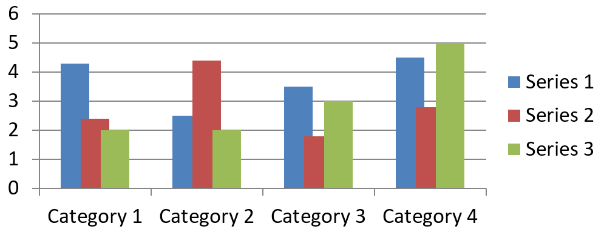
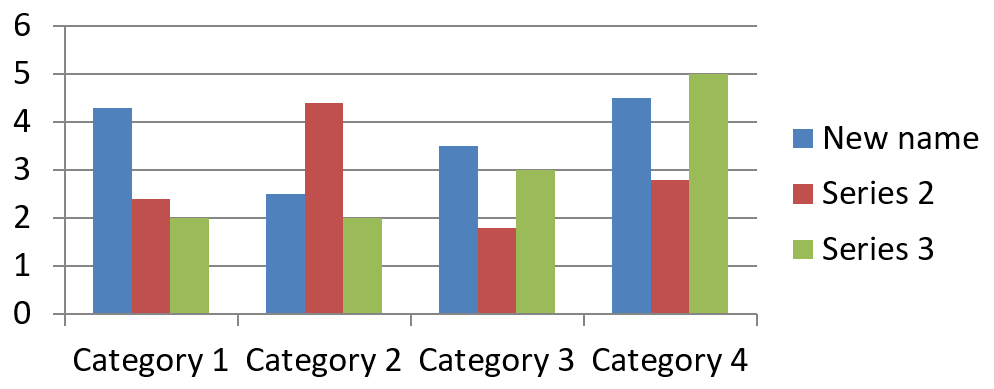

## **Tổng quan**

Bài viết này mô tả vai trò của [ChartSeries](https://reference.aspose.com/slides/vi/python-net/aspose.slides.charts/chartseries/) trong Aspose.Slides for Python, tập trung vào cách dữ liệu được cấu trúc và hiển thị trong các bản thuyết trình. Những đối tượng này cung cấp các yếu tố nền tảng để định nghĩa từng tập hợp các điểm dữ liệu, danh mục và các tham số hiển thị trong một biểu đồ. Khi làm việc với [ChartSeries](https://reference.aspose.com/slides/vi/python-net/aspose.slides.charts/chartseries/), các lập trình viên có thể tích hợp liền mạch các nguồn dữ liệu nền và duy trì kiểm soát đầy đủ cách thông tin được hiển thị, tạo ra các bản thuyết trình động, dựa trên dữ liệu, truyền tải rõ ràng các hiểu biết và phân tích.

Một series là một hàng hoặc một cột các số được vẽ trên biểu đồ.


## **Đặt chồng lớp chuỗi**

Thuộc tính [ChartSeries.overlap](https://reference.aspose.com/slides/vi/python-net/aspose.slides.charts/chartseries/overlap/) kiểm soát cách các thanh và cột chồng lên nhau trong biểu đồ 2D bằng cách chỉ định một phạm vi từ -100 đến 100. Vì thuộc tính này liên kết với nhóm series chứ không phải từng series riêng lẻ, nên nó chỉ đọc ở mức series. Để cấu hình giá trị chồng lớp, hãy sử dụng thuộc tính `parent_series_group.overlap` cho phép đọc/ghi, thuộc tính này sẽ áp dụng giá trị chồng lớp đã chỉ định cho tất cả các series trong nhóm đó.

Dưới đây là một ví dụ Python minh họa cách tạo bản thuyết trình, thêm biểu đồ cột nhóm, truy cập series đầu tiên, cấu hình thiết lập chồng lớp và sau đó lưu kết quả dưới dạng tệp PPTX:

```py
import aspose.slides as slides
import aspose.slides.charts as charts

series_overlap = 30

with slides.Presentation() as presentation:
    slide = presentation.slides[0]

    # Thêm biểu đồ cột nhóm với dữ liệu mặc định.
    chart = slide.shapes.add_chart(charts.ChartType.CLUSTERED_COLUMN, 20, 20, 500, 200)

    series = chart.chart_data.series[0]
    if series.overlap == 0:
        # Đặt chồng lớp chuỗi.
        series.parent_series_group.overlap = series_overlap

    # Lưu tệp bản thuyết trình vào đĩa.
    presentation.save("series_overlap.pptx", slides.export.SaveFormat.PPTX)
```

Kết quả:



## **Thay đổi màu nền chuỗi**

Aspose.Slides giúp việc tùy chỉnh màu nền của series trong biểu đồ trở nên đơn giản, cho phép bạn làm nổi bật các điểm dữ liệu cụ thể và tạo ra các biểu đồ hấp dẫn về mặt hình ảnh. Điều này được thực hiện thông qua đối tượng [Format](https://reference.aspose.com/slides/vi/python-net/aspose.slides.charts/format/), hỗ trợ nhiều loại nền, cấu hình màu và các tùy chọn kiểu dáng nâng cao khác. Sau khi thêm biểu đồ vào một slide và truy cập series mong muốn, chỉ cần lấy series và áp dụng màu nền phù hợp. Ngoài các nền đặc, bạn còn có thể sử dụng nền gradient hoặc pattern để tăng tính linh hoạt trong thiết kế. Khi đã thiết lập màu sắc theo yêu cầu, lưu bản thuyết trình để hoàn thiện giao diện mới.

Ví dụ mã Python sau cho thấy cách thay đổi màu của series đầu tiên:

```py
import aspose.slides as slides
import aspose.slides.charts as charts
import aspose.pydrawing as draw

series_color = draw.Color.blue

with slides.Presentation() as presentation:
    slide = presentation.slides[0]

    # Thêm biểu đồ cột nhóm với dữ liệu mặc định.
    chart = slide.shapes.add_chart(charts.ChartType.CLUSTERED_COLUMN, 20, 20, 500, 200)

    # Đặt màu cho series đầu tiên.
    series = chart.chart_data.series[0]
    series.format.fill.fill_type = slides.FillType.SOLID
    series.format.fill.solid_fill_color.color = series_color

    # Lưu tệp bản thuyết trình vào đĩa.
    presentation.save("series_color.pptx", slides.export.SaveFormat.PPTX)
```

Kết quả:


## **Đổi tên chuỗi**

Aspose.Slides cung cấp cách đơn giản để sửa đổi tên của các series trong biểu đồ, giúp gắn nhãn dữ liệu một cách rõ ràng và có ý nghĩa hơn. Bằng cách truy cập ô worksheet tương ứng trong dữ liệu biểu đồ, các lập trình viên có thể tùy chỉnh cách dữ liệu được trình bày. Việc này đặc biệt hữu ích khi cần cập nhật hoặc làm rõ tên series dựa trên ngữ cảnh của dữ liệu. Sau khi đổi tên series, bản thuyết trình có thể được lưu để duy trì các thay đổi.

Dưới đây là đoạn mã Python minh họa quy trình này trong thực tế.

```py
import aspose.slides as slides
import aspose.slides.charts as charts

series_name = "New name"

with slides.Presentation() as presentation:
    slide = presentation.slides[0]

    # Thêm biểu đồ cột nhóm với dữ liệu mặc định.
    chart = slide.shapes.add_chart(charts.ChartType.CLUSTERED_COLUMN, 20, 20, 500, 200)
    
    # Đặt tên cho series đầu tiên.
    series_cell = chart.chart_data.chart_data_workbook.get_cell(0, 0, 1)
    series_cell.value = series_name
    
    # Lưu tệp bản thuyết trình vào đĩa.
    presentation.save("series_name.pptx", slides.export.SaveFormat.PPTX)
```

Đoạn mã Python sau cho thấy cách thay đổi tên series theo một phương pháp thay thế:

```py
import aspose.slides as slides
import aspose.slides.charts as charts

series_name = "New name"

with slides.Presentation() as presentation:
    slide = presentation.slides[0]

    # Thêm biểu đồ cột nhóm với dữ liệu mặc định.
    chart = slide.shapes.add_chart(charts.ChartType.CLUSTERED_COLUMN, 20, 20, 500, 200)
    series = chart.chart_data.series[0]
    
    # Đặt tên cho series đầu tiên.
    series.name.as_cells[0].value = series_name

    # Lưu tệp bản thuyết trình vào đĩa.
    presentation.save("series_name.pptx", slides.export.SaveFormat.PPTX) 
```

Kết quả:



## **Lấy màu nền tự động cho chuỗi**

Aspose.Slides for Python cho phép bạn lấy màu nền tự động cho series trong biểu đồ ở vùng vẽ. Sau khi tạo một thể hiện của lớp [Presentation](https://reference.aspose.com/slides/vi/python-net/aspose.slides/presentation/), bạn có thể lấy tham chiếu tới slide mong muốn bằng chỉ số, rồi thêm một biểu đồ với loại bạn muốn (ví dụ `ChartType.CLUSTERED_COLUMN`). Bằng cách truy cập series trong biểu đồ, bạn có thể lấy màu nền tự động.

Mã Python dưới đây trình bày chi tiết quy trình này.

```py
import aspose.slides as slides
import aspose.slides.charts as charts

with slides.Presentation() as presentation:
    slide = presentation.slides[0]

    # Thêm biểu đồ cột nhóm với dữ liệu mặc định.
    chart = slide.shapes.add_chart(charts.ChartType.CLUSTERED_COLUMN, 20, 20, 500, 200)

    for i in range(len(chart.chart_data.series)):
        # Lấy màu nền của series.
        color = chart.chart_data.series[i].get_automatic_series_color()
        print(f"Series {i} color: {color.name}")
```

Kết quả mẫu:

```text
Series 0 color: ff4f81bd
Series 1 color: ffc0504d
Series 2 color: ff9bbb59
```

## **Đặt màu nền đảo ngược cho chuỗi**

Khi series dữ liệu của bạn chứa cả giá trị dương và âm, việc tô màu mọi cột hoặc thanh cùng một màu có thể làm biểu đồ khó đọc. Aspose.Slides for Python cho phép bạn chỉ định màu nền đảo ngược — một màu nền riêng được áp dụng tự động cho các điểm dữ liệu dưới zero — để các giá trị âm nổi bật ngay lập tức. Trong phần này, bạn sẽ học cách bật tùy chọn này, chọn màu phù hợp và lưu bản thuyết trình đã cập nhật.

Ví dụ mã sau minh họa thao tác:

```py
import aspose.slides as slides
import aspose.slides.charts as charts
import aspose.pydrawing as draw

invert_color = draw.Color.red

with slides.Presentation() as presentation:
    slide = presentation.slides[0]

    chart = slide.shapes.add_chart(charts.ChartType.CLUSTERED_COLUMN, 20, 20, 500, 200)
    workBook = chart.chart_data.chart_data_workbook

    chart.chart_data.series.clear()
    chart.chart_data.categories.clear()

    # Thêm các danh mục mới.
    chart.chart_data.categories.add(workBook.get_cell(0, 1, 0, "Category 1"))
    chart.chart_data.categories.add(workBook.get_cell(0, 2, 0, "Category 2"))
    chart.chart_data.categories.add(workBook.get_cell(0, 3, 0, "Category 3"))

    # Thêm một series mới.
    series = chart.chart_data.series.add(workBook.get_cell(0, 0, 1, "Series 1"), chart.type)

    # Điền dữ liệu cho series.
    series.data_points.add_data_point_for_bar_series(workBook.get_cell(0, 1, 1, -20))
    series.data_points.add_data_point_for_bar_series(workBook.get_cell(0, 2, 1, 50))
    series.data_points.add_data_point_for_bar_series(workBook.get_cell(0, 3, 1, -30))

    # Đặt cài đặt màu cho series.
    series_color = series.get_automatic_series_color()
    series.invert_if_negative = True
    series.format.fill.fill_type = slides.FillType.SOLID
    series.format.fill.solid_fill_color.color = series_color
    series.inverted_solid_fill_color.color = invert_color
    presentation.save("inverted_solid_fill_color.pptx", slides.export.SaveFormat.PPTX)
```

Kết quả:


Bạn cũng có thể đảo ngược màu nền cho một điểm dữ liệu duy nhất thay vì toàn bộ series. Chỉ cần truy cập `ChartDataPoint` mong muốn và đặt thuộc tính `invert_if_negative` thành `True`.

Ví dụ mã sau cho thấy cách thực hiện:

```py
import aspose.slides as slides
import aspose.slides.charts as charts
import aspose.pydrawing as draw

with slides.Presentation() as presentation:
    slide = presentation.slides[0]

	chart = slide.shapes.add_chart(charts.ChartType.CLUSTERED_COLUMN, 20, 20, 500, 200, True)
	chart.chart_data.series.clear()

	series = series.add(chart.chart_data.chart_data_workbook.get_cell(0, "B1"), chart.type)

	series.data_points.add_data_point_for_bar_series(chart.chart_data.chart_data_workbook.get_cell(0, "B2", -5))
	series.data_points.add_data_point_for_bar_series(chart.chart_data.chart_data_workbook.get_cell(0, "B3", 3))
	series.data_points.add_data_point_for_bar_series(chart.chart_data.chart_data_workbook.get_cell(0, "B4", -3))
	series.data_points.add_data_point_for_bar_series(chart.chart_data.chart_data_workbook.get_cell(0, "B5", 1))

	series.invert_if_negative = False
	series.data_points[2].invert_if_negative = True

	presentation.save("data_point_invert_color_if_negative.pptx", slides.export.SaveFormat.PPTX)
```

## **Xóa dữ liệu cho các điểm dữ liệu cụ thể**

Đôi khi một biểu đồ chứa các giá trị thử nghiệm, ngoại lệ hoặc mục đã lỗi thời mà bạn cần loại bỏ mà không phải xây dựng lại toàn bộ series. Aspose.Slides for Python cho phép bạn nhắm mục tiêu bất kỳ điểm dữ liệu nào bằng chỉ số, xóa nội dung và ngay lập tức làm mới vùng vẽ để các điểm còn lại dịch chuyển và các trục tự động điều chỉnh lại.

Đoạn mã sau minh họa thao tác:

```py
import aspose.slides as slides
import aspose.slides.charts as charts

with slides.Presentation("test_chart.pptx") as presentation:
    slide = presentation.slides[0]
    chart = slide.shapes[0]
    series = chart.chart_data.series[0]

    for data_point in series.data_points:
        data_point.x_value.as_cell.value = None
        data_point.y_value.as_cell.value = None

    series.data_points.clear()

    presentation.save("clear_data_points.pptx", slides.export.SaveFormat.PPTX)
```

## **Đặt độ rộng khoảng cách giữa chuỗi**

Độ rộng khoảng cách (gap width) điều khiển lượng không gian trống giữa các cột hoặc thanh liền kề — khoảng cách rộng hơn làm nổi bật từng danh mục, trong khi khoảng cách hẹp hơn tạo cảm giác dày đặc, gọn gàng hơn. Thông qua Aspose.Slides for Python, bạn có thể tinh chỉnh tham số này cho toàn bộ series, đạt được cân bằng trực quan mong muốn cho bản thuyết trình mà không cần thay đổi dữ liệu nền.

Đoạn mã sau cho thấy cách đặt độ rộng khoảng cách cho một series:

```py
import aspose.slides as slides
import aspose.slides.charts as charts

gap_width = 30

# Tạo một bản thuyết trình trống.
with slides.Presentation() as presentation:

    # Truy cập slide đầu tiên.
    slide = presentation.slides[0]

    # Thêm một biểu đồ với dữ liệu mặc định.
    chart = slide.shapes.add_chart(charts.ChartType.STACKED_COLUMN, 20, 20, 500, 200)

    # Lưu bản thuyết trình vào đĩa.
    presentation.save("default_gap_width.pptx", slides.export.SaveFormat.PPTX)

    # Đặt giá trị gap_width.
    series = chart.chart_data.series[0]
    series.parent_series_group.gap_width = gap_width

    # Lưu bản thuyết trình vào đĩa.
    presentation.save("gap_width_30.pptx", slides.export.SaveFormat.PPTX)
```

Kết quả:


## **FAQ**

**Có giới hạn số lượng series mà một biểu đồ có thể chứa không?**

Aspose.Slides không đặt giới hạn cố định cho số series bạn thêm. Giới hạn thực tế phụ thuộc vào độ dễ đọc của biểu đồ và bộ nhớ khả dụng cho ứng dụng của bạn.

**Nếu các cột trong một cụm quá gần nhau hoặc quá xa nhau thì phải làm sao?**

Điều chỉnh thiết lập [gap_width](https://reference.aspose.com/slides/vi/python-net/aspose.slides.charts/chartseries/gap_width/) cho series đó (hoặc nhóm series cha). Tăng giá trị sẽ làm rộng không gian giữa các cột, giảm giá trị sẽ đưa chúng lại gần nhau hơn.