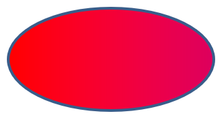

## **Giới thiệu**

Trong PowerPoint, bạn có thể thêm các hình dạng vào các slide. Vì các hình dạng được tạo thành từ các đường, bạn có thể định dạng chúng bằng cách sửa đổi hoặc áp dụng hiệu ứng cho viền của chúng. Ngoài ra, bạn có thể định dạng các hình dạng bằng cách chỉ định các cài đặt kiểm soát cách nội bộ của chúng được tô màu.


Aspose.Slides for Python cung cấp các lớp và thuộc tính cho phép bạn định dạng các hình dạng bằng các tùy chọn giống như trong PowerPoint.

## **Định dạng Đường viền**

Sử dụng Aspose.Slides, bạn có thể chỉ định kiểu đường viền tùy chỉnh cho một hình dạng. Các bước sau mô tả quy trình:

1. Tạo một thể hiện của lớp [Presentation](https://reference.aspose.com/slides/vi/python-net/aspose.slides/presentation/) .
1. Lấy tham chiếu đến một slide theo chỉ mục của nó.
1. Thêm một [AutoShape](https://reference.aspose.com/slides/vi/python-net/aspose.slides/autoshape/) vào slide.
1. Đặt [line style](https://reference.aspose.com/slides/vi/python-net/aspose.slides/linestyle/) cho hình dạng.
1. Đặt độ rộng đường viền.
1. Đặt [dash style](https://reference.aspose.com/slides/vi/python-net/aspose.slides/linedashstyle/) cho hình dạng.
1. Đặt màu đường viền cho hình dạng.
1. Lưu bản trình bày đã chỉnh sửa dưới dạng tệp PPTX.

Mã Python sau đây minh họa cách định dạng một `AutoShape` hình chữ nhật:

```python
import aspose.slides as slides
import aspose.pydrawing as draw

# Tạo một đối tượng của lớp Presentation đại diện cho tệp bản trình bày.
with slides.Presentation() as presentation:

    # Lấy slide đầu tiên.
    slide = presentation.slides[0]

    # Thêm một auto shape loại Rectangle.
    shape = slide.shapes.add_auto_shape(slides.ShapeType.RECTANGLE, 50, 150, 150, 75)

    # Đặt màu nền cho hình dạng hình chữ nhật.
    shape.fill_format.fill_type = slides.FillType.NO_FILL

    # Áp dụng định dạng cho các đường viền của hình chữ nhật.
    shape.line_format.style = slides.LineStyle.THICK_THIN
    shape.line_format.width = 7
    shape.line_format.dash_style = slides.LineDashStyle.DASH

    # Đặt màu cho đường viền của hình chữ nhật.
    shape.line_format.fill_format.fill_type = slides.FillType.SOLID
    shape.line_format.fill_format.solid_fill_color.color = draw.Color.blue

    # Lưu tệp PPTX vào đĩa.
    presentation.save("formatted_lines.pptx", slides.export.SaveFormat.PPTX)
```

Kết quả:


## **Định dạng Kiểu Nối**

Dưới đây là ba tùy chọn kiểu nối:

* Round
* Miter
* Bevel

Mặc định, khi PowerPoint nối hai đường ở một góc (chẳng hạn ở góc của một hình dạng), nó sẽ sử dụng cài đặt **Round**. Tuy nhiên, nếu bạn đang vẽ một hình dạng với các góc sắc, bạn có thể thích tùy chọn **Miter**.


Mã Python sau đây minh họa cách ba hình chữ nhật (như trong hình ảnh trên) được tạo ra bằng cách sử dụng các cài đặt kiểu nối Miter, Bevel và Round:

```python
import aspose.slides as slides
import aspose.pydrawing as draw

# Tạo một đối tượng của lớp Presentation đại diện cho tệp bản trình bày.
with slides.Presentation() as presentation:

	# Lấy slide đầu tiên.
	slide = presentation.slides[0]

	# Thêm ba auto shape loại Rectangle.
	shape1 = slide.shapes.add_auto_shape(slides.ShapeType.RECTANGLE, 20, 20, 150, 75)
	shape2 = slide.shapes.add_auto_shape(slides.ShapeType.RECTANGLE, 210, 20, 150, 75)
	shape3 = slide.shapes.add_auto_shape(slides.ShapeType.RECTANGLE, 20, 135, 150, 75)

	# Đặt màu nền cho mỗi hình chữ nhật.
	shape1.fill_format.fill_type = slides.FillType.SOLID
	shape1.fill_format.solid_fill_color.color = draw.Color.black
	shape2.fill_format.fill_type = slides.FillType.SOLID
	shape2.fill_format.solid_fill_color.color = draw.Color.black
	shape3.fill_format.fill_type = slides.FillType.SOLID
	shape3.fill_format.solid_fill_color.color = draw.Color.black

	# Đặt độ rộng đường viền.
	shape1.line_format.width = 15
	shape2.line_format.width = 15
	shape3.line_format.width = 15

	# Đặt màu cho đường viền của mỗi hình chữ nhật.
	shape1.line_format.fill_format.fill_type = slides.FillType.SOLID
	shape1.line_format.fill_format.solid_fill_color.color = draw.Color.blue
	shape2.line_format.fill_format.fill_type = slides.FillType.SOLID
	shape2.line_format.fill_format.solid_fill_color.color = draw.Color.blue
	shape3.line_format.fill_format.fill_type = slides.FillType.SOLID
	shape3.line_format.fill_format.solid_fill_color.color = draw.Color.blue

	# Đặt kiểu nối.
	shape1.line_format.join_style = slides.LineJoinStyle.MITER
	shape2.line_format.join_style = slides.LineJoinStyle.BEVEL
	shape3.line_format.join_style = slides.LineJoinStyle.ROUND

	# Thêm văn bản vào mỗi hình chữ nhật.
	shape1.text_frame.text = "Miter Join style"
	shape2.text_frame.text = "Bevel Join style"
	shape3.text_frame.text = "Round Join style"

	# Lưu tệp PPTX vào đĩa.
	presentation.save("join_styles.pptx", slides.export.SaveFormat.PPTX)
```

## **Đổ màu Gradient**

Trong PowerPoint, Gradient Fill là một tùy chọn định dạng cho phép bạn áp dụng một sự pha trộn liên tục của các màu vào một hình dạng. Ví dụ, bạn có thể áp dụng hai màu trở lên sao cho một màu dần chuyển sang màu khác.

Dưới đây là cách áp dụng gradient fill cho một hình dạng bằng Aspose.Slides:

1. Tạo một thể hiện của lớp [Presentation](https://reference.aspose.com/slides/vi/python-net/aspose.slides/presentation/) .
1. Lấy tham chiếu đến một slide theo chỉ mục của nó.
1. Thêm một [AutoShape](https://reference.aspose.com/slides/vi/python-net/aspose.slides/autoshape/) vào slide.
1. Đặt [FillType](https://reference.aspose.com/slides/vi/python-net/aspose.slides/filltype/) của hình dạng thành `GRADIENT`.
1. Thêm hai màu bạn muốn cùng với vị trí định sẵn bằng cách sử dụng các phương thức `add` của bộ sưu tập `gradient_stops` được cung cấp bởi lớp [GradientFormat](https://reference.aspose.com/slides/vi/python-net/aspose.slides/gradientformat/) .
1. Lưu bản trình bày đã chỉnh sửa dưới dạng tệp PPTX.

```python
import aspose.slides as slides

# Tạo một đối tượng của lớp Presentation đại diện cho tệp bản trình bày.
with slides.Presentation() as presentation:

    # Lấy slide đầu tiên.
    slide = presentation.slides[0]

    # Thêm một auto shape loại Ellipse.
    shape = slide.shapes.add_auto_shape(slides.ShapeType.ELLIPSE, 50, 50, 150, 75)

    # Áp dụng định dạng gradient cho ellipse.
    shape.fill_format.fill_type = slides.FillType.GRADIENT
    shape.fill_format.gradient_format.gradient_shape = slides.GradientShape.LINEAR

    # Đặt hướng của gradient.
    shape.fill_format.gradient_format.gradient_direction = slides.GradientDirection.FROM_CORNER2

    # Thêm hai gradient stop.
    shape.fill_format.gradient_format.gradient_stops.add(1.0, slides.PresetColor.PURPLE)
    shape.fill_format.gradient_format.gradient_stops.add(0, slides.PresetColor.RED)

    # Lưu tệp PPTX vào đĩa.
    presentation.save("gradient_fill.pptx", slides.export.SaveFormat.PPTX)
```

Kết quả:



## **Đổ mẫu Pattern**

Trong PowerPoint, Pattern Fill là một tùy chọn định dạng cho phép bạn áp dụng một thiết kế hai màu—như chấm, sọc, vạch chéo hoặc ô vuông—cho một hình dạng. Bạn có thể chọn màu tùy chỉnh cho nền trước và nền sau của mẫu.

Aspose.Slides cung cấp hơn 45 kiểu mẫu được định sẵn mà bạn có thể áp dụng cho các hình dạng để nâng cao sức hấp dẫn trực quan của bản trình bày. Ngay cả sau khi chọn một mẫu được định sẵn, bạn vẫn có thể chỉ định các màu chính xác mà nó sẽ sử dụng.

Dưới đây là cách áp dụng pattern fill cho một hình dạng bằng Aspose.Slides:

1. Tạo một thể hiện của lớp [Presentation](https://reference.aspose.com/slides/vi/python-net/aspose.slides/presentation/) .
1. Lấy tham chiếu đến một slide theo chỉ mục của nó.
1. Thêm một [AutoShape](https://reference.aspose.com/slides/vi/python-net/aspose.slides/autoshape/) vào slide.
1. Đặt [FillType](https://reference.aspose.com/slides/vi/python-net/aspose.slides/filltype/) của hình dạng thành `PATTERN`.
1. Chọn một kiểu mẫu từ các tùy chọn được định sẵn.
1. Đặt [back_color](https://reference.aspose.com/slides/vi/python-net/aspose.slides/patternformat/back_color/) của mẫu.
1. Đặt [fore_color](https://reference.aspose.com/slides/vi/python-net/aspose.slides/patternformat/fore_color/) của mẫu.
1. Lưu bản trình bày đã chỉnh sửa dưới dạng tệp PPTX.

```python
import aspose.slides as slides
import aspose.pydrawing as draw

# Tạo một đối tượng của lớp Presentation đại diện cho tệp bản trình bày.
with slides.Presentation() as presentation:

    # Lấy slide đầu tiên.
    slide = presentation.slides[0]

    # Thêm một auto shape loại Rectangle.
    shape = slide.shapes.add_auto_shape(slides.ShapeType.RECTANGLE, 50, 50, 150, 75)

    # Đặt kiểu fill thành Pattern.
    shape.fill_format.fill_type = slides.FillType.PATTERN

    # Đặt kiểu mẫu.
    shape.fill_format.pattern_format.pattern_style = slides.PatternStyle.TRELLIS

    # Đặt màu nền và màu nền trước của mẫu.
    shape.fill_format.pattern_format.back_color.color = draw.Color.light_gray
    shape.fill_format.pattern_format.fore_color.color = draw.Color.yellow

    # Lưu tệp PPTX vào đĩa.
    presentation.save("pattern_fill.pptx", slides.export.SaveFormat.PPTX)
```

Kết quả:


## **Picture Fill**

Trong PowerPoint, Picture Fill là một tùy chọn định dạng cho phép bạn chèn hình ảnh vào trong một hình dạng—thực tế sử dụng hình ảnh làm nền cho hình dạng.

Dưới đây là cách sử dụng Aspose.Slides để áp dụng picture fill cho một hình dạng:

1. Tạo một thể hiện của lớp [Presentation](https://reference.aspose.com/slides/vi/python-net/aspose.slides/presentation/) .
1. Lấy tham chiếu đến một slide theo chỉ mục của nó.
1. Thêm một [AutoShape](https://reference.aspose.com/slides/vi/python-net/aspose.slides/autoshape/) vào slide.
1. Đặt [FillType](https://reference.aspose.com/slides/vi/python-net/aspose.slides/filltype/) của hình dạng thành `PICTURE`.
1. Đặt chế độ picture fill thành `TILE` (hoặc chế độ khác bạn muốn).
1. Tạo một đối tượng [PPImage](https://reference.aspose.com/slides/vi/python-net/aspose.slides/ppimage/) từ hình ảnh bạn muốn sử dụng.
1. Gán hình ảnh này vào thuộc tính `picture.image` của `picture_fill_format` của hình dạng.
1. Lưu bản trình bày đã chỉnh sửa dưới dạng tệp PPTX.

Giả sử chúng ta có tệp "lotus.png" với hình ảnh sau:


```python
import aspose.slides as slides

# Tạo một đối tượng của lớp Presentation đại diện cho tệp bản trình bày.
with slides.Presentation() as presentation:

    # Lấy slide đầu tiên.
    slide = presentation.slides[0]

    # Thêm một auto shape loại Rectangle.
    shape = slide.shapes.add_auto_shape(slides.ShapeType.RECTANGLE, 50, 50, 192, 95)

    # Đặt kiểu fill thành Picture.
    shape.fill_format.fill_type = slides.FillType.PICTURE

    # Đặt chế độ picture fill.
    shape.fill_format.picture_fill_format.picture_fill_mode = slides.PictureFillMode.TILE

    # Tải một hình ảnh và thêm nó vào các tài nguyên của bản trình bày.
    with slides.Images.from_file("lotus.png") as image:
        presentation_image = presentation.images.add_image(image)

    # Đặt hình ảnh.
    shape.fill_format.picture_fill_format.picture.image = presentation_image

    # Lưu tệp PPTX vào đĩa.
    presentation.save("picture_fill.pptx", slides.export.SaveFormat.PPTX)
```

Kết quả:


### **Đặt ảnh dạng khảm làm Texture**

Nếu bạn muốn đặt một ảnh dạng khảm làm texture và tùy chỉnh hành vi khảm, bạn có thể sử dụng các thuộc tính sau của lớp [PictureFillFormat](https://reference.aspose.com/slides/vi/python-net/aspose.slides/picturefillformat/) :

- [picture_fill_mode](https://reference.aspose.com/slides/vi/python-net/aspose.slides/picturefillformat/picture_fill_mode/): Đặt chế độ picture fill — `TILE` hoặc `STRETCH`.
- [tile_alignment](https://reference.aspose.com/slides/vi/python-net/aspose.slides/picturefillformat/tile_alignment/): Xác định vị trí căn chỉnh của các khảm trong hình dạng.
- [tile_flip](https://reference.aspose.com/slides/vi/python-net/aspose.slides/picturefillformat/tile_flip/): Kiểm soát việc lật khảm theo chiều ngang, chiều dọc hoặc cả hai.
- [tile_offset_x](https://reference.aspose.com/slides/vi/python-net/aspose.slides/picturefillformat/tile_offset_x/): Đặt độ lệch ngang của khảm (theo điểm) so với gốc của hình dạng.
- [tile_offset_y](https://reference.aspose.com/slides/vi/python-net/aspose.slides/picturefillformat/tile_offset_y/): Đặt độ lệch dọc của khảm (theo điểm) so với gốc của hình dạng.
- [tile_scale_x](https://reference.aspose.com/slides/vi/python-net/aspose.slides/picturefillformat/tile_scale_x/): Xác định tỉ lệ ngang của khảm theo phần trăm.
- [tile_scale_y](https://reference.aspose.com/slides/vi/python-net/aspose.slides/picturefillformat/tile_scale_y/): Xác định tỉ lệ dọc của khảm theo phần trăm.

Mẫu mã sau đây cho thấy cách thêm một hình chữ nhật với picture fill dạng khảm và cấu hình các tùy chọn khảm:

```py
import aspose.slides as slides

# Tạo một đối tượng của lớp Presentation đại diện cho tệp bản trình bày.
with slides.Presentation() as presentation:

    # Lấy slide đầu tiên.
    first_slide = presentation.slides[0]

    # Thêm một auto shape dạng hình chữ nhật.
    shape = first_slide.shapes.add_auto_shape(slides.ShapeType.RECTANGLE, 50, 50, 190, 95)

    # Đặt kiểu fill của hình dạng thành Picture.
    shape.fill_format.fill_type = slides.FillType.PICTURE

    # Tải hình ảnh và thêm nó vào các tài nguyên của bản trình bày.
    with slides.Images.from_file("lotus.png") as source_image:
        presentation_image = presentation.images.add_image(source_image)

    # Gán hình ảnh cho hình dạng.
    picture_fill_format = shape.fill_format.picture_fill_format
    picture_fill_format.picture.image = presentation_image

    # Cấu hình chế độ picture fill và các thuộc tính khảm.
    picture_fill_format.picture_fill_mode = slides.PictureFillMode.TILE
    picture_fill_format.tile_offset_x = -32
    picture_fill_format.tile_offset_y = -32
    picture_fill_format.tile_scale_x = 50
    picture_fill_format.tile_scale_y = 50
    picture_fill_format.tile_alignment = slides.RectangleAlignment.BOTTOM_RIGHT
    picture_fill_format.tile_flip = slides.TileFlip.FLIP_BOTH

    # Lưu tệp PPTX vào đĩa.
    presentation.save("tile.pptx", slides.export.SaveFormat.PPTX)
```

Kết quả:


## **Đổ màu Đơn sắc**

Trong PowerPoint, Solid Color Fill là một tùy chọn định dạng làm đầy một hình dạng bằng một màu duy nhất, đồng nhất. Màu nền đơn giản này được áp dụng mà không có gradient, texture hay mẫu.

Để áp dụng solid color fill cho một hình dạng bằng Aspose.Slides, thực hiện các bước sau:

1. Tạo một thể hiện của lớp [Presentation](https://reference.aspose.com/slides/vi/python-net/aspose.slides/presentation/) .
1. Lấy tham chiếu đến một slide theo chỉ mục của nó.
1. Thêm một [AutoShape](https://reference.aspose.com/slides/vi/python-net/aspose.slides/autoshape/) vào slide.
1. Đặt [FillType](https://reference.aspose.com/slides/vi/python-net/aspose.slides/filltype/) của hình dạng thành `SOLID`.
1. Gán màu fill bạn muốn cho hình dạng.
1. Lưu bản trình bày đã chỉnh sửa dưới dạng tệp PPTX.

```python
import aspose.slides as slides
import aspose.pydrawing as draw

# Tạo một đối tượng của lớp Presentation đại diện cho tệp bản trình bày.
with slides.Presentation() as presentation:

    # Lấy slide đầu tiên.
    slide = presentation.slides[0]

    # Thêm một auto shape loại Rectangle.
    shape = slide.shapes.add_auto_shape(slides.ShapeType.RECTANGLE, 50, 50, 150, 75)

    # Đặt kiểu fill thành Solid.
    shape.fill_format.fill_type = slides.FillType.SOLID

    # Đặt màu fill.
    shape.fill_format.solid_fill_color.color = draw.Color.yellow

    # Lưu tệp PPTX vào đĩa.
    presentation.save("solid_color_fill.pptx", slides.export.SaveFormat.PPTX)
```

Kết quả:


## **Đặt Độ trong suốt**

Trong PowerPoint, khi bạn áp dụng solid color, gradient, picture hoặc texture fill cho các hình dạng, bạn cũng có thể đặt mức độ trong suốt để kiểm soát độ mờ của fill. Giá trị trong suốt cao hơn sẽ làm cho hình dạng trở nên trong suốt hơn, cho phép nền hoặc các đối tượng phía dưới hiển thị một phần.

Aspose.Slides cho phép bạn đặt mức độ trong suốt bằng cách điều chỉnh giá trị alpha trong màu được dùng cho fill. Dưới đây là cách thực hiện:

1. Tạo một thể hiện của lớp [Presentation](https://reference.aspose.com/slides/vi/python-net/aspose.slides/presentation/) .
1. Lấy tham chiếu đến một slide theo chỉ mục của nó.
1. Thêm một [AutoShape](https://reference.aspose.com/slides/vi/python-net/aspose.slides/autoshape/) vào slide.
1. Đặt loại fill thành `SOLID`.
1. Sử dụng `Color.from_argb` để định nghĩa một màu có độ trong suốt (thành phần `alpha` kiểm soát độ trong suốt).
1. Lưu bản trình bày.

```python
import aspose.pydrawing as draw
import aspose.slides as slides

# Khởi tạo lớp Presentation đại diện cho tệp bản trình bày.
with slides.Presentation() as presentation:

    # Lấy slide đầu tiên.
    slide = presentation.slides[0]
    
    # Thêm một auto shape hình chữ nhật đặc.
    slide.shapes.add_auto_shape(slides.ShapeType.RECTANGLE, 50, 50, 150, 75)

    # Thêm một auto shape hình chữ nhật trong suốt lên trên hình dạng đặc.
    shape = slide.shapes.add_auto_shape(slides.ShapeType.RECTANGLE, 80, 80, 150, 75)
    shape.fill_format.fill_type = slides.FillType.SOLID
    shape.fill_format.solid_fill_color.color = draw.Color.from_argb(128, 204, 102, 0)
    
    presentation.save("shape_transparency.pptx", slides.export.SaveFormat.PPTX)
```

Kết quả:


## **Xoay Hình dạng**

Aspose.Slides cho phép bạn xoay các hình dạng trong bản trình bày PowerPoint. Điều này hữu ích khi đặt vị trí các yếu tố hình ảnh với yêu cầu căn chỉnh hoặc thiết kế cụ thể.

Để xoay một hình dạng trên slide, thực hiện các bước sau:

1. Tạo một thể hiện của lớp [Presentation](https://reference.aspose.com/slides/vi/python-net/aspose.slides/presentation/) .
1. Lấy tham chiếu đến một slide theo chỉ mục của nó.
1. Thêm một [AutoShape](https://reference.aspose.com/slides/vi/python-net/aspose.slides/autoshape/) vào slide.
1. Đặt thuộc tính `rotation` của hình dạng thành góc mong muốn.
1. Lưu bản trình bày.

```python
import aspose.slides as slides

# Tạo một đối tượng của lớp Presentation đại diện cho tệp bản trình bày.
with slides.Presentation() as presentation:

    # Lấy slide đầu tiên.
    slide = presentation.slides[0]

    # Thêm một auto shape loại Rectangle.
    shape = slide.shapes.add_auto_shape(slides.ShapeType.RECTANGLE, 50, 50, 150, 75)

    # Xoay hình dạng 5 độ.
    shape.rotation = 5

    # Lưu tệp PPTX vào đĩa.
    presentation.save("shape_rotation.pptx", slides.export.SaveFormat.PPTX)
```

Kết quả:


## **Thêm Hiệu ứng Đề lạt 3D**

Aspose.Slides cho phép bạn áp dụng hiệu ứng bevel 3D cho các hình dạng bằng cách cấu hình các thuộc tính [ThreeDFormat](https://reference.aspose.com/slides/vi/python-net/aspose.slides/threedformat/) .

Để thêm hiệu ứng bevel 3D cho một hình dạng, thực hiện các bước sau:

1. Khởi tạo lớp [Presentation](https://reference.aspose.com/slides/vi/python-net/aspose.slides/presentation/) .
1. Lấy tham chiếu đến một slide theo chỉ mục của nó.
1. Thêm một [AutoShape](https://reference.aspose.com/slides/vi/python-net/aspose.slides/autoshape/) vào slide.
1. Cấu hình [ThreeDFormat] của hình dạng để xác định các cài đặt bevel.
1. Lưu bản trình bày.

```python
import aspose.slides as slides
import aspose.pydrawing as draw

# Tạo một thể hiện của lớp Presentation.
with slides.Presentation() as presentation:

    slide = presentation.slides[0]

    # Thêm một hình dạng vào slide.
    shape = slide.shapes.add_auto_shape(slides.ShapeType.ELLIPSE, 50, 50, 100, 100)
    shape.fill_format.fill_type = slides.FillType.SOLID
    shape.fill_format.solid_fill_color.color = draw.Color.green
    shape.line_format.fill_format.fill_type = slides.FillType.SOLID
    shape.line_format.fill_format.solid_fill_color.color = draw.Color.orange
    shape.line_format.width = 2.0

    # Đặt các thuộc tính ThreeDFormat cho hình dạng.
    shape.three_d_format.depth = 4
    shape.three_d_format.bevel_top.bevel_type = slides.BevelPresetType.CIRCLE
    shape.three_d_format.bevel_top.height = 6
    shape.three_d_format.bevel_top.width = 6
    shape.three_d_format.camera.camera_type = slides.CameraPresetType.ORTHOGRAPHIC_FRONT
    shape.three_d_format.light_rig.light_type = slides.LightRigPresetType.THREE_PT
    shape.three_d_format.light_rig.direction = slides.LightingDirection.TOP

    # Lưu bản trình bày dưới dạng tệp PPTX.
    presentation.save("3D_bevel_effect.pptx", slides.export.SaveFormat.PPTX)
```

Kết quả:


## **Thêm Hiệu ứng Xoay 3D**

Aspose.Slides cho phép bạn áp dụng hiệu ứng xoay 3D cho các hình dạng bằng cách cấu hình [ThreeDFormat] của chúng.

Để áp dụng xoay 3D cho một hình dạng:

1. Tạo một thể hiện của lớp [Presentation](https://reference.aspose.com/slides/vi/python-net/aspose.slides/presentation/) .
1. Lấy tham chiếu đến một slide theo chỉ mục của nó.
1. Thêm một [AutoShape](https://reference.aspose.com/slides/vi/python-net/aspose.slides/autoshape/) vào slide.
1. Đặt [camera_type](https://reference.aspose.com/slides/vi/python-net/aspose.slides/camera/camera_type/) và [light_type](https://reference.aspose.com/slides/vi/python-net/aspose.slides/lightrig/light_type/) của hình dạng để xác định xoay 3D.
1. Lưu bản trình bày.

```python
import aspose.slides as slides

# Tạo một thể hiện của lớp Presentation.
with slides.Presentation() as presentation:

    slide = presentation.slides[0]

    auto_shape = slide.shapes.add_auto_shape(slides.ShapeType.RECTANGLE, 50, 50, 150, 75)
    auto_shape.text_frame.text = "Hello, Aspose!"

    auto_shape.three_d_format.depth = 6
    auto_shape.three_d_format.camera.set_rotation(40, 35, 20)
    auto_shape.three_d_format.camera.camera_type = slides.CameraPresetType.ISOMETRIC_LEFT_UP
    auto_shape.three_d_format.light_rig.light_type = slides.LightRigPresetType.BALANCED

    # Lưu bản trình bày dưới dạng tệp PPTX.      
    presentation.save("3D_rotation_effect.pptx", slides.export.SaveFormat.PPTX)
```

Kết quả:


## **Đặt lại Định dạng**

Mã Python sau đây cho thấy cách đặt lại định dạng của một slide và khôi phục vị trí, kích thước và định dạng của tất cả các hình dạng có placeholder trên [LayoutSlide](https://reference.aspose.com/slides/vi/python-net/aspose.slides/layoutslide/) về các cài đặt mặc định:

```python
import aspose.slides as slides

with slides.Presentation("sample.pptx") as presentation:

    for slide in presentation.slides:
        # Đặt lại mỗi hình dạng trên slide có placeholder trên bố cục.
        slide.reset()

    presentation.save("reset_formatting.pptx", slides.export.SaveFormat.PPTX)
```

## **Câu hỏi thường gặp**

**Việc định dạng hình dạng có ảnh hưởng đến kích thước cuối cùng của tệp bản trình bày không?**

Chỉ một mức độ tối thiểu. Các hình ảnh và phương tiện được nhúng chiếm phần lớn không gian tệp, trong khi các tham số hình dạng như màu sắc, hiệu ứng và gradient được lưu dưới dạng metadata và hầu như không thêm bất kỳ kích thước nào.

**Làm thế nào tôi có thể phát hiện các hình dạng trên một slide có cùng định dạng để tôi có thể nhóm chúng?**

So sánh các thuộc tính định dạng chính của mỗi hình dạng — cài đặt fill, line và effect. Nếu tất cả các giá trị tương ứng khớp nhau, coi chúng có cùng kiểu và nhóm logic các hình dạng đó, điều này giúp đơn giản hoá việc quản lý kiểu sau này.

**Tôi có thể lưu một bộ các kiểu hình dạng tùy chỉnh vào một tệp riêng để tái sử dụng trong các bản trình bày khác không?**

Có. Lưu các hình mẫu với các kiểu mong muốn trong một bộ slide mẫu hoặc tệp .POTX. Khi tạo một bản trình bày mới, mở mẫu, sao chép các hình dạng đã định dạng cần thiết và áp dụng lại định dạng của chúng ở bất kỳ nơi nào cần thiết.