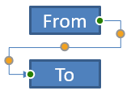

## **Giới thiệu**

Kết nối PowerPoint là một đường chuyên dụng nối hai hình và vẫn giữ nguyên khi các hình được di chuyển hoặc thay đổi vị trí trên slide. Các kết nối gắn vào **điểm kết nối** (điểm màu xanh lục) trên các hình. Điểm kết nối xuất hiện khi con trỏ tiến gần tới chúng. **Nút điều chỉnh** (điểm màu vàng), có sẵn trên một số kết nối, cho bạn chỉnh sửa vị trí và hình dạng của kết nối.

## **Các loại kết nối**

Trong PowerPoint, bạn có thể sử dụng ba loại kết nối: thẳng, khuỷu (có góc), và cong.

Aspose.Slides hỗ trợ các loại kết nối sau:

| Loại kết nối | Hình ảnh | Số điểm điều chỉnh |
| ------------ | -------- | ------------------- |
| `ShapeType.LINE` |  | 0 |
| `ShapeType.STRAIGHT_CONNECTOR1` |  | 0 |
| `ShapeType.BENT_CONNECTOR2` |  | 0 |
| `ShapeType.BENT_CONNECTOR3` |  | 1 |
| `ShapeType.BENT_CONNECTOR4` |  | 2 |
| `ShapeType.BENT_CONNECTOR5` |  | 3 |
| `ShapeType.CURVED_CONNECTOR2` |  | 0 |
| `ShapeType.CURVED_CONNECTOR3` |  | 1 |
| `ShapeType.CURVED_CONNECTOR4` |  | 2 |
| `ShapeType.CURVED_CONNECTOR5` |  | 3 |

## **Kết nối các hình bằng các kết nối**

Phần này trình bày cách nối các hình bằng các kết nối trong Aspose.Slides. Bạn sẽ thêm một kết nối vào slide, gắn đầu và cuối của nó vào các hình mục tiêu. Sử dụng các vị trí kết nối đảm bảo kết nối luôn “dính” vào các hình ngay cả khi chúng di chuyển hoặc thay đổi kích thước.

1. Tạo một thể hiện của lớp [Presentation](https://reference.aspose.com/slides/vi/python-net/aspose.slides/presentation/).
1. Lấy tham chiếu đến slide bằng chỉ mục của nó.
1. Thêm hai đối tượng [AutoShape](https://reference.aspose.com/slides/vi/python-net/aspose.slides/autoshape/) vào slide bằng phương thức `add_auto_shape` được cung cấp bởi đối tượng [ShapeCollection](https://reference.aspose.com/slides/vi/python-net/aspose.slides/shapecollection/).
1. Thêm một kết nối bằng phương thức `add_connector` được cung cấp bởi đối tượng [ShapeCollection](https://reference.aspose.com/slides/vi/python-net/aspose.slides/shapecollection/) và chỉ định loại kết nối.
1. Kết nối các hình bằng kết nối.
1. Gọi phương thức `reroute` để áp dụng đường kết nối ngắn nhất.
1. Lưu bản trình chiếu.

Mã Python dưới đây cho thấy cách thêm một kết nối cong giữa hai hình (một hình ellipse và một hình chữ nhật):

```python
import aspose.slides as slides

# Tạo một thể hiện của lớp Presentation để tạo tệp PPTX.
with slides.Presentation() as presentation:

    # Truy cập bộ sưu tập các hình trên slide đầu tiên.
    shapes = presentation.slides[0].shapes

    # Thêm một AutoShape dạng ellipse.
    ellipse = shapes.add_auto_shape(slides.ShapeType.ELLIPSE, 50, 50, 100, 100)

    # Thêm một AutoShape dạng rectangle.
    rectangle = shapes.add_auto_shape(slides.ShapeType.RECTANGLE, 150, 200, 100, 100)

    # Thêm một connector vào slide.
    connector = shapes.add_connector(slides.ShapeType.BENT_CONNECTOR2, 0, 0, 10, 10)

    # Kết nối các hình bằng connector.
    connector.start_shape_connected_to = ellipse
    connector.end_shape_connected_to = rectangle

    # Gọi reroute để đặt đường ngắn nhất.
    connector.reroute()

    # Lưu bản trình chiếu.
    presentation.save("connected_shapes.pptx", slides.export.SaveFormat.PPTX)
```

{}
Phương thức `connector.reroute` sẽ định tuyến lại một kết nối, buộc nó lấy đường ngắn nhất có thể giữa các hình. Để làm vậy, phương thức có thể thay đổi các giá trị `start_shape_connection_site_index` và `end_shape_connection_site_index`.
{}

## **Xác định các điểm kết nối**

Phần này giải thích cách gắn một kết nối vào một điểm kết nối cụ thể trên một hình trong Aspose.Slides. Bằng cách nhắm vào các vị trí kết nối chính xác, bạn có thể kiểm soát việc định tuyến và bố cục của kết nối, tạo ra các sơ đồ sạch sẽ và dự đoán được trong các bản trình chiếu.

1. Tạo một thể hiện của lớp [Presentation](https://reference.aspose.com/slides/vi/python-net/aspose.slides/presentation/).
1. Lấy tham chiếu đến slide bằng chỉ mục của nó.
1. Thêm hai đối tượng [AutoShape](https://reference.aspose.com/slides/vi/python-net/aspose.slides/autoshape/) vào slide bằng phương thức `add_auto_shape` được cung cấp bởi đối tượng [ShapeCollection](https://reference.aspose.com/slides/vi/python-net/aspose.slides/shapecollection/).
1. Thêm một kết nối bằng phương thức `add_connector` trên đối tượng [ShapeCollection](https://reference.aspose.com/slides/vi/python-net/aspose.slides/shapecollection/) và chỉ định loại kết nối.
1. Kết nối các hình bằng kết nối.
1. Đặt các điểm kết nối ưa thích của bạn trên các hình.
1. Lưu bản trình chiếu.

Mã Python dưới đây minh họa cách chỉ định một điểm kết nối ưa thích:

```python
import aspose.slides as slides

# Tạo một thể hiện của lớp Presentation để tạo tệp PPTX.
with slides.Presentation() as presentation:

    # Truy cập bộ sưu tập các hình trên slide đầu tiên.
    shapes = presentation.slides[0].shapes

    # Thêm một AutoShape dạng ellipse.
    ellipse = shapes.add_auto_shape(slides.ShapeType.ELLIPSE, 50, 50, 100, 100)

    # Thêm một AutoShape dạng rectangle.
    rectangle = shapes.add_auto_shape(slides.ShapeType.RECTANGLE, 150, 200, 100, 100)

    # Thêm một connector vào bộ sưu tập hình của slide.
    connector = shapes.add_connector(slides.ShapeType.BENT_CONNECTOR3, 0, 0, 10, 10)

    # Kết nối các hình bằng connector.
    connector.start_shape_connected_to = ellipse
    connector.end_shape_connected_to = rectangle

    # Đặt chỉ mục vị trí kết nối ưa thích trên ellipse.
    site_index = 6

    # Kiểm tra xem chỉ mục ưa thích có nằm trong số lượng vị trí có sẵn hay không.
    if  ellipse.connection_site_count > site_index:
        # Gán vị trí kết nối ưa thích trên AutoShape ellipse.
        connector.start_shape_connection_site_index = site_index

    # Lưu bản trình chiếu.
    presentation.save("connection_points.pptx", slides.export.SaveFormat.PPTX)
```

## **Điều chỉnh các điểm kết nối**

Bạn có thể chỉnh sửa các kết nối bằng các điểm điều chỉnh của chúng. Chỉ những kết nối có điểm điều chỉnh mới có thể được chỉnh sửa theo cách này. Để biết chi tiết các kết nối hỗ trợ điều chỉnh, xem bảng trong mục [Connector Types](/slides/vi/python-net/connector/#connector-types).

### **Trường hợp đơn giản**

Xem xét một trường hợp mà một kết nối giữa hai hình (A và B) cắt qua một hình thứ ba (C):


```python
import aspose.slides as slides
import aspose.pydrawing as draw

with slides.Presentation() as presentation:
    slide = presentation.slides[0]

    shape = slide.shapes.add_auto_shape(slides.ShapeType.RECTANGLE, 300, 150, 150, 75)
    shape_from = slide.shapes.add_auto_shape(slides.ShapeType.RECTANGLE, 500, 400, 100, 50)
    shape_to = slide.shapes.add_auto_shape(slides.ShapeType.RECTANGLE, 100, 100, 70, 30)
    
    connector = slide.shapes.add_connector(slides.ShapeType.BENT_CONNECTOR5, 20, 20, 400, 300)
    
    connector.line_format.end_arrowhead_style = slides.LineArrowheadStyle.TRIANGLE
    connector.line_format.fill_format.fill_type = slides.FillType.SOLID
    connector.line_format.fill_format.solid_fill_color.color = draw.Color.black
    
    connector.start_shape_connected_to = shape_from
    connector.end_shape_connected_to = shape_to
    connector.start_shape_connection_site_index = 2
```

Để tránh hình thứ ba, điều chỉnh kết nối bằng cách di chuyển đoạn thẳng đứng của nó sang trái:


```python
    adjustment2 = connector.adjustments[1]
    adjustment2.raw_value += 10000
```

### **Trường hợp phức tạp**

Đối với các điều chỉnh nâng cao hơn, hãy xem các nội dung sau:

- Một điểm điều chỉnh của kết nối được điều khiển bởi một công thức xác định vị trí của nó. Thay đổi điểm này có thể làm thay đổi hình dạng tổng thể của kết nối.
- Các điểm điều chỉnh của một kết nối được lưu trong một mảng có thứ tự nghiêm ngặt, đánh số từ đầu đến cuối của kết nối.
- Giá trị của các điểm điều chỉnh đại diện cho phần trăm chiều rộng/chiều cao của hình dạng kết nối.
  - Hình được giới hạn bởi các điểm đầu và cuối của kết nối và được tỷ lệ hóa bởi 1000.
  - Điểm điều chỉnh thứ nhất, thứ hai và thứ ba tương ứng đại diện: phần trăm chiều rộng, phần trăm chiều cao và lại phần trăm chiều rộng.
- Khi tính toán tọa độ của các điểm điều chỉnh, cần tính đến việc quay và phản chiếu của kết nối. **Lưu ý:** Đối với tất cả các kết nối được liệt kê trong mục [Connector Types](/slides/vi/python-net/connector/#connector-types), góc quay là 0.

#### **Trường hợp 1**

Xem xét một trường hợp mà hai đối tượng khung văn bản được liên kết bằng một kết nối:


```python
import aspose.slides as slides
import aspose.pydrawing as draw

# Tạo một thể hiện của lớp Presentation để tạo tệp PPTX.
with slides.Presentation() as presentation:

    # Lấy slide đầu tiên.
    slide = presentation.slides[0]

    # Lấy slide đầu tiên.
    shape_from = slide.shapes.add_auto_shape(slides.ShapeType.RECTANGLE, 100, 100, 60, 25)
    shape_from.text_frame.text = "From"
    shape_to = slide.shapes.add_auto_shape(slides.ShapeType.RECTANGLE, 500, 100, 60, 25)
    shape_to.text_frame.text = "To"

    # Thêm một connector.
    connector = slide.shapes.add_connector(slides.ShapeType.BENT_CONNECTOR4, 20, 20, 400, 300)
    # Đặt hướng của connector.
    connector.line_format.end_arrowhead_style = slides.LineArrowheadStyle.TRIANGLE
    # Đặt màu của connector.
    connector.line_format.fill_format.fill_type = slides.FillType.SOLID
    connector.line_format.fill_format.solid_fill_color.color = draw.Color.crimson
    # Đặt độ dày đường của connector.
    connector.line_format.width = 3

    # Liên kết các hình bằng connector.
    connector.start_shape_connected_to = shape_from
    connector.start_shape_connection_site_index = 3
    connector.end_shape_connected_to = shape_to
    connector.end_shape_connection_site_index = 2

    # Lấy các điểm điều chỉnh của connector.
    adjustment_0 = connector.adjustments[0]
    adjustment_1 = connector.adjustments[1]
```

**Điều chỉnh**

Thay đổi giá trị điểm điều chỉnh của kết nối bằng cách tăng phần trăm chiều rộng lên 20% và phần trăm chiều cao lên 200%, tương ứng:

```python
    # Thay đổi giá trị của các điểm điều chỉnh.
    adjustment_0.raw_value += 20000
    adjustment_1.raw_value += 200000
```

Kết quả:


Để định nghĩa một mô hình cho phép chúng ta xác định tọa độ và hình dạng của các đoạn của kết nối, tạo một hình tương ứng với thành phần dọc của kết nối tại `connector.adjustments[0]`:

```python
    # Vẽ thành phần dọc của connector.
    x = connector.x + connector.width * adjustment_0.raw_value / 100000
    y = connector.y
    height = connector.height * adjustment_1.raw_value / 100000

    slide.shapes.add_auto_shape(slides.ShapeType.RECTANGLE, x, y, 0, height)
```

Kết quả:


#### **Trường hợp 2**

Trong **Trường hợp 1**, chúng tôi đã minh họa một điều chỉnh kết nối đơn giản bằng các nguyên tắc cơ bản. Trong các tình huống thường gặp, bạn phải tính đến việc quay của kết nối và các cài đặt hiển thị của nó (được điều khiển bởi `connector.rotation`, `connector.frame.flip_h` và `connector.frame.flip_v`). Dưới đây là cách quy trình hoạt động.

Đầu tiên, thêm một đối tượng khung văn bản mới (**To 1**) vào slide (để kết nối), và tạo một kết nối màu xanh lá mới liên kết nó với các đối tượng hiện có.

```python
    # Tạo một đối tượng đích mới.
    shape_to_1 = sld.shapes.add_auto_shape(slides.ShapeType.RECTANGLE, 100, 400, 60, 25)
    shape_to_1.text_frame.text = "To 1"

    # Tạo một connector mới.
    connector = sld.shapes.add_connector(slides.ShapeType.BENT_CONNECTOR4, 20, 20, 400, 300)
    connector.line_format.end_arrowhead_style = slides.LineArrowheadStyle.TRIANGLE
    connector.line_format.fill_format.fill_type = slides.FillType.SOLID
    connector.line_format.fill_format.solid_fill_color.color = draw.Color.medium_aquamarine
    connector.line_format.width = 3

    # Kết nối các đối tượng bằng connector mới tạo.
    connector.start_shape_connected_to = shapeFrom
    connector.start_shape_connection_site_index = 2
    connector.end_shape_connected_to = shape_to_1
    connector.end_shape_connection_site_index = 3

    # Lấy các điểm điều chỉnh của connector.
    adjustment_0 = connector.adjustments[0]
    adjustment_1 = connector.adjustments[1]
    
    # Thay đổi giá trị của các điểm điều chỉnh.
    adjustment_0.raw_value += 20000
    adjustment_1.raw_value += 200000
```

Kết quả:


Thứ hai, tạo một hình tương ứng với đoạn **ngang** của kết nối đi qua điểm điều chỉnh mới của kết nối, `connector.adjustments[0]`. Sử dụng các giá trị từ `connector.rotation`, `connector.frame.flip_h` và `connector.frame.flip_v`, và áp dụng công thức chuyển đổi tọa độ tiêu chuẩn cho việc quay quanh một điểm đã cho `x0`:

X = (x — x0) * cos(alpha) — (y — y0) * sin(alpha) + x0;
Y = (x — x0) * sin(alpha) + (y — y0) * cos(alpha) + y0;

Trong trường hợp của chúng tôi, góc quay của đối tượng là 90 độ và kết nối được hiển thị theo chiều dọc, vì vậy đoạn mã tương ứng là:

```python
    # Lưu tọa độ của connector.
    x = connector.x
    y = connector.y
    
    # Sửa tọa độ của connector nếu nó bị lật.
    if connector.frame.flip_h == 1:
        x += connector.width
    if connector.frame.flip_v == 1:
        y += connector.height

    # Sử dụng giá trị điểm điều chỉnh làm tọa độ.
    x += connector.width * adjValue_0.raw_value / 100000
    
    # Chuyển đổi tọa độ vì sin(90°) = 1 và cos(90°) = 0.
    xx = connector.frame.center_x - y + connector.frame.center_y
    yy = x - connector.frame.center_x + connector.frame.center_y

    # Xác định độ rộng của đoạn ngang bằng giá trị điểm điều chỉnh thứ hai.
    width = connector.height * adjValue_1.raw_value / 100000
    shape = sld.shapes.add_auto_shape(slides.ShapeType.RECTANGLE, xx, yy, width, 0)
    shape.line_format.fill_format.fill_type = slides.FillType.SOLID
    shape.line_format.fill_format.solid_fill_color.color = draw.Color.red
```

Kết quả:


Chúng tôi đã trình bày các phép tính liên quan đến việc điều chỉnh đơn giản và các điểm điều chỉnh phức tạp hơn (những điểm tính đến việc quay). Sử dụng kiến thức này, bạn có thể phát triển mô hình của riêng mình—hoặc viết mã—để lấy đối tượng `GraphicsPath` hoặc thậm chí đặt giá trị điểm điều chỉnh của kết nối dựa trên các tọa độ slide cụ thể.

## **Tìm góc của đường kết nối**

Sử dụng ví dụ dưới đây để xác định góc của các đường kết nối trên một slide bằng Aspose.Slides. Bạn sẽ học cách đọc các điểm đầu cuối của kết nối và tính toán hướng của nó để có thể căn chỉnh chính xác các mũi tên, nhãn và các hình khác.

1. Tạo một thể hiện của lớp [Presentation](https://reference.aspose.com/slides/vi/python-net/aspose.slides/presentation/).
1. Lấy tham chiếu đến slide bằng chỉ mục.
1. Truy cập hình dạng đường kết nối.
1. Sử dụng chiều rộng và chiều cao của đường, và chiều rộng và chiều cao của khung hình dạng, để tính góc.

```python
import aspose.slides as slides
import math

def get_direction(w, h, flip_h, flip_v):
    end_line_x = w * (-1 if flip_h else 1)
    end_line_y = h * (-1 if flip_v else 1)
    end_y_axis_x = 0
    end_y_axis_y = h
    angle = math.atan2(end_y_axis_y, end_y_axis_x) - math.atan2(end_line_y, end_line_x)
    if (angle < 0):
         angle += 2 * math.pi
    return angle * 180.0 / math.pi

with slides.Presentation("connector_line_angle.pptx") as presentation:
    slide = presentation.slides[0]
    for shape_index in range(len(slide.shapes)):
        direction = 0.0
        shape = slide.shapes[shape_index]
        if type(shape) is slides.AutoShape and shape.shape_type == slides.ShapeType.LINE:
            direction = get_direction(shape.width, shape.height, shape.frame.flip_h, shape.frame.flip_v)
        elif type(shape) is slides.Connector:
            direction = get_direction(shape.width, shape.height, shape.frame.flip_h, shape.frame.flip_v)
        print(direction)
```

## **Câu hỏi thường gặp**

**Làm sao để tôi biết một kết nối có thể “dính” vào một hình cụ thể không?**

Kiểm tra xem hình có cung cấp [các vị trí kết nối](https://reference.aspose.com/slides/vi/python-net/aspose.slides/shape/connection_site_count/) hay không. Nếu không có hoặc số lượng bằng không, việc dính không khả dụng; trong trường hợp đó, sử dụng các đầu nối tự do và định vị chúng một cách thủ công. Nên kiểm tra số lượng vị trí trước khi gắn.

**Điều gì xảy ra với một kết nối nếu tôi xóa một trong các hình đã kết nối?**

Các đầu của nó sẽ bị tách ra; kết nối vẫn còn trên slide như một đường thường với đầu/bết tự do. Bạn có thể xóa nó hoặc gán lại các kết nối và, nếu cần, [reroute](https://reference.aspose.com/slides/vi/python-net/aspose.slides/connector/reroute/).

**Liên kết của kết nối có được giữ lại khi sao chép một slide sang bản trình chiếu khác không?**

Thông thường có, với điều kiện các hình mục tiêu cũng được sao chép. Nếu slide được chèn vào một tệp khác mà không có các hình đã kết nối, các đầu sẽ trở thành tự do và bạn sẽ cần gắn lại chúng.